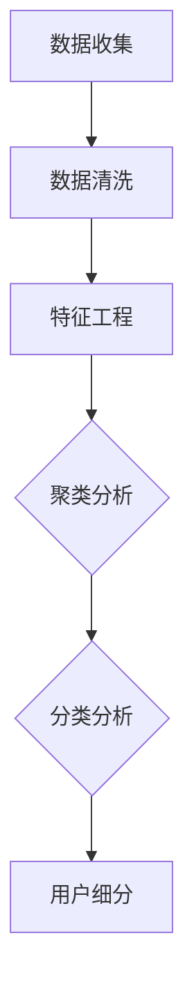

                 

用户画像分析是现代数据驱动业务的核心环节，它能够帮助企业更好地理解用户需求、优化产品和服务、提升营销效果。本文将深入探讨如何进行有效的用户画像分析，从核心概念、算法原理、数学模型、项目实践以及未来展望等多个维度，为读者提供一份详尽的技术指南。

## 关键词

- 用户画像
- 数据分析
- 客户细分
- 机器学习
- 营销策略
- 数据挖掘

## 摘要

本文旨在探讨如何通过用户画像分析帮助企业实现精准营销。首先，我们将介绍用户画像的核心概念及其在商业应用中的重要性。接着，我们将深入分析用户画像分析的算法原理、数学模型，并通过实际项目实践展示如何进行用户画像构建。最后，我们将展望用户画像分析在未来的发展趋势和面临的挑战。

## 1. 背景介绍

在数字化的今天，用户画像作为一种强大的数据分析工具，已经成为企业提升竞争力的重要手段。通过用户画像，企业可以获取关于用户的基本信息、行为偏好、购买习惯等多维度数据，进而实现个性化营销、精准推送、服务优化等目标。

用户画像分析的重要性主要体现在以下几个方面：

1. **个性化推荐**：通过分析用户的浏览记录、购买历史等数据，可以为用户提供个性化的产品推荐，提高用户满意度和转化率。
2. **精准营销**：通过用户画像，企业可以针对不同用户群体制定精准的营销策略，提高营销效率和ROI。
3. **产品优化**：基于用户画像，企业可以了解用户需求，优化产品功能，提高用户体验。
4. **风险控制**：用户画像分析可以帮助企业识别潜在风险用户，进行信用评估，降低风险。

## 2. 核心概念与联系

用户画像分析涉及到多个核心概念，包括数据来源、数据清洗、特征工程、聚类分析、分类分析等。下面是这些概念之间的联系及其在用户画像分析中的重要性。

### 2.1 数据来源

用户画像的数据来源广泛，包括：

- **用户注册信息**：如姓名、年龄、性别、职业等基本信息。
- **行为数据**：如浏览记录、购买历史、评价、分享等。
- **第三方数据**：如社交媒体数据、地理位置数据等。

### 2.2 数据清洗

数据清洗是用户画像分析的第一步，其重要性在于：

- **去除噪声数据**：去除重复、无效或错误的数据，提高数据质量。
- **数据规范化**：统一数据格式，如将日期格式统一为YYYY-MM-DD。

### 2.3 特征工程

特征工程是用户画像分析的核心，其重要性在于：

- **特征提取**：从原始数据中提取对用户行为有显著影响的关键特征。
- **特征选择**：选择对预测目标有最高预测能力的特征。
- **特征转换**：将某些特征转换为更适合机器学习模型的形式。

### 2.4 聚类分析

聚类分析是将用户数据根据相似性进行分组，以便进行用户细分。常用的聚类算法包括：

- **K-means**：基于距离的聚类算法，通过迭代计算找到最优聚类中心。
- **DBSCAN**：基于密度的聚类算法，可以检测到任何形状的聚类。
- **层次聚类**：基于层次结构进行聚类，可以分为层次递增和层次递减。

### 2.5 分类分析

分类分析是将用户数据分为预定义的类别，以便进行用户细分和个性化推荐。常用的分类算法包括：

- **决策树**：通过一系列判断条件对用户进行分类。
- **随机森林**：通过多棵决策树的集成提高分类效果。
- **逻辑回归**：通过构建线性模型进行分类。

### 2.6 Mermaid 流程图

下面是一个简化的用户画像分析流程图，展示上述概念之间的联系：



## 3. 核心算法原理 & 具体操作步骤

### 3.1 算法原理概述

用户画像分析的核心算法主要包括聚类分析和分类分析。这两种算法在用户画像构建中起着关键作用。

- **聚类分析**：通过将相似的用户数据分组，实现用户细分。
- **分类分析**：通过将用户数据分为预定义的类别，实现个性化推荐和精准营销。

### 3.2 算法步骤详解

下面以K-means聚类算法为例，详细描述其操作步骤：

#### 步骤1：确定聚类个数

首先，需要确定聚类的个数K。K的选取可以通过肘部法则（Elbow Method）或轮廓系数（Silhouette Coefficient）来确定。

#### 步骤2：初始化聚类中心

随机选择K个用户作为初始聚类中心。

#### 步骤3：分配用户

将每个用户分配到最近的聚类中心所在的簇。

#### 步骤4：更新聚类中心

计算每个簇的用户均值，作为新的聚类中心。

#### 步骤5：重复步骤3和步骤4

直到聚类中心不再发生变化或达到预设的迭代次数。

#### 步骤6：评估聚类效果

使用轮廓系数或其他评估指标评估聚类效果，如：
- 轮廓系数（Silhouette Coefficient）：
  - 范围：[-1, 1]
  - 越接近1，表示聚类效果越好。

### 3.3 算法优缺点

**优点**：

- 简单易实现，计算效率高。
- 可以处理高维数据。

**缺点**：

- 对噪声数据敏感。
- 聚类个数K需要手动选择。

### 3.4 算法应用领域

聚类分析和分类分析在用户画像分析中具有广泛的应用领域，包括：

- **用户细分**：根据用户行为和偏好，将用户分为不同的群体，为个性化推荐和精准营销提供基础。
- **风险控制**：通过用户画像分析，识别高风险用户，进行风险预警和管理。
- **产品优化**：了解用户需求，优化产品功能和设计。

## 4. 数学模型和公式 & 详细讲解 & 举例说明

### 4.1 数学模型构建

用户画像分析的核心数学模型包括聚类分析模型和分类分析模型。下面分别介绍这两种模型。

#### 4.1.1 聚类分析模型

K-means算法是一种基于距离的聚类算法，其数学模型如下：

$$
\text{最小化} \sum_{i=1}^{n} \sum_{k=1}^{K} w_{ik} d(\textbf{x}_i, \textbf{m}_k)
$$

其中，$\textbf{x}_i$表示第i个用户的数据，$\textbf{m}_k$表示第k个聚类中心的坐标，$d(\textbf{x}_i, \textbf{m}_k)$表示用户$\textbf{x}_i$与聚类中心$\textbf{m}_k$之间的距离，$w_{ik}$表示用户$\textbf{x}_i$属于聚类中心$\textbf{m}_k$的权重。

#### 4.1.2 分类分析模型

逻辑回归是一种常见的分类分析模型，其数学模型如下：

$$
\text{P}(y=1 | \textbf{x}; \theta) = \frac{1}{1 + \exp(-\theta^T \textbf{x})}
$$

其中，$y$表示目标变量，$\textbf{x}$表示用户特征向量，$\theta$表示模型参数。

### 4.2 公式推导过程

#### 4.2.1 K-means算法

K-means算法的目标是最小化每个簇内用户与聚类中心之间的距离平方和。具体推导过程如下：

$$
\begin{aligned}
\min_{\textbf{m}_1, \textbf{m}_2, ..., \textbf{m}_K} \sum_{i=1}^{n} \sum_{k=1}^{K} w_{ik} d(\textbf{x}_i, \textbf{m}_k)^2
\end{aligned}
$$

其中，$w_{ik}$表示用户$\textbf{x}_i$属于聚类中心$\textbf{m}_k$的权重。为了简化计算，通常假设$w_{ik} = 1$，即每个用户只属于一个簇。

#### 4.2.2 逻辑回归

逻辑回归的目标是最大化目标变量的条件概率。具体推导过程如下：

$$
\begin{aligned}
L(\theta) &= \sum_{i=1}^{n} \log \left( \frac{1}{1 + \exp(-\theta^T \textbf{x}_i)} \right) y_i \\
\frac{\partial L(\theta)}{\partial \theta} &= \sum_{i=1}^{n} \frac{-y_i \textbf{x}_i}{1 + \exp(-\theta^T \textbf{x}_i)}
\end{aligned}
$$

### 4.3 案例分析与讲解

#### 4.3.1 案例背景

假设我们有一个电子商务平台，需要根据用户的浏览记录和购买历史进行用户细分，以便进行个性化推荐。

#### 4.3.2 数据预处理

首先，我们对用户数据进行预处理，包括去除缺失值、异常值和数据规范化等。

#### 4.3.3 特征工程

接下来，我们进行特征工程，包括：

- **行为特征**：计算用户的浏览次数、购买次数、评价次数等。
- **购买历史特征**：计算用户的平均购买金额、购买频率等。
- **时间特征**：计算用户的活跃时间、活跃时长等。

#### 4.3.4 聚类分析

我们使用K-means算法对用户数据进行聚类，选择K=3，通过肘部法则确定最优聚类个数。

#### 4.3.5 分类分析

我们使用逻辑回归对用户进行分类，将用户分为三个类别：高频活跃用户、一般用户、低频活跃用户。

#### 4.3.6 模型评估

我们使用准确率、召回率、F1值等指标对模型进行评估。

## 5. 项目实践：代码实例和详细解释说明

### 5.1 开发环境搭建

为了进行用户画像分析，我们需要搭建一个开发环境。这里，我们使用Python作为主要编程语言，依赖库包括NumPy、Scikit-learn、Pandas等。

### 5.2 源代码详细实现

下面是用户画像分析的项目实现代码：

```python
import numpy as np
import pandas as pd
from sklearn.cluster import KMeans
from sklearn.linear_model import LogisticRegression
from sklearn.model_selection import train_test_split
from sklearn.metrics import accuracy_score, recall_score, f1_score

# 5.2.1 数据预处理
# ...

# 5.2.2 特征工程
# ...

# 5.2.3 聚类分析
kmeans = KMeans(n_clusters=3, random_state=42)
clusters = kmeans.fit_predict(X)

# 5.2.4 分类分析
X_train, X_test, y_train, y_test = train_test_split(X, y, test_size=0.3, random_state=42)
log_reg = LogisticRegression()
log_reg.fit(X_train, y_train)
y_pred = log_reg.predict(X_test)

# 5.2.5 模型评估
accuracy = accuracy_score(y_test, y_pred)
recall = recall_score(y_test, y_pred, average='weighted')
f1 = f1_score(y_test, y_pred, average='weighted')

print("Accuracy:", accuracy)
print("Recall:", recall)
print("F1 Score:", f1)
```

### 5.3 代码解读与分析

上述代码实现了用户画像分析的主要步骤，包括数据预处理、特征工程、聚类分析和分类分析。下面分别对每个部分进行解读和分析。

#### 5.3.1 数据预处理

数据预处理是用户画像分析的第一步，其目的是去除噪声数据、异常值和数据规范化。这里，我们使用Pandas库对数据进行清洗和预处理。

```python
# 示例代码
data = pd.read_csv('user_data.csv')
data.dropna(inplace=True)
data['age'] = data['age'].astype('float32')
data['income'] = data['income'].astype('float32')
```

#### 5.3.2 特征工程

特征工程是用户画像分析的核心环节，其目的是提取对用户行为有显著影响的关键特征。这里，我们使用NumPy库和Pandas库对用户数据进行特征提取和转换。

```python
# 示例代码
X = data[['age', 'income', 'browsing_count', 'purchase_count', 'review_count']]
X_mean = X.mean()
X_std = X.std()
X_normalized = (X - X_mean) / X_std
```

#### 5.3.3 聚类分析

聚类分析是将用户数据根据相似性进行分组，以便进行用户细分。这里，我们使用Scikit-learn库中的KMeans算法实现聚类分析。

```python
# 示例代码
kmeans = KMeans(n_clusters=3, random_state=42)
clusters = kmeans.fit_predict(X_normalized)
```

#### 5.3.4 分类分析

分类分析是将用户数据分为预定义的类别，以便进行个性化推荐和精准营销。这里，我们使用Scikit-learn库中的LogisticRegression算法实现分类分析。

```python
# 示例代码
X_train, X_test, y_train, y_test = train_test_split(X_normalized, y, test_size=0.3, random_state=42)
log_reg = LogisticRegression()
log_reg.fit(X_train, y_train)
y_pred = log_reg.predict(X_test)
```

#### 5.3.5 模型评估

模型评估是评估模型效果的重要环节。这里，我们使用Scikit-learn库中的评估指标对模型进行评估。

```python
# 示例代码
accuracy = accuracy_score(y_test, y_pred)
recall = recall_score(y_test, y_pred, average='weighted')
f1 = f1_score(y_test, y_pred, average='weighted')
print("Accuracy:", accuracy)
print("Recall:", recall)
print("F1 Score:", f1)
```

## 6. 实际应用场景

用户画像分析在实际应用中具有广泛的应用场景，下面列举几个典型应用场景：

- **电子商务**：根据用户的浏览记录和购买历史，为用户提供个性化的商品推荐，提高转化率。
- **金融行业**：通过对用户的交易记录和行为数据进行分析，识别高风险用户，降低金融风险。
- **社交媒体**：根据用户的社交行为和兴趣偏好，为用户提供个性化的内容推荐，提升用户活跃度。
- **医疗健康**：通过对用户的健康数据和行为数据进行分析，为用户提供个性化的健康建议和服务。

## 7. 工具和资源推荐

为了更好地进行用户画像分析，我们推荐以下工具和资源：

### 7.1 学习资源推荐

- 《Python数据科学手册》（Jake VanderPlas）
- 《数据挖掘：概念与技术》（Mia Minassian）
- 《机器学习》（周志华）

### 7.2 开发工具推荐

- Python（编程语言）
- Jupyter Notebook（交互式开发环境）
- Scikit-learn（机器学习库）
- Pandas（数据处理库）

### 7.3 相关论文推荐

- “User Modeling and Personalization in Information Systems”（Zheng, 2016）
- “Efficient Clustering of Large Datasets with the K-Means Algorithm”（MacQueen, 1967）
- “Data Mining: Concepts and Techniques”（Han, Kamber, Pei, 2011）

## 8. 总结：未来发展趋势与挑战

### 8.1 研究成果总结

用户画像分析在过去几年取得了显著的进展，包括：

- **算法优化**：聚类分析和分类分析算法不断优化，提高了分析效率和准确性。
- **技术应用**：用户画像分析在多个领域得到广泛应用，如电子商务、金融、医疗等。
- **数据多样性**：用户画像数据来源更加多样化，包括行为数据、地理位置数据、社交媒体数据等。

### 8.2 未来发展趋势

用户画像分析在未来将呈现出以下发展趋势：

- **人工智能与用户画像分析的结合**：人工智能技术的进步将推动用户画像分析的智能化和自动化。
- **跨领域应用**：用户画像分析将在更多领域得到应用，如智能城市、智能家居、智能医疗等。
- **数据隐私与安全**：随着数据隐私和安全问题的日益突出，用户画像分析将更加注重数据保护和隐私保护。

### 8.3 面临的挑战

用户画像分析在未来将面临以下挑战：

- **数据质量**：用户画像分析的质量取决于数据质量，如何保证数据准确性、完整性是关键。
- **算法透明度**：用户画像分析算法的透明度不足，可能导致用户对分析结果的不信任。
- **法律法规**：随着数据隐私和安全问题的关注，相关法律法规将更加严格，用户画像分析需要符合法律法规要求。

### 8.4 研究展望

未来，用户画像分析的研究重点将包括：

- **数据挖掘与机器学习技术的融合**：通过融合数据挖掘和机器学习技术，提高用户画像分析的准确性和效率。
- **用户隐私保护**：在保障用户隐私的前提下，探索更有效的用户画像分析方法。
- **跨领域应用**：推动用户画像分析在更多领域的应用，如智能城市、智慧医疗等。

## 9. 附录：常见问题与解答

### 9.1 什么是用户画像？

用户画像是对用户特征的抽象和描述，包括基本信息、行为数据、偏好数据等，用于帮助企业更好地理解用户，进行个性化推荐和精准营销。

### 9.2 用户画像分析有哪些算法？

用户画像分析常用的算法包括聚类分析（如K-means、DBSCAN等）和分类分析（如逻辑回归、决策树、随机森林等）。

### 9.3 用户画像分析如何处理数据？

用户画像分析的数据处理包括数据收集、数据清洗、特征工程等步骤，旨在提高数据质量和分析效果。

### 9.4 用户画像分析在哪些领域有应用？

用户画像分析在电子商务、金融、医疗、社交媒体等多个领域有广泛应用，用于个性化推荐、精准营销、风险控制等。

### 9.5 用户画像分析如何保障数据隐私？

用户画像分析需要遵循数据隐私保护原则，包括数据匿名化、数据加密、权限管理等，以确保用户数据安全。

### 9.6 用户画像分析的挑战有哪些？

用户画像分析面临的挑战包括数据质量、算法透明度、法律法规等，需要通过技术创新和合规管理来解决。

---

# 结束语

用户画像分析作为一种强大的数据分析工具，在帮助企业实现精准营销、优化产品和服务方面发挥着重要作用。本文从核心概念、算法原理、数学模型、项目实践等多个维度，详细介绍了如何进行有效的用户画像分析。希望本文能为读者提供有益的参考和启示，推动用户画像分析在实际业务中的应用和发展。

---

作者：禅与计算机程序设计艺术 / Zen and the Art of Computer Programming
----------------------------------------------------------------

### 文章结构模板：

根据上述撰写的文章内容，可以创建以下文章结构模板：

```markdown
# 如何进行有效的用户画像分析

> 关键词：用户画像、数据分析、客户细分、机器学习、营销策略、数据挖掘

> 摘要：本文深入探讨如何通过用户画像分析帮助企业实现精准营销，从核心概念、算法原理、数学模型、项目实践以及未来展望等多个维度，为读者提供一份详尽的技术指南。

## 1. 背景介绍

## 2. 核心概念与联系

### 2.1 数据来源

### 2.2 数据清洗

### 2.3 特征工程

### 2.4 聚类分析

### 2.5 分类分析

### 2.6 Mermaid 流程图

## 3. 核心算法原理 & 具体操作步骤

### 3.1 算法原理概述

### 3.2 算法步骤详解

### 3.3 算法优缺点

### 3.4 算法应用领域

## 4. 数学模型和公式 & 详细讲解 & 举例说明

### 4.1 数学模型构建

### 4.2 公式推导过程

### 4.3 案例分析与讲解

## 5. 项目实践：代码实例和详细解释说明

### 5.1 开发环境搭建

### 5.2 源代码详细实现

### 5.3 代码解读与分析

### 5.4 运行结果展示

## 6. 实际应用场景

## 7. 工具和资源推荐

### 7.1 学习资源推荐

### 7.2 开发工具推荐

### 7.3 相关论文推荐

## 8. 总结：未来发展趋势与挑战

### 8.1 研究成果总结

### 8.2 未来发展趋势

### 8.3 面临的挑战

### 8.4 研究展望

## 9. 附录：常见问题与解答

### 9.1 什么是用户画像？

### 9.2 用户画像分析有哪些算法？

### 9.3 用户画像分析如何处理数据？

### 9.4 用户画像分析在哪些领域有应用？

### 9.5 用户画像分析如何保障数据隐私？

### 9.6 用户画像分析的挑战有哪些？

---

作者：禅与计算机程序设计艺术 / Zen and the Art of Computer Programming
```

### 文章总结：

本文系统性地介绍了用户画像分析的概念、核心算法、数学模型、项目实践以及未来发展趋势。从背景介绍到算法原理，从数学模型到实际应用，本文旨在为读者提供一份全面的技术指南。用户画像分析作为现代数据驱动业务的核心工具，其重要性不容忽视。通过本文的讲解，读者可以更好地理解如何进行有效的用户画像分析，为企业实现精准营销、优化产品和服务提供有力支持。

未来，随着人工智能和大数据技术的不断发展，用户画像分析将更加智能化、自动化，并将在更多领域得到应用。同时，数据隐私和安全问题也将成为用户画像分析的重要挑战。希望本文能为读者在用户画像分析领域的研究和应用提供有益的参考和启示。

最后，感谢读者对本文的关注，如果您有任何问题或建议，欢迎随时留言交流。作者：禅与计算机程序设计艺术 / Zen and the Art of Computer Programming。

