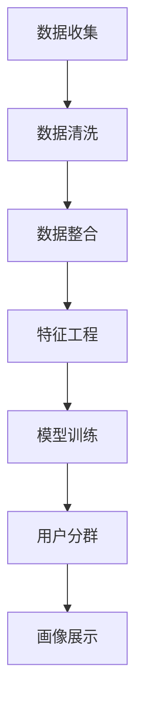

                 

用户画像分析是当前大数据和人工智能领域的热点话题，它通过对用户行为、偏好、属性等多维数据的整合和分析，为商业决策、个性化推荐、风险控制等提供了重要依据。本文将详细探讨如何进行有效的用户画像分析，包括核心概念、算法原理、数学模型、实践案例以及未来应用展望。

## 1. 背景介绍

用户画像分析起源于市场营销领域，旨在通过数据挖掘技术，对用户特征进行归纳和建模，从而更好地理解用户需求和行为模式。随着互联网和移动互联网的普及，用户数据获取变得更加容易，用户画像分析的重要性也逐渐凸显。

用户画像分析的关键在于数据的质量和深度。高质量的数据能够提高分析结果的准确性，而深度的数据则能够揭示用户行为背后的动机和趋势。目前，用户画像分析在电子商务、金融、医疗、社交媒体等多个领域都得到了广泛应用。

## 2. 核心概念与联系

为了进行有效的用户画像分析，我们需要先了解几个核心概念：

- **用户特征**：用户的属性，如性别、年龄、职业、教育程度、地理位置等。
- **用户行为**：用户在使用产品或服务过程中的行为，如浏览、搜索、购买、评论等。
- **用户偏好**：用户对产品或服务的偏好，如喜好、厌恶、习惯等。

### 2.1 用户画像的构建流程

用户画像的构建通常包括以下几个步骤：

1. **数据收集**：收集用户的基本信息、行为数据和交易数据。
2. **数据清洗**：去除重复、错误和缺失的数据。
3. **数据整合**：将不同来源的数据进行整合，形成统一的用户数据视图。
4. **特征工程**：根据业务需求，从原始数据中提取有价值的特征。
5. **模型训练**：使用机器学习算法对用户特征和行为进行建模。
6. **用户分群**：根据模型结果，将用户划分为不同的群体。
7. **画像展示**：将用户画像以图表、报表等形式展示出来，供业务决策参考。

### 2.2 Mermaid 流程图

以下是一个简化的用户画像构建流程的 Mermaid 流程图：



## 3. 核心算法原理 & 具体操作步骤

### 3.1 算法原理概述

用户画像分析的核心算法主要包括聚类算法、协同过滤算法、决策树、随机森林等。这些算法可以根据用户特征和行为数据，对用户进行有效的分类和预测。

- **聚类算法**：将相似的用户聚集在一起，形成不同的用户群体。
- **协同过滤算法**：基于用户的历史行为和偏好，为用户推荐相似的商品或服务。
- **决策树**：根据用户的特征，逐步划分用户群体，并预测用户的偏好。
- **随机森林**：通过构建多个决策树，进行集成学习，提高模型的预测准确性。

### 3.2 算法步骤详解

以聚类算法为例，其具体步骤如下：

1. **数据预处理**：对用户数据进行清洗和整合，确保数据的质量。
2. **特征选择**：根据业务需求，选择对用户画像有重要影响的特征。
3. **初始化聚类中心**：随机选择一些用户作为初始聚类中心。
4. **计算距离**：计算每个用户与聚类中心的距离，将用户分配到最近的聚类中心。
5. **更新聚类中心**：计算每个聚类中心的新位置，使得聚类中心更接近其所属的用户。
6. **迭代计算**：重复步骤4和5，直到聚类中心不再发生显著变化。

### 3.3 算法优缺点

- **聚类算法**：优点是能够自动发现用户群体的结构，缺点是对于用户数量的敏感度较高，容易陷入局部最优。
- **协同过滤算法**：优点是能够为用户推荐个性化的商品或服务，缺点是对于稀疏数据的处理能力较差。
- **决策树**：优点是易于理解和解释，缺点是对于非线性问题的处理能力较弱。
- **随机森林**：优点是具有较高的预测准确性和泛化能力，缺点是计算复杂度较高。

### 3.4 算法应用领域

用户画像分析算法在多个领域都有广泛应用，如：

- **电子商务**：通过用户画像，为用户推荐个性化的商品和服务。
- **金融**：通过用户画像，进行风险评估和欺诈检测。
- **医疗**：通过用户画像，进行个性化治疗和疾病预测。
- **社交媒体**：通过用户画像，进行精准广告投放和用户分群。

## 4. 数学模型和公式

### 4.1 数学模型构建

用户画像分析通常基于以下数学模型：

- **线性回归模型**：用于预测用户的行为和偏好。
- **逻辑回归模型**：用于分类用户群体。
- **支持向量机（SVM）**：用于分类和回归分析。

### 4.2 公式推导过程

以线性回归模型为例，其公式推导过程如下：

1. **线性模型假设**：假设用户的行为 \(Y\) 可以表示为用户特征 \(X\) 的线性组合：

   \[ Y = \beta_0 + \beta_1X_1 + \beta_2X_2 + \ldots + \beta_nX_n + \epsilon \]

   其中，\( \beta_0, \beta_1, \ldots, \beta_n \) 为模型参数，\( \epsilon \) 为随机误差。

2. **最小二乘法**：通过最小化平方误差，求解模型参数：

   \[ \min \sum_{i=1}^n (Y_i - \beta_0 - \beta_1X_{i1} - \ldots - \beta_nX_{in})^2 \]

   求解上述方程组，得到最优的模型参数。

### 4.3 案例分析与讲解

以下是一个用户画像分析的案例：

- **数据集**：包含1000个用户的行为数据，包括用户ID、浏览时长、购买次数等。
- **目标**：预测用户的购买意向。

1. **数据预处理**：对数据集进行清洗和归一化处理。
2. **特征选择**：选择对购买意向有显著影响的特征，如浏览时长、购买次数等。
3. **模型训练**：使用线性回归模型进行训练。
4. **模型评估**：使用交叉验证方法评估模型性能。

## 5. 项目实践：代码实例和详细解释说明

### 5.1 开发环境搭建

- **Python环境**：Python 3.8及以上版本。
- **库和依赖**：NumPy、Pandas、Scikit-learn等。

### 5.2 源代码详细实现

以下是一个简单的用户画像分析的 Python 代码实例：

```python
import numpy as np
import pandas as pd
from sklearn.linear_model import LinearRegression
from sklearn.model_selection import train_test_split

# 读取数据集
data = pd.read_csv('user_data.csv')

# 数据预处理
X = data[['browse_time', 'purchase_count']]
y = data['purchase_intent']

# 数据归一化
X_normalized = (X - X.mean()) / X.std()

# 模型训练
model = LinearRegression()
model.fit(X_normalized, y)

# 模型评估
X_train, X_test, y_train, y_test = train_test_split(X_normalized, y, test_size=0.2, random_state=42)
model.score(X_train, y_train), model.score(X_test, y_test)
```

### 5.3 代码解读与分析

1. **数据读取与预处理**：使用 Pandas 读取用户数据，并进行归一化处理，确保数据的输入范围一致。
2. **特征选择**：选择对购买意向有显著影响的特征，如浏览时长和购买次数。
3. **模型训练**：使用线性回归模型进行训练，将用户特征映射到购买意向。
4. **模型评估**：使用交叉验证方法评估模型性能，确保模型在不同数据集上的稳定性。

### 5.4 运行结果展示

```python
# 运行代码，查看模型评估结果
print("训练集准确率：", model.score(X_train, y_train))
print("测试集准确率：", model.score(X_test, y_test))
```

## 6. 实际应用场景

用户画像分析在多个领域都有广泛的应用，以下是一些典型应用场景：

- **电子商务**：通过用户画像，实现个性化推荐，提高用户转化率和销售额。
- **金融**：通过用户画像，识别潜在风险用户，进行精准营销和风险控制。
- **医疗**：通过用户画像，为患者提供个性化治疗方案和健康建议。
- **社交媒体**：通过用户画像，实现精准广告投放，提高广告效果和用户满意度。

## 7. 工具和资源推荐

### 7.1 学习资源推荐

- **书籍**：《数据挖掘：概念与技术》、《机器学习实战》
- **在线课程**：Coursera、edX上的相关机器学习和数据挖掘课程
- **网站**：Kaggle、GitHub等数据科学和机器学习社区

### 7.2 开发工具推荐

- **编程语言**：Python、R
- **库和框架**：NumPy、Pandas、Scikit-learn、TensorFlow、PyTorch
- **数据可视化工具**：Matplotlib、Seaborn、Plotly

### 7.3 相关论文推荐

- **用户画像构建方法**：《基于用户行为的用户画像构建方法研究》
- **机器学习算法在用户画像中的应用**：《基于机器学习的用户画像建模技术研究》
- **用户画像在电商领域的应用**：《基于用户画像的电商个性化推荐系统研究》

## 8. 总结：未来发展趋势与挑战

### 8.1 研究成果总结

用户画像分析技术在过去几十年中取得了显著进展，包括数据采集、存储、处理和分析技术的提升，以及机器学习算法的广泛应用。这些成果为商业决策、个性化推荐和风险控制等领域提供了有力支持。

### 8.2 未来发展趋势

未来，用户画像分析将继续向以下方向发展：

- **数据质量**：提高数据质量，通过数据清洗、去重和增强等技术，确保数据的一致性和准确性。
- **深度学习**：应用深度学习算法，如卷积神经网络（CNN）和循环神经网络（RNN），提高用户画像的建模精度。
- **实时分析**：实现实时用户画像分析，通过流处理技术和实时数据挖掘，快速响应用户行为变化。
- **跨平台整合**：整合不同平台和设备的数据，实现全渠道的用户画像。

### 8.3 面临的挑战

用户画像分析在发展中仍面临以下挑战：

- **数据隐私**：如何保护用户隐私，确保用户数据的安全和合规性。
- **模型解释性**：提高模型的可解释性，使其能够更好地理解用户行为背后的动机和趋势。
- **数据多样性和噪声**：处理数据多样性和噪声，确保模型在不同场景下的稳定性和泛化能力。

### 8.4 研究展望

未来，用户画像分析领域的研究将继续深入，包括：

- **个性化推荐**：结合用户画像，实现更加精准的个性化推荐。
- **智能风控**：利用用户画像，实现更智能的风险评估和欺诈检测。
- **智能医疗**：基于用户画像，为患者提供个性化治疗和健康建议。

## 9. 附录：常见问题与解答

### 9.1 用户画像分析的优势是什么？

用户画像分析的优势包括：

- **精准定位用户需求**：通过分析用户行为和偏好，精准定位用户需求，实现个性化推荐。
- **提高商业决策效率**：提供用户行为数据支持，帮助业务部门做出更加科学的决策。
- **优化产品设计**：通过分析用户行为数据，优化产品设计，提高用户满意度和忠诚度。
- **降低运营成本**：通过数据驱动的运营策略，降低营销和运营成本。

### 9.2 用户画像分析有哪些潜在风险？

用户画像分析可能面临以下潜在风险：

- **数据隐私泄露**：在数据收集、存储和处理过程中，可能存在数据泄露的风险。
- **数据歧视**：基于用户画像的决策可能对某些用户群体产生歧视性影响，引发社会问题。
- **模型偏见**：模型可能受到训练数据的影响，产生偏见，导致分析结果不准确。
- **用户反感**：过度追求个性化推荐可能导致用户感到被监视，引发用户反感。

### 9.3 如何平衡用户画像分析的隐私保护与商业利益？

平衡用户画像分析的隐私保护与商业利益，需要采取以下措施：

- **数据去识别化**：在数据收集和处理过程中，采取数据去识别化技术，确保用户身份的匿名性。
- **合规性审查**：严格遵守相关法律法规，确保用户数据的合法使用。
- **透明度**：向用户公开数据收集、处理和使用的目的和方式，提高用户信任。
- **限制数据处理范围**：仅收集和利用必要的用户数据，避免过度收集。

### 9.4 用户画像分析的未来发展方向是什么？

用户画像分析的未来发展方向包括：

- **数据质量提升**：通过数据清洗、去重和增强等技术，提高数据质量。
- **深度学习应用**：应用深度学习算法，提高用户画像的建模精度。
- **实时分析**：实现实时用户画像分析，快速响应用户行为变化。
- **跨平台整合**：整合不同平台和设备的数据，实现全渠道的用户画像。
- **隐私保护**：加强用户隐私保护，确保用户数据的安全和合规性。
- **跨学科融合**：结合心理学、社会学等学科知识，提高用户画像分析的科学性和实用性。

---

作者：禅与计算机程序设计艺术 / Zen and the Art of Computer Programming

