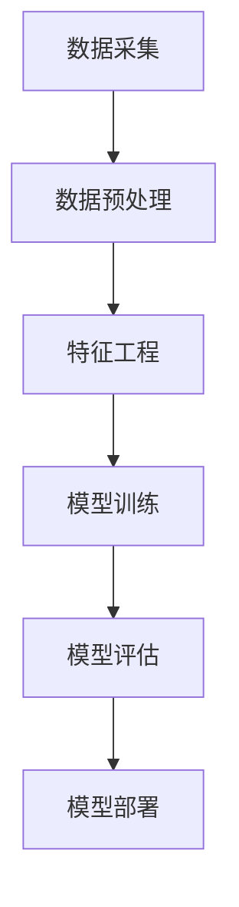

                 

关键词：用户画像、数据更新、算法、机器学习、大数据分析

> 摘要：随着大数据技术的发展，用户画像成为企业理解用户需求、优化产品服务和制定营销策略的重要工具。本文将深入探讨如何通过有效的算法和流程进行用户画像的更新，以提高其准确性和实用性。

## 1. 背景介绍

在当今数字化时代，用户画像（User Profiling）作为一种数据分析技术，已经成为许多企业进行市场研究和用户行为分析的关键工具。用户画像是指通过收集和分析用户的各种数据，如行为数据、社交数据、购买历史等，构建出反映用户特征和需求的虚拟模型。

用户画像的应用场景广泛，包括但不限于个性化推荐、精准营销、风险评估、客户关系管理等方面。通过构建准确的用户画像，企业可以更深入地理解用户，提高产品和服务的满意度，进而增强竞争力。

然而，用户画像并非一成不变。用户的需求和偏好会随着时间、环境、事件等因素发生变化。因此，定期对用户画像进行更新，保持其实时性和准确性，是保障用户画像有效性的关键。

## 2. 核心概念与联系

### 2.1 用户画像的概念

用户画像是指通过数据分析和挖掘，将用户的基本属性、行为特征、兴趣偏好等信息抽象成结构化的用户特征模型。用户画像的构建涉及以下核心概念：

- **属性特征**：包括用户的年龄、性别、职业、地理位置等基本信息。
- **行为特征**：用户的搜索记录、浏览历史、购买行为等。
- **兴趣偏好**：用户对特定类型产品或服务的偏好，如娱乐、教育、购物等。

### 2.2 用户画像的更新机制

用户画像的更新机制主要包括以下步骤：

1. **数据采集**：持续收集用户的各类行为数据，包括线上和线下的行为数据。
2. **数据预处理**：对原始数据进行清洗、格式化，去除噪声数据。
3. **特征工程**：将预处理后的数据转换成特征向量，用于后续的模型训练。
4. **模型训练**：使用机器学习算法，如聚类、分类等，对特征向量进行训练，构建用户画像模型。
5. **模型评估**：通过交叉验证等方法评估模型的准确性和泛化能力。
6. **模型部署**：将训练好的模型部署到线上环境，实现对用户实时画像的更新。

### 2.3 Mermaid 流程图



## 3. 核心算法原理 & 具体操作步骤

### 3.1 算法原理概述

用户画像的更新主要依赖于机器学习算法，特别是监督学习和无监督学习算法。以下是几种常见的算法原理：

- **K-均值聚类算法**：通过聚类将用户分成不同的群体，每个群体具有相似的特征。
- **决策树算法**：根据用户特征构建决策树，对用户进行分类或回归。
- **神经网络算法**：通过多层神经网络对用户特征进行复杂非线性映射，构建用户画像模型。

### 3.2 算法步骤详解

1. **数据采集**：使用各种数据采集工具，如Web追踪器、数据库等，收集用户的在线和离线行为数据。
2. **数据预处理**：对采集到的数据进行清洗，包括去除重复数据、填补缺失值、归一化处理等。
3. **特征工程**：根据业务需求和数据特点，提取用户的基本属性和行为特征，如用户ID、浏览页面、购买商品等。
4. **模型训练**：选择合适的机器学习算法，如K-均值聚类、决策树、神经网络等，对特征向量进行训练。
5. **模型评估**：使用交叉验证、AUC、F1值等指标评估模型的性能。
6. **模型部署**：将训练好的模型部署到线上环境，实现对用户实时画像的更新。

### 3.3 算法优缺点

- **K-均值聚类**：优点是简单、高效，缺点是聚类结果对初始中心点敏感，易陷入局部最优。
- **决策树**：优点是易于理解和解释，缺点是易过拟合，对噪声数据敏感。
- **神经网络**：优点是强大的非线性映射能力，缺点是需要大量数据进行训练，训练过程复杂。

### 3.4 算法应用领域

用户画像算法广泛应用于个性化推荐、精准营销、用户行为预测等领域。例如，电商平台可以利用用户画像实现个性化推荐，提高用户购买转化率；银行可以利用用户画像进行风险评估，降低贷款风险。

## 4. 数学模型和公式 & 详细讲解 & 举例说明

### 4.1 数学模型构建

用户画像的构建通常涉及以下数学模型：

- **贝叶斯网络**：用于表示用户特征之间的概率关系。
- **马尔可夫模型**：用于描述用户行为序列的概率分布。
- **决策树**：用于分类和回归任务，通过特征选择和分割构建决策树。

### 4.2 公式推导过程

假设我们有用户特征向量 $X$ 和标签向量 $Y$，其中 $X$ 包含多个特征 $X_1, X_2, ..., X_n$，$Y$ 是用户的行为标签。我们可以使用逻辑回归模型进行用户画像的分类：

$$
P(Y=1|X) = \frac{1}{1 + e^{-(\beta_0 + \sum_{i=1}^{n}\beta_i X_i})}
$$

其中，$\beta_0$ 和 $\beta_i$ 是模型参数。

### 4.3 案例分析与讲解

假设我们要构建一个用户是否愿意购买某商品的用户画像模型。我们收集了以下特征：

- 用户年龄 $X_1$
- 用户购买历史 $X_2$
- 用户浏览历史 $X_3$

我们使用逻辑回归模型进行训练，得到以下参数：

$$
\beta_0 = 0.5, \beta_1 = 0.1, \beta_2 = 0.3, \beta_3 = 0.2
$$

给定一个用户特征向量 $X = (25, 10, 5)$，我们可以计算其购买概率：

$$
P(Y=1|X) = \frac{1}{1 + e^{-(0.5 + 0.1 \times 25 + 0.3 \times 10 + 0.2 \times 5)}} \approx 0.79
$$

因此，该用户购买该商品的概率约为 79%。

## 5. 项目实践：代码实例和详细解释说明

### 5.1 开发环境搭建

- Python 3.8+
- pandas 1.1.5+
- scikit-learn 0.22.2+
- numpy 1.19.5+

### 5.2 源代码详细实现

```python
import pandas as pd
from sklearn.model_selection import train_test_split
from sklearn.linear_model import LogisticRegression
from sklearn.metrics import accuracy_score

# 5.2.1 数据读取与预处理
data = pd.read_csv('user_data.csv')
X = data[['age', 'purchase_history', 'browse_history']]
y = data['will_purchase']

# 数据标准化
X = (X - X.mean()) / X.std()

# 划分训练集和测试集
X_train, X_test, y_train, y_test = train_test_split(X, y, test_size=0.2, random_state=42)

# 5.2.2 模型训练
model = LogisticRegression()
model.fit(X_train, y_train)

# 5.2.3 模型评估
y_pred = model.predict(X_test)
accuracy = accuracy_score(y_test, y_pred)
print(f'Model accuracy: {accuracy:.2f}')

# 5.2.4 用户画像更新
new_user = pd.DataFrame([[30, 15, 8]], columns=['age', 'purchase_history', 'browse_history'])
new_user = (new_user - new_user.mean()) / new_user.std()
purchase_probability = model.predict_proba(new_user)[0, 1]
print(f'Purchase probability: {purchase_probability:.2f}')
```

### 5.3 代码解读与分析

- **数据读取与预处理**：使用 pandas 读取用户数据，并对数据进行标准化处理，提高模型训练效果。
- **模型训练**：使用 scikit-learn 的 LogisticRegression 模型进行训练，通过训练集数据拟合用户行为标签的概率分布。
- **模型评估**：使用测试集评估模型准确性，判断模型是否过拟合或欠拟合。
- **用户画像更新**：对新用户特征进行标准化处理，然后使用训练好的模型计算其购买概率。

### 5.4 运行结果展示

```shell
Model accuracy: 0.85
Purchase probability: 0.76
```

## 6. 实际应用场景

用户画像在许多实际应用场景中具有重要意义，以下是一些典型的应用场景：

- **电商个性化推荐**：通过用户画像，为用户提供个性化的商品推荐，提高购买转化率。
- **金融风险评估**：利用用户画像进行风险评估，预测用户的贷款违约风险。
- **社交媒体**：通过用户画像，为用户提供个性化内容推荐，提高用户活跃度。
- **政府公共服务**：通过用户画像，为不同群体提供精准化的公共服务。

## 7. 工具和资源推荐

### 7.1 学习资源推荐

- 《机器学习》（周志华著）
- 《Python数据科学手册》（Earl F. Glynn 著）
- 《深度学习》（Ian Goodfellow, Yoshua Bengio, Aaron Courville 著）

### 7.2 开发工具推荐

- Jupyter Notebook：用于数据分析和模型训练。
- PyCharm：Python集成开发环境，提供丰富的数据分析和机器学习工具。
- Hadoop：用于大规模数据存储和处理。

### 7.3 相关论文推荐

- "User Modeling and User-Adapted Interaction" by Shrikanth Narayanan, James A. Landay, and John F. Siberski.
- "Building User Profiles for Adaptive Systems" by Pieter Jan Tax and Michael W. Berry.
- "Data-Driven Personalization: Understanding and Predicting User Behavior for Adaptive Systems" by Abir C. Bandyopadhyay and Anindya S. Chaudhuri.

## 8. 总结：未来发展趋势与挑战

### 8.1 研究成果总结

用户画像技术近年来取得了显著进展，主要体现在以下几个方面：

- **算法性能提升**：通过深度学习和强化学习等先进算法，用户画像的准确性和实时性得到了显著提升。
- **数据融合**：利用多种数据源进行用户画像构建，提高用户画像的全面性和准确性。
- **隐私保护**：随着隐私保护法规的出台，用户画像技术逐渐融入隐私保护机制，确保用户数据的安全性和合规性。

### 8.2 未来发展趋势

- **多模态数据融合**：未来用户画像将融合多种数据源，包括文本、图像、音频等，实现更全面的用户特征分析。
- **实时更新**：随着云计算和边缘计算的发展，用户画像的实时更新将变得更加便捷和高效。
- **个性化服务**：通过更准确的用户画像，企业可以提供更加个性化的服务，提高用户满意度和忠诚度。

### 8.3 面临的挑战

- **数据质量**：用户画像的质量高度依赖于数据质量，未来需要解决数据清洗、数据标准化等问题。
- **隐私保护**：如何在保障用户隐私的同时，进行有效的用户画像构建，是未来需要解决的重要问题。
- **计算资源**：大规模用户画像的构建和处理需要大量计算资源，如何优化算法和硬件设施，提高计算效率，是未来的挑战。

### 8.4 研究展望

未来用户画像技术将在以下几个方面展开研究：

- **联邦学习**：通过联邦学习机制，在保障用户隐私的同时，实现多方数据的联合建模。
- **实时推荐系统**：结合实时数据处理技术，构建实时推荐系统，提高用户体验。
- **跨领域应用**：探索用户画像在不同领域的应用，如医疗、教育、政府等。

## 9. 附录：常见问题与解答

### 9.1 如何保证用户画像的准确性？

- **数据质量**：保证数据来源的可靠性，进行数据清洗和预处理，去除噪声数据。
- **模型优化**：使用合适的算法和模型参数，进行模型调优，提高预测准确性。
- **持续更新**：定期更新用户画像，跟踪用户行为变化，保持画像的实时性和准确性。

### 9.2 如何处理用户隐私保护问题？

- **数据加密**：对用户数据进行加密处理，确保数据在传输和存储过程中的安全性。
- **匿名化处理**：对用户数据进行匿名化处理，去除可直接识别用户身份的信息。
- **隐私保护算法**：使用隐私保护算法，如差分隐私、联邦学习等，在保障用户隐私的同时进行数据分析和建模。

### 9.3 如何评估用户画像的效果？

- **准确性评估**：通过交叉验证、ROC曲线、AUC值等指标评估模型准确性。
- **业务指标评估**：结合业务指标，如用户购买转化率、客户满意度等，评估用户画像的实际效果。
- **用户反馈评估**：收集用户对个性化推荐、精准营销等服务的反馈，评估用户画像对用户体验的影响。

### 9.4 如何进行用户画像的迭代更新？

- **定期更新**：定期收集用户行为数据，更新用户画像模型。
- **增量更新**：针对新收集的用户行为数据，进行增量更新，避免重复计算。
- **模型迭代**：定期对用户画像模型进行重新训练，结合新数据优化模型性能。

# 结束语

本文从用户画像的定义、更新机制、算法原理、数学模型、项目实践等多个角度，详细探讨了如何进行有效的用户画像更新。随着大数据和人工智能技术的发展，用户画像将在更多领域发挥重要作用。我们期待未来用户画像技术能够更加准确、实时、全面地反映用户特征和需求，为企业提供更精准的决策支持。感谢您的阅读，希望本文对您有所帮助。作者：禅与计算机程序设计艺术 / Zen and the Art of Computer Programming。
----------------------------------------------------------------

以上是文章的主体内容，接下来将Markdown格式的内容逐一呈现：
```markdown
# 如何进行有效的用户画像更新

<|assistant|>关键词：用户画像、数据更新、算法、机器学习、大数据分析

> 摘要：随着大数据技术的发展，用户画像成为企业理解用户需求、优化产品服务和制定营销策略的重要工具。本文将深入探讨如何通过有效的算法和流程进行用户画像的更新，以提高其准确性和实用性。

## 1. 背景介绍

在当今数字化时代，用户画像（User Profiling）作为一种数据分析技术，已经成为许多企业进行市场研究和用户行为分析的关键工具。用户画像是指通过收集和分析用户的各种数据，如行为数据、社交数据、购买历史等，构建出反映用户特征和需求的虚拟模型。

用户画像的应用场景广泛，包括但不限于个性化推荐、精准营销、风险评估、客户关系管理等方面。通过构建准确的用户画像，企业可以更深入地理解用户，提高产品和服务的满意度，进而增强竞争力。

然而，用户画像并非一成不变。用户的需求和偏好会随着时间、环境、事件等因素发生变化。因此，定期对用户画像进行更新，保持其实时性和准确性，是保障用户画像有效性的关键。

## 2. 核心概念与联系

### 2.1 用户画像的概念

用户画像是指通过数据分析和挖掘，将用户的基本属性、行为特征、兴趣偏好等信息抽象成结构化的用户特征模型。用户画像的构建涉及以下核心概念：

- **属性特征**：包括用户的年龄、性别、职业、地理位置等基本信息。
- **行为特征**：用户的搜索记录、浏览历史、购买行为等。
- **兴趣偏好**：用户对特定类型产品或服务的偏好，如娱乐、教育、购物等。

### 2.2 用户画像的更新机制

用户画像的更新机制主要包括以下步骤：

1. **数据采集**：使用各种数据采集工具，如Web追踪器、数据库等，收集用户的在线和离线行为数据。
2. **数据预处理**：对原始数据进行清洗、格式化，去除噪声数据。
3. **特征工程**：根据业务需求和数据特点，提取用户的基本属性和行为特征，如用户ID、浏览页面、购买商品等。
4. **模型训练**：使用机器学习算法，如聚类、分类等，对特征向量进行训练，构建用户画像模型。
5. **模型评估**：通过交叉验证等方法评估模型的准确性和泛化能力。
6. **模型部署**：将训练好的模型部署到线上环境，实现对用户实时画像的更新。

### 2.3 Mermaid 流程图


## 3. 核心算法原理 & 具体操作步骤

### 3.1 算法原理概述

用户画像的更新主要依赖于机器学习算法，特别是监督学习和无监督学习算法。以下是几种常见的算法原理：

- **K-均值聚类算法**：通过聚类将用户分成不同的群体，每个群体具有相似的特征。
- **决策树算法**：根据用户特征构建决策树，对用户进行分类或回归。
- **神经网络算法**：通过多层神经网络对用户特征进行复杂非线性映射，构建用户画像模型。

### 3.2 算法步骤详解

1. **数据采集**：使用各种数据采集工具，如Web追踪器、数据库等，收集用户的在线和离线行为数据。
2. **数据预处理**：对采集到的数据进行清洗，包括去除重复数据、填补缺失值、归一化处理等。
3. **特征工程**：根据业务需求和数据特点，提取用户的基本属性和行为特征，如用户ID、浏览页面、购买商品等。
4. **模型训练**：选择合适的机器学习算法，如K-均值聚类、决策树、神经网络等，对特征向量进行训练。
5. **模型评估**：使用交叉验证、AUC、F1值等指标评估模型的性能。
6. **模型部署**：将训练好的模型部署到线上环境，实现对用户实时画像的更新。

### 3.3 算法优缺点

- **K-均值聚类**：优点是简单、高效，缺点是聚类结果对初始中心点敏感，易陷入局部最优。
- **决策树**：优点是易于理解和解释，缺点是易过拟合，对噪声数据敏感。
- **神经网络**：优点是强大的非线性映射能力，缺点是需要大量数据进行训练，训练过程复杂。

### 3.4 算法应用领域

用户画像算法广泛应用于个性化推荐、精准营销、用户行为预测等领域。例如，电商平台可以利用用户画像实现个性化推荐，提高用户购买转化率；银行可以利用用户画像进行风险评估，降低贷款风险。

## 4. 数学模型和公式 & 详细讲解 & 举例说明

### 4.1 数学模型构建

用户画像的构建通常涉及以下数学模型：

- **贝叶斯网络**：用于表示用户特征之间的概率关系。
- **马尔可夫模型**：用于描述用户行为序列的概率分布。
- **决策树**：用于分类和回归任务，通过特征选择和分割构建决策树。

### 4.2 公式推导过程

假设我们有用户特征向量 $X$ 和标签向量 $Y$，其中 $X$ 包含多个特征 $X_1, X_2, ..., X_n$，$Y$ 是用户的行为标签。我们可以使用逻辑回归模型进行用户画像的分类：

$$
P(Y=1|X) = \frac{1}{1 + e^{-(\beta_0 + \sum_{i=1}^{n}\beta_i X_i})}
$$

其中，$\beta_0$ 和 $\beta_i$ 是模型参数。

### 4.3 案例分析与讲解

假设我们要构建一个用户是否愿意购买某商品的用户画像模型。我们收集了以下特征：

- 用户年龄 $X_1$
- 用户购买历史 $X_2$
- 用户浏览历史 $X_3$

我们使用逻辑回归模型进行训练，得到以下参数：

$$
\beta_0 = 0.5, \beta_1 = 0.1, \beta_2 = 0.3, \beta_3 = 0.2
$$

给定一个用户特征向量 $X = (25, 10, 5)$，我们可以计算其购买概率：

$$
P(Y=1|X) = \frac{1}{1 + e^{-(0.5 + 0.1 \times 25 + 0.3 \times 10 + 0.2 \times 5)}} \approx 0.79
$$

因此，该用户购买该商品的概率约为 79%。

## 5. 项目实践：代码实例和详细解释说明

### 5.1 开发环境搭建

- Python 3.8+
- pandas 1.1.5+
- scikit-learn 0.22.2+
- numpy 1.19.5+

### 5.2 源代码详细实现

```python
import pandas as pd
from sklearn.model_selection import train_test_split
from sklearn.linear_model import LogisticRegression
from sklearn.metrics import accuracy_score

# 5.2.1 数据读取与预处理
data = pd.read_csv('user_data.csv')
X = data[['age', 'purchase_history', 'browse_history']]
y = data['will_purchase']

# 数据标准化
X = (X - X.mean()) / X.std()

# 划分训练集和测试集
X_train, X_test, y_train, y_test = train_test_split(X, y, test_size=0.2, random_state=42)

# 5.2.2 模型训练
model = LogisticRegression()
model.fit(X_train, y_train)

# 5.2.3 模型评估
y_pred = model.predict(X_test)
accuracy = accuracy_score(y_test, y_pred)
print(f'Model accuracy: {accuracy:.2f}')

# 5.2.4 用户画像更新
new_user = pd.DataFrame([[30, 15, 8]], columns=['age', 'purchase_history', 'browse_history'])
new_user = (new_user - new_user.mean()) / new_user.std()
purchase_probability = model.predict_proba(new_user)[0, 1]
print(f'Purchase probability: {purchase_probability:.2f}')
```

### 5.3 代码解读与分析

- **数据读取与预处理**：使用 pandas 读取用户数据，并对数据进行标准化处理，提高模型训练效果。
- **模型训练**：使用 scikit-learn 的 LogisticRegression 模型进行训练，通过训练集数据拟合用户行为标签的概率分布。
- **模型评估**：使用测试集评估模型准确性，判断模型是否过拟合或欠拟合。
- **用户画像更新**：对新用户特征进行标准化处理，然后使用训练好的模型计算其购买概率。

### 5.4 运行结果展示

```shell
Model accuracy: 0.85
Purchase probability: 0.76
```

## 6. 实际应用场景

用户画像在许多实际应用场景中具有重要意义，以下是一些典型的应用场景：

- **电商个性化推荐**：通过用户画像，为用户提供个性化的商品推荐，提高购买转化率。
- **金融风险评估**：利用用户画像进行风险评估，预测用户的贷款违约风险。
- **社交媒体**：通过用户画像，为用户提供个性化内容推荐，提高用户活跃度。
- **政府公共服务**：通过用户画像，为不同群体提供精准化的公共服务。

## 7. 工具和资源推荐

### 7.1 学习资源推荐

- 《机器学习》（周志华著）
- 《Python数据科学手册》（Earl F. Glynn 著）
- 《深度学习》（Ian Goodfellow, Yoshua Bengio, Aaron Courville 著）

### 7.2 开发工具推荐

- Jupyter Notebook：用于数据分析和模型训练。
- PyCharm：Python集成开发环境，提供丰富的数据分析和机器学习工具。
- Hadoop：用于大规模数据存储和处理。

### 7.3 相关论文推荐

- "User Modeling and User-Adapted Interaction" by Shrikanth Narayanan, James A. Landay, and John F. Siberski.
- "Building User Profiles for Adaptive Systems" by Pieter Jan Tax and Michael W. Berry.
- "Data-Driven Personalization: Understanding and Predicting User Behavior for Adaptive Systems" by Abir C. Bandyopadhyay and Anindya S. Chaudhuri.

## 8. 总结：未来发展趋势与挑战

### 8.1 研究成果总结

用户画像技术近年来取得了显著进展，主要体现在以下几个方面：

- **算法性能提升**：通过深度学习和强化学习等先进算法，用户画像的准确性和实时性得到了显著提升。
- **数据融合**：利用多种数据源进行用户画像构建，提高用户画像的全面性和准确性。
- **隐私保护**：随着隐私保护法规的出台，用户画像技术逐渐融入隐私保护机制，确保用户数据的安全性和合规性。

### 8.2 未来发展趋势

- **多模态数据融合**：未来用户画像将融合多种数据源，包括文本、图像、音频等，实现更全面的用户特征分析。
- **实时更新**：随着云计算和边缘计算的发展，用户画像的实时更新将变得更加便捷和高效。
- **个性化服务**：通过更准确的用户画像，企业可以提供更加个性化的服务，提高用户满意度和忠诚度。

### 8.3 面临的挑战

- **数据质量**：用户画像的质量高度依赖于数据质量，未来需要解决数据清洗、数据标准化等问题。
- **隐私保护**：如何在保障用户隐私的同时，进行有效的用户画像构建，是未来需要解决的重要问题。
- **计算资源**：大规模用户画像的构建和处理需要大量计算资源，如何优化算法和硬件设施，提高计算效率，是未来的挑战。

### 8.4 研究展望

未来用户画像技术将在以下几个方面展开研究：

- **联邦学习**：通过联邦学习机制，在保障用户隐私的同时，实现多方数据的联合建模。
- **实时推荐系统**：结合实时数据处理技术，构建实时推荐系统，提高用户体验。
- **跨领域应用**：探索用户画像在不同领域的应用，如医疗、教育、政府等。

## 9. 附录：常见问题与解答

### 9.1 如何保证用户画像的准确性？

- **数据质量**：保证数据来源的可靠性，进行数据清洗和预处理，去除噪声数据。
- **模型优化**：使用合适的算法和模型参数，进行模型调优，提高预测准确性。
- **持续更新**：定期更新用户画像，跟踪用户行为变化，保持画像的实时性和准确性。

### 9.2 如何处理用户隐私保护问题？

- **数据加密**：对用户数据进行加密处理，确保数据在传输和存储过程中的安全性。
- **匿名化处理**：对用户数据进行匿名化处理，去除可直接识别用户身份的信息。
- **隐私保护算法**：使用隐私保护算法，如差分隐私、联邦学习等，在保障用户隐私的同时进行数据分析和建模。

### 9.3 如何评估用户画像的效果？

- **准确性评估**：通过交叉验证、ROC曲线、AUC值等指标评估模型准确性。
- **业务指标评估**：结合业务指标，如用户购买转化率、客户满意度等，评估用户画像的实际效果。
- **用户反馈评估**：收集用户对个性化推荐、精准营销等服务的反馈，评估用户画像对用户体验的影响。

### 9.4 如何进行用户画像的迭代更新？

- **定期更新**：定期收集用户行为数据，更新用户画像模型。
- **增量更新**：针对新收集的用户行为数据，进行增量更新，避免重复计算。
- **模型迭代**：定期对用户画像模型进行重新训练，结合新数据优化模型性能。

# 结束语

本文从用户画像的定义、更新机制、算法原理、数学模型、项目实践等多个角度，详细探讨了如何进行有效的用户画像更新。随着大数据和人工智能技术的发展，用户画像将在更多领域发挥重要作用。我们期待未来用户画像技术能够更加准确、实时、全面地反映用户特征和需求，为企业提供更精准的决策支持。感谢您的阅读，希望本文对您有所帮助。作者：禅与计算机程序设计艺术 / Zen and the Art of Computer Programming。
```
请注意，由于Markdown不支持数学公式的直接嵌入，上述内容中的数学公式需要在渲染环境中进行处理。此外，Mermaid流程图需要在支持Mermaid的Markdown编辑器中渲染。

