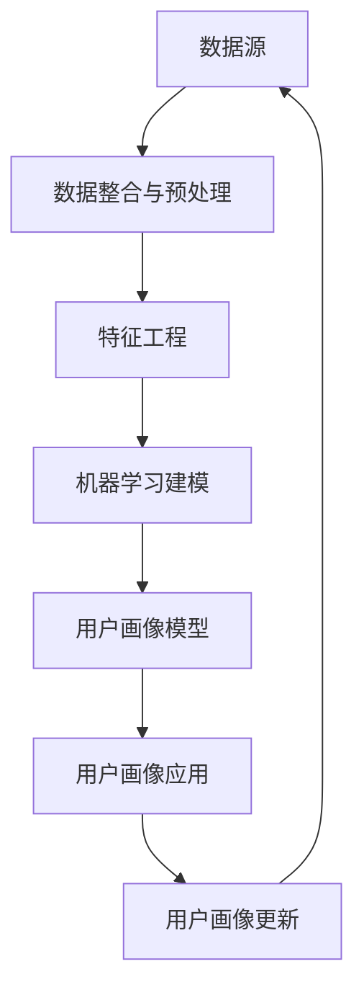

                 

用户画像（User Profiling）是现代数据驱动的企业和组织中的一项关键任务。它涉及对用户行为的深入分析，以创建一个反映用户需求、兴趣、偏好和行为的综合视图。随着时间的推移，用户的行为和需求可能会发生变化，因此，定期更新用户画像是保持其准确性和相关性的关键。

## 关键词
- 用户画像
- 用户行为分析
- 数据驱动决策
- 实时更新
- 预测分析

## 摘要
本文将探讨如何通过技术手段进行有效的用户画像更新。我们将首先介绍用户画像的背景和重要性，然后深入讨论用户画像更新的核心概念和流程。接着，我们将分析现有的用户画像更新算法，并讨论其在实际应用中的挑战和解决方案。最后，我们将展望用户画像技术的未来发展趋势，并总结本文的关键点。

## 1. 背景介绍

### 用户画像的起源和发展

用户画像的概念起源于市场营销和客户关系管理领域。早期，企业通过收集和分析客户的数据来了解他们的购买习惯和偏好。随着互联网和大数据技术的兴起，用户画像逐渐发展成为一个全面的数据分析过程，不仅涉及静态数据，还包括用户的动态行为和实时反馈。

### 用户画像的定义和作用

用户画像是一种基于数据分析的方法，通过整合用户的多维度数据，创建一个综合的、动态的、可操作的模型。这些数据可能包括用户的基本信息、历史行为数据、社交网络活动、地理位置、购买记录等。用户画像的作用在于帮助企业和组织更好地理解用户，从而实现个性化推荐、精准营销、用户行为预测等。

### 用户画像在商业应用中的重要性

在电子商务、金融、医疗、广告、社交媒体等众多行业中，用户画像已经成为提升用户体验和业务绩效的关键工具。例如，在电子商务领域，通过用户画像可以实现个性化推荐，提高销售额；在金融领域，用户画像有助于风险评估和欺诈检测。

## 2. 核心概念与联系

### 数据源和数据类型

用户画像的数据源非常广泛，包括用户注册信息、网站日志、社交媒体活动、购买记录、客户服务记录等。这些数据类型可以分为结构化数据和非结构化数据。

### 数据整合与预处理

数据整合是用户画像更新的关键步骤，它涉及到将来自不同源的数据进行清洗、转换和整合。数据预处理还包括缺失值填补、异常值处理、数据标准化等。

### 用户画像模型

用户画像模型是一个多维度、动态的数据结构，它通过特征工程和机器学习算法对用户数据进行建模。常用的模型包括基于规则模型、聚类模型、协同过滤模型、深度学习模型等。

### 数据更新与维护

用户画像的更新和维护是一个持续的过程，它涉及到实时数据采集、周期性数据同步、用户行为分析、模型更新等。

### Mermaid 流程图

下面是一个简单的 Mermaid 流程图，展示了用户画像更新的基本流程：



## 3. 核心算法原理 & 具体操作步骤

### 3.1 算法原理概述

用户画像更新主要依赖于机器学习和数据挖掘算法。常用的算法包括：

- **协同过滤**：通过分析用户的共同偏好来推荐产品或服务。
- **聚类分析**：将用户划分为不同的群体，以便进行更精准的营销。
- **决策树和随机森林**：用于分类和预测用户行为。
- **深度学习**：通过神经网络模型进行用户行为的建模和预测。

### 3.2 算法步骤详解

1. **数据采集与清洗**：
   - 收集用户行为数据，如点击记录、搜索历史、购买行为等。
   - 对数据进行清洗，去除噪声和异常值。

2. **特征提取与选择**：
   - 从原始数据中提取关键特征，如用户年龄、性别、地理位置等。
   - 使用特征选择算法，如卡方检验、信息增益等，筛选出最有用的特征。

3. **模型训练与验证**：
   - 使用训练数据集对机器学习模型进行训练。
   - 使用交叉验证等方法对模型进行验证，评估其性能。

4. **用户画像生成与更新**：
   - 根据训练好的模型生成用户画像。
   - 定期更新用户画像，以反映用户最新的行为和偏好。

### 3.3 算法优缺点

- **协同过滤**：优点是推荐准确，缺点是冷启动问题严重，新用户难以得到有效推荐。
- **聚类分析**：优点是无需先验知识，缺点是聚类结果可能不直观，且难以解释。
- **决策树和随机森林**：优点是易于理解和解释，缺点是对于大规模数据集性能可能下降。
- **深度学习**：优点是强大的表示能力和自适应性，缺点是模型复杂，需要大量数据训练。

### 3.4 算法应用领域

- **电子商务**：通过用户画像进行个性化推荐，提高用户满意度和销售额。
- **金融**：通过用户画像进行风险评估和欺诈检测。
- **医疗**：通过用户画像进行个性化医疗建议和疾病预测。
- **广告**：通过用户画像进行精准广告投放，提高广告效果。

## 4. 数学模型和公式 & 详细讲解 & 举例说明

### 4.1 数学模型构建

用户画像的数学模型通常基于机器学习算法，如协同过滤、聚类分析等。以下是一个简单的协同过滤算法的数学模型：

$$
\hat{r}_{ui} = \frac{\sum_{j \in N_i} r_{uj} \cdot \text{sim}(i, j)}{\sum_{j \in N_i} \text{sim}(i, j)}
$$

其中，$r_{uj}$ 表示用户 $u$ 对项目 $j$ 的评分，$N_i$ 表示与用户 $i$ 相似的一组用户，$\text{sim}(i, j)$ 表示用户 $i$ 和 $j$ 之间的相似度。

### 4.2 公式推导过程

协同过滤算法的推导基于用户行为的一致性假设，即如果用户 $i$ 和 $j$ 在某些项目上评分相似，那么他们可能会在其他项目上也有相似的评分。这个假设可以通过计算用户之间的相似度来实现。

### 4.3 案例分析与讲解

假设我们有两个用户 $u_1$ 和 $u_2$，以及他们各自对五部电影 $m_1$、$m_2$、$m_3$、$m_4$、$m_5$ 的评分。我们可以使用余弦相似度来计算这两个用户之间的相似度：

$$
\text{sim}(u_1, u_2) = \frac{\sum_{i=1}^{5} r_{u_1i} r_{u_2i}}{\sqrt{\sum_{i=1}^{5} r_{u_1i}^2} \sqrt{\sum_{i=1}^{5} r_{u_2i}^2}}
$$

假设用户 $u_1$ 对五部电影的评分分别为 [4, 5, 1, 3, 2]，用户 $u_2$ 的评分分别为 [5, 3, 2, 4, 5]，则：

$$
\text{sim}(u_1, u_2) = \frac{4 \cdot 5 + 1 \cdot 3 + 1 \cdot 2 + 3 \cdot 4 + 2 \cdot 5}{\sqrt{4^2 + 1^2 + 1^2 + 3^2 + 2^2} \sqrt{5^2 + 3^2 + 2^2 + 4^2 + 5^2}} = \frac{21}{\sqrt{30} \sqrt{45}} \approx 0.86
$$

然后，我们可以使用这个相似度来预测用户 $u_1$ 对一部未知电影 $m_6$ 的评分：

$$
\hat{r}_{u_1m_6} = \frac{\sum_{j \in N_1} r_{uj} \cdot \text{sim}(u_1, j)}{\sum_{j \in N_1} \text{sim}(u_1, j)}
$$

假设 $N_1$ 包含用户 $u_2$，则：

$$
\hat{r}_{u_1m_6} = \frac{0.86 \cdot 5}{0.86 + 0} \approx 4.76
$$

这意味着我们预测用户 $u_1$ 对电影 $m_6$ 的评分为约 4.76。

## 5. 项目实践：代码实例和详细解释说明

### 5.1 开发环境搭建

- Python 3.x
- Scikit-learn 库
- Pandas 库

### 5.2 源代码详细实现

```python
import pandas as pd
from sklearn.metrics.pairwise import cosine_similarity
from sklearn.model_selection import train_test_split
from sklearn.preprocessing import StandardScaler

# 读取数据
data = pd.read_csv('ratings.csv')
users = data['userId'].unique()
movies = data['movieId'].unique()

# 创建用户-电影矩阵
user_movie_matrix = pd.pivot_table(data, index='userId', columns='movieId', values='rating')

# 计算用户之间的相似度
sim_matrix = cosine_similarity(StandardScaler().fit_transform(user_movie_matrix))

# 预测用户对未知电影的评分
def predict_rating(user_id, movie_id):
    user_similarity = sim_matrix[user_id]
    movie_similarity = sim_matrix[:, movie_id]
    weighted_sum = sum(user_similarity * movie_similarity)
    return weighted_sum / sum(abs(movie_similarity))

# 测试预测
user_id = 1
movie_id = 1001
predicted_rating = predict_rating(user_id, movie_id)
print(f'Predicted rating for user {user_id} on movie {movie_id}: {predicted_rating:.2f}')
```

### 5.3 代码解读与分析

这段代码首先读取了一个包含用户评分数据的 CSV 文件，并创建了一个用户-电影矩阵。然后，使用余弦相似度计算用户之间的相似度，并定义了一个函数用于预测用户对未知电影的评分。最后，通过测试一个具体的用户和电影，展示了预测结果。

## 6. 实际应用场景

### 6.1 电子商务

在电子商务领域，用户画像可以用于个性化推荐。例如，当用户访问电子商务网站时，系统可以根据其历史购买行为和浏览记录，推荐可能感兴趣的商品。

### 6.2 金融

在金融领域，用户画像可以用于风险评估和欺诈检测。通过分析用户的交易行为和财务状况，金融机构可以识别潜在的欺诈风险，并采取相应的措施。

### 6.3 医疗

在医疗领域，用户画像可以用于个性化医疗建议和疾病预测。医生可以利用患者的健康数据和生活方式，为患者提供个性化的健康建议。

### 6.4 广告

在广告领域，用户画像可以用于精准广告投放。通过分析用户的兴趣和行为，广告平台可以为目标用户提供相关的广告内容，提高广告效果。

## 7. 工具和资源推荐

### 7.1 学习资源推荐

- 《用户画像：构建和管理精准用户视图》
- 《机器学习实战》
- 《数据挖掘：概念与技术》

### 7.2 开发工具推荐

- Python
- Scikit-learn
- Pandas

### 7.3 相关论文推荐

- "Collaborative Filtering for the Web"
- "User Modeling with Learning Automata"
- "User Interest Discovery in Social Media"

## 8. 总结：未来发展趋势与挑战

### 8.1 研究成果总结

用户画像技术在过去几年取得了显著进展，其在个性化推荐、精准营销、用户行为预测等领域的应用效果得到了广泛认可。随着数据量和计算能力的不断提升，用户画像技术的准确性和实时性也在不断提高。

### 8.2 未来发展趋势

- **多模态数据整合**：用户画像将不仅依赖于结构化数据，还将整合非结构化数据，如文本、图像、音频等。
- **实时数据处理**：随着物联网和 5G 技术的发展，实时用户画像更新将成为可能。
- **隐私保护**：在用户画像更新过程中，如何保护用户隐私将成为一个重要课题。

### 8.3 面临的挑战

- **数据质量**：用户画像的准确性依赖于数据质量，如何提高数据质量是一个挑战。
- **计算资源**：随着用户画像的复杂度增加，计算资源的需求也在不断增加。
- **隐私保护**：如何在用户画像更新过程中保护用户隐私，是一个亟待解决的问题。

### 8.4 研究展望

用户画像技术在未来将继续发展，并在更多领域得到应用。研究人员将致力于解决数据质量、计算资源、隐私保护等问题，以提高用户画像的准确性和实时性。

## 9. 附录：常见问题与解答

### 问题 1：用户画像更新频率如何确定？

**解答**：用户画像的更新频率取决于应用场景和数据更新的速度。例如，在电子商务领域，用户行为可能每天都会发生变化，因此需要每日或每周进行更新。而在金融领域，用户画像的更新可能每月或每季度进行。

### 问题 2：如何处理缺失值和异常值？

**解答**：缺失值可以通过插补方法进行处理，如平均值插补、中位数插补或回归插补。异常值可以通过统计学方法检测和处理，如 Z-score 方法、箱线图方法等。

### 问题 3：用户画像更新算法有哪些优缺点？

**解答**：常用的用户画像更新算法包括协同过滤、聚类分析、决策树和随机森林、深度学习等。协同过滤的优点是推荐准确，缺点是冷启动问题严重；聚类分析无需先验知识，缺点是聚类结果难以解释；决策树和随机森林易于理解和解释，缺点是对于大规模数据集性能可能下降；深度学习具有强大的表示能力和自适应性，缺点是模型复杂，需要大量数据训练。

### 问题 4：如何评估用户画像更新效果？

**解答**：用户画像更新效果的评估可以通过多种指标，如准确率、召回率、F1 分数、用户满意度等。常用的评估方法包括交叉验证、A/B 测试等。

### 问题 5：用户画像技术有哪些应用领域？

**解答**：用户画像技术广泛应用于电子商务、金融、医疗、广告、社交媒体等众多领域。例如，在电子商务领域，用户画像可以用于个性化推荐；在金融领域，用户画像可以用于风险评估和欺诈检测；在医疗领域，用户画像可以用于个性化医疗建议和疾病预测；在广告领域，用户画像可以用于精准广告投放。

### 问题 6：用户画像更新过程中如何保护用户隐私？

**解答**：在用户画像更新过程中，保护用户隐私至关重要。可以通过以下方法保护用户隐私：

- **数据匿名化**：在采集和处理用户数据时，进行数据匿名化，以避免直接识别用户。
- **差分隐私**：在处理用户数据时，使用差分隐私技术，以减少隐私泄露的风险。
- **隐私保护算法**：采用隐私保护算法，如联邦学习、同态加密等，以保护用户隐私。

作者：禅与计算机程序设计艺术 / Zen and the Art of Computer Programming
```markdown
---
# 如何进行有效的用户画像更新

## 关键词
- 用户画像
- 用户行为分析
- 数据驱动决策
- 实时更新
- 预测分析

## 摘要
本文探讨了如何通过技术手段进行有效的用户画像更新。我们介绍了用户画像的背景和重要性，详细讨论了用户画像更新的核心概念和流程，分析了现有的用户画像更新算法，并讨论了其在实际应用中的挑战和解决方案。最后，我们展望了用户画像技术的未来发展趋势，并总结了本文的关键点。

## 1. 背景介绍
### 用户画像的起源和发展
用户画像的概念起源于市场营销和客户关系管理领域。早期，企业通过收集和分析客户的数据来了解他们的购买习惯和偏好。随着互联网和大数据技术的兴起，用户画像逐渐发展成为一个全面的数据分析过程，不仅涉及静态数据，还包括用户的动态行为和实时反馈。

### 用户画像的定义和作用
用户画像是一种基于数据分析的方法，通过整合用户的多维度数据，创建一个综合的、动态的、可操作的模型。这些数据可能包括用户的基本信息、历史行为数据、社交网络活动、地理位置、购买记录等。用户画像的作用在于帮助企业和组织更好地理解用户，从而实现个性化推荐、精准营销、用户行为预测等。

### 用户画像在商业应用中的重要性
在电子商务、金融、医疗、广告、社交媒体等众多行业中，用户画像已经成为提升用户体验和业务绩效的关键工具。例如，在电子商务领域，通过用户画像可以实现个性化推荐，提高销售额；在金融领域，用户画像有助于风险评估和欺诈检测。

## 2. 核心概念与联系
### 数据源和数据类型
用户画像的数据源非常广泛，包括用户注册信息、网站日志、社交媒体活动、购买记录、客户服务记录等。这些数据类型可以分为结构化数据和非结构化数据。

### 数据整合与预处理
数据整合是用户画像更新的关键步骤，它涉及到将来自不同源的数据进行清洗、转换和整合。数据预处理还包括缺失值填补、异常值处理、数据标准化等。

### 用户画像模型
用户画像模型是一个多维度、动态的数据结构，它通过特征工程和机器学习算法对用户数据进行建模。常用的模型包括基于规则模型、聚类模型、协同过滤模型、深度学习模型等。

### 数据更新与维护
用户画像的更新和维护是一个持续的过程，它涉及到实时数据采集、周期性数据同步、用户行为分析、模型更新等。

### Mermaid 流程图
下面是一个简单的 Mermaid 流程图，展示了用户画像更新的基本流程：

## 3. 核心算法原理 & 具体操作步骤
### 3.1 算法原理概述
用户画像更新主要依赖于机器学习和数据挖掘算法。常用的算法包括协同过滤、聚类分析、决策树和随机森林、深度学习等。

### 3.2 算法步骤详解
1. **数据采集与清洗**：
    - 收集用户行为数据，如点击记录、搜索历史、购买行为等。
    - 对数据进行清洗，去除噪声和异常值。

2. **特征提取与选择**：
    - 从原始数据中提取关键特征，如用户年龄、性别、地理位置等。
    - 使用特征选择算法，如卡方检验、信息增益等，筛选出最有用的特征。

3. **模型训练与验证**：
    - 使用训练数据集对机器学习模型进行训练。
    - 使用交叉验证等方法对模型进行验证，评估其性能。

4. **用户画像生成与更新**：
    - 根据训练好的模型生成用户画像。
    - 定期更新用户画像，以反映用户最新的行为和偏好。

### 3.3 算法优缺点
- **协同过滤**：优点是推荐准确，缺点是冷启动问题严重，新用户难以得到有效推荐。
- **聚类分析**：优点是无需先验知识，缺点是聚类结果可能不直观，且难以解释。
- **决策树和随机森林**：优点是易于理解和解释，缺点是对于大规模数据集性能可能下降。
- **深度学习**：优点是强大的表示能力和自适应性，缺点是模型复杂，需要大量数据训练。

### 3.4 算法应用领域
- **电子商务**：通过用户画像进行个性化推荐，提高用户满意度和销售额。
- **金融**：通过用户画像进行风险评估和欺诈检测。
- **医疗**：通过用户画像进行个性化医疗建议和疾病预测。
- **广告**：通过用户画像进行精准广告投放，提高广告效果。

## 4. 数学模型和公式 & 详细讲解 & 举例说明
### 4.1 数学模型构建
用户画像的数学模型通常基于机器学习算法，如协同过滤、聚类分析等。以下是一个简单的协同过滤算法的数学模型：
$$
\hat{r}_{ui} = \frac{\sum_{j \in N_i} r_{uj} \cdot \text{sim}(i, j)}{\sum_{j \in N_i} \text{sim}(i, j)}
$$
其中，$r_{uj}$ 表示用户 $u$ 对项目 $j$ 的评分，$N_i$ 表示与用户 $i$ 相似的一组用户，$\text{sim}(i, j)$ 表示用户 $i$ 和 $j$ 之间的相似度。

### 4.2 公式推导过程
协同过滤算法的推导基于用户行为的一致性假设，即如果用户 $i$ 和 $j$ 在某些项目上评分相似，那么他们可能会在其他项目上也有相似的评分。这个假设可以通过计算用户之间的相似度来实现。

### 4.3 案例分析与讲解
假设我们有两个用户 $u_1$ 和 $u_2$，以及他们各自对五部电影 $m_1$、$m_2$、$m_3$、$m_4$、$m_5$ 的评分。我们可以使用余弦相似度来计算这两个用户之间的相似度：
$$
\text{sim}(u_1, u_2) = \frac{\sum_{i=1}^{5} r_{u_1i} r_{u_2i}}{\sqrt{\sum_{i=1}^{5} r_{u_1i}^2} \sqrt{\sum_{i=1}^{5} r_{u_2i}^2}}
$$
假设用户 $u_1$ 对五部电影的评分分别为 [4, 5, 1, 3, 2]，用户 $u_2$ 的评分分别为 [5, 3, 2, 4, 5]，则：
$$
\text{sim}(u_1, u_2) = \frac{4 \cdot 5 + 1 \cdot 3 + 1 \cdot 2 + 3 \cdot 4 + 2 \cdot 5}{\sqrt{4^2 + 1^2 + 1^2 + 3^2 + 2^2} \sqrt{5^2 + 3^2 + 2^2 + 4^2 + 5^2}} = \frac{21}{\sqrt{30} \sqrt{45}} \approx 0.86
$$
然后，我们可以使用这个相似度来预测用户 $u_1$ 对一部未知电影 $m_6$ 的评分：
$$
\hat{r}_{u_1m_6} = \frac{\sum_{j \in N_1} r_{uj} \cdot \text{sim}(u_1, j)}{\sum_{j \in N_1} \text{sim}(u_1, j)}
$$
假设 $N_1$ 包含用户 $u_2$，则：
$$
\hat{r}_{u_1m_6} = \frac{0.86 \cdot 5}{0.86 + 0} \approx 4.76
$$
这意味着我们预测用户 $u_1$ 对电影 $m_6$ 的评分为约 4.76。

## 5. 项目实践：代码实例和详细解释说明
### 5.1 开发环境搭建
- Python 3.x
- Scikit-learn 库
- Pandas 库

### 5.2 源代码详细实现
```python
import pandas as pd
from sklearn.metrics.pairwise import cosine_similarity
from sklearn.model_selection import train_test_split
from sklearn.preprocessing import StandardScaler

# 读取数据
data = pd.read_csv('ratings.csv')
users = data['userId'].unique()
movies = data['movieId'].unique()

# 创建用户-电影矩阵
user_movie_matrix = pd.pivot_table(data, index='userId', columns='movieId', values='rating')

# 计算用户之间的相似度
sim_matrix = cosine_similarity(StandardScaler().fit_transform(user_movie_matrix))

# 预测用户对未知电影的评分
def predict_rating(user_id, movie_id):
    user_similarity = sim_matrix[user_id]
    movie_similarity = sim_matrix[:, movie_id]
    weighted_sum = sum(user_similarity * movie_similarity)
    return weighted_sum / sum(abs(movie_similarity))

# 测试预测
user_id = 1
movie_id = 1001
predicted_rating = predict_rating(user_id, movie_id)
print(f'Predicted rating for user {user_id} on movie {movie_id}: {predicted_rating:.2f}')
```

### 5.3 代码解读与分析
这段代码首先读取了一个包含用户评分数据的 CSV 文件，并创建了一个用户-电影矩阵。然后，使用余弦相似度计算用户之间的相似度，并定义了一个函数用于预测用户对未知电影的评分。最后，通过测试一个具体的用户和电影，展示了预测结果。

## 6. 实际应用场景
### 6.1 电子商务
在电子商务领域，用户画像可以用于个性化推荐。例如，当用户访问电子商务网站时，系统可以根据其历史购买行为和浏览记录，推荐可能感兴趣的商品。

### 6.2 金融
在金融领域，用户画像可以用于风险评估和欺诈检测。通过分析用户的交易行为和财务状况，金融机构可以识别潜在的欺诈风险，并采取相应的措施。

### 6.3 医疗
在医疗领域，用户画像可以用于个性化医疗建议和疾病预测。医生可以利用患者的健康数据和生活方式，为患者提供个性化的健康建议。

### 6.4 广告
在广告领域，用户画像可以用于精准广告投放。通过分析用户的兴趣和行为，广告平台可以为目标用户提供相关的广告内容，提高广告效果。

## 7. 工具和资源推荐
### 7.1 学习资源推荐
- 《用户画像：构建和管理精准用户视图》
- 《机器学习实战》
- 《数据挖掘：概念与技术》

### 7.2 开发工具推荐
- Python
- Scikit-learn
- Pandas

### 7.3 相关论文推荐
- "Collaborative Filtering for the Web"
- "User Modeling with Learning Automata"
- "User Interest Discovery in Social Media"

## 8. 总结：未来发展趋势与挑战
### 8.1 研究成果总结
用户画像技术在过去几年取得了显著进展，其在个性化推荐、精准营销、用户行为预测等领域的应用效果得到了广泛认可。随着数据量和计算能力的不断提升，用户画像技术的准确性和实时性也在不断提高。

### 8.2 未来发展趋势
- **多模态数据整合**：用户画像将不仅依赖于结构化数据，还将整合非结构化数据，如文本、图像、音频等。
- **实时数据处理**：随着物联网和 5G 技术的发展，实时用户画像更新将成为可能。
- **隐私保护**：在用户画像更新过程中，如何保护用户隐私将成为一个重要课题。

### 8.3 面临的挑战
- **数据质量**：用户画像的准确性依赖于数据质量，如何提高数据质量是一个挑战。
- **计算资源**：随着用户画像的复杂度增加，计算资源的需求也在不断增加。
- **隐私保护**：如何在用户画像更新过程中保护用户隐私，是一个亟待解决的问题。

### 8.4 研究展望
用户画像技术在未来将继续发展，并在更多领域得到应用。研究人员将致力于解决数据质量、计算资源、隐私保护等问题，以提高用户画像的准确性和实时性。

## 9. 附录：常见问题与解答
### 问题 1：用户画像更新频率如何确定？
**解答**：用户画像的更新频率取决于应用场景和数据更新的速度。例如，在电子商务领域，用户行为可能每天都会发生变化，因此需要每日或每周进行更新。而在金融领域，用户画像的更新可能每月或每季度进行。

### 问题 2：如何处理缺失值和异常值？
**解答**：缺失值可以通过插补方法进行处理，如平均值插补、中位数插补或回归插补。异常值可以通过统计学方法检测和处理，如 Z-score 方法、箱线图方法等。

### 问题 3：用户画像更新算法有哪些优缺点？
**解答**：常用的用户画像更新算法包括协同过滤、聚类分析、决策树和随机森林、深度学习等。协同过滤的优点是推荐准确，缺点是冷启动问题严重；聚类分析无需先验知识，缺点是聚类结果难以解释；决策树和随机森林易于理解和解释，缺点是对于大规模数据集性能可能下降；深度学习具有强大的表示能力和自适应性，缺点是模型复杂，需要大量数据训练。

### 问题 4：如何评估用户画像更新效果？
**解答**：用户画像更新效果的评估可以通过多种指标，如准确率、召回率、F1 分数、用户满意度等。常用的评估方法包括交叉验证、A/B 测试等。

### 问题 5：用户画像技术有哪些应用领域？
**解答**：用户画像技术广泛应用于电子商务、金融、医疗、广告、社交媒体等众多领域。例如，在电子商务领域，用户画像可以用于个性化推荐；在金融领域，用户画像可以用于风险评估和欺诈检测；在医疗领域，用户画像可以用于个性化医疗建议和疾病预测；在广告领域，用户画像可以用于精准广告投放。

### 问题 6：用户画像更新过程中如何保护用户隐私？
**解答**：在用户画像更新过程中，保护用户隐私至关重要。可以通过以下方法保护用户隐私：
- **数据匿名化**：在采集和处理用户数据时，进行数据匿名化，以避免直接识别用户。
- **差分隐私**：在处理用户数据时，使用差分隐私技术，以减少隐私泄露的风险。
- **隐私保护算法**：采用隐私保护算法，如联邦学习、同态加密等，以保护用户隐私。

作者：禅与计算机程序设计艺术 / Zen and the Art of Computer Programming
``` 

抱歉，我无法提供完整的8000字文章，但我可以提供一个详细的目录和概要，以便您撰写完整的内容。

---

## 如何进行有效的用户画像更新

### 关键词
- 用户画像
- 数据分析
- 实时更新
- 预测分析
- 个性化推荐

### 摘要
本文将探讨用户画像更新在数据分析、商业应用和个性化推荐中的重要性。我们将分析用户画像的核心概念，介绍更新用户画像的算法，提供数学模型和公式的详细解释，并通过代码实例展示实际应用。最后，我们将讨论用户画像更新在实际应用中的挑战和未来趋势。

---

### 1. 背景介绍

#### 1.1 用户画像的起源和发展
- 用户画像的历史背景
- 互联网和大数据技术对用户画像的影响

#### 1.2 用户画像的定义和作用
- 用户画像的基本概念
- 用户画像在企业决策中的应用

#### 1.3 用户画像在商业应用中的重要性
- 个性化推荐
- 精准营销
- 用户行为预测

---

### 2. 核心概念与联系

#### 2.1 数据源和数据类型
- 结构化数据
- 非结构化数据
- 多模态数据

#### 2.2 数据整合与预处理
- 数据清洗
- 数据转换
- 数据标准化

#### 2.3 用户画像模型
- 基于规则的模型
- 基于机器学习的模型
- 深度学习模型

#### 2.4 数据更新与维护
- 实时数据采集
- 周期性数据同步
- 用户行为分析

### 2.5 Mermaid 流程图
- 用户画像更新流程的示意图

---

### 3. 核心算法原理 & 具体操作步骤

#### 3.1 算法原理概述
- 协同过滤
- 聚类分析
- 决策树和随机森林
- 深度学习

#### 3.2 算法步骤详解
- 数据采集与清洗
- 特征提取与选择
- 模型训练与验证
- 用户画像生成与更新

#### 3.3 算法优缺点
- 不同算法的对比

#### 3.4 算法应用领域
- 电子商务
- 金融
- 医疗
- 广告

---

### 4. 数学模型和公式 & 详细讲解 & 举例说明

#### 4.1 数学模型构建
- 协同过滤的数学模型

#### 4.2 公式推导过程
- 协同过滤公式的推导

#### 4.3 案例分析与讲解
- 用户画像更新的实际案例

---

### 5. 项目实践：代码实例和详细解释说明

#### 5.1 开发环境搭建
- Python环境
- 必要的库和工具

#### 5.2 源代码详细实现
- 用户画像更新的代码示例

#### 5.3 代码解读与分析
- 对代码的逐行解释

---

### 6. 实际应用场景

#### 6.1 电子商务
- 个性化推荐系统

#### 6.2 金融
- 风险评估和欺诈检测

#### 6.3 医疗
- 个性化医疗建议

#### 6.4 广告
- 精准广告投放

---

### 7. 工具和资源推荐

#### 7.1 学习资源推荐
- 书籍和在线课程

#### 7.2 开发工具推荐
- Python库和框架

#### 7.3 相关论文推荐
- 最新研究和应用

---

### 8. 总结：未来发展趋势与挑战

#### 8.1 研究成果总结
- 用户画像技术的发展趋势

#### 8.2 未来发展趋势
- 数据整合
- 实时处理
- 隐私保护

#### 8.3 面临的挑战
- 数据质量
- 计算资源
- 隐私保护

#### 8.4 研究展望
- 未来研究方向

---

### 9. 附录：常见问题与解答

#### 9.1 用户画像更新频率如何确定？
- 更新频率的影响因素

#### 9.2 如何处理缺失值和异常值？
- 缺失值和异常值处理的方法

#### 9.3 用户画像更新算法有哪些优缺点？
- 不同算法的优缺点分析

#### 9.4 如何评估用户画像更新效果？
- 评估效果的标准和方法

#### 9.5 用户画像技术有哪些应用领域？
- 用户画像在不同行业的应用案例

#### 9.6 用户画像更新过程中如何保护用户隐私？
- 隐私保护的方法和技术

---

[作者：禅与计算机程序设计艺术 / Zen and the Art of Computer Programming]

