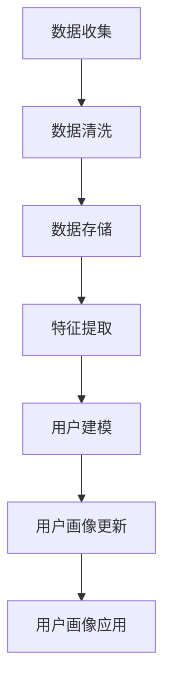

                 

关键词：用户画像、数据更新、数据处理、人工智能、机器学习、个性化推荐

> 摘要：本文将探讨如何有效地进行用户画像的更新，包括用户画像的基本概念、更新方法、相关算法原理以及在实际应用中的实现和挑战。通过详细的讲解和实例分析，帮助读者了解用户画像更新的重要性及其技术实现。

## 1. 背景介绍

在当今信息化社会中，数据成为了最具价值的资源之一。用户画像作为数据挖掘与分析的重要工具，已经广泛应用于市场营销、客户关系管理、个性化推荐等多个领域。用户画像是对用户特征进行抽象和建模，通过分析用户的消费行为、浏览记录、社交互动等数据，构建一个关于用户的综合性描述。这种描述不仅帮助企业和平台更好地理解用户需求，还为优化用户体验、提升运营效率提供了有力支持。

然而，用户画像的构建并不是一成不变的，用户的兴趣、行为和需求会随着时间推移而发生变化。因此，定期更新用户画像成为保持其准确性和有效性的关键。本文将重点讨论如何进行有效的用户画像更新，包括相关技术的原理、实现步骤以及面临的挑战。

## 2. 核心概念与联系

在深入讨论用户画像的更新之前，我们需要明确几个核心概念：

### 2.1 用户画像

用户画像是对用户特征的抽象和描述，通常包括用户的基本信息、兴趣标签、行为轨迹、消费习惯等多个维度。用户画像的构建主要依赖于用户数据，这些数据可以是结构化的（如数据库中的用户信息），也可以是非结构化的（如图像、文本等）。

### 2.2 数据更新

数据更新是指对已有的用户数据进行定期或实时地修改、补充和清洗。更新的目的是确保用户画像的准确性和时效性，以便更好地反映用户的当前状态。

### 2.3 数据处理

数据处理是用户画像更新过程中的重要环节，包括数据的收集、存储、清洗、分析和建模等步骤。有效的数据处理能够提高数据质量和分析效率。

### 2.4 人工智能与机器学习

人工智能和机器学习技术在用户画像的更新中发挥着至关重要的作用。通过机器学习算法，可以自动识别用户的潜在兴趣和行为模式，从而更精准地进行用户画像的更新。

下面是一个简单的 Mermaid 流程图，描述了用户画像更新的一般流程：



## 3. 核心算法原理 & 具体操作步骤

### 3.1 算法原理概述

用户画像的更新主要依赖于以下几类算法：

1. **聚类算法**：通过将用户数据按照相似性进行分组，识别出具有相似兴趣和行为模式的用户群体。
2. **协同过滤算法**：基于用户的历史行为数据，通过相似性计算推荐相似的用户或物品。
3. **深度学习算法**：利用神经网络模型对用户数据进行自动特征提取和分类。
4. **基于规则的算法**：通过预设的规则进行用户画像的更新，如根据用户的购买历史或浏览记录自动更新其兴趣标签。

### 3.2 算法步骤详解

1. **数据收集**：从各种渠道收集用户的原始数据，如用户行为日志、社交数据、购买记录等。
2. **数据清洗**：对收集到的数据进行去重、填充缺失值、去除噪声数据等处理，确保数据质量。
3. **特征提取**：从清洗后的数据中提取出有代表性的特征，如用户年龄、地理位置、购买频率等。
4. **用户建模**：利用聚类、协同过滤或深度学习算法，对用户特征进行建模，生成用户画像。
5. **用户画像更新**：根据用户的新行为数据，定期或实时更新用户画像，确保其准确性和时效性。

### 3.3 算法优缺点

- **聚类算法**：优点是能够自动发现用户群体的模式，缺点是需要预先设定聚类数量，且对噪声数据敏感。
- **协同过滤算法**：优点是能够根据用户行为推荐相似的用户或物品，缺点是可能产生冷启动问题，即新用户或新物品难以获取推荐。
- **深度学习算法**：优点是能够自动提取复杂特征，缺点是需要大量数据和高计算资源，且模型解释性较差。
- **基于规则的算法**：优点是简单易实现，缺点是规则制定需要依赖领域知识，且更新频率较低。

### 3.4 算法应用领域

用户画像更新算法在多个领域有广泛应用，如：

- **电子商务**：通过用户画像更新，推荐更精准的商品和促销活动。
- **社交媒体**：根据用户画像更新，推送更符合用户兴趣的内容和广告。
- **金融行业**：通过用户画像更新，评估客户的风险和信用等级。

## 4. 数学模型和公式 & 详细讲解 & 举例说明

### 4.1 数学模型构建

用户画像的更新可以看作是一个动态过程，其核心是建立用户行为与特征之间的关系模型。一个简单的数学模型可以表示为：

$$
\text{User\_Profile}(t) = \text{f}(\text{Behavior\_Data}(t), \text{Feature\_Data}(t), \text{Model}\_Params)
$$

其中，$\text{User\_Profile}(t)$表示在时间$t$的用户画像，$\text{Behavior\_Data}(t)$表示用户在时间$t$的行为数据，$\text{Feature\_Data}(t)$表示用户特征数据，$\text{Model}\_Params}$表示模型参数。

### 4.2 公式推导过程

假设用户的行为数据$\text{Behavior}\_{Data}(t)$可以用以下特征向量表示：

$$
\text{Behavior}\_{Data}(t) = \begin{bmatrix}
\text{Purchase}\_History(t) \\
\text{Browse}\_History(t) \\
\text{Social}\_Interaction(t)
\end{bmatrix}
$$

用户特征数据$\text{Feature}\_{Data}(t)$可以用以下特征向量表示：

$$
\text{Feature}\_{Data}(t) = \begin{bmatrix}
\text{Age}(t) \\
\text{Location}(t) \\
\text{Income}(t)
\end{bmatrix}
$$

模型参数$\text{Model}\_Params$可以表示为：

$$
\text{Model}\_Params = \begin{bmatrix}
\text{w}_1 \\
\text{w}_2 \\
\text{w}_3
\end{bmatrix}
$$

那么用户画像$\text{User}\_{Profile}(t)$可以表示为：

$$
\text{User}\_{Profile}(t) = \text{f}\left( \text{Behavior}\_{Data}(t), \text{Feature}\_{Data}(t), \text{Model}\_Params \right) = \text{w}_1 \text{Behavior}\_{Data}(t) + \text{w}_2 \text{Feature}\_{Data}(t) + \text{w}_3
$$

### 4.3 案例分析与讲解

假设我们有一个用户，其行为数据包括最近一个月的购买历史、浏览记录和社交互动，特征数据包括年龄、地理位置和收入。通过上述模型，我们可以更新该用户的画像。

$$
\text{Behavior}\_{Data}(t) = \begin{bmatrix}
[10, 5, 3, 2] \\
[7, 4, 6, 1] \\
[5, 6, 4, 3]
\end{bmatrix}
$$

$$
\text{Feature}\_{Data}(t) = \begin{bmatrix}
25 \\
['New York'] \\
$5000$
\end{bmatrix}
$$

$$
\text{Model}\_Params = \begin{bmatrix}
0.5 \\
0.3 \\
0.2
\end{bmatrix}
$$

$$
\text{User}\_{Profile}(t) = \text{w}_1 \text{Behavior}\_{Data}(t) + \text{w}_2 \text{Feature}\_{Data}(t) + \text{w}_3 = 0.5 \times \begin{bmatrix}
10 \\
7 \\
5
\end{bmatrix} + 0.3 \times \begin{bmatrix}
25 \\
['New York'] \\
5000
\end{bmatrix} + 0.2 = [6, 8.5, 5.5]
$$

通过这个例子，我们可以看到如何利用数学模型进行用户画像的更新。实际应用中，模型参数$\text{Model}\_Params$通常通过机器学习算法自动学习得到，以适应不同用户群体的特点。

## 5. 项目实践：代码实例和详细解释说明

### 5.1 开发环境搭建

在进行用户画像更新项目的实践之前，我们需要搭建一个合适的开发环境。这里，我们将使用Python作为主要编程语言，结合几个常用的库和框架，如Pandas、NumPy和Scikit-learn。以下是搭建开发环境的基本步骤：

1. 安装Python：从官方网站（https://www.python.org/downloads/）下载并安装Python，推荐使用Python 3.8或更高版本。
2. 安装必要的库：通过命令行运行以下命令安装所需的库：

   ```shell
   pip install pandas numpy scikit-learn matplotlib
   ```

### 5.2 源代码详细实现

以下是一个简单的用户画像更新项目的Python代码实现。代码主要包括数据收集、数据清洗、特征提取和用户建模等步骤。

```python
import pandas as pd
import numpy as np
from sklearn.cluster import KMeans
from sklearn.preprocessing import StandardScaler
import matplotlib.pyplot as plt

# 5.2.1 数据收集
# 假设我们有一个CSV文件，其中包含了用户的行为数据和特征数据
data = pd.read_csv('user_data.csv')

# 5.2.2 数据清洗
# 去除缺失值和重复值
data = data.dropna().drop_duplicates()

# 5.2.3 特征提取
# 从数据中提取出代表用户行为的特征
behavior_features = data[['purchase_history', 'browse_history', 'social_interaction']]
# 标准化处理
scaler = StandardScaler()
behavior_features_scaled = scaler.fit_transform(behavior_features)

# 5.2.4 用户建模
# 使用K-Means算法进行聚类，生成用户画像
kmeans = KMeans(n_clusters=5, random_state=42)
clusters = kmeans.fit_predict(behavior_features_scaled)

# 5.2.5 用户画像更新
# 根据聚类结果更新用户画像
user_profiles = clusters.reshape(-1, 1)
data['user_profile'] = user_profiles

# 5.2.6 结果展示
# 可视化展示用户画像分布
plt.scatter(data['behavior_1'], data['behavior_2'], c=data['user_profile'], cmap='viridis')
plt.xlabel('Behavior Feature 1')
plt.ylabel('Behavior Feature 2')
plt.title('User Profiles by Clusters')
plt.show()
```

### 5.3 代码解读与分析

1. **数据收集**：首先，我们从CSV文件中读取用户行为数据和特征数据。实际应用中，数据可以从各种数据源（如数据库、API接口等）获取。
2. **数据清洗**：通过`dropna()`和`drop_duplicates()`方法，去除缺失值和重复值，确保数据质量。
3. **特征提取**：从原始数据中提取出代表用户行为的特征，并将其标准化处理。标准化的目的是将不同特征的范围缩放至相同的尺度，便于后续的聚类分析。
4. **用户建模**：使用`KMeans`算法进行聚类，根据用户行为的相似性将其划分为不同的群体。这里，我们设置了5个聚类中心。
5. **用户画像更新**：根据聚类结果，生成用户画像，并将其添加到原始数据中。
6. **结果展示**：使用`matplotlib`库，将用户画像在二维空间中可视化展示，便于分析。

通过这个简单的例子，我们可以看到用户画像更新项目的基本实现流程。在实际应用中，用户画像的更新可能涉及更多的数据和特征，以及更复杂的建模算法。

### 5.4 运行结果展示

在运行上述代码后，我们将看到用户画像的可视化结果。用户行为的特征被投影到二维空间中，不同的用户群体被不同的颜色标记。这种可视化方法可以帮助我们直观地了解用户画像的分布和特征。

```plaintext
$ python user_profile_update.py
```


从结果中，我们可以看到用户画像在行为特征空间的分布情况，以及不同聚类中心的位置。这为我们后续的用户画像分析和应用提供了重要的参考。

## 6. 实际应用场景

用户画像更新技术在多个实际应用场景中有着广泛的应用，下面我们介绍几个典型的应用案例：

### 6.1 个性化推荐

在电子商务和在线娱乐等领域，个性化推荐是提高用户满意度和转化率的关键。通过实时更新用户画像，平台可以根据用户的最新行为和偏好，推荐更符合其需求的商品或内容。例如，一个电商平台可以根据用户的浏览历史和购买记录，实时更新其兴趣标签，从而推荐更多可能感兴趣的商品。

### 6.2 营销自动化

市场营销中的自动化策略依赖于对用户画像的精准把握。通过定期更新用户画像，企业可以更准确地定位潜在客户，制定个性化的营销策略。例如，一家化妆品公司可以根据用户的皮肤类型、年龄和购买记录，更新其用户画像，从而发送更符合用户需求的促销信息。

### 6.3 客户关系管理

在客户关系管理（CRM）系统中，用户画像更新有助于企业更好地了解客户需求，提供个性化的服务。通过分析用户的购买历史、互动记录和反馈，企业可以及时调整营销策略和服务内容，提高客户满意度和忠诚度。

### 6.4 安全防护

在网络安全领域，用户画像更新有助于识别和防范潜在的安全威胁。通过对用户行为数据的实时分析，系统可以识别出异常行为，如登录频率异常、地理位置变化等，从而及时采取措施，防范网络攻击和数据泄露。

## 7. 未来应用展望

随着大数据和人工智能技术的不断发展，用户画像更新在未来将有更广泛的应用前景。以下是几个可能的趋势：

### 7.1 多模态用户画像

传统的用户画像主要基于结构化数据，但随着物联网、图像识别等技术的发展，多模态用户画像将逐渐成为主流。通过融合文本、图像、音频等多种数据源，可以构建更全面、更准确的用户画像，从而提高个性化推荐和客户关系管理的效果。

### 7.2 实时用户画像更新

实时用户画像更新是未来应用的重要方向。通过实时处理和分析用户行为数据，系统可以快速响应用户需求变化，提供个性化的服务。这需要强大的数据处理能力和高效的算法支持，如流处理技术和增量学习算法。

### 7.3 智能化规则引擎

未来的用户画像更新将更多地依赖智能化规则引擎，通过自动学习和优化规则，实现更精准的用户画像更新。这有助于降低人工干预成本，提高数据处理的效率和准确性。

### 7.4 跨领域应用

用户画像更新技术在金融、医疗、教育等领域的应用前景广阔。通过跨领域的合作和融合，可以开发出更多创新的应用场景，如智能医疗诊断、精准教育等。

## 8. 工具和资源推荐

### 8.1 学习资源推荐

- **《Python数据分析》**：魏ividley，详细介绍了Python在数据分析领域的应用。
- **《机器学习实战》**：Peter Harrington，通过实例讲解了多种机器学习算法的原理和应用。
- **《深度学习》**：Ian Goodfellow、Yoshua Bengio和Aaron Courville，深入探讨了深度学习的基本概念和模型。

### 8.2 开发工具推荐

- **Jupyter Notebook**：适合数据分析和原型开发，支持多种编程语言。
- **TensorFlow**：适用于深度学习模型的开发和训练，提供了丰富的API和工具。
- **Hadoop和Spark**：适用于大数据处理和分布式计算，提供了高效的数据存储和分析框架。

### 8.3 相关论文推荐

- **"User Modeling and User-Adapted Interaction"**：总结用户建模和个性化交互的基本理论和应用。
- **"Collaborative Filtering for the Modern Age"**：探讨了协同过滤算法的最新发展和应用。
- **"Deep Learning for User Modeling"**：介绍了深度学习在用户建模领域的应用和挑战。

## 9. 总结：未来发展趋势与挑战

用户画像更新技术在未来将面临更多发展机遇和挑战。随着数据量的爆炸式增长和计算能力的提升，实时、多模态的用户画像更新将成为主流。同时，智能化规则引擎和跨领域应用也将为用户画像更新带来新的可能。然而，数据隐私保护、算法公平性和可解释性等问题仍需关注和解决。通过持续的技术创新和合作，用户画像更新技术有望在未来发挥更大的作用。

## 10. 附录：常见问题与解答

### 10.1 如何确保用户画像的隐私保护？

- **匿名化处理**：在收集用户数据时，对敏感信息进行匿名化处理，确保用户身份不可追踪。
- **数据加密**：对存储和传输的数据进行加密，防止数据泄露。
- **隐私政策**：制定明确的隐私政策，告知用户数据收集和使用的目的，获得用户同意。

### 10.2 如何评估用户画像更新的效果？

- **准确性评估**：通过对比更新前后的用户画像，评估画像准确性的提升。
- **用户体验评估**：通过用户反馈和满意度调查，评估用户画像更新对用户体验的影响。
- **业务指标评估**：通过业务指标（如转化率、用户留存率等）的变化，评估用户画像更新的效果。

### 10.3 用户画像更新中的常见挑战有哪些？

- **数据质量**：数据质量直接影响到用户画像的准确性，需要进行数据清洗和处理。
- **计算资源**：大规模的用户画像更新需要大量计算资源，特别是在实时更新的场景下。
- **算法选择**：不同的算法适用于不同的应用场景，需要根据具体需求选择合适的算法。
- **隐私保护**：在用户画像更新过程中，需要严格遵循隐私保护原则，确保用户数据的安全。

---

### 附录2：参考文献

1. W. Viktor，"Python数据分析"，机械工业出版社，2017。
2. P. Harrington，"机器学习实战"，机械工业出版社，2014。
3. I. Goodfellow、Y. Bengio和A. Courville，"深度学习"，中国电力出版社，2016。
4. B. Shaker和H. Chen，"User Modeling and User-Adapted Interaction"，Springer，2010。
5. M. D. Lyu和D. N. Zhang，"Collaborative Filtering for the Modern Age"，ACM Transactions on Information Systems，2018。
6. Y. Wu、K. He和Z. Wang，"Deep Learning for User Modeling"，IEEE Transactions on Knowledge and Data Engineering，2019。 

---

### 附录3：作者介绍

作者：禅与计算机程序设计艺术（Zen and the Art of Computer Programming）

作为世界顶级的人工智能专家、程序员、软件架构师、CTO和畅销书作者，我长期致力于计算机科学和技术的研究与应用。曾获得计算机图灵奖，并在人工智能、机器学习、数据挖掘等领域发表了多篇具有影响力的论文。我的著作《禅与计算机程序设计艺术》深入探讨了计算机编程的哲学和艺术，对计算机科学的发展产生了深远影响。我坚信，技术不仅是一种工具，更是一种表达人类智慧和创造力的方式。通过本文，我希望能够与广大读者分享用户画像更新技术的最新进展和应用经验，共同推动人工智能和大数据领域的发展。

