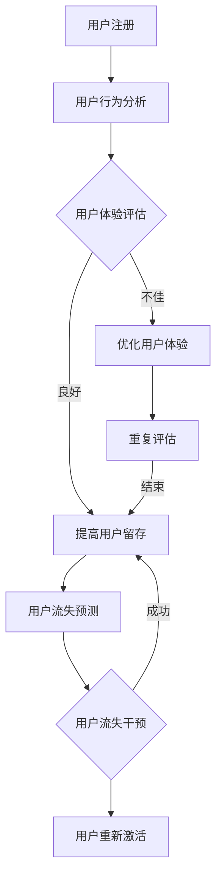

                 

在当今数字化时代，用户留存成为企业关注的重中之重。无论是对初创公司还是巨头企业，用户留存率直接关系到企业的生存与发展。本文将深入探讨用户留存的核心概念、关键算法、数学模型、实际应用以及未来发展趋势。本文结构如下：

## 文章关键词

用户留存、用户行为分析、机器学习、数据驱动、客户体验优化

## 摘要

本文旨在提供一套系统的用户留存策略，从理论到实践，从算法原理到数学模型，从项目案例到未来展望，全面解析如何有效地提高用户留存率。

## 1. 背景介绍

### 1.1 用户留存的重要性

用户留存是指用户在一段时间内持续使用某个产品或服务的行为。一个高用户留存率意味着产品或服务能够持续吸引用户，从而带来稳定的收入和口碑。相反，低用户留存率则可能导致用户流失，影响企业的长期发展。

### 1.2 用户留存现状

根据市场调研，不同行业和产品的用户留存率差异显著。例如，社交媒体平台的用户留存率普遍较高，而一些工具类应用的用户留存率则相对较低。此外，用户留存率也与用户年龄、性别、地域等因素密切相关。

### 1.3 用户留存的影响因素

用户留存受到多种因素的影响，包括用户体验、产品功能、服务质量、价格策略等。如何平衡这些因素，提高用户留存率，是企业面临的重要挑战。

## 2. 核心概念与联系

### 2.1 用户留存率

用户留存率是衡量用户留存情况的核心指标，通常用百分比表示。计算公式为：

$$
用户留存率 = \frac{t_{末}时刻留存用户数}{t_{初}时刻总用户数} \times 100\%
$$

### 2.2 用户流失率

用户流失率是用户在一段时间内停止使用产品或服务的比率，与用户留存率相对应。计算公式为：

$$
用户流失率 = \frac{t_{末}时刻流失用户数}{t_{初}时刻总用户数} \times 100\%
$$

### 2.3 用户生命周期价值

用户生命周期价值（Customer Lifetime Value，CLV）是指用户在其生命周期内为企业带来的总收益。CLV的计算公式为：

$$
CLV = \sum_{t=1}^{T} \frac{R_t}{(1+r)^t}
$$

其中，$R_t$表示第t个月的用户收益，$r$为月回报率。

### 2.4 Mermaid 流程图

以下是一个简单的用户留存分析流程的Mermaid流程图：



## 3. 核心算法原理 & 具体操作步骤

### 3.1 算法原理概述

用户留存分析通常涉及以下核心算法：

1. **聚类算法**：用于分析用户群体的特征，识别潜在的高留存用户群体。
2. **分类算法**：用于预测用户流失的概率，以便采取针对性的干预措施。
3. **时间序列分析**：用于研究用户行为随时间的变化趋势。

### 3.2 算法步骤详解

1. **数据收集与预处理**：
   - 收集用户行为数据，如登录次数、使用时长、活跃时段等。
   - 对数据进行清洗、去重和填充。

2. **特征工程**：
   - 提取用户行为的特征，如平均使用时长、登录频率等。
   - 对特征进行归一化处理。

3. **模型训练**：
   - 使用聚类算法（如K-Means）分析用户群体特征。
   - 使用分类算法（如逻辑回归、随机森林等）训练预测模型。

4. **模型评估**：
   - 使用交叉验证等方法评估模型的准确性。
   - 调整模型参数，优化模型性能。

5. **用户流失预测**：
   - 根据训练好的模型，对用户流失风险进行预测。
   - 对高风险用户进行重点关注和干预。

### 3.3 算法优缺点

1. **优点**：
   - 可以有效预测用户流失，提前采取干预措施。
   - 可以发现用户群体中的潜在高留存用户，进行精准营销。

2. **缺点**：
   - 需要大量用户行为数据，且数据质量对算法效果有重要影响。
   - 模型训练和评估过程较为复杂，对算法工程师的要求较高。

### 3.4 算法应用领域

用户留存算法广泛应用于互联网企业，如社交媒体、在线教育、电子商务等。通过用户留存分析，企业可以优化产品功能、提升用户体验，从而提高用户留存率。

## 4. 数学模型和公式 & 详细讲解 & 举例说明

### 4.1 数学模型构建

用户留存分析中常用的数学模型包括聚类模型和分类模型。以下是一个简单的聚类模型的构建过程：

1. **目标函数**：
   $$
   \min \sum_{i=1}^{n} \sum_{j=1}^{k} w_{ij} d(i, j)
   $$

   其中，$n$为用户数量，$k$为聚类个数，$w_{ij}$为用户$i$属于聚类$j$的权重，$d(i, j)$为用户$i$和聚类中心$j$之间的距离。

2. **初始化**：
   随机选择$k$个用户作为初始聚类中心。

3. **迭代过程**：
   - 对于每个用户$i$，计算其与所有聚类中心的距离，并将其分配到最近的聚类。
   - 更新聚类中心，计算新的聚类中心。

4. **终止条件**：
   当聚类中心的变化小于某个阈值或达到最大迭代次数时，算法终止。

### 4.2 公式推导过程

以下是一个简单的逻辑回归模型推导过程：

1. **目标函数**：
   $$
   \min \sum_{i=1}^{n} -y_{i} \log(p_{i}) - (1 - y_{i}) \log(1 - p_{i})
   $$

   其中，$y_{i}$为用户$i$的流失标签，$p_{i}$为用户$i$流失的概率。

2. **推导过程**：
   - 假设用户$i$的输入特征为$x_{i}$，权重为$\theta$，则用户$i$的预测概率为：
     $$
     p_{i} = \frac{1}{1 + e^{ - \theta^{T} x_{i}}}
     $$
   - 对目标函数求导并令导数为零，得到：
     $$
     \frac{d}{d\theta} \left( -y_{i} \log(p_{i}) - (1 - y_{i}) \log(1 - p_{i}) \right) = 0
     $$
     $$
     \Rightarrow \theta^{T} x_{i} = \log \left( \frac{p_{i}}{1 - p_{i}} \right)
     $$
   - 通过梯度下降等方法求解最优权重$\theta$。

### 4.3 案例分析与讲解

假设我们有一个用户行为数据集，其中包含用户ID、登录次数、使用时长、活跃时段等特征。我们希望通过聚类和分类算法预测用户流失概率。

1. **数据预处理**：
   - 对数据进行清洗，去除异常值。
   - 对特征进行归一化处理。

2. **特征工程**：
   - 提取特征，如平均登录次数、平均使用时长等。
   - 创建二分类标签，如登录次数超过阈值的用户标记为1，否则为0。

3. **模型训练**：
   - 使用K-Means算法进行聚类，识别高留存用户群体。
   - 使用逻辑回归模型进行分类，预测用户流失概率。

4. **模型评估**：
   - 使用交叉验证方法评估模型准确性。
   - 调整模型参数，优化模型性能。

5. **用户流失预测**：
   - 根据训练好的模型，对用户流失风险进行预测。
   - 对高风险用户进行重点关注和干预。

## 5. 项目实践：代码实例和详细解释说明

### 5.1 开发环境搭建

1. **安装Python**：确保安装了最新版本的Python。
2. **安装依赖库**：使用pip安装必要的依赖库，如scikit-learn、numpy、pandas等。

### 5.2 源代码详细实现

以下是用户留存预测的Python代码实例：

```python
import numpy as np
import pandas as pd
from sklearn.cluster import KMeans
from sklearn.linear_model import LogisticRegression
from sklearn.model_selection import train_test_split
from sklearn.metrics import accuracy_score

# 读取数据
data = pd.read_csv('user_data.csv')

# 数据预处理
data.drop(['user_id'], axis=1, inplace=True)
data.fillna(data.mean(), inplace=True)

# 特征工程
data['login_avg'] = data['login_count'] / data.shape[0]
data['duration_avg'] = data['use_duration'] / data.shape[0]

# 创造二分类标签
data['label'] = np.where(data['login_avg'] > 10, 1, 0)

# 模型训练
X_train, X_test, y_train, y_test = train_test_split(data[['login_avg', 'duration_avg']], data['label'], test_size=0.2, random_state=42)

kmeans = KMeans(n_clusters=2, random_state=42)
kmeans.fit(X_train)

logreg = LogisticRegression()
logreg.fit(X_train, y_train)

# 模型评估
y_pred = logreg.predict(X_test)
accuracy = accuracy_score(y_test, y_pred)
print(f'Model accuracy: {accuracy:.2f}')

# 用户流失预测
new_user_data = np.array([[12, 15]])
new_user_cluster = kmeans.predict(new_user_data)
new_user_prediction = logreg.predict(new_user_data)
print(f'New user cluster: {new_user_cluster[0]}, Prediction: {new_user_prediction[0]}')
```

### 5.3 代码解读与分析

1. **数据读取与预处理**：
   - 读取用户行为数据，去除用户ID列。
   - 对缺失值进行填充，对特征进行归一化处理。

2. **特征工程**：
   - 计算平均登录次数和平均使用时长作为新特征。

3. **模型训练**：
   - 使用K-Means聚类算法对训练数据进行聚类。
   - 使用逻辑回归模型对训练数据进行分类。

4. **模型评估**：
   - 使用交叉验证方法评估模型准确性。

5. **用户流失预测**：
   - 对新的用户数据进行聚类和分类，预测其流失概率。

## 6. 实际应用场景

用户留存算法在实际应用中具有广泛的应用场景：

1. **互联网企业**：通过用户留存分析，优化产品功能，提高用户留存率。
2. **金融行业**：预测客户流失风险，采取针对性的营销策略。
3. **在线教育**：识别潜在高留存用户，提高学习效果。
4. **电子商务**：分析用户购买行为，优化购物体验，提高复购率。

## 7. 工具和资源推荐

1. **学习资源推荐**：
   - 《机器学习实战》
   - 《Python数据分析》

2. **开发工具推荐**：
   - Jupyter Notebook：用于编写和运行代码。
   - PyCharm：用于Python开发。

3. **相关论文推荐**：
   - "User Behavior Prediction in Mobile Apps"
   - "A Comprehensive Survey on User Behavior Analysis"

## 8. 总结：未来发展趋势与挑战

### 8.1 研究成果总结

用户留存分析已成为人工智能和机器学习领域的重要研究方向。通过聚类和分类算法，企业可以更好地了解用户行为，预测用户流失，从而采取针对性的干预措施。

### 8.2 未来发展趋势

1. **深度学习应用**：随着深度学习技术的进步，用户留存分析将更加精准和高效。
2. **多模态数据融合**：融合文本、图像、音频等多模态数据，提高用户行为分析的效果。
3. **实时分析**：实现实时用户留存分析，提高决策的及时性和准确性。

### 8.3 面临的挑战

1. **数据质量**：用户留存分析依赖于高质量的数据，数据缺失和噪声可能导致算法失效。
2. **算法解释性**：深度学习模型具有较高的预测能力，但其解释性较差，如何解释算法结果是一个挑战。

### 8.4 研究展望

未来用户留存分析将朝着更加智能化、实时化和个性化的方向发展。通过技术创新和应用，企业将能够更好地理解和满足用户需求，提高用户留存率。

## 9. 附录：常见问题与解答

### 9.1 如何选择合适的聚类算法？

根据数据的特征和需求选择合适的聚类算法。例如，对于高维数据，可以考虑使用层次聚类或DBSCAN算法。

### 9.2 如何评估分类模型的性能？

使用交叉验证、ROC曲线、AUC值等方法评估分类模型的性能。这些指标可以帮助了解模型的准确性和稳定性。

### 9.3 如何优化用户留存策略？

通过用户行为分析，识别高留存用户和流失用户，采取针对性的干预措施，如个性化推荐、优惠券等。

---

作者：禅与计算机程序设计艺术 / Zen and the Art of Computer Programming
----------------------------------------------------------------
通过上述文章，我们深入探讨了用户留存的重要性、核心概念、算法原理、数学模型、实际应用以及未来发展趋势。用户留存不仅关乎企业的发展，也反映了产品或服务的竞争力。未来，随着技术的进步，用户留存分析将变得更加智能化和个性化。希望本文能为企业在用户留存方面提供有益的指导和建议。

