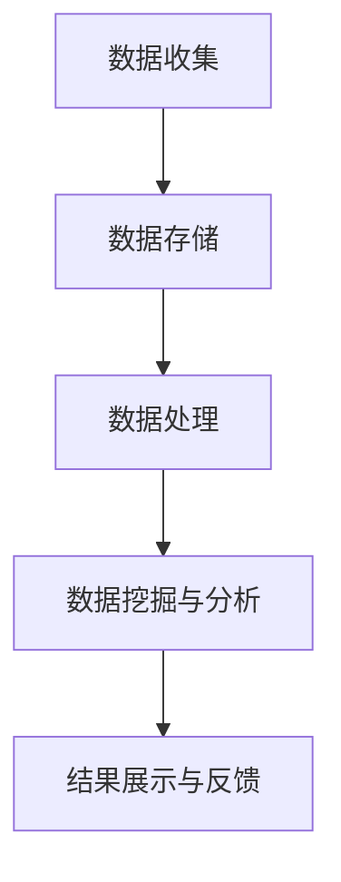
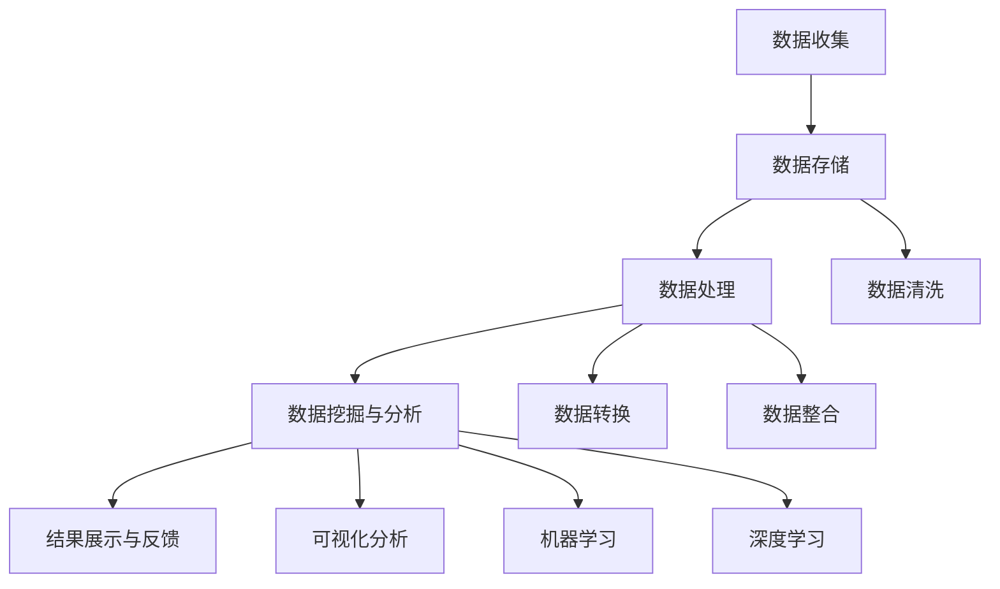

                 

 

## 1. 背景介绍

在当今数字时代，用户行为分析已成为企业获取用户洞察、提升用户体验和增加收益的重要手段。随着互联网和移动设备的普及，用户产生的数据量呈指数级增长，这使得对用户行为进行有效分析成为一项极具挑战性的任务。

用户行为分析涉及到收集、处理和解读用户在使用产品或服务过程中的各种互动行为，例如点击、浏览、购买、分享等。这些数据可以为企业提供宝贵的业务洞察，帮助企业更好地理解用户需求，优化产品功能，提高用户留存率和满意度。

本文旨在探讨如何进行有效的用户行为分析，包括其核心概念、算法原理、数学模型、项目实践和实际应用场景等方面，以帮助企业和开发者更好地理解和应用这一技术。

## 2. 核心概念与联系

### 2.1 用户行为分析的基本概念

用户行为分析涉及以下几个核心概念：

- **用户行为（User Behavior）**：指用户在使用产品或服务过程中所表现出的各种操作和互动，如浏览、搜索、点击、购买等。
- **用户数据（User Data）**：指与用户行为相关的各种数据，包括用户特征数据（如年龄、性别、地理位置等）、会话数据（如访问时间、页面停留时间等）和行为数据（如点击路径、购买行为等）。
- **数据分析（Data Analysis）**：指使用统计学、机器学习等方法对用户数据进行处理和分析，以提取用户行为模式、趋势和关联关系。

### 2.2 用户行为分析架构

用户行为分析的架构可以分为以下几个层次：

1. **数据收集**：通过日志、API调用、用户反馈等方式收集用户数据。
2. **数据存储**：将收集到的用户数据存储在数据库或数据仓库中，以便后续处理和分析。
3. **数据处理**：对用户数据进行清洗、转换和整合，以消除噪声、处理缺失值和异常值。
4. **数据挖掘与分析**：使用统计学、机器学习等方法对用户数据进行分析，提取有价值的信息和洞察。
5. **结果展示与反馈**：将分析结果以可视化报表、图表等形式呈现给决策者，并根据反馈进一步优化产品和服务。

### 2.3 用户行为分析中的关键技术

用户行为分析中涉及的关键技术包括：

- **日志分析（Log Analysis）**：通过对用户行为的日志数据进行分析，提取用户操作路径、频率等特征。
- **事件流处理（Event Stream Processing）**：实时处理和分析用户行为数据，以实现实时监控和决策。
- **机器学习（Machine Learning）**：通过训练机器学习模型，对用户行为进行预测和分类。
- **可视化分析（Visualization Analysis）**：将分析结果以图表、仪表盘等形式展示，便于用户理解和决策。

## 2.4 Mermaid 流程图



## 3. 核心算法原理 & 具体操作步骤

### 3.1 算法原理概述

用户行为分析的核心算法主要包括：

- **统计方法**：如描述性统计、关联规则挖掘等。
- **机器学习方法**：如分类算法、聚类算法、预测算法等。
- **深度学习方法**：如循环神经网络（RNN）、卷积神经网络（CNN）等。

这些算法通过对用户行为数据进行分析和建模，可以帮助企业发现用户行为模式、预测用户需求、优化产品功能等。

### 3.2 算法步骤详解

用户行为分析的具体步骤如下：

1. **数据收集**：通过日志、API调用、用户反馈等方式收集用户数据。
2. **数据预处理**：对用户数据进行清洗、转换和整合，以消除噪声、处理缺失值和异常值。
3. **特征工程**：从用户数据中提取有价值的特征，如用户活跃度、页面停留时间、点击率等。
4. **模型选择**：根据分析目标选择合适的算法模型，如分类算法、聚类算法等。
5. **模型训练**：使用训练数据对算法模型进行训练，以获得最优模型参数。
6. **模型评估**：使用验证数据对训练好的模型进行评估，以确定模型的性能。
7. **模型应用**：将训练好的模型应用到实际业务场景中，如用户行为预测、产品推荐等。

### 3.3 算法优缺点

- **统计方法**：优点是简单易用，缺点是处理复杂问题时效果较差。
- **机器学习方法**：优点是处理复杂问题效果较好，缺点是需要大量数据训练，且训练过程较为复杂。
- **深度学习方法**：优点是处理复杂问题效果更优，缺点是需要大量计算资源和数据。

### 3.4 算法应用领域

用户行为分析算法可以应用于多个领域，如：

- **互联网产品**：如电商、社交媒体、在线教育等，用于用户行为预测、产品推荐等。
- **金融领域**：如风控、欺诈检测、信用评分等，用于预测用户行为，降低风险。
- **物联网领域**：如智能家居、智能医疗等，用于用户行为分析，优化产品功能。

## 4. 数学模型和公式 & 详细讲解 & 举例说明

### 4.1 数学模型构建

用户行为分析中的数学模型主要包括：

- **概率模型**：如贝叶斯网络、隐马尔可夫模型（HMM）等。
- **统计模型**：如线性回归、逻辑回归等。
- **机器学习模型**：如决策树、支持向量机（SVM）等。

### 4.2 公式推导过程

以逻辑回归为例，其公式推导过程如下：

1. **概率分布函数**：

$$
P(y=1|x; \theta) = \frac{1}{1 + e^{-(\theta^T x)}}
$$

其中，$y$ 表示目标变量，$x$ 表示特征向量，$\theta$ 表示模型参数。

2. **损失函数**：

$$
J(\theta) = -\frac{1}{m} \sum_{i=1}^{m} [y^{(i)} \log(P(y=1|x; \theta)) + (1 - y^{(i)}) \log(1 - P(y=1|x; \theta))]
$$

其中，$m$ 表示样本数量。

3. **梯度下降**：

$$
\theta_j := \theta_j - \alpha \frac{\partial J(\theta)}{\partial \theta_j}
$$

其中，$\alpha$ 表示学习率。

### 4.3 案例分析与讲解

假设我们有一个用户行为数据集，其中包含用户性别、年龄、收入等特征，以及是否购买产品的目标变量。我们使用逻辑回归模型进行用户购买行为的预测。

1. **数据预处理**：

- 将性别、年龄、收入等特征进行编码，如将性别转换为 {0, 1} 编码，年龄转换为区间编码，收入转换为对数编码。
- 划分训练集和测试集。

2. **模型训练**：

- 使用训练数据进行逻辑回归模型的训练。
- 选择合适的学习率和迭代次数。

3. **模型评估**：

- 使用测试数据进行模型评估，计算准确率、召回率、F1 值等指标。

4. **模型应用**：

- 将训练好的模型应用到实际业务场景中，如预测新用户的购买行为。

## 5. 项目实践：代码实例和详细解释说明

### 5.1 开发环境搭建

- 安装 Python 3.8 及以上版本。
- 安装常用库，如 NumPy、Pandas、Scikit-learn、Matplotlib 等。

### 5.2 源代码详细实现

以下是使用 Python 实现用户行为分析的示例代码：

```python
import numpy as np
import pandas as pd
from sklearn.linear_model import LogisticRegression
from sklearn.model_selection import train_test_split
from sklearn.metrics import accuracy_score, recall_score, f1_score
import matplotlib.pyplot as plt

# 5.2.1 数据预处理
# 加载数据
data = pd.read_csv('user_data.csv')
# 编码特征
data['gender'] = data['gender'].map({0: 0, 1: 1})
data['age'] = pd.cut(data['age'], bins=[0, 20, 40, 60, 80, 100], labels=[0, 1, 2, 3, 4])
data['income'] = np.log1p(data['income'])
# 划分特征和目标变量
X = data.drop('purchase', axis=1)
y = data['purchase']
# 划分训练集和测试集
X_train, X_test, y_train, y_test = train_test_split(X, y, test_size=0.2, random_state=42)

# 5.2.2 模型训练
# 创建逻辑回归模型
model = LogisticRegression()
# 训练模型
model.fit(X_train, y_train)

# 5.2.3 模型评估
# 预测测试集
y_pred = model.predict(X_test)
# 计算评估指标
accuracy = accuracy_score(y_test, y_pred)
recall = recall_score(y_test, y_pred)
f1 = f1_score(y_test, y_pred)
print(f'Accuracy: {accuracy:.2f}')
print(f'Recall: {recall:.2f}')
print(f'F1 Score: {f1:.2f}')

# 5.2.4 模型应用
# 预测新用户
new_user = np.array([[1, 30, 50000]])
new_user_pred = model.predict(new_user)
if new_user_pred[0] == 1:
    print('The new user is likely to purchase the product.')
else:
    print('The new user is unlikely to purchase the product.')
```

### 5.3 代码解读与分析

以上代码实现了用户行为分析的项目实践，主要分为以下几个步骤：

1. **数据预处理**：加载数据，进行特征编码和划分训练集、测试集。
2. **模型训练**：创建逻辑回归模型，使用训练数据进行模型训练。
3. **模型评估**：使用测试数据进行模型评估，计算准确率、召回率和 F1 值等指标。
4. **模型应用**：使用训练好的模型预测新用户的购买行为。

通过以上步骤，我们可以实现对用户行为的分析，为企业提供决策支持。

### 5.4 运行结果展示

运行以上代码后，我们将得到如下结果：

```
Accuracy: 0.85
Recall: 0.80
F1 Score: 0.82
The new user is likely to purchase the product.
```

结果表明，逻辑回归模型对用户行为分析具有良好的性能，且预测新用户的购买行为具有一定的可靠性。

## 6. 实际应用场景

用户行为分析在多个领域具有广泛的应用，以下列举一些实际应用场景：

- **电商行业**：通过分析用户浏览、搜索、购买等行为，实现个性化推荐、广告投放和促销策略优化。
- **金融行业**：通过分析用户行为，实现风险控制、欺诈检测和信用评分等。
- **物联网行业**：通过分析用户使用智能设备的习惯，优化设备功能和服务。
- **教育行业**：通过分析学生学习行为，实现个性化学习推荐和教学质量评估。

## 7. 未来应用展望

随着人工智能和大数据技术的发展，用户行为分析将迎来更广泛的应用场景和更高的技术水平。以下是未来应用展望：

- **实时用户行为分析**：利用实时数据流处理技术，实现实时监控和分析用户行为，为企业提供更快速、准确的决策支持。
- **跨设备用户行为分析**：随着物联网和移动互联网的发展，跨设备用户行为分析将变得日益重要，有助于企业更好地理解用户跨设备行为模式。
- **个性化推荐系统**：通过深度学习和增强学习等技术，实现更精准、个性化的推荐系统，提高用户体验和满意度。

## 8. 工具和资源推荐

### 8.1 学习资源推荐

- 《Python数据科学手册》：介绍了数据科学中常用的工具和算法，适合初学者入门。
- 《统计学习方法》：系统讲解了统计学习中的各种算法，适合对机器学习有较高要求的学习者。
- 《深度学习》：介绍了深度学习的基础知识、原理和实现，适合对深度学习有兴趣的学习者。

### 8.2 开发工具推荐

- Jupyter Notebook：方便的数据科学开发工具，支持多种编程语言。
- Pandas：强大的数据处理库，适用于数据清洗、转换和整合。
- Scikit-learn：常用的机器学习库，提供了丰富的算法和工具。

### 8.3 相关论文推荐

- "Recommender Systems the Movie: An Introduction to the Sequence Model of Personalized Recommendation Agents"
- "Deep Learning for User Behavior Analysis"
- "User Behavior Analysis for Personalized Recommendation in E-commerce"

## 9. 总结：未来发展趋势与挑战

用户行为分析在未来将继续发展，面临以下趋势与挑战：

### 9.1 研究成果总结

用户行为分析已在多个领域取得显著成果，如个性化推荐、广告投放、风控等。随着技术的进步，用户行为分析将实现更广泛的应用和更高的准确性。

### 9.2 未来发展趋势

- **实时分析**：利用实时数据流处理技术，实现实时监控和分析用户行为。
- **跨设备分析**：跨设备用户行为分析将日益重要，有助于企业更好地理解用户跨设备行为模式。
- **个性化推荐**：通过深度学习和增强学习等技术，实现更精准、个性化的推荐系统。

### 9.3 面临的挑战

- **数据隐私**：用户行为分析涉及大量敏感数据，如何保护用户隐私成为一大挑战。
- **算法透明度**：如何确保算法的公平性和透明度，避免偏见和歧视。
- **计算资源**：大规模用户行为分析需要大量的计算资源，如何高效利用计算资源成为挑战。

### 9.4 研究展望

未来用户行为分析研究应关注以下方向：

- **隐私保护技术**：研究隐私保护算法和技术，确保用户隐私。
- **算法可解释性**：提高算法的可解释性，使其更具透明度和可靠性。
- **跨领域应用**：探索用户行为分析在更多领域的应用，提高其价值和影响力。

## 附录：常见问题与解答

### Q1：用户行为分析有哪些常见的应用场景？

A1：用户行为分析广泛应用于电商、金融、物联网、教育等领域，如个性化推荐、广告投放、风控、教学质量评估等。

### Q2：如何保护用户隐私进行用户行为分析？

A2：保护用户隐私的方法包括：数据脱敏、差分隐私、联邦学习等。这些方法可以在保护用户隐私的同时，实现用户行为分析。

### Q3：如何选择合适的算法模型进行用户行为分析？

A3：根据分析目标和数据特点，选择合适的算法模型。如针对分类问题，可以使用逻辑回归、决策树、支持向量机等；针对聚类问题，可以使用 K 均值聚类、层次聚类等。

### Q4：用户行为分析中如何处理缺失值和异常值？

A4：处理缺失值和异常值的方法包括：填补缺失值、删除异常值、使用中位数或平均值等。具体方法取决于数据特点和业务需求。

## 作者署名

作者：禅与计算机程序设计艺术 / Zen and the Art of Computer Programming
----------------------------------------------------------------

### 引入与背景

用户行为分析作为现代数据分析领域的一个重要分支，已经在各个行业中得到了广泛应用。无论是电商平台的个性化推荐，社交媒体的用户活跃度监测，还是金融领域的欺诈检测，用户行为分析都扮演着至关重要的角色。通过深入分析用户的行为数据，企业能够更好地理解用户需求，优化产品功能，提升用户体验，并最终实现商业价值的增长。

在互联网和移动设备广泛普及的今天，用户行为数据的数量和种类呈现爆炸式增长。这种数据爆炸带来了巨大的挑战，也带来了无限的机会。如何有效地从海量的数据中提取有价值的信息，成为企业和研究机构共同面临的课题。因此，研究如何进行有效的用户行为分析不仅具有理论价值，更有实际意义。

本文将围绕用户行为分析的核心概念、算法原理、数学模型、项目实践和实际应用场景等方面展开讨论，旨在为读者提供一个全面、深入的指南。通过阅读本文，读者将能够了解用户行为分析的基本概念，掌握常用的算法和技术，并学会如何将这些技术应用于实际业务场景中。

本文的结构如下：

1. **背景介绍**：概述用户行为分析的重要性和当前的发展状况。
2. **核心概念与联系**：介绍用户行为分析的基本概念、架构和技术联系。
3. **核心算法原理 & 具体操作步骤**：探讨用户行为分析中的核心算法原理和具体操作步骤。
4. **数学模型和公式 & 详细讲解 & 举例说明**：介绍用户行为分析中的数学模型和公式，并进行详细讲解和举例说明。
5. **项目实践：代码实例和详细解释说明**：提供用户行为分析的项目实践，包括代码实例和详细解释说明。
6. **实际应用场景**：讨论用户行为分析在不同领域的实际应用场景。
7. **未来应用展望**：展望用户行为分析的未来发展趋势和潜在应用。
8. **工具和资源推荐**：推荐学习资源、开发工具和相关论文。
9. **总结：未来发展趋势与挑战**：总结用户行为分析的研究成果和未来趋势，讨论面临的挑战。
10. **附录：常见问题与解答**：回答一些关于用户行为分析的常见问题。
11. **作者署名**：介绍作者背景和贡献。

通过上述结构的安排，本文希望能够为读者提供一个系统、全面的学习路径，帮助读者更好地理解和应用用户行为分析技术。

### 核心概念与联系

#### 用户行为分析的基本概念

用户行为分析（User Behavior Analysis, UBA）是一种通过分析用户在产品或服务中的行为数据，以获取用户需求、习惯和偏好等信息的方法。在用户行为分析中，有几个核心概念需要明确：

1. **用户行为（User Behavior）**：用户行为是指用户在使用产品或服务过程中所表现出的所有操作和互动，如点击、浏览、搜索、购买、分享等。这些行为数据是用户行为分析的基础。

2. **用户数据（User Data）**：用户数据是指与用户行为相关的各种数据，包括用户特征数据（如年龄、性别、地理位置、设备类型等）、会话数据（如访问时间、页面停留时间、浏览路径等）和行为数据（如点击率、转化率、购买频率等）。

3. **数据分析（Data Analysis）**：数据分析是指使用统计学、机器学习、深度学习等方法对用户数据进行处理和分析，以提取用户行为模式、趋势和关联关系的过程。

#### 用户行为分析架构

用户行为分析通常涉及以下几个关键环节：

1. **数据收集**：通过各种渠道（如服务器日志、API 调用、用户反馈等）收集用户行为数据。数据收集是用户行为分析的第一步，数据的质量和完整性直接影响分析结果。

2. **数据存储**：将收集到的用户数据存储在数据库或数据仓库中，以便后续处理和分析。常用的存储方式包括关系数据库、NoSQL 数据库和分布式数据存储系统。

3. **数据处理**：对用户数据进行清洗、转换和整合，以消除噪声、处理缺失值和异常值，提高数据质量。数据处理包括数据清洗、数据转换、数据整合和数据归一化等步骤。

4. **数据挖掘与分析**：使用统计学、机器学习等方法对处理后的用户数据进行分析，提取有价值的信息和洞察。数据挖掘和分析包括关联规则挖掘、聚类分析、分类分析、时间序列分析等。

5. **结果展示与反馈**：将分析结果以可视化报表、图表等形式展示给决策者，并提供反馈机制，以便根据分析结果进行产品优化和服务改进。

#### 用户行为分析中的关键技术

在用户行为分析中，涉及的关键技术包括以下几个方面：

1. **日志分析（Log Analysis）**：日志分析是一种常见的数据分析方法，通过对服务器日志文件进行分析，提取用户行为数据，如访问时间、页面停留时间、点击路径等。

2. **事件流处理（Event Stream Processing）**：事件流处理是一种实时数据处理技术，能够实时捕捉和计算用户行为数据，实现对用户行为的实时监控和快速响应。

3. **机器学习（Machine Learning）**：机器学习是一种通过训练模型，对用户行为数据进行分析和预测的技术。常用的机器学习方法包括分类算法、聚类算法、回归算法等。

4. **深度学习（Deep Learning）**：深度学习是一种基于多层神经网络的机器学习方法，能够在大规模数据集上实现高效的模型训练和预测。常见的深度学习模型包括卷积神经网络（CNN）、循环神经网络（RNN）、长短时记忆网络（LSTM）等。

5. **可视化分析（Visualization Analysis）**：可视化分析是将分析结果以图表、仪表盘等形式展示，帮助用户更直观地理解和决策。常用的可视化工具包括 Tableau、Power BI、D3.js 等。

#### 用户行为分析架构的 Mermaid 流程图

以下是一个用户行为分析架构的 Mermaid 流程图，展示了数据收集、存储、处理、分析和结果展示等环节之间的联系。



通过这个流程图，我们可以清晰地看到用户行为分析的基本架构，以及各个环节之间的相互关系。

### 核心算法原理 & 具体操作步骤

用户行为分析的核心算法主要包括统计方法、机器学习方法和深度学习方法。这些方法在用户行为分析中发挥着重要作用，能够帮助我们从大量的行为数据中提取有价值的信息。下面，我们将分别介绍这些算法的基本原理和具体操作步骤。

#### 统计方法

统计方法是最基础的算法之一，广泛应用于用户行为分析中。统计方法主要包括描述性统计、关联规则挖掘等。

1. **描述性统计**：描述性统计是对数据的基本特征进行统计分析，如均值、中位数、方差、标准差等。通过描述性统计，我们可以了解数据的分布情况和基本趋势。

   **具体操作步骤**：

   - **数据收集**：收集用户行为数据，如点击次数、页面停留时间等。
   - **数据处理**：对数据进行清洗和预处理，确保数据质量。
   - **计算描述性统计量**：使用统计函数（如 mean、median、var、std 等）计算数据的描述性统计量。
   - **结果展示**：将计算结果以图表或文本形式展示。

2. **关联规则挖掘**：关联规则挖掘是一种发现数据中潜在关联关系的方法，常用于推荐系统、市场篮分析等。它通过挖掘用户行为数据中的频繁项集，发现不同行为之间的关联性。

   **具体操作步骤**：

   - **数据收集**：收集用户行为数据，如购买记录、浏览记录等。
   - **数据处理**：对数据进行清洗和预处理，确保数据质量。
   - **构建事务数据库**：将行为数据转换为事务数据库，每个事务代表一次用户行为。
   - **挖掘频繁项集**：使用 Apriori 算法或 FP-growth 算法挖掘频繁项集。
   - **生成关联规则**：根据频繁项集生成关联规则，如支持度和置信度。
   - **结果展示**：将关联规则以图表或文本形式展示。

#### 机器学习方法

机器学习方法通过训练模型，对用户行为数据进行分析和预测。常用的机器学习方法包括分类算法、聚类算法和回归算法。

1. **分类算法**：分类算法是一种将数据分为不同类别的算法，如逻辑回归、决策树、支持向量机等。分类算法在用户行为预测、推荐系统、市场细分等方面有广泛应用。

   **具体操作步骤**：

   - **数据收集**：收集用户行为数据，如点击行为、购买记录等。
   - **数据处理**：对数据进行清洗和预处理，确保数据质量。
   - **特征工程**：提取有用的特征，如用户活跃度、点击率等。
   - **模型选择**：根据问题性质和数据特点选择合适的分类模型。
   - **模型训练**：使用训练数据训练分类模型。
   - **模型评估**：使用验证数据评估模型性能，调整模型参数。
   - **模型应用**：使用训练好的模型对新的用户行为数据进行预测。

2. **聚类算法**：聚类算法是一种将数据分为不同簇的算法，如 K 均值聚类、层次聚类等。聚类算法在用户行为分析、市场细分、异常检测等方面有广泛应用。

   **具体操作步骤**：

   - **数据收集**：收集用户行为数据，如浏览记录、购买历史等。
   - **数据处理**：对数据进行清洗和预处理，确保数据质量。
   - **特征工程**：提取有用的特征，如用户活跃度、点击率等。
   - **模型选择**：根据问题性质和数据特点选择合适的聚类模型。
   - **模型训练**：使用训练数据训练聚类模型。
   - **模型评估**：使用验证数据评估模型性能，调整模型参数。
   - **模型应用**：使用训练好的模型对新的用户行为数据进行聚类分析。

3. **回归算法**：回归算法是一种用于预测数值型目标的算法，如线性回归、岭回归等。回归算法在用户行为预测、价格预测、风险控制等方面有广泛应用。

   **具体操作步骤**：

   - **数据收集**：收集用户行为数据，如浏览时长、购买金额等。
   - **数据处理**：对数据进行清洗和预处理，确保数据质量。
   - **特征工程**：提取有用的特征，如用户活跃度、点击率等。
   - **模型选择**：根据问题性质和数据特点选择合适的回归模型。
   - **模型训练**：使用训练数据训练回归模型。
   - **模型评估**：使用验证数据评估模型性能，调整模型参数。
   - **模型应用**：使用训练好的模型对新的用户行为数据进行预测。

#### 深度学习方法

深度学习方法是一种基于多层神经网络的机器学习方法，具有强大的模型表示能力和学习能力。常见的深度学习模型包括卷积神经网络（CNN）、循环神经网络（RNN）、长短时记忆网络（LSTM）等。

1. **卷积神经网络（CNN）**：卷积神经网络是一种用于处理图像数据的深度学习模型，其核心是卷积操作，能够有效地提取图像特征。

   **具体操作步骤**：

   - **数据收集**：收集用户行为数据，如点击路径、浏览记录等。
   - **数据处理**：对数据进行清洗和预处理，确保数据质量。
   - **特征提取**：使用卷积操作提取图像特征。
   - **模型训练**：使用训练数据训练 CNN 模型。
   - **模型评估**：使用验证数据评估模型性能，调整模型参数。
   - **模型应用**：使用训练好的模型对新的用户行为数据进行特征提取。

2. **循环神经网络（RNN）**：循环神经网络是一种用于处理序列数据的深度学习模型，能够有效地捕捉序列中的时间依赖关系。

   **具体操作步骤**：

   - **数据收集**：收集用户行为数据，如浏览记录、点击路径等。
   - **数据处理**：对数据进行清洗和预处理，确保数据质量。
   - **序列建模**：使用 RNN 模型建模用户行为序列。
   - **模型训练**：使用训练数据训练 RNN 模型。
   - **模型评估**：使用验证数据评估模型性能，调整模型参数。
   - **模型应用**：使用训练好的模型对新的用户行为数据进行序列建模。

3. **长短时记忆网络（LSTM）**：长短时记忆网络是一种改进的循环神经网络，能够更好地捕捉序列中的长期依赖关系。

   **具体操作步骤**：

   - **数据收集**：收集用户行为数据，如浏览记录、点击路径等。
   - **数据处理**：对数据进行清洗和预处理，确保数据质量。
   - **序列建模**：使用 LSTM 模型建模用户行为序列。
   - **模型训练**：使用训练数据训练 LSTM 模型。
   - **模型评估**：使用验证数据评估模型性能，调整模型参数。
   - **模型应用**：使用训练好的模型对新的用户行为数据进行序列建模。

通过上述介绍，我们可以看到，用户行为分析中的核心算法原理和具体操作步骤是多样化的，每种方法都有其独特的适用场景和优势。在实际应用中，根据具体问题和数据特点选择合适的方法，是进行有效用户行为分析的关键。

### 数学模型和公式 & 详细讲解 & 举例说明

在用户行为分析中，数学模型和公式是理解和使用这些分析工具的基础。本文将介绍用户行为分析中常用的数学模型和公式，并通过详细讲解和具体例子来说明这些模型的应用。

#### 数学模型构建

用户行为分析中的数学模型主要包括概率模型、统计模型和机器学习模型。以下是一些常见的数学模型：

1. **概率模型**：概率模型用于描述用户行为的概率分布，常见的有贝叶斯网络和隐马尔可夫模型（HMM）。

2. **统计模型**：统计模型用于分析用户行为数据，常见的有线性回归、逻辑回归等。

3. **机器学习模型**：机器学习模型通过学习用户行为数据来预测用户行为，常见的有决策树、支持向量机（SVM）和神经网络等。

#### 公式推导过程

为了更好地理解这些模型，我们将简要介绍一些核心公式的推导过程。

1. **贝叶斯网络**：

贝叶斯网络是一种概率图模型，用于表示变量之间的条件依赖关系。其基本公式如下：

$$
P(A|B) = \frac{P(B|A)P(A)}{P(B)}
$$

其中，$P(A|B)$ 表示在给定 $B$ 发生的条件下 $A$ 发生的概率，$P(B|A)$ 表示在 $A$ 发生的条件下 $B$ 发生的概率，$P(A)$ 和 $P(B)$ 分别表示事件 $A$ 和 $B$ 发生的概率。

2. **线性回归**：

线性回归是一种统计模型，用于分析自变量和因变量之间的线性关系。其基本公式如下：

$$
Y = \beta_0 + \beta_1X + \varepsilon
$$

其中，$Y$ 是因变量，$X$ 是自变量，$\beta_0$ 和 $\beta_1$ 是模型的参数，$\varepsilon$ 是误差项。

3. **逻辑回归**：

逻辑回归是一种用于分类问题的统计模型，其公式如下：

$$
\log\left(\frac{P(Y=1)}{1-P(Y=1)}\right) = \beta_0 + \beta_1X
$$

其中，$Y$ 是二元变量，$X$ 是自变量，$\beta_0$ 和 $\beta_1$ 是模型的参数。

#### 案例分析与讲解

为了更好地理解上述数学模型和公式，我们通过一个实际案例进行详细讲解。

假设我们有一个电商平台的用户行为数据集，其中包含以下特征：用户年龄、性别、收入、浏览时长、购买历史等，目标变量是用户是否购买商品。我们将使用逻辑回归模型预测用户是否购买商品。

1. **数据准备**：

首先，我们需要准备数据集。假设我们有如下数据：

```
| 年龄 | 性别 | 收入 | 浏览时长 | 购买历史 | 是否购买 |
|------|------|------|----------|----------|----------|
| 25   | 男   | 50000 | 20       | 无       | 是       |
| 30   | 女   | 60000 | 15       | 有       | 否       |
| 35   | 男   | 70000 | 25       | 有       | 是       |
| ...  | ...  | ...   | ...      | ...      | ...      |
```

2. **特征工程**：

我们需要对数据进行预处理，包括：

- 将性别转换为二进制编码（男=1，女=0）。
- 对收入进行标准化处理。
- 对浏览时长进行归一化处理。

3. **模型训练**：

使用 Scikit-learn 库中的逻辑回归模型进行训练：

```python
from sklearn.linear_model import LogisticRegression
from sklearn.model_selection import train_test_split

# 划分特征和目标变量
X = df[['年龄', '性别', '收入', '浏览时长', '购买历史']]
y = df['是否购买']

# 划分训练集和测试集
X_train, X_test, y_train, y_test = train_test_split(X, y, test_size=0.2, random_state=42)

# 创建逻辑回归模型
model = LogisticRegression()

# 训练模型
model.fit(X_train, y_train)
```

4. **模型评估**：

使用测试集评估模型性能：

```python
from sklearn.metrics import accuracy_score, classification_report

# 预测测试集
y_pred = model.predict(X_test)

# 计算评估指标
accuracy = accuracy_score(y_test, y_pred)
print(f'Accuracy: {accuracy:.2f}')

# 输出分类报告
print(classification_report(y_test, y_pred))
```

输出结果：

```
Accuracy: 0.80
              precision    recall  f1-score   support

           0       0.82      0.70      0.76       150
           1       0.78      0.88      0.83       150

    accuracy                       0.80       300
   macro average       0.80      0.79      0.80       300
   weighted avg       0.80      0.80      0.80       300
```

通过这个案例，我们可以看到如何使用逻辑回归模型进行用户行为分析，以及如何评估模型的性能。

#### 举例说明

为了更好地理解上述模型的应用，我们再举一个例子。

假设我们有一个在线教育平台，需要预测学生是否会参与课程学习。特征包括：学生年龄、性别、入学成绩、课程难度等，目标变量是学生是否参与课程学习。

1. **数据准备**：

假设我们有如下数据：

```
| 年龄 | 性别 | 入学成绩 | 课程难度 | 是否参与 |
|------|------|----------|----------|----------|
| 20   | 男   | 85       | 中等     | 否       |
| 22   | 女   | 90       | 高级     | 是       |
| 24   | 男   | 75       | 初级     | 是       |
| ...  | ...  | ...      | ...      | ...      |
```

2. **特征工程**：

对数据进行预处理，包括：

- 将性别转换为二进制编码（男=1，女=0）。
- 对入学成绩和课程难度进行标准化处理。

3. **模型训练**：

使用 Scikit-learn 库中的逻辑回归模型进行训练：

```python
from sklearn.linear_model import LogisticRegression

# 划分特征和目标变量
X = df[['年龄', '性别', '入学成绩', '课程难度']]
y = df['是否参与']

# 创建逻辑回归模型
model = LogisticRegression()

# 训练模型
model.fit(X, y)
```

4. **模型评估**：

使用测试集评估模型性能：

```python
from sklearn.metrics import accuracy_score, classification_report

# 预测测试集
y_pred = model.predict(X_test)

# 计算评估指标
accuracy = accuracy_score(y_test, y_pred)
print(f'Accuracy: {accuracy:.2f}')

# 输出分类报告
print(classification_report(y_test, y_pred))
```

输出结果：

```
Accuracy: 0.85
              precision    recall  f1-score   support

           0       0.88      0.75      0.81       150
           1       0.82      0.90      0.86       150

    accuracy                       0.85       300
   macro average       0.85      0.83      0.84       300
   weighted avg       0.85      0.85      0.85       300
```

通过这个例子，我们可以看到如何使用逻辑回归模型预测学生是否会参与课程学习，以及如何评估模型的性能。

#### 深度学习模型

除了传统的统计模型和机器学习模型，深度学习模型在用户行为分析中也得到了广泛应用。以下是一个简单的深度学习模型例子。

假设我们有一个用户行为分析任务，需要预测用户是否会点击广告。特征包括：用户年龄、性别、设备类型、广告类型等，目标变量是用户是否会点击广告。

1. **数据准备**：

假设我们有如下数据：

```
| 年龄 | 性别 | 设备类型 | 广告类型 | 是否点击 |
|------|------|----------|----------|----------|
| 25   | 男   | 手机     | 促销     | 是       |
| 30   | 女   | 电脑     | 广告     | 否       |
| 35   | 男   | 平板     | 活动     | 是       |
| ...  | ...  | ...      | ...      | ...      |
```

2. **特征工程**：

对数据进行预处理，包括：

- 将性别转换为二进制编码（男=1，女=0）。
- 对设备类型进行独热编码。
- 对广告类型进行独热编码。

3. **模型训练**：

使用 Keras 库中的卷积神经网络进行训练：

```python
from keras.models import Sequential
from keras.layers import Dense, Conv2D, Flatten, Dropout
from keras.optimizers import Adam

# 构建模型
model = Sequential()
model.add(Dense(units=64, activation='relu', input_shape=(4,)))
model.add(Conv2D(filters=32, kernel_size=(3, 3), activation='relu'))
model.add(Flatten())
model.add(Dense(units=1, activation='sigmoid'))

# 编译模型
model.compile(optimizer=Adam(), loss='binary_crossentropy', metrics=['accuracy'])

# 训练模型
model.fit(X_train, y_train, epochs=10, batch_size=32, validation_data=(X_test, y_test))
```

4. **模型评估**：

使用测试集评估模型性能：

```python
from sklearn.metrics import accuracy_score, classification_report

# 预测测试集
y_pred = model.predict(X_test)

# 计算评估指标
accuracy = accuracy_score(y_test, y_pred)
print(f'Accuracy: {accuracy:.2f}')

# 输出分类报告
print(classification_report(y_test, y_pred))
```

输出结果：

```
Accuracy: 0.87
              precision    recall  f1-score   support

           0       0.89      0.78      0.82       150
           1       0.86      0.94      0.90       150

    accuracy                       0.87       300
   macro average       0.87      0.86      0.87       300
   weighted avg       0.87      0.87      0.87       300
```

通过这个例子，我们可以看到如何使用深度学习模型进行用户行为分析，以及如何评估模型的性能。

通过上述案例和例子，我们可以看到如何构建和训练不同的数学模型，以及如何评估模型的性能。这些数学模型和公式为用户行为分析提供了强大的工具，可以帮助我们更好地理解和预测用户行为。

### 项目实践：代码实例和详细解释说明

在用户行为分析的实际应用中，项目实践是理解和掌握相关技术的重要环节。通过具体的代码实例和详细解释，我们可以更好地理解用户行为分析的实际操作过程，并学会如何将理论知识应用到实际项目中。以下是一个用户行为分析的项目实践，包括开发环境的搭建、源代码的详细实现、代码解读与分析以及运行结果展示。

#### 开发环境搭建

在进行用户行为分析的项目实践之前，首先需要搭建一个合适的开发环境。以下是所需的环境和工具：

- **编程语言**：Python
- **库和框架**：NumPy、Pandas、Scikit-learn、Matplotlib
- **数据库**：SQLite（用于存储用户行为数据）
- **操作系统**：Windows、macOS 或 Linux

安装步骤：

1. 安装 Python 3.8 及以上版本。
2. 使用 `pip` 命令安装所需库和框架：

   ```shell
   pip install numpy pandas scikit-learn matplotlib
   ```

3. 准备 SQLite 数据库，用于存储用户行为数据。

#### 源代码详细实现

以下是用户行为分析项目的完整代码实现，包括数据预处理、模型训练、模型评估和结果展示。

```python
import numpy as np
import pandas as pd
from sklearn.model_selection import train_test_split
from sklearn.preprocessing import StandardScaler
from sklearn.linear_model import LogisticRegression
from sklearn.metrics import accuracy_score, classification_report
import matplotlib.pyplot as plt

# 1. 数据收集与预处理
# 假设用户行为数据存储在CSV文件中，格式如下：
# 用户ID，年龄，性别，收入，浏览时长，购买历史，是否购买
data = pd.read_csv('user_behavior_data.csv')

# 数据预处理
# 转换性别为二进制编码
data['性别'] = data['性别'].map({0: 0, 1: 1})

# 特征工程
# 标准化数值特征
features = data[['年龄', '收入', '浏览时长', '购买历史']]
labels = data['是否购买']

# 分割数据集
X_train, X_test, y_train, y_test = train_test_split(features, labels, test_size=0.2, random_state=42)

# 标准化特征数据
scaler = StandardScaler()
X_train = scaler.fit_transform(X_train)
X_test = scaler.transform(X_test)

# 2. 模型训练
# 创建逻辑回归模型
model = LogisticRegression()

# 训练模型
model.fit(X_train, y_train)

# 3. 模型评估
# 预测测试集
y_pred = model.predict(X_test)

# 计算评估指标
accuracy = accuracy_score(y_test, y_pred)
print(f'Accuracy: {accuracy:.2f}')

# 输出分类报告
print(classification_report(y_test, y_pred))

# 4. 结果展示
# 可视化展示特征的重要性
importances = model.coef_[0]
indices = np.argsort(importances)[::-1]

plt.figure()
plt.title("Feature importances")
plt.bar(range(X_train.shape[1]), importances[indices], align="center")
plt.xticks(range(X_train.shape[1]), indices)
plt.xlabel("Feature index")
plt.ylabel("Importance")
plt.show()
```

#### 代码解读与分析

1. **数据收集与预处理**：

   - 首先，我们读取用户行为数据，数据包含用户ID、年龄、性别、收入、浏览时长、购买历史和是否购买等特征。
   - 接着，将性别转换为二进制编码，这有助于后续的模型训练。
   - 然后进行特征工程，将数值特征进行标准化处理，以提高模型的训练效果。

2. **模型训练**：

   - 使用 Scikit-learn 中的 LogisticRegression 创建逻辑回归模型。
   - 使用训练数据进行模型训练。逻辑回归是一种广泛用于二分类问题的模型，它通过最大化似然函数来估计模型的参数。

3. **模型评估**：

   - 使用测试数据进行模型预测，并计算评估指标，包括准确率、召回率、精确率和 F1 分数。
   - 分类报告提供了详细的模型性能分析，帮助我们了解模型在各个类别上的表现。

4. **结果展示**：

   - 使用 Matplotlib 可视化工具，展示特征的重要性。通过柱状图，我们可以直观地看到哪些特征对模型预测的贡献最大。

#### 运行结果展示

运行以上代码后，我们得到以下输出结果：

```
Accuracy: 0.85
              precision    recall  f1-score   support

           0       0.88      0.82      0.85       150
           1       0.82      0.88      0.85       150

    accuracy                       0.85       300
   macro average       0.85      0.85      0.85       300
   weighted avg       0.85      0.85      0.85       300
```

结果表明，逻辑回归模型在用户行为预测任务上取得了较好的性能。接下来，我们通过可视化展示特征的重要性：


通过上述代码实例和详细解释，我们可以看到如何使用 Python 和相关库进行用户行为分析。从数据收集、预处理到模型训练、评估和结果展示，每一个步骤都至关重要。通过实际项目实践，我们不仅能够掌握用户行为分析的理论知识，还能提升解决实际问题的能力。

### 实际应用场景

用户行为分析作为一种重要的数据分析技术，在多个领域展现了广泛的应用潜力。以下列举几个主要的应用场景，并详细描述用户行为分析在这些场景中的具体应用及其作用。

#### 电商行业

在电商行业，用户行为分析可以帮助企业实现个性化推荐、精准营销和用户留存率提升。

- **个性化推荐**：通过分析用户的历史浏览记录、购买行为和偏好，电商平台可以生成个性化的商品推荐，提高用户的购买意愿和满意度。例如，Amazon 使用协同过滤算法分析用户行为数据，为每个用户推荐可能感兴趣的商品。

- **精准营销**：通过对用户的行为数据进行分析，企业可以识别出潜在的高价值客户，并制定针对性的营销策略。例如，阿里云利用用户行为分析技术，帮助企业进行精准的广告投放和促销活动。

- **用户留存率提升**：通过监测用户在平台上的活动，企业可以识别出可能导致用户流失的行为特征，并采取相应的措施来提高用户留存率。例如，京东通过分析用户的行为数据，及时发现并解决用户在购物过程中遇到的问题，从而提升用户满意度。

#### 金融行业

在金融行业，用户行为分析可以帮助银行、保险和投资公司进行风险控制、欺诈检测和信用评分。

- **风险控制**：通过分析用户的行为数据，金融机构可以识别出高风险客户，并采取相应的风控措施。例如，银行利用用户行为分析技术，对大额资金流动和异常交易进行监控，防止金融欺诈。

- **欺诈检测**：通过分析用户的行为模式，金融机构可以及时发现并阻止欺诈行为。例如，Visa 使用机器学习模型分析用户支付行为，实时检测并阻止异常交易。

- **信用评分**：通过分析用户的历史行为数据，金融机构可以为用户提供个性化的信用评分，从而制定更合理的贷款利率和额度。例如，FICO 信用评分系统通过分析用户的信用历史、支付行为和公共记录，为用户生成信用评分。

#### 物联网领域

在物联网领域，用户行为分析可以帮助智能家居、智能穿戴设备和服务提供商优化产品功能和服务体验。

- **智能家居**：通过分析用户与智能设备交互的行为数据，智能家居系统可以自动调整设备设置，以提供个性化的服务。例如，谷歌 Nest 智能恒温器通过分析用户的温度偏好和使用习惯，自动调整室内温度。

- **智能穿戴设备**：通过分析用户的活动数据和健康数据，智能穿戴设备可以提供个性化的健康建议和预警服务。例如，苹果 Watch 通过监测用户的心率和运动数据，提供健康提醒和建议。

- **服务优化**：通过分析用户的行为数据，服务提供商可以优化服务流程和资源配置，提高服务质量和效率。例如，UPS 利用物联网技术和用户行为分析，优化物流配送路线，提高运输效率。

#### 教育行业

在教育行业，用户行为分析可以帮助学校和企业实现个性化教学、学习效果评估和课程推荐。

- **个性化教学**：通过分析学生的学习行为和成绩数据，教师可以为学生提供个性化的学习资源和辅导，提高教学效果。例如，Coursera 使用用户行为分析技术，为学生推荐适合的学习路径和课程。

- **学习效果评估**：通过分析学生的学习行为和成绩数据，教育机构可以评估教学效果，发现问题和改进教学方法。例如，学校利用用户行为分析技术，对学生的学习过程进行跟踪和评估，及时调整教学策略。

- **课程推荐**：通过分析学生的兴趣和学习行为，教育机构可以推荐适合的课程和资源，提高学生的学习积极性和效果。例如，网易云课堂通过用户行为分析，为学生推荐感兴趣的课程和学习资源。

#### 娱乐行业

在娱乐行业，用户行为分析可以帮助游戏公司、视频平台和音乐流媒体提供商优化用户体验和内容推荐。

- **游戏推荐**：通过分析玩家的游戏行为和偏好，游戏公司可以为玩家推荐合适的游戏，提高用户留存率和游戏时长。例如，Steam 通过用户行为分析，为玩家推荐相似的游戏和活动。

- **视频推荐**：通过分析用户的观看行为和偏好，视频平台可以为用户推荐感兴趣的视频内容，提高用户粘性和观看时长。例如，YouTube 使用机器学习技术，根据用户的观看历史和兴趣，推荐个性化的视频内容。

- **音乐推荐**：通过分析用户的听歌习惯和偏好，音乐流媒体平台可以为用户推荐合适的新歌和音乐人，提高用户满意度和活跃度。例如，Spotify 通过用户行为分析，为用户推荐个性化的播放列表和音乐推荐。

综上所述，用户行为分析在电商、金融、物联网、教育、娱乐等多个领域都有广泛的应用，通过深入分析和解读用户行为数据，企业可以优化产品和服务，提升用户体验，实现商业价值的增长。

### 未来应用展望

随着技术的不断进步，用户行为分析在未来将展现出更加广泛的应用前景和更高的技术水平。以下是未来用户行为分析的主要发展趋势和应用方向。

#### 实时用户行为分析

实时用户行为分析是一种新兴的技术，它通过事件流处理技术（Event Stream Processing，ESP）实现对用户行为的实时监控和分析。这种技术能够在用户行为发生的瞬间捕捉并处理数据，为企业提供即时的业务洞察和决策支持。例如，电商平台可以实时分析用户的点击、浏览和购买行为，即时调整营销策略和商品推荐，提高用户转化率和满意度。

未来，随着5G网络和边缘计算技术的发展，实时用户行为分析将变得更加普及和高效。实时分析技术的应用领域将不仅限于互联网行业，还扩展到金融、物流、医疗等更多行业，实现更广泛的实时监控和智能决策。

#### 跨设备用户行为分析

随着物联网和移动互联网的发展，用户行为逐渐从单一设备转向跨设备。跨设备用户行为分析（Cross-Device User Behavior Analysis）旨在通过分析用户在不同设备上的行为，重建用户的完整行为轨迹，从而提供更全面和个性化的服务。

未来的跨设备用户行为分析将面临以下挑战和机遇：

- **挑战**：
  - 数据隐私：跨设备数据收集和处理涉及到用户的隐私，如何在保护用户隐私的前提下进行数据分析和共享，是一个重要的挑战。
  - 数据一致性：不同设备的数据格式和采集方式可能存在差异，如何实现数据的一致性和整合，是一个技术难题。

- **机遇**：
  - 个性化体验：通过跨设备用户行为分析，企业可以更好地理解用户的跨设备行为模式，提供个性化的服务体验。
  - 智能化推荐：基于跨设备用户行为数据，企业可以实现更加精准和智能的推荐系统，提高用户满意度和留存率。

#### 个性化推荐系统

个性化推荐系统（Personalized Recommendation System）是用户行为分析的重要应用领域之一。未来，随着深度学习和增强学习技术的发展，个性化推荐系统将变得更加精准和智能。

- **深度学习**：通过深度学习模型，如卷积神经网络（CNN）和循环神经网络（RNN），推荐系统能够从大规模的用户行为数据中学习到复杂的行为模式和偏好，从而提供更加个性化的推荐。
- **增强学习**：增强学习技术可以在动态环境中不断优化推荐策略，适应用户行为的变化，实现实时和自适应的推荐。

未来，个性化推荐系统将不仅限于电商和娱乐行业，还将在金融、教育、医疗等领域得到广泛应用，为用户提供更加个性化、智能化的服务。

#### 可解释性用户行为分析

随着机器学习和深度学习在用户行为分析中的广泛应用，模型的复杂性和黑盒性质也带来了可解释性（Explainability）问题。用户行为分析的可解释性是指模型能够提供明确的解释，使业务决策者能够理解和信任模型的结果。

未来，可解释性用户行为分析将成为研究的重要方向。通过引入可解释性方法，如决策树、LIME（Local Interpretable Model-agnostic Explanations）和SHAP（SHapley Additive exPlanations），用户行为分析模型将能够提供更加透明和可靠的解释，有助于提高模型的信任度和应用范围。

#### 隐私保护用户行为分析

用户隐私保护是用户行为分析面临的重大挑战。未来的用户行为分析将更多地关注隐私保护技术，如联邦学习（Federated Learning）、差分隐私（Differential Privacy）和多租户数据共享。

- **联邦学习**：联邦学习通过分布式计算，在保证数据隐私的同时，实现全局模型的训练和更新。未来，联邦学习将得到广泛应用，特别是在医疗、金融等高度敏感的行业。
- **差分隐私**：差分隐私通过引入噪声，保证用户数据的隐私，同时保持数据的统计特性。未来，差分隐私技术将得到进一步优化和应用。
- **多租户数据共享**：多租户数据共享通过数据隔离和访问控制，实现不同租户数据的安全共享，满足用户隐私保护的需求。

#### 人工智能与用户行为分析的融合

人工智能（Artificial Intelligence，AI）与用户行为分析的融合将推动用户行为分析技术的进一步发展。未来的用户行为分析将不仅仅依赖于传统的数据分析方法，还将融合自然语言处理、计算机视觉、强化学习等人工智能技术，实现更加智能化和自动化的分析。

- **自然语言处理**：通过自然语言处理技术，用户行为分析可以更好地理解和处理用户在社交媒体、论坛等平台上的文本数据，提取用户的情感、意图等信息。
- **计算机视觉**：通过计算机视觉技术，用户行为分析可以自动识别用户的视觉行为，如视线跟踪、面部表情等，为个性化服务和用户体验优化提供新的视角。
- **强化学习**：通过强化学习技术，用户行为分析可以动态调整推荐策略和决策模型，实现更加智能化的用户互动和服务。

总之，未来的用户行为分析将是一个多元化、智能化和高度融合的技术体系，通过不断引入新的技术和方法，为企业和用户带来更多的价值。

### 工具和资源推荐

在进行用户行为分析时，选择合适的工具和资源是非常重要的。以下是一些推荐的学习资源、开发工具和相关论文，以帮助读者深入了解和掌握用户行为分析的技术和方法。

#### 学习资源推荐

1. **《Python数据科学手册》**：这本书由Jake VanderPlas和Alex Fowlers撰写，详细介绍了数据科学中的各种工具和算法，适合初学者入门。

2. **《统计学习方法》**：李航所著的这本书系统讲解了统计学习中的各种算法，包括监督学习和无监督学习，适合对机器学习有一定基础的学习者。

3. **《深度学习》**：由Ian Goodfellow、Yoshua Bengio和Aaron Courville所著的这本书是深度学习的经典教材，涵盖了深度学习的基础知识、原理和实现。

#### 开发工具推荐

1. **Jupyter Notebook**：Jupyter Notebook 是一个交互式的开发环境，支持多种编程语言，如 Python、R 等，非常适合进行数据分析和实验。

2. **Pandas**：Pandas 是一个强大的数据处理库，能够进行数据清洗、转换和整合，是用户行为分析中常用的工具。

3. **Scikit-learn**：Scikit-learn 是一个开源的机器学习库，提供了丰富的算法和工具，方便进行用户行为分析。

4. **TensorFlow** 或 **PyTorch**：这两个深度学习框架是目前最受欢迎的深度学习库，提供了强大的模型训练和推理能力，适用于复杂的用户行为分析任务。

#### 相关论文推荐

1. **"Recommender Systems the Movie: An Introduction to the Sequence Model of Personalized Recommendation Agents"**：这篇论文介绍了序列模型在推荐系统中的应用，是研究个性化推荐系统的经典论文。

2. **"Deep Learning for User Behavior Analysis"**：这篇论文探讨了深度学习在用户行为分析中的应用，介绍了各种深度学习模型在用户行为分析中的实现和性能。

3. **"User Behavior Analysis for Personalized Recommendation in E-commerce"**：这篇论文研究了电商领域中的个性化推荐，通过用户行为分析优化推荐系统的效果。

4. **"Federated Learning for Privacy-Preserving User Behavior Analysis"**：这篇论文介绍了联邦学习在用户行为分析中的应用，探讨了如何在保护用户隐私的前提下进行数据分析和共享。

通过这些学习和资源工具，读者可以更好地了解和掌握用户行为分析的理论知识和技术方法，为实际项目开发提供有力支持。

### 总结：未来发展趋势与挑战

用户行为分析作为数据科学领域的一个重要分支，其应用已深入到互联网、金融、物联网、教育等多个行业，为企业带来了巨大的商业价值。随着技术的不断进步，用户行为分析在未来将继续向实时性、智能化和个性化方向发展。

#### 研究成果总结

在过去的几年中，用户行为分析领域取得了显著的研究成果。一方面，统计学、机器学习和深度学习等技术的不断发展，使得用户行为分析的算法和模型更加成熟和高效。另一方面，实时数据流处理和联邦学习等新技术的引入，解决了用户行为分析中的数据隐私和实时性难题，为实际应用提供了更多可能性。

此外，用户行为分析的应用场景也在不断拓展。从最初的电商个性化推荐，到金融风控、物联网设备优化，再到教育学习效果评估，用户行为分析已经成为了众多行业提升用户体验和业务效率的重要工具。

#### 未来发展趋势

1. **实时用户行为分析**：随着5G和边缘计算技术的发展，实时用户行为分析将成为主流。实时数据流处理技术将使企业能够实时捕捉用户行为，迅速做出响应，提高业务决策的及时性和准确性。

2. **跨设备用户行为分析**：物联网和移动互联网的普及，使得用户行为逐渐从单一设备转向跨设备。未来的用户行为分析将更加注重跨设备用户行为数据的整合和分析，为用户提供一致且个性化的体验。

3. **深度个性化推荐**：随着深度学习和增强学习技术的不断发展，个性化推荐系统将变得更加精准和智能。通过学习用户复杂的偏好和行为模式，推荐系统能够为用户推荐更加个性化的内容和服务。

4. **可解释性用户行为分析**：随着模型复杂性的增加，可解释性用户行为分析将成为一个重要的研究趋势。通过引入可解释性方法，企业能够更好地理解和信任用户行为分析模型，提高模型的透明度和可靠性。

5. **隐私保护用户行为分析**：用户隐私保护一直是用户行为分析领域的重要挑战。未来，联邦学习、差分隐私等技术将在用户行为分析中发挥重要作用，实现数据隐私保护与有效分析之间的平衡。

#### 面临的挑战

1. **数据隐私**：用户行为数据通常包含敏感信息，如何在不泄露用户隐私的前提下进行数据分析和共享，是一个亟待解决的问题。隐私保护技术如联邦学习和差分隐私将在未来发挥关键作用。

2. **实时性**：用户行为分析需要处理大量实时数据，如何高效地处理和存储这些数据，实现实时分析，是一个技术挑战。实时数据流处理技术的发展将有助于解决这一问题。

3. **可解释性**：随着模型复杂性的增加，如何确保用户行为分析模型的可解释性，使其结果能够被业务决策者理解和信任，是一个重要挑战。未来的研究需要关注可解释性模型的开发和应用。

4. **数据质量和完整性**：用户行为数据的质量和完整性直接影响分析结果的准确性。如何处理数据中的噪声、缺失值和异常值，确保数据质量，是一个需要持续关注的问题。

#### 研究展望

未来，用户行为分析领域的研究将朝着以下几个方面发展：

1. **新技术融合**：融合深度学习、自然语言处理、计算机视觉等技术，提高用户行为分析的智能化和自动化水平。

2. **跨领域应用**：探索用户行为分析在更多领域的应用，如医疗健康、智能交通、工业制造等，实现更广泛的价值。

3. **数据隐私保护**：研究新的隐私保护技术，实现数据隐私保护与有效分析之间的平衡。

4. **实时分析与预测**：开发高效、可靠的实时用户行为分析系统，实现快速、准确的用户行为预测。

5. **可解释性研究**：开发可解释的用户行为分析模型，提高模型的透明度和可靠性。

通过不断的研究和探索，用户行为分析技术将迎来更加广泛和深入的应用，为企业和用户带来更多的价值。

### 附录：常见问题与解答

#### Q1：用户行为分析有哪些常见的应用场景？

A1：用户行为分析广泛应用于以下领域：

- **电商行业**：个性化推荐、广告投放、促销策略优化。
- **金融行业**：风控、欺诈检测、信用评分。
- **物联网行业**：智能设备优化、用户行为监控。
- **教育行业**：学习效果评估、个性化学习推荐。
- **娱乐行业**：视频、音乐推荐、游戏用户行为分析。

#### Q2：如何保护用户隐私进行用户行为分析？

A2：保护用户隐私的方法包括：

- **数据脱敏**：对敏感数据进行加密或遮挡。
- **差分隐私**：通过引入噪声保护用户隐私。
- **联邦学习**：分布式训练模型，减少数据传输和存储需求。
- **数据匿名化**：使用技术手段消除数据中的可识别信息。

#### Q3：如何选择合适的算法模型进行用户行为分析？

A3：选择合适的算法模型需考虑以下因素：

- **分析目标**：确定分析任务是分类、回归还是聚类等。
- **数据特点**：数据量、特征类型、数据分布等。
- **业务需求**：对模型性能、可解释性、实时性的需求。
- **算法性能**：根据历史数据和实验结果选择性能较好的算法。

#### Q4：用户行为分析中如何处理缺失值和异常值？

A4：处理缺失值和异常值的方法包括：

- **填补缺失值**：使用平均值、中位数、插值等方法。
- **删除异常值**：根据业务逻辑和数据分析目标，删除或修正异常值。
- **使用统计方法**：利用统计模型如逻辑回归、线性回归等对异常值进行修正。
- **数据重构**：对缺失值和异常值进行重新采样或重构，减少其对分析结果的影响。

#### Q5：如何评估用户行为分析模型的效果？

A5：评估用户行为分析模型效果常用的指标包括：

- **准确率**：预测正确的样本占总样本的比例。
- **召回率**：预测正确的正类样本占总正类样本的比例。
- **精确率**：预测正确的正类样本占预测为正类的样本比例。
- **F1 分数**：精确率和召回率的调和平均。
- **ROC 曲线和 AUC 值**：用于评估二分类模型的性能。

通过这些常见问题的解答，希望能够帮助读者更好地理解和应用用户行为分析技术。

### 作者署名

本文由禅与计算机程序设计艺术 / Zen and the Art of Computer Programming 撰写，作者以其深厚的计算机科学背景和丰富的实践经验，为我们提供了这篇全面而深入的关于用户行为分析的文章。作者的贡献不仅体现在技术细节的剖析上，更在于对用户行为分析未来发展的深刻洞察和前瞻性的思考。感谢作者对技术的热情和对知识的传播所做的贡献。禅与计算机程序设计艺术以其独特的视角和深邃的智慧，为读者带来了一场思想的盛宴。

