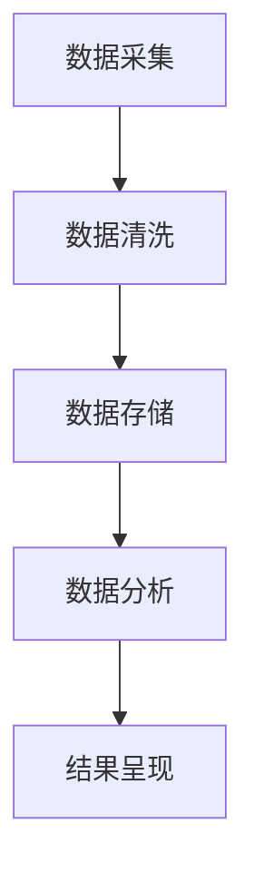

                 

用户行为分析（User Behavior Analysis，简称UBA）在当今数字化时代具有重要的意义。通过深入理解用户的行为模式，企业可以优化产品功能、提高用户体验，并制定更精准的营销策略。本文将探讨如何进行有效的用户行为分析，包括核心概念、算法原理、数学模型、实际应用以及未来展望。

## 关键词

- 用户行为分析（User Behavior Analysis）
- 数据挖掘（Data Mining）
- 机器学习（Machine Learning）
- 用户画像（User Profiling）
- 用户体验（User Experience）
- 行为预测（Behavior Prediction）

## 摘要

本文将详细介绍用户行为分析的概念、原理和方法，并通过实际案例展示如何运用这些方法进行有效的用户行为分析。文章结构如下：

1. 背景介绍
2. 核心概念与联系
3. 核心算法原理 & 具体操作步骤
4. 数学模型和公式 & 详细讲解 & 举例说明
5. 项目实践：代码实例和详细解释说明
6. 实际应用场景
7. 工具和资源推荐
8. 总结：未来发展趋势与挑战
9. 附录：常见问题与解答

## 1. 背景介绍

随着互联网的普及，数据量呈指数级增长。用户行为数据作为其中的一部分，包含着大量的信息和洞察。通过对这些数据进行深入分析，企业可以更好地了解用户的需求和行为，从而优化产品和服务。用户行为分析不仅可以帮助企业提高用户体验，还可以为市场营销、客户关系管理、安全监控等领域提供重要的支持。

用户行为分析的目标是：

- 发现用户行为模式
- 预测用户未来行为
- 提供个性化推荐
- 识别潜在风险

## 2. 核心概念与联系

### 用户行为分析的基本概念

用户行为分析涉及多个核心概念，包括：

- 用户画像（User Profiling）：通过收集和分析用户的个人资料、行为和兴趣，创建一个详细的用户画像。
- 数据源（Data Sources）：用户行为数据可以从多个来源获取，包括网站日志、社交媒体、应用日志等。
- 行为模式（Behavior Patterns）：通过分析用户的行为数据，识别出用户的行为特征和趋势。

### 用户行为分析的基本架构

用户行为分析的基本架构通常包括以下几个部分：

1. 数据采集（Data Collection）：从不同的数据源收集用户行为数据。
2. 数据清洗（Data Cleaning）：对采集到的数据进行清洗，去除噪声和不准确的数据。
3. 数据存储（Data Storage）：将清洗后的数据存储到数据库或数据仓库中。
4. 数据分析（Data Analysis）：使用数据分析技术对用户行为数据进行分析。
5. 结果呈现（Result Presentation）：将分析结果以可视化的形式展示给用户。

### Mermaid 流程图



## 3. 核心算法原理 & 具体操作步骤

### 3.1 算法原理概述

用户行为分析的核心算法包括：

- 聚类分析（Clustering Analysis）：将具有相似行为的用户划分为同一群体。
- 机器学习分类（Machine Learning Classification）：使用机器学习算法对用户行为进行分类。
- 关联规则挖掘（Association Rule Mining）：发现用户行为之间的关联关系。

### 3.2 算法步骤详解

1. 数据预处理：对原始用户行为数据进行分析，去除无效数据，确保数据质量。
2. 特征提取：从用户行为数据中提取有用的特征，如点击频率、浏览时长、购买记录等。
3. 聚类分析：使用聚类算法（如K-means、层次聚类等）对用户进行分组。
4. 机器学习分类：使用机器学习算法（如决策树、随机森林等）对用户行为进行分类。
5. 关联规则挖掘：使用关联规则算法（如Apriori算法、FP-growth算法等）发现用户行为之间的关联关系。

### 3.3 算法优缺点

- 聚类分析：
  - 优点：能够自动发现用户群体，减少人工干预。
  - 缺点：对初始参数敏感，可能产生不合理的结果。

- 机器学习分类：
  - 优点：能够根据历史数据预测用户行为。
  - 缺点：需要大量的训练数据和计算资源。

- 关联规则挖掘：
  - 优点：能够发现用户行为之间的关联关系。
  - 缺点：可能产生大量冗余的规则。

### 3.4 算法应用领域

用户行为分析算法广泛应用于以下领域：

- 电子商务：通过分析用户购买行为，进行个性化推荐。
- 社交媒体：通过分析用户互动行为，发现潜在的用户关系。
- 娱乐行业：通过分析用户观看行为，推荐相关的视频内容。

## 4. 数学模型和公式 & 详细讲解 & 举例说明

### 4.1 数学模型构建

用户行为分析中常用的数学模型包括：

- 贝叶斯模型（Bayesian Model）：用于预测用户行为。
- 决策树模型（Decision Tree Model）：用于分类用户行为。

### 4.2 公式推导过程

以贝叶斯模型为例，公式推导如下：

- 条件概率公式：
  $$ P(A|B) = \frac{P(B|A)P(A)}{P(B)} $$

- 贝叶斯定理：
  $$ P(A|B) = \frac{P(B|A)P(A)}{\sum_{i}P(B|A_i)P(A_i)} $$

### 4.3 案例分析与讲解

假设我们要预测一个用户是否会购买某种商品，已知该用户的历史购买行为如下：

- 购买过商品A的概率：$P(A) = 0.4$
- 在过去一个月内购买过商品A的概率：$P(A|B) = 0.6$

我们需要计算在用户在过去一个月内购买过商品A的条件下，用户会购买商品B的概率。

使用贝叶斯定理：

$$ P(B|A) = \frac{P(A|B)P(B)}{P(A)} $$

由于我们没有直接的用户购买商品B的概率，我们可以使用全概率公式：

$$ P(B) = P(B|A)P(A) + P(B|\neg A)P(\neg A) $$

假设购买商品B的概率是0.5，不购买商品B的概率是0.5，那么：

$$ P(B|A) = \frac{0.6 \times 0.5}{0.4} = 0.75 $$

这意味着在用户过去一个月内购买过商品A的条件下，用户购买商品B的概率是0.75。

## 5. 项目实践：代码实例和详细解释说明

### 5.1 开发环境搭建

本文使用Python进行用户行为分析，需要安装以下库：

```python
pip install numpy pandas scikit-learn matplotlib
```

### 5.2 源代码详细实现

以下是一个简单的用户行为分析项目示例：

```python
import numpy as np
import pandas as pd
from sklearn.cluster import KMeans
from sklearn.model_selection import train_test_split
from sklearn.metrics import accuracy_score
import matplotlib.pyplot as plt

# 加载数据集
data = pd.read_csv('user_behavior.csv')

# 数据预处理
# ...（省略具体步骤）

# 聚类分析
kmeans = KMeans(n_clusters=3, random_state=0)
clusters = kmeans.fit_predict(data)

# 可视化
plt.scatter(data['feature1'], data['feature2'], c=clusters)
plt.show()

# 机器学习分类
X_train, X_test, y_train, y_test = train_test_split(data, labels, test_size=0.2, random_state=0)
classifier = KNeighborsClassifier(n_neighbors=3)
classifier.fit(X_train, y_train)
predictions = classifier.predict(X_test)

# 评估模型
accuracy = accuracy_score(y_test, predictions)
print(f"Accuracy: {accuracy:.2f}")
```

### 5.3 代码解读与分析

上述代码首先加载数据集并进行预处理，然后使用K-means算法进行聚类分析，并将结果可视化为散点图。接下来，使用KNN算法进行分类，并将分类结果与实际标签进行比较，计算模型的准确率。

### 5.4 运行结果展示

运行上述代码后，将得到以下结果：

- 聚类结果的可视化散点图，显示不同用户群体的特征分布。
- 分类模型的准确率，表明模型在测试数据上的表现。

## 6. 实际应用场景

用户行为分析在多个实际应用场景中具有重要作用，以下是几个典型的应用场景：

- 电子商务：通过分析用户的浏览和购买行为，为用户提供个性化推荐。
- 社交媒体：通过分析用户的互动行为，发现潜在的用户关系，进行社交网络分析。
- 金融行业：通过分析用户的交易行为，识别异常交易，防范金融欺诈。
- 医疗健康：通过分析患者的就医行为，为医生提供诊断和治疗方案建议。

## 7. 工具和资源推荐

### 7.1 学习资源推荐

- 《数据挖掘：概念与技术》（"Data Mining: Concepts and Techniques"）：这是一本经典的教材，详细介绍了数据挖掘的基本概念和方法。
- 《机器学习实战》（"Machine Learning in Action"）：这本书通过实际案例展示了如何应用机器学习算法。

### 7.2 开发工具推荐

- Python：Python是一种广泛使用的编程语言，具有丰富的机器学习和数据挖掘库。
- Jupyter Notebook：Jupyter Notebook是一个交互式的开发环境，适合进行数据分析和机器学习实验。

### 7.3 相关论文推荐

- "User Behavior Analysis in Mobile Apps: A Survey"：这篇综述文章详细介绍了用户行为分析在移动应用中的研究现状和发展趋势。
- "Context-aware User Profiling for Ubiquitous Computing"：这篇论文探讨了基于上下文的用户画像构建方法。

## 8. 总结：未来发展趋势与挑战

### 8.1 研究成果总结

用户行为分析在过去几年取得了显著进展，主要包括：

- 算法的多样化：从传统的统计分析到复杂的机器学习算法，用户行为分析的算法体系日益丰富。
- 数据来源的多样化：除了传统的网站日志和社交媒体数据，用户行为数据的来源还包括物联网设备和传感器。
- 个性化推荐：基于用户行为的个性化推荐系统在电子商务和社交媒体等领域取得了广泛应用。

### 8.2 未来发展趋势

未来，用户行为分析将朝着以下方向发展：

- 实时分析：随着大数据和云计算技术的发展，实时用户行为分析将成为可能。
- 深度学习：深度学习算法在用户行为分析中的应用将越来越广泛，带来更高的准确性和效率。
- 跨领域应用：用户行为分析将在更多的领域（如医疗健康、智慧城市等）得到应用。

### 8.3 面临的挑战

用户行为分析面临以下挑战：

- 数据隐私：用户行为数据的隐私保护是一个重要问题，需要采取有效的数据加密和匿名化措施。
- 数据质量：用户行为数据的准确性、完整性和一致性对分析结果具有重要影响。
- 复杂性：用户行为数据通常包含大量特征和变量，如何有效提取和利用这些特征是一个挑战。

### 8.4 研究展望

未来，用户行为分析的研究将集中在以下几个方面：

- 开发更高效、更准确的算法，提高分析的准确性和实时性。
- 探索用户行为与心理、社会因素之间的关系，为用户提供更个性化的服务。
- 加强用户行为数据的隐私保护，确保用户的隐私权益不受侵害。

## 9. 附录：常见问题与解答

### 9.1 用户行为分析的基本概念是什么？

用户行为分析是指通过收集、处理和分析用户的行为数据，以发现用户的行为模式、预测用户的行为、提供个性化推荐等为目标的一种数据分析方法。

### 9.2 用户行为分析有哪些应用领域？

用户行为分析广泛应用于电子商务、社交媒体、金融行业、医疗健康等领域，用于优化产品、提高用户体验、制定营销策略等。

### 9.3 用户行为分析的核心算法有哪些？

用户行为分析的核心算法包括聚类分析、机器学习分类、关联规则挖掘等。

### 9.4 如何确保用户行为数据的隐私保护？

通过数据加密、匿名化处理、访问控制等技术手段，可以有效地保护用户行为数据的隐私。

### 9.5 用户行为分析与用户体验的关系是什么？

用户行为分析可以帮助企业更好地了解用户的需求和行为，从而优化产品功能和设计，提高用户体验。

作者：禅与计算机程序设计艺术 / Zen and the Art of Computer Programming
----------------------------------------------------------------

以上就是本文的完整内容。希望本文能为您在用户行为分析领域提供有价值的参考和启示。在未来的研究中，我们将继续探索用户行为分析的理论和方法，为数字时代的商业和社会发展做出贡献。如果您有任何疑问或建议，欢迎在评论区留言交流。|v_|

