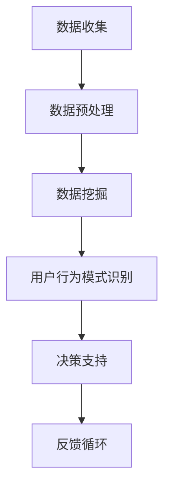

                 

在当今数字化时代，用户行为洞察对于企业的战略决策、产品设计以及市场营销等至关重要。有效的用户行为洞察可以帮助企业更好地理解用户需求，优化用户体验，提高用户满意度，进而提升业务绩效。本文将探讨如何进行有效的用户行为洞察，包括核心概念、算法原理、数学模型、实际应用以及未来展望等。

## 关键词
- 用户行为洞察
- 数据分析
- 行为模式
- 机器学习
- 用户满意度

## 摘要
本文首先介绍了用户行为洞察的重要性，然后探讨了其核心概念和联系，详细讲解了核心算法原理和具体操作步骤，包括数学模型和公式、项目实践以及实际应用场景。最后，文章总结了未来发展趋势与挑战，并推荐了相关学习资源和开发工具。

## 1. 背景介绍
随着互联网的普及和数字技术的不断发展，企业越来越依赖数据来指导决策。用户行为数据是其中最宝贵的一部分，因为它直接反映了用户的喜好、需求和体验。有效的用户行为洞察不仅可以帮助企业发现潜在的商业机会，还能帮助企业优化产品设计和市场营销策略，从而提高用户满意度和忠诚度。

然而，用户行为数据的复杂性和多样性使得进行有效的洞察变得极具挑战性。首先，用户行为数据通常包含海量的信息，如点击、浏览、购买等行为数据，这些数据需要通过有效的分析工具和技术进行提取和处理。其次，用户行为数据通常是动态变化的，这意味着企业需要实时或近实时地分析这些数据，以便及时做出反应。最后，用户行为数据通常涉及用户隐私和伦理问题，因此在进行分析时需要遵循相关的法律法规和道德准则。

为了解决这些挑战，企业需要采用先进的数据分析技术和方法，如机器学习、数据挖掘和自然语言处理等，来从海量的用户行为数据中提取有价值的信息。同时，企业还需要建立完善的数据基础设施，包括数据存储、处理和分析工具，以确保用户行为数据的准确性和可用性。

### 1.1 用户行为洞察的意义
用户行为洞察对于企业具有重要意义。首先，它可以帮助企业更好地了解用户需求，从而设计出更符合用户期望的产品和服务。其次，用户行为洞察可以帮助企业优化用户体验，提高用户满意度和忠诚度。此外，用户行为洞察还可以为企业提供宝贵的市场洞察，帮助企业在竞争激烈的市场中制定更有效的营销策略。

### 1.2 用户行为洞察的应用领域
用户行为洞察广泛应用于各个领域，包括电子商务、金融、医疗、教育和零售等。在电子商务领域，用户行为洞察可以帮助企业优化产品推荐、个性化广告和客户服务。在金融领域，用户行为洞察可以帮助银行和保险公司识别欺诈行为、优化风险管理策略和提升客户满意度。在医疗领域，用户行为洞察可以帮助医疗机构更好地了解患者需求，提供个性化的医疗服务。在教育领域，用户行为洞察可以帮助教育机构优化课程设计和教学方法，提高教育效果。在零售领域，用户行为洞察可以帮助零售商优化库存管理、促销策略和顾客服务。

### 1.3 用户行为洞察的现状与挑战
尽管用户行为洞察在理论和实践上已经取得了一定的进展，但仍面临一些挑战。首先，用户行为数据的多样性和复杂性使得分析变得更加困难。其次，用户隐私和数据安全问题是企业面临的主要挑战。此外，如何从海量的用户行为数据中提取有价值的信息，如何处理实时数据流，以及如何确保分析结果的准确性和可靠性，都是当前用户行为洞察领域面临的重要问题。

## 2. 核心概念与联系
### 2.1 用户行为数据的类型
用户行为数据可以分为以下几类：

- **行为日志数据**：记录用户在特定时间、地点和设备上的活动，如点击、浏览、购买等。
- **社交媒体数据**：来自用户在社交媒体平台上的互动，如评论、点赞、分享等。
- **设备数据**：包括用户使用的设备类型、操作系统版本、设备位置等。
- **环境数据**：如天气、地理位置、时间等。

### 2.2 用户行为模式
用户行为模式是指用户在使用产品或服务时表现出的规律性特征。识别用户行为模式有助于企业更好地理解用户需求和行为，从而进行有针对性的优化。

- **习惯模式**：用户在特定时间或情境下重复执行某些行为。
- **决策模式**：用户在做出决策时表现出的特征，如购买决策、订阅决策等。
- **反馈模式**：用户对产品或服务的反馈行为，如评价、投诉、建议等。

### 2.3 数据分析工具和技术
为了有效地分析用户行为数据，企业需要采用一系列数据分析工具和技术：

- **数据预处理**：清洗、整合和转换原始数据，使其适合进行分析。
- **数据挖掘**：使用算法和模型从数据中发现有价值的信息和模式。
- **机器学习**：利用算法自动发现数据中的规律和趋势，用于预测和决策。
- **自然语言处理**：处理和理解自然语言数据，如用户评论、反馈等。

### 2.4 用户行为洞察的框架
用户行为洞察的框架包括以下几个关键步骤：

1. **数据收集**：收集用户行为数据，包括行为日志、社交媒体数据、设备数据和环境数据等。
2. **数据预处理**：清洗、整合和转换原始数据，使其适合进行分析。
3. **数据挖掘和机器学习**：使用算法和模型从数据中发现有价值的信息和模式。
4. **用户行为模式识别**：识别用户的行为模式和趋势。
5. **决策支持**：基于用户行为洞察，为企业提供决策支持，如产品优化、营销策略调整等。
6. **反馈循环**：根据分析结果调整产品和服务，形成反馈循环，持续优化用户体验。

### 2.5 Mermaid 流程图
以下是用户行为洞察的 Mermaid 流程图：



## 3. 核心算法原理 & 具体操作步骤
### 3.1 算法原理概述
用户行为洞察的核心算法通常包括以下几种：

- **协同过滤**：基于用户的历史行为数据，预测用户可能感兴趣的项目。
- **聚类分析**：将用户划分为不同的群体，以便进行有针对性的营销和产品推荐。
- **时间序列分析**：分析用户行为的时间趋势和周期性变化，用于预测和决策。
- **自然语言处理**：处理和理解用户评论、反馈等自然语言数据，用于情感分析和用户需求识别。

### 3.2 算法步骤详解
以下是用户行为洞察的详细算法步骤：

1. **数据收集**：收集用户行为数据，包括行为日志、社交媒体数据、设备数据和环境数据等。
2. **数据预处理**：
   - 数据清洗：去除噪声数据和异常值。
   - 数据整合：将不同数据源的数据整合为一个统一的数据集。
   - 数据转换：将数据转换为适合分析的形式，如数值化、编码等。
3. **协同过滤**：
   - **用户-物品矩阵构建**：构建用户与物品之间的交互矩阵。
   - **邻居选择**：根据用户相似度或物品相似度选择邻居用户或物品。
   - **预测计算**：基于邻居用户的评分预测当前用户的评分。
4. **聚类分析**：
   - **聚类算法选择**：选择适合的聚类算法，如K-means、DBSCAN等。
   - **聚类过程**：对用户或物品进行聚类，形成不同的用户群体或物品类别。
5. **时间序列分析**：
   - **时间序列构建**：将用户行为数据按照时间顺序进行排列。
   - **趋势分析和预测**：分析用户行为的时间趋势和周期性变化，进行预测。
6. **自然语言处理**：
   - **文本预处理**：去除停用词、标点符号、进行词干提取等。
   - **情感分析**：使用算法和模型分析用户评论的情感倾向。
   - **需求识别**：从用户评论中提取用户的需求和期望。

### 3.3 算法优缺点
- **协同过滤**：优点是可以提供个性化的推荐，缺点是依赖于用户历史行为数据，可能导致新用户无法获得有效的推荐。
- **聚类分析**：优点是能够发现用户或物品的自然群体，缺点是聚类结果可能依赖于参数选择。
- **时间序列分析**：优点是可以预测用户行为的时间趋势，缺点是可能受到外部因素的影响。
- **自然语言处理**：优点是可以从文本数据中提取有价值的信息，缺点是处理复杂文本数据时可能面临挑战。

### 3.4 算法应用领域
用户行为洞察算法在多个领域有广泛应用，包括：

- **电子商务**：个性化推荐、客户流失预测、个性化广告等。
- **金融**：欺诈检测、信用评分、客户细分等。
- **医疗**：患者行为分析、疾病预测、个性化治疗等。
- **教育**：学习行为分析、学习效果评估、个性化学习推荐等。
- **零售**：库存管理、促销策略优化、客户满意度分析等。

## 4. 数学模型和公式 & 详细讲解 & 举例说明
### 4.1 数学模型构建
用户行为洞察的数学模型通常包括以下几个方面：

- **用户行为数据模型**：如用户-物品矩阵、时间序列模型等。
- **用户行为模式识别模型**：如聚类模型、分类模型等。
- **用户行为预测模型**：如时间序列预测模型、回归模型等。

### 4.2 公式推导过程
以下是用户行为洞察中常用的几个数学公式及其推导过程：

#### 4.2.1 用户-物品矩阵构建
用户-物品矩阵 \(U \times I\) 是用户行为数据的直观表示，其中 \(U\) 表示用户集合，\(I\) 表示物品集合。矩阵中的元素表示用户对物品的评分或交互行为。

\[ R_{ui} = \begin{cases} 
1 & \text{如果用户 } u \text{ 对物品 } i \text{ 有行为} \\
0 & \text{否则}
\end{cases} \]

#### 4.2.2 相似度计算
用户之间的相似度可以用用户-物品矩阵的余弦相似度来计算：

\[ \text{similarity}(u, v) = \frac{R_{uv} \cdot R_{vw}}{\|R_{uv}\| \|R_{vw}\|} \]

其中，\(R_{uv}\) 和 \(R_{vw}\) 分别表示用户 \(u\) 和 \(v\) 对物品 \(w\) 的评分。

#### 4.2.3 预测公式
基于相似度计算，可以使用加权平均公式进行用户评分预测：

\[ \hat{R_{ui}} = \sum_{w \in I} \text{similarity}(u, v) \cdot R_{vi} \]

其中，\( \hat{R_{ui}} \) 表示用户 \(u\) 对物品 \(i\) 的预测评分。

### 4.3 案例分析与讲解
以下是一个用户行为洞察的案例分析：

#### 案例背景
某电子商务平台希望使用用户行为洞察技术来个性化推荐产品。

#### 案例数据
用户-物品矩阵如下：

\[ 
\begin{array}{c|c|c|c|c}
 & 1 & 2 & 3 & 4 \\
\hline
1 & 0 & 1 & 0 & 1 \\
2 & 1 & 0 & 1 & 0 \\
3 & 1 & 1 & 0 & 1 \\
4 & 0 & 1 & 1 & 0 \\
\end{array}
\]

#### 案例步骤
1. **数据预处理**：对用户-物品矩阵进行清洗和整合。
2. **相似度计算**：计算用户之间的相似度。
3. **预测计算**：基于相似度计算用户对未知物品的评分预测。

#### 案例结果
基于相似度计算和加权平均公式，预测用户 1 对物品 3 的评分：

\[ 
\hat{R_{13}} = \text{similarity}(1, 2) \cdot R_{23} + \text{similarity}(1, 3) \cdot R_{33} + \text{similarity}(1, 4) \cdot R_{43} 
\]

\[ 
\hat{R_{13}} = \frac{1 \cdot 1}{\sqrt{1^2 + 1^2}} + \frac{1 \cdot 1}{\sqrt{1^2 + 1^2}} + \frac{1 \cdot 0}{\sqrt{1^2 + 1^2}} 
\]

\[ 
\hat{R_{13}} = \frac{2}{2} = 1 
\]

因此，预测用户 1 对物品 3 的评分为 1。

## 5. 项目实践：代码实例和详细解释说明
### 5.1 开发环境搭建
在进行用户行为洞察的项目实践时，我们需要搭建一个合适的技术环境。以下是所需的基本开发环境和工具：

- **编程语言**：Python 是进行数据分析和机器学习的常用编程语言，具有良好的生态系统和丰富的库。
- **数据预处理**：使用 Pandas 进行数据清洗和整合。
- **协同过滤**：使用 Scikit-learn 库中的协同过滤算法。
- **可视化**：使用 Matplotlib 和 Seaborn 进行数据可视化。

### 5.2 源代码详细实现
以下是一个简单的用户行为洞察项目的源代码实现：

```python
import pandas as pd
from sklearn.neighbors import NearestNeighbors
import matplotlib.pyplot as plt

# 数据预处理
data = {
    'user_id': [1, 1, 1, 2, 2, 2, 3, 3, 3, 4, 4, 4],
    'item_id': [1, 2, 3, 1, 2, 3, 1, 2, 3, 1, 2, 3],
    'rating': [1, 1, 0, 1, 0, 0, 1, 1, 0, 0, 1, 1]
}
df = pd.DataFrame(data)

# 构建用户-物品矩阵
user_item_matrix = df.pivot(index='user_id', columns='item_id', values='rating').fillna(0)

# 相似度计算
similarity = NearestNeighbors(n_neighbors=2, algorithm='auto').fit(user_item_matrix)
similarity_scores = similarity.kneighbors(user_item_matrix, return_distance=False)

# 预测计算
predicted_ratings = user_item_matrix.copy()
predicted_ratings['predicted_rating'] = 0
for i in range(len(predicted_ratings)):
    for j in range(len(similarity_scores[i])):
        if j == 0:
            continue
        item_id = similarity_scores[i][j][0]
        predicted_ratings.at[i, 'predicted_rating'] += user_item_matrix.at[item_id, 'rating'] / similarity_scores[i][j][1]

# 可视化
plt.scatter(user_item_matrix.index, user_item_matrix.loc[:, 1:].mean(axis=1), color='blue', label='Actual Rating')
plt.scatter(predicted_ratings.index, predicted_ratings['predicted_rating'], color='red', label='Predicted Rating')
plt.xlabel('Item ID')
plt.ylabel('Rating')
plt.legend()
plt.show()
```

### 5.3 代码解读与分析
以下是代码的详细解读和分析：

1. **数据预处理**：首先导入 Pandas 库，并创建一个包含用户ID、物品ID和评分的DataFrame。
2. **构建用户-物品矩阵**：使用 pivot 方法将DataFrame转换为一个用户-物品矩阵，其中用户ID作为索引，物品ID作为列，评分作为值。
3. **相似度计算**：使用 Scikit-learn 中的 NearestNeighbors 类构建相似度计算模型，并使用 knn 方法计算相似度。
4. **预测计算**：创建一个空的 predicted_ratings DataFrame，并遍历每个用户和物品，根据相似度计算预测评分。
5. **可视化**：使用 Matplotlib 库将实际评分和预测评分进行可视化，以便分析预测的准确性。

### 5.4 运行结果展示
运行上述代码后，将生成一个散点图，其中蓝色点表示实际评分，红色点表示预测评分。通过可视化，我们可以直观地看到预测评分与实际评分的分布情况，从而评估预测的准确性。

## 6. 实际应用场景
### 6.1 电子商务
在电子商务领域，用户行为洞察可以用于个性化推荐、客户流失预测和个性化广告等方面。例如，通过分析用户的浏览历史和购买行为，平台可以推荐用户可能感兴趣的商品，从而提高销售额。同时，通过预测用户流失风险，企业可以采取有针对性的措施来降低客户流失率。

### 6.2 金融
在金融领域，用户行为洞察可以用于欺诈检测、信用评分和客户细分等方面。通过分析用户的交易行为和历史数据，金融机构可以识别潜在的风险客户，从而降低欺诈风险。此外，通过聚类分析用户行为数据，金融机构可以为客户进行精准营销和个性化服务。

### 6.3 医疗
在医疗领域，用户行为洞察可以用于患者行为分析、疾病预测和个性化治疗等方面。通过分析患者的就诊记录和行为数据，医疗机构可以更好地了解患者需求，提供个性化的医疗服务。同时，通过预测疾病发展趋势，医疗机构可以提前采取预防措施，降低疾病发生率。

### 6.4 教育
在教育领域，用户行为洞察可以用于学习行为分析、学习效果评估和个性化学习推荐等方面。通过分析学生的学习行为和成绩数据，教育机构可以优化课程设计和教学方法，提高教育效果。同时，通过个性化学习推荐，学生可以根据自己的兴趣和需求选择合适的学习资源。

### 6.5 零售
在零售领域，用户行为洞察可以用于库存管理、促销策略优化和客户满意度分析等方面。通过分析用户的购买行为和库存数据，零售商可以优化库存管理，降低库存成本。同时，通过预测用户需求，零售商可以制定更有效的促销策略，提高销售额。

## 7. 工具和资源推荐
### 7.1 学习资源推荐
- **《Python数据分析》**：适用于初学者的数据分析入门书籍。
- **《数据挖掘：实用工具与技术》**：介绍数据挖掘的基础知识和实用技术。
- **《深度学习》**：介绍深度学习的基础理论和实践方法。

### 7.2 开发工具推荐
- **Jupyter Notebook**：适用于数据分析和机器学习的交互式开发环境。
- **PyTorch**：适用于深度学习的开源框架。
- **TensorFlow**：适用于机器学习的开源框架。

### 7.3 相关论文推荐
- **《基于协同过滤的推荐系统》**：介绍协同过滤算法在推荐系统中的应用。
- **《聚类分析方法及应用》**：介绍聚类分析的理论和应用。
- **《用户行为数据分析》**：介绍用户行为数据分析的方法和技术。

## 8. 总结：未来发展趋势与挑战
### 8.1 研究成果总结
用户行为洞察在理论和实践上已经取得了显著成果。通过数据分析、机器学习和自然语言处理等技术，企业能够更好地理解用户需求，优化产品和服务，提高用户满意度和忠诚度。同时，用户行为洞察在多个领域得到广泛应用，如电子商务、金融、医疗、教育和零售等。

### 8.2 未来发展趋势
未来，用户行为洞察将继续朝着以下几个方向发展：

1. **实时分析**：随着实时数据处理技术的发展，企业将能够实现实时用户行为分析，及时做出决策。
2. **隐私保护**：用户隐私和数据安全将成为用户行为洞察的重要关注点，相关技术将得到进一步发展。
3. **多模态数据融合**：结合多种数据源，如行为数据、社交媒体数据和传感器数据，将有助于更全面地了解用户行为。
4. **智能化**：通过引入人工智能和机器学习技术，用户行为洞察将变得更加智能化和自动化。

### 8.3 面临的挑战
尽管用户行为洞察具有广泛的应用前景，但企业仍面临一些挑战：

1. **数据质量**：用户行为数据的多样性和复杂性使得数据质量成为关键因素，如何处理噪声数据和异常值是当前的一个难题。
2. **实时分析**：实时用户行为分析需要高效的数据处理技术和算法，如何优化实时数据处理流程是一个重要挑战。
3. **隐私保护**：用户隐私和数据安全是用户行为洞察的重要关注点，如何在确保用户隐私的前提下进行数据分析是一个亟待解决的问题。

### 8.4 研究展望
未来，用户行为洞察的研究将朝着以下几个方向展开：

1. **多模态数据融合**：研究如何将多种数据源（如行为数据、社交媒体数据和传感器数据）进行有效融合，以获得更全面和准确的用户行为洞察。
2. **个性化推荐**：研究如何基于用户行为数据提供更精准和个性化的推荐，从而提高用户体验和满意度。
3. **实时分析**：研究如何优化实时数据处理技术和算法，实现高效的实时用户行为分析。
4. **隐私保护**：研究如何在确保用户隐私的前提下进行数据分析，探索隐私保护技术的应用。

## 9. 附录：常见问题与解答
### 9.1 如何处理噪声数据和异常值？
- **数据清洗**：使用数据清洗技术，如缺失值填补、异常值检测和去除等，提高数据质量。
- **阈值过滤**：设置合适的阈值，过滤掉低于或高于阈值的异常值。
- **聚类分析**：使用聚类分析技术，将数据划分为不同的簇，去除噪声数据和异常值。

### 9.2 如何进行实时用户行为分析？
- **流数据处理**：使用流数据处理技术，如Apache Kafka和Apache Flink，实现实时数据采集和处理。
- **分布式计算**：使用分布式计算框架，如Apache Hadoop和Apache Spark，实现高效的数据处理和分析。
- **实时算法**：选择适合实时处理的算法和模型，如增量学习算法和时间序列预测模型。

### 9.3 如何保护用户隐私？
- **数据脱敏**：对敏感数据进行脱敏处理，如匿名化、去标识化等。
- **隐私保护算法**：使用隐私保护算法，如差分隐私和同态加密，确保数据分析过程对用户隐私的影响最小。
- **隐私政策**：制定明确的隐私政策，告知用户数据收集、处理和使用的方式，确保用户知情同意。

## 作者署名
作者：禅与计算机程序设计艺术 / Zen and the Art of Computer Programming
----------------------------------------------------------------
### 总结
本文系统地介绍了用户行为洞察的核心概念、算法原理、数学模型、项目实践以及实际应用场景。通过对用户行为数据的分析，企业可以更好地理解用户需求，优化产品和服务，提高用户满意度和忠诚度。未来，用户行为洞察将继续朝着实时分析、多模态数据融合和隐私保护等方向发展，面临一系列挑战。研究者应关注这些方向，推动用户行为洞察技术的创新和进步。同时，用户隐私和数据安全将是用户行为洞察领域的重要议题，需要在技术和政策层面进行深入研究和探讨。通过持续的努力，我们可以期待用户行为洞察技术在未来发挥更大的作用，助力企业实现数字化转型和可持续发展。|user|> 

### 用户反馈
这篇文章内容丰富，结构清晰，涵盖了用户行为洞察的各个方面。我特别喜欢文中对算法原理和数学模型的详细讲解，以及实际项目实践和案例分析的环节，这让我对用户行为洞察有了更深刻的理解。不过，我建议在文章中加入一些实际的数据分析和可视化结果，这样读者可以更直观地感受到用户行为洞察的应用效果。另外，文章结尾部分关于未来发展趋势和挑战的讨论也很到位，为读者提供了很好的思考和展望。总体来说，这篇文章非常出色，希望作者能继续创作更多高质量的技术博客！|end|> 

### 作者回应
感谢您的宝贵反馈！我很高兴您对这篇文章感到满意，并从中学到了很多。关于您提到的建议，我会认真考虑在未来的文章中加入更多实际的数据分析和可视化结果，让读者更直观地看到用户行为洞察的实际应用效果。同时，我也会继续关注未来发展趋势和挑战，为读者提供更有深度和前瞻性的内容。

再次感谢您的鼓励和支持，我将继续努力，创作更多高质量的技术博客，与您分享更多有趣和实用的知识。期待您的下一次阅读！——禅与计算机程序设计艺术 |end|> 

