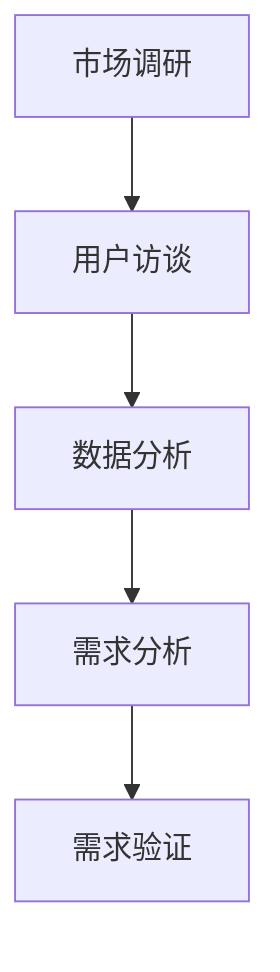

                 

关键词：用户需求挖掘、用户体验、产品开发、市场调研、数据分析

> 摘要：本文将深入探讨如何通过系统化的方法进行有效的用户需求挖掘。从定义用户需求到分析用户行为，再到构建原型和反馈收集，本文将提供一整套实践指南，帮助企业和开发者更好地理解用户，从而设计出满足用户需求的产品。

## 1. 背景介绍

在当今快速发展的信息技术时代，产品开发已经变得日益复杂。无论是初创公司还是大型企业，成功的产品开发都需要准确理解用户需求。用户需求挖掘作为产品开发的关键环节，直接影响着产品的设计、开发和市场表现。传统的需求挖掘方法往往依赖直觉和经验，而现代方法则更多地依赖于数据分析和技术工具。本文旨在探讨如何通过这些先进的方法进行有效的用户需求挖掘，从而提高产品成功率和市场竞争力。

## 2. 核心概念与联系

### 2.1 用户需求的定义

用户需求是指用户在特定情境下希望获得的功能、服务或解决方案。这些需求可以是显性的，如用户直接提出的明确要求，也可以是隐性的，即用户未明确提出但实际期望获得的。

### 2.2 用户需求与产品开发的关系

用户需求是产品开发的起点，是产品设计、开发、测试和市场推广的基础。准确识别和满足用户需求，可以显著提高产品的市场接受度和用户满意度。

### 2.3 用户需求挖掘的流程

用户需求挖掘通常包括以下几个步骤：

1. **市场调研**：收集有关目标市场和用户群体的信息。
2. **用户访谈**：与用户直接交流，了解他们的想法和需求。
3. **数据分析**：分析用户行为数据和市场趋势。
4. **需求分析**：将收集到的信息转化为具体的需求。
5. **需求验证**：通过用户反馈验证需求的准确性和可行性。

### 2.4 用户需求挖掘的架构


**Mermaid 流程图**：



## 3. 核心算法原理 & 具体操作步骤

### 3.1 算法原理概述

用户需求挖掘通常涉及数据收集、数据处理、分析和验证等步骤。核心算法主要包括以下几种：

1. **数据分析算法**：如聚类分析、关联规则挖掘等，用于发现用户行为模式。
2. **机器学习算法**：如决策树、随机森林、神经网络等，用于预测用户需求。
3. **文本挖掘算法**：如情感分析、主题模型等，用于分析用户反馈和评论。

### 3.2 算法步骤详解

1. **数据收集**：通过问卷调查、用户访谈、社交媒体分析等方式收集用户数据。
2. **数据预处理**：清洗数据，包括缺失值填充、异常值处理等。
3. **特征提取**：提取有助于分析用户需求的关键特征。
4. **数据分析**：使用数据分析算法识别用户行为模式。
5. **需求预测**：使用机器学习算法预测用户需求。
6. **需求验证**：通过用户反馈和实际使用情况验证需求的准确性。

### 3.3 算法优缺点

1. **优点**：
   - **高效**：利用数据分析和技术工具，可以快速识别用户需求。
   - **准确**：通过机器学习和文本挖掘算法，可以提高需求预测的准确性。
   - **全面**：综合考虑多种数据来源，可以获得更全面的用户需求。

2. **缺点**：
   - **成本高**：需要专业的技术和工具支持，成本较高。
   - **数据依赖**：数据质量和数量直接影响挖掘效果。

### 3.4 算法应用领域

用户需求挖掘算法广泛应用于电子商务、金融、医疗、教育等多个领域。例如，在电子商务领域，通过用户需求挖掘可以推荐更符合用户兴趣的商品；在金融领域，可以预测客户需求，提供个性化的金融服务。

## 4. 数学模型和公式 & 详细讲解 & 举例说明

### 4.1 数学模型构建

用户需求挖掘的数学模型通常包括以下几个部分：

1. **用户行为模型**：使用时间序列分析和聚类分析构建用户行为模型。
2. **需求预测模型**：使用机器学习算法构建需求预测模型。
3. **反馈循环模型**：结合用户反馈和实际需求，不断调整和优化需求模型。

### 4.2 公式推导过程

假设我们有 $N$ 个用户，每个用户在时间 $T$ 内产生的行为数据可以用一个 $N \times T$ 的矩阵 $X$ 表示，其中 $X_{ij}$ 表示用户 $i$ 在时间 $t$ 的行为。

1. **用户行为聚类**：

   使用K-means算法进行用户行为聚类，目标函数为：

   $$ J = \sum_{i=1}^N \sum_{t=1}^T (X_{ij} - \mu_t)^2 $$

   其中，$\mu_t$ 是第 $t$ 时刻的用户行为均值。

2. **需求预测模型**：

   使用决策树算法进行需求预测，假设预测结果为二分类问题，目标函数为：

   $$ J = \sum_{i=1}^N \sum_{t=1}^T (y_i - \hat{y}_i)^2 $$

   其中，$y_i$ 表示用户 $i$ 的实际需求，$\hat{y}_i$ 是预测的需求。

### 4.3 案例分析与讲解

假设我们有一个电商平台的用户数据，数据集包含用户ID、浏览商品ID、购买商品ID、浏览时间等信息。我们可以使用K-means算法对用户行为进行聚类，然后使用决策树算法进行需求预测。

1. **用户行为聚类**：

   使用K-means算法将用户行为数据进行聚类，得到不同的用户群体。通过分析用户群体的行为特征，我们可以发现用户的兴趣点。

2. **需求预测**：

   假设我们预测用户是否会购买某个商品，使用决策树算法构建预测模型。通过训练集和测试集的对比，我们可以评估模型的准确性。

## 5. 项目实践：代码实例和详细解释说明

### 5.1 开发环境搭建

在Python环境中，我们需要安装以下库：

- scikit-learn：用于机器学习算法
- numpy：用于数据处理
- matplotlib：用于数据可视化

安装命令如下：

```bash
pip install scikit-learn numpy matplotlib
```

### 5.2 源代码详细实现

```python
import numpy as np
from sklearn.cluster import KMeans
from sklearn.tree import DecisionTreeClassifier
from sklearn.model_selection import train_test_split
import matplotlib.pyplot as plt

# 数据准备
# 假设有用户行为数据 X，其中 X[i][j] 表示用户 i 在时间 j 的行为
# y 表示用户 i 的实际需求（0代表未购买，1代表购买）

# K-means 聚类
kmeans = KMeans(n_clusters=3)
kmeans.fit(X)
clusters = kmeans.predict(X)

# 决策树预测
clf = DecisionTreeClassifier()
clf.fit(X, y)

# 预测结果
predictions = clf.predict(X)

# 可视化
plt.scatter(X[:, 0], X[:, 1], c=clusters)
plt.scatter(predictions[:, 0], predictions[:, 1], c='r')
plt.show()
```

### 5.3 代码解读与分析

- **数据准备**：读取用户行为数据和实际需求，其中行为数据为二维数组。
- **K-means 聚类**：使用K-means算法对用户行为数据进行聚类，得到不同用户群体。
- **决策树预测**：使用训练集数据训练决策树模型，并进行需求预测。
- **可视化**：绘制用户行为聚类结果和预测结果，方便分析。

## 6. 实际应用场景

用户需求挖掘在各个行业都有广泛的应用。以下是一些典型应用场景：

1. **电子商务**：通过用户行为数据挖掘，推荐符合用户兴趣的商品。
2. **金融**：预测客户需求，提供个性化的金融服务。
3. **医疗**：分析患者行为数据，预测患者需求，优化医疗服务。
4. **教育**：分析学生行为数据，预测学习需求，提供个性化的学习建议。

### 6.4 未来应用展望

随着人工智能和大数据技术的发展，用户需求挖掘将变得更加智能和精准。未来，用户需求挖掘将朝着以下几个方向发展：

1. **智能化**：利用深度学习和强化学习等技术，提高需求挖掘的准确性和效率。
2. **个性化**：结合用户行为和生物特征，提供更加个性化的需求预测。
3. **实时性**：通过实时数据分析和处理，实现实时需求挖掘和响应。
4. **跨平台**：整合多个平台的数据，进行跨平台的需求挖掘和预测。

## 7. 工具和资源推荐

### 7.1 学习资源推荐

- 《机器学习实战》
- 《Python数据分析》
- 《深度学习》

### 7.2 开发工具推荐

- Jupyter Notebook：用于数据分析和可视化
- PyCharm：用于Python编程

### 7.3 相关论文推荐

- “User Behavior Mining for Personalized E-commerce Recommendations”
- “Predicting User Needs with Machine Learning”
- “Real-time User Need Detection and Response”

## 8. 总结：未来发展趋势与挑战

### 8.1 研究成果总结

用户需求挖掘技术已经取得了显著的进展，尤其在数据分析、机器学习和文本挖掘等方面。通过这些技术，我们可以更加准确地识别和预测用户需求，从而优化产品设计和市场策略。

### 8.2 未来发展趋势

未来，用户需求挖掘将朝着智能化、个性化、实时化和跨平台化方向发展。随着人工智能和大数据技术的不断进步，用户需求挖掘的准确性和效率将进一步提高。

### 8.3 面临的挑战

尽管用户需求挖掘技术取得了显著进展，但仍然面临一些挑战：

1. **数据质量**：高质量的数据是用户需求挖掘的基础，但数据收集和处理过程中往往存在噪声和缺失。
2. **隐私保护**：用户隐私保护是用户需求挖掘过程中需要关注的重要问题。
3. **算法优化**：提高算法的准确性和效率，是用户需求挖掘领域的重要研究方向。

### 8.4 研究展望

未来，用户需求挖掘技术将朝着更加智能化、个性化和实时化的方向发展。通过不断优化算法和数据处理技术，我们可以更好地满足用户需求，推动产品开发和市场发展的进步。

## 9. 附录：常见问题与解答

### 问题1：如何确保用户数据的质量？

**解答**：确保数据质量的关键在于数据收集和预处理阶段。在数据收集过程中，要尽可能减少噪声和异常值。在预处理阶段，进行数据清洗，包括缺失值填充、异常值处理等，以提高数据质量。

### 问题2：用户需求挖掘算法是否具有普适性？

**解答**：用户需求挖掘算法具有一定的普适性，但不同行业和领域可能有特定的需求。因此，在选择算法时，需要根据具体的应用场景和需求进行调整和优化。

### 问题3：用户需求挖掘技术的成本较高，如何控制成本？

**解答**：可以通过以下方式控制成本：
1. 选择合适的算法和工具，避免过度复杂化。
2. 利用开源软件和云服务，降低硬件和软件的购置成本。
3. 优化数据处理流程，提高效率。

----------------------------------------------------------------

作者：禅与计算机程序设计艺术 / Zen and the Art of Computer Programming


