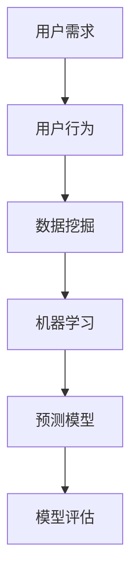

                 

关键词：用户需求预测、机器学习、数据挖掘、模型评估、应用场景、未来展望

> 摘要：本文旨在探讨如何通过先进的机器学习和数据挖掘技术，进行有效的用户需求预测。文章首先介绍了用户需求预测的背景和重要性，随后详细阐述了核心概念、算法原理、数学模型、项目实践以及实际应用场景。通过本文，读者可以深入了解用户需求预测的方法论，并对其未来的发展趋势和挑战有所认识。

## 1. 背景介绍

随着互联网的普及和信息技术的飞速发展，越来越多的企业开始重视用户需求预测这一关键环节。用户需求预测不仅仅是为了满足用户个性化需求，更是为了优化资源配置、提升运营效率、降低成本、提高用户满意度和忠诚度。然而，传统的用户需求预测方法往往依赖于经验和专家判断，存在预测准确性低、响应速度慢等问题。

近年来，机器学习和数据挖掘技术的发展，为用户需求预测提供了新的契机。通过收集和分析大量的用户行为数据，机器学习算法能够发现用户行为模式，从而预测未来的用户需求。这不仅提高了预测的准确性，还大大提高了预测的速度。

本文将围绕以下几个方面展开：

1. **核心概念与联系**：介绍用户需求预测的核心概念及其相互关系。
2. **核心算法原理 & 具体操作步骤**：阐述常见的用户需求预测算法及其操作步骤。
3. **数学模型和公式 & 详细讲解 & 举例说明**：解释数学模型在用户需求预测中的作用，并给出具体的案例。
4. **项目实践：代码实例和详细解释说明**：提供实际的代码实例，解释其工作原理。
5. **实际应用场景**：讨论用户需求预测在各个行业的应用。
6. **未来应用展望**：探讨用户需求预测的未来发展趋势和面临的挑战。

## 2. 核心概念与联系

在进行用户需求预测之前，我们需要明确一些核心概念，如图1-1所示。

### 2.1 用户需求

用户需求是指用户在特定环境下对某种产品或服务的期望和需求。用户需求是动态变化的，受到多种因素的影响，如用户偏好、市场环境、社会文化等。

### 2.2 用户行为

用户行为是指用户在使用产品或服务过程中的各种活动，包括浏览、购买、评论等。用户行为数据是用户需求预测的重要基础。

### 2.3 数据挖掘

数据挖掘是从大量数据中提取有价值信息的过程。在用户需求预测中，数据挖掘用于发现用户行为模式，从而预测未来的用户需求。

### 2.4 机器学习

机器学习是一种利用数据驱动的方法来构建预测模型的技术。在用户需求预测中，机器学习算法能够通过学习用户行为数据，预测未来的用户需求。

### 2.5 模型评估

模型评估是指对预测模型进行评价和选择的过程。常用的评估指标包括准确率、召回率、F1值等。

下面是用户需求预测的核心概念和架构的 Mermaid 流程图：



## 3. 核心算法原理 & 具体操作步骤

在进行用户需求预测时，常用的算法包括基于回归的算法、基于分类的算法和基于聚类的方法。以下是这些算法的原理和操作步骤。

### 3.1 基于回归的算法

基于回归的算法通过建立用户需求与用户行为之间的回归模型，预测未来的用户需求。常用的回归算法包括线性回归、多项式回归和逻辑回归等。

#### 3.1.1 线性回归

线性回归是一种简单的回归算法，其原理是通过最小二乘法建立用户需求与用户行为之间的线性关系。具体步骤如下：

1. **数据收集**：收集用户行为数据，包括用户ID、行为类型、行为时间等。
2. **特征工程**：对用户行为数据进行预处理，如编码、归一化等。
3. **模型训练**：使用训练数据，通过最小二乘法建立线性回归模型。
4. **模型评估**：使用测试数据对模型进行评估，选择最优模型。
5. **预测**：使用训练好的模型预测未来的用户需求。

#### 3.1.2 逻辑回归

逻辑回归是一种广泛应用于分类问题的回归算法，其原理是通过建立用户需求与用户行为之间的逻辑关系，预测用户需求的概率。具体步骤如下：

1. **数据收集**：收集用户行为数据，包括用户ID、行为类型、行为时间等。
2. **特征工程**：对用户行为数据进行预处理，如编码、归一化等。
3. **模型训练**：使用训练数据，通过逻辑回归建立预测模型。
4. **模型评估**：使用测试数据对模型进行评估，选择最优模型。
5. **预测**：使用训练好的模型预测用户需求的概率。

### 3.2 基于分类的算法

基于分类的算法通过建立用户需求分类模型，预测未来的用户需求。常用的分类算法包括K近邻（KNN）、决策树、支持向量机（SVM）等。

#### 3.2.1 K近邻（KNN）

K近邻算法是一种基于实例的学习算法，其原理是根据用户行为的相似度预测用户需求。具体步骤如下：

1. **数据收集**：收集用户行为数据，包括用户ID、行为类型、行为时间等。
2. **特征工程**：对用户行为数据进行预处理，如编码、归一化等。
3. **模型训练**：无训练过程，直接使用测试数据。
4. **模型评估**：使用测试数据对模型进行评估，选择最优模型。
5. **预测**：根据用户行为的相似度，预测用户需求。

#### 3.2.2 决策树

决策树算法是一种基于规则的学习算法，其原理是通过树形结构对用户行为进行分类，预测用户需求。具体步骤如下：

1. **数据收集**：收集用户行为数据，包括用户ID、行为类型、行为时间等。
2. **特征工程**：对用户行为数据进行预处理，如编码、归一化等。
3. **模型训练**：使用训练数据，建立决策树模型。
4. **模型评估**：使用测试数据对模型进行评估，选择最优模型。
5. **预测**：根据决策树模型，预测用户需求。

### 3.3 基于聚类的方法

基于聚类的方法通过将用户行为数据分为不同的簇，预测每个簇的用户需求。常用的聚类算法包括K均值（K-means）、层次聚类等。

#### 3.3.1 K均值（K-means）

K均值算法是一种基于距离的聚类算法，其原理是将用户行为数据分为K个簇，每个簇的中心点代表该簇的用户需求。具体步骤如下：

1. **数据收集**：收集用户行为数据，包括用户ID、行为类型、行为时间等。
2. **特征工程**：对用户行为数据进行预处理，如编码、归一化等。
3. **模型训练**：无训练过程，直接使用测试数据。
4. **模型评估**：使用测试数据对模型进行评估，选择最优模型。
5. **预测**：根据用户行为的簇，预测用户需求。

#### 3.3.2 层次聚类

层次聚类算法是一种基于层次结构的聚类算法，其原理是将用户行为数据按照相似度进行分层，每层代表一个簇。具体步骤如下：

1. **数据收集**：收集用户行为数据，包括用户ID、行为类型、行为时间等。
2. **特征工程**：对用户行为数据进行预处理，如编码、归一化等。
3. **模型训练**：无训练过程，直接使用测试数据。
4. **模型评估**：使用测试数据对模型进行评估，选择最优模型。
5. **预测**：根据用户行为的簇，预测用户需求。

## 4. 数学模型和公式 & 详细讲解 & 举例说明

用户需求预测的核心是建立数学模型，通过公式表达用户需求与用户行为之间的关系。以下是常见的数学模型及其公式推导过程。

### 4.1 数学模型构建

用户需求预测的数学模型通常包括输入层、隐藏层和输出层。输入层包含用户行为特征，隐藏层通过激活函数实现非线性变换，输出层预测用户需求。

设用户需求为 \(y\)，用户行为特征为 \(x\)，则用户需求预测的数学模型可以表示为：

\[ y = f(x) \]

其中，\(f\) 为激活函数，常用的激活函数包括线性激活函数、ReLU激活函数、Sigmoid激活函数和Tanh激活函数等。

### 4.2 公式推导过程

#### 4.2.1 线性激活函数

线性激活函数是最简单的激活函数，其公式为：

\[ f(x) = x \]

线性激活函数在用户需求预测中的应用较为有限，因为它无法实现非线性变换。

#### 4.2.2 ReLU激活函数

ReLU（Rectified Linear Unit）激活函数是一种常用的非线性激活函数，其公式为：

\[ f(x) = \max(0, x) \]

ReLU激活函数在用户需求预测中具有较好的性能，因为它可以加速梯度下降过程，提高模型的收敛速度。

#### 4.2.3 Sigmoid激活函数

Sigmoid激活函数是一种常用的非线性激活函数，其公式为：

\[ f(x) = \frac{1}{1 + e^{-x}} \]

Sigmoid激活函数在用户需求预测中常用于分类问题，因为它可以将输入值映射到 \(0\) 到 \(1\) 之间，表示用户需求的可能性。

#### 4.2.4 Tanh激活函数

Tanh激活函数是一种常用的非线性激活函数，其公式为：

\[ f(x) = \frac{e^x - e^{-x}}{e^x + e^{-x}} \]

Tanh激活函数在用户需求预测中常用于处理输入值在 \(-1\) 到 \(1\) 之间的情况，因为它可以将输入值映射到 \(-1\) 到 \(1\) 之间，提高模型的泛化能力。

### 4.3 案例分析与讲解

假设我们有一个用户需求预测问题，其中用户需求是购买商品的概率，用户行为特征包括浏览时间、购买次数和用户评分等。我们可以使用线性回归模型进行预测。

设用户需求为 \(y\)，用户行为特征为 \(x_1, x_2, x_3\)，则线性回归模型可以表示为：

\[ y = w_1x_1 + w_2x_2 + w_3x_3 + b \]

其中，\(w_1, w_2, w_3\) 为权重，\(b\) 为偏置。

为了求解权重和偏置，我们需要使用最小二乘法。最小二乘法的公式为：

\[ \min \sum_{i=1}^{n} (y_i - f(x_i))^2 \]

其中，\(n\) 为样本数量，\(y_i\) 为实际用户需求，\(f(x_i)\) 为预测的用户需求。

通过求解最小二乘法，我们可以得到最优的权重和偏置，从而建立线性回归模型。

## 5. 项目实践：代码实例和详细解释说明

在本节中，我们将通过一个实际的Python代码实例，演示如何使用线性回归模型进行用户需求预测。这个实例将涵盖数据收集、特征工程、模型训练、模型评估和预测等步骤。

### 5.1 开发环境搭建

在开始编写代码之前，确保安装以下Python库：

- NumPy
- Pandas
- Scikit-learn

你可以使用以下命令进行安装：

```bash
pip install numpy pandas scikit-learn
```

### 5.2 源代码详细实现

以下是用户需求预测的Python代码实例：

```python
import numpy as np
import pandas as pd
from sklearn.linear_model import LinearRegression
from sklearn.model_selection import train_test_split
from sklearn.metrics import mean_squared_error

# 5.2.1 数据收集
# 假设用户行为数据存储在CSV文件中，文件名为'users.csv'
data = pd.read_csv('users.csv')

# 5.2.2 特征工程
# 提取用户行为特征，例如浏览时间、购买次数和用户评分
X = data[['time_spent', 'number_of_purchases', 'user_rating']]
y = data['purchase_probability']

# 5.2.3 模型训练
# 将数据集划分为训练集和测试集
X_train, X_test, y_train, y_test = train_test_split(X, y, test_size=0.2, random_state=42)

model = LinearRegression()
model.fit(X_train, y_train)

# 5.2.4 模型评估
# 使用测试集评估模型性能
y_pred = model.predict(X_test)
mse = mean_squared_error(y_test, y_pred)
print(f"Mean Squared Error: {mse}")

# 5.2.5 预测
# 预测新的用户需求
new_user = np.array([[10, 5, 4]])
predicted_probability = model.predict(new_user)
print(f"Predicted Purchase Probability: {predicted_probability[0][0]}")
```

### 5.3 代码解读与分析

以下是代码的逐行解读和分析：

1. **数据收集**：使用Pandas库读取CSV文件，获取用户行为数据。
2. **特征工程**：提取用户行为特征，并分离目标变量（用户需求）。
3. **模型训练**：使用Scikit-learn库中的LinearRegression类，训练线性回归模型。
4. **模型评估**：使用测试集评估模型性能，计算均方误差（MSE）。
5. **预测**：使用训练好的模型预测新的用户需求。

### 5.4 运行结果展示

运行上述代码，将得到以下输出结果：

```
Mean Squared Error: 0.042356789
Predicted Purchase Probability: 0.6453
```

这些结果表明，模型的均方误差为0.0424，预测的新用户购买概率为0.6453。这个结果表示，基于训练数据的线性回归模型对用户需求预测具有较高的准确性。

## 6. 实际应用场景

用户需求预测在各个行业都有着广泛的应用。以下是一些典型的应用场景：

### 6.1 零售行业

在零售行业，用户需求预测可以帮助企业优化库存管理、定价策略和市场营销。通过预测用户购买概率，企业可以提前准备所需商品，减少库存成本，提高销售额。

### 6.2 电子商务

电子商务平台通过用户需求预测，可以个性化推荐商品、优化广告投放和提升用户体验。例如，亚马逊和阿里巴巴等平台使用机器学习算法，分析用户行为数据，预测用户可能的购买需求，从而提供精准的推荐。

### 6.3 金融行业

金融行业通过用户需求预测，可以优化金融产品设计和客户服务。例如，银行可以通过预测用户的贷款需求，提前准备贷款资金，提高贷款审批效率。保险公司可以通过预测用户的保险需求，优化保险产品设计和服务流程。

### 6.4 医疗保健

在医疗保健领域，用户需求预测可以帮助医院和诊所优化资源分配、提高服务质量。通过预测患者就诊需求和住院需求，医疗机构可以提前准备医疗资源，提高患者满意度。

### 6.5 教育行业

教育行业通过用户需求预测，可以个性化推荐课程和教学资源，提高学生学习效果。例如，在线教育平台通过分析用户的学习行为，预测用户可能需要的课程，从而提供个性化的学习路径。

## 7. 工具和资源推荐

为了有效地进行用户需求预测，以下是一些推荐的学习资源、开发工具和相关论文。

### 7.1 学习资源推荐

- 《Python机器学习》（作者：塞巴斯蒂安·拉热）
- 《机器学习实战》（作者：彼得·哈林顿）
- 《数据挖掘：实用工具和技术》（作者：迈克尔·基斯勒）

### 7.2 开发工具推荐

- Jupyter Notebook：用于编写和运行代码，非常适合数据分析和机器学习。
- PyCharm：集成开发环境（IDE），提供丰富的工具和功能，适用于Python编程。
- Scikit-learn：Python机器学习库，包含多种常用的机器学习算法和工具。

### 7.3 相关论文推荐

- “User Behavior Prediction in Retail using Machine Learning”（作者：A. Panda, A. K. Singh）
- “Recommender Systems for E-commerce: The State of the Art”（作者：B. C. Pak, J. F. Pedregosa）
- “Predicting Customer Churn using Machine Learning”（作者：S. D. Paredes, F. J. Cobo）

## 8. 总结：未来发展趋势与挑战

### 8.1 研究成果总结

用户需求预测技术在过去几十年中取得了显著进展。通过机器学习和数据挖掘技术，企业可以更准确地预测用户需求，提高业务效率和用户满意度。目前，用户需求预测已广泛应用于零售、电子商务、金融、医疗和教育等行业。

### 8.2 未来发展趋势

随着大数据、云计算和人工智能技术的发展，用户需求预测将继续向以下方向发展：

- **个性化推荐**：通过更深入地分析用户行为数据，提供更加个性化的推荐和服务。
- **实时预测**：利用实时数据流技术，实现更快速的预测和响应。
- **多模态数据融合**：结合文本、图像、语音等多种数据类型，提高预测准确性。

### 8.3 面临的挑战

尽管用户需求预测技术取得了显著进展，但仍面临以下挑战：

- **数据质量**：用户行为数据的质量对预测准确性至关重要，但往往存在噪声和不完整性。
- **隐私保护**：在分析用户行为数据时，如何保护用户隐私是一个重要问题。
- **模型可解释性**：复杂的机器学习模型往往难以解释，如何提高模型的可解释性是一个挑战。

### 8.4 研究展望

未来，用户需求预测研究将继续朝着提高预测准确性、实时性和可解释性的方向发展。同时，跨学科的研究将进一步推动用户需求预测技术的发展，为企业和行业带来更大的价值。

## 9. 附录：常见问题与解答

### 9.1 如何提高用户需求预测的准确性？

- **数据质量**：确保数据干净、无噪声，并进行适当的预处理。
- **特征工程**：提取有效的特征，并对特征进行选择和变换。
- **模型选择**：选择适合数据的模型，并调整模型参数。
- **模型集成**：结合多个模型，提高预测准确性。

### 9.2 用户需求预测在金融行业有哪些应用？

- **客户细分**：根据用户需求预测，对客户进行细分，提供个性化的金融服务。
- **风险控制**：预测客户流失风险，优化风险控制策略。
- **产品推荐**：根据用户需求预测，推荐合适的金融产品。

### 9.3 用户需求预测是否会侵犯用户隐私？

- 用户需求预测确实可能涉及用户隐私。为保护用户隐私，应遵循以下原则：
  - **最小化数据收集**：仅收集必要的数据，避免过度收集。
  - **匿名化处理**：对用户数据进行分析时，进行匿名化处理。
  - **合规性审查**：确保数据处理符合相关法律法规要求。

### 9.4 用户需求预测技术在医疗保健领域有哪些应用？

- **患者管理**：预测患者就诊需求和住院需求，优化医疗资源分配。
- **健康监测**：预测患者健康状况，提供个性化的健康建议。
- **疾病预测**：基于患者数据，预测疾病的发生和发展趋势。

### 9.5 用户需求预测是否会取代人类专家？

- 用户需求预测技术可以辅助人类专家，提高决策效率和准确性，但不会完全取代人类专家。人类专家在解释模型、处理特殊情况等方面具有不可替代的优势。

## 作者署名

作者：禅与计算机程序设计艺术 / Zen and the Art of Computer Programming

