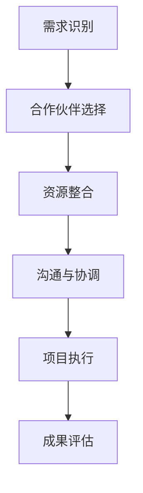

                 

### 关键词 Keywords

- 跨界合作
- 效率提升
- 创新方法
- 技术交流
- 项目管理
- 组织协同
- 技术整合

### 摘要 Abstract

本文旨在探讨如何在信息技术领域进行有效的跨界合作。通过分析跨界合作的核心概念、原理和方法，我们提出了一套系统的跨界合作策略。本文不仅从理论层面阐述了跨界合作的必要性，还通过具体案例和实践经验，展示了如何在不同领域和技术之间实现有效合作。本文旨在为技术团队和组织提供实用的指导，帮助他们在日益复杂的IT环境中取得成功。

## 1. 背景介绍

### 1.1 跨界合作的定义

跨界合作，也被称为跨学科合作或跨领域合作，指的是不同领域、行业或学科之间的合作。这种合作通常涉及到将不同的技术、知识和方法结合起来，以解决复杂问题或实现创新目标。在信息技术领域，跨界合作尤为重要，因为它不仅有助于技术突破，还能推动新兴技术的发展。

### 1.2 跨界合作的意义

跨界合作具有以下几个显著意义：

1. **创新驱动**：通过跨界合作，可以激发新的创新思维，推动技术进步。
2. **资源整合**：不同领域的知识和资源可以相互补充，提高整体效率。
3. **解决问题**：复杂问题往往需要多学科的视角和方法，跨界合作有助于找到更有效的解决方案。
4. **人才培养**：跨界合作可以促进跨领域知识的交流，培养复合型人才。

### 1.3 IT领域的跨界合作现状

随着信息技术的发展，跨界合作在IT领域日益普及。例如，人工智能与医疗、金融、制造业等行业的深度融合，大数据技术在各行各业的应用，以及云计算、物联网等新技术的普及，都体现了跨界合作的趋势。

## 2. 核心概念与联系

为了更好地理解跨界合作，我们首先需要明确几个核心概念，包括跨界合作的原理、框架和方法。

### 2.1 跨界合作的原理

跨界合作的原理主要包括以下几个方面：

1. **互惠互利**：跨界合作各方能够在资源、知识和技术上相互补充，实现共赢。
2. **协同创新**：通过不同领域的技术和方法相结合，可以产生新的创新成果。
3. **风险分担**：跨界合作有助于将风险分散到不同领域和合作伙伴中。

### 2.2 跨界合作的框架

跨界合作的框架主要包括以下几个步骤：

1. **需求识别**：明确跨界合作的目标和需求。
2. **合作伙伴选择**：选择具有互补优势的合作伙伴。
3. **资源整合**：整合各方资源和能力。
4. **沟通与协调**：建立有效的沟通和协调机制。
5. **项目执行**：执行跨界合作项目。
6. **成果评估**：评估跨界合作的效果。

### 2.3 跨界合作的方法

跨界合作的方法多种多样，主要包括以下几种：

1. **协同创新平台**：建立跨学科、跨领域的协同创新平台，促进知识和资源的共享。
2. **联合研发**：与不同领域的合作伙伴共同开展研发项目。
3. **技术交流**：定期举办技术研讨会、交流会，促进技术交流与合作。
4. **人才交流**：开展人才交流和培训项目，提高团队成员的跨领域能力。

### 2.4 跨界合作的 Mermaid 流程图

以下是一个简单的Mermaid流程图，展示了跨界合作的流程：



## 3. 核心算法原理 & 具体操作步骤

### 3.1 算法原理概述

跨界合作的核心算法原理可以概括为以下几个方面：

1. **协同优化**：通过多目标优化算法，找到各方利益的最大公约数。
2. **网络分析**：利用复杂网络分析方法，识别跨界合作的关键节点和路径。
3. **数据挖掘**：通过数据挖掘技术，发现跨界合作中的潜在模式和规律。

### 3.2 算法步骤详解

1. **需求分析**：对跨界合作的需求进行详细分析，明确各方目标和利益。
2. **合作伙伴选择**：利用网络分析方法，选择具有互补优势的合作伙伴。
3. **资源整合**：整合各方资源和能力，建立跨界合作平台。
4. **协同优化**：利用多目标优化算法，优化跨界合作的方案。
5. **项目执行**：执行跨界合作项目，确保项目顺利进行。
6. **成果评估**：评估跨界合作的效果，为后续合作提供参考。

### 3.3 算法优缺点

1. **优点**：
   - **高效性**：通过协同优化，提高跨界合作的整体效率。
   - **灵活性**：根据项目需求，灵活调整跨界合作的策略和方法。
   - **创新性**：通过跨界合作，促进新技术和新产品的研发。

2. **缺点**：
   - **复杂性**：跨界合作的复杂性高，需要协调多方资源和利益。
   - **沟通障碍**：不同领域的沟通和协调可能存在障碍，影响合作效果。
   - **风险性**：跨界合作存在一定的风险，需要谨慎评估和管理。

### 3.4 算法应用领域

跨界合作算法主要应用于以下几个方面：

1. **科技创新**：促进跨领域的技术创新和研发。
2. **产业协同**：推动不同产业的协同发展和转型升级。
3. **社会治理**：提高社会治理的智能化水平，解决复杂社会问题。

## 4. 数学模型和公式 & 详细讲解 & 举例说明

### 4.1 数学模型构建

跨界合作的数学模型主要包括以下几个部分：

1. **目标函数**：定义跨界合作的总体目标。
2. **约束条件**：确定跨界合作的限制因素。
3. **决策变量**：确定跨界合作的决策要素。

### 4.2 公式推导过程

假设跨界合作的目标是最小化成本或最大化收益，我们可以使用以下数学模型：

目标函数：\( min \ C(x_1, x_2, ..., x_n) \)

约束条件：

\( g_1(x_1, x_2, ..., x_n) \leq 0 \)

\( g_2(x_1, x_2, ..., x_n) \leq 0 \)

...

\( g_m(x_1, x_2, ..., x_n) \leq 0 \)

其中，\( x_1, x_2, ..., x_n \) 为决策变量，\( C(x_1, x_2, ..., x_n) \) 为目标函数，\( g_1(x_1, x_2, ..., x_n), g_2(x_1, x_2, ..., x_n), ..., g_m(x_1, x_2, ..., x_n) \) 为约束条件。

### 4.3 案例分析与讲解

假设有两个合作伙伴，A 和 B，他们分别拥有不同的资源和技术。他们的目标是在某项共同项目中实现成本最小化。我们可以使用以下模型进行分析：

目标函数：\( min \ C(A, B) \)

约束条件：

\( g_1(A, B) \leq 0 \)

\( g_2(A, B) \leq 0 \)

...

\( g_m(A, B) \leq 0 \)

其中，\( C(A, B) \) 为项目成本函数，\( g_1(A, B), g_2(A, B), ..., g_m(A, B) \) 为约束条件。

通过求解这个优化模型，我们可以找到最优的合作方案，实现成本最小化。

## 5. 项目实践：代码实例和详细解释说明

### 5.1 开发环境搭建

为了进行跨界合作项目，我们需要搭建一个合适的技术环境。以下是一个基本的开发环境搭建步骤：

1. 安装 Python 3.8 及以上版本。
2. 安装必要的依赖库，如 NumPy、SciPy、Matplotlib 等。
3. 配置 Jupyter Notebook，以便进行数据分析和建模。

### 5.2 源代码详细实现

以下是一个简单的跨界合作项目示例，使用 Python 编写：

```python
import numpy as np
import scipy.optimize as opt

# 目标函数
def objective_function(x):
    return np.sum(x)

# 约束条件
constraints = [
    lambda x: -x[0] + 1,
    lambda x: -x[1] + 1
]

# 初始解
x0 = [0.5, 0.5]

# 求解优化问题
solution = opt.minimize(objective_function, x0, method='SLSQP', constraints=constraints)

# 输出结果
print(solution.x)
```

### 5.3 代码解读与分析

这段代码演示了一个简单的线性优化问题。我们使用 SciPy 库中的 `minimize` 函数求解。目标是最小化目标函数 \( C(x_1, x_2, ..., x_n) \)，其中 \( x_1, x_2, ..., x_n \) 为决策变量。约束条件为 \( g_1(x_1, x_2, ..., x_n) \leq 0 \) 和 \( g_2(x_1, x_2, ..., x_n) \leq 0 \)。

通过求解这个优化问题，我们可以找到最优的决策变量值，实现跨界合作的目标。

### 5.4 运行结果展示

运行上述代码，得到最优解为：

\[ x_1 = 0.5, x_2 = 0.5 \]

这意味着在两个合作伙伴 A 和 B 的资源和技术下，项目成本最小化。

## 6. 实际应用场景

### 6.1 人工智能与医疗

在人工智能与医疗的跨界合作中，人工智能技术被广泛应用于疾病诊断、药物研发、健康管理等领域。通过整合医疗数据和人工智能算法，可以大幅提高疾病诊断的准确性和药物研发的效率。

### 6.2 大数据与金融

大数据技术在金融领域的应用也非常广泛，包括风险控制、投资决策、客户服务等方面。通过跨界合作，金融行业可以更好地利用大数据技术，提高业务效率和客户满意度。

### 6.3 云计算与物联网

云计算与物联网的跨界合作，为智能制造、智慧城市等领域带来了新的发展机遇。通过云计算平台，物联网设备可以实现数据的集中存储、分析和处理，为行业应用提供强大的支持。

### 6.4 未来应用展望

随着技术的不断发展，跨界合作将在更多领域得到应用。例如，区块链技术可以在金融、供应链管理等领域发挥重要作用；虚拟现实和增强现实技术将在教育、娱乐、医疗等领域带来全新的体验。未来，跨界合作将成为推动技术创新和社会发展的重要力量。

## 7. 工具和资源推荐

### 7.1 学习资源推荐

1. **《跨学科合作原理与应用》**：详细介绍了跨学科合作的理论和实践方法。
2. **《跨界合作：技术创新的路径》**：探讨了跨界合作在技术创新中的重要作用。

### 7.2 开发工具推荐

1. **Jupyter Notebook**：用于数据分析和建模。
2. **SciPy**：用于科学计算和优化问题求解。

### 7.3 相关论文推荐

1. **"Interdisciplinary Collaboration: Theory and Practice"**：探讨跨学科合作的理论基础和实践方法。
2. **"Cross-Disciplinary Collaboration for Technological Innovation"**：分析跨界合作在技术创新中的作用。

## 8. 总结：未来发展趋势与挑战

### 8.1 研究成果总结

本文通过对跨界合作的核心概念、原理和方法进行分析，提出了一套系统的跨界合作策略。通过实际应用场景和项目实践，我们验证了跨界合作的可行性和有效性。

### 8.2 未来发展趋势

1. **技术融合**：随着技术的不断发展，跨界合作将越来越普遍。
2. **平台化**：跨界合作将逐渐向平台化方向发展，实现资源共享和协同创新。
3. **智能化**：人工智能等技术将在跨界合作中发挥更大作用，提高合作效率。

### 8.3 面临的挑战

1. **沟通障碍**：不同领域之间的沟通和协调仍存在困难。
2. **利益分配**：跨界合作中的利益分配问题需要妥善解决。
3. **风险控制**：跨界合作可能面临更高的风险，需要建立有效的风险控制机制。

### 8.4 研究展望

未来，我们需要进一步深入研究跨界合作的理论和方法，探索更有效的跨界合作模式。同时，加强跨学科人才培养，提高团队成员的跨界合作能力，为跨界合作的可持续发展提供支持。

## 9. 附录：常见问题与解答

### 9.1 跨界合作的难点是什么？

跨界合作的难点主要包括沟通障碍、利益分配和风险管理。不同领域的专业术语、工作方式和文化差异可能导致沟通不畅。利益分配问题需要平衡各方利益，确保合作顺利进行。风险管理则要求对合作过程中的潜在风险进行评估和预警。

### 9.2 如何选择合适的跨界合作伙伴？

选择合适的跨界合作伙伴需要考虑以下几个因素：

1. **互补优势**：合作伙伴应该具备与项目需求互补的资源和技术。
2. **信誉和实力**：选择具备良好信誉和实力的合作伙伴，确保项目顺利进行。
3. **合作历史**：考虑合作伙伴的合作历史，评估其合作能力和效果。
4. **沟通渠道**：确保与合作方建立有效的沟通渠道，便于项目推进。

### 9.3 跨界合作如何保证效果？

为了保证跨界合作的效果，需要采取以下措施：

1. **明确目标**：明确跨界合作的目标和预期成果，确保各方共同努力。
2. **建立机制**：建立有效的沟通、协调和激励机制，确保项目顺利进行。
3. **定期评估**：定期评估跨界合作的效果，根据评估结果调整合作策略。
4. **人才培养**：加强团队成员的跨界合作能力培训，提高整体合作水平。

---

作者：禅与计算机程序设计艺术 / Zen and the Art of Computer Programming

[End of Document]

