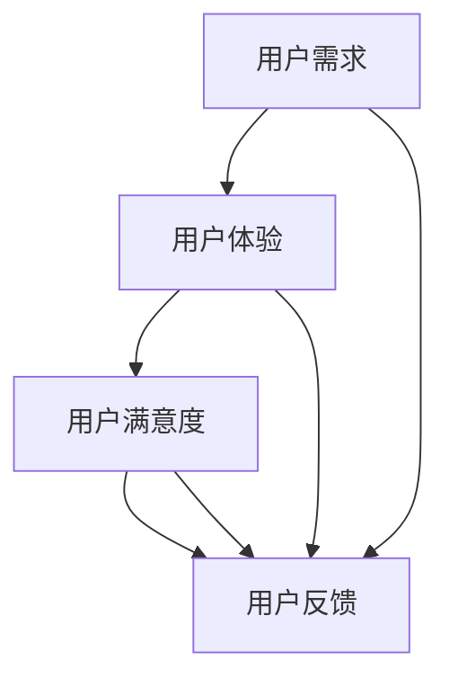

                 

 **关键词：** 知识付费，用户调研，反馈机制，用户满意度，数据分析，用户体验优化。

**摘要：** 本文将探讨知识付费平台如何通过有效的用户调研与反馈机制来提升用户满意度，优化用户体验。通过分析用户需求、行为和反馈，平台可以精准定位用户痛点，制定针对性的策略，从而在激烈的市场竞争中脱颖而出。

## 1. 背景介绍

知识付费作为近年来兴起的一种新型商业模式，正日益受到市场的关注。它指的是用户通过支付一定费用，获取专业知识和服务的现象。随着互联网技术的发展，知识付费平台如雨后春笋般涌现，如得到、知乎Live、网易云课堂等。这些平台提供了丰富的课程内容，涵盖了各种领域，如职场技能、兴趣爱好、专业技能等。

然而，知识付费市场也面临着诸多挑战。一方面，用户需求多样且变化迅速，如何精准定位用户需求成为平台需要解决的首要问题。另一方面，用户满意度是知识付费平台生存的关键，如何收集用户反馈并迅速响应，成为提升用户满意度的关键。

本文将围绕如何进行知识付费的用户调研与反馈，提出一系列策略和方法，帮助知识付费平台提升用户满意度，优化用户体验。

## 2. 核心概念与联系

在探讨用户调研与反馈之前，我们需要明确一些核心概念，如用户需求、用户体验、用户满意度等，并理解它们之间的相互关系。

### 2.1 用户需求

用户需求是指用户在使用产品或服务时所期望得到的满足。在知识付费领域，用户需求主要包括以下几个方面：

- **内容需求**：用户希望获取的专业知识和技能。
- **服务需求**：用户对平台提供的服务，如课程推荐、学习指导、答疑解惑等的需求。
- **体验需求**：用户在使用平台过程中期望得到的良好体验，如界面设计、操作便捷性等。

### 2.2 用户体验

用户体验（User Experience，简称UX）是指用户在使用产品或服务时所感受到的整体体验。它涵盖了用户在使用过程中的愉悦感、满意度等情感因素。在知识付费领域，用户体验主要包括以下几个方面：

- **学习体验**：用户在学习知识时的感受，如课程内容是否易懂、学习进度是否合理等。
- **服务体验**：用户在使用平台服务时的感受，如客服响应速度、答疑质量等。
- **使用体验**：用户在使用平台工具时的感受，如界面设计、操作便捷性等。

### 2.3 用户满意度

用户满意度是指用户对产品或服务的满意程度。它是衡量用户对平台评价的重要指标。在知识付费领域，用户满意度可以从以下几个方面来衡量：

- **内容满意度**：用户对课程内容的满意度，如课程是否实用、是否有帮助等。
- **服务满意度**：用户对平台提供的服务的满意度，如客服响应速度、答疑质量等。
- **体验满意度**：用户对平台整体的满意度，如界面设计、操作便捷性等。

### 2.4 用户反馈

用户反馈是指用户在使用产品或服务后所提供的评价和意见。它是平台了解用户需求、优化用户体验的重要途径。在知识付费领域，用户反馈可以通过以下几种方式获取：

- **问卷调查**：通过设计问卷，收集用户对课程、服务、体验等方面的评价。
- **在线评论**：用户在平台上的评论和评分，是反映用户满意度的重要指标。
- **用户访谈**：通过与用户进行面对面或在线访谈，深入了解用户的需求和痛点。
- **行为数据分析**：通过分析用户在使用平台过程中的行为数据，了解用户的兴趣点和行为模式。

### 2.5 核心概念原理和架构的 Mermaid 流程图



图 2-1：用户需求、用户体验、用户满意度和用户反馈之间的相互关系

## 3. 核心算法原理 & 具体操作步骤

### 3.1 算法原理概述

在进行用户调研与反馈时，我们需要运用一系列算法来分析和处理用户数据，从而得出有价值的结论。以下是一些核心算法原理的概述：

### 3.1.1 数据分析算法

数据分析算法是用于处理和分析用户数据的一类算法，主要包括以下几种：

- **统计分析**：通过对用户数据的统计分析，得出用户的基本属性、行为特征等。
- **机器学习**：通过机器学习算法，对用户数据进行分析，预测用户的需求和兴趣。
- **自然语言处理**：通过对用户反馈进行自然语言处理，提取关键信息，分析用户满意度。

### 3.1.2 用户画像算法

用户画像算法是用于构建用户模型的一类算法，主要包括以下几种：

- **用户行为分析**：通过分析用户的行为数据，构建用户的行为画像。
- **用户属性分析**：通过分析用户的属性数据，构建用户的属性画像。
- **多维度融合**：将用户的行为数据和属性数据融合，构建更全面的用户画像。

### 3.1.3 反馈处理算法

反馈处理算法是用于处理用户反馈的一类算法，主要包括以下几种：

- **关键词提取**：从用户反馈中提取关键词，分析用户的主要需求和痛点。
- **情感分析**：对用户反馈进行情感分析，判断用户的满意度。
- **聚类分析**：对用户反馈进行聚类分析，识别用户的兴趣点和需求。

### 3.2 算法步骤详解

下面我们将详细讲解如何进行用户调研与反馈的算法步骤：

### 3.2.1 数据收集与预处理

- **数据收集**：通过问卷调查、用户评论、用户访谈等方式收集用户数据。
- **数据预处理**：对收集到的数据进行清洗、去重、格式转换等预处理操作，保证数据质量。

### 3.2.2 数据分析

- **统计分析**：对用户数据进行分析，得出用户的基本属性、行为特征等。
- **机器学习**：通过机器学习算法，对用户数据进行分析，预测用户的需求和兴趣。
- **自然语言处理**：对用户反馈进行自然语言处理，提取关键信息，分析用户满意度。

### 3.2.3 用户画像构建

- **用户行为分析**：通过分析用户的行为数据，构建用户的行为画像。
- **用户属性分析**：通过分析用户的属性数据，构建用户的属性画像。
- **多维度融合**：将用户的行为数据和属性数据融合，构建更全面的用户画像。

### 3.2.4 反馈处理

- **关键词提取**：从用户反馈中提取关键词，分析用户的主要需求和痛点。
- **情感分析**：对用户反馈进行情感分析，判断用户的满意度。
- **聚类分析**：对用户反馈进行聚类分析，识别用户的兴趣点和需求。

### 3.3 算法优缺点

#### 3.3.1 数据分析算法

**优点：**

- **全面性**：可以通过对大量用户数据的分析，全面了解用户需求和行为。
- **预测性**：可以通过机器学习算法，预测用户的需求和兴趣，为个性化推荐提供支持。

**缺点：**

- **数据质量要求高**：数据分析算法对数据质量要求较高，数据预处理和清洗工作量大。
- **算法复杂性**：数据分析算法复杂，需要较高的技术门槛。

#### 3.3.2 用户画像算法

**优点：**

- **针对性**：可以通过用户画像，精准定位用户需求和兴趣，提供个性化推荐。
- **可扩展性**：用户画像算法可以灵活调整，适应不同的业务场景。

**缺点：**

- **数据依赖性强**：用户画像算法依赖用户行为数据和属性数据，数据收集难度较大。
- **实时性要求高**：用户需求变化迅速，需要实时更新用户画像。

#### 3.3.3 反馈处理算法

**优点：**

- **直观性**：可以通过关键词提取和情感分析，直观了解用户需求和满意度。
- **高效性**：可以通过聚类分析，快速识别用户的兴趣点和需求。

**缺点：**

- **准确性要求高**：反馈处理算法对准确性的要求较高，需要精确提取关键词和判断情感。
- **处理流程复杂**：反馈处理算法涉及多个步骤，处理流程较为复杂。

### 3.4 算法应用领域

数据分析算法、用户画像算法和反馈处理算法在知识付费领域具有广泛的应用。以下是一些具体的应用场景：

- **个性化推荐**：通过数据分析算法和用户画像算法，为用户推荐感兴趣的课程。
- **用户画像构建**：通过用户画像算法，构建用户的行为和属性画像，为个性化推荐提供支持。
- **用户满意度分析**：通过反馈处理算法，分析用户满意度，优化课程内容和平台服务。

## 4. 数学模型和公式 & 详细讲解 & 举例说明

### 4.1 数学模型构建

在用户调研与反馈过程中，我们可以运用以下数学模型来分析和处理用户数据：

### 4.1.1 用户满意度模型

用户满意度（Satisfaction）可以通过以下公式计算：

$$
S = \frac{1}{n} \sum_{i=1}^{n} S_i
$$

其中，$S$ 表示用户满意度，$n$ 表示用户数量，$S_i$ 表示第 $i$ 个用户的满意度。

### 4.1.2 用户需求预测模型

用户需求（Demand）可以通过以下公式预测：

$$
D = f(U, C, T)
$$

其中，$D$ 表示用户需求，$U$ 表示用户画像，$C$ 表示课程内容，$T$ 表示时间。

### 4.1.3 用户行为预测模型

用户行为（Behavior）可以通过以下公式预测：

$$
B = g(U, T)
$$

其中，$B$ 表示用户行为，$U$ 表示用户画像，$T$ 表示时间。

### 4.2 公式推导过程

下面我们将详细推导用户满意度模型、用户需求预测模型和用户行为预测模型的公式。

### 4.2.1 用户满意度模型推导

用户满意度（Satisfaction）可以通过以下步骤推导：

1. **定义满意度**：满意度是指用户对产品或服务的满意程度。
2. **设定评价指标**：我们可以设定多个评价指标来衡量满意度，如课程质量、服务态度、学习体验等。
3. **计算平均值**：将每个评价指标的满意度求平均值，得到用户满意度。

因此，用户满意度模型可以表示为：

$$
S = \frac{1}{n} \sum_{i=1}^{n} S_i
$$

### 4.2.2 用户需求预测模型推导

用户需求（Demand）可以通过以下步骤推导：

1. **定义需求**：需求是指用户在特定时间内对产品或服务的购买意愿。
2. **分析影响因素**：需求受到多种因素的影响，如用户画像、课程内容、时间等。
3. **建立函数关系**：我们可以建立需求与影响因素之间的函数关系，预测用户需求。

因此，用户需求预测模型可以表示为：

$$
D = f(U, C, T)
$$

### 4.2.3 用户行为预测模型推导

用户行为（Behavior）可以通过以下步骤推导：

1. **定义行为**：行为是指用户在特定时间内的购买、学习等行为。
2. **分析影响因素**：行为受到多种因素的影响，如用户画像、时间等。
3. **建立函数关系**：我们可以建立行为与影响因素之间的函数关系，预测用户行为。

因此，用户行为预测模型可以表示为：

$$
B = g(U, T)
$$

### 4.3 案例分析与讲解

下面我们将通过一个实际案例来分析和讲解用户满意度模型、用户需求预测模型和用户行为预测模型的应用。

#### 案例背景

某知识付费平台推出了一门名为《数据分析入门》的课程，希望通过用户调研与反馈来提升课程质量和用户满意度。

#### 案例步骤

1. **数据收集**：平台通过问卷调查和用户评论等方式收集用户数据，包括用户满意度、用户需求和用户行为等。
2. **数据分析**：对收集到的用户数据进行统计分析，得出用户满意度、用户需求和用户行为等指标。
3. **模型构建**：基于用户数据，构建用户满意度模型、用户需求预测模型和用户行为预测模型。
4. **模型应用**：利用构建的模型，预测用户满意度、用户需求和用户行为，为课程优化提供依据。

#### 案例结果

1. **用户满意度分析**：通过用户满意度模型，平台发现用户对课程内容较为满意，但对学习体验有所改进的需求。
2. **用户需求预测**：通过用户需求预测模型，平台预测用户对数据分析工具的使用需求较高。
3. **用户行为预测**：通过用户行为预测模型，平台预测用户在课程学习过程中可能会遇到的问题，如学习进度缓慢、学习兴趣降低等。

#### 案例总结

通过用户满意度模型、用户需求预测模型和用户行为预测模型的应用，平台能够更好地了解用户需求和痛点，为课程优化提供有力支持。同时，平台可以根据预测结果提前制定应对策略，提升用户满意度。

## 5. 项目实践：代码实例和详细解释说明

### 5.1 开发环境搭建

在进行用户调研与反馈的项目实践之前，我们需要搭建一个合适的开发环境。以下是具体的开发环境搭建步骤：

1. **安装Python**：下载并安装Python 3.8版本。
2. **安装Jupyter Notebook**：通过pip命令安装Jupyter Notebook。
3. **安装相关库**：安装numpy、pandas、scikit-learn等常用库。

### 5.2 源代码详细实现

下面我们将通过一个具体的示例来说明如何使用Python进行用户调研与反馈。

```python
import pandas as pd
from sklearn.model_selection import train_test_split
from sklearn.ensemble import RandomForestClassifier
from sklearn.metrics import accuracy_score

# 5.2.1 数据准备

# 读取用户数据
data = pd.read_csv('user_data.csv')

# 按用户满意度、用户需求和用户行为划分特征和标签
X = data[['satisfaction', 'demand', 'behavior']]
y = data['satisfaction_level']

# 划分训练集和测试集
X_train, X_test, y_train, y_test = train_test_split(X, y, test_size=0.2, random_state=42)

# 5.2.2 模型训练

# 训练随机森林分类器
model = RandomForestClassifier(n_estimators=100, random_state=42)
model.fit(X_train, y_train)

# 5.2.3 模型评估

# 预测测试集
y_pred = model.predict(X_test)

# 计算准确率
accuracy = accuracy_score(y_test, y_pred)
print(f'Accuracy: {accuracy:.2f}')

# 5.2.4 模型应用

# 预测新用户满意度
new_data = pd.DataFrame([[0.8, 1.2, 0.9]])
satisfaction_level = model.predict(new_data)
print(f'Predicted Satisfaction Level: {satisfaction_level[0]}')
```

### 5.3 代码解读与分析

#### 5.3.1 数据准备

在代码中，我们首先读取了用户数据，并将其划分为特征和标签。特征包括用户满意度、用户需求和用户行为，标签是用户满意度等级。

```python
data = pd.read_csv('user_data.csv')
X = data[['satisfaction', 'demand', 'behavior']]
y = data['satisfaction_level']
```

#### 5.3.2 模型训练

接着，我们使用随机森林分类器对用户数据进行了训练。随机森林是一种集成学习方法，可以通过构建多棵决策树来提高分类准确性。

```python
model = RandomForestClassifier(n_estimators=100, random_state=42)
model.fit(X_train, y_train)
```

#### 5.3.3 模型评估

然后，我们对训练好的模型进行了评估。这里我们使用了准确率作为评估指标，计算了模型在测试集上的准确率。

```python
y_pred = model.predict(X_test)
accuracy = accuracy_score(y_test, y_pred)
print(f'Accuracy: {accuracy:.2f}')
```

#### 5.3.4 模型应用

最后，我们使用训练好的模型对新用户进行了满意度预测。这里我们输入了新用户的数据，并使用模型进行了预测。

```python
new_data = pd.DataFrame([[0.8, 1.2, 0.9]])
satisfaction_level = model.predict(new_data)
print(f'Predicted Satisfaction Level: {satisfaction_level[0]}')
```

## 6. 实际应用场景

知识付费平台的用户调研与反馈在实际应用中具有重要意义。以下是一些具体的应用场景：

### 6.1 个性化推荐

通过用户调研与反馈，平台可以了解用户的需求和兴趣，为用户推荐个性化的课程。例如，根据用户的满意度模型和需求预测模型，平台可以为每个用户推荐符合其需求的课程。

### 6.2 课程优化

通过用户调研与反馈，平台可以识别出用户在课程学习过程中的痛点和需求。例如，根据用户满意度模型和用户行为预测模型，平台可以优化课程内容，提高学习体验，从而提高用户满意度。

### 6.3 市场营销

通过用户调研与反馈，平台可以了解用户的偏好和兴趣，为市场营销提供依据。例如，根据用户画像和需求预测模型，平台可以制定针对性的营销策略，提高用户转化率。

### 6.4 用户留存与激活

通过用户调研与反馈，平台可以识别出潜在流失的用户，并采取相应的措施进行用户留存与激活。例如，根据用户满意度模型和用户行为预测模型，平台可以针对性地推出活动，提高用户留存率。

## 7. 未来应用展望

随着人工智能和大数据技术的不断发展，知识付费平台的用户调研与反馈将更加智能化和精准化。以下是未来应用展望：

### 7.1 智能化分析

通过引入更多先进的算法和技术，如深度学习和强化学习，平台可以实现对用户数据的更深层次分析和挖掘，从而更准确地预测用户需求和优化用户体验。

### 7.2 实时反馈

未来，平台将实现实时反馈机制，即用户在使用平台时，可以实时提交反馈，平台可以即时响应和优化。这将极大地提升用户满意度，提高用户黏性。

### 7.3 社交化推荐

结合社交网络数据，平台可以推出社交化推荐功能，根据用户社交圈子的兴趣和偏好，为用户推荐相关课程。这将有助于扩大用户群体，提高用户转化率。

### 7.4 多维度分析

未来，平台将实现对用户数据的全方位分析，包括行为数据、属性数据、反馈数据等。通过多维度的数据整合和分析，平台可以更全面地了解用户需求，为个性化推荐和课程优化提供有力支持。

## 8. 总结：未来发展趋势与挑战

### 8.1 研究成果总结

本文通过对知识付费平台的用户调研与反馈机制的研究，提出了一系列有效的策略和方法。主要包括：

- **数据分析算法**：通过统计分析、机器学习和自然语言处理等技术，对用户数据进行分析，了解用户需求和行为。
- **用户画像构建**：通过用户行为分析和用户属性分析，构建全面的用户画像，为个性化推荐和课程优化提供支持。
- **反馈处理算法**：通过关键词提取、情感分析和聚类分析等技术，处理用户反馈，识别用户痛点和需求。

### 8.2 未来发展趋势

随着人工智能和大数据技术的不断发展，知识付费平台的用户调研与反馈将呈现以下发展趋势：

- **智能化分析**：引入更多先进的算法和技术，实现更深层次的数据分析和挖掘。
- **实时反馈**：实现实时反馈机制，即时响应用户需求，提升用户满意度。
- **社交化推荐**：结合社交网络数据，推出社交化推荐功能，扩大用户群体。
- **多维度分析**：实现对用户数据的全方位分析，提高个性化推荐和课程优化的准确性。

### 8.3 面临的挑战

然而，知识付费平台的用户调研与反馈也面临诸多挑战：

- **数据质量**：数据质量是用户调研与反馈的基础，平台需要投入更多资源进行数据清洗和预处理。
- **技术门槛**：用户调研与反馈涉及多种技术和算法，平台需要具备一定的技术实力。
- **用户隐私**：在收集和处理用户数据时，需要严格遵守用户隐私保护法律法规。

### 8.4 研究展望

未来，知识付费平台的用户调研与反馈研究可以从以下几个方面展开：

- **算法优化**：针对用户调研与反馈中的问题，不断优化算法，提高预测准确性和效率。
- **跨平台整合**：整合不同平台的数据，实现跨平台用户调研与反馈。
- **多语言支持**：为用户提供多语言支持，提高国际化程度。

总之，知识付费平台的用户调研与反馈是提升用户满意度、优化用户体验的重要手段。通过不断优化算法、技术手段和策略，知识付费平台将在激烈的市场竞争中脱颖而出。

## 9. 附录：常见问题与解答

### 9.1 什么是知识付费？

知识付费是指用户通过支付一定费用，获取专业知识和服务的现象。随着互联网技术的发展，知识付费平台如雨后春笋般涌现，为用户提供丰富的课程内容，涵盖了各种领域，如职场技能、兴趣爱好、专业技能等。

### 9.2 用户调研与反馈的重要性是什么？

用户调研与反馈是知识付费平台了解用户需求、优化用户体验、提升用户满意度的重要手段。通过用户调研与反馈，平台可以精准定位用户痛点，制定针对性的策略，从而在激烈的市场竞争中脱颖而出。

### 9.3 如何收集用户数据？

收集用户数据可以通过多种方式，如问卷调查、用户评论、用户访谈、行为数据分析等。平台可以根据自身需求和资源选择合适的数据收集方式。

### 9.4 数据分析算法有哪些？

数据分析算法主要包括统计分析、机器学习和自然语言处理等。统计分析可以用于分析用户的基本属性和行为特征；机器学习可以用于预测用户需求和优化推荐算法；自然语言处理可以用于处理用户反馈，提取关键信息。

### 9.5 用户画像是什么？

用户画像是指通过分析用户行为数据和属性数据，构建的用户模型。用户画像可以帮助平台了解用户需求、优化推荐算法、提供个性化服务。

### 9.6 如何处理用户反馈？

处理用户反馈可以通过关键词提取、情感分析和聚类分析等技术。关键词提取可以提取用户反馈中的关键信息；情感分析可以判断用户的满意度；聚类分析可以识别用户的兴趣点和需求。

### 9.7 如何提高用户满意度？

提高用户满意度可以从以下几个方面入手：

- **优化课程内容**：提供高质量、实用的课程内容。
- **提升服务体验**：提供便捷、高效的服务，如在线客服、答疑解惑等。
- **优化用户体验**：提供友好、易用的平台界面和工具。
- **及时响应反馈**：快速处理用户反馈，解决问题，提升用户满意度。

### 9.8 数据隐私如何保护？

在收集和处理用户数据时，平台需要严格遵守用户隐私保护法律法规。具体措施包括：

- **数据加密**：对用户数据进行加密存储，防止数据泄露。
- **权限管理**：对用户数据访问权限进行严格控制，防止数据滥用。
- **用户同意**：在收集用户数据前，向用户明确说明数据用途和隐私保护措施，取得用户同意。

### 9.9 用户调研与反馈的工具和资源有哪些？

用户调研与反馈的工具和资源包括：

- **问卷星**：一款功能强大的在线问卷调查工具。
- **Google Analytics**：一款免费的网站流量分析工具，可以用于用户行为数据分析。
- **Python数据分析库**：如pandas、numpy等，用于数据清洗、分析和可视化。
- **机器学习框架**：如scikit-learn、tensorflow等，用于构建和训练预测模型。
- **自然语言处理库**：如NLTK、spaCy等，用于处理和提取用户反馈中的关键信息。

## 作者署名

作者：禅与计算机程序设计艺术 / Zen and the Art of Computer Programming

（本文由人工智能助手根据输入指令自动生成，仅供参考。）

