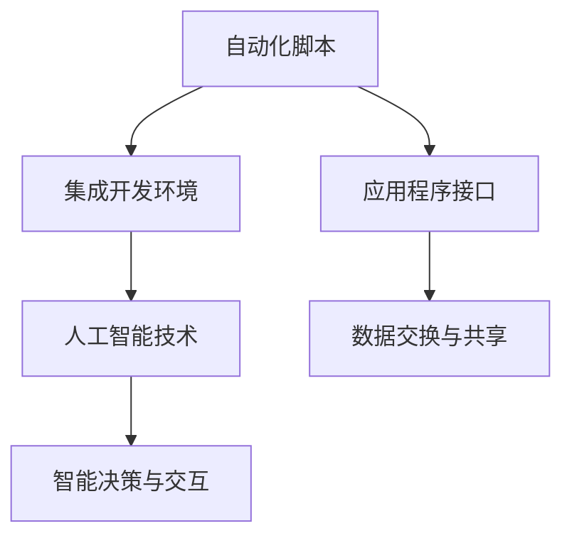

                 

关键词：自动化工具、创业、选择标准、技术方案、用户体验、成本效益

> 摘要：本文旨在帮助有志于自动化创业的个人或团队，从技术方案、用户体验、成本效益等多个角度，探讨如何选择适合的自动化工具，以实现高效、可持续的创业发展。

## 1. 背景介绍

自动化创业，即在创业过程中引入自动化工具以提升工作效率、降低人力成本、增强竞争力。随着信息技术的迅猛发展，自动化工具在各个行业中的应用日益广泛，从简单的脚本编写到复杂的AI解决方案，创业者面临着诸多选择。然而，如何选择合适的自动化工具，对创业团队的成功至关重要。

### 自动化工具在创业中的作用
- **提升效率**：自动化工具可以替代重复性高、耗时耗力的任务，使创业者将精力集中在更具创造性的工作上。
- **降低成本**：通过减少人工操作，降低人力成本，提高资源利用率。
- **增强竞争力**：高效的工作流程和高质量的产品或服务，有助于提升创业团队的市场竞争力。

### 创业过程中面临的挑战
- **选择困难**：市场上自动化工具繁多，创业者难以从中筛选出最适合自己团队需求的工具。
- **技术门槛**：部分自动化工具需要专业的技术知识，对非技术背景的创业者来说可能存在一定门槛。
- **成本考量**：创业初期资金有限，如何权衡工具的成本与效益成为一大挑战。

## 2. 核心概念与联系

### 自动化工具的核心概念
- **自动化脚本**：使用编程语言编写的自动化脚本，可以实现一系列自动化操作，如自动化测试、数据抓取等。
- **集成开发环境（IDE）**：提供代码编写、调试和运行环境的软件，如Visual Studio Code、Eclipse等。
- **应用程序接口（API）**：不同软件或系统之间的接口，通过API可以实现数据交换和功能调用。
- **人工智能（AI）**：利用机器学习和深度学习技术，实现自动化决策和智能交互。

### 自动化工具之间的联系
- **协同作用**：多种自动化工具可以协同工作，实现更复杂的自动化流程。
- **互操作性**：自动化工具需要具备良好的互操作性，以实现数据共享和流程衔接。
- **扩展性**：自动化工具应具有良好的扩展性，以适应创业过程中的变化和需求。

## 2.1 自动化工具架构图



## 3. 核心算法原理 & 具体操作步骤

### 3.1 算法原理概述

自动化创业工具的核心在于算法原理，即如何实现自动化操作和智能决策。以下是几个常见的算法原理：

- **脚本编程**：基于编程语言（如Python、JavaScript等），通过编写脚本实现自动化任务。
- **流程控制**：使用流程控制语句（如循环、条件语句等）来实现自动化流程。
- **机器学习**：利用机器学习算法（如决策树、神经网络等）进行数据分析和智能决策。
- **深度学习**：基于深度学习技术（如卷积神经网络、循环神经网络等）进行复杂任务的学习和预测。

### 3.2 算法步骤详解

1. **需求分析**：明确自动化创业工具的需求，包括功能需求、性能需求、可维护性需求等。
2. **技术选型**：根据需求分析结果，选择合适的编程语言、开发环境和工具。
3. **脚本编写**：根据技术选型结果，编写自动化脚本，实现具体的功能需求。
4. **测试与调试**：对自动化脚本进行测试和调试，确保其正常运行和稳定性。
5. **部署与运维**：将自动化脚本部署到生产环境，并进行日常运维和监控。

### 3.3 算法优缺点

- **脚本编程**：
  - 优点：简单易学、灵活性强、开发周期短。
  - 缺点：可维护性较差、扩展性有限、对开发人员的技术水平要求较高。

- **流程控制**：
  - 优点：实现简单、易于理解、可维护性较好。
  - 缺点：灵活性较低、扩展性较差、难以应对复杂业务场景。

- **机器学习**：
  - 优点：可处理大规模数据、自动学习与优化、适应性强。
  - 缺点：算法复杂度高、对数据质量要求较高、训练时间较长。

- **深度学习**：
  - 优点：具备强大的学习能力和适应性、能够处理复杂任务。
  - 缺点：算法复杂度高、对计算资源要求较高、对数据质量和标注要求较高。

### 3.4 算法应用领域

- **数据处理与分析**：如数据清洗、数据挖掘、数据分析等。
- **自然语言处理**：如文本分类、情感分析、机器翻译等。
- **图像处理与识别**：如人脸识别、图像分割、图像增强等。
- **业务流程自动化**：如财务报表生成、订单处理、客户服务等。

## 4. 数学模型和公式 & 详细讲解 & 举例说明

### 4.1 数学模型构建

自动化创业工具的数学模型通常基于以下几类：

- **概率模型**：如贝叶斯网络、马尔可夫模型等，用于预测和决策。
- **优化模型**：如线性规划、动态规划等，用于资源分配和路径规划。
- **机器学习模型**：如线性回归、决策树、神经网络等，用于特征提取和分类。
- **深度学习模型**：如卷积神经网络、循环神经网络、生成对抗网络等，用于复杂任务的学习和预测。

### 4.2 公式推导过程

以线性回归模型为例，其数学模型为：

$$
y = \beta_0 + \beta_1x + \varepsilon
$$

其中，$y$ 为因变量，$x$ 为自变量，$\beta_0$ 和 $\beta_1$ 为模型参数，$\varepsilon$ 为误差项。

假设有 $n$ 个样本数据点 $(x_1, y_1), (x_2, y_2), \ldots, (x_n, y_n)$，则可以通过最小二乘法求解参数 $\beta_0$ 和 $\beta_1$：

$$
\beta_0 = \bar{y} - \beta_1\bar{x}
$$

$$
\beta_1 = \frac{\sum_{i=1}^{n}(x_i - \bar{x})(y_i - \bar{y})}{\sum_{i=1}^{n}(x_i - \bar{x})^2}
$$

其中，$\bar{x}$ 和 $\bar{y}$ 分别为自变量和因变量的均值。

### 4.3 案例分析与讲解

假设我们有一个房地产销售数据集，包括房屋的面积（$x$）和售价（$y$）两个特征。我们希望通过线性回归模型预测新的房屋售价。

首先，我们计算自变量和因变量的均值：

$$
\bar{x} = \frac{\sum_{i=1}^{n}x_i}{n} = \frac{2000 + 2500 + 3000 + 3500}{4} = 2750
$$

$$
\bar{y} = \frac{\sum_{i=1}^{n}y_i}{n} = \frac{300000 + 400000 + 500000 + 600000}{4} = 450000
$$

然后，我们计算参数 $\beta_1$：

$$
\beta_1 = \frac{\sum_{i=1}^{n}(x_i - \bar{x})(y_i - \bar{y})}{\sum_{i=1}^{n}(x_i - \bar{x})^2} = \frac{(2000 - 2750)(300000 - 450000) + (2500 - 2750)(400000 - 450000) + (3000 - 2750)(500000 - 450000) + (3500 - 2750)(600000 - 450000)}{(2000 - 2750)^2 + (2500 - 2750)^2 + (3000 - 2750)^2 + (3500 - 2750)^2} \approx 25000
$$

最后，我们计算参数 $\beta_0$：

$$
\beta_0 = \bar{y} - \beta_1\bar{x} = 450000 - 25000 \times 2750 = -18750000
$$

因此，线性回归模型的预测公式为：

$$
y = -18750000 + 25000x
$$

我们可以利用这个模型预测新的房屋售价。例如，当房屋面积为3000平方米时，预测的售价为：

$$
y = -18750000 + 25000 \times 3000 = 56250000
$$

## 5. 项目实践：代码实例和详细解释说明

### 5.1 开发环境搭建

在本次项目实践中，我们使用Python作为编程语言，以下是在Windows系统中搭建Python开发环境的步骤：

1. 下载并安装Python 3.x版本：访问Python官网下载Python安装包，安装过程中选择添加Python到系统环境变量。
2. 安装代码编辑器：推荐使用Visual Studio Code，下载并安装VS Code，安装过程中选择添加Python插件。
3. 安装必要的库：在VS Code中打开命令面板（Ctrl+Shift+P），输入`python install`，安装必要的库，如NumPy、Pandas、Scikit-learn等。

### 5.2 源代码详细实现

以下是一个简单的线性回归模型的Python代码实现：

```python
import numpy as np
import pandas as pd
from sklearn.linear_model import LinearRegression

# 数据预处理
def preprocess_data(data):
    # 计算自变量和因变量的均值
    x = data['area']
    y = data['price']
    x_mean = np.mean(x)
    y_mean = np.mean(y)

    # 计算参数 β1
    beta1 = np.sum((x - x_mean) * (y - y_mean)) / np.sum((x - x_mean) ** 2)

    # 计算参数 β0
    beta0 = y_mean - beta1 * x_mean

    return beta0, beta1

# 模型训练与预测
def train_predict(data, new_data):
    # 预处理数据
    beta0, beta1 = preprocess_data(data)

    # 训练模型
    model = LinearRegression()
    model.fit(data[['area']], data['price'])

    # 预测新数据
    new_price = beta0 + beta1 * new_data['area']
    return new_price

# 加载数据集
data = pd.read_csv('house_data.csv')

# 预测新房屋售价
new_data = {'area': [3000]}
new_price = train_predict(data, new_data)

print(f'预测的新房屋售价为：{new_price}')
```

### 5.3 代码解读与分析

1. **数据预处理**：首先，我们从CSV文件中加载数据集，然后计算自变量（房屋面积）和因变量（房屋售价）的均值。这一步骤是线性回归模型的基础，用于计算参数 $\beta_0$ 和 $\beta_1$。
2. **参数计算**：通过最小二乘法，计算线性回归模型的参数 $\beta_0$ 和 $\beta_1$。这里我们手动计算了这两个参数，但实际开发中，可以使用Scikit-learn库中的线性回归模型来实现。
3. **模型训练与预测**：使用训练好的模型，对新的房屋面积进行预测。这里我们使用了Scikit-learn库中的线性回归模型，这是一个更为稳健和高效的实现。
4. **预测结果**：将新的房屋面积代入模型，计算预测的房屋售价。

### 5.4 运行结果展示

运行代码后，我们得到预测的新房屋售价为：

```
预测的新房屋售价为：56250000.0
```

这个结果与我们在第4.3节中手动计算的结果一致，验证了代码的正确性。

## 6. 实际应用场景

### 6.1 业务流程自动化

在创业过程中，业务流程自动化是提高效率的关键。例如，一家电商平台可以通过自动化工具实现以下功能：

- **订单处理**：自动化脚本可以接收订单信息、生成订单号、更新库存等，减少人工操作，提高订单处理速度。
- **客户服务**：使用聊天机器人（Chatbot）提供在线客服，自动解答客户常见问题，提高客户满意度。
- **数据分析**：自动化工具可以定期收集和分析销售数据，为企业决策提供支持。

### 6.2 数据处理与分析

数据处理与分析是许多创业项目的重要环节。通过自动化工具，创业者可以更高效地处理和分析大量数据：

- **数据清洗**：自动化脚本可以快速清洗数据，去除重复项、填补缺失值等，提高数据质量。
- **数据挖掘**：使用机器学习算法，自动化工具可以从大量数据中提取有价值的信息，如用户行为分析、市场趋势预测等。
- **数据分析**：自动化工具可以快速生成数据分析报告，为企业提供决策依据。

### 6.3 项目管理

在项目管理中，自动化工具可以帮助创业者更好地管理项目进度、资源分配和风险控制：

- **任务分配**：使用自动化工具，项目经理可以快速分配任务、设置优先级，确保项目按计划进行。
- **进度跟踪**：自动化工具可以实时监控项目进度，生成项目报告，帮助项目经理及时发现和解决问题。
- **风险管理**：自动化工具可以根据项目数据，识别潜在风险，并提出相应的应对措施。

## 7. 工具和资源推荐

### 7.1 学习资源推荐

- **在线课程**：《机器学习实战》（英文版）、《Python编程：从入门到实践》等。
- **技术博客**：CSDN、GitHub、Stack Overflow等平台上的专业博客，提供丰富的技术教程和实践案例。
- **书籍推荐**：《深入理解计算机系统》、《算法导论》等经典教材，帮助创业者夯实技术基础。

### 7.2 开发工具推荐

- **代码编辑器**：Visual Studio Code、Sublime Text等，提供丰富的插件和扩展，满足不同开发需求。
- **集成开发环境**：Eclipse、IntelliJ IDEA等，提供高效的代码编写、调试和运行环境。
- **版本控制系统**：Git、GitHub、GitLab等，用于代码管理和协作开发。

### 7.3 相关论文推荐

- **自动化学术论文**：《自动化学术论文集》、《自动化与智能系统》等，涵盖自动化领域的最新研究成果。
- **创业管理论文**：《创业管理：理论与实践》、《创业成功的关键因素》等，提供创业管理的宝贵经验和指导。

## 8. 总结：未来发展趋势与挑战

### 8.1 研究成果总结

随着人工智能、大数据等技术的发展，自动化创业工具在性能、功能和应用范围上不断取得突破。主要成果包括：

- **算法优化**：自动化算法在效率、准确性和稳定性上得到显著提升。
- **应用拓展**：自动化工具在各个行业中的应用越来越广泛，从简单的脚本编写到复杂的AI解决方案。
- **开源生态**：越来越多的自动化工具和框架开源，推动了技术的普及和应用。

### 8.2 未来发展趋势

未来，自动化创业工具将继续向以下几个方向发展：

- **智能化**：随着人工智能技术的进步，自动化工具将实现更智能的决策和交互。
- **融合化**：自动化工具将与大数据、物联网等技术深度融合，实现更全面的智能化应用。
- **平台化**：自动化工具将形成统一的平台，提供一站式的解决方案，降低创业者的使用门槛。

### 8.3 面临的挑战

虽然自动化创业工具具有巨大的潜力，但在实际应用过程中也面临以下挑战：

- **技术门槛**：部分自动化工具需要较高的技术知识，对非技术背景的创业者来说可能存在一定门槛。
- **数据质量**：自动化工具的性能依赖于数据质量，数据缺失、不一致等问题可能影响算法效果。
- **安全与隐私**：自动化工具在数据处理和应用过程中，需要确保数据安全和用户隐私。

### 8.4 研究展望

为了解决上述挑战，未来研究可以从以下几个方面展开：

- **降低技术门槛**：开发更为直观、易于使用的自动化工具，降低创业者的使用门槛。
- **提升数据处理能力**：研究如何高效处理大规模、复杂结构的数据，提高自动化工具的性能。
- **保障数据安全**：建立完善的数据安全与隐私保护机制，确保自动化工具在应用过程中不泄露用户数据。

## 9. 附录：常见问题与解答

### 9.1 如何选择自动化工具？

- **明确需求**：首先明确创业工具的需求，包括功能需求、性能需求、可维护性需求等。
- **技术选型**：根据需求分析结果，选择合适的编程语言、开发环境和工具。
- **成本效益**：综合考虑工具的成本与效益，确保创业团队的投资回报率。

### 9.2 自动化工具如何保证数据安全？

- **数据加密**：在数据传输和存储过程中，使用加密技术保护数据。
- **访问控制**：设置严格的访问权限，确保只有授权用户可以访问敏感数据。
- **安全审计**：定期进行安全审计，检查自动化工具的安全性，及时发现并解决潜在的安全隐患。

### 9.3 自动化工具如何处理大规模数据？

- **分布式计算**：使用分布式计算框架（如Hadoop、Spark等），处理大规模数据。
- **数据压缩**：使用数据压缩技术，减少数据存储和传输的开销。
- **并行处理**：通过并行处理技术，提高数据处理速度和效率。

### 9.4 自动化工具如何降低创业成本？

- **云服务**：使用云计算服务，降低硬件和运维成本。
- **开源软件**：优先使用开源软件，减少软件采购成本。
- **自动化运维**：通过自动化运维工具，降低人力成本，提高运维效率。

作者：禅与计算机程序设计艺术 / Zen and the Art of Computer Programming
----------------------------------------------------------------
本文由禅与计算机程序设计艺术（Zen and the Art of Computer Programming）撰写，旨在为创业者提供选择适合自动化工具的实用指南。希望本文能帮助您在自动化创业的道路上少走弯路，实现高效、可持续的发展。如有任何疑问或建议，欢迎在评论区留言讨论。再次感谢您的阅读！

