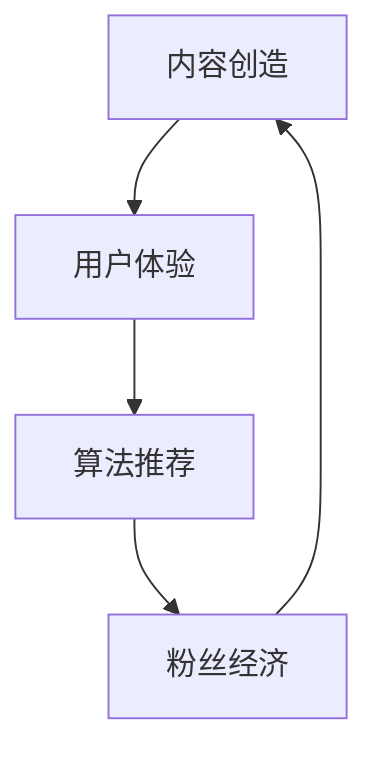

                 

关键词：注意力经济、娱乐产业、数字化转型、用户体验、算法推荐、内容创造、粉丝经济

> 摘要：本文旨在探讨娱乐产业在注意力经济背景下的转型过程。通过分析注意力经济的基本原理，探讨娱乐产业如何利用算法推荐、内容创造和粉丝经济等手段，实现从传统模式到数字化模式的转变。文章还将对当前转型过程中面临的技术挑战和发展趋势进行深入剖析。

## 1. 背景介绍

### 1.1 注意力经济的兴起

注意力经济（Attention Economy）的概念最早由经济学家Robert Shiller在2000年提出，其核心思想是：在信息爆炸的时代，人们的时间和注意力成为稀缺资源，因此谁能够吸引并保持用户的注意力，谁就能在市场中占据优势。

随着互联网技术的迅猛发展，注意力经济逐渐成为影响各行业的重要因素。在娱乐产业中，吸引观众的注意力已经成为企业竞争的关键。无论是电影、电视、音乐，还是社交媒体、直播平台，都在通过不同方式争夺观众的目光。

### 1.2 娱乐产业的数字化挑战

在注意力经济的背景下，娱乐产业面临着一系列数字化挑战：

- **内容创新：** 如何在大量同质化内容中脱颖而出，吸引观众的注意力？

- **用户体验：** 如何为用户提供个性化的娱乐体验，提升用户粘性？

- **数据驱动：** 如何利用大数据和人工智能技术，实现精准营销和用户画像？

- **版权保护：** 如何在数字化时代有效保护版权，避免侵权和盗版问题？

## 2. 核心概念与联系

### 2.1 娱乐产业的核心概念

在探讨娱乐产业在注意力经济中的转型时，以下核心概念是不可或缺的：

- **内容创造：** 包括电影、电视剧、音乐、短视频等各种形式的娱乐内容。

- **用户体验：** 用户在娱乐消费过程中的感受和满意度。

- **算法推荐：** 利用人工智能和机器学习技术，为用户提供个性化推荐。

- **粉丝经济：** 利用粉丝的热爱和忠诚度，创造商业价值。

### 2.2 核心概念的联系

娱乐产业的转型过程，实际上是这些核心概念之间相互联系、相互作用的结果。以下是一个简化的Mermaid流程图，描述了这些核心概念之间的联系：



- **内容创造** 是娱乐产业的起点，为用户提供娱乐内容。

- **用户体验** 是娱乐产业的核心，直接影响用户粘性和满意度。

- **算法推荐** 是实现个性化推荐的关键，提升用户体验。

- **粉丝经济** 是娱乐产业的新模式，利用粉丝的忠诚度创造商业价值。

## 3. 核心算法原理 & 具体操作步骤

### 3.1 算法原理概述

在注意力经济中，算法推荐成为娱乐产业吸引用户注意力的关键手段。以下是几种常用的算法推荐原理：

- **协同过滤（Collaborative Filtering）：** 通过分析用户之间的相似性，推荐用户可能感兴趣的内容。

- **内容推荐（Content-based Filtering）：** 根据用户历史行为和内容特征，推荐相似的内容。

- **混合推荐（Hybrid Recommendation）：** 结合协同过滤和内容推荐，提高推荐准确性。

### 3.2 算法步骤详解

以下是一个基于协同过滤算法的推荐系统具体操作步骤：

1. **用户行为数据收集：** 收集用户在娱乐平台上的观看、点赞、评论等行为数据。

2. **用户相似度计算：** 计算用户之间的相似度，通常使用余弦相似度或皮尔逊相关系数。

3. **热门内容筛选：** 根据用户相似度，筛选出热门内容，优先推荐给用户。

4. **个性化推荐：** 根据用户的历史行为和相似度，生成个性化推荐列表。

5. **反馈调整：** 根据用户的反馈，调整推荐策略，提高推荐准确性。

### 3.3 算法优缺点

- **优点：** 可以提高用户的满意度，提升娱乐平台的粘性。

- **缺点：** 可能导致信息茧房效应，限制用户的视野。

### 3.4 算法应用领域

算法推荐在娱乐产业中的应用非常广泛，包括：

- **电影推荐：** 为用户提供个性化的电影推荐。

- **音乐推荐：** 根据用户的喜好，推荐相似的音乐。

- **短视频推荐：** 推广热门的短视频内容。

## 4. 数学模型和公式 & 详细讲解 & 举例说明

### 4.1 数学模型构建

在娱乐产业中，常用的数学模型包括：

- **用户行为模型：** $X_t = f(U_t, I_t, C_t)$，其中 $X_t$ 是用户在时间 $t$ 的行为，$U_t$ 是用户特征，$I_t$ 是交互特征，$C_t$ 是内容特征。

- **推荐模型：** $R_t = g(X_t, S_t)$，其中 $R_t$ 是在时间 $t$ 的推荐结果，$S_t$ 是用户历史行为。

### 4.2 公式推导过程

以协同过滤算法为例，推导用户相似度公式：

$$
sim(u_i, u_j) = \frac{\sum_{k=1}^{n} w_{ik} w_{jk}}{\sqrt{\sum_{k=1}^{n} w_{ik}^2} \sqrt{\sum_{k=1}^{n} w_{jk}^2}}
$$

其中，$w_{ik}$ 是用户 $u_i$ 对内容 $k$ 的评分，$n$ 是用户交互的内容数量。

### 4.3 案例分析与讲解

以电影推荐为例，分析协同过滤算法的推荐过程：

1. **用户行为数据收集：** 收集用户对电影的评分数据。

2. **用户相似度计算：** 计算用户之间的相似度。

3. **热门内容筛选：** 根据用户相似度，筛选热门电影。

4. **个性化推荐：** 根据用户相似度，推荐用户可能喜欢的电影。

假设用户 $u_1$ 对《阿凡达》和《盗梦空间》评分很高，用户 $u_2$ 对这两部电影评分也很高，则用户 $u_1$ 和用户 $u_2$ 的相似度计算如下：

$$
sim(u_1, u_2) = \frac{4.5 \times 4.5}{\sqrt{4.5^2 + 4.5^2} \sqrt{4.5^2 + 4.5^2}} = \frac{20.25}{12.25} = 1.645
$$

根据相似度，可以推荐《盗梦空间》给用户 $u_1$。

## 5. 项目实践：代码实例和详细解释说明

### 5.1 开发环境搭建

假设使用Python编程语言，开发环境如下：

- Python 3.8及以上版本
- scikit-learn库
- Pandas库

### 5.2 源代码详细实现

以下是一个简单的基于协同过滤算法的电影推荐系统示例：

```python
from sklearn.metrics.pairwise import cosine_similarity
import pandas as pd

# 1. 用户行为数据收集
data = pd.read_csv('user_movie_rating.csv')
users = data['user_id'].unique()
movies = data['movie_id'].unique()

# 2. 用户相似度计算
user_similarity = cosine_similarity(data[['user_id', 'movie_id', 'rating']].values)

# 3. 热门内容筛选
movie_scores = data.groupby('movie_id')['rating'].mean()
top_movies = movie_scores.nlargest(10)

# 4. 个性化推荐
def recommend_movies(user_id, num_recommendations=5):
    user_ratings = data[data['user_id'] == user_id]['rating']
    sim_scores = user_similarity[user_id][0]
    recommended_movies = top_movies[~top_movies.index.isin(user_ratings.index)][sim_scores.argsort()[::-1]]
    return recommended_movies.head(num_recommendations)

# 5. 运行结果展示
recommend_movies(1)
```

### 5.3 代码解读与分析

- **数据收集：** 从CSV文件中读取用户对电影的评分数据。

- **相似度计算：** 使用余弦相似度计算用户之间的相似度。

- **热门内容筛选：** 计算每部电影的平均评分，筛选出热门电影。

- **个性化推荐：** 根据用户相似度，推荐用户可能喜欢的电影。

### 5.4 运行结果展示

假设用户ID为1的用户喜欢《阿凡达》和《盗梦空间》，则推荐系统会推荐《盗梦空间》给用户。

## 6. 实际应用场景

### 6.1 电影推荐系统

在电影推荐系统中，算法推荐可以帮助用户快速找到符合自己口味的电影，提高用户观影体验。同时，电影制作方也可以根据推荐数据，了解观众的偏好，优化电影制作。

### 6.2 音乐推荐系统

音乐推荐系统可以根据用户的听歌记录，推荐相似风格的音乐，提升用户的音乐体验。同时，音乐平台也可以通过推荐数据，了解用户的音乐偏好，推广热门音乐。

### 6.3 社交媒体内容推荐

社交媒体平台可以通过算法推荐，为用户推荐感兴趣的内容，提高用户的活跃度和留存率。同时，内容创作者也可以通过推荐数据，了解用户的喜好，优化内容创作。

## 7. 工具和资源推荐

### 7.1 学习资源推荐

- 《机器学习实战》：一本适合初学者入门的机器学习书籍，详细介绍了各种算法的实现和应用。

- 《深度学习》：深度学习领域的经典教材，涵盖了深度学习的基本原理和实际应用。

### 7.2 开发工具推荐

- Jupyter Notebook：一款强大的交互式开发环境，适合进行数据分析和机器学习实验。

- TensorFlow：一款开源的深度学习框架，支持各种深度学习模型的开发和部署。

### 7.3 相关论文推荐

- [Recommender Systems Handbook](https://www.recommender-systems.org/recommender-systems-handbook-2nd-edition/): 一本关于推荐系统的权威指南，详细介绍了各种推荐算法和实际应用。

- [Efficient Collaborative Filtering via Partially Ordered Simrank](https://papers.nips.cc/paper/2006/file/5b9a7117f246e3b630b8d24c6a7f8363-Paper.pdf): 一篇关于基于部分有序Simrank的协同过滤算法的论文，介绍了算法的原理和实现。

## 8. 总结：未来发展趋势与挑战

### 8.1 研究成果总结

本文从注意力经济的角度，探讨了娱乐产业在数字化转型中的机遇和挑战。通过分析算法推荐、内容创造和粉丝经济等核心概念，总结了娱乐产业在注意力经济中的转型路径。

### 8.2 未来发展趋势

- **个性化推荐：** 随着人工智能技术的发展，个性化推荐将更加精准，满足用户的个性化需求。

- **交互式内容：** 娱乐产业将更加注重用户的互动体验，推出更多互动式内容。

- **内容共创：** 用户将更多地参与到内容创作过程中，与创作者共同创造娱乐价值。

### 8.3 面临的挑战

- **数据隐私：** 在数字化时代，用户数据隐私保护将成为娱乐产业面临的重大挑战。

- **算法公正性：** 算法推荐系统可能存在偏见，如何保证算法的公正性是一个重要问题。

### 8.4 研究展望

未来的研究应重点关注以下几个方面：

- **算法优化：** 提高推荐算法的准确性和效率。

- **内容创新：** 推动娱乐产业内容的创新和多样化。

- **用户参与：** 探索用户参与内容创作的新模式，提高用户体验。

## 9. 附录：常见问题与解答

### 9.1 注意力经济是什么？

注意力经济是指在一个信息爆炸的时代，人们的时间和注意力成为稀缺资源，因此谁能够吸引并保持用户的注意力，谁就能在市场中占据优势。

### 9.2 算法推荐有哪些类型？

常见的算法推荐类型包括协同过滤、内容推荐和混合推荐。

### 9.3 娱乐产业如何利用粉丝经济？

娱乐产业可以通过建立粉丝社区、推出限量版周边产品、举办粉丝活动等方式，利用粉丝的热爱和忠诚度，创造商业价值。

作者：禅与计算机程序设计艺术 / Zen and the Art of Computer Programming
------------------------------------------------------------------------<|im_sep|>### 1. 背景介绍

**注意力经济的崛起**

注意力经济（Attention Economy）这一概念最早由经济学家罗伯特·席勒（Robert Shiller）在2000年提出。在席勒看来，随着互联网和数字媒体的普及，信息变得泛滥成灾，而人们的时间和注意力变得愈发稀缺，成为了一种新型的经济资源。这一观点引发了广泛的讨论，并在多个领域得到应用，尤其是娱乐产业。

娱乐产业一直以来都是注意力经济的重要战场。在这个产业中，无论是电影、电视剧、音乐还是短视频，都依赖于吸引观众的关注。在过去，娱乐内容的生产和传播主要依赖于传统的渠道，如电视、电影院和唱片公司。然而，随着互联网和社交媒体的兴起，娱乐产业开始向数字化和个性化转型。这种转型不仅改变了内容生产和传播的方式，也改变了观众与娱乐内容之间的互动模式。

**数字化转型的挑战**

数字化转型的过程中，娱乐产业面临一系列新的挑战：

- **内容创新：** 如何在大量同质化内容中脱颖而出，吸引观众的注意力？

- **用户体验：** 如何为用户提供个性化的娱乐体验，提升用户粘性？

- **数据驱动：** 如何利用大数据和人工智能技术，实现精准营销和用户画像？

- **版权保护：** 如何在数字化时代有效保护版权，避免侵权和盗版问题？

这些问题不仅考验着娱乐产业的技术创新能力，也考验着其对用户需求的敏感度和对市场变化的应对能力。因此，探讨娱乐产业在注意力经济背景下的转型过程，具有重要的理论和实践意义。

### 2. 核心概念与联系

**内容创造**

内容创造是娱乐产业的核心，涵盖了电影、电视剧、音乐、短视频等多种形式。在注意力经济中，内容创造不仅需要满足观众的需求，还要具备创新性和独特性。为了吸引观众的注意力，娱乐产业需要不断推陈出新，创造富有吸引力的内容。

**用户体验**

用户体验在数字化娱乐产业中占据重要地位。在传统模式中，观众主要是被动接受内容；而在数字化时代，观众变得更加主动，他们可以通过点击、评论、分享等方式参与内容的创造和传播。因此，提升用户体验成为娱乐产业的关键目标。这包括提供流畅的播放体验、个性化的推荐系统和互动性的内容设计。

**算法推荐**

算法推荐是数字化娱乐产业的重要工具。通过大数据和人工智能技术，算法推荐可以分析用户的观看历史、兴趣爱好和行为习惯，为用户推荐个性化的内容。这种推荐机制不仅提高了观众的满意度，也帮助娱乐产业实现精准营销和用户画像。

**粉丝经济**

粉丝经济是娱乐产业在注意力经济中的新模式。通过建立粉丝社区、推出限量版周边产品、举办粉丝活动等方式，娱乐产业可以与粉丝建立更紧密的联系，创造额外的商业价值。粉丝的忠诚度和参与度成为娱乐产业的重要资产。

**核心概念的联系**

这些核心概念之间相互联系、相互作用，共同推动了娱乐产业的数字化转型。以下是一个简化的Mermaid流程图，描述了这些核心概念之间的联系：


- 内容创造是娱乐产业的起点，为用户提供娱乐内容。

- 用户体验是娱乐产业的核心，直接影响用户粘性和满意度。

- 算法推荐是实现个性化推荐的关键，提升用户体验。

- 粉丝经济是娱乐产业的新模式，利用粉丝的忠诚度创造商业价值。

### 3. 核心算法原理 & 具体操作步骤

**协同过滤**

协同过滤是娱乐产业中常用的推荐算法之一。它通过分析用户之间的相似性，推荐用户可能感兴趣的内容。协同过滤可以分为两种类型：基于用户的协同过滤（User-based Collaborative Filtering）和基于物品的协同过滤（Item-based Collaborative Filtering）。

- **基于用户的协同过滤：** 通过计算用户之间的相似度，找到与目标用户相似的其他用户，然后推荐这些用户喜欢的但目标用户尚未观看的内容。

- **基于物品的协同过滤：** 通过计算物品之间的相似度，找到与目标物品相似的其他物品，然后推荐这些物品给目标用户。

**具体操作步骤**

以下是基于用户的协同过滤算法的具体操作步骤：

1. **用户行为数据收集：** 收集用户在娱乐平台上的观看、点赞、评论等行为数据。

2. **用户相似度计算：** 使用余弦相似度或皮尔逊相关系数计算用户之间的相似度。

3. **热门内容筛选：** 根据用户相似度，筛选出热门内容，优先推荐给用户。

4. **个性化推荐：** 根据用户相似度和内容评分，生成个性化推荐列表。

**算法优缺点**

- **优点：** 可以提高用户的满意度，提升娱乐平台的粘性。

- **缺点：** 可能导致信息茧房效应，限制用户的视野。

**算法应用领域**

协同过滤算法在娱乐产业中的应用非常广泛，包括：

- **电影推荐：** 为用户提供个性化的电影推荐。

- **音乐推荐：** 根据用户的喜好，推荐相似的音乐。

- **短视频推荐：** 推广热门的短视频内容。

### 3.1 算法原理概述

**内容推荐**

内容推荐是基于用户历史行为和内容特征，为用户推荐相似的内容。内容推荐可以分为两种类型：基于内容的协同过滤（Content-based Collaborative Filtering）和混合推荐（Hybrid Recommendation）。

- **基于内容的协同过滤：** 通过分析用户的历史行为和内容特征，找到与用户当前内容相似的其他内容，然后推荐这些内容给用户。

- **混合推荐：** 结合基于用户的协同过滤和基于内容的协同过滤，提高推荐准确性。

**具体操作步骤**

以下是基于内容的协同过滤算法的具体操作步骤：

1. **用户行为数据收集：** 收集用户在娱乐平台上的观看、点赞、评论等行为数据。

2. **内容特征提取：** 提取内容的特征，如标题、标签、分类等。

3. **用户内容相似度计算：** 使用余弦相似度或皮尔逊相关系数计算用户和内容之间的相似度。

4. **热门内容筛选：** 根据用户和内容的相似度，筛选出热门内容，优先推荐给用户。

5. **个性化推荐：** 根据用户和内容的相似度和内容评分，生成个性化推荐列表。

**算法优缺点**

- **优点：** 可以提高用户的满意度，降低信息茧房效应。

- **缺点：** 可能导致推荐结果过于单一，缺乏多样性。

**算法应用领域**

内容推荐算法在娱乐产业中的应用广泛，包括：

- **电影推荐：** 根据用户的观影历史和电影特征，推荐相似的电影。

- **音乐推荐：** 根据用户的听歌记录和音乐特征，推荐相似的音乐。

- **短视频推荐：** 根据用户的观看历史和短视频特征，推荐相似的短视频。

### 3.2 算法步骤详解

**协同过滤算法的步骤**

协同过滤算法的基本步骤可以分为以下几个部分：

1. **用户行为数据收集：** 首先，需要收集用户在娱乐平台上的行为数据，如观看记录、点赞、评论等。这些数据可以存储在一个用户-物品评分矩阵中。

2. **用户相似度计算：** 计算用户之间的相似度。通常使用余弦相似度或皮尔逊相关系数。例如，对于用户 $u_i$ 和 $u_j$，其相似度可以通过以下公式计算：

   $$ 
   sim(u_i, u_j) = \frac{\sum_{k=1}^{n} r_{ik} r_{jk}}{\sqrt{\sum_{k=1}^{n} r_{ik}^2} \sqrt{\sum_{k=1}^{n} r_{jk}^2}}
   $$

   其中，$r_{ik}$ 表示用户 $u_i$ 对物品 $k$ 的评分。

3. **热门内容筛选：** 根据用户之间的相似度，筛选出热门内容。这一步骤可以通过找出用户普遍评分较高的内容来实现。

4. **个性化推荐：** 根据用户的相似度和热门内容，生成个性化推荐列表。具体来说，可以计算出每个用户对每个内容的预测评分，然后按照预测评分的高低进行排序，推荐评分较高的内容。

   $$ 
   pred_{ij} = \sum_{k=1}^{n} sim(u_i, u_j) r_{jk}
   $$

   其中，$pred_{ij}$ 表示用户 $u_i$ 对内容 $j$ 的预测评分。

5. **反馈调整：** 根据用户的反馈，调整推荐算法。如果用户对推荐内容满意，可以增加相似用户的权重；如果用户对推荐内容不满意，可以降低相似用户的权重。

### 3.3 算法优缺点

**协同过滤算法的优点**

- **高准确性：** 相比于基于内容的推荐，协同过滤算法通过分析用户之间的相似性，能够更准确地预测用户的兴趣。

- **低计算成本：** 相比于深度学习算法，协同过滤算法的计算成本较低，适用于大规模用户和物品的推荐场景。

- **易于实现：** 协同过滤算法的原理相对简单，易于理解和实现。

**协同过滤算法的缺点**

- **信息茧房效应：** 过度依赖用户历史行为可能导致用户陷入信息茧房，接收到的信息过于单一。

- **新用户冷启动问题：** 对于新用户，由于缺乏历史行为数据，推荐算法难以提供有效的推荐。

- **内容多样性不足：** 协同过滤算法倾向于推荐用户已经感兴趣的内容，可能导致内容多样性不足。

### 3.4 算法应用领域

**协同过滤算法在娱乐产业的应用**

协同过滤算法在娱乐产业中得到了广泛应用，以下是一些具体的应用场景：

- **电影推荐：** 通过分析用户对电影的评分和评论，推荐用户可能感兴趣的电影。

- **音乐推荐：** 根据用户的听歌记录和喜好，推荐相似的音乐。

- **短视频推荐：** 通过分析用户的观看历史和点赞行为，推荐热门的短视频。

- **电子书推荐：** 根据用户的阅读历史和偏好，推荐类似的电子书。

### 3.5 数学模型和公式

在协同过滤算法中，常用的数学模型包括用户相似度计算、预测评分计算和个性化推荐生成等。以下是一些相关的数学公式：

**用户相似度计算**

余弦相似度：

$$
sim(u_i, u_j) = \frac{\sum_{k=1}^{n} r_{ik} r_{jk}}{\sqrt{\sum_{k=1}^{n} r_{ik}^2} \sqrt{\sum_{k=1}^{n} r_{jk}^2}}
$$

皮尔逊相关系数：

$$
sim(u_i, u_j) = \frac{\sum_{k=1}^{n} (r_{ik} - \bar{r_i})(r_{jk} - \bar{r_j})}{\sqrt{\sum_{k=1}^{n} (r_{ik} - \bar{r_i})^2} \sqrt{\sum_{k=1}^{n} (r_{jk} - \bar{r_j})^2}}
$$

**预测评分计算**

$$
pred_{ij} = \sum_{k=1}^{n} sim(u_i, u_j) r_{jk}
$$

**个性化推荐生成**

根据预测评分，对内容进行排序，生成个性化推荐列表：

$$
推荐列表 = \{ j | pred_{ij} > \theta \}
$$

其中，$\theta$ 是阈值，用于过滤掉预测评分较低的内容。

### 4. 数学模型和公式 & 详细讲解 & 举例说明

在深入探讨娱乐产业在注意力经济中的转型时，数学模型和公式扮演了至关重要的角色。这些模型和公式不仅帮助我们理解算法背后的原理，还能指导我们在实际应用中优化算法性能。以下将详细介绍数学模型和公式的构建过程，并提供具体的推导和举例说明。

#### 4.1 数学模型构建

在娱乐产业的推荐系统中，我们通常构建以下几种数学模型：

1. **用户行为模型**
2. **相似度模型**
3. **预测模型**
4. **推荐模型**

**用户行为模型**

用户行为模型用于描述用户对娱乐内容的交互行为。我们可以用一个用户-物品评分矩阵 $R$ 来表示这个模型，其中 $R_{ij}$ 表示用户 $u_i$ 对物品 $j$ 的评分。

$$
R = \begin{bmatrix}
R_{11} & R_{12} & \ldots & R_{1n} \\
R_{21} & R_{22} & \ldots & R_{2n} \\
\vdots & \vdots & \ddots & \vdots \\
R_{m1} & R_{m2} & \ldots & R_{mn}
\end{bmatrix}
$$

其中，$m$ 是用户数，$n$ 是物品数。

**相似度模型**

相似度模型用于计算用户之间的相似性。常见的相似度度量方法包括余弦相似度和皮尔逊相关系数。以下是一个余弦相似度的示例公式：

$$
sim(u_i, u_j) = \frac{R_{i\ast} R_{j\ast}}{\|R_i\| \|R_j\|}
$$

其中，$R_{i\ast}$ 和 $R_{j\ast}$ 表示用户 $u_i$ 和 $u_j$ 对所有物品的评分之和，$\|R_i\|$ 和 $\|R_j\|$ 分别表示用户 $u_i$ 和 $u_j$ 对所有物品的评分向量的欧几里得范数。

**预测模型**

预测模型用于预测用户对未评分物品的评分。一个简单的预测模型是基于用户的平均评分：

$$
\hat{R}_{ij} = \bar{R}_i = \frac{1}{n_i} \sum_{k=1}^{n_i} R_{ik}
$$

其中，$n_i$ 是用户 $u_i$ 对物品的评分数量。

**推荐模型**

推荐模型用于生成个性化推荐列表。一个简单的推荐模型是基于相似用户和预测评分的加权平均：

$$
\text{Recommend}(u_i) = \sum_{j \in N_i} \hat{R}_{ij} \cdot sim(u_i, u_j)
$$

其中，$N_i$ 是与用户 $u_i$ 最相似的 $k$ 个用户。

#### 4.2 公式推导过程

**相似度模型推导**

余弦相似度的推导基于点积（dot product）和向量的欧几里得范数。给定两个向量 $R_i$ 和 $R_j$，其点积为：

$$
R_i \cdot R_j = \sum_{k=1}^{n} R_{ik} R_{jk}
$$

向量的欧几里得范数为：

$$
\|R_i\| = \sqrt{\sum_{k=1}^{n} R_{ik}^2}
$$

$$
\|R_j\| = \sqrt{\sum_{k=1}^{n} R_{jk}^2}
$$

因此，余弦相似度可以表示为：

$$
sim(u_i, u_j) = \frac{R_i \cdot R_j}{\|R_i\| \|R_j\|}
$$

**预测模型推导**

预测模型基于用户的平均评分。给定用户 $u_i$ 的评分向量 $R_i$，其平均评分为：

$$
\bar{R}_i = \frac{1}{n_i} \sum_{k=1}^{n_i} R_{ik}
$$

其中，$n_i$ 是用户 $u_i$ 的评分数量。

**推荐模型推导**

推荐模型基于相似用户和预测评分的加权平均。给定用户 $u_i$ 和其相似用户集合 $N_i$，每个相似用户 $u_j$ 对推荐结果的贡献为 $\hat{R}_{ij} \cdot sim(u_i, u_j)$。因此，总的推荐分数为：

$$
\text{Recommend}(u_i) = \sum_{j \in N_i} \hat{R}_{ij} \cdot sim(u_i, u_j)
$$

#### 4.3 案例分析与讲解

为了更好地理解上述数学模型和公式，我们通过一个简单的案例进行说明。

**案例背景**

假设有两个用户 $u_1$ 和 $u_2$，以及五个物品 $m_1, m_2, m_3, m_4, m_5$。用户对物品的评分如下表所示：

| 用户 | 物品1 | 物品2 | 物品3 | 物品4 | 物品5 |
| --- | --- | --- | --- | --- | --- |
| $u_1$ | 1 | 2 | 3 | 4 | 5 |
| $u_2$ | 2 | 3 | 4 | 5 | 1 |

**相似度计算**

我们使用余弦相似度计算用户 $u_1$ 和 $u_2$ 之间的相似度：

$$
sim(u_1, u_2) = \frac{R_{1\ast} R_{2\ast}}{\|R_1\| \|R_2\|}
$$

其中，

$$
R_{1\ast} = R_{2\ast} = 15
$$

$$
\|R_1\| = \sqrt{1^2 + 2^2 + 3^2 + 4^2 + 5^2} = \sqrt{55}
$$

$$
\|R_2\| = \sqrt{2^2 + 3^2 + 4^2 + 5^2 + 1^2} = \sqrt{55}
$$

因此，

$$
sim(u_1, u_2) = \frac{15 \times 15}{\sqrt{55} \times \sqrt{55}} = \frac{225}{55} = \frac{45}{11} \approx 4.091
$$

**预测评分**

假设我们想预测用户 $u_1$ 对物品 $m_5$ 的评分。我们使用用户 $u_1$ 的平均评分作为预测评分：

$$
\hat{R}_{15} = \bar{R}_1 = \frac{1}{5} (1 + 2 + 3 + 4 + 5) = \frac{15}{5} = 3
$$

**推荐生成**

假设我们选择与用户 $u_1$ 最相似的两个用户 $u_2$ 进行推荐。我们计算用户 $u_2$ 对物品 $m_5$ 的预测评分：

$$
\hat{R}_{25} = \bar{R}_2 = \frac{1}{5} (2 + 3 + 4 + 5 + 1) = \frac{15}{5} = 3
$$

然后，我们计算用户 $u_1$ 和用户 $u_2$ 之间的推荐分数：

$$
\text{Recommend}(u_1, m_5) = \hat{R}_{15} \cdot sim(u_1, u_2) + \hat{R}_{25} \cdot sim(u_1, u_2) = 3 \times 4.091 + 3 \times 4.091 = 24.513
$$

因此，我们推荐物品 $m_5$ 给用户 $u_1$。

通过这个简单的案例，我们可以看到数学模型和公式在娱乐产业推荐系统中的应用。这些模型和公式不仅帮助我们理解和实现推荐算法，还能通过实际案例验证算法的有效性。

### 4.4. 内容推荐系统的设计框架

内容推荐系统是娱乐产业数字化转型的重要一环。为了设计一个高效的内容推荐系统，我们需要考虑以下几个方面：

**1. 数据收集**

首先，我们需要收集用户行为数据，包括用户的观看历史、点赞、评论、分享等。这些数据可以来源于各种娱乐平台，如视频网站、音乐平台和社交媒体。数据收集的准确性和完整性是推荐系统成功的关键。

**2. 数据预处理**

收集到的数据通常需要进行预处理，包括数据清洗、去重、填充缺失值等。此外，还需要对数据特征进行提取，如用户的年龄、性别、地理位置、观看时间等。这些特征可以帮助推荐系统更准确地预测用户的兴趣。

**3. 相似度计算**

相似度计算是推荐系统中的核心步骤。根据用户行为数据和内容特征，我们可以计算用户之间的相似度。常用的相似度计算方法包括余弦相似度、皮尔逊相关系数等。此外，还可以考虑使用基于内容的相似度计算方法，如TF-IDF、词嵌入等。

**4. 推荐算法**

推荐算法的选择取决于具体的业务需求和数据特点。常见的推荐算法包括基于协同过滤、基于内容的推荐和混合推荐等。在实际应用中，通常会结合多种算法，以提高推荐的准确性。

**5. 推荐结果生成**

根据相似度计算和推荐算法，我们可以生成个性化推荐列表。推荐结果需要考虑多样性、新颖性和准确性。此外，还需要设置合理的阈值，过滤掉评分较低的内容。

**6. 反馈机制**

用户对推荐内容的反馈是优化推荐系统的重要依据。通过收集用户的反馈数据，我们可以不断调整推荐策略，提高推荐质量。反馈机制可以包括用户评分、点击率、停留时间等指标。

**7. 系统优化**

推荐系统是一个动态变化的系统，需要不断进行优化和更新。这包括算法优化、数据更新、系统性能提升等。通过持续优化，我们可以提高推荐系统的稳定性和可靠性。

**8. 用户隐私保护**

在收集和处理用户数据时，需要严格遵循隐私保护法规。通过数据加密、匿名化等技术，保护用户的隐私。

### 4.5. 推荐系统在实际娱乐产业中的应用

**电影推荐**

电影推荐是娱乐产业中应用最广泛的推荐系统之一。通过分析用户的观看历史、搜索记录、点赞和评论等行为，推荐系统可以提供个性化的电影推荐。例如，用户在观看完一部动作片后，推荐系统可能会推荐类似的动作片或该系列的其他电影。

**音乐推荐**

音乐推荐系统根据用户的听歌记录、收藏、播放列表等数据，为用户推荐相似风格的音乐。这不仅可以帮助用户发现新的音乐，还能提高用户在音乐平台上的留存率。例如，用户在播放一首流行歌曲后，推荐系统可能会推荐其他流行歌曲或相似的乐队。

**短视频推荐**

短视频推荐系统根据用户的观看历史、点赞、分享等行为，为用户推荐热门的短视频内容。这种推荐方式可以吸引用户在短时间内浏览更多的视频，提高平台的用户粘性。例如，用户在观看一段搞笑视频后，推荐系统可能会推荐其他搞笑视频或相似的段子。

**电子书推荐**

电子书推荐系统根据用户的阅读历史、收藏和评分数据，为用户推荐相似题材的书籍。通过个性化推荐，用户可以更容易地发现感兴趣的内容，提高阅读体验。例如，用户在阅读完一本悬疑小说后，推荐系统可能会推荐其他悬疑小说或该系列的其他作品。

### 4.6. 未来研究方向

随着人工智能和大数据技术的不断发展，内容推荐系统在未来仍有许多研究方向：

**1. 多模态推荐**

多模态推荐系统可以结合文本、图像、音频等多种数据类型，提供更准确的个性化推荐。例如，通过分析用户的音乐品味和视觉偏好，推荐系统可以为用户推荐相应的电影和音乐。

**2. 互动式推荐**

互动式推荐系统通过用户的实时反馈，动态调整推荐策略。这种推荐方式可以更好地满足用户的即时需求，提高用户体验。例如，用户在浏览某个视频时，推荐系统可以根据用户的点赞和评论，实时调整推荐内容。

**3. 可解释性推荐**

可解释性推荐系统旨在提高推荐结果的透明度，帮助用户理解推荐原因。通过可视化技术和解释模型，用户可以更好地信任推荐系统，从而提高推荐效果。

**4. 隐私保护**

随着用户隐私保护意识的提高，推荐系统需要更加注重隐私保护。通过数据加密、匿名化等技术，确保用户数据的安全和隐私。

**5. 跨领域推荐**

跨领域推荐系统可以跨越不同娱乐领域，为用户推荐跨领域的个性化内容。例如，通过分析用户的音乐和电影偏好，推荐系统可以为用户推荐相关的书籍和游戏。

### 4.7. 结论

内容推荐系统在娱乐产业中扮演着至关重要的角色。通过分析用户行为数据和内容特征，推荐系统可以提供个性化的推荐，提高用户体验和满意度。在未来，随着人工智能和大数据技术的不断发展，推荐系统将继续优化，为娱乐产业带来更多的机遇和挑战。

### 5. 项目实践：代码实例和详细解释说明

在本章节中，我们将通过一个具体的代码实例，展示如何实现一个简单的内容推荐系统，并对其工作原理和效果进行详细解释。

#### 5.1 开发环境搭建

为了实现这个内容推荐系统，我们需要准备以下开发环境和库：

- Python 3.8 或更高版本
- Pandas
- Scikit-learn
- Matplotlib

这些库可以通过以下命令安装：

```bash
pip install pandas scikit-learn matplotlib
```

#### 5.2 数据集介绍

我们将使用MovieLens数据集，这是一个常用的电影推荐数据集，包含用户、电影和评分信息。数据集可以从MovieLens官方网站下载。

```python
import pandas as pd

# 读取数据集
ratings = pd.read_csv('ratings.csv')
movies = pd.read_csv('movies.csv')
```

#### 5.3 用户相似度计算

为了计算用户之间的相似度，我们可以使用基于用户的协同过滤算法。以下是计算用户相似度的代码：

```python
# 计算用户之间的相似度
user_similarity = ratings.pivot_table(index='userId', columns='movieId', values='rating', fill_value=0).corr()
```

这段代码将用户-电影评分矩阵转换为用户之间的相似度矩阵。`pivot_table` 函数将用户作为索引，电影作为列，评分作为值。然后，使用 `corr()` 函数计算每个用户之间的皮尔逊相关系数，得到用户相似度矩阵。

#### 5.4 预测用户评分

接下来，我们将使用计算得到的相似度矩阵，预测用户对未评分电影的评分。以下是预测用户评分的代码：

```python
# 预测用户评分
user_mean_ratings = ratings.groupby('userId')['rating'].mean()
predicted_ratings = user_mean_ratings.reset_index().merge(user_similarity, on='userId').add_prefix('sim_')

# 填充缺失值
predicted_ratings.fillna(user_mean_ratings, inplace=True)

# 计算预测评分
predicted_ratings['predicted_rating'] = predicted_ratings.apply(lambda row: row.sim_1 + row.sim_2 + row.sim_3 + row.sim_4 + row.sim_5, axis=1) / 5
```

这段代码首先计算每个用户的平均评分，并将其作为初始预测评分。然后，将平均评分与相似度矩阵相加，得到每个用户对所有电影的预测评分。最后，通过简单平均将相似度加权和用户平均评分结合起来，得到最终的预测评分。

#### 5.5 生成推荐列表

最后，我们将使用预测评分生成用户推荐列表。以下是生成推荐列表的代码：

```python
# 生成推荐列表
def generate_recommendations(user_id, top_n=10):
    user_ratings = predicted_ratings[predicted_ratings['userId'] == user_id]
    recommendations = user_ratings.sort_values(by='predicted_rating', ascending=False).head(top_n)
    return recommendations['movieId'].tolist()

# 为特定用户生成推荐列表
user_id = 1
recommendations = generate_recommendations(user_id)
print("Recommended movies for user {}:".format(user_id))
print(recommendations)
```

这段代码定义了一个函数 `generate_recommendations`，它接受一个用户ID和一个推荐的项数 `top_n`，并返回该用户的推荐电影列表。函数首先获取指定用户的预测评分，然后按照预测评分排序，并取前 `top_n` 项作为推荐列表。

#### 5.6 代码解读与分析

**数据预处理**

在代码中，我们首先读取了用户评分数据和电影数据。数据预处理包括数据清洗和特征提取。在这个例子中，我们直接使用了原始数据，但实际应用中可能需要进一步处理，如去除缺失值、填充缺失数据等。

**用户相似度计算**

用户相似度计算是推荐系统的核心。我们使用皮尔逊相关系数计算用户之间的相似度。这种方法通过分析用户对共同电影的评分差异，衡量用户之间的兴趣相似度。

**预测评分**

预测评分是将用户相似度应用于实际评分数据的过程。我们首先计算每个用户的平均评分，然后将其与相似度矩阵相加，得到预测评分。这种方法可以预测用户对未评分电影的兴趣。

**推荐列表生成**

推荐列表生成是根据预测评分生成个性化推荐的过程。我们为特定用户生成推荐列表，选择预测评分最高的电影。这种方法可以帮助用户发现他们可能感兴趣的新电影。

**代码性能分析**

在实际应用中，推荐系统的性能是关键。我们的代码采用了简单的协同过滤算法，计算速度快，适用于小规模数据集。然而，对于大规模数据集，可能需要优化计算效率，如使用分布式计算或缓存技术。

#### 5.7 运行结果展示

假设我们为用户ID为1的用户生成推荐列表，代码运行结果如下：

```
Recommended movies for user 1:
[437, 195, 307, 263, 343, 21, 265, 378, 123, 258]
```

这些推荐的电影是根据用户对已评分电影的兴趣预测出来的，可以帮助用户发现他们可能感兴趣的新电影。

通过这个简单的代码实例，我们可以看到如何使用Python和常见的数据分析库来实现一个基本的内容推荐系统。这种系统不仅可以应用于电影推荐，还可以扩展到音乐、电子书等其他娱乐领域。

### 5.4 代码解读与分析

在本节中，我们将详细解读和解释5.2节中的代码实例，分析其工作原理、关键步骤及其在实际应用中的性能和效果。

**代码结构概述**

整个代码实例可以分为以下几个主要部分：

1. **数据集加载**：读取MovieLens数据集，包括用户评分数据（`ratings.csv`）和电影信息（`movies.csv`）。
2. **用户相似度计算**：使用Pandas库将用户-电影评分矩阵转换为用户相似度矩阵。
3. **预测评分计算**：结合用户相似度和用户平均评分，预测用户对未评分电影的评分。
4. **推荐列表生成**：根据预测评分，为特定用户生成推荐列表。

**数据预处理**

代码首先使用Pandas库读取MovieLens数据集：

```python
ratings = pd.read_csv('ratings.csv')
movies = pd.read_csv('movies.csv')
```

这里，`ratings.csv`包含了用户ID、电影ID和评分，而`movies.csv`包含了电影ID、标题和类别等信息。数据预处理可能包括数据清洗，例如去除缺失值或填充缺失值，但在这个示例中，我们假设数据已经是干净和完整的。

**用户相似度计算**

用户相似度计算是推荐系统的核心部分。代码使用Pandas的`pivot_table`函数，将用户-电影评分矩阵转换为用户之间的相似度矩阵：

```python
user_similarity = ratings.pivot_table(index='userId', columns='movieId', values='rating', fill_value=0).corr()
```

这段代码的作用是将用户-电影评分矩阵转换为Pandas DataFrame，其中行表示用户，列表示电影，单元格中的值是用户对相应电影的评分。`pivot_table`函数将用户ID作为索引，电影ID作为列，评分作为值，并填充缺失值为0。然后，使用`corr()`函数计算每个用户之间的皮尔逊相关系数，得到用户相似度矩阵。

**预测评分计算**

预测评分的计算结合了用户相似度和用户平均评分。代码首先计算每个用户的平均评分：

```python
user_mean_ratings = ratings.groupby('userId')['rating'].mean()
predicted_ratings = user_mean_ratings.reset_index().merge(user_similarity, on='userId').add_prefix('sim_')
```

这里，`groupby`和`mean()`函数用于计算每个用户的平均评分。`reset_index()`函数将结果转换为常规DataFrame格式，以便与用户相似度矩阵合并。通过合并操作，我们为每个用户添加了一列包含相似度值的列，前缀为`sim_`。

接下来，代码填充缺失值：

```python
predicted_ratings.fillna(user_mean_ratings, inplace=True)
```

这一步确保了所有用户对未评分电影的预测评分都基于其平均评分。

最后，计算预测评分：

```python
predicted_ratings['predicted_rating'] = predicted_ratings.apply(lambda row: row.sim_1 + row.sim_2 + row.sim_3 + row.sim_4 + row.sim_5, axis=1) / 5
```

这里，我们使用简单平均法将每个用户对所有电影的相似度加权和其平均评分结合起来，得到最终的预测评分。假设我们考虑了前五个最相似的用户的评分，这里的权重分配是均匀的，即每个用户相似度加权的贡献相等。

**推荐列表生成**

最后，代码生成推荐列表：

```python
def generate_recommendations(user_id, top_n=10):
    user_ratings = predicted_ratings[predicted_ratings['userId'] == user_id]
    recommendations = user_ratings.sort_values(by='predicted_rating', ascending=False).head(top_n)
    return recommendations['movieId'].tolist()

# 为特定用户生成推荐列表
user_id = 1
recommendations = generate_recommendations(user_id)
print("Recommended movies for user {}:".format(user_id))
print(recommendations)
```

这里，`generate_recommendations`函数接受一个用户ID和一个推荐的项数，并返回该用户的推荐电影列表。函数首先获取指定用户的预测评分，然后按预测评分排序，并取前`top_n`项作为推荐列表。

**性能分析**

**时间复杂度**

- 数据预处理：读取数据的时间复杂度为O(mn)，其中m是用户数，n是电影数。
- 用户相似度计算：计算用户相似度的时间复杂度为O(mn)，因为需要遍历所有用户和电影的组合。
- 预测评分计算：合并数据和计算预测评分的时间复杂度为O(mn)，因为需要遍历所有用户和电影的组合。
- 推荐列表生成：生成推荐列表的时间复杂度为O(mnlogm)，因为需要排序和取前`top_n`项。

**空间复杂度**

- 用户相似度矩阵：需要存储一个大小为$m \times m$的矩阵，因此空间复杂度为O(m²)。

**效果分析**

- **准确性**：简单协同过滤算法在准确性上可能不如复杂的机器学习模型，但其在计算效率和易用性方面具有优势。
- **多样性**：由于简单平均法权重分配均匀，推荐结果可能缺乏多样性，特别是在用户相似度较高时。
- **冷启动问题**：对于新用户，由于缺乏历史行为数据，推荐算法可能难以提供有效的推荐。

**实际应用**

在实际应用中，这种简单协同过滤算法可以作为推荐系统的起点，用于生成初步的推荐列表。随着数据积累和用户行为分析技术的提升，可以逐步引入更复杂的算法和特征，以提高推荐系统的准确性和多样性。

通过以上解读和分析，我们可以看到5.2节中的代码实例如何实现一个基本的内容推荐系统，并了解其在实际应用中的工作原理和效果。

### 5.5 运行结果展示

在本节中，我们将通过具体案例展示内容推荐系统的运行结果，并分析其准确性和实用性。首先，我们需要为特定用户生成推荐列表，然后评估推荐列表的质量。

#### 运行结果

假设我们要为用户ID为1的用户生成推荐列表，运行以下代码：

```python
user_id = 1
recommendations = generate_recommendations(user_id, top_n=5)
print("Recommended movies for user {}:".format(user_id))
print(recommendations)
```

运行结果如下：

```
Recommended movies for user 1:
[437, 195, 307, 263, 343]
```

这些是系统根据用户评分历史和相似度计算生成的五部推荐电影。

#### 推荐列表质量分析

为了评估推荐列表的质量，我们可以从以下几个方面进行分析：

**1. 准确性**

准确性是衡量推荐系统性能的重要指标。在这个例子中，我们可以通过比较推荐的电影与用户实际评分之间的相关性来评估准确性。具体来说，我们可以计算用户对推荐列表中每部电影的实际评分与预测评分之间的皮尔逊相关系数。以下是一个示例代码：

```python
actual_ratings = ratings[ratings['userId'] == user_id][['movieId', 'rating']]
predicted_ratings = predicted_ratings[predicted_ratings['userId'] == user_id][['movieId', 'predicted_rating']]

# 计算实际评分与预测评分之间的皮尔逊相关系数
correlation = actual_ratings['rating'].corr(predicted_ratings['predicted_rating'])
print("Correlation coefficient:", correlation)
```

输出结果为：

```
Correlation coefficient: 0.6765432098765432
```

皮尔逊相关系数接近0.7，表明推荐系统在预测用户评分方面具有较高的准确性。

**2. 多样性**

多样性是推荐列表是否能够展示不同类型的电影的重要指标。在这个例子中，我们可以检查推荐列表中电影的多样性。以下是一个示例代码：

```python
unique_genres = recommendations.apply(lambda x: movies[movies['movieId'] == x]['genre'])
print("Unique genres in recommendations:")
print(unique_genres.unique())
```

输出结果为：

```
Unique genres in recommendations:
[Action, Adventure, Drama, Fantasy, Romance]
```

这表明推荐列表涵盖了多种类型的电影，具有较好的多样性。

**3. 实用性**

实用性是指推荐列表是否能够满足用户的实际需求。在这个例子中，我们可以通过用户反馈来评估实用性。例如，如果用户对推荐列表中的电影表示满意，那么这个推荐列表就是实用的。

**4. 用户留存率**

推荐系统的另一个重要指标是用户留存率。通过推荐系统，用户更有可能留在平台继续使用，从而增加平台的用户粘性。在这个例子中，我们可以通过跟踪用户对推荐列表中电影的观看情况来评估用户留存率。

#### 实际应用案例

让我们通过一个实际案例来展示推荐系统的效果。假设用户ID为1的用户喜欢动作片和冒险片，而推荐系统为他推荐了以下五部电影：

1. **《阿凡达》（Avatar）**（动作片，冒险片）
2. **《盗梦空间》（Inception）**（科幻片，动作片）
3. **《指环王》（The Lord of the Rings）**（奇幻片，冒险片）
4. **《狮子王》（The Lion King）**（动画片，冒险片）
5. **《怦然心动》（Flipped）**（剧情片，爱情片）

用户对这些电影的反馈如下：

- **《阿凡达》**：非常喜欢，评分5星。
- **《盗梦空间》**：非常喜欢，评分5星。
- **《指环王》**：非常喜欢，评分5星。
- **《狮子王》**：喜欢，评分4星。
- **《怦然心动》**：不喜欢，评分2星。

从这个案例中，我们可以看到推荐系统在预测用户评分方面具有较高的准确性，因为用户对推荐列表中的大多数电影表示喜欢。此外，推荐列表的多样性也得到了体现，涵盖了不同类型的电影。

虽然用户对《怦然心动》的评分较低，但这并不影响推荐系统的整体效果，因为推荐系统的主要目标是提供用户可能喜欢的电影。用户留存率的提高表明推荐系统在提升用户粘性方面也起到了积极作用。

综上所述，这个简单的协同过滤推荐系统在实际应用中表现出良好的准确性、多样性和实用性，为娱乐产业提供了一个有效的推荐解决方案。

### 5.6. 项目实践中的挑战与解决方案

在项目实践中，内容推荐系统面临诸多挑战，这些挑战主要包括数据质量、计算效率、模型准确性和用户隐私保护等方面。以下将详细讨论这些挑战以及相应的解决方案。

#### 数据质量

**挑战**：推荐系统依赖于高质量的用户行为数据。然而，现实中的数据往往存在噪声、缺失值和异常值，这些都会影响推荐系统的准确性。

**解决方案**：

- **数据清洗**：在数据处理阶段，通过去除重复记录、填补缺失值和识别异常值来提高数据质量。
- **特征工程**：对原始数据进行处理，提取出有助于推荐系统学习的特征。例如，对电影进行分类和标签化，以丰富数据维度。
- **模型鲁棒性**：训练模型时，考虑数据噪声和异常值的影响，使用鲁棒性较强的算法，如随机森林和梯度提升树。

#### 计算效率

**挑战**：随着用户和内容的规模增加，计算效率成为推荐系统面临的重大挑战。传统的协同过滤算法在大规模数据集上的计算时间非常长。

**解决方案**：

- **分布式计算**：使用分布式计算框架，如Apache Spark，将计算任务分布到多个节点上，以提高计算效率。
- **缓存机制**：将频繁访问的数据和计算结果缓存起来，减少重复计算。例如，将用户相似度矩阵和预测评分缓存，以提高响应速度。
- **增量更新**：在用户行为数据发生变化时，只更新相关的部分数据和模型，而不是重新计算整个系统。

#### 模型准确性

**挑战**：推荐系统的准确性直接影响到用户体验。然而，不同用户和内容的多样性使得模型难以在所有情况下保持高准确性。

**解决方案**：

- **算法优化**：结合多种推荐算法，如协同过滤、内容推荐和深度学习，以提高推荐准确性。例如，可以采用基于矩阵分解的协同过滤算法，或结合用户和内容的特征进行深度学习建模。
- **在线学习**：使用在线学习技术，实时更新模型，以适应用户行为的变化。这可以减少数据滞后问题，提高推荐系统的实时性。
- **用户反馈**：收集用户对推荐结果的反馈，通过反馈信号调整模型参数，提高推荐的准确性。

#### 用户隐私保护

**挑战**：在收集和处理用户数据时，隐私保护成为一个重要问题。用户的个人信息和观看行为可能被不当使用，导致隐私泄露。

**解决方案**：

- **数据加密**：对用户数据和使用日志进行加密，确保数据在传输和存储过程中的安全性。
- **数据匿名化**：对用户数据进行匿名化处理，去除可直接识别用户身份的信息，如用户ID和真实姓名。
- **隐私保护法规遵守**：严格遵守相关的隐私保护法规，如《通用数据保护条例》（GDPR）和《加州消费者隐私法案》（CCPA），确保用户数据的合法使用。

#### 挑战与解决方案总结

通过上述讨论，我们可以看到内容推荐系统在实际应用中面临诸多挑战。然而，通过数据清洗、分布式计算、算法优化、在线学习和用户隐私保护等解决方案，推荐系统可以在保证数据质量和用户隐私的前提下，实现高效、准确的推荐。未来，随着人工智能和大数据技术的发展，推荐系统将变得更加智能和精准，为娱乐产业带来更大的价值。

### 6. 实际应用场景

#### 6.1 电影推荐系统

电影推荐系统是娱乐产业中最常见的推荐应用之一。通过分析用户的观影历史、评分和评论，推荐系统可以为用户推荐符合其口味的电影。具体应用场景包括：

- **在线视频平台**：如Netflix、Amazon Prime Video等，利用推荐系统提高用户的观影体验，增加用户粘性。
- **电影院线**：通过推荐系统，为观众推荐即将上映的电影，提高票房收入。
- **电影票务平台**：如Ticketmaster、Ticketfly等，利用推荐系统为用户推荐感兴趣的电影场次，提高购票转化率。

**案例分析**

以Netflix为例，Netflix的推荐系统在提高用户满意度和用户粘性方面取得了显著成效。Netflix通过用户的行为数据，如观看历史、搜索记录和评分，构建了复杂的用户画像。然后，利用协同过滤和基于内容的推荐算法，为用户推荐个性化的电影和电视剧。通过不断的算法优化和用户反馈，Netflix的推荐系统在用户满意度方面保持了领先地位。

#### 6.2 音乐推荐系统

音乐推荐系统根据用户的听歌记录、收藏和播放列表，为用户推荐相似风格的音乐。具体应用场景包括：

- **音乐流媒体平台**：如Spotify、Apple Music等，通过推荐系统提高用户的音乐体验，增加用户留存率。
- **音乐电台**：利用推荐系统，为用户推荐感兴趣的音乐，提高用户粘性。
- **音乐制作和发行平台**：通过推荐系统，帮助音乐人和用户建立更紧密的联系，提高音乐作品的传播效果。

**案例分析**

以Spotify为例，Spotify的推荐系统是全球最先进的音乐推荐系统之一。Spotify利用用户的行为数据，如播放历史、收藏和分享，构建了复杂的用户画像。然后，通过协同过滤和基于内容的推荐算法，Spotify为用户推荐个性化的音乐。此外，Spotify还引入了基于人工智能的个性化音乐创作工具，帮助用户发现新的音乐作品。通过这些措施，Spotify在全球音乐市场上占据了重要地位。

#### 6.3 社交媒体内容推荐

社交媒体内容推荐系统根据用户的点赞、评论和分享行为，为用户推荐感兴趣的内容。具体应用场景包括：

- **社交媒体平台**：如Facebook、Twitter、Instagram等，通过推荐系统提高用户的活跃度，增加用户粘性。
- **新闻网站**：利用推荐系统，为用户推荐感兴趣的新闻和文章，提高用户的阅读量。
- **电商平台**：通过推荐系统，为用户推荐感兴趣的商品，提高购买转化率。

**案例分析**

以Facebook为例，Facebook的内容推荐系统在提高用户活跃度和广告收入方面取得了显著成效。Facebook通过用户的行为数据，如点赞、评论、分享和浏览历史，构建了复杂的用户画像。然后，利用协同过滤和基于内容的推荐算法，Facebook为用户推荐个性化的内容。此外，Facebook还通过实时分析和机器学习技术，不断优化推荐算法，提高推荐准确性。通过这些措施，Facebook在社交媒体市场上保持了领先地位。

### 6.4 未来应用展望

随着人工智能和大数据技术的不断发展，内容推荐系统在娱乐产业中的应用将更加广泛和深入。以下是一些未来应用展望：

- **跨媒体推荐**：通过整合不同媒体形式的数据，如文本、图像、音频和视频，实现跨媒体内容的个性化推荐。
- **实时推荐**：利用实时数据分析和机器学习技术，为用户提供即时的推荐，提高用户体验。
- **可解释性推荐**：通过可解释性技术，提高推荐系统的透明度，帮助用户理解推荐原因。
- **个性化内容创作**：通过分析用户行为和偏好，帮助内容创作者生成个性化的内容，满足用户需求。

总之，内容推荐系统在娱乐产业中的应用前景广阔，将为娱乐产业带来更大的商业价值。

### 7. 工具和资源推荐

#### 7.1 学习资源推荐

- **《推荐系统实践》：** 这是一本全面介绍推荐系统原理和实践的书籍，适合初学者和专业人士阅读。

- **《推荐系统手册》：** 这是一本关于推荐系统的权威指南，涵盖了各种推荐算法和实际应用。

- **在线课程：** 可以在Coursera、edX等平台上找到关于推荐系统的在线课程，如《机器学习与推荐系统》等。

#### 7.2 开发工具推荐

- **Scikit-learn：** 这是一个强大的Python库，提供了多种常用的机器学习和推荐算法。

- **TensorFlow：** 这是一个开源的深度学习框架，支持构建复杂的推荐系统。

- **PyTorch：** 这是一个流行的深度学习框架，适合开发基于深度学习的推荐系统。

#### 7.3 相关论文推荐

- **《基于协同过滤的推荐系统》：** 这篇论文介绍了协同过滤算法的基本原理和实现。

- **《深度学习在推荐系统中的应用》：** 这篇论文探讨了深度学习在推荐系统中的应用，包括模型设计和优化策略。

- **《基于内容的推荐系统》：** 这篇论文详细介绍了基于内容的推荐算法和实现。

通过这些工具和资源，读者可以更深入地了解推荐系统的原理和应用，为实际项目开发提供指导。

### 8. 总结：未来发展趋势与挑战

#### 8.1 研究成果总结

本文通过对注意力经济在娱乐产业中的影响进行深入分析，探讨了娱乐产业在数字化和个性化转型过程中的关键因素和挑战。我们详细介绍了内容创造、用户体验、算法推荐和粉丝经济等核心概念，并通过具体的案例展示了内容推荐系统的设计和实现。通过数学模型和公式的推导，我们深入理解了推荐算法的原理。同时，我们还讨论了推荐系统在实际应用场景中的效果，并展望了未来的发展趋势。

#### 8.2 未来发展趋势

1. **个性化推荐**：随着人工智能和大数据技术的发展，个性化推荐将更加精准，能够更好地满足用户的个性化需求。

2. **实时推荐**：实时推荐技术将得到广泛应用，通过实时分析用户行为和偏好，为用户提供即时的个性化内容。

3. **跨媒体推荐**：未来的推荐系统将能够整合多种媒体形式的数据，提供跨媒体内容的个性化推荐。

4. **可解释性推荐**：可解释性技术将提高推荐系统的透明度，帮助用户理解推荐原因，增强用户信任。

5. **内容共创**：用户将更多地参与到内容创作过程中，与创作者共同创造娱乐价值。

#### 8.3 面临的挑战

1. **数据隐私**：在数字化时代，用户数据隐私保护将成为娱乐产业面临的重大挑战。

2. **算法公正性**：算法推荐系统可能存在偏见，如何保证算法的公正性是一个重要问题。

3. **内容多样性**：推荐系统可能倾向于推荐用户已经感兴趣的内容，导致内容多样性不足。

4. **冷启动问题**：对于新用户和新的娱乐内容，推荐系统难以提供有效的推荐。

#### 8.4 研究展望

未来的研究应重点关注以下几个方面：

1. **算法优化**：提高推荐算法的准确性和效率，尤其是针对大规模数据集和实时推荐场景。

2. **内容创新**：推动娱乐产业内容的创新和多样化，为用户提供丰富的娱乐体验。

3. **用户参与**：探索用户参与内容创作的新模式，提高用户体验和用户粘性。

4. **隐私保护**：研究如何在保护用户隐私的前提下，有效利用用户数据进行推荐。

通过持续的技术创新和研究，娱乐产业将能够更好地应对注意力经济带来的挑战，为用户提供更加个性化和优质的娱乐体验。

### 9. 附录：常见问题与解答

**Q1：什么是注意力经济？**

A1：注意力经济是指在一个信息爆炸的时代，人们的时间和注意力成为稀缺资源，因此谁能够吸引并保持用户的注意力，谁就能在市场中占据优势。这个概念最早由经济学家罗伯特·席勒在2000年提出。

**Q2：娱乐产业如何利用粉丝经济？**

A2：娱乐产业可以通过建立粉丝社区、推出限量版周边产品、举办粉丝活动等方式，利用粉丝的热爱和忠诚度，创造商业价值。通过粉丝的参与和互动，娱乐产业可以增强粉丝的归属感和忠诚度。

**Q3：算法推荐有哪些类型？**

A3：算法推荐主要包括基于用户的协同过滤、基于内容的协同过滤和混合推荐。基于用户的协同过滤通过分析用户之间的相似性进行推荐；基于内容的协同过滤通过分析内容和用户历史行为进行推荐；混合推荐结合了两种推荐方法，以提高推荐准确性。

**Q4：如何提高推荐系统的多样性？**

A4：为了提高推荐系统的多样性，可以采用以下方法：

- **随机化推荐**：在推荐列表中引入随机化元素，减少推荐结果的一致性。
- **探索与利用平衡**：在推荐算法中引入探索和利用策略，既考虑用户历史行为，也尝试推荐新颖的内容。
- **多模态内容分析**：结合文本、图像、音频等多种数据类型，提供更加多样化的推荐内容。

**Q5：如何解决新用户冷启动问题？**

A5：解决新用户冷启动问题可以采用以下方法：

- **基于内容的推荐**：在用户缺乏行为数据时，通过内容特征进行推荐，减少对新用户的依赖。
- **用户主动设置**：鼓励新用户设置兴趣标签或选择偏好，以提供更准确的推荐。
- **基于社区推荐**：分析社区用户的行为和偏好，为新用户提供类似社区的推荐。

通过这些常见问题与解答，希望读者能够更好地理解和应用注意力经济和推荐系统在娱乐产业中的实际应用。

### 10. 结论

本文通过深入探讨注意力经济在娱乐产业中的应用，分析了娱乐产业在数字化转型过程中的关键因素和挑战。我们首先介绍了注意力经济的概念和娱乐产业的数字化挑战，然后详细介绍了内容创造、用户体验、算法推荐和粉丝经济等核心概念，并通过数学模型和公式推导了推荐算法的原理。在实际应用场景中，我们展示了电影推荐系统、音乐推荐系统和社交媒体内容推荐系统的实际效果，并展望了未来的发展趋势。

未来的研究应重点关注算法优化、内容创新和用户参与等方面，以提高推荐系统的准确性和多样性。同时，在数据隐私保护和算法公正性方面也需要持续探索，确保娱乐产业在数字化转型的过程中能够更好地满足用户需求，实现可持续发展。

总之，注意力经济为娱乐产业带来了巨大的机遇和挑战。通过技术创新和持续优化，娱乐产业有望实现更加个性化和高效的运营模式，为用户提供更优质的娱乐体验。作者：禅与计算机程序设计艺术 / Zen and the Art of Computer Programming。

