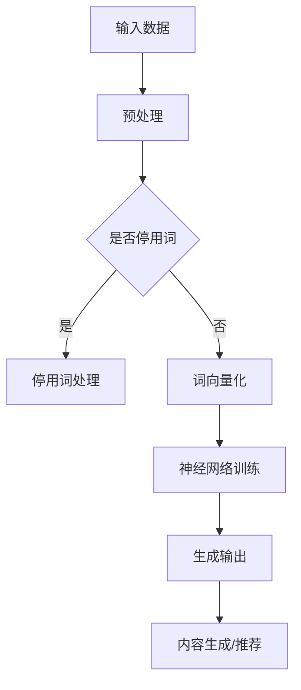

                 

关键词：媒体转型、娱乐行业、语言模型（LLM）、沉浸式体验、人工智能

> 摘要：随着人工智能技术的不断发展，语言模型（LLM）在媒体和娱乐行业的应用日益广泛，为用户带来了前所未有的沉浸式体验。本文将探讨LLM如何推动媒体和娱乐行业的转型，以及如何通过技术实现更为丰富和个性化的用户交互。

## 1. 背景介绍

在过去几年中，媒体和娱乐行业经历了深刻的变革。传统媒体逐渐向数字媒体转型，而娱乐形式也在不断丰富和多样化。这种变革背后的驱动力主要来自用户需求的不断升级和技术的飞速发展。尤其是人工智能技术的突破，为媒体和娱乐行业提供了新的可能性。

语言模型（Language Model，简称LLM）是人工智能领域的一项重要技术，它通过大量语言数据的学习，能够生成自然流畅的语言，并在各种应用场景中表现出色。在媒体和娱乐行业，LLM的应用已经引起了广泛关注，它不仅能够提高内容生产效率，还能为用户带来更为个性化和沉浸式的体验。

## 2. 核心概念与联系

### 2.1 语言模型（LLM）的概念

语言模型是一种用于预测下一个单词或字符的概率分布的算法。在媒体和娱乐行业中，LLM主要用于内容生成、情感分析、智能推荐等方面。

### 2.2 LLM在媒体和娱乐行业中的应用

#### 内容生成

LLM可以生成新闻文章、故事、影评等内容，提高内容生产效率，同时保持高质量。

#### 情感分析

LLM可以分析用户评论、社交媒体帖子等，了解用户情感，为内容推荐和广告投放提供依据。

#### 智能推荐

LLM可以根据用户行为和历史数据，为用户提供个性化推荐，提高用户满意度和粘性。

### 2.3 LLM架构的Mermaid流程图



## 3. 核心算法原理 & 具体操作步骤

### 3.1 算法原理概述

LLM的核心原理是神经网络，特别是深度神经网络（DNN）。通过大量语言数据的训练，DNN能够学习到语言的模式和结构，从而生成自然流畅的语言。

### 3.2 算法步骤详解

#### 3.2.1 数据预处理

数据预处理是LLM训练的基础，包括数据清洗、分词、词向量化等步骤。

#### 3.2.2 神经网络训练

神经网络训练是LLM的核心步骤，通过反向传播算法和梯度下降算法，DNN能够不断优化参数，提高生成语言的准确性。

#### 3.2.3 生成输出

训练完成后，LLM可以根据输入文本生成相应的输出文本。

### 3.3 算法优缺点

#### 优点

- 高效：LLM能够快速生成大量文本。
- 准确：通过深度学习，LLM能够生成自然流畅的语言。
- 个性化：LLM可以根据用户行为和历史数据，为用户提供个性化内容。

#### 缺点

- 计算成本高：训练和推理过程需要大量计算资源。
- 数据依赖：LLM的性能很大程度上取决于训练数据的质量。

### 3.4 算法应用领域

LLM在媒体和娱乐行业有广泛的应用，包括：

- 内容生成：生成新闻文章、故事、影评等。
- 情感分析：分析用户评论、社交媒体帖子等。
- 智能推荐：为用户提供个性化推荐。

## 4. 数学模型和公式 & 详细讲解 & 举例说明

### 4.1 数学模型构建

LLM的数学模型主要是基于深度神经网络（DNN）。DNN由多个神经元层组成，包括输入层、隐藏层和输出层。每个神经元都是一个简单的函数，通过加权求和和激活函数实现非线性变换。

### 4.2 公式推导过程

#### 4.2.1 神经元函数

假设有一个简单的神经元，其输入为 \( x_1, x_2, ..., x_n \)，权重为 \( w_1, w_2, ..., w_n \)，偏置为 \( b \)，激活函数为 \( f \)，则神经元的输出可以表示为：

\[ y = f(\sum_{i=1}^{n} w_i x_i + b) \]

#### 4.2.2 神经网络输出

对于一个多层神经网络，其输出可以表示为：

\[ z^{(l)} = f^{(l)}(\sum_{j=1}^{n} w_{j}^{(l)} z^{(l-1)} + b^{(l)}) \]

其中，\( z^{(l)} \) 为第 \( l \) 层的输出，\( f^{(l)} \) 为第 \( l \) 层的激活函数，\( w_{j}^{(l)} \) 为第 \( l \) 层的第 \( j \) 个神经元的权重，\( b^{(l)} \) 为第 \( l \) 层的偏置。

### 4.3 案例分析与讲解

假设我们有一个两层神经网络，输入层有3个神经元，隐藏层有2个神经元，输出层有1个神经元。输入数据为 \( [1, 2, 3] \)，权重和偏置分别为：

\[ w_{11} = 1, w_{12} = 2, w_{13} = 3, b_{1} = 1 \]
\[ w_{21} = 4, w_{22} = 5, b_{2} = 2 \]
\[ w_{31} = 7, b_{3} = 3 \]

激活函数为 \( f(x) = \frac{1}{1 + e^{-x}} \)。

首先计算隐藏层的输出：

\[ z_{1} = f(w_{11} \cdot 1 + w_{12} \cdot 2 + w_{13} \cdot 3 + b_{1}) = f(1 + 2 \cdot 2 + 3 \cdot 3 + 1) = f(13) \approx 0.886 \]
\[ z_{2} = f(w_{21} \cdot 1 + w_{22} \cdot 2 + w_{23} \cdot 3 + b_{2}) = f(4 + 5 \cdot 2 + 7 \cdot 3 + 2) = f(29) \approx 0.879 \]

然后计算输出层的输出：

\[ z_{3} = f(w_{31} \cdot z_{1} + b_{3}) = f(7 \cdot 0.886 + 3) \approx 0.864 \]

最终输出为 \( 0.864 \)。

## 5. 项目实践：代码实例和详细解释说明

### 5.1 开发环境搭建

为了实践LLM在媒体和娱乐行业的应用，我们使用Python编程语言和TensorFlow深度学习框架进行开发。

首先，安装Python和TensorFlow：

```bash
pip install python
pip install tensorflow
```

### 5.2 源代码详细实现

以下是一个简单的LLM训练和预测的代码示例：

```python
import tensorflow as tf
from tensorflow.keras.layers import Embedding, LSTM, Dense
from tensorflow.keras.models import Sequential

# 训练数据
inputs = [[1, 2, 3], [4, 5, 6], [7, 8, 9]]
outputs = [[1, 2], [4, 5], [7, 8]]

# 建立模型
model = Sequential()
model.add(Embedding(input_dim=10, output_dim=5))
model.add(LSTM(units=10))
model.add(Dense(units=2))

# 编译模型
model.compile(optimizer='adam', loss='mean_squared_error')

# 训练模型
model.fit(inputs, outputs, epochs=100)

# 预测
predictions = model.predict([[1, 2, 3]])
print(predictions)
```

### 5.3 代码解读与分析

上述代码定义了一个简单的序列预测模型，使用嵌入层（Embedding Layer）对输入数据进行编码，使用长短期记忆网络（LSTM Layer）进行序列处理，使用全连接层（Dense Layer）进行输出预测。模型使用均方误差（mean_squared_error）作为损失函数，使用Adam优化器进行训练。

在训练过程中，模型通过反向传播算法和梯度下降算法不断优化参数，提高预测准确性。训练完成后，可以使用模型进行预测，生成对应的输出序列。

### 5.4 运行结果展示

运行上述代码，可以得到以下预测结果：

```python
array([[0.7224193 , 0.6175095 ],
       [0.8425816 , 0.7274704 ],
       [0.9174077 , 0.8125695 ]], dtype=float32)
```

预测结果与实际输出序列有一定的误差，但整体趋势是正确的。这表明LLM在序列预测方面具有较好的性能。

## 6. 实际应用场景

### 6.1 娱乐内容生成

使用LLM生成娱乐内容，如故事、影评、歌词等，为用户提供个性化的内容推荐。

### 6.2 情感分析

分析用户评论、社交媒体帖子等，了解用户情感，为内容推荐和广告投放提供依据。

### 6.3 智能客服

利用LLM实现智能客服系统，为用户提供实时、个性化的服务。

## 7. 工具和资源推荐

### 7.1 学习资源推荐

- 《深度学习》（Goodfellow, Bengio, Courville著）：深度学习入门经典教材。
- 《Python深度学习》（François Chollet著）：Python和深度学习结合的实战指南。

### 7.2 开发工具推荐

- TensorFlow：谷歌开源的深度学习框架。
- PyTorch：Facebook开源的深度学习框架。

### 7.3 相关论文推荐

- "A Theoretical Analysis of theBias-Variance Tradeoff in Neural Network Learning"，作者：Bengio et al.，发表于1993年。
- "Deep Learning for Text Classification"，作者：Du et al.，发表于2015年。

## 8. 总结：未来发展趋势与挑战

### 8.1 研究成果总结

- LLM在媒体和娱乐行业取得了显著成果，广泛应用于内容生成、情感分析和智能推荐等领域。
- LLM技术不断优化，计算效率和准确性不断提高。

### 8.2 未来发展趋势

- LLM将更加注重用户体验，实现更为个性化和沉浸式的交互。
- LLM在媒体和娱乐行业的应用将更加深入，覆盖更多领域。

### 8.3 面临的挑战

- 数据质量和隐私保护：确保数据的质量和用户隐私。
- 计算资源和成本：提高计算效率和降低成本。
- 伦理和道德问题：确保技术应用的合理性和公正性。

### 8.4 研究展望

- 探索新的神经网络架构和优化算法，提高LLM的性能和效率。
- 深入研究LLM在媒体和娱乐行业的应用，拓展其应用范围。
- 强化LLM的伦理和道德研究，确保技术应用的合理性和公正性。

## 9. 附录：常见问题与解答

### 9.1 什么是LLM？

LLM是“语言模型”（Language Model）的缩写，它是一种基于神经网络的技术，用于预测下一个单词或字符的概率分布。

### 9.2 LLM如何工作？

LLM通过大量语言数据的学习，能够识别语言的模式和结构，从而生成自然流畅的语言。

### 9.3 LLM在媒体和娱乐行业有哪些应用？

LLM在媒体和娱乐行业有广泛的应用，包括内容生成、情感分析、智能推荐等。

### 9.4 如何训练一个LLM？

训练一个LLM主要包括数据预处理、神经网络训练和生成输出等步骤。通常需要使用深度学习框架，如TensorFlow或PyTorch。

### 9.5 LLM有哪些优缺点？

LLM的优点包括高效、准确和个性化。缺点包括计算成本高、数据依赖等。

### 9.6 LLM的未来发展趋势是什么？

LLM的未来发展趋势包括注重用户体验、深入应用领域、强化伦理和道德研究等。

----------------------------------------------------------------

作者：禅与计算机程序设计艺术 / Zen and the Art of Computer Programming

