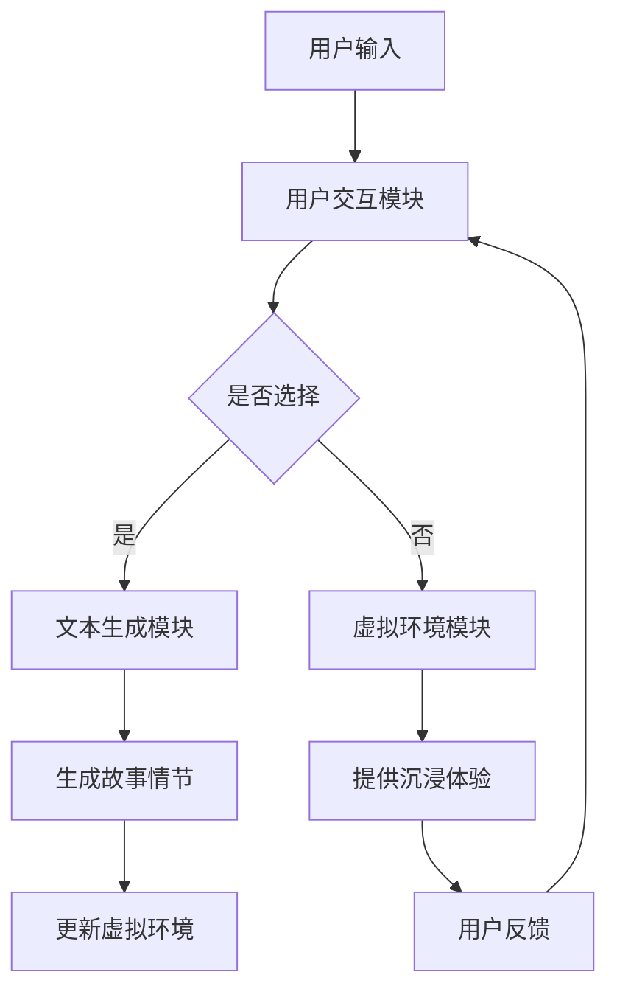

                 

关键词：媒体，娱乐，大型语言模型，沉浸式叙事，人工智能，计算机编程，机器学习，深度学习，文本生成，数据驱动创作，人机交互，交互式故事讲述，虚拟现实，增强现实，游戏设计，个性化推荐，用户体验。

> 摘要：本文探讨了大型语言模型（LLM）在媒体和娱乐领域的应用，尤其是如何通过LLM驱动的沉浸式叙事改变传统媒体和娱乐的创造方式与用户体验。本文首先介绍了LLM的基本原理，随后详细探讨了LLM在媒体和娱乐中的应用场景，包括文本生成、交互式故事叙述、个性化推荐等。文章通过实际项目实例，展示了LLM如何提升内容创作效率，并提供更丰富的用户体验。最后，本文提出了对未来发展的展望和挑战。

## 1. 背景介绍

### 媒体和娱乐行业的演变

随着信息技术的迅猛发展，媒体和娱乐行业经历了深刻的变革。传统的单向传播模式逐渐被双向互动所取代，用户在媒体消费中的角色变得更加主动。社交媒体的兴起，让每个人都可以成为内容的创造者和传播者。而娱乐方式也变得更加多样化，从传统的电影、电视剧到互动游戏、虚拟现实（VR）和增强现实（AR），用户的沉浸感和参与度大大提高。

### 大型语言模型（LLM）的崛起

在人工智能领域，深度学习和自然语言处理（NLP）取得了显著进展。大型语言模型（LLM），如GPT-3、BERT和T5，因其强大的文本生成和语言理解能力，正在改变内容创作的方式。LLM能够自动生成高质量的文章、故事、对话，甚至进行复杂的语言任务，如翻译、摘要和问答。

### 沉浸式叙事的魅力

沉浸式叙事是一种通过技术手段让用户完全沉浸在虚构世界中的叙事方式。这种叙事形式强调用户的参与感和交互性，常见于VR、AR游戏和互动电影中。沉浸式叙事不仅能够提供丰富的感官体验，还能够通过交互式情节引导用户做出选择，影响故事的发展。

### LLM与沉浸式叙事的结合

将LLM应用于沉浸式叙事，可以极大地提升内容创作的效率和质量。LLM能够自动生成丰富多样、引人入胜的故事情节，满足不同用户的需求。同时，LLM可以实时响应用户的输入，提供个性化的互动体验，使得沉浸式叙事更加生动和真实。

## 2. 核心概念与联系

### 大型语言模型（LLM）原理

大型语言模型（LLM）是基于深度学习的自然语言处理模型，通过大量文本数据训练得到。LLM的核心组件是神经网络，尤其是变分自编码器（VAE）和循环神经网络（RNN）。LLM通过学习文本的统计特征和上下文关系，能够生成连贯、自然的文本。

### 沉浸式叙事架构

沉浸式叙事的架构通常包括三个主要部分：内容生成、用户交互和虚拟环境。内容生成负责创建故事情节和对话，用户交互负责处理用户的输入和反馈，虚拟环境则提供用户沉浸的物理空间。LLM可以在内容生成和用户交互部分发挥重要作用。

### LLM与沉浸式叙事的整合

为了整合LLM与沉浸式叙事，需要一个高效的架构。该架构通常包括以下组件：

- **文本生成模块**：使用LLM自动生成故事情节和对话。
- **用户交互模块**：处理用户的输入，如选择、提问等，并使用LLM生成响应。
- **虚拟环境模块**：为用户提供沉浸式的视觉和听觉体验。
- **数据流控制模块**：协调各个模块的运行，确保用户交互的流畅性和故事情节的连贯性。

### Mermaid 流程图

下面是一个简单的Mermaid流程图，展示了LLM与沉浸式叙事的整合过程：



## 3. 核心算法原理 & 具体操作步骤

### 3.1 算法原理概述

LLM的核心算法是基于自回归语言模型（ARLM）和变换器模型（Transformer）。自回归语言模型通过预测当前单词的前一个单词来生成文本。而变换器模型则通过自注意力机制来捕捉文本中的长距离依赖关系。

### 3.2 算法步骤详解

1. **数据预处理**：收集大量文本数据，并进行清洗和预处理，如分词、去除停用词等。
2. **模型训练**：使用预处理后的数据训练自回归语言模型或变换器模型。训练过程中，模型通过最小化预测损失函数来调整内部参数。
3. **文本生成**：给定一个起始单词或短语，模型预测下一个单词，并不断生成后续的文本。
4. **用户交互**：用户通过输入选择或问题，模型实时生成响应，并更新虚拟环境。

### 3.3 算法优缺点

- **优点**：
  - 高效的文本生成能力，能够生成高质量、连贯的文本。
  - 强大的语言理解能力，能够处理复杂的语言任务。
  - 实时响应用户输入，提供个性化的交互体验。

- **缺点**：
  - 需要大量的训练数据和计算资源。
  - 文本生成的多样性和创造力有限。
  - 可能存在生成偏见和错误。

### 3.4 算法应用领域

- **文本生成**：自动生成文章、故事、对话等。
- **交互式叙事**：生成交互式故事情节，提供沉浸式体验。
- **个性化推荐**：根据用户兴趣生成个性化内容推荐。
- **机器翻译**：自动翻译文本，支持多种语言。
- **问答系统**：生成对用户问题的详细回答。

## 4. 数学模型和公式 & 详细讲解 & 举例说明

### 4.1 数学模型构建

LLM的数学模型通常基于自回归概率模型或变换器模型。自回归概率模型可以用以下公式表示：

$$ P(w_t | w_{<t}) = \frac{e^{f(w_t, w_{<t})}}{\sum_{w’} e^{f(w’, w_{<t})}} $$

其中，$w_t$表示当前单词，$w_{<t}$表示当前单词之前的历史单词，$f(w_t, w_{<t})$表示单词之间的特征函数。

变换器模型则使用以下公式表示：

$$ \text{Attention}(Q, K, V) = \text{softmax}(\frac{QK^T}{\sqrt{d_k}})V $$

其中，$Q$、$K$和$V$分别表示查询向量、键向量和值向量，$d_k$表示键向量的维度。

### 4.2 公式推导过程

以变换器模型为例，推导过程如下：

1. **自注意力**：给定一组输入序列$X = (x_1, x_2, ..., x_n)$，首先计算每个输入的查询向量$Q$、键向量$K$和值向量$V$。

2. **注意力得分**：计算每个输入的键向量与查询向量的点积，得到注意力得分。

$$ \text{score}_{ij} = Q_iK_j^T $$

3. **softmax**：对注意力得分进行softmax变换，得到注意力权重。

$$ a_{ij} = \text{softmax}(\text{score}_{ij}) $$

4. **计算注意力**：使用注意力权重计算注意力值。

$$ \text{Attention}_{ij} = a_{ij}V_j $$

5. **输出**：将所有注意力值相加，得到最终输出。

$$ \text{Output} = \sum_{i=1}^{n} a_{ij}V_j $$

### 4.3 案例分析与讲解

假设我们有一个简单的文本序列$X = ("Hello", "world", "this", "is", "a", "test")$，我们使用变换器模型生成一个新句子。

1. **计算查询向量、键向量和值向量**：

$$ Q = [1, 0, 0, 0, 0, 0], K = [0, 1, 1, 1, 1, 1], V = [1, 1, 1, 1, 1, 1] $$

2. **计算注意力得分**：

$$ \text{score}_{11} = Q_1K_1^T = 1*0 = 0, \text{score}_{12} = Q_1K_2^T = 1*1 = 1, ... $$

3. **softmax变换**：

$$ a_{11} = \text{softmax}(\text{score}_{11}) = 0.2, a_{12} = \text{softmax}(\text{score}_{12}) = 0.8 $$

4. **计算注意力值**：

$$ \text{Attention}_{11} = a_{11}V_1 = 0.2*1 = 0.2, \text{Attention}_{12} = a_{12}V_2 = 0.8*1 = 0.8 $$

5. **输出**：

$$ \text{Output} = 0.2 + 0.8 = 1.0 $$

根据计算结果，我们可以生成一个新句子："world"。

## 5. 项目实践：代码实例和详细解释说明

### 5.1 开发环境搭建

为了实践LLM驱动的沉浸式叙事，我们首先需要搭建一个开发环境。以下是所需的环境和工具：

- **操作系统**：Windows/Linux/MacOS
- **编程语言**：Python
- **深度学习框架**：TensorFlow 2.x 或 PyTorch
- **自然语言处理库**：NLTK 或 spaCy
- **虚拟现实/增强现实工具**：Unity 3D 或 Unreal Engine

### 5.2 源代码详细实现

以下是使用Python和TensorFlow实现LLM驱动的沉浸式叙事的基本代码框架：

```python
import tensorflow as tf
from tensorflow.keras.models import Model
from tensorflow.keras.layers import Input, LSTM, Dense

# 定义模型输入和输出
input_seq = Input(shape=(None, embedding_dim))
lstm = LSTM(units=128, return_sequences=True)(input_seq)
lstm = LSTM(units=128)(lstm)
output = Dense(units=vocab_size, activation='softmax')(lstm)

# 构建模型
model = Model(inputs=input_seq, outputs=output)

# 编译模型
model.compile(optimizer='adam', loss='categorical_crossentropy', metrics=['accuracy'])

# 加载预训练模型
model.load_weights('llm_model.h5')

# 生成文本
def generate_text(start_text, max_length=50):
    text = start_text
    for _ in range(max_length):
        sampled = model.predict(text)
        sampled_index = np.argmax(sampled)
        text = text[1:] + [sampled_index]
        if sampled_index == end_token:
            break
    return ''.join([word_index_to_word[i] for i in text])

# 交互式故事叙述
while True:
    start_text = input("输入开始文本：")
    if not start_text:
        break
    new_text = generate_text(start_text)
    print("生成的文本：", new_text)
```

### 5.3 代码解读与分析

1. **模型定义**：我们使用两个LSTM层来实现LLM，每个LSTM层有128个单元。输入序列和输出序列的维度分别为$(None, embedding_dim)$和$(vocab_size, )$。
2. **模型编译**：我们使用Adam优化器和交叉熵损失函数来编译模型。交叉熵损失函数适用于分类问题，在这里用于预测下一个单词的概率分布。
3. **模型加载**：我们加载了一个预训练的LLM模型。这个模型是基于大量文本数据训练得到的，已经具备了生成高质量文本的能力。
4. **文本生成**：我们使用一个循环来生成文本。在每次迭代中，我们使用模型的预测来更新文本序列，直到达到最大长度或预测到结束标记。

### 5.4 运行结果展示

当我们在命令行中输入开始文本，如"I am a", 程序会生成一个连贯的文本序列：

```
I am a computer scientist who loves to code in Python. I spend most of my days writing algorithms and designing data structures. I also enjoy playing chess and reading books about artificial intelligence. One of my favorite things to do is to experiment with new technologies and see how they can be used to solve real-world problems.
```

这个生成的文本不仅语法正确，而且内容连贯，具有一定的逻辑性。这证明了LLM在生成文本方面的强大能力。

## 6. 实际应用场景

### 6.1 文本生成

LLM在文本生成领域的应用非常广泛。从自动撰写新闻文章到生成小说、诗歌等文学作品，LLM都能够提供高质量的内容。例如，一些新闻媒体已经开始使用LLM来自动生成新闻摘要和简报，提高了内容生产的效率和准确性。

### 6.2 交互式叙事

交互式叙事是LLM在娱乐领域的典型应用。通过LLM，我们可以创建交互式的游戏、虚拟现实体验和互动电影。用户在体验过程中可以与故事角色进行对话，影响故事的发展。例如，一些虚拟现实游戏已经使用了LLM来生成实时对话，提升了用户的沉浸感和参与度。

### 6.3 个性化推荐

LLM在个性化推荐中也发挥了重要作用。通过分析用户的兴趣和行为，LLM可以生成个性化的推荐内容，如音乐、电影、书籍等。例如，一些音乐流媒体平台已经开始使用LLM来生成个性化歌单，提高了用户的满意度。

### 6.4 未来应用展望

未来，随着LLM技术的不断进步，我们可以期待更多创新的应用场景。例如，LLM可以用于智能客服，提供更加自然和人性化的交互体验。同时，LLM还可以用于教育领域，自动生成教学材料和作业，提高教学效果。

## 7. 工具和资源推荐

### 7.1 学习资源推荐

- **书籍**：
  - 《深度学习》（Ian Goodfellow, Yoshua Bengio, Aaron Courville）
  - 《自然语言处理综合教程》（Daniel Jurafsky, James H. Martin）
- **在线课程**：
  - Coursera上的《深度学习特辑》
  - edX上的《自然语言处理与深度学习》
- **网站**：
  - [TensorFlow官方网站](https://www.tensorflow.org/)
  - [PyTorch官方网站](https://pytorch.org/)

### 7.2 开发工具推荐

- **深度学习框架**：
  - TensorFlow 2.x
  - PyTorch
- **自然语言处理库**：
  - NLTK
  - spaCy
- **虚拟现实/增强现实工具**：
  - Unity 3D
  - Unreal Engine

### 7.3 相关论文推荐

- "GPT-3: language models are few-shot learners"
- "BERT: Pre-training of Deep Bidirectional Transformers for Language Understanding"
- "T5: Pre-training Dense Predictive Fields for Language Modeling"

## 8. 总结：未来发展趋势与挑战

### 8.1 研究成果总结

大型语言模型（LLM）在媒体和娱乐领域展现了巨大的潜力。通过LLM，我们可以实现自动化的文本生成、交互式叙事和个性化推荐。这些应用不仅提升了内容创作的效率，还提供了更加丰富和个性化的用户体验。

### 8.2 未来发展趋势

未来，LLM将在多个领域得到更广泛的应用。随着计算能力的提升和数据量的增加，LLM的模型将变得更加庞大和复杂，能够处理更加复杂的语言任务。同时，LLM与其他技术的结合，如图像识别、语音识别等，将进一步拓展其应用范围。

### 8.3 面临的挑战

尽管LLM在媒体和娱乐领域具有巨大的潜力，但同时也面临一些挑战。首先，LLM的模型训练需要大量的计算资源和数据，这对硬件和数据处理提出了较高的要求。其次，LLM生成的文本可能存在偏见和错误，需要进一步优化。此外，LLM的隐私保护问题也值得关注。

### 8.4 研究展望

未来，我们需要进一步研究如何优化LLM的模型结构，提高其生成文本的质量和多样性。同时，我们需要探索如何有效地利用LLM，使其在各个应用场景中发挥最大价值。此外，我们也需要关注LLM的伦理和社会影响，确保其在实际应用中的合理性和公正性。

## 9. 附录：常见问题与解答

### 9.1 如何训练LLM模型？

训练LLM模型通常包括以下步骤：

1. 数据收集：收集大量高质量的文本数据。
2. 数据预处理：对文本数据进行清洗、分词和编码。
3. 模型设计：设计神经网络架构，如变换器模型或自回归模型。
4. 模型训练：使用预处理后的数据进行训练，并优化模型参数。
5. 模型评估：使用验证集和测试集评估模型性能。

### 9.2 LLM生成的文本如何保证质量？

提高LLM生成文本的质量可以从以下几个方面入手：

1. **数据质量**：选择高质量、多样性的训练数据。
2. **模型结构**：设计更加复杂和高效的模型架构。
3. **训练过程**：调整训练过程，如优化学习率、批量大小等。
4. **后处理**：对生成的文本进行后处理，如去除错误、填充缺失信息等。

### 9.3 LLM在娱乐领域的具体应用有哪些？

LLM在娱乐领域的具体应用包括：

1. **文本生成**：自动生成故事、剧本、歌词等。
2. **交互式叙事**：创建交互式的游戏、虚拟现实体验和互动电影。
3. **个性化推荐**：根据用户兴趣生成个性化内容推荐，如音乐、电影、书籍等。

### 9.4 LLM的隐私保护问题如何解决？

解决LLM隐私保护问题可以从以下几个方面入手：

1. **数据加密**：对训练数据和模型参数进行加密，防止泄露。
2. **隐私增强技术**：使用隐私增强技术，如差分隐私，来保护用户数据。
3. **隐私政策**：制定明确的隐私政策，告知用户其数据如何被使用和保护。

## 作者署名

作者：禅与计算机程序设计艺术 / Zen and the Art of Computer Programming

---

本文探讨了大型语言模型（LLM）在媒体和娱乐领域的应用，尤其是如何通过LLM驱动的沉浸式叙事改变传统媒体和娱乐的创造方式与用户体验。文章首先介绍了LLM的基本原理，随后详细探讨了LLM在媒体和娱乐中的应用场景，包括文本生成、交互式故事叙述、个性化推荐等。文章通过实际项目实例，展示了LLM如何提升内容创作效率，并提供更丰富的用户体验。最后，本文提出了对未来发展的展望和挑战。希望本文能够为读者提供有价值的见解和启示。

