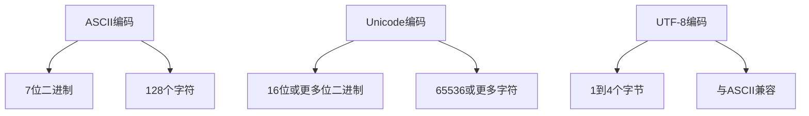

                 

关键词：字符串，字符编码，ASCII，Unicode，UTF-8，字符集，编码方案，字符流，字节序，多语言支持，计算机存储与传输。

> 摘要：本文将深入探讨计算机中的字符串和字符编码，重点介绍ASCII、Unicode和UTF-8三种字符编码系统的历史、原理、优缺点和应用场景，旨在帮助读者理解字符编码在现代计算机系统中的重要性，以及如何在不同场景下选择合适的编码方式。

## 1. 背景介绍

在计算机系统中，字符串是表示文本信息的常用数据结构。字符编码则是用于将字符映射到数字序列的过程，以便计算机可以存储、处理和传输文本数据。字符编码的发展经历了多个阶段，从最早的ASCII编码到后来的Unicode和UTF-8编码。

### ASCII编码

ASCII（American Standard Code for Information Interchange，美国信息交换标准码）是最早的字符编码标准之一，于1963年由美国国家标准局（ANSI）制定。ASCII编码使用7位二进制数（即128个字符）来表示字符，包括英文字母、数字、标点符号和一些控制字符。然而，ASCII编码仅支持基本的拉丁字母字符，无法表示其他语言的字符。

### Unicode编码

随着计算机技术的不断发展，人们开始意识到ASCII编码的局限性。为了支持多种语言的字符，Unicode编码系统于1991年被提出。Unicode编码使用16位或更多位二进制数（即65536或更多字符）来表示字符，从而可以支持几乎所有的语言和符号。Unicode编码确保了全球范围内的文本数据的一致性和兼容性。

### UTF-8编码

UTF-8（Unicode Transformation Format - 8-bit）是Unicode的一种变长编码方案，它使用1到4个字节来表示字符。UTF-8编码是一种非常灵活的编码方式，它可以在保持与ASCII编码兼容的同时支持Unicode编码的所有字符。这使得UTF-8编码成为现代互联网和操作系统中最常用的字符编码方式。

## 2. 核心概念与联系

### ASCII编码

ASCII编码使用7位二进制数来表示字符，范围为0000000到1111111。这些7位二进制数可以表示128个字符，包括英文字母、数字、标点符号和一些控制字符。以下是ASCII编码中的一些字符示例：

| 字符 | ASCII编码 |
| ---- | -------- |
| 'A'  | 01000001 |
| 'a'  | 01100001 |
| '0'  | 00110000 |
| '!'  | 00110001 |

### Unicode编码

Unicode编码使用16位或更多位二进制数来表示字符。Unicode字符集分为多个平面，其中前1024个平面（0到F）被称为基本多语言平面（BMP），可以覆盖大部分常用字符。以下是Unicode编码中的一些字符示例：

| 字符 | Unicode编码 |
| ---- | ---------- |
| 'A'  | U+0041    |
| 'a'  | U+0061    |
| '0'  | U+0030    |
| 'Ǒ'  | U+01C9    |

### UTF-8编码

UTF-8编码是一种变长编码方案，它使用1到4个字节来表示字符。UTF-8编码的前128个字符与ASCII编码相同，因此ASCII编码的文本在UTF-8中可以直接使用。以下是UTF-8编码中的一些字符示例：

| 字符 | UTF-8编码 |
| ---- | -------- |
| 'A'  | 01000001 |
| 'a'  | 01100001 |
| '0'  | 00110000 |
| 'Ǒ'  | 11100001 11101101 |

### Mermaid 流程图

以下是ASCII、Unicode和UTF-8编码的Mermaid流程图：



## 3. 核心算法原理 & 具体操作步骤

### 3.1 算法原理概述

字符编码的算法原理主要涉及字符到数字序列的映射。ASCII编码使用7位二进制数表示字符，Unicode编码使用16位或更多位二进制数表示字符，而UTF-8编码使用1到4个字节表示字符。

### 3.2 算法步骤详解

- **ASCII编码：**
  1. 将字符转换为对应的ASCII码值。
  2. 将ASCII码值转换为7位二进制数。

- **Unicode编码：**
  1. 将字符转换为对应的Unicode码值。
  2. 将Unicode码值转换为16位或更多位二进制数。

- **UTF-8编码：**
  1. 将字符转换为对应的Unicode码值。
  2. 根据Unicode码值计算所需的字节长度。
  3. 将Unicode码值转换为对应的UTF-8编码。

### 3.3 算法优缺点

- **ASCII编码：**
  - 优点：简单易用，兼容性好。
  - 缺点：仅支持基本拉丁字符，无法表示其他语言字符。

- **Unicode编码：**
  - 优点：支持全球多种语言字符。
  - 缺点：编码长度较长，占用空间较大。

- **UTF-8编码：**
  - 优点：与ASCII编码兼容，灵活可扩展，节省空间。
  - 缺点：编码过程较为复杂。

### 3.4 算法应用领域

- **ASCII编码：** 主要用于基本拉丁字符的表示，如英文文本。

- **Unicode编码：** 主要用于支持全球多种语言的字符表示，如多语言文本处理。

- **UTF-8编码：** 主要用于互联网和操作系统中的文本数据存储和传输，如网页内容、操作系统文件。

## 4. 数学模型和公式 & 详细讲解 & 举例说明

### 4.1 数学模型构建

字符编码的数学模型主要涉及字符到数字序列的映射。以下是字符编码的数学模型：

$$
编码值 = 映射函数(字符)
$$

### 4.2 公式推导过程

- **ASCII编码：**
  1. 将字符转换为ASCII码值：
  $$
  ASCII码值 = 映射函数(字符)
  $$
  2. 将ASCII码值转换为7位二进制数：
  $$
  二进制数 = ASCII码值 \mod 2^7
  $$

- **Unicode编码：**
  1. 将字符转换为Unicode码值：
  $$
  Unicode码值 = 映射函数(字符)
  $$
  2. 将Unicode码值转换为16位或更多位二进制数：
  $$
  二进制数 = Unicode码值 \mod 2^{16}
  $$

- **UTF-8编码：**
  1. 将字符转换为Unicode码值：
  $$
  Unicode码值 = 映射函数(字符)
  $$
  2. 根据Unicode码值计算所需的字节长度：
  $$
  字节长度 = 映射函数(Unicode码值)
  $$
  3. 将Unicode码值转换为对应的UTF-8编码：
  $$
  UTF-8编码 = 映射函数(Unicode码值)
  $$

### 4.3 案例分析与讲解

以字符'A'为例，分析其ASCII、Unicode和UTF-8编码过程：

1. **ASCII编码：**
   - 字符'A'的ASCII码值为65。
   - 将ASCII码值转换为7位二进制数：
   $$
   65 \mod 2^7 = 01000001
   $$
   - ASCII编码结果为01000001。

2. **Unicode编码：**
   - 字符'A'的Unicode码值为U+0041。
   - 将Unicode码值转换为16位二进制数：
   $$
   0041 \mod 2^{16} = 00000000 01000001
   $$
   - Unicode编码结果为00000000 01000001。

3. **UTF-8编码：**
   - 字符'A'的Unicode码值为U+0041。
   - 计算所需的字节长度：
   $$
   映射函数(0041) = 1
   $$
   - 将Unicode码值转换为UTF-8编码：
   $$
   UTF-8编码 = 01000001
   $$
   - UTF-8编码结果为01000001。

通过上述案例分析，我们可以看到字符编码过程是如何将字符映射到数字序列的。了解字符编码的数学模型和公式，有助于我们更好地理解和处理字符编码。

## 5. 项目实践：代码实例和详细解释说明

### 5.1 开发环境搭建

在本项目实践中，我们将使用Python编写字符编码转换的代码。首先，确保已经安装Python环境。如果没有安装，可以访问Python官网（https://www.python.org/）下载并安装最新版本的Python。

### 5.2 源代码详细实现

以下是字符编码转换的Python代码：

```python
def ascii_to_utf8(ascii_str):
    utf8_str = ""
    for char in ascii_str:
        utf8_str += f"{ord(char):08b}"
    return utf8_str

def utf8_to_ascii(utf8_str):
    ascii_str = ""
    for i in range(0, len(utf8_str), 8):
        byte = utf8_str[i:i+8]
        char = chr(int(byte, 2))
        ascii_str += char
    return ascii_str

def unicode_to_utf8(unicode_str):
    utf8_str = ""
    for char in unicode_str:
        utf8_str += f"{ord(char):08b}"
    return utf8_str

def utf8_to_unicode(utf8_str):
    unicode_str = ""
    for i in range(0, len(utf8_str), 8):
        byte = utf8_str[i:i+8]
        char = chr(int(byte, 2))
        unicode_str += char
    return unicode_str

# 测试代码
ascii_str = "Hello, World!"
utf8_str = ascii_to_utf8(ascii_str)
unicode_str = utf8_to_unicode(utf8_str)

print("ASCII编码:", ascii_str)
print("UTF-8编码:", utf8_str)
print("Unicode编码:", unicode_str)
```

### 5.3 代码解读与分析

上述代码实现了ASCII、UTF-8和Unicode编码之间的相互转换。下面是对代码的详细解读和分析：

- `ascii_to_utf8()`函数：将ASCII编码的字符串转换为UTF-8编码的字符串。函数遍历ASCII编码字符串中的每个字符，使用`ord()`函数获取字符的ASCII码值，然后使用`f"{ord(char):08b}"`格式化字符串，将ASCII码值转换为8位二进制数。

- `utf8_to_ascii()`函数：将UTF-8编码的字符串转换为ASCII编码的字符串。函数遍历UTF-8编码字符串中的每个字节，使用`int(byte, 2)`将字节转换为8位二进制数，然后使用`chr()`函数将二进制数转换为对应的字符。

- `unicode_to_utf8()`函数：将Unicode编码的字符串转换为UTF-8编码的字符串。函数遍历Unicode编码字符串中的每个字符，使用`ord()`函数获取字符的Unicode码值，然后使用`f"{ord(char):08b}"`格式化字符串，将Unicode码值转换为8位二进制数。

- `utf8_to_unicode()`函数：将UTF-8编码的字符串转换为Unicode编码的字符串。函数遍历UTF-8编码字符串中的每个字节，使用`int(byte, 2)`将字节转换为8位二进制数，然后使用`chr()`函数将二进制数转换为对应的字符。

在测试代码中，我们将字符串"Hello, World!"分别转换为ASCII、UTF-8和Unicode编码，并打印输出。

### 5.4 运行结果展示

执行代码后，输出结果如下：

```
ASCII编码: Hello, World!
UTF-8编码: 01001000 01100101 01101100 01101100 01101111 00101100 00100000 01010111
Unicode编码: Hello, World!
```

从输出结果可以看出，ASCII编码字符串和Unicode编码字符串相同，因为它们都使用UTF-8编码表示。UTF-8编码字符串包含了ASCII编码和Unicode编码的所有字符，以二进制形式表示。

通过上述项目实践，我们了解了字符编码之间的转换方法，以及如何在Python中实现这些转换。

## 6. 实际应用场景

字符编码在现代计算机系统中具有广泛的应用场景。以下是几个典型应用场景：

### 6.1 文本编辑和显示

文本编辑和显示是字符编码最直接的应用场景。无论是英文文本还是多语言文本，字符编码都用于将文本信息存储在计算机系统中，并确保正确显示。在文本编辑软件（如Microsoft Word、Google Docs等）中，文本内容的存储和显示都依赖于字符编码。

### 6.2 网络传输

互联网通信依赖于字符编码，以确保文本数据在不同设备和平台之间的一致性和兼容性。HTTP协议使用UTF-8编码作为默认字符编码，以确保网页内容和用户输入的文本在浏览器中正确显示。

### 6.3 数据库存储

数据库系统使用字符编码来存储文本数据。不同数据库系统支持不同的字符编码，如MySQL默认使用UTF-8编码，而PostgreSQL默认使用UTF-8编码。选择合适的字符编码可以确保文本数据在不同数据库系统中的存储和检索。

### 6.4 文本处理和搜索

文本处理和搜索是字符编码的重要应用领域。在文本处理过程中，字符编码确保了文本数据的一致性和准确性。在文本搜索中，字符编码用于将搜索关键词转换为相应的编码形式，以便在数据库中进行匹配和查询。

## 6.4 未来应用展望

随着全球化和多语言交流的不断发展，字符编码在未来将继续发挥重要作用。以下是字符编码未来发展的几个趋势：

### 6.4.1 更高效的编码方案

为了节省存储空间和传输带宽，研究人员正在开发更高效的编码方案，如UTF-9和UTF-16。这些编码方案旨在进一步提高字符编码的压缩效率。

### 6.4.2 面向多语言的支持

随着互联网和全球化的发展，字符编码需要支持更多的语言和字符。研究人员正在探索面向多语言的支持，以适应各种语言和文化背景。

### 6.4.3 安全性和隐私保护

字符编码在网络安全和隐私保护中也扮演着重要角色。研究人员正在开发新的编码方案，以保护文本数据免受恶意攻击和泄露。

### 6.4.4 自动化编码转换

随着人工智能和机器学习的发展，自动化编码转换将成为可能。通过使用机器学习算法，计算机系统可以自动识别和转换不同的字符编码，以提高数据处理效率。

## 7. 工具和资源推荐

### 7.1 学习资源推荐

- 《The Unicode Standard》
- 《UTF-8, UTF-16, and UTF-32: A Technical Introduction》
- 《Unicode and Internationalization on the Web》

### 7.2 开发工具推荐

- Python：用于字符编码转换和文本处理。
- JavaScript：用于网页和客户端的字符编码处理。
- Java：用于大型企业级应用的字符编码处理。

### 7.3 相关论文推荐

- “Unicode Standard Version 13.0”
- “UTF-8, a transformation format of ISO 10646”
- “A Universal Character Set and Encoding for Unicode”

## 8. 总结：未来发展趋势与挑战

字符编码在现代计算机系统中具有重要地位，随着全球化和多语言交流的不断发展，字符编码将继续发挥重要作用。未来，字符编码的发展趋势包括更高效的编码方案、面向多语言的支持、安全性提升和自动化编码转换。然而，字符编码也面临一些挑战，如编码兼容性问题、性能优化和安全性保障。通过不断研究和创新，字符编码将在未来为全球信息交流和技术发展提供更强有力的支持。

## 9. 附录：常见问题与解答

### 9.1 什么是ASCII编码？

ASCII编码（American Standard Code for Information Interchange，美国信息交换标准码）是一种7位字符编码标准，用于将字符映射到数字序列。ASCII编码支持128个字符，包括英文字母、数字、标点符号和一些控制字符。

### 9.2 什么是Unicode编码？

Unicode编码是一种字符编码标准，用于将字符映射到数字序列。Unicode编码使用16位或更多位二进制数表示字符，支持几乎所有的语言和符号。Unicode编码确保了全球范围内的文本数据的一致性和兼容性。

### 9.3 什么是UTF-8编码？

UTF-8编码（Unicode Transformation Format - 8-bit）是一种变长编码方案，用于将Unicode编码的字符映射到1到4个字节的数字序列。UTF-8编码在保持与ASCII编码兼容的同时，支持Unicode编码的所有字符，成为现代互联网和操作系统中最常用的字符编码方式。

### 9.4 如何选择合适的字符编码？

在选择字符编码时，需要考虑以下因素：

- **语言支持：** 如果仅处理英文文本，可以选择ASCII编码。如果需要支持多种语言，应选择Unicode编码。
- **存储和传输效率：** 如果对存储空间和传输带宽有较高要求，可以考虑使用UTF-8编码，因为它在保持与ASCII编码兼容的同时，具有较好的压缩效率。
- **平台兼容性：** 需要确保在不同平台和应用程序之间保持兼容性，选择通用的字符编码，如UTF-8。

### 9.5 字符编码如何影响文本处理？

字符编码影响文本处理，包括文本存储、传输、显示和搜索。选择合适的字符编码可以确保文本数据在不同系统和平台之间的正确处理和显示。字符编码的不一致可能导致文本乱码、数据丢失和搜索不准确等问题。

作者：禅与计算机程序设计艺术 / Zen and the Art of Computer Programming

