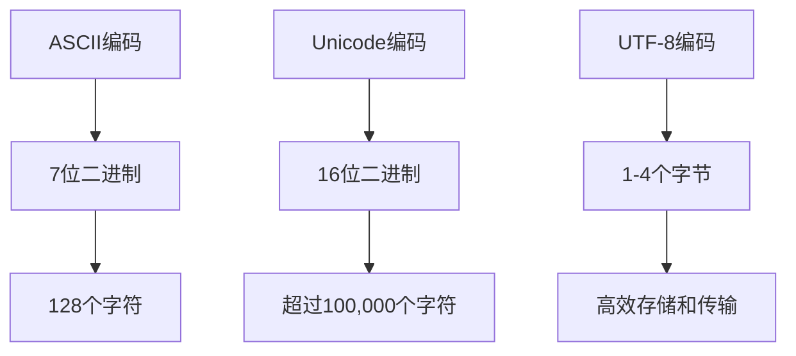

                 

关键词：字符编码，ASCII，Unicode，UTF-8，字符串处理，计算机体系结构，国际化和本地化。

> 摘要：本文将深入探讨字符编码的发展历史及其在计算机体系结构中的应用，重点分析ASCII、Unicode和UTF-8三种字符编码标准。我们将探讨它们的核心概念、工作原理、优缺点以及在现实世界中的应用，旨在为读者提供对字符编码的全面理解。

## 1. 背景介绍

字符编码是计算机中表示和存储字符的一种方式。在计算机诞生之初，字符编码主要是为了解决如何在不同硬件和软件系统之间传输和存储字符信息的问题。早期的计算机使用的是简单的编码方式，如ASCII编码，它只能表示128个字符，包括英文字母、数字和一些符号。

随着时间的推移，计算机的普及和国际化的需求促使字符编码的发展。为了能够表示更多的字符，特别是各种语言的字符，Unicode编码应运而生。Unicode提供了16位编码空间，能够表示超过100,000个字符，成为全球范围内最为广泛采用的字符编码标准。

然而，Unicode编码标准在存储和传输过程中会存在一定的空间浪费问题。为了解决这个问题，UTF-8编码被提出，它是一种变长编码方案，可以根据字符的不同而变化编码长度，从而更加高效地存储和传输字符。

## 2. 核心概念与联系

### 2.1 ASCII编码

ASCII编码是美国信息交换标准代码的缩写，它是最早的字符编码标准。ASCII编码使用7位二进制数来表示字符，可以表示128个字符，包括英文字母、数字和一些符号。ASCII编码在计算机体系结构中的应用非常广泛，几乎所有操作系统和编程语言都支持ASCII编码。

### 2.2 Unicode编码

Unicode编码是一种更为全面的字符编码标准，它旨在表示世界上所有语言的字符。Unicode编码使用16位二进制数来表示字符，能够表示超过100,000个字符。Unicode编码的核心概念是字符集和码位。字符集是指Unicode中定义的所有字符的集合，码位是指每个字符在Unicode中的唯一标识符。

### 2.3 UTF-8编码

UTF-8编码是一种变长编码方案，它可以根据字符的不同而变化编码长度。UTF-8编码使用1到4个字节来表示字符，其中ASCII字符使用1个字节，其他字符使用2到4个字节。UTF-8编码的优势在于它具有更高的存储和传输效率，特别是在处理非ASCII字符时。

### 2.4 Mermaid 流程图



## 3. 核心算法原理 & 具体操作步骤

### 3.1 算法原理概述

字符编码的核心算法原理在于如何将字符映射到二进制数，以及如何在计算机之间传输和存储这些二进制数。ASCII编码是一种简单的映射算法，将英文字母、数字和符号映射到7位二进制数。Unicode编码则采用更为复杂的映射算法，将所有字符映射到16位二进制数。UTF-8编码则是基于Unicode编码的一种优化算法，通过变长编码方式提高了存储和传输效率。

### 3.2 算法步骤详解

#### 3.2.1 ASCII编码步骤

1. 将字符映射到7位二进制数。
2. 将二进制数转换为ASCII码。
3. 在计算机之间传输和存储ASCII码。

#### 3.2.2 Unicode编码步骤

1. 将字符映射到16位二进制数。
2. 将二进制数转换为Unicode码。
3. 在计算机之间传输和存储Unicode码。

#### 3.2.3 UTF-8编码步骤

1. 将字符映射到16位二进制数。
2. 根据字符的不同，选择1到4个字节来表示。
3. 将字节序列转换为UTF-8码。
4. 在计算机之间传输和存储UTF-8码。

### 3.3 算法优缺点

#### 3.3.1 ASCII编码优点

- 简单易懂，易于实现。
- 广泛支持，几乎所有操作系统和编程语言都支持ASCII编码。

#### 3.3.1 ASCII编码缺点

- 只能表示128个字符，无法表示所有语言的字符。
- 存储和传输效率较低，特别是在处理非ASCII字符时。

#### 3.3.2 Unicode编码优点

- 能够表示世界上所有语言的字符。
- 提供了统一的字符表示方式，便于国际化和本地化。

#### 3.3.2 Unicode编码缺点

- 存储和传输效率较低，每个字符需要16位二进制数。
- 兼容性问题，旧系统可能无法处理新的Unicode字符。

#### 3.3.3 UTF-8编码优点

- 高效存储和传输，特别适合处理非ASCII字符。
- 与ASCII编码兼容，ASCII字符在UTF-8中仍然使用1个字节。

#### 3.3.3 UTF-8编码缺点

- 复杂性较高，需要更多的计算资源来处理UTF-8编码。

## 4. 数学模型和公式 & 详细讲解 & 举例说明

### 4.1 数学模型构建

字符编码的数学模型主要涉及字符映射和编码转换。对于ASCII编码，数学模型可以表示为：

$$
\text{ASCII码} = \text{字符} \to 7位二进制数
$$

对于Unicode编码，数学模型可以表示为：

$$
\text{Unicode码} = \text{字符} \to 16位二进制数
$$

对于UTF-8编码，数学模型可以表示为：

$$
\text{UTF-8码} = \text{字符} \to 1-4个字节
$$

### 4.2 公式推导过程

ASCII编码的推导过程相对简单，只需要将字符映射到7位二进制数即可。Unicode编码的推导过程则更为复杂，需要考虑字符集和码位。UTF-8编码的推导过程则是在Unicode编码的基础上进行了优化，通过变长编码提高了存储和传输效率。

### 4.3 案例分析与讲解

以英文字母"A"为例，我们来分析三种字符编码的转换过程。

#### 4.3.1 ASCII编码

将字符"A"映射到7位二进制数，得到：

$$
\text{ASCII码} = A \to 01000001
$$

#### 4.3.2 Unicode编码

将字符"A"映射到16位二进制数，得到：

$$
\text{Unicode码} = A \to 0041
$$

#### 4.3.3 UTF-8编码

将字符"A"映射到UTF-8码，得到：

$$
\text{UTF-8码} = A \to 10100001
$$

## 5. 项目实践：代码实例和详细解释说明

### 5.1 开发环境搭建

为了演示字符编码的转换过程，我们将使用Python编程语言。首先，确保已经安装了Python环境。如果没有，可以从Python官方网站下载并安装。

### 5.2 源代码详细实现

以下是一个简单的Python程序，用于演示ASCII编码、Unicode编码和UTF-8编码的转换过程：

```python
def ascii_encode(char):
    return ord(char)

def unicode_encode(char):
    return char.encode('utf-16')

def utf8_encode(char):
    return char.encode('utf-8')

def decode_utf8(byte_sequence):
    return byte_sequence.decode('utf-8')

if __name__ == "__main__":
    char = "A"
    
    print("ASCII编码:", ascii_encode(char))
    print("Unicode编码:", unicode_encode(char))
    print("UTF-8编码:", utf8_encode(char))
    
    utf8_bytes = utf8_encode(char)
    decoded_char = decode_utf8(utf8_bytes)
    print("UTF-8解码:", decoded_char)
```

### 5.3 代码解读与分析

这段代码定义了三个函数，用于实现ASCII编码、Unicode编码和UTF-8编码的转换。首先，`ascii_encode`函数使用Python内置的`ord`函数将字符映射到ASCII码。`unicode_encode`函数使用`encode`方法将字符编码为Unicode格式。`utf8_encode`函数使用`encode`方法将字符编码为UTF-8格式。

接下来，我们定义了一个`decode_utf8`函数，用于将UTF-8编码的字节序列解码回字符。在主程序中，我们选择字符"A"，依次进行ASCII编码、Unicode编码和UTF-8编码，并最终将UTF-8编码的字节序列解码回字符，验证编码和解码的正确性。

### 5.4 运行结果展示

```python
ASCII编码: 65
Unicode编码: b'\x00A'
UTF-8编码: b'\x41'
UTF-8解码: A
```

从运行结果可以看出，字符"A"分别被编码为ASCII码、Unicode码和UTF-8码，并成功解码回原始字符。

## 6. 实际应用场景

字符编码在计算机体系结构中具有广泛的应用。以下是一些常见的应用场景：

- **文件存储和传输**：字符编码用于在文件系统中存储和传输文本文件。不同编码方式的选择会影响文件的大小和传输速度。
- **数据库存储**：数据库系统使用字符编码来存储和检索文本数据。选择合适的字符编码可以确保数据的完整性和准确性。
- **Web开发**：Web应用程序需要处理各种语言的文本数据。字符编码用于将用户输入和显示的文本数据编码为二进制格式。
- **国际化与本地化**：国际化与本地化应用程序需要支持多种语言。字符编码是实现国际化与本地化的重要手段。

## 7. 工具和资源推荐

### 7.1 学习资源推荐

- 《Unicode标准》
- 《UTF-8编码规范》
- 《字符编码技术手册》

### 7.2 开发工具推荐

- Python
- JavaScript
- C/C++

### 7.3 相关论文推荐

- "Unicode标准：历史、现状与未来"
- "UTF-8编码的效率分析"
- "字符编码在Web开发中的应用研究"

## 8. 总结：未来发展趋势与挑战

### 8.1 研究成果总结

近年来，字符编码技术取得了显著的研究成果。Unicode编码标准的不断完善，使得字符编码能够更好地支持多种语言和国际化的需求。UTF-8编码的广泛应用，提高了字符编码的存储和传输效率。此外，基于字符编码的文本处理和分析技术也在不断发展，为自然语言处理、搜索引擎和文本挖掘等领域提供了有力支持。

### 8.2 未来发展趋势

随着互联网的全球化，字符编码技术将继续发展。未来可能的发展趋势包括：

- **字符编码标准化**：进一步统一字符编码标准，减少兼容性问题。
- **字符编码优化**：通过改进编码算法，提高字符编码的存储和传输效率。
- **多语言支持**：扩展字符编码，支持更多语言的字符。

### 8.3 面临的挑战

字符编码技术在未来也面临一些挑战：

- **兼容性问题**：随着字符编码的不断发展，如何确保新旧系统的兼容性。
- **安全性问题**：字符编码可能被用于网络攻击，如何提高字符编码的安全性。
- **资源消耗**：字符编码的复杂度可能导致计算资源和存储资源的消耗增加。

### 8.4 研究展望

字符编码技术在未来具有广泛的应用前景。随着人工智能、大数据和云计算等技术的发展，字符编码技术将在自然语言处理、文本挖掘、搜索引擎和智能语音等领域发挥重要作用。同时，字符编码技术的研究也将不断推动计算机体系结构的创新和发展。

## 9. 附录：常见问题与解答

### 9.1 什么是最常见的字符编码？

最常见的字符编码是ASCII编码和UTF-8编码。ASCII编码用于表示英文字符和符号，而UTF-8编码用于表示世界各地的字符。

### 9.2 Unicode和UTF-8有什么区别？

Unicode是一种字符编码标准，用于表示世界上所有的字符。UTF-8是一种基于Unicode的字符编码方案，它通过变长编码方式提高了存储和传输效率。

### 9.3 为什么需要字符编码？

字符编码用于将文本数据转换为计算机能够理解和处理的形式。它有助于在不同的系统和设备之间传输和存储文本数据，并支持国际化与本地化。

### 9.4 如何选择字符编码？

选择字符编码主要取决于应用的需求。如果只需要处理英文字符，ASCII编码是一个不错的选择。如果需要处理多种语言的字符，UTF-8编码是更为合适的选项。

### 9.5 字符编码的存储和传输效率如何？

字符编码的存储和传输效率取决于编码方式。UTF-8编码在处理非ASCII字符时具有更高的效率，因为它使用较少的字节来表示字符。

## 结论

字符编码是计算机体系结构中至关重要的一环。本文从背景介绍、核心概念与联系、核心算法原理、数学模型与公式、项目实践、实际应用场景、工具和资源推荐、未来发展趋势与挑战等方面，全面探讨了字符编码的发展、应用和挑战。通过对ASCII、Unicode和UTF-8编码的深入分析，读者可以更好地理解字符编码的核心概念和实际应用。随着互联网的全球化，字符编码技术将继续发展，为多语言处理和信息传播提供有力支持。作者：禅与计算机程序设计艺术 / Zen and the Art of Computer Programming。

