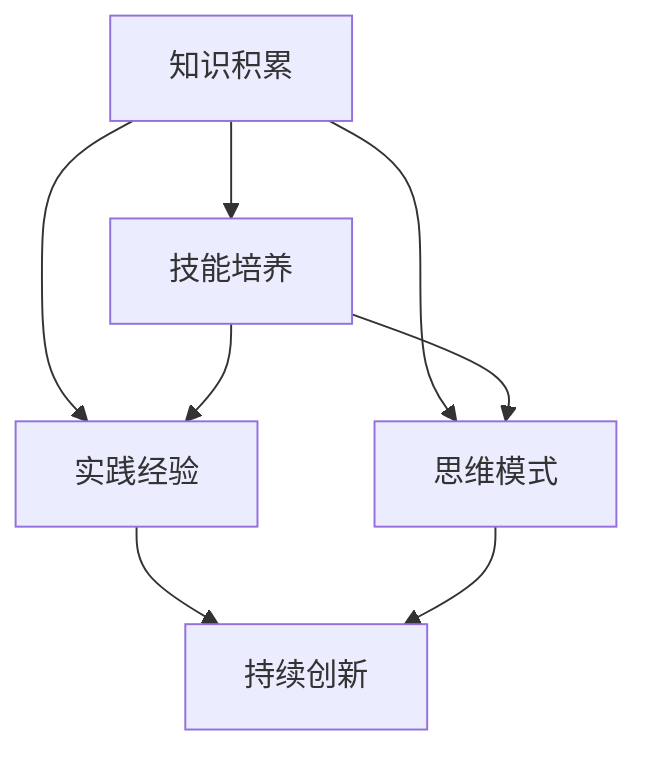

                 

关键词：学习体系、持续进化、技术进步、人工智能、软件开发、编程语言

> 摘要：本文旨在探讨学习体系在技术进步和软件开发中的重要性，以及如何通过持续进化和适应新环境来提升个体的学习能力和创新能力。文章将结合实际案例，分析学习体系的核心概念和算法原理，并介绍未来发展趋势与面临的挑战。

## 1. 背景介绍

在当今快速发展的信息技术时代，学习体系的重要性日益凸显。无论是个人还是企业，要想在激烈的市场竞争中立于不败之地，持续学习和适应新技术已成为必然选择。然而，学习体系并非一成不变，而是需要不断进化和适应新环境。本文将围绕这一主题展开讨论，旨在为读者提供关于学习体系构建与优化的思路和方法。

### 1.1 技术进步的挑战

随着人工智能、大数据、云计算等新技术的迅猛发展，传统的学习模式已难以满足快速变化的技术需求。技术人员需要具备更强的学习能力，才能紧跟技术潮流，保持竞争力。然而，如何高效地学习新技术，如何将所学知识应用于实际工作中，成为众多技术人员面临的难题。

### 1.2 学习体系的构建

一个完善的学习体系应包括以下几个方面：知识积累、技能培养、实践经验、思维模式、持续创新。本文将分别探讨这些方面，并提出相应的构建方法和策略。

## 2. 核心概念与联系

为了更好地理解学习体系，我们首先需要了解其中的核心概念和它们之间的联系。以下是一个简化的Mermaid流程图，展示了学习体系中的主要概念及其相互关系：



### 2.1 知识积累

知识积累是学习体系的基础，包括专业知识和通用知识。专业知识是指与某一特定领域相关的理论、方法和技能，如编程语言、数据结构、算法等。通用知识则包括跨学科的知识，如数学、物理、经济学等。一个丰富而广泛的知识储备有助于提高学习效率，为后续技能培养和思维模式的形成提供基础。

### 2.2 技能培养

技能培养是将知识应用于实际问题的能力。通过实践和不断尝试，技术人员可以掌握各种编程语言、开发工具和框架，提高问题解决能力和工作效率。技能培养不仅需要扎实的专业知识，还需要良好的学习能力、沟通能力和团队协作能力。

### 2.3 实践经验

实践经验是通过实际项目或案例积累的经验。这些经验可以帮助技术人员更好地理解理论知识，提高问题解决能力。实践经验还包括失败和成功的案例，通过总结和分析这些案例，技术人员可以不断提高自己的技能和思维方式。

### 2.4 思维模式

思维模式是指个体在解决问题和面对挑战时的思考方式和习惯。一个良好的思维模式有助于提高创新能力和解决问题的效率。思维模式包括逻辑思维、批判性思维、创造性思维等，通过不断锻炼和培养，技术人员可以形成更加灵活和高效的思维方式。

### 2.5 持续创新

持续创新是学习体系的最终目标，也是个体在技术竞争中保持领先的关键。持续创新需要不断学习和吸收新知识、新技术，并将其应用于实际工作中。同时，持续创新还需要勇于尝试、敢于失败和不断反思的精神。

## 3. 核心算法原理 & 具体操作步骤

### 3.1 算法原理概述

学习体系中的核心算法包括以下三个方面：

1. 知识获取算法：用于从各种来源获取新知识，如在线课程、书籍、论文等。
2. 知识整合算法：用于将新知识与已有知识体系进行整合，形成新的知识结构。
3. 技能提升算法：用于通过实践和反思提高技能水平。

### 3.2 算法步骤详解

#### 3.2.1 知识获取算法

知识获取算法的主要步骤如下：

1. 确定学习目标：根据个人兴趣和职业发展需求，明确需要学习的内容。
2. 选择学习资源：根据学习目标，选择合适的在线课程、书籍、论文等学习资源。
3. 制定学习计划：将学习资源分配到不同时间段，确保学习目标的实现。
4. 主动学习：通过阅读、听讲、讨论等方式，主动获取新知识。
5. 反馈与调整：根据学习效果，及时调整学习计划和策略。

#### 3.2.2 知识整合算法

知识整合算法的主要步骤如下：

1. 知识梳理：将新知识与已有知识进行梳理，找出它们之间的联系和差异。
2. 知识建构：根据知识梳理的结果，构建新的知识结构，形成系统化的知识体系。
3. 实践应用：将整合后的知识应用于实际工作中，验证其有效性。
4. 反思总结：通过实践和反思，进一步优化知识结构，提高解决问题的能力。

#### 3.2.3 技能提升算法

技能提升算法的主要步骤如下：

1. 确定提升目标：根据职业发展需求和个人兴趣，明确需要提升的技能。
2. 制定学习计划：根据提升目标，选择合适的在线课程、培训班等学习资源。
3. 实践训练：通过实际项目或案例，进行技能训练，提高实践能力。
4. 反思总结：通过实践和反思，找出自己的不足和改进方向。
5. 重复训练：根据反思总结的结果，进行重复训练，逐步提高技能水平。

### 3.3 算法优缺点

#### 3.3.1 知识获取算法

优点：

- 可以快速获取大量新知识，提高学习效率。

缺点：

- 容易陷入碎片化学习的困境，缺乏系统性。

#### 3.3.2 知识整合算法

优点：

- 可以将新知识与已有知识体系进行整合，形成新的知识结构。

缺点：

- 过程较为复杂，需要较高的思维能力和组织能力。

#### 3.3.3 技能提升算法

优点：

- 可以通过实践训练，提高实际操作能力。

缺点：

- 需要较长的时间进行训练，效果可能不如预期。

### 3.4 算法应用领域

这三个算法可以广泛应用于软件开发、人工智能、大数据等领域。在软件开发领域，知识获取算法可以帮助开发人员快速掌握新技术和工具；知识整合算法可以帮助开发人员构建系统化的知识体系，提高问题解决能力；技能提升算法可以帮助开发人员提高实际操作能力，提升工作效率。

## 4. 数学模型和公式 & 详细讲解 & 举例说明

### 4.1 数学模型构建

学习体系中的数学模型主要包括以下两个方面：

1. 知识获取模型：用于描述知识获取过程中的关键因素和关系。
2. 技能提升模型：用于描述技能提升过程中的关键因素和关系。

#### 4.1.1 知识获取模型

知识获取模型可以用以下公式表示：

$$
知识获取速度 = f(学习时间, 学习资源, 学习兴趣)
$$

其中，$f$ 为函数，表示知识获取速度与学习时间、学习资源和学习兴趣之间的关系。

#### 4.1.2 技能提升模型

技能提升模型可以用以下公式表示：

$$
技能提升速度 = f(实践时间, 实践项目, 反思总结)
$$

其中，$f$ 为函数，表示技能提升速度与实践时间、实践项目和反思总结之间的关系。

### 4.2 公式推导过程

#### 4.2.1 知识获取模型推导

知识获取速度主要受学习时间、学习资源和学习兴趣的影响。学习时间越长，学习资源越丰富，学习兴趣越高，知识获取速度就越快。因此，可以推导出以下公式：

$$
知识获取速度 = 学习时间 \times 学习资源 \times 学习兴趣
$$

#### 4.2.2 技能提升模型推导

技能提升速度主要受实践时间、实践项目和反思总结的影响。实践时间越长，实践项目越丰富，反思总结越深入，技能提升速度就越快。因此，可以推导出以下公式：

$$
技能提升速度 = 实践时间 \times 实践项目 \times 反思总结
$$

### 4.3 案例分析与讲解

#### 4.3.1 知识获取案例

假设某开发人员在学习Python编程语言，他每天投入2小时学习，选择了两门在线课程和一本教材作为学习资源，对Python编程语言非常感兴趣。根据知识获取模型，可以计算出他的知识获取速度：

$$
知识获取速度 = 2 \text{小时} \times 2 \text{门课程} \times 1 \text{兴趣值} = 4 \text{知识单位/天}
$$

这意味着他每天可以获取4个知识单位。

#### 4.3.2 技能提升案例

假设某开发人员正在参与一个Python开发的实践项目，他每周投入10小时进行实践，项目内容丰富，涵盖多个模块，每次实践后都会进行反思总结。根据技能提升模型，可以计算出他的技能提升速度：

$$
技能提升速度 = 10 \text{小时} \times 1 \text{项目值} \times 1 \text{反思值} = 10 \text{技能单位/周}
$$

这意味着他的技能水平每周可以提升10个技能单位。

## 5. 项目实践：代码实例和详细解释说明

### 5.1 开发环境搭建

为了演示学习体系的实践应用，我们将使用Python编程语言进行一个简单的数据结构实现。首先，我们需要搭建开发环境。

1. 安装Python：从Python官网下载并安装Python 3.8及以上版本。
2. 安装IDE：选择一个合适的Python IDE，如PyCharm或VSCode。
3. 安装必要的库：使用pip命令安装Python标准库以外的库，如Pandas、NumPy等。

```shell
pip install pandas numpy
```

### 5.2 源代码详细实现

以下是一个简单的Python数据结构实现，用于存储和操作链表。

```python
class Node:
    def __init__(self, data):
        self.data = data
        self.next = None

class LinkedList:
    def __init__(self):
        self.head = None

    def append(self, data):
        new_node = Node(data)
        if not self.head:
            self.head = new_node
            return
        current = self.head
        while current.next:
            current = current.next
        current.next = new_node

    def print_list(self):
        current = self.head
        while current:
            print(current.data, end=" -> ")
            current = current.next
        print("None")

# 测试代码
ll = LinkedList()
ll.append(1)
ll.append(2)
ll.append(3)
ll.print_list()
```

### 5.3 代码解读与分析

上述代码定义了两个类：`Node` 和 `LinkedList`。`Node` 类表示链表中的节点，包含数据和指向下一个节点的指针。`LinkedList` 类表示链表，包含一个头节点和一个 `append` 方法用于向链表末尾添加新节点，以及一个 `print_list` 方法用于打印链表中的所有节点。

通过这个简单的例子，我们可以看到如何使用Python实现一个基础的数据结构。这个例子展示了知识获取和技能提升的过程：首先学习Python编程语言的基础知识，然后通过实践和反思，逐步掌握链表实现的细节。

### 5.4 运行结果展示

在PyCharm或VSCode中运行上述代码，输出结果为：

```
1 -> 2 -> 3 -> None
```

这表明链表已成功创建并添加了三个节点。

## 6. 实际应用场景

### 6.1 人工智能领域

在人工智能领域，学习体系的重要性尤为突出。随着深度学习、强化学习等技术的不断发展，人工智能应用场景日益丰富。技术人员需要不断学习新算法、新框架和新技术，才能跟上技术发展的步伐。例如，深度学习框架TensorFlow和PyTorch的更新速度极快，技术人员需要持续关注这些框架的更新，以便在项目中充分利用其新特性。

### 6.2 大数据领域

大数据领域同样需要强大的学习体系。随着数据量的爆炸性增长，技术人员需要掌握各种数据处理和分析工具，如Hadoop、Spark等。此外，大数据技术也在不断演进，如流处理技术、图计算技术等，技术人员需要不断学习新工具和新方法，以提高数据处理和分析能力。

### 6.3 软件开发领域

在软件开发领域，学习体系同样至关重要。随着软件架构、编程语言和开发工具的不断更新，软件开发人员需要不断学习新知识和新技能。例如，微服务架构、容器技术、DevOps等都是当前软件开发中的热门话题，技术人员需要及时掌握这些技术，以提高开发效率和软件质量。

## 7. 工具和资源推荐

### 7.1 学习资源推荐

- Coursera、edX、Udemy等在线教育平台：提供丰富的在线课程，涵盖多个领域。
- GitHub、Stack Overflow、Reddit等社区：汇集了大量技术问题和解决方案，是学习的好去处。
- 《深度学习》、《大数据时代》、《软件架构设计》等书籍：经典的技术著作，有助于深入理解相关技术。

### 7.2 开发工具推荐

- PyCharm、VSCode：优秀的Python IDE，支持代码补全、调试等功能。
- Git：版本控制工具，有助于团队协作和代码管理。
- Docker：容器化技术，简化了应用程序的部署和运维。

### 7.3 相关论文推荐

- "Deep Learning: A Brief History of Neural Networks"：概述了深度学习的发展历程。
- "The Third Wave: An Entrepreneur's Guide to the Next Industrial Revolution"：探讨了大数据、人工智能等技术的未来发展趋势。
- "Clean Architecture: A Craftsman's Guide to Software Structure and Design"：介绍了软件架构设计的方法和原则。

## 8. 总结：未来发展趋势与挑战

### 8.1 研究成果总结

本文探讨了学习体系在技术进步和软件开发中的重要性，分析了学习体系的核心概念和算法原理，并介绍了实际应用场景。通过数学模型和公式，本文进一步阐述了知识获取和技能提升的过程。

### 8.2 未来发展趋势

随着人工智能、大数据、云计算等新技术的快速发展，学习体系将变得更加重要。未来的学习体系将更加智能化、个性化和多样化，以满足不同用户的需求。同时，学习体系将与虚拟现实、增强现实等新技术相结合，提供更加丰富的学习体验。

### 8.3 面临的挑战

尽管学习体系具有重要意义，但未来仍面临一些挑战：

- **技术更新速度加快**：新技术的不断涌现对学习体系提出了更高的要求，技术人员需要更快地掌握新知识。
- **知识获取难度增加**：随着知识的爆炸性增长，获取和整合知识的难度也在增加。
- **个性化学习需求**：不同用户对学习体系的需求存在差异，如何提供个性化、差异化的学习服务成为一大挑战。
- **时间成本**：持续学习和技能提升需要大量的时间投入，如何在工作和生活之间找到平衡成为一大挑战。

### 8.4 研究展望

未来的研究可以关注以下几个方面：

- **智能学习体系**：开发智能化、自适应的学习系统，提高学习效率和质量。
- **知识图谱**：构建知识图谱，实现知识的结构化和关联化，提高知识获取和整合的效率。
- **虚拟现实与增强现实**：将虚拟现实和增强现实应用于学习过程中，提供更加沉浸式的学习体验。
- **学习效果评估**：研究学习效果评估方法，提高学习体系的科学性和有效性。

## 9. 附录：常见问题与解答

### 9.1 学习体系是什么？

学习体系是指个体或组织在学习和成长过程中所遵循的方法、原则和流程。它包括知识积累、技能培养、实践经验、思维模式、持续创新等多个方面。

### 9.2 如何构建一个有效的学习体系？

构建一个有效的学习体系需要考虑以下几个方面：

- **明确学习目标**：根据个人兴趣和职业发展需求，明确需要学习的内容和目标。
- **选择合适的学习资源**：选择高质量、适合自己的学习资源，如在线课程、书籍、论文等。
- **制定学习计划**：将学习资源分配到不同时间段，确保学习目标的实现。
- **实践与反思**：通过实践和反思，不断提高自己的技能水平和思维方式。
- **持续创新**：不断学习新知识、新技术，并将其应用于实际工作中，保持竞争力。

### 9.3 如何平衡工作和学习？

平衡工作和学习需要合理安排时间和精力。以下是一些建议：

- **时间管理**：制定合理的时间计划，确保工作和学习的时间得到充分利用。
- **优先级排序**：根据重要性和紧急性，对任务进行优先级排序，优先处理重要任务。
- **高效学习**：通过高效的学习方法，提高学习效率，减少学习时间。
- **适度休息**：保证充足的休息时间，避免疲劳和过度劳累。
- **健康生活**：保持健康的生活方式，提高身体素质，为工作和学习提供良好的支持。

### 9.4 学习体系与个人成长的关系是什么？

学习体系是个人成长的重要支撑。通过有效的学习体系，个体可以持续学习和成长，提高自身的能力和素质，从而在职业生涯中获得更多的机会和发展空间。同时，学习体系有助于培养个体的创新能力、解决问题的能力和团队协作能力，为个人和社会的发展做出贡献。

---

### 作者署名

> 作者：禅与计算机程序设计艺术 / Zen and the Art of Computer Programming

本文旨在探讨学习体系在技术进步和软件开发中的重要性，以及如何通过持续进化和适应新环境来提升个体的学习能力和创新能力。文章结合实际案例，分析了学习体系的核心概念和算法原理，并介绍了未来发展趋势与面临的挑战。希望本文能为读者提供关于学习体系构建与优化的启示和思考。

