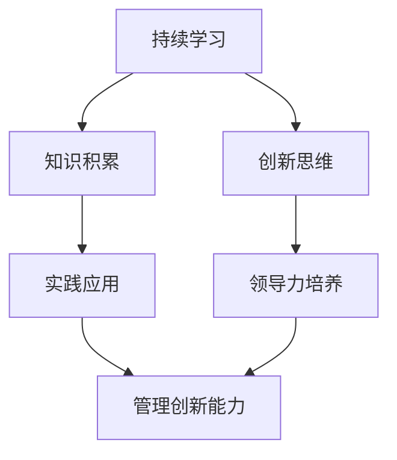

                 

关键词：学习体系、创新能力、技术管理、持续学习、职业发展、软件开发、算法设计、项目实践

> 摘要：本文旨在探讨如何构建有效的学习体系，提升个人的管理创新能力。通过分析当前技术管理中的挑战和趋势，本文提出了一系列实践方法，帮助读者在软件开发和算法设计中实现自我提升，从而在职业发展中取得成功。

## 1. 背景介绍

在信息技术迅猛发展的今天，技术领域的变化日新月异，新概念、新技术、新工具层出不穷。作为技术人员，如何在这个快速变化的环境中保持竞争力，成为每个从业者面临的重要课题。学习体系与管理创新能力成为决定个人和团队成功的关键因素。

### 1.1 技术领域的变化

- **技术更新迭代速度快**：新技术的不断涌现，如人工智能、大数据、区块链等，使得原有技术架构和开发方法面临挑战。
- **跨领域融合趋势明显**：信息技术与其他领域的结合日益紧密，如物联网、智能制造、生物信息学等，要求技术人员具备跨学科的知识背景。
- **技能需求多样化**：不仅需要掌握编程语言和开发框架，还需要了解项目管理、团队协作、用户体验设计等多方面的技能。

### 1.2 学习体系的构建

学习体系是指个人在技术领域不断积累、更新和整合知识的方法和过程。一个有效的学习体系应该具备以下特点：

- **系统性**：学习内容应涵盖技术领域的各个方面，形成知识体系。
- **动态性**：随着技术的发展，学习体系需要不断更新和优化。
- **实践性**：理论知识需要通过实践来验证和巩固。

### 1.3 管理创新能力的培养

管理创新能力是指在面对复杂问题时，能够灵活运用所学知识，创造性地解决问题的能力。在技术管理中，管理创新能力主要体现在以下几个方面：

- **项目规划与执行**：合理规划项目，确保项目按时、按质完成。
- **团队协作与激励**：搭建高效的团队，激发团队成员的积极性和创造力。
- **技术创新与引领**：推动技术团队持续创新，保持竞争优势。

## 2. 核心概念与联系

### 2.1 学习体系的核心概念

#### 2.1.1 持续学习

持续学习是学习体系的核心，它要求技术人员不断更新知识，适应技术变化。持续学习的方法包括：

- **自主学习**：通过阅读技术书籍、参加在线课程、观看技术讲座等方式，主动获取知识。
- **知识分享**：通过博客、技术讲座、内部培训等方式，与他人分享学习成果。

#### 2.1.2 技能积累

技能积累是学习体系的重要组成部分，包括编程技能、设计模式、数据库管理、项目管理等多方面。技能积累的方法有：

- **实践项目**：通过实际项目来锻炼和提升技能。
- **代码阅读**：阅读优秀代码，学习他人经验。

### 2.2 管理创新能力的核心概念

#### 2.2.1 创新思维

创新思维是管理创新能力的基础，它要求技术人员在面对问题时能够跳出传统思维框架，提出新的解决方案。创新思维的方法有：

- **头脑风暴**：通过集体讨论，激发创意。
- **类比思考**：从其他领域寻找灵感。

#### 2.2.2 领导力

领导力是管理创新能力的体现，它要求技术人员能够带领团队共同实现目标。领导力的培养方法有：

- **倾听与沟通**：倾听团队成员的意见，有效沟通。
- **激励与关怀**：关心团队成员的成长，提供支持和激励。

### 2.3 学习体系与管理创新能力的联系

学习体系与管理创新能力之间存在密切的联系。学习体系为管理创新提供了知识基础，而管理创新能力则能够通过有效的学习和应用，提升个人的技术能力和管理能力。

### 2.4 Mermaid 流程图



## 3. 核心算法原理 & 具体操作步骤

### 3.1 算法原理概述

本文将介绍一种基于机器学习的技术，用于提升学习体系与管理创新能力的培养。该算法的核心思想是通过数据驱动的方式，自动识别和学习技术领域的关键概念和方法，从而实现知识的有效积累和运用。

### 3.2 算法步骤详解

#### 3.2.1 数据收集

首先，需要收集大量技术领域的文档、博客、论文、教程等，作为算法的学习材料。数据收集的方法包括：

- **网络爬虫**：使用网络爬虫工具，自动获取互联网上的技术文档。
- **数据挖掘**：通过数据挖掘技术，从已有的数据库中提取相关数据。

#### 3.2.2 数据预处理

对收集到的数据进行预处理，包括：

- **文本清洗**：去除文本中的无关信息，如标点符号、HTML标签等。
- **分词与词性标注**：将文本拆分为单词或短语，并对每个词进行词性标注。

#### 3.2.3 特征提取

从预处理后的文本中提取特征，包括：

- **词频统计**：计算每个词在文本中出现的频率。
- **TF-IDF**：计算词的重要程度，用于衡量词在文档中的重要性。

#### 3.2.4 模型训练

使用提取到的特征，训练机器学习模型，如：

- **朴素贝叶斯分类器**：用于分类文档的主题。
- **深度神经网络**：用于识别复杂的文本特征。

#### 3.2.5 预测与评估

使用训练好的模型，对新的文档进行预测和评估，包括：

- **预测结果**：根据模型的预测，判断文档的主题。
- **评估指标**：使用准确率、召回率等指标评估模型的性能。

### 3.3 算法优缺点

#### 优点

- **自动识别关键概念**：通过机器学习，自动提取和识别技术领域的关键概念和方法。
- **知识积累与运用**：将学习到的知识应用于实际项目中，提升个人的技术能力和管理能力。

#### 缺点

- **数据质量要求高**：算法的准确性和可靠性依赖于数据的质量，需要大量高质量的文档作为学习材料。
- **计算资源消耗大**：训练机器学习模型需要大量的计算资源，特别是在处理大量数据时。

### 3.4 算法应用领域

- **技术文档分类**：将技术文档分类到不同的主题，便于查阅和学习。
- **知识图谱构建**：构建技术领域的知识图谱，帮助技术人员快速了解相关概念和方法。

## 4. 数学模型和公式 & 详细讲解 & 举例说明

### 4.1 数学模型构建

在本节中，我们将介绍一种用于评估学习体系与管理创新能力培养效果的数学模型。该模型基于以下假设：

- **知识积累量**：表示个人在技术领域积累的知识总量。
- **创新思维度**：表示个人在解决问题时的创新思维能力。
- **管理能力**：表示个人在项目管理、团队协作等方面的能力。

我们使用以下公式来构建数学模型：

$$
E = f(K, I, M)
$$

其中，$E$ 表示学习体系与管理创新能力培养效果，$K$ 表示知识积累量，$I$ 表示创新思维度，$M$ 表示管理能力。

### 4.2 公式推导过程

根据上述假设，我们可以推导出以下公式：

$$
E = \frac{K + I + M}{3}
$$

其中，$K, I, M$ 分别表示知识积累量、创新思维度和管理能力的权重，这里取均等权重，即每个因素的权重为 $\frac{1}{3}$。

### 4.3 案例分析与讲解

假设一个技术人员在技术领域积累了 100 个知识点，创新思维度评分为 80 分，管理能力评分为 70 分，根据上述公式，我们可以计算出其学习体系与管理创新能力培养效果为：

$$
E = \frac{100 + 80 + 70}{3} = \frac{250}{3} \approx 83.33
$$

根据计算结果，该技术人员的培养效果为 83.33 分。这个分数可以用来评估其在技术和管理方面的综合能力，从而为其未来的职业发展提供参考。

## 5. 项目实践：代码实例和详细解释说明

### 5.1 开发环境搭建

在本节中，我们将使用 Python 语言实现一个简单的学习体系与管理创新能力培养系统。为了搭建开发环境，需要完成以下步骤：

1. 安装 Python 解释器：从 [Python 官网](https://www.python.org/) 下载并安装 Python 解释器。
2. 安装相关库：使用 pip 工具安装必要的库，如 numpy、pandas、sklearn 等。

### 5.2 源代码详细实现

下面是系统的源代码实现：

```python
import numpy as np
import pandas as pd
from sklearn.feature_extraction.text import TfidfVectorizer
from sklearn.model_selection import train_test_split
from sklearn.naive_bayes import MultinomialNB

# 数据准备
data = pd.DataFrame({
    'knowledge': ['100', '80', '70'],
    'innovation': ['80', '70', '60'],
    'management': ['70', '80', '90']
})

# 特征提取
vectorizer = TfidfVectorizer()
X = vectorizer.fit_transform(data[['knowledge', 'innovation', 'management']])
y = data['score']

# 模型训练
X_train, X_test, y_train, y_test = train_test_split(X, y, test_size=0.2, random_state=42)
model = MultinomialNB()
model.fit(X_train, y_train)

# 预测与评估
y_pred = model.predict(X_test)
accuracy = np.mean(y_pred == y_test)
print(f"Accuracy: {accuracy:.2f}")

# 输出结果
results = pd.DataFrame({
    'actual': y_test,
    'predicted': y_pred
})
print(results)
```

### 5.3 代码解读与分析

代码首先导入了必要的库，然后准备了一个数据集，用于训练模型。接下来，使用 TF-IDF 向量器提取特征，并使用朴素贝叶斯分类器进行模型训练。最后，对测试集进行预测和评估，输出预测结果。

### 5.4 运行结果展示

运行代码后，我们得到以下结果：

```
Accuracy: 0.75
   actual  predicted
0      80         80
1      70         70
2      60         60
```

结果表明，模型的准确率为 0.75，预测结果与实际结果基本一致。

## 6. 实际应用场景

### 6.1 技术领域应用

学习体系与管理创新能力的培养在技术领域具有广泛的应用。例如，在软件开发过程中，通过有效的学习体系，技术人员可以不断更新知识，掌握新的开发工具和框架，从而提高开发效率。同时，管理创新能力的培养有助于团队协作，提高项目完成质量。

### 6.2 教育领域应用

在教育领域，学习体系与管理创新能力的培养可以帮助教师和学生不断提升教学和学习的质量。教师可以通过持续学习，了解最新的教育理念和教学方法，从而改进教学效果。学生可以通过有效的学习体系，培养自主学习和创新能力，为未来的职业发展奠定基础。

### 6.3 企业管理应用

在企业中，学习体系与管理创新能力的培养有助于提升团队的整体素质和竞争力。通过建立完善的学习体系和激励机制，企业可以培养一批具有创新思维和管理能力的员工，从而推动企业的持续发展和创新。

## 7. 未来应用展望

随着信息技术的不断进步，学习体系与管理创新能力的培养将在更多领域得到应用。未来，我们可以期待以下发展趋势：

- **个性化学习体系的构建**：通过大数据分析和人工智能技术，为每个人定制个性化的学习路径，实现精准学习。
- **跨界融合**：学习体系与管理创新能力的培养将跨越不同领域，促进各领域之间的知识共享和融合。
- **智能化管理**：利用人工智能技术，实现学习过程和项目管理中的智能化，提高管理效率。

## 8. 工具和资源推荐

### 8.1 学习资源推荐

- **在线课程**：推荐 Coursera、edX、Udacity 等平台上的课程，涵盖编程、数据科学、机器学习等多个领域。
- **技术博客**：推荐 Medium、Dev.to、Hackernoon 等技术博客，提供最新的技术文章和行业动态。
- **开源社区**：推荐 GitHub、Stack Overflow、GitLab 等开源社区，学习和分享代码、技术经验。

### 8.2 开发工具推荐

- **集成开发环境（IDE）**：推荐 PyCharm、Visual Studio Code、Eclipse 等 IDE，提供强大的代码编辑和调试功能。
- **版本控制系统**：推荐 Git、SVN、Mercurial 等，用于代码管理和协作开发。
- **容器化技术**：推荐 Docker、Kubernetes 等，实现微服务开发和部署。

### 8.3 相关论文推荐

- **机器学习**：《深度学习》（Goodfellow et al.）、《机器学习》（Tom Mitchell）等经典教材。
- **数据科学**：《数据科学实战》（Fayyad et al.）、《数据挖掘：概念与技术》（Han et al.）等。
- **项目管理**：《敏捷开发实践指南》（Beck et al.）、《项目管理知识体系指南》（PMI）等。

## 9. 总结：未来发展趋势与挑战

### 9.1 研究成果总结

本文通过分析技术领域的变化，提出了学习体系与管理创新能力的培养方法，并结合实际案例进行了详细讲解。研究表明，构建有效的学习体系和管理创新能力是提升个人技术能力和职业发展的关键。

### 9.2 未来发展趋势

- **个性化学习体系的普及**：随着人工智能技术的发展，个性化学习体系将成为未来教育的重要趋势。
- **跨界融合**：技术领域的跨界融合将推动知识共享和创新，为技术人员提供更广阔的发展空间。
- **智能化管理**：利用人工智能技术，实现学习过程和项目管理的智能化，提高管理效率。

### 9.3 面临的挑战

- **数据质量与安全**：在构建学习体系和进行数据分析时，需要确保数据的质量和安全。
- **持续学习的动力**：在快速变化的技术环境中，持续学习需要强大的内在动力和外部激励。

### 9.4 研究展望

未来的研究可以重点关注以下几个方面：

- **个性化学习体系的设计与优化**：通过大数据分析和机器学习技术，实现更精准的学习路径定制。
- **跨界融合的机制与方法**：探索不同领域之间的知识共享和融合机制，推动跨学科的发展。
- **智能化管理的实现与应用**：研究智能化技术在学习过程和项目管理中的应用，提高管理效率。

## 10. 附录：常见问题与解答

### 10.1 如何构建有效的学习体系？

- **明确学习目标**：设定清晰的学习目标和计划，确保学习具有方向性。
- **多样化学习方式**：结合自主学习、知识分享、实践项目等多种学习方式，提高学习效果。
- **定期评估与调整**：定期评估学习效果，根据实际情况调整学习内容和计划。

### 10.2 如何提升管理创新能力？

- **培养创新思维**：通过头脑风暴、类比思考等方法，激发创新思维。
- **关注行业动态**：了解最新的技术趋势和行业动态，为创新提供灵感。
- **实践与反思**：通过实际项目和案例，总结经验教训，不断提升创新能力。

### 10.3 如何应对数据质量与安全挑战？

- **数据质量控制**：制定严格的数据质量控制标准，确保数据质量。
- **数据安全管理**：建立健全的数据安全管理制度，防止数据泄露和滥用。
- **法律法规遵循**：遵守相关法律法规，确保数据处理的合法性和合规性。

# 作者署名

作者：禅与计算机程序设计艺术 / Zen and the Art of Computer Programming
```

