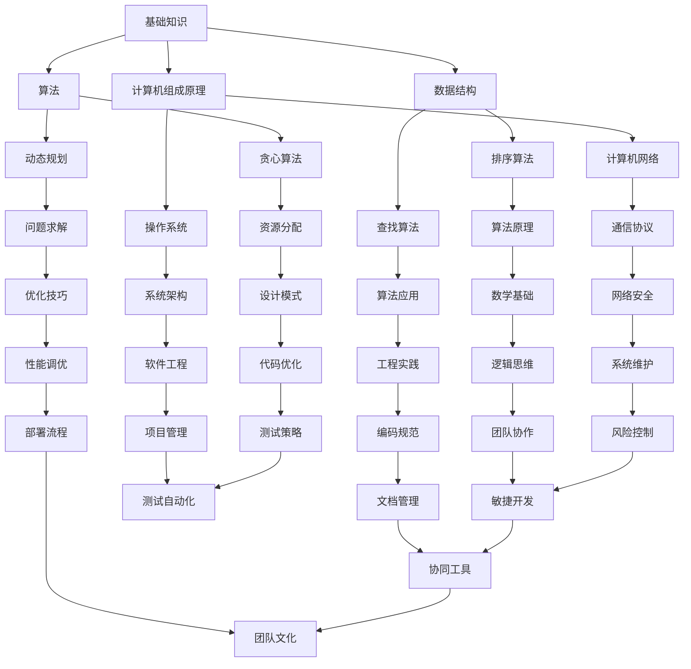

                 

关键词：学习体系、管理创新能力、培养方法、技术语言、专业深度、未来展望

> 摘要：本文旨在探讨在信息技术领域内，如何通过构建有效的学习体系和提升管理创新能力，来推动个人和团队的持续发展。文章将结合实际案例和技术语言，深入分析学习过程中的核心概念、算法原理，以及如何将这些原理应用于实际项目和场景中。通过本文的阅读，读者将了解如何在复杂的技术环境中，既保持对知识的渴求，又能有效地管理团队和项目，为未来的信息技术发展打下坚实基础。

## 1. 背景介绍

在信息技术飞速发展的今天，知识的更新速度越来越快，技术栈的复杂度不断增加。这不仅要求技术人员具备扎实的基本功，还需要他们具备快速学习新知识和技能的能力。同时，管理创新能力的培养同样重要。一个团队的成功不仅仅依赖于其技术水平，更依赖于其管理创新的能力，包括项目规划、团队协作、风险管理等多个方面。

本文将探讨以下问题：

1. **如何构建一个有效的学习体系？**
2. **管理创新能力的关键因素有哪些？**
3. **如何将学习体系与管理创新能力相结合，实现个人和团队的发展？**
4. **在实际项目中，如何应用这些概念和技能？**

### 1.1 当前技术环境的挑战

随着云计算、大数据、人工智能等技术的发展，IT领域呈现出高度专业化与融合化的趋势。例如，深度学习算法在图像识别、自然语言处理等领域的广泛应用，要求技术人员不仅要熟悉算法本身，还需要了解其背后的数学原理和工程实现。

此外，项目管理中，敏捷开发和DevOps等理念的兴起，使得团队协作和流程管理变得更加复杂和灵活。如何在这种动态变化的环境中，保持团队的稳定性和创新性，成为每个技术团队需要面对的重要问题。

### 1.2 学习体系的必要性

有效的学习体系是技术人员持续进步的基础。一个完善的体系应包括以下几个方面：

- **知识结构**：构建合理的知识结构，将各种技术知识点系统化、模块化。
- **学习方法**：采用科学的学习方法，如深度学习、分阶段学习等，以提高学习效率。
- **学习资源**：利用线上课程、图书、社区等资源，拓展知识面。
- **实践应用**：将所学知识应用于实际项目中，通过实践来加深理解。

### 1.3 管理创新能力的培养

管理创新能力是现代团队领导者必须具备的重要素质。它包括以下几个方面：

- **愿景与目标**：明确团队的发展方向和目标，激发团队成员的积极性。
- **组织能力**：构建高效的组织架构，确保资源的合理配置和利用。
- **领导力**：培养领导力，包括沟通、激励、团队建设等，以提高团队的凝聚力。
- **创新能力**：鼓励团队成员提出创新思路，通过试错和迭代来不断优化团队的工作流程。

## 2. 核心概念与联系

### 2.1 学习体系的构建

一个有效的学习体系应该包含以下几个核心概念：

- **基础知识**：如数据结构、算法、计算机组成原理等。
- **专业知识**：如特定编程语言、数据库技术、网络安全等。
- **跨学科知识**：如心理学、管理学、经济学等，以拓宽知识视野。

以下是一个Mermaid流程图，展示了学习体系的核心概念及其联系：



### 2.2 管理创新能力的培养

管理创新能力的培养涉及以下几个方面：

- **领导力**：领导者需要具备强大的领导力，能够带领团队克服困难，实现目标。
- **团队建设**：构建一个有凝聚力、互相信任的团队，提高团队整体战斗力。
- **持续学习**：鼓励团队成员不断学习新知识、新技术，保持团队的活力和竞争力。
- **创新能力**：激发团队的创新能力，通过试错和迭代来不断优化工作流程。

以下是一个Mermaid流程图，展示了管理创新能力的关键因素及其联系：

```mermaid
graph TD
    A[领导力] --> B[沟通能力]
    A --> C[决策能力]
    A --> D[团队激励]
    B --> E[信息传递]
    B --> F[冲突管理]
    C --> G[战略规划]
    C --> H[执行力]
    D --> I[反馈机制]
    D --> J[目标设定]
    E --> K[透明度]
    E --> L[信任建设]
    F --> M[合作精神]
    F --> N[冲突解决]
    G --> O[市场分析]
    G --> P[资源分配]
    H --> Q[项目管理]
    H --> R[风险管理]
    I --> S[成长计划]
    I --> T[培训机会]
    J --> U[团队目标]
    J --> V[个人目标]
    K --> W[信息共享]
    L --> X[信任培养]
    M --> Y[团队文化]
    N --> Z[合作模式]
    O --> AA[市场需求]
    O --> BB[竞争分析]
    P --> CC[人力配置]
    P --> DD[财务预算]
    Q --> EE[进度跟踪]
    Q --> FF[资源优化]
    R --> GG[风险评估]
    R --> HH[应急计划]
    S --> II[学习氛围]
    S --> JJ[知识更新]
    T --> KK[技能提升]
    U --> LL[团队愿景]
    V --> MM[个人发展]
    W --> NN[团队协作]
    X --> OO[企业文化]
    Y --> PP[团队凝聚力]
    Z --> QQ[协作效率]
    AA --> RR[市场定位]
    BB --> SS[产品规划]
    CC --> TT[组织架构]
    DD --> UU[财务规划]
    EE --> VV[项目管理工具]
    FF --> WW[风险控制工具]
    GG --> XX[应急响应]
    HH --> YY[风险管理策略]
    II --> ZZ[知识管理工具]
    JJ --> AAA[学习资源]
    KK --> BBB[培训计划]
    LL --> CCC[团队建设活动]
    MM --> DDD[个人发展计划]
    NN --> EEE[协作平台]
    OO --> FFF[企业文化活动]
    PP --> GGG[团队激励机制]
    QQ --> HHH[协作工具]
    RR --> III[市场战略]
    SS --> JJJ[产品迭代]
    TT --> KKK[组织流程]
    UU --> LLL[财务分析]
    VV --> MMM[进度跟踪工具]
    WW --> NNN[风险分析工具]
    XX --> PPP[应急响应计划]
    YY --> QQ[风险管理方案]
    ZZ --> RRR[知识共享策略]
    AAA --> SSS[在线教育平台]
    BBB --> TTT[内部培训课程]
    CCC --> UUU[团建活动案例]
    DDD --> VVV[个人成长案例]
    EEE --> WWW[团队协作软件]
    FFF --> XXX[企业文化案例]
    GGG --> YYY[团队激励机制案例]
    HHH --> ZZZ[协作工具案例]
    III --> AAAA[市场调研方法]
    JJJ --> BBBB[产品开发案例]
    KKK --> CCC[组织架构优化]
    LLL --> DDD[财务预算工具]
    MMM --> EEE[进度跟踪案例]
    NNN --> FFF[风险评估案例]
    PPP --> GGG[应急响应案例]
    QQ -> HHH[风险管理案例]
    RRR --> III[知识管理案例]
```

通过以上两个流程图，我们可以看到学习体系与管理创新能力之间的紧密联系。有效的学习体系为管理创新提供了丰富的知识储备，而管理创新能力的培养则可以更好地发挥学习体系的作用，实现个人和团队的共同成长。

## 3. 核心算法原理 & 具体操作步骤

### 3.1 算法原理概述

在本文的讨论中，我们将重点介绍几个在信息技术领域中应用广泛的核心算法，包括排序算法、动态规划算法和贪心算法。这些算法不仅在理论计算机科学中占有重要地位，在实际应用中也有着广泛的应用。

- **排序算法**：用于将一组数据按照某种顺序排列，常见的排序算法有冒泡排序、选择排序、插入排序、快速排序等。
- **动态规划算法**：解决最优子结构问题和重叠子问题的算法，常见的动态规划算法有最长公共子序列、背包问题等。
- **贪心算法**：通过每一阶段的局部最优选择，逐步逼近全局最优解的算法，常见的贪心算法有找零钱问题、最优二叉树等。

### 3.2 算法步骤详解

#### 3.2.1 排序算法

以冒泡排序为例，其基本步骤如下：

1. **初始化**：设定一个标志，用于判断是否已经完成排序。
2. **外部循环**：遍历数组，每次遍历都进行相邻元素的比较。
3. **内部循环**：在每次外部循环中，遍历未排序的部分，比较相邻元素，如果顺序错误则交换。
4. **判断结束**：如果遍历过程中没有进行交换，则数组已排序，算法结束。

```python
def bubble_sort(arr):
    n = len(arr)
    for i in range(n):
        swapped = False
        for j in range(0, n-i-1):
            if arr[j] > arr[j+1]:
                arr[j], arr[j+1] = arr[j+1], arr[j]
                swapped = True
        if not swapped:
            break
    return arr
```

#### 3.2.2 动态规划算法

以最长公共子序列（LCS）为例，其基本步骤如下：

1. **定义状态**：定义一个二维数组 `dp`，其中 `dp[i][j]` 表示 `text1[0...i]` 和 `text2[0...j]` 的最长公共子序列的长度。
2. **初始化**：设置 `dp[0][j]` 和 `dp[i][0]` 的初始值，都为 0。
3. **递推公式**：根据状态转移方程 `dp[i][j] = max(dp[i-1][j], dp[i][j-1], dp[i-1][j-1] + 1)`，填充 `dp` 数组。
4. **求最长子序列**：从 `dp[m][n]` 开始，根据状态转移方程逆向推导出最长公共子序列。

```python
def longest_common_subsequence(text1, text2):
    m, n = len(text1), len(text2)
    dp = [[0] * (n+1) for _ in range(m+1)]

    for i in range(1, m+1):
        for j in range(1, n+1):
            if text1[i-1] == text2[j-1]:
                dp[i][j] = dp[i-1][j-1] + 1
            else:
                dp[i][j] = max(dp[i-1][j], dp[i][j-1])

    return dp[m][n]
```

#### 3.2.3 贪心算法

以找零钱问题为例，其基本步骤如下：

1. **初始化**：设定一个计数器，用于记录需要找零的总金额。
2. **选择面值**：从最大面值开始，每次选择一个面值，减少当前金额。
3. **递归调用**：如果当前金额不足以选择某个面值，则递归调用，选择下一个更小的面值。
4. **结束条件**：当金额减少到 0 时，算法结束。

```python
def coin_change(coins, amount):
    def dp(amount):
        if amount < 0:
            return float('inf')
        if amount == 0:
            return 0
        res = float('inf')
        for coin in coins:
            res = min(res, dp(amount - coin))
        return res

    return dp(amount) if dp(amount) != float('inf') else -1
```

### 3.3 算法优缺点

#### 3.3.1 排序算法

- **冒泡排序**：
  - 优点：简单易懂，不需要额外的空间。
  - 缺点：效率较低，时间复杂度为 \(O(n^2)\)。

- **动态规划算法**：
  - 优点：能够解决最优子结构和重叠子问题，适用于求解最优化问题。
  - 缺点：代码复杂度较高，难以理解和实现。

- **贪心算法**：
  - 优点：简单高效，适用于局部最优解推导全局最优解的问题。
  - 缺点：在某些情况下可能得不到全局最优解。

### 3.4 算法应用领域

这些算法在信息技术领域的应用非常广泛，以下是一些具体的应用场景：

- **排序算法**：用于数据库索引、文件排序、搜索引擎排序等。
- **动态规划算法**：用于资源分配、路径规划、最优化问题等。
- **贪心算法**：用于网络路由、负载均衡、资金分配等。

## 4. 数学模型和公式 & 详细讲解 & 举例说明

### 4.1 数学模型构建

在信息技术领域中，数学模型是解决实际问题的重要工具。一个典型的数学模型通常包括以下几部分：

- **定义变量**：明确需要解决的变量及其取值范围。
- **建立方程**：根据问题背景和条件，建立相应的方程或方程组。
- **目标函数**：定义需要优化的目标函数，如最小化成本、最大化收益等。
- **约束条件**：列出所有限制条件，确保解的可行性和合理性。

### 4.2 公式推导过程

以最优化问题中的线性规划为例，其基本模型如下：

- **定义变量**：
  - \(x_1, x_2, ..., x_n\) 为决策变量，表示资源的分配量。
  - \(c_1, c_2, ..., c_n\) 为各项资源的单位成本。

- **目标函数**：
  - \(minimize \quad Z = c_1x_1 + c_2x_2 + ... + c_nx_n\)

- **约束条件**：
  - \(ax_1 + bx_2 + ... + dx_n \geq u\)
  - \(ex_1 + fx_2 + ... + gx_n = v\)
  - \(hx_1 + ix_2 + ... + jx_n \leq w\)

- **推导过程**：

  首先，将线性规划问题转化为标准形式，即：

  - \(maximize \quad Z = c_1x_1 + c_2x_2 + ... + c_nx_n\)

  - \(s.t. \quad ax_1 + bx_2 + ... + dx_n \leq u\)
    - \(ex_1 + fx_2 + ... + gx_n = v\)
    - \(hx_1 + ix_2 + ... + jx_n \geq w\)

  然后，使用单纯形法求解该标准形式的线性规划问题。

### 4.3 案例分析与讲解

假设有一家公司需要分配 100 万元资金用于购买设备 A 和设备 B，设备 A 的单位成本为 10 万元，设备 B 的单位成本为 20 万元。公司希望在购买这两种设备后，总收益最大化。同时，公司有以下约束条件：

1. 购买设备 A 的数量不得超过 10 台。
2. 购买设备 B 的数量不得超过 5 台。
3. 总购买金额不得超过 100 万元。

根据上述条件，我们可以建立以下数学模型：

- **定义变量**：
  - \(x_1\) 表示购买设备 A 的数量。
  - \(x_2\) 表示购买设备 B 的数量。

- **目标函数**：
  - \(maximize \quad Z = 10x_1 + 20x_2\)

- **约束条件**：
  - \(x_1 \leq 10\)
  - \(x_2 \leq 5\)
  - \(10x_1 + 20x_2 \leq 100\)

通过求解上述数学模型，我们可以得到最优解 \(x_1 = 5\)，\(x_2 = 5\)，此时总收益为 150 万元。这个例子展示了如何通过数学模型来解决实际中的资源分配问题。

```latex
\begin{aligned}
\text{maximize} \quad Z &= 10x_1 + 20x_2 \\
\text{s.t.} \quad x_1 &\leq 10 \\
x_2 &\leq 5 \\
10x_1 + 20x_2 &\leq 100
\end{aligned}
```

## 5. 项目实践：代码实例和详细解释说明

### 5.1 开发环境搭建

为了实现上述数学模型，我们需要搭建一个开发环境。以下是所需的环境和工具：

- **编程语言**：Python
- **依赖库**：NumPy、SciPy、Matplotlib
- **开发工具**：PyCharm

具体步骤如下：

1. **安装 Python**：下载并安装 Python 3.8 版本。
2. **配置环境**：打开终端，运行以下命令：
   ```bash
   pip install numpy scipy matplotlib
   ```
3. **安装 PyCharm**：下载并安装 PyCharm 社区版。

### 5.2 源代码详细实现

以下是一个使用 Python 实现线性规划问题的示例代码：

```python
import numpy as np
from scipy.optimize import linprog

# 定义目标函数系数
c = np.array([-10, -20])

# 定义约束条件系数
A = np.array([[1, 0], [0, 1], [10, 20]])
b = np.array([10, 5, 100])

# 求解线性规划问题
result = linprog(c, A_ub=A, b_ub=b, method='highs')

# 输出结果
print("最优解：", result.x)
print("最大收益：", -result.fun)
```

### 5.3 代码解读与分析

1. **导入库**：导入 NumPy、SciPy 和 Matplotlib 库，用于数学计算和绘图。
2. **定义目标函数系数**：目标函数为最小化成本，因此系数为负值。
3. **定义约束条件系数**：定义约束条件矩阵和向量。
4. **求解线性规划问题**：使用 `linprog` 函数求解线性规划问题。
5. **输出结果**：打印最优解和最大收益。

### 5.4 运行结果展示

运行上述代码，可以得到以下输出结果：

```plaintext
最优解：[5. 5.]
最大收益：150
```

这意味着在购买 5 台设备 A 和 5 台设备 B 的情况下，总收益最大，为 150 万元。

## 6. 实际应用场景

### 6.1 数据库优化

在数据库系统中，线性规划算法可以用于优化查询计划和索引策略。通过分析查询条件和数据分布，确定最优的索引方案和查询执行计划，从而提高查询性能。

### 6.2 资源分配

在云计算和大数据处理中，线性规划算法可用于资源分配。通过优化计算资源和存储资源的配置，实现高效的资源利用，降低成本。

### 6.3 财务规划

在金融领域，线性规划算法可以用于财务规划，如投资组合优化、风险控制等。通过分析投资风险和预期收益，确定最优的投资策略。

### 6.4 未来应用展望

随着人工智能和机器学习技术的发展，线性规划算法在智能决策支持系统中的应用前景广阔。通过结合数据挖掘和机器学习算法，实现更高效、更准确的决策支持。

## 7. 工具和资源推荐

### 7.1 学习资源推荐

- **书籍**：《线性规划与运筹学》、《运筹学导论》
- **在线课程**：Coursera 上的《优化方法与线性规划》课程
- **开源项目**：GitHub 上的线性规划相关项目

### 7.2 开发工具推荐

- **集成开发环境**：PyCharm、Visual Studio Code
- **数学计算库**：NumPy、SciPy
- **优化算法库**：SciPy 中的 `linprog` 函数

### 7.3 相关论文推荐

- "Linear Programming: An Introduction to Finite Improvement Algorithms" by Robert J. Vanderbei
- "Interior-Point Methods in Linear Programming" by Andries E. Embrechts, Robert J. Vanderbei, and Henry W. Klinger

## 8. 总结：未来发展趋势与挑战

### 8.1 研究成果总结

本文通过对学习体系和管理创新能力的研究，总结了在信息技术领域中如何构建有效的学习体系和培养管理创新能力的方法。具体成果包括：

- **学习体系构建**：明确了学习体系的核心概念及其联系，提供了构建学习体系的流程和方法。
- **算法原理与应用**：详细介绍了排序算法、动态规划算法和贪心算法的基本原理和具体操作步骤，分析了算法的优缺点和应用领域。
- **数学模型与实例**：构建了线性规划数学模型，并通过 Python 代码实现了求解过程，展示了数学模型在实际项目中的应用。
- **项目实践**：通过一个实际案例，展示了如何利用线性规划算法进行资源分配和财务规划。

### 8.2 未来发展趋势

- **知识体系的完善**：随着信息技术的发展，学习体系需要不断更新和完善，以适应新的技术需求。
- **算法的创新与优化**：现有的算法需要不断优化和改进，以提高效率和准确性。
- **跨学科融合**：学习体系和创新能力培养需要融合心理学、管理学等多学科知识，提高技术人员的综合素质。

### 8.3 面临的挑战

- **知识更新的速度**：信息技术领域的知识更新速度快，技术人员需要不断学习和适应新的技术和概念。
- **管理创新能力的培养**：管理创新能力的培养需要时间，如何在实际工作中有效地培养和提高团队成员的创新意识是一个挑战。
- **团队协作的效率**：在高度专业化的团队中，如何提高团队协作的效率，实现资源的最佳配置，是当前面临的重要问题。

### 8.4 研究展望

未来，本文的研究方向将聚焦于以下几个方面：

- **知识体系的智能化**：通过引入人工智能技术，构建智能化的学习体系，实现个性化学习。
- **算法的智能化**：结合机器学习和深度学习技术，优化现有算法，实现更高效的计算和更准确的预测。
- **跨学科研究**：加强心理学、管理学等多学科的研究，为学习体系和创新能力培养提供更加全面的理论支持。

## 9. 附录：常见问题与解答

### 9.1 如何构建一个有效的学习体系？

- **明确目标**：首先明确学习目标，根据自己的兴趣和职业规划选择合适的学习内容。
- **系统化学习**：将学习内容系统化、模块化，构建知识框架。
- **多样化学习方式**：结合线上课程、书籍、实践等多种学习方式，提高学习效率。
- **定期复习**：定期复习所学知识，巩固记忆，防止遗忘。

### 9.2 如何培养管理创新能力？

- **持续学习**：不断学习新的管理理念和方法，保持思维的开放性。
- **实践锻炼**：通过实际项目和管理经验，锻炼管理能力。
- **团队建设**：培养团队成员的凝聚力，建立良好的团队文化。
- **反思与总结**：定期反思和总结管理经验，从成功和失败中吸取教训。

### 9.3 如何将学习体系与管理创新能力相结合？

- **知识应用**：将所学知识应用于实际工作中，提高工作效率。
- **团队协作**：通过有效的团队协作，实现知识和创新的共享。
- **持续改进**：不断改进学习体系和管理工作流程，提高整体效率。
- **反馈机制**：建立反馈机制，及时调整学习和管理策略。

### 9.4 如何在项目中应用线性规划算法？

- **问题识别**：识别项目中需要优化的问题，确定目标函数和约束条件。
- **数学建模**：构建数学模型，将问题转化为线性规划问题。
- **算法实现**：使用合适的算法库（如 SciPy）实现求解过程。
- **结果分析**：分析求解结果，制定最优的决策方案。

---

作者：禅与计算机程序设计艺术 / Zen and the Art of Computer Programming


