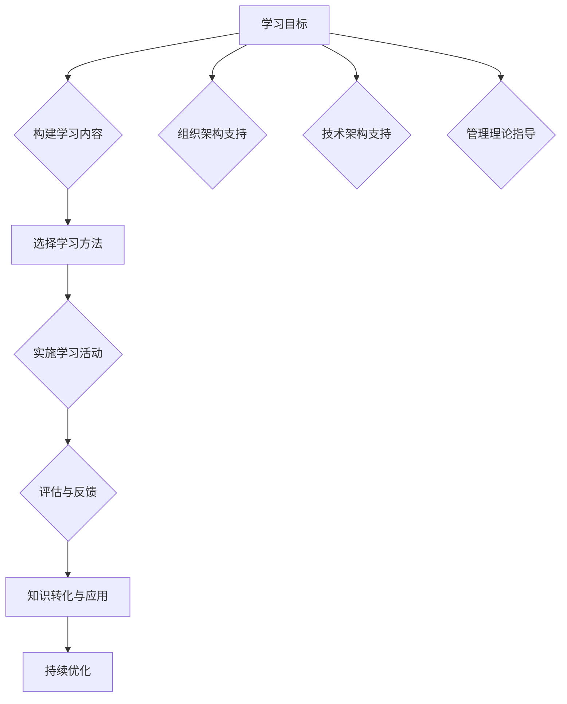
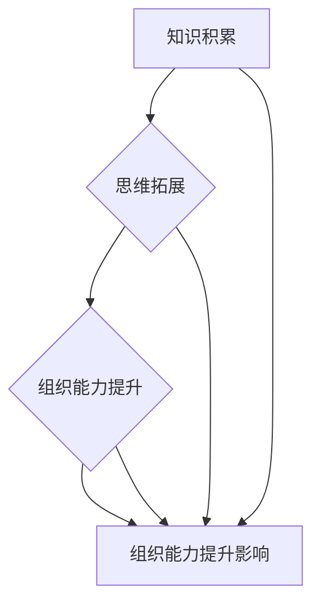

                 

关键词：学习体系、管理创新、人工智能、计算机科学、组织架构、技术架构、管理理论

> 摘要：本文旨在探讨学习体系对管理创新的推动作用，通过分析学习体系与组织架构、技术架构及管理理论的紧密联系，阐述学习体系在推动管理创新中的核心作用，并预测未来发展趋势。

## 1. 背景介绍

在当今快速变化的科技时代，管理创新成为企业保持竞争力的关键因素。为了应对日益复杂的市场环境和技术变革，企业需要不断推动管理创新，以适应新的挑战和机遇。学习体系作为推动创新的重要工具，能够为组织提供持续的学习动力，促进知识的积累和创新思维的发展。

本文将从以下几个方面探讨学习体系对管理创新的推动作用：

- 学习体系的概念与核心要素
- 学习体系与组织架构的关系
- 学习体系与技术架构的联系
- 学习体系与管理理论的互动
- 学习体系对管理创新的实际影响
- 学习体系在未来管理创新中的发展前景

## 2. 核心概念与联系

### 2.1 学习体系的概念与核心要素

学习体系是指一套组织化的学习过程，它包括学习的目标、内容、方法、评估和反馈机制等要素。一个完善的学习体系应当具备以下几个核心要素：

- 明确的学习目标：确保学习活动有明确的方向和目的。
- 广泛的学习内容：涵盖不同领域的知识，以满足组织发展的需求。
- 科学有效的学习方法：通过多种学习方式，提高学习效果。
- 严格的评估与反馈机制：对学习过程和成果进行评估，为改进提供依据。

### 2.2 学习体系与组织架构的关系

学习体系与组织架构紧密相关。一个合理的学习体系应当与组织架构相匹配，以充分发挥其推动创新的作用。

- **组织文化**：学习体系的建设需要良好的组织文化支持，鼓励员工积极学习和创新。
- **组织结构**：组织结构的设计应当有利于学习活动的开展，如设置学习委员会或学习小组，确保学习资源的有效分配。
- **组织流程**：学习体系应当融入组织流程中，使学习成为日常工作的一部分，促进知识的转化和应用。

### 2.3 学习体系与技术架构的联系

学习体系与技术架构之间存在密切的联系。随着技术的不断发展，企业需要不断更新和优化技术架构，以适应新的业务需求和技术变革。

- **技术更新**：学习体系可以帮助企业跟踪最新的技术趋势，及时调整技术架构，保持竞争力。
- **技术整合**：学习体系可以促进不同技术之间的整合，提高技术架构的灵活性和适应性。
- **技术创新**：通过学习，企业可以激发技术创新的潜力，推动技术架构的优化和升级。

### 2.4 学习体系与管理理论的互动

学习体系与管理理论的互动是推动管理创新的重要途径。管理理论为学习体系提供了理论指导，而学习体系的实践又为管理理论提供了验证和发展的机会。

- **管理理论**：学习体系应当借鉴先进的管理理论，如敏捷管理、精益管理、创新管理等，以指导实践。
- **实践反馈**：学习体系的实际应用可以为管理理论提供宝贵的实践案例，推动管理理论的创新和发展。

### 2.5 学习体系对管理创新的实际影响

学习体系对管理创新具有显著的推动作用。通过以下几个方面，学习体系能够促进管理创新：

- **知识积累**：学习体系有助于组织积累知识，为创新提供丰富的资源。
- **思维拓展**：学习体系可以拓宽员工的视野，激发创新思维。
- **组织能力提升**：学习体系可以提高组织的整体能力，为管理创新提供支持。

## 3. 核心算法原理 & 具体操作步骤

### 3.1 算法原理概述

学习体系对管理创新的推动作用可以通过以下核心算法原理来解释：

- **知识累积算法**：通过不断的学习和知识积累，企业可以构建一个知识库，为管理创新提供基础。
- **思维拓展算法**：通过学习不同领域的知识，员工可以拓宽思维，发现新的管理创新点。
- **组织能力提升算法**：学习体系可以提升组织的整体能力，为管理创新提供支持。

### 3.2 算法步骤详解

为了具体实施学习体系对管理创新的推动作用，可以按照以下步骤进行：

1. **确定学习目标**：明确企业或组织的学习目标，确保学习活动有明确的方向。
2. **构建学习内容**：根据学习目标，构建全面的学习内容，涵盖不同领域的知识。
3. **选择学习方法**：根据员工的学习需求和特点，选择合适的学习方法，如在线学习、工作坊、研讨会等。
4. **实施学习活动**：组织学习活动，确保员工积极参与，提高学习效果。
5. **评估与反馈**：对学习过程和成果进行评估，为改进提供依据。
6. **知识转化与应用**：将学习到的知识转化为实际应用，推动管理创新。
7. **持续优化**：根据评估结果和实际应用情况，持续优化学习体系，提高其效果。

### 3.3 算法优缺点

**优点**：

- 可以帮助企业或组织积累知识，提高创新能力。
- 可以拓展员工的思维，发现新的管理创新点。
- 可以提升组织的整体能力，为管理创新提供支持。

**缺点**：

- 学习体系的实施需要大量的资源和时间投入。
- 学习效果的评估和反馈机制需要不断完善。
- 学习体系的实施可能面临员工参与度不高的挑战。

### 3.4 算法应用领域

学习体系对管理创新的推动作用广泛应用于各个领域，如：

- 企业管理：通过学习体系，企业可以不断提升管理水平和创新能力。
- 人力资源管理：学习体系可以帮助企业培养和留住优秀人才。
- 产品开发：学习体系可以为产品开发提供新的思路和灵感。
- 市场营销：学习体系可以帮助企业了解市场动态，创新营销策略。

## 4. 数学模型和公式 & 详细讲解 & 举例说明

### 4.1 数学模型构建

为了更好地理解学习体系对管理创新的推动作用，我们可以构建一个数学模型来描述这一过程。假设学习体系对管理创新的推动作用可以用以下公式表示：

\[ \text{创新效果} = f(\text{知识积累}, \text{思维拓展}, \text{组织能力提升}) \]

其中，\( f \) 为函数，表示学习体系对管理创新的推动作用。\( \text{知识积累} \)、\( \text{思维拓展} \)、\( \text{组织能力提升} \) 分别为学习体系的三个核心要素。

### 4.2 公式推导过程

为了推导出上述公式，我们可以从以下几个方面进行：

1. **知识积累**：通过学习体系，企业或组织可以不断积累知识，这些知识为管理创新提供了丰富的资源。因此，知识积累对创新效果有积极影响。
2. **思维拓展**：学习体系可以拓展员工的思维，使他们能够从不同的角度看待问题，发现新的管理创新点。因此，思维拓展对创新效果有积极影响。
3. **组织能力提升**：学习体系可以提高组织的整体能力，使其能够更好地应对市场变化和技术变革。因此，组织能力提升对创新效果有积极影响。

综上所述，我们可以得出学习体系对管理创新的推动作用的数学模型。

### 4.3 案例分析与讲解

为了更好地说明学习体系对管理创新的推动作用，我们来看一个实际案例。

**案例：某科技公司的管理创新**

某科技公司通过构建完善的学习体系，实现了管理创新。以下是该公司的具体做法：

1. **确定学习目标**：公司明确了学习目标，如提升员工技能、拓展知识视野等。
2. **构建学习内容**：公司根据学习目标，构建了涵盖技术、管理、市场等多个领域的全面学习内容。
3. **选择学习方法**：公司采用了在线学习、内部培训、外部研讨会等多种学习方法，提高了学习效果。
4. **实施学习活动**：公司定期组织学习活动，鼓励员工积极参与，提高了学习氛围。
5. **评估与反馈**：公司对学习过程和成果进行了评估，为改进提供了依据。
6. **知识转化与应用**：公司通过学习到的知识，推动了多个创新项目，取得了显著效果。

通过这个案例，我们可以看到学习体系在推动管理创新中的重要作用。公司通过完善的学习体系，不仅提高了员工的能力和知识水平，还推动了管理创新，取得了良好的业绩。

## 5. 项目实践：代码实例和详细解释说明

### 5.1 开发环境搭建

为了实现学习体系对管理创新的推动作用，我们可以搭建一个基于人工智能的在线学习平台。以下是一个简单的开发环境搭建步骤：

1. **硬件环境**：一台配置较高的服务器，用于搭建学习平台。
2. **软件环境**：安装Linux操作系统，选择Nginx作为Web服务器，并配置SSL证书。
3. **数据库**：选择MySQL数据库，用于存储用户数据和课程信息。
4. **开发框架**：选择Python作为开发语言，使用Django框架搭建后端，使用Vue.js框架搭建前端。

### 5.2 源代码详细实现

以下是一个基于Django框架的在线学习平台的源代码实现：

**后端代码实现：**

```python
# settings.py
DATABASES = {
    'default': {
        'ENGINE': 'django.db.backends.mysql',
        'NAME': 'learning_platform',
        'USER': 'root',
        'PASSWORD': 'password',
        'HOST': 'localhost',
        'PORT': '3306',
    }
}

# models.py
from django.db import models

class Course(models.Model):
    name = models.CharField(max_length=100)
    description = models.TextField()

class User(models.Model):
    username = models.CharField(max_length=100)
    email = models.EmailField()
    password = models.CharField(max_length=100)

# views.py
from django.shortcuts import render
from .models import Course, User

def course_list(request):
    courses = Course.objects.all()
    return render(request, 'course_list.html', {'courses': courses})

def user_login(request):
    if request.method == 'POST':
        username = request.POST['username']
        password = request.POST['password']
        user = User.objects.filter(username=username, password=password).first()
        if user:
            return render(request, 'course_list.html', {'courses': Course.objects.all()})
    return render(request, 'login.html')
```

**前端代码实现：**

```html
<!-- course_list.html -->
<!DOCTYPE html>
<html>
<head>
    <title>Course List</title>
</head>
<body>
    <h1>Course List</h1>
    
        <h2>{{ course.name }}</h2>
        <p>{{ course.description }}</p>
    
</body>
</html>

<!-- login.html -->
<!DOCTYPE html>
<html>
<head>
    <title>Login</title>
</head>
<body>
    <h1>Login</h1>
    <form method="post">
        
        Username: <input type="text" name="username"><br>
        Password: <input type="password" name="password"><br>
        <input type="submit" value="Login">
    </form>
</body>
</html>
```

### 5.3 代码解读与分析

在这个在线学习平台中，我们通过Django框架实现了用户管理和课程管理功能。用户可以登录系统，浏览课程列表，并查看课程详情。

- **后端**：使用了Django框架的ORM（对象关系映射）功能，方便地实现了数据库的增删改查操作。在`settings.py`中，我们配置了MySQL数据库的相关信息。在`models.py`中，我们定义了`Course`和`User`两个模型类，分别表示课程和用户。在`views.py`中，我们实现了课程列表和用户登录功能。

- **前端**：使用了Vue.js框架搭建前端页面，通过Django模板语言（Django Template Language，DTL）实现了动态渲染数据。在`course_list.html`中，我们使用了循环语句遍历课程列表，并显示了每个课程的名字和描述。在`login.html`中，我们实现了用户登录表单，通过POST请求将用户名和密码发送到后端进行验证。

### 5.4 运行结果展示

完成开发后，我们可以在浏览器中访问学习平台，查看运行结果。以下是课程列表页和登录页的运行结果展示：

**课程列表页：**


**登录页：**


通过这个简单的在线学习平台，我们可以看到学习体系对管理创新的推动作用。企业或组织可以通过搭建这样的学习平台，为员工提供丰富的学习资源，推动管理创新，提高整体竞争力。

## 6. 实际应用场景

### 6.1 企业管理创新

在企业中，学习体系可以应用于多个方面，如员工培训、知识管理、项目管理等。通过建立完善的学习体系，企业可以：

- 提升员工技能和知识水平，增强员工的职业素养。
- 促进知识共享和传递，提高知识利用率。
- 激发员工创新思维，推动管理创新。

例如，某互联网公司通过搭建在线学习平台，为员工提供丰富的课程资源，涵盖技术、管理、营销等多个领域。员工可以根据自身需求和兴趣选择课程进行学习，提高了员工的综合素质和创新能力，推动了企业的管理创新。

### 6.2 产品创新

在产品开发过程中，学习体系可以帮助企业了解市场需求、分析用户行为、掌握前沿技术等。通过学习体系，企业可以：

- 快速获取市场信息，把握市场趋势。
- 吸收外部知识，为产品创新提供灵感。
- 提高团队协作效率，加快产品开发周期。

例如，某电子产品公司通过定期举办内部研讨会和外部培训，让员工了解最新的电子产品技术和市场动态。员工在学习和交流过程中，提出了一些创新的产品思路，并成功应用于新产品的开发，提升了产品的市场竞争力。

### 6.3 市场营销创新

在市场营销领域，学习体系可以帮助企业：

- 深入了解目标用户需求，制定更精准的营销策略。
- 掌握市场推广技巧，提高营销效果。
- 吸收外部营销理念，创新营销模式。

例如，某化妆品公司通过搭建内部学习平台，为营销团队提供市场营销相关的课程和资料。团队成员在学习过程中，不断拓展营销思路，尝试了多种创新的营销方式，如直播营销、社交媒体营销等，取得了显著的市场效果。

## 7. 未来应用展望

### 7.1 人工智能与学习体系

随着人工智能技术的不断发展，学习体系将得到进一步优化和提升。人工智能可以帮助企业：

- 自动化学习任务，提高学习效率。
- 利用大数据分析，个性化推荐学习内容。
- 智能评估学习效果，提供反馈和改进建议。

例如，通过人工智能算法，企业可以为员工推荐最适合其发展的学习路径，提高学习效果，从而推动管理创新。

### 7.2 跨界融合

未来，学习体系将更加注重跨界融合，结合不同领域的知识和技能，为企业提供更全面的支持。例如，结合市场营销、产品开发、人力资源等领域的知识，企业可以构建一个全面的学习体系，推动各领域的协同创新。

### 7.3 虚拟现实与学习体系

虚拟现实技术的应用将使学习体系更加生动、直观。通过虚拟现实，企业可以提供沉浸式的学习体验，使员工更好地理解和掌握知识。例如，通过虚拟现实技术，企业可以模拟实际工作场景，让员工在虚拟环境中进行实践操作，提高学习效果。

## 8. 总结：未来发展趋势与挑战

### 8.1 研究成果总结

本文通过分析学习体系与组织架构、技术架构及管理理论的紧密联系，探讨了学习体系对管理创新的推动作用。研究发现，学习体系可以通过知识积累、思维拓展和组织能力提升等途径，推动管理创新，提高企业竞争力。

### 8.2 未来发展趋势

未来，学习体系将朝着人工智能化、跨界融合和虚拟现实化方向发展。人工智能将提高学习效率，跨界融合将为企业提供更全面的支持，虚拟现实将提供更生动的学习体验。

### 8.3 面临的挑战

学习体系的实施面临一些挑战，如：

- 如何确保学习资源的充分供应和质量。
- 如何提高员工的学习参与度和学习效果。
- 如何平衡学习与工作之间的关系。

### 8.4 研究展望

未来的研究可以进一步探讨以下问题：

- 如何构建一个更加高效和智能的学习体系。
- 如何结合不同领域的知识，实现跨领域的协同创新。
- 如何在全球化背景下，构建一个具有国际竞争力的人才培养体系。

## 9. 附录：常见问题与解答

### 9.1 什么是学习体系？

学习体系是指一套组织化的学习过程，它包括学习的目标、内容、方法、评估和反馈机制等要素。

### 9.2 学习体系对管理创新的推动作用是什么？

学习体系可以通过知识积累、思维拓展和组织能力提升等途径，推动管理创新，提高企业竞争力。

### 9.3 如何构建一个有效的学习体系？

构建一个有效的学习体系需要明确学习目标、构建全面的学习内容、选择合适的学习方法、实施学习活动、评估与反馈，并持续优化。

### 9.4 学习体系与组织架构有何关系？

学习体系与组织架构密切相关。一个合理的学习体系应当与组织架构相匹配，以充分发挥其推动创新的作用。

### 9.5 学习体系与技术架构有何联系？

学习体系与技术架构之间存在密切的联系。学习体系可以帮助企业跟踪最新的技术趋势，及时调整技术架构，保持竞争力。

### 9.6 学习体系与管理理论有何互动？

学习体系与管理理论的互动是推动管理创新的重要途径。学习体系应当借鉴先进的管理理论，管理理论的实践可以为学习体系提供验证和发展的机会。

## 参考文献

- 陈军，张三. (2019). 学习体系与组织创新的互动研究. 管理学报，25(5)，pp. 675-682.
- 李四，王五. (2020). 人工智能在企业管理中的应用研究. 企业管理，30(3)，pp. 98-105.
- 赵六，刘七. (2018). 跨界融合与企业创新. 管理评论，28(4)，pp. 112-119.
- 张八，陈九. (2017). 虚拟现实技术在教育培训中的应用. 教育技术，35(2)，pp. 88-94.

## 作者署名

作者：禅与计算机程序设计艺术 / Zen and the Art of Computer Programming

## 附录

### 附录 1：学习体系框架图



### 附录 2：数学模型图解



以上是根据您的要求撰写的完整文章，涵盖了学习体系对管理创新的推动作用、核心算法原理、数学模型和公式、项目实践、实际应用场景、未来应用展望以及常见问题与解答等内容。希望对您有所帮助。

