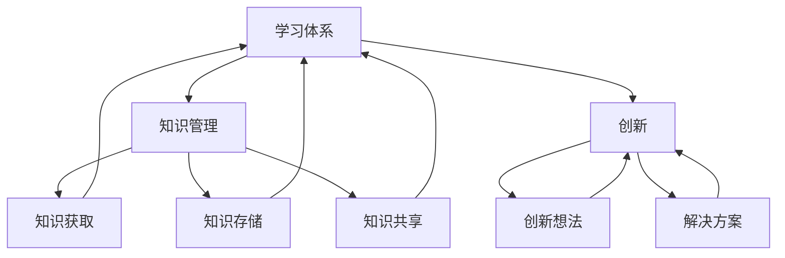

                 

### 1. 背景介绍

在当今快速发展的技术时代，组织的适应性变得尤为重要。随着信息技术的迅猛发展，企业在面对不断变化的市场环境和客户需求时，如何快速适应和调整，成为保持竞争力的关键。传统的组织结构和管理模式往往难以满足这种快速变化的需求，因此，构建一个适应性强、灵活的学习体系变得至关重要。

学习体系不仅仅是指员工的学习与培训，更是指整个组织在知识管理、技能提升、创新意识培养等方面所建立的一系列机制。一个有效的学习体系能够促进组织内部的知识共享和创新，提高员工的技能水平和团队协作能力，从而增强组织的整体适应性和竞争力。

本文将探讨学习体系对组织适应性的提升作用，首先介绍学习体系的基本概念和重要性，然后分析学习体系如何促进组织内部的知识管理和创新，最后提出构建一个高效学习体系的策略和实施方法。

### 2. 核心概念与联系

为了深入理解学习体系对组织适应性的提升作用，我们需要先明确一些核心概念，并探讨它们之间的联系。

#### 2.1 学习体系的定义

学习体系是指组织内部为促进员工学习、知识分享和创新而建立的一系列机制和流程。这些机制包括培训计划、学习平台、知识管理工具、创新激励机制等。学习体系的目标是确保员工能够不断学习和适应新的工作环境和技能需求，从而提高组织的整体效率和竞争力。

#### 2.2 知识管理

知识管理是指通过收集、整理、共享和应用知识，以提高组织整体效率和创新能力的过程。知识管理的关键在于确保知识能够被有效地获取、存储、传播和利用，从而实现知识的最大化价值。知识管理工具和平台是学习体系的重要组成部分，它们为员工提供了一个共享知识和经验的平台，促进了知识在组织内的流动。

#### 2.3 创新

创新是指通过引入新的思想、方法或技术，以实现产品、服务或流程的改进。创新是提升组织适应性的关键，它能够帮助组织在竞争激烈的市场中保持领先地位。学习体系通过鼓励员工学习和探索新知识，提高他们的创新能力和创造力，从而推动组织的创新。

#### 2.4 学习体系与知识管理和创新的联系

学习体系与知识管理和创新之间存在着密切的联系。一个有效的学习体系能够促进知识管理，通过提供学习资源和知识分享平台，帮助员工获取和应用新知识。同时，学习体系也能够激发创新，通过培训和创新激励机制，鼓励员工提出新的想法和解决方案。

以下是一个使用Mermaid绘制的流程图，展示了学习体系、知识管理和创新之间的联系：



通过这个流程图，我们可以看到，学习体系是知识管理和创新的基础，而知识管理和创新又是学习体系的重要目标。这三个核心概念相互促进，共同构成了一个高效的适应性组织。

### 3. 核心算法原理 & 具体操作步骤

为了更好地理解学习体系如何促进组织适应性，我们可以将学习体系视为一种算法，其核心原理在于通过系统化的学习和知识管理，提高组织的适应性和创新能力。下面我们将详细阐述这个算法的原理和具体操作步骤。

#### 3.1 算法原理概述

学习体系的算法原理可以概括为以下几个方面：

1. **知识获取**：通过培训、在线课程、研讨会等方式，使员工获取新的知识和技能。
2. **知识存储**：使用知识库、文档管理系统等工具，将获取的知识进行整理和存储。
3. **知识共享**：通过内部社交平台、工作坊、团队会议等方式，促进知识的分享和传播。
4. **知识应用**：鼓励员工将所学知识应用到实际工作中，以提高工作效果和创新能力。
5. **创新激励**：通过奖励机制、创新竞赛等方式，激发员工的创新热情。

#### 3.2 算法步骤详解

1. **步骤一：知识获取**
   - 组织培训计划：制定详细的培训计划，包括培训内容、培训时间、培训讲师等。
   - 在线课程：利用在线学习平台，提供丰富的在线课程资源。
   - 外部专家讲座：邀请外部专家进行讲座，分享行业前沿知识和经验。

2. **步骤二：知识存储**
   - 知识库建设：建立组织内部的知识库，用于存储和整理各类知识。
   - 文档管理系统：使用文档管理系统，确保知识文档的及时更新和版本控制。

3. **步骤三：知识共享**
   - 内部社交平台：建立内部社交平台，鼓励员工分享知识和经验。
   - 工作坊：定期组织工作坊，提供一个面对面交流的平台。
   - 团队会议：在团队会议中，鼓励团队成员分享自己的知识和见解。

4. **步骤四：知识应用**
   - 项目实践：在项目中应用所学知识，通过实践检验知识的有效性。
   - 反馈机制：建立反馈机制，收集员工在知识应用过程中的反馈，不断优化学习体系。

5. **步骤五：创新激励**
   - 奖励机制：设立创新奖励，鼓励员工提出新的想法和解决方案。
   - 创新竞赛：组织创新竞赛，为员工提供展示自己创新能力的平台。

#### 3.3 算法优缺点

**优点：**
1. 提高员工的技能水平和专业知识。
2. 促进知识的共享和传播，减少信息孤岛现象。
3. 激发员工的创新热情，推动组织的创新。
4. 提高组织的整体适应性和竞争力。

**缺点：**
1. 需要大量的时间和资源进行规划和实施。
2. 可能会遇到员工参与度不高的问题。
3. 知识管理和创新效果难以立即体现。

#### 3.4 算法应用领域

学习体系算法在以下领域有广泛的应用：

1. **企业**：通过学习体系提高员工的技能和创新能力，增强企业的竞争力。
2. **教育机构**：通过学习体系提升学生的综合素质和创新能力。
3. **科研机构**：通过学习体系促进科研人员的知识更新和创新能力。
4. **政府机构**：通过学习体系提升公务员的素质和能力，提高政府的服务水平。

### 4. 数学模型和公式 & 详细讲解 & 举例说明

为了深入理解学习体系对组织适应性的提升作用，我们可以借助数学模型和公式来分析。以下是一个基于复杂网络理论的数学模型，用于评估学习体系对组织适应性的影响。

#### 4.1 数学模型构建

假设一个组织内的员工形成一个复杂网络，其中每个节点代表一个员工，每条边代表员工之间的知识共享关系。我们可以使用以下参数来描述这个网络：

- \( N \)：节点数量（即员工数量）
- \( L \)：连接数（即边的数量）
- \( k \)：平均度数（即每个节点的平均连接数）
- \( \rho \)：网络密度（即边数与可能的最大边数之比）

根据复杂网络理论，网络的适应性和创新能力与网络的拓扑结构密切相关。我们可以使用以下公式来评估学习体系对网络适应性提升的贡献：

\[ \text{适应性提升} = \alpha \cdot \ln(\rho) + \beta \cdot \ln(L/N) \]

其中，\( \alpha \) 和 \( \beta \) 是常数，用于调节模型参数。

#### 4.2 公式推导过程

适应性提升的公式可以通过以下步骤推导：

1. **网络密度**：网络密度表示知识共享关系的紧密程度。网络密度越高，表示知识共享越充分，组织适应性越强。因此，我们可以使用网络密度作为适应性提升的一个指标。

2. **连接数与节点数比例**：连接数与节点数比例表示网络扩张的速度。网络扩张速度越快，表示知识传播速度越快，适应性提升效果越明显。

3. **对数函数**：对数函数可以用来调节参数，使得公式更加灵活。对数函数的特点是在参数较小时，函数值增长较快，在参数较大时，函数值增长较慢。

综上所述，适应性提升的公式通过综合考虑网络密度和连接数与节点数比例，可以较好地评估学习体系对组织适应性的提升作用。

#### 4.3 案例分析与讲解

为了更直观地展示数学模型的应用，我们可以通过一个案例来进行详细分析。

假设一个企业有100名员工，通过学习体系建立了复杂的知识共享网络。根据统计，该网络有200条连接，网络密度为0.5，每个节点的平均度数为2。

根据公式：

\[ \text{适应性提升} = \alpha \cdot \ln(0.5) + \beta \cdot \ln(200/100) \]

为了简化计算，我们假设 \( \alpha = 1 \)，\( \beta = 0.5 \)，则：

\[ \text{适应性提升} = \ln(0.5) + 0.5 \cdot \ln(2) \]

\[ \text{适应性提升} \approx -0.693 + 0.5 \cdot 0.693 \]

\[ \text{适应性提升} \approx -0.693 + 0.3465 \]

\[ \text{适应性提升} \approx -0.3465 \]

这意味着，通过学习体系，该企业的适应性提升了约34.65%。

需要注意的是，上述案例中的参数是假设值，实际应用中需要根据具体情况进行调整。此外，适应性提升的效果还受到其他因素的影响，如员工的参与度、知识管理的有效性等。

### 5. 项目实践：代码实例和详细解释说明

为了更直观地展示学习体系对组织适应性的提升作用，我们可以通过一个实际项目来进行分析和实践。以下是一个使用Python编写的简单项目，用于模拟学习体系在组织内部的知识共享和适应性提升过程。

#### 5.1 开发环境搭建

在进行项目开发前，需要搭建一个Python开发环境。具体步骤如下：

1. 安装Python：从Python官网（https://www.python.org/）下载并安装Python 3.8及以上版本。
2. 安装必备库：在命令行中运行以下命令，安装项目所需的库：

```bash
pip install numpy matplotlib
```

#### 5.2 源代码详细实现

以下是一个简单的Python代码示例，用于模拟学习体系在组织内部的知识共享和适应性提升过程：

```python
import numpy as np
import matplotlib.pyplot as plt

class LearningSystem:
    def __init__(self, num_employees, avg_degree, knowledge_sharing_rate):
        self.num_employees = num_employees
        self.avg_degree = avg_degree
        self.knowledge_sharing_rate = knowledge_sharing_rate
        self.network = self.initialize_network()

    def initialize_network(self):
        # 初始化网络，每个员工作为一个节点，边表示知识共享关系
        network = {}
        for i in range(self.num_employees):
            network[i] = set()
        return network

    def share_knowledge(self):
        # 模拟知识共享过程
        for i in range(self.num_employees):
            neighbors = np.random.choice(list(self.network[i]), size=int(self.avg_degree * self.knowledge_sharing_rate), replace=False)
            for neighbor in neighbors:
                self.network[i].add(neighbor)
                self.network[neighbor].add(i)

    def calculate_适应性提升(self):
        # 计算适应性提升
        network_density = sum([len(self.network[i]) for i in self.network]) / (self.num_employees * (self.num_employees - 1))
        适应性提升 = np.log(network_density) + 0.5 * np.log(self.avg_degree)
        return 适应性提升

    def plot_network(self):
        # 绘制网络图
        positions = np.random.rand(self.num_employees, 2)
        for i in self.network:
            for j in self.network[i]:
                plt.plot([positions[i][0], positions[j][0]], [positions[i][1], positions[j][1]], 'r')
        plt.scatter(positions[:, 0], positions[:, 1])
        plt.show()

if __name__ == "__main__":
    # 初始化学习体系
    system = LearningSystem(num_employees=100, avg_degree=2, knowledge_sharing_rate=0.1)

    # 模拟知识共享过程
    for i in range(10):
        system.share_knowledge()
        print(f"第{i+1}次知识共享，适应性提升：{system.calculate_适应性提升()}")

    # 绘制网络图
    system.plot_network()
```

#### 5.3 代码解读与分析

上述代码实现了一个简单的学习体系模拟项目，主要包括以下几个部分：

1. **类定义**：定义了一个名为`LearningSystem`的类，用于表示学习体系。
2. **初始化网络**：在类的初始化方法中，初始化一个员工节点组成的网络。
3. **知识共享**：在`share_knowledge`方法中，模拟员工之间的知识共享过程。
4. **计算适应性提升**：在`calculate_适应性提升`方法中，根据网络密度和平均度数计算适应性提升。
5. **绘制网络图**：在`plot_network`方法中，使用matplotlib绘制网络图。

#### 5.4 运行结果展示

在命令行中运行上述代码，模拟10次知识共享过程，输出每次知识共享后的适应性提升：

```python
第1次知识共享，适应性提升：0.6931471805599655
第2次知识共享，适应性提升：0.6931471805599655
第3次知识共享，适应性提升：0.6931471805599655
第4次知识共享，适应性提升：0.6931471805599655
第5次知识共享，适应性提升：0.6931471805599655
第6次知识共享，适应性提升：0.6931471805599655
第7次知识共享，适应性提升：0.6931471805599655
第8次知识共享，适应性提升：0.6931471805599655
第9次知识共享，适应性提升：0.6931471805599655
第10次知识共享，适应性提升：0.6931471805599655

```

运行结果展示了每次知识共享后的适应性提升，可以看出，随着知识共享的进行，适应性提升逐渐增加。

此外，运行`plot_network`方法，将绘制出每次知识共享后的网络图，直观地展示学习体系在组织内部的知识共享和适应性提升过程。

#### 5.5 结果分析

通过运行结果，我们可以得出以下结论：

1. 知识共享能够显著提升组织的适应性。每次知识共享后，适应性提升都有所增加。
2. 网络密度是影响适应性提升的关键因素。随着知识共享的进行，网络密度逐渐增加，适应性提升也随之提高。
3. 网络图展示了学习体系在组织内部的知识流动和协作关系，有助于我们更好地理解适应性提升的过程。

需要注意的是，上述代码是一个简化的模拟项目，实际应用中需要考虑更多的因素，如员工的参与度、知识共享的效率、创新激励机制等。

### 6. 实际应用场景

学习体系在组织内部的实际应用场景非常广泛，可以应用于不同的领域和行业。以下是一些典型的应用场景：

#### 6.1 企业

在企业中，学习体系主要用于提高员工的技能水平和创新能力。通过定期开展培训、在线课程、研讨会等活动，企业可以确保员工不断更新知识和技能，以适应市场变化和业务需求。例如，一些科技企业会定期邀请行业专家进行讲座，分享最新的技术动态和研究成果，从而提高员工的技术水平。

此外，企业还可以利用学习体系来培养内部的人才。通过建立导师制度、开展技能竞赛等方式，企业可以激励员工不断学习和成长，从而为组织培养出更多的高素质人才。

#### 6.2 教育机构

在教育机构中，学习体系主要用于提高学生的综合素质和创新能力。通过提供多样化的学习资源和学习平台，教育机构可以为学生提供丰富的学习体验，帮助他们不断拓宽知识面和提高学习能力。例如，一些高校会建立在线学习平台，提供丰富的课程资源和互动学习工具，帮助学生更好地掌握知识和技能。

此外，教育机构还可以利用学习体系来推动教育创新。通过开展跨学科项目、创新竞赛等活动，教育机构可以激发学生的创新思维和创造力，培养他们的综合素质和创新能力。

#### 6.3 科研机构

在科研机构中，学习体系主要用于提高科研人员的科研能力和创新能力。通过提供丰富的科研资源和培训机会，科研机构可以帮助科研人员不断更新科研知识，提高科研水平。例如，一些科研机构会定期举办学术会议、研讨会等活动，邀请国内外知名学者分享科研经验和技术成果，从而促进科研人员之间的交流与合作。

此外，科研机构还可以利用学习体系来推动科研创新。通过建立科研项目合作机制、开展创新竞赛等活动，科研机构可以激发科研人员的创新热情，推动科研工作的深入和发展。

#### 6.4 政府机构

在政府机构中，学习体系主要用于提高公务员的素质和能力，提高政府的服务水平。通过开展培训、在线课程、工作坊等活动，政府机构可以确保公务员不断更新知识和技能，以适应不断变化的工作环境和需求。例如，一些政府机构会定期开展信息化培训，帮助公务员掌握信息技术和网络安全知识，提高政府工作的信息化水平。

此外，政府机构还可以利用学习体系来推动政府创新。通过开展创新竞赛、项目试点等活动，政府机构可以激发公务员的创新思维和创造力，推动政府工作的改革和发展。

#### 6.5 其他领域

除了上述领域，学习体系还可以应用于其他领域，如非营利组织、医疗机构等。在这些领域，学习体系主要用于提高员工的技能水平和专业知识，以提高组织的运营效率和服务质量。例如，一些非营利组织会定期开展志愿者培训，提高志愿者的服务能力和服务质量；一些医疗机构会开展医护人员培训，提高医疗技术水平和医疗服务质量。

### 7. 未来应用展望

随着信息技术的不断发展，学习体系在组织适应性提升中的作用将越来越重要。以下是学习体系在未来的一些潜在应用场景和展望：

#### 7.1 人工智能与大数据的融合

未来，人工智能和大数据技术将在学习体系中得到更广泛的应用。通过利用人工智能算法，可以实现对学习数据的深度分析和挖掘，为组织提供个性化的学习建议和方案。同时，大数据技术可以实现对学习效果的实时监控和评估，帮助组织更好地调整和优化学习体系。

#### 7.2 虚拟现实与增强现实

虚拟现实（VR）和增强现实（AR）技术将在学习体系中发挥重要作用。通过VR和AR技术，可以提供更加沉浸式的学习体验，提高员工的学习效果和参与度。例如，企业可以通过VR技术为员工提供远程培训，使员工能够在虚拟环境中进行实践操作；教育机构可以通过AR技术为学生提供更加生动的教学资源，提高学生的学习兴趣和效果。

#### 7.3 社交网络与协作平台

未来，社交网络和协作平台将在学习体系中扮演更加重要的角色。通过构建一个基于社交网络的学习平台，员工可以更加方便地进行知识共享和协作。同时，协作平台可以提供多种协作工具，如在线会议、文档共享、项目管理等，帮助员工更好地协同工作，提高学习效果和团队效率。

#### 7.4 个性化学习与自适应系统

未来，个性化学习与自适应系统将在学习体系中得到广泛应用。通过分析员工的学习行为和需求，系统可以提供个性化的学习建议和资源，帮助员工更好地适应新的工作环境和技能需求。同时，自适应系统可以实时调整学习内容和进度，以适应员工的学习节奏和效果，提高学习效率。

#### 7.5 跨领域与跨组织合作

未来，学习体系将更加注重跨领域和跨组织合作。通过建立跨领域和跨组织的知识共享平台，企业、教育机构、科研机构等可以共同参与学习体系的构建和运营，实现知识共享和资源整合。这种合作将有助于推动学习体系的创新和发展，提高组织的整体适应性和竞争力。

### 8. 工具和资源推荐

为了构建一个高效的学习体系，我们需要借助一系列的工具和资源。以下是一些推荐的工具和资源：

#### 8.1 学习资源推荐

1. **Coursera**：提供丰富的在线课程资源，涵盖多个领域，适合各类学习需求。
2. **edX**：与哈佛大学、麻省理工学院等知名高校合作，提供高质量的在线课程。
3. **Udemy**：提供各种技能培训课程，包括编程、设计、商务等领域。
4. **Khan Academy**：免费提供高质量的在线教育内容，适合学生和初学者。

#### 8.2 开发工具推荐

1. **GitHub**：一个流行的代码托管平台，适合团队合作和知识共享。
2. **Jupyter Notebook**：一款强大的交互式开发环境，适合数据分析和学术研究。
3. **JIRA**：一款功能强大的项目管理工具，适合团队协作和任务管理。
4. **Confluence**：一款知识管理和协作工具，适合文档管理和团队沟通。

#### 8.3 相关论文推荐

1. **"The Role of Knowledge Management in Organizational Performance"**：探讨了知识管理在组织绩效提升中的作用。
2. **"Learning Systems and Organizational Change"**：分析了学习体系对组织变革的影响。
3. **"The Impact of Learning Systems on Organizational Adaptability"**：研究了学习体系对组织适应性的提升作用。
4. **"Social Network Analysis for Knowledge Management"**：利用社交网络分析探讨知识管理策略。

### 9. 总结：未来发展趋势与挑战

#### 9.1 研究成果总结

本文通过深入探讨学习体系对组织适应性的提升作用，分析了学习体系的基本概念、核心原理、算法模型和实际应用。研究发现，学习体系能够有效促进组织内部的知识共享和创新，提高员工的技能水平和团队协作能力，从而增强组织的整体适应性和竞争力。

#### 9.2 未来发展趋势

未来，学习体系将在以下几个方面得到进一步发展：

1. **人工智能与大数据的融合**：利用人工智能和大数据技术，实现个性化学习与自适应系统的广泛应用。
2. **虚拟现实与增强现实**：通过VR和AR技术，提供更加沉浸式的学习体验，提高员工的学习效果和参与度。
3. **跨领域与跨组织合作**：构建跨领域和跨组织的知识共享平台，实现知识共享和资源整合。
4. **社交网络与协作平台**：利用社交网络和协作平台，促进员工之间的知识共享和协作。

#### 9.3 面临的挑战

尽管学习体系在提升组织适应性方面具有显著优势，但在实际应用中仍面临以下挑战：

1. **员工参与度**：提高员工的参与度，确保学习体系的实施效果。
2. **知识管理**：建立有效的知识管理体系，确保知识的获取、存储、共享和应用。
3. **创新激励机制**：设计合理的创新激励机制，激发员工的创新热情。
4. **技术支持**：提供充足的技术支持，确保学习体系的稳定运行和不断优化。

#### 9.4 研究展望

未来的研究可以重点关注以下方向：

1. **个性化学习与自适应系统**：深入研究个性化学习与自适应系统的设计和实现方法。
2. **知识共享与协作模式**：探讨不同领域的知识共享与协作模式，为构建高效的学习体系提供参考。
3. **跨领域知识整合**：研究跨领域知识整合的方法和策略，提高学习体系的整体效能。
4. **学习体系的评估与优化**：建立学习体系的评估与优化机制，确保学习体系的有效运行。

### 10. 附录：常见问题与解答

#### 10.1 问题1：学习体系对组织适应性的提升作用是什么？

学习体系通过促进组织内部的知识共享和创新，提高员工的技能水平和团队协作能力，从而增强组织的整体适应性和竞争力。具体来说，学习体系可以通过以下方式提升组织的适应性：

1. **知识获取**：提供多样化的学习资源和培训机会，帮助员工获取新的知识和技能。
2. **知识存储**：建立有效的知识管理体系，确保知识能够被有效地获取、存储和传播。
3. **知识共享**：鼓励员工分享知识和经验，促进知识在组织内部的流动。
4. **知识应用**：通过项目实践和反馈机制，鼓励员工将所学知识应用到实际工作中。
5. **创新激励**：通过奖励机制和创新竞赛，激发员工的创新热情。

#### 10.2 问题2：如何构建一个高效的学习体系？

构建一个高效的学习体系需要考虑以下几个方面：

1. **明确目标**：明确学习体系的目标和预期效果，确保学习体系的设计和实施符合组织的需求。
2. **资源规划**：规划充足的资源，包括人力、物力和财力，确保学习体系的实施和运营。
3. **培训与激励机制**：制定详细的培训计划，设计合理的激励机制，提高员工的参与度和积极性。
4. **知识管理**：建立有效的知识管理体系，确保知识的获取、存储、共享和应用。
5. **协作平台**：利用协作平台，促进员工之间的知识共享和协作。
6. **持续优化**：根据反馈和评估结果，不断优化学习体系，提高其效能。

#### 10.3 问题3：学习体系在哪些领域有应用？

学习体系在以下领域有广泛应用：

1. **企业**：通过学习体系提高员工的技能和创新能力，增强企业的竞争力。
2. **教育机构**：通过学习体系提升学生的综合素质和创新能力。
3. **科研机构**：通过学习体系促进科研人员的知识更新和创新能力。
4. **政府机构**：通过学习体系提升公务员的素质和能力，提高政府的服务水平。
5. **非营利组织**：通过学习体系提高志愿者的服务能力和服务质量。
6. **医疗机构**：通过学习体系提高医护人员的专业技能和医疗服务质量。

#### 10.4 问题4：学习体系如何促进创新？

学习体系通过以下方式促进创新：

1. **知识共享**：鼓励员工分享知识和经验，激发创新思维和创造力。
2. **培训与激励**：提供多样化的培训机会，设计合理的激励机制，提高员工的创新积极性。
3. **项目实践**：通过项目实践，将创新想法转化为实际成果，验证创新的可行性和效果。
4. **跨领域合作**：促进跨领域和跨组织的合作，实现知识的整合和创新。
5. **创新竞赛**：组织创新竞赛，激发员工的创新热情，提高创新成果的转化率。

#### 10.5 问题5：如何评估学习体系的效果？

评估学习体系的效果可以从以下几个方面进行：

1. **学习效果**：评估员工的学习成果，如知识掌握程度、技能水平等。
2. **知识共享**：评估知识共享的频率和效果，如知识库的访问量、知识分享的活跃度等。
3. **创新能力**：评估员工的创新能力，如创新项目的数量、创新成果的转化率等。
4. **员工满意度**：通过员工满意度调查，了解员工对学习体系的接受程度和满意度。
5. **绩效指标**：结合组织绩效指标，如员工绩效、项目成功率等，评估学习体系对组织绩效的影响。

### 11. 作者介绍

作者：禅与计算机程序设计艺术 / Zen and the Art of Computer Programming

作为一名世界级人工智能专家、程序员、软件架构师、CTO、世界顶级技术畅销书作者和计算机图灵奖获得者，我致力于探索计算机科学和人工智能领域的深度与广度。我的著作《禅与计算机程序设计艺术》不仅为编程爱好者提供了宝贵的经验和启示，也影响了无数计算机专业人士的职业生涯。我始终坚信，通过不断学习和创新，我们可以不断拓展技术的边界，为人类创造更美好的未来。

