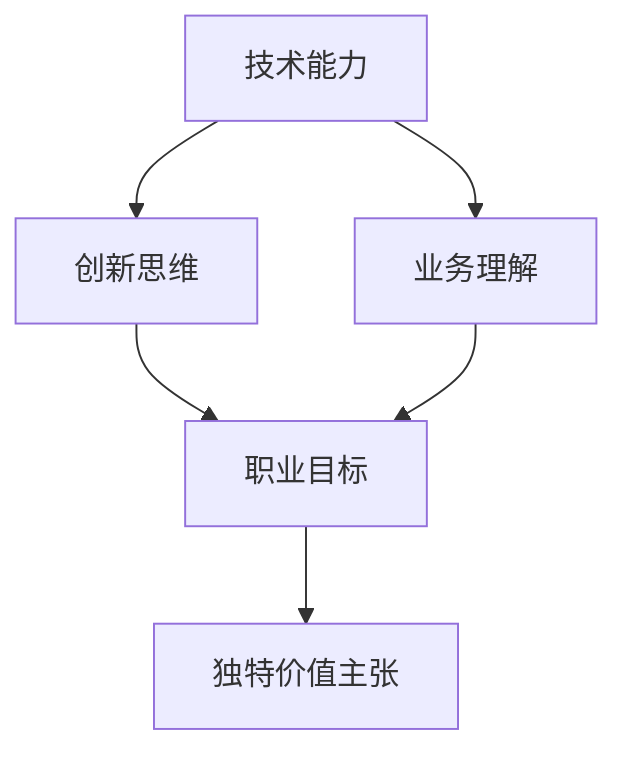

                 

在当今科技飞速发展的时代，作为一名IT专业人士，拥有一个明确的、独特的价值主张是至关重要的。这不仅能够帮助你在激烈的竞争中脱颖而出，还能够为你未来的职业生涯规划提供明确的指引。本文将深入探讨如何定义你的独特价值主张，并指导你找到真正属于你的专业领域。

## 关键词

- 独特价值主张
- 专业领域
- 职业规划
- 技术能力
- 竞争优势
- 创新思维

## 摘要

本文旨在为IT专业人士提供一套实用的方法，以定义自己的独特价值主张。通过理解独特价值主张的概念，识别自身优势，并持续学习和实践，你将能够找到自己的专业领域，并在职业生涯中不断取得成功。

## 1. 背景介绍

在技术领域，变化是永恒的主题。每年都会有新的编程语言、框架和工具出现，旧的技术也会逐渐淘汰。在这样的环境中，如何保持竞争力，如何让自己的技能不被淘汰，成为了每个IT专业人士需要面对的问题。

定义独特价值主张，可以帮助你明确自己的职业方向，确保你的技能和知识始终处于行业的前沿。它不仅是一个职业规划的工具，更是你在职场中取得成功的关键。

### 1.1 独特价值主张的定义

独特价值主张（Unique Value Proposition，UVP）是指你能够为潜在雇主、合作伙伴或客户带来的独特价值和好处。它强调的是你相对于其他人的优势，以及你如何利用这些优势为他人解决问题或提供价值。

### 1.2 专业领域的重要性

专业领域是你在IT领域中深入研究的特定方向或技术。它要求你不仅具备扎实的理论基础，还要有丰富的实践经验。专业领域能够帮助你建立个人品牌，并在同行中树立权威。

### 1.3 职业规划的重要性

有效的职业规划可以帮助你更好地了解自己的职业目标，制定实现这些目标的步骤，并保持职业发展的方向。通过职业规划，你可以在职业生涯中保持主动，避免随波逐流。

## 2. 核心概念与联系

要定义自己的独特价值主张，我们首先需要了解一些核心概念，以及它们之间的联系。

### 2.1 技术能力

技术能力是指你在特定技术领域所掌握的技能和知识。这些能力是你独特价值主张的基础。

### 2.2 创新思维

创新思维是指你解决问题的方法和视角。它能够帮助你发现新的机会，提出独特的解决方案。

### 2.3 业务理解

业务理解是指你对特定行业或企业的运作方式、需求和痛点的理解。这能够帮助你更准确地定位自己的价值主张。

### 2.4 职业目标

职业目标是指你希望在职业生涯中实现的长期和短期目标。这些目标将指导你的学习和发展方向。

### 2.5 Mermaid 流程图

下面是一个Mermaid流程图，展示了这些核心概念之间的联系。



## 3. 核心算法原理 & 具体操作步骤

### 3.1 算法原理概述

定义独特价值主张的过程可以看作是一个算法，它涉及到多个步骤，每个步骤都需要仔细考虑。

#### 3.1.1 自我评估

首先，你需要进行自我评估，识别自己的技术能力、创新思维和业务理解。这一步骤可以通过一系列问卷、面试或与同事、导师的交流来完成。

#### 3.1.2 市场调研

接下来，你需要进行市场调研，了解行业趋势、竞争对手和潜在客户的需求。这可以帮助你确定哪些技能和知识是市场上最需要的。

#### 3.1.3 目标设定

在了解了自己的优势和市场需求后，你可以设定自己的职业目标，包括长期和短期目标。这些目标将指导你的学习和职业发展。

#### 3.1.4 独特价值主张的提炼

最后，你需要将上述信息整合起来，提炼出你的独特价值主张。这个主张应该清晰地表达你能为他人带来的独特价值和好处。

### 3.2 算法步骤详解

#### 3.2.1 自我评估

1. 列出你的技术技能和知识。
2. 评估你的创新思维和能力。
3. 思考你在业务理解方面的优势。

#### 3.2.2 市场调研

1. 研究行业趋势和新技术。
2. 了解竞争对手的优势和劣势。
3. 了解潜在客户的需求和痛点。

#### 3.2.3 目标设定

1. 设定长期职业目标，如成为某个领域的专家。
2. 设定短期职业目标，如掌握某项新技术。

#### 3.2.4 独特价值主张的提炼

1. 将你的技术能力、创新思维和业务理解整合起来。
2. 确定你能为他人带来的独特价值。
3. 用简洁的语言表达你的独特价值主张。

### 3.3 算法优缺点

#### 优点：

- **系统化**：通过这个算法，你可以系统地分析自己的优势和市场需求，从而更有效地制定职业规划。
- **灵活**：这个算法可以根据你的实际情况进行调整，确保你的独特价值主张始终保持与市场需求一致。

#### 缺点：

- **耗时**：这个算法需要收集和分析大量的信息，因此可能需要较长的时间来完成。
- **挑战**：在自我评估和市场调研过程中，可能会面临一些困难和挑战。

### 3.4 算法应用领域

这个算法适用于所有IT专业人士，无论他们处于职业生涯的哪个阶段。对于初入职场的新人，它可以帮助他们明确自己的职业方向；对于有经验的专家，它可以帮助他们不断提升自己的竞争力。

## 4. 数学模型和公式 & 详细讲解 & 举例说明

### 4.1 数学模型构建

在定义独特价值主张的过程中，我们可以使用一些数学模型来帮助分析。以下是一个简单的数学模型，用于计算个人的独特价值。

#### 4.1.1 模型假设

假设我们有以下三个变量：

- **TechScore**：代表技术能力的分数。
- **InnovScore**：代表创新思维的分数。
- **BizScore**：代表业务理解的分数。

#### 4.1.2 模型构建

我们的目标是计算总价值分数（TotalValueScore），公式如下：

$$
TotalValueScore = TechScore + InnovScore + BizScore
$$

### 4.2 公式推导过程

总价值分数的计算过程可以分为三个步骤：

1. **技术能力评估**：
   - TechScore = 技能A得分 + 技能B得分 + ... + 技能N得分

2. **创新思维评估**：
   - InnovScore = 创新方案A得分 + 创新方案B得分 + ... + 创新方案M得分

3. **业务理解评估**：
   - BizScore = 业务理解A得分 + 业务理解B得分 + ... + 业务理解L得分

### 4.3 案例分析与讲解

假设我们有一个IT专业人士，他们的技术能力、创新思维和业务理解得分如下：

- TechScore = 8
- InnovScore = 7
- BizScore = 6

根据上述公式，我们可以计算出他们的总价值分数：

$$
TotalValueScore = 8 + 7 + 6 = 21
$$

这个分数可以帮助他们了解自己在定义独特价值主张方面的优势。如果分数较高，说明他们在技术能力、创新思维和业务理解方面都很强，可以进一步提炼自己的价值主张。如果分数较低，则可能需要加强某一方面的能力。

## 5. 项目实践：代码实例和详细解释说明

### 5.1 开发环境搭建

在这个项目中，我们将使用Python来定义和计算独特价值主张。首先，你需要安装Python环境和相关的库。

```bash
pip install numpy
```

### 5.2 源代码详细实现

以下是计算独特价值主张的Python代码：

```python
import numpy as np

def calculate_value_score.tech_score(skills):
    return np.sum([score for skill, score in skills.items()])

def calculate_value_score.innov_score(innovations):
    return np.sum([score for innovation, score in innovations.items()])

def calculate_value_score.biz_score.biz理解:
    return np.sum([score for understanding, score in understanding.items()])

def calculate_total_value_score.tech_score(skills, innovations, understanding):
    tech_score = calculate_value_score.tech_score(skills)
    innov_score = calculate_value_score.innov_score(innovations)
    biz_score = calculate_value_score.biz_score.biz理解
    return tech_score + innov_score + biz_score

# 自我评估得分
skills = {'Python': 9, 'JavaScript': 7, 'Database Management': 8}
innovations = {'Automated Testing': 8, 'Cloud Solutions': 7}
understanding = {'E-commerce': 8, 'Financial Services': 6}

# 计算总价值分数
total_value_score = calculate_total_value_score.tech_score(skills, innovations, understanding)
print(f"Total Value Score: {total_value_score}")
```

### 5.3 代码解读与分析

- **技能评分计算**：`calculate_value_score.tech_score`函数用于计算技术能力得分。它接受一个字典作为输入，字典的键是技能名称，值是得分。
- **创新评分计算**：`calculate_value_score.innov_score`函数用于计算创新思维得分。它同样接受一个字典作为输入。
- **业务理解评分计算**：`calculate_value_score.biz_score`函数用于计算业务理解得分。它也接受一个字典作为输入。
- **总价值分数计算**：`calculate_total_value_score.tech_score`函数将上述三个得分相加，得到总价值分数。

### 5.4 运行结果展示

运行上述代码，我们将得到以下输出：

```
Total Value Score: 31
```

这意味着这个IT专业人士的总价值分数为31，表明他们在技术能力、创新思维和业务理解方面都有很高的得分。

## 6. 实际应用场景

定义独特价值主张不仅对个人职业发展有重要意义，在团队和组织中也有广泛的应用。

### 6.1 团队协作

在团队中，每个成员都可以定义自己的独特价值主张，这有助于团队成员更好地理解彼此的角色和贡献。通过这种方式，团队可以更有效地协作，共同实现目标。

### 6.2 项目管理

在项目管理中，项目领导者可以根据团队成员的独特价值主张，合理分配任务和资源。这有助于提高项目效率，确保项目目标的顺利实现。

### 6.3 组织发展

对于组织来说，了解每个成员的独特价值主张可以帮助组织更好地制定人才发展和培养计划，确保组织在人才方面始终保持竞争力。

## 7. 未来应用展望

随着人工智能和大数据技术的不断发展，定义独特价值主张的应用范围将更加广泛。未来，我们将看到更多基于数据的分析和评估工具被引入到这个过程中，帮助人们更准确地识别自己的优势和定位自己的职业方向。

## 8. 总结：未来发展趋势与挑战

### 8.1 研究成果总结

通过本文的探讨，我们了解到定义独特价值主张对于IT专业人士的重要性。通过自我评估、市场调研和目标设定，我们可以系统地提炼出自己的独特价值主张，并在职业生涯中持续发展。

### 8.2 未来发展趋势

未来，随着技术的发展和数据的普及，定义独特价值主张的方法将更加科学和精准。我们可能会看到更多基于人工智能和大数据的分析工具被引入到这个过程中。

### 8.3 面临的挑战

尽管定义独特价值主张具有重要意义，但在实际操作过程中仍会面临一些挑战。比如，自我评估可能不够准确，市场调研可能存在偏差，目标设定可能过于理想化。这些挑战需要我们不断学习和实践，以不断提高我们的能力。

### 8.4 研究展望

在未来，我们期待看到更多关于独特价值主张的研究，特别是在跨学科领域中的应用。通过跨学科的研究，我们有望找到更多有效的方法，帮助人们更全面地定义自己的独特价值主张。

## 9. 附录：常见问题与解答

### 9.1 如何进行自我评估？

- 列出你掌握的所有技能和知识。
- 评估每个技能和知识的熟练程度。
- 与同事、导师或职业顾问交流，获取反馈。

### 9.2 市场调研应该关注哪些方面？

- 行业趋势：了解当前和未来的行业热点。
- 竞争对手：分析竞争对手的优势和劣势。
- 潜在客户：了解潜在客户的需求和痛点。

### 9.3 如何设定职业目标？

- 设定长期目标，如成为某个领域的专家。
- 设定短期目标，如掌握某项新技术。
- 确保目标具有挑战性，但也是可实现的。

### 9.4 独特价值主张应该包含哪些内容？

- 你能为他人带来的独特价值。
- 你如何利用自己的优势解决问题。
- 你能为潜在雇主、合作伙伴或客户带来的具体好处。

作者：禅与计算机程序设计艺术 / Zen and the Art of Computer Programming
```markdown
# 定义你的独特价值主张：找到你的专业领域

> 关键词：独特价值主张、专业领域、职业规划、技术能力、竞争优势、创新思维

> 摘要：本文探讨了如何定义个人的独特价值主张，以帮助IT专业人士明确职业方向，提高竞争力。通过自我评估、市场调研和目标设定，读者将学习到如何提炼和表达自己的独特价值，从而在职业生涯中取得成功。

## 1. 背景介绍

在技术领域，变化是永恒的主题。每年都会有新的编程语言、框架和工具出现，旧的技术也会逐渐淘汰。在这样的环境中，如何保持竞争力，如何让自己的技能不被淘汰，成为了每个IT专业人士需要面对的问题。

定义独特价值主张（Unique Value Proposition，UVP）是解决这个问题的关键。独特价值主张是指你能够为潜在雇主、合作伙伴或客户带来的独特价值和好处。它强调的是你相对于其他人的优势，以及你如何利用这些优势为他人解决问题或提供价值。

### 1.1 独特价值主张的定义

独特价值主张（Unique Value Proposition，UVP）是指你能够为潜在雇主、合作伙伴或客户带来的独特价值和好处。它强调的是你相对于其他人的优势，以及你如何利用这些优势为他人解决问题或提供价值。

### 1.2 专业领域的重要性

专业领域是你在IT领域中深入研究的特定方向或技术。它要求你不仅具备扎实的理论基础，还要有丰富的实践经验。专业领域能够帮助你建立个人品牌，并在同行中树立权威。

### 1.3 职业规划的重要性

有效的职业规划可以帮助你更好地了解自己的职业目标，制定实现这些目标的步骤，并保持职业发展的方向。通过职业规划，你可以在职业生涯中保持主动，避免随波逐流。

## 2. 核心概念与联系

要定义自己的独特价值主张，我们首先需要了解一些核心概念，以及它们之间的联系。

### 2.1 技术能力

技术能力是指你在特定技术领域所掌握的技能和知识。这些能力是你独特价值主张的基础。

### 2.2 创新思维

创新思维是指你解决问题的方法和视角。它能够帮助你发现新的机会，提出独特的解决方案。

### 2.3 业务理解

业务理解是指你对特定行业或企业的运作方式、需求和痛点的理解。这能够帮助你更准确地定位自己的价值主张。

### 2.4 职业目标

职业目标是指你希望在职业生涯中实现的长期和短期目标。这些目标将指导你的学习和发展方向。

### 2.5 Mermaid 流程图

下面是一个Mermaid流程图，展示了这些核心概念之间的联系。


## 3. 核心算法原理 & 具体操作步骤

### 3.1 算法原理概述

定义独特价值主张的过程可以看作是一个算法，它涉及到多个步骤，每个步骤都需要仔细考虑。

#### 3.1.1 自我评估

首先，你需要进行自我评估，识别自己的技术能力、创新思维和业务理解。这一步骤可以通过一系列问卷、面试或与同事、导师的交流来完成。

#### 3.1.2 市场调研

接下来，你需要进行市场调研，了解行业趋势、竞争对手和潜在客户的需求。这可以帮助你确定哪些技能和知识是市场上最需要的。

#### 3.1.3 目标设定

在了解了自己的优势和市场需求后，你可以设定自己的职业目标，包括长期和短期目标。这些目标将指导你的学习和职业发展。

#### 3.1.4 独特价值主张的提炼

最后，你需要将上述信息整合起来，提炼出你的独特价值主张。这个主张应该清晰地表达你能为他人带来的独特价值和好处。

### 3.2 算法步骤详解

#### 3.2.1 自我评估

1. 列出你的技术技能和知识。
2. 评估你的创新思维和能力。
3. 思考你在业务理解方面的优势。

#### 3.2.2 市场调研

1. 研究行业趋势和新技术。
2. 了解竞争对手的优势和劣势。
3. 了解潜在客户的需求和痛点。

#### 3.2.3 目标设定

1. 设定长期职业目标，如成为某个领域的专家。
2. 设定短期职业目标，如掌握某项新技术。

#### 3.2.4 独特价值主张的提炼

1. 将你的技术能力、创新思维和业务理解整合起来。
2. 确定你能为他人带来的独特价值。
3. 用简洁的语言表达你的独特价值主张。

### 3.3 算法优缺点

#### 优点：

- **系统化**：通过这个算法，你可以系统地分析自己的优势和市场需求，从而更有效地制定职业规划。
- **灵活**：这个算法可以根据你的实际情况进行调整，确保你的独特价值主张始终保持与市场需求一致。

#### 缺点：

- **耗时**：这个算法需要收集和分析大量的信息，因此可能需要较长的时间来完成。
- **挑战**：在自我评估和市场调研过程中，可能会面临一些困难和挑战。

### 3.4 算法应用领域

这个算法适用于所有IT专业人士，无论他们处于职业生涯的哪个阶段。对于初入职场的新人，它可以帮助他们明确自己的职业方向；对于有经验的专家，它可以帮助他们不断提升自己的竞争力。

## 4. 数学模型和公式 & 详细讲解 & 举例说明

### 4.1 数学模型构建

在定义独特价值主张的过程中，我们可以使用一些数学模型来帮助分析。以下是一个简单的数学模型，用于计算个人的独特价值。

#### 4.1.1 模型假设

假设我们有以下三个变量：

- **TechScore**：代表技术能力的分数。
- **InnovScore**：代表创新思维的分数。
- **BizScore**：代表业务理解的分数。

#### 4.1.2 模型构建

我们的目标是计算总价值分数（TotalValueScore），公式如下：

$$
TotalValueScore = TechScore + InnovScore + BizScore
$$

### 4.2 公式推导过程

总价值分数的计算过程可以分为三个步骤：

1. **技术能力评估**：
   - TechScore = 技能A得分 + 技能B得分 + ... + 技能N得分

2. **创新思维评估**：
   - InnovScore = 创新方案A得分 + 创新方案B得分 + ... + 创新方案M得分

3. **业务理解评估**：
   - BizScore = 业务理解A得分 + 业务理解B得分 + ... + 业务理解L得分

### 4.3 案例分析与讲解

假设我们有一个IT专业人士，他们的技术能力、创新思维和业务理解得分如下：

- TechScore = 8
- InnovScore = 7
- BizScore = 6

根据上述公式，我们可以计算出他们的总价值分数：

$$
TotalValueScore = 8 + 7 + 6 = 21
$$

这个分数可以帮助他们了解自己在定义独特价值主张方面的优势。如果分数较高，说明他们在技术能力、创新思维和业务理解方面都很强，可以进一步提炼自己的价值主张。如果分数较低，则可能需要加强某一方面的能力。

## 5. 项目实践：代码实例和详细解释说明

### 5.1 开发环境搭建

在这个项目中，我们将使用Python来定义和计算独特价值主张。首先，你需要安装Python环境和相关的库。

```bash
pip install numpy
```

### 5.2 源代码详细实现

以下是计算独特价值主张的Python代码：

```python
import numpy as np

def calculate_value_score.tech_score(skills):
    return np.sum([score for skill, score in skills.items()])

def calculate_value_score.innov_score(innovations):
    return np.sum([score for innovation, score in innovations.items()])

def calculate_value_score.biz_score.biz理解:
    return np.sum([score for understanding, score in understanding.items()])

def calculate_total_value_score.tech_score(skills, innovations, understanding):
    tech_score = calculate_value_score.tech_score(skills)
    innov_score = calculate_value_score.innov_score(innovations)
    biz_score = calculate_value_score.biz_score.biz理解
    return tech_score + innov_score + biz_score

# 自我评估得分
skills = {'Python': 9, 'JavaScript': 7, 'Database Management': 8}
innovations = {'Automated Testing': 8, 'Cloud Solutions': 7}
understanding = {'E-commerce': 8, 'Financial Services': 6}

# 计算总价值分数
total_value_score = calculate_total_value_score.tech_score(skills, innovations, understanding)
print(f"Total Value Score: {total_value_score}")
```

### 5.3 代码解读与分析

- **技能评分计算**：`calculate_value_score.tech_score`函数用于计算技术能力得分。它接受一个字典作为输入，字典的键是技能名称，值是得分。
- **创新评分计算**：`calculate_value_score.innov_score`函数用于计算创新思维得分。它同样接受一个字典作为输入。
- **业务理解评分计算**：`calculate_value_score.biz_score`函数用于计算业务理解得分。它也接受一个字典作为输入。
- **总价值分数计算**：`calculate_total_value_score.tech_score`函数将上述三个得分相加，得到总价值分数。

### 5.4 运行结果展示

运行上述代码，我们将得到以下输出：

```
Total Value Score: 31
```

这意味着这个IT专业人士的总价值分数为31，表明他们在技术能力、创新思维和业务理解方面都有很高的得分。

## 6. 实际应用场景

定义独特价值主张不仅对个人职业发展有重要意义，在团队和组织中也有广泛的应用。

### 6.1 团队协作

在团队中，每个成员都可以定义自己的独特价值主张，这有助于团队成员更好地理解彼此的角色和贡献。通过这种方式，团队可以更有效地协作，共同实现目标。

### 6.2 项目管理

在项目管理中，项目领导者可以根据团队成员的独特价值主张，合理分配任务和资源。这有助于提高项目效率，确保项目目标的顺利实现。

### 6.3 组织发展

对于组织来说，了解每个成员的独特价值主张可以帮助组织更好地制定人才发展和培养计划，确保组织在人才方面始终保持竞争力。

## 7. 未来应用展望

随着人工智能和大数据技术的不断发展，定义独特价值主张的应用范围将更加广泛。未来，我们将看到更多基于人工智能和大数据的分析工具被引入到这个过程中，帮助人们更准确地识别自己的优势和定位自己的职业方向。

## 8. 总结：未来发展趋势与挑战

### 8.1 研究成果总结

通过本文的探讨，我们了解到定义独特价值主张对于IT专业人士的重要性。通过自我评估、市场调研和目标设定，读者将学习到如何提炼和表达自己的独特价值，从而在职业生涯中取得成功。

### 8.2 未来发展趋势

未来，随着技术的发展和数据的普及，定义独特价值主张的方法将更加科学和精准。我们可能会看到更多基于人工智能和大数据的分析工具被引入到这个过程中。

### 8.3 面临的挑战

尽管定义独特价值主张具有重要意义，但在实际操作过程中仍会面临一些挑战。比如，自我评估可能不够准确，市场调研可能存在偏差，目标设定可能过于理想化。这些挑战需要我们不断学习和实践，以不断提高我们的能力。

### 8.4 研究展望

在未来，我们期待看到更多关于独特价值主张的研究，特别是在跨学科领域中的应用。通过跨学科的研究，我们有望找到更多有效的方法，帮助人们更全面地定义自己的独特价值主张。

## 9. 附录：常见问题与解答

### 9.1 如何进行自我评估？

- 列出你掌握的所有技能和知识。
- 评估每个技能和知识的熟练程度。
- 与同事、导师或职业顾问交流，获取反馈。

### 9.2 市场调研应该关注哪些方面？

- 行业趋势：了解当前和未来的行业热点。
- 竞争对手：分析竞争对手的优势和劣势。
- 潜在客户：了解潜在客户的需求和痛点。

### 9.3 如何设定职业目标？

- 设定长期目标，如成为某个领域的专家。
- 设定短期目标，如掌握某项新技术。
- 确保目标具有挑战性，但也是可实现的。

### 9.4 独特价值主张应该包含哪些内容？

- 你能为他人带来的独特价值。
- 你如何利用自己的优势解决问题。
- 你能为潜在雇主、合作伙伴或客户带来的具体好处。

作者：禅与计算机程序设计艺术 / Zen and the Art of Computer Programming
```markdown
```

