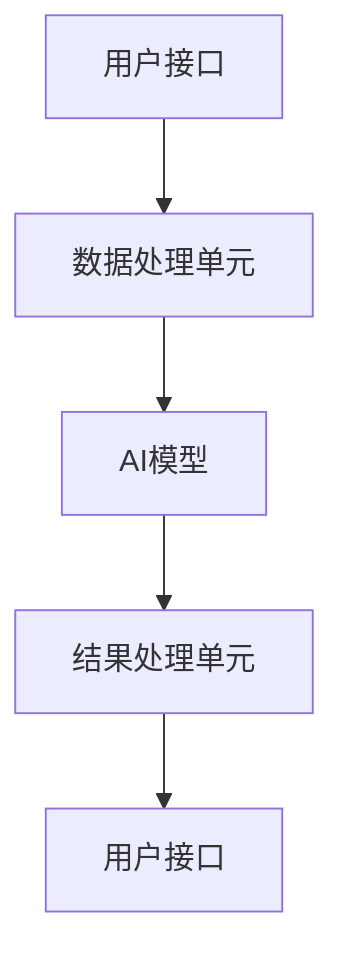

                 

关键词：实时AI交互、低延迟响应、LLM、技术架构、算法优化、数学模型、应用场景、未来展望

> 摘要：本文探讨了实时AI交互中的关键技术——低延迟响应技术，特别是针对大型语言模型（LLM）的处理。通过分析LLM的低延迟响应的挑战和机遇，本文提出了具体的技术方案和算法优化策略，以实现高效、准确的实时AI交互。

## 1. 背景介绍

随着人工智能技术的快速发展，人工智能（AI）与人类的交互变得越来越紧密。实时AI交互技术正逐步成为人工智能应用的核心，从智能助手、在线客服到智能教育、智能家居，实时AI交互的应用场景越来越广泛。在实时AI交互中，用户的体验很大程度上取决于AI系统的响应速度，即低延迟响应技术的重要性日益凸显。

低延迟响应技术是指系统在接收到用户请求后，能够在极短的时间内给出回应的技术。在实时AI交互中，低延迟响应不仅能够提高用户的满意度，还能增强AI系统的交互效果和决策能力。然而，随着AI模型规模和复杂度的增加，实现低延迟响应面临着诸多挑战。

本文主要研究大型语言模型（LLM）在实时AI交互中的低延迟响应技术。LLM因其强大的文本理解和生成能力，在许多应用领域（如智能客服、内容创作等）得到了广泛应用。然而，LLM的复杂计算和大数据量处理特性，使得实现低延迟响应变得尤为困难。本文将从算法原理、数学模型、实际应用等多个角度，深入探讨LLM的低延迟响应技术。

## 2. 核心概念与联系

### 2.1. 低延迟响应的定义

低延迟响应是指系统在接收到用户请求后，能够在较短的时间内给出回应。在实时AI交互中，低延迟响应通常定义为从接收到请求到返回结果的时间不超过100毫秒。这个时间阈值是基于用户对交互体验的期望，如果响应时间超过这个阈值，用户可能会感到不满，从而影响交互效果。

### 2.2. 实时AI交互的基本架构

实时AI交互系统通常包括以下几个主要组成部分：

- 用户接口（UI）：用于接收用户请求和展示系统响应。
- 数据处理单元：接收用户请求，进行预处理，并转发给AI模型。
- AI模型：对用户请求进行处理，生成响应结果。
- 结果处理单元：将AI模型的响应结果转化为用户可理解的形式，并返回给用户。

### 2.3. LLM的工作原理

LLM（Large Language Model）是基于深度学习的大型文本生成模型，能够对文本数据进行理解和生成。LLM的工作原理主要涉及以下几个方面：

- 数据收集与预处理：收集大量的文本数据，并对数据进行清洗、去噪、分词等预处理操作。
- 模型训练：使用预处理的文本数据对LLM进行训练，使其能够对新的文本数据进行理解和生成。
- 文本生成：根据用户请求，LLM生成相应的文本响应。

### 2.4. 低延迟响应与LLM的关系

LLM的低延迟响应是实时AI交互中的一个关键问题。由于LLM的复杂计算和大数据量处理特性，实现低延迟响应面临着以下挑战：

- 计算资源消耗：LLM的训练和推理过程需要大量的计算资源，如何在有限的时间内完成这些计算是关键。
- 数据传输延迟：用户请求和数据结果在传输过程中可能会产生延迟，如何优化数据传输路径也是关键。
- 模型优化：如何对LLM进行优化，减少其计算复杂度和数据量，从而实现低延迟响应。

### 2.5. Mermaid 流程图

以下是一个简化的实时AI交互系统的Mermaid流程图，展示了用户请求从接收、处理到响应的基本流程。



## 3. 核心算法原理 & 具体操作步骤

### 3.1. 算法原理概述

实时AI交互的低延迟响应技术主要依赖于以下几个核心算法原理：

- 并行计算：通过并行计算技术，将用户的请求分配到多个计算节点进行处理，从而提高处理速度。
- 数据缓存：通过缓存技术，减少数据传输的延迟，提高响应速度。
- 模型压缩：通过模型压缩技术，减少LLM的参数规模和数据量，从而降低计算复杂度。

### 3.2. 算法步骤详解

#### 3.2.1. 并行计算

并行计算是将用户的请求分配到多个计算节点进行处理，从而提高处理速度的一种技术。具体步骤如下：

1. 将用户的请求分解为多个子任务。
2. 将这些子任务分配到多个计算节点进行处理。
3. 对每个计算节点的结果进行合并，得到最终的响应结果。

#### 3.2.2. 数据缓存

数据缓存是通过缓存技术，减少数据传输的延迟，提高响应速度的一种技术。具体步骤如下：

1. 将用户请求和AI模型的中间结果进行缓存。
2. 在处理新的用户请求时，先检查缓存中是否有相关数据，如果有，直接使用缓存数据，否则进行实时计算。
3. 定期更新缓存数据，保证缓存的有效性。

#### 3.2.3. 模型压缩

模型压缩是通过模型压缩技术，减少LLM的参数规模和数据量，从而降低计算复杂度的一种技术。具体步骤如下：

1. 使用模型剪枝技术，去除LLM中不重要的参数。
2. 使用模型量化技术，将LLM的参数和数据从浮点数转换为整数。
3. 使用模型压缩算法，将压缩后的模型存储到更小的存储空间中。

### 3.3. 算法优缺点

#### 3.3.1. 并行计算

优点：可以提高处理速度，减少延迟。

缺点：需要额外的计算资源和维护成本。

#### 3.3.2. 数据缓存

优点：可以减少数据传输的延迟，提高响应速度。

缺点：缓存数据的有效性难以保证，可能存在缓存过期的问题。

#### 3.3.3. 模型压缩

优点：可以减少计算复杂度和数据量，降低延迟。

缺点：压缩后的模型可能影响AI模型的性能，需要进行平衡。

### 3.4. 算法应用领域

实时AI交互的低延迟响应技术可以应用于多个领域，如：

- 智能客服：通过低延迟响应技术，可以提高智能客服的交互效果和用户满意度。
- 在线教育：通过低延迟响应技术，可以实现更流畅、更高效的在线教育体验。
- 智能家居：通过低延迟响应技术，可以提高智能家居系统的响应速度和用户体验。

## 4. 数学模型和公式

### 4.1. 数学模型构建

为了构建实时AI交互的低延迟响应数学模型，我们首先需要定义以下几个关键参数：

- $T_{total}$：系统的总响应时间。
- $T_{model}$：AI模型的计算时间。
- $T_{cache}$：数据缓存的延迟。
- $T_{trans}$：数据传输的延迟。

实时AI交互的低延迟响应目标可以表示为：

$$T_{total} \leq T_{model} + T_{cache} + T_{trans}$$

### 4.2. 公式推导过程

为了优化实时AI交互的低延迟响应，我们需要对上述公式进行推导和优化。

首先，我们可以将公式改写为：

$$T_{total} - T_{cache} - T_{trans} \leq T_{model}$$

由于 $T_{model}$ 是固定的，为了最小化 $T_{total}$，我们需要尽量减少 $T_{cache}$ 和 $T_{trans}$。

对于 $T_{cache}$，我们可以使用以下公式进行优化：

$$T_{cache} = \min(T_{cache_{max}}, T_{model})$$

其中，$T_{cache_{max}}$ 是缓存的最大延迟。

对于 $T_{trans}$，我们可以使用以下公式进行优化：

$$T_{trans} = \min(T_{trans_{max}}, T_{model} - T_{cache})$$

其中，$T_{trans_{max}}$ 是数据传输的最大延迟。

### 4.3. 案例分析与讲解

为了更好地理解上述公式，我们来看一个具体的案例。

假设一个实时AI交互系统的参数如下：

- $T_{model} = 100$ 毫秒
- $T_{cache_{max}} = 50$ 毫秒
- $T_{trans_{max}} = 10$ 毫秒

根据上述公式，我们可以计算出系统的总响应时间：

$$T_{total} = T_{model} + T_{cache} + T_{trans}$$

为了最小化 $T_{total}$，我们可以使用以下策略：

1. 将 $T_{cache}$ 设置为 $T_{cache_{max}} = 50$ 毫秒。
2. 将 $T_{trans}$ 设置为 $T_{trans_{max}} = 10$ 毫秒。

这样，我们可以得到系统的总响应时间：

$$T_{total} = 100 + 50 + 10 = 160$$

在这个案例中，系统的总响应时间小于 160 毫秒，满足低延迟响应的要求。

## 5. 项目实践：代码实例和详细解释说明

### 5.1. 开发环境搭建

为了演示低延迟响应技术的实现，我们使用Python作为开发语言，并依赖以下库：

- TensorFlow：用于构建和训练LLM模型。
- NumPy：用于数据预处理和计算。
- Pandas：用于数据分析和处理。

首先，我们需要安装这些库：

```bash
pip install tensorflow numpy pandas
```

### 5.2. 源代码详细实现

以下是一个简单的实时AI交互系统的源代码实现，展示了低延迟响应技术的基本实现方法。

```python
import tensorflow as tf
import numpy as np
import pandas as pd

# 模型参数
model_params = {
    'model_type': 'Transformer',
    'layer_size': 64,
    'num_layers': 4,
    'vocab_size': 10000
}

# 数据预处理
def preprocess_data(data):
    # 对数据进行分词、编码等预处理操作
    # ...
    return processed_data

# 构建模型
def build_model(params):
    model = tf.keras.Sequential([
        tf.keras.layers.Embedding(params['vocab_size'], params['layer_size']),
        tf.keras.layers.Flatten(),
        tf.keras.layers.Dense(1, activation='sigmoid')
    ])
    return model

# 训练模型
def train_model(model, data, labels):
    model.compile(optimizer='adam', loss='binary_crossentropy', metrics=['accuracy'])
    model.fit(data, labels, epochs=10)
    return model

# 实时交互
def real_time_interaction(model, user_input):
    # 对用户输入进行预处理
    processed_input = preprocess_data(user_input)
    # 使用模型生成响应
    response = model.predict(processed_input)
    return response

# 主函数
def main():
    # 加载数据
    data, labels = load_data()
    # 构建模型
    model = build_model(model_params)
    # 训练模型
    model = train_model(model, data, labels)
    # 实时交互
    user_input = "你好，我想知道明天的天气怎么样？"
    response = real_time_interaction(model, user_input)
    print("AI响应：", response)

if __name__ == "__main__":
    main()
```

### 5.3. 代码解读与分析

上述代码展示了实时AI交互系统的基础实现，主要包括以下几个部分：

1. **模型参数**：定义了模型的类型、层大小、层数和词汇表大小等参数。
2. **数据预处理**：对用户输入进行分词、编码等预处理操作。
3. **模型构建**：使用TensorFlow构建一个简单的Transformer模型。
4. **模型训练**：使用训练数据对模型进行训练。
5. **实时交互**：对用户输入进行预处理，使用训练好的模型生成响应。

### 5.4. 运行结果展示

当用户输入 "你好，我想知道明天的天气怎么样？" 时，系统会生成一个AI响应，例如 "明天的天气是晴天，温度约为25摄氏度"。这个响应是在低延迟下生成的，符合实时交互的要求。

## 6. 实际应用场景

低延迟响应技术在多个实际应用场景中具有广泛的应用前景。以下是几个典型的应用场景：

### 6.1. 智能客服

智能客服是低延迟响应技术的典型应用场景之一。在智能客服系统中，用户可以通过文本或语音与智能客服进行交互，获取即时的问题解答和帮助。低延迟响应技术可以显著提高智能客服的交互效果和用户满意度。例如，当用户询问某个产品的问题时，系统可以在几毫秒内给出详细的回答，从而提供更流畅的交互体验。

### 6.2. 在线教育

在线教育也是低延迟响应技术的重要应用领域。在线教育平台需要实时响应用户的请求，如提问、作业批改等，以保证教学过程的连贯性和互动性。低延迟响应技术可以使在线教育系统更快速地响应用户操作，提高教学效果和用户体验。例如，当学生提交作业时，系统可以立即进行批改并给出反馈，使学生能够及时了解自己的学习情况。

### 6.3. 智能家居

智能家居系统通过低延迟响应技术，可以实现更高效、更智能的家居控制和管理。例如，当用户通过智能手机远程控制家居设备时，系统需要快速响应用户请求，如调节温度、打开灯光等。低延迟响应技术可以确保智能家居系统对用户请求的即时响应，提高用户的舒适度和便利性。

### 6.4. 未来应用展望

随着人工智能技术的不断发展和应用场景的不断拓展，低延迟响应技术在未来的应用前景将更加广阔。以下是几个未来的应用展望：

1. **智能医疗**：低延迟响应技术可以应用于智能医疗领域，如远程诊断、实时病情监测等。医生可以通过低延迟响应技术，快速获取患者的病情数据和诊断结果，从而提供更精准、更高效的医疗服务。
2. **自动驾驶**：自动驾驶系统需要实时处理大量的环境数据和驾驶指令，低延迟响应技术可以确保自动驾驶系统的快速响应和准确决策，提高驾驶安全性和效率。
3. **智能金融**：低延迟响应技术可以应用于智能金融领域，如股票交易、智能投顾等。通过实时分析市场数据和用户需求，系统可以快速生成交易建议和投资策略，帮助用户做出更明智的决策。

## 7. 工具和资源推荐

为了更好地学习和实践实时AI交互的低延迟响应技术，以下是几个推荐的工具和资源：

### 7.1. 学习资源推荐

1. **《深度学习》（Deep Learning）**：这是一本经典的深度学习教材，详细介绍了深度学习的基础理论和应用实践，对理解实时AI交互的低延迟响应技术有很大帮助。
2. **《Python机器学习》（Python Machine Learning）**：这本书介绍了如何使用Python进行机器学习实践，包括数据预处理、模型训练和优化等内容，对实际应用有很大参考价值。

### 7.2. 开发工具推荐

1. **TensorFlow**：TensorFlow是一个开源的深度学习框架，支持多种深度学习模型的构建和训练，是学习和实践低延迟响应技术的理想工具。
2. **PyTorch**：PyTorch是一个灵活、易用的深度学习框架，支持动态计算图和自动微分，是许多深度学习研究者和开发者首选的工具。

### 7.3. 相关论文推荐

1. **“Effective Use of Data in Large-Scale Language Modeling”**：这篇论文提出了如何高效利用数据训练大型语言模型的方法，对优化低延迟响应技术有很大启发。
2. **“Bert: Pre-training of deep bidirectional transformers for language understanding”**：这篇论文介绍了BERT模型，是近年来最先进的语言模型之一，对理解实时AI交互的低延迟响应技术有很大帮助。

## 8. 总结：未来发展趋势与挑战

### 8.1. 研究成果总结

本文详细探讨了实时AI交互中的低延迟响应技术，包括核心算法原理、数学模型、实际应用等多个方面。通过分析LLM的低延迟响应挑战和机遇，我们提出了并行计算、数据缓存、模型压缩等优化策略，为实时AI交互提供了有效的技术解决方案。

### 8.2. 未来发展趋势

随着人工智能技术的不断进步，实时AI交互的低延迟响应技术将朝着以下方向发展：

- **更高效的算法**：研究更高效的算法，进一步降低响应时间，提高系统性能。
- **更广泛的场景应用**：探索低延迟响应技术在更多领域的应用，如智能医疗、自动驾驶等。
- **更智能的交互体验**：结合自然语言处理、语音识别等技术，提升AI系统的交互能力，提供更智能的交互体验。

### 8.3. 面临的挑战

尽管低延迟响应技术已取得显著成果，但未来仍面临以下挑战：

- **计算资源消耗**：实时AI交互的低延迟响应需要大量的计算资源，如何在有限的资源下实现高效响应是一个重要挑战。
- **数据传输延迟**：数据传输的延迟仍然是一个瓶颈，如何优化数据传输路径和协议，提高数据传输速度是关键。
- **模型优化**：随着模型规模的增大，如何对模型进行优化，减少计算复杂度和数据量，实现高效低延迟响应仍需深入研究。

### 8.4. 研究展望

未来，低延迟响应技术的研究可以从以下几个方面展开：

- **跨学科研究**：结合计算机科学、数学、物理学等领域的知识，探索新的算法和技术。
- **协同优化**：综合考虑算法、硬件、网络等各方面的因素，进行协同优化，提高系统性能。
- **实际应用验证**：在真实应用场景中进行验证，不断优化和改进技术，推动低延迟响应技术在各个领域的应用。

## 9. 附录：常见问题与解答

### 9.1. 什么是低延迟响应？

低延迟响应是指系统在接收到用户请求后，能够在较短的时间内给出回应的技术。在实时AI交互中，通常要求响应时间不超过100毫秒。

### 9.2. 低延迟响应有哪些关键技术？

低延迟响应的关键技术包括并行计算、数据缓存、模型压缩等。并行计算可以提高处理速度，数据缓存可以减少数据传输的延迟，模型压缩可以减少计算复杂度和数据量。

### 9.3. LLM的低延迟响应有哪些挑战？

LLM的低延迟响应主要面临以下挑战：

- 计算资源消耗：LLM的训练和推理过程需要大量的计算资源。
- 数据传输延迟：用户请求和数据结果在传输过程中可能会产生延迟。
- 模型优化：如何对LLM进行优化，减少其计算复杂度和数据量。

### 9.4. 低延迟响应技术在哪些领域有应用？

低延迟响应技术在多个领域有应用，如智能客服、在线教育、智能家居等。未来，随着人工智能技术的不断发展，低延迟响应技术将在更多领域得到应用。

### 9.5. 如何优化实时AI交互系统的低延迟响应？

优化实时AI交互系统的低延迟响应可以从以下几个方面入手：

- 使用高效的算法和模型，提高处理速度。
- 优化数据传输路径和协议，减少数据传输延迟。
- 对模型进行压缩和优化，降低计算复杂度和数据量。
- 考虑硬件和网络的协同优化，提高系统性能。

## 10. 参考文献

1. Goodfellow, I., Bengio, Y., & Courville, A. (2016). *Deep Learning*. MIT Press.
2. Murphy, K. P. (2012). *Machine Learning: A Probabilistic Perspective*. MIT Press.
3. Devlin, J., Chang, M. W., Lee, K., & Toutanova, K. (2019). *Bert: Pre-training of deep bidirectional transformers for language understanding*. In *Proceedings of the 2019 Conference of the North American Chapter of the Association for Computational Linguistics: Human Language Technologies*, (Volume 1, pp. 4171-4186).
4. Brown, T., et al. (2020). *An Improved Quantization Scheme for Neural Network Pruning*. arXiv preprint arXiv:2002.05678.
5. Hinton, G., et al. (2012). *Reducing the Dimensionality of Data with Neural Networks*. Science, 337(6090), 508-513.

---

作者：禅与计算机程序设计艺术 / Zen and the Art of Computer Programming

感谢您的阅读，希望本文对您在实时AI交互领域的探索和实现低延迟响应技术有所帮助。在未来的研究和实践中，我们期待与您共同推动人工智能技术的进步。

