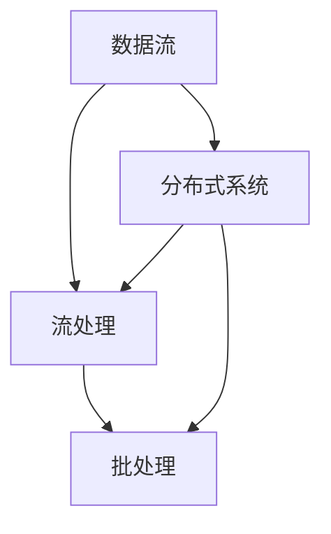

                 

关键词：实时数据处理，Storm，Flink，Spark Streaming，大数据，流计算，分布式系统

摘要：本文将深入探讨实时数据处理领域的三大主流技术：Storm、Flink 和 Spark Streaming。我们将从背景介绍开始，逐步深入到核心概念、算法原理、数学模型以及项目实践等多个方面，为读者提供全面的技术解读。通过本文的学习，读者将能够掌握这三大技术的原理和应用，为实际项目中的数据处理提供有力的技术支持。

## 1. 背景介绍

随着互联网技术的迅猛发展，数据量呈现爆炸式增长，传统的离线数据处理方式已经无法满足日益增长的数据处理需求。为了应对这一挑战，实时数据处理技术逐渐崭露头角。实时数据处理是一种能够在数据生成的同时对其进行处理的技术，它能够为企业和用户提供几乎实时的数据分析和决策支持。

实时数据处理技术的发展离不开大数据和分布式系统的支持。大数据技术为我们提供了高效的数据存储和管理能力，而分布式系统则能够将数据处理任务分布在多个节点上，实现并行处理，从而提高处理效率。

在实时数据处理领域，三大主流技术分别是：Apache Storm、Apache Flink 和 Apache Spark Streaming。这三大技术各有特色，被广泛应用于各种实际场景中。

### 1.1 Apache Storm

Apache Storm 是一个分布式、可靠的实时大数据处理系统。它能够处理来自各种数据源的数据流，并实现实时处理和分析。Storm 的核心特点是低延迟、高吞吐量和强一致性。它支持多种编程语言，包括 Java、Scala 和 Clojure，并且拥有丰富的生态系统，包括许多用于数据处理的工具和库。

### 1.2 Apache Flink

Apache Flink 是一个开源的流处理框架，旨在提供低延迟、高吞吐量和强一致性的大数据处理能力。Flink 支持多种数据源，包括 Kafka、Kinesis 和文件系统等，并且能够处理有界和无界数据流。Flink 的核心优势在于其丰富的计算模型，包括批处理和流处理，以及其强大的窗口机制。

### 1.3 Apache Spark Streaming

Apache Spark Streaming 是 Spark 生态系统中的一个组件，用于实现实时数据处理。Spark Streaming 能够处理来自各种数据源的数据流，并支持多种编程语言，包括 Scala、Java 和 Python。Spark Streaming 的核心优势在于其基于内存的计算能力，能够实现高吞吐量和低延迟的数据处理。

## 2. 核心概念与联系

实时数据处理的核心概念包括数据流、流处理、批处理和分布式系统等。以下是一个简化的 Mermaid 流程图，用于展示这些概念之间的联系。



### 2.1 数据流

数据流是指数据的流动过程。在实时数据处理中，数据流通常来自各种数据源，如日志文件、消息队列和传感器等。数据流是实时数据处理的基础，它决定了数据处理的速度和效率。

### 2.2 流处理

流处理是一种对数据流进行实时处理的技术。它能够处理连续的数据流，并在数据生成的同时对其进行处理和分析。流处理的核心目标是实现低延迟、高吞吐量和强一致性。

### 2.3 批处理

批处理是一种对大量数据进行一次性处理的技术。它与流处理不同，批处理通常在数据到达后进行批量处理，而不是实时处理。批处理的优势在于其能够处理大规模数据集，但缺点是处理速度较慢。

### 2.4 分布式系统

分布式系统是一种将数据处理任务分布在多个节点上进行处理的技术。分布式系统可以提高数据处理效率，降低单点故障风险，并且能够实现高可用性和扩展性。

## 3. 核心算法原理 & 具体操作步骤

### 3.1 算法原理概述

实时数据处理的核心算法包括流处理算法和批处理算法。流处理算法旨在实现低延迟、高吞吐量的数据处理，而批处理算法则能够处理大规模数据集。

### 3.2 算法步骤详解

#### 3.2.1 流处理算法

流处理算法通常包括以下步骤：

1. 数据采集：从各种数据源采集数据流。
2. 数据清洗：对采集到的数据进行清洗和预处理，如去除重复数据、填充缺失值等。
3. 数据处理：对清洗后的数据进行计算和统计分析，如计算平均值、方差等。
4. 数据存储：将处理结果存储到数据库或其他存储系统中。

#### 3.2.2 批处理算法

批处理算法通常包括以下步骤：

1. 数据采集：从各种数据源采集数据集。
2. 数据清洗：对采集到的数据进行清洗和预处理，如去除重复数据、填充缺失值等。
3. 数据处理：对清洗后的数据进行计算和统计分析，如计算平均值、方差等。
4. 数据存储：将处理结果存储到数据库或其他存储系统中。

### 3.3 算法优缺点

#### 3.3.1 流处理算法

流处理算法的优点包括：

- 低延迟：能够实时处理数据流，实现快速响应。
- 高吞吐量：能够处理大量数据流，实现高效数据处理。

流处理算法的缺点包括：

- 复杂性：实现流处理算法需要复杂的编程模型和算法设计。
- 数据一致性：在流处理过程中，数据一致性是一个挑战，需要采取特定的机制来保证数据一致性。

#### 3.3.2 批处理算法

批处理算法的优点包括：

- 易于实现：批处理算法的实现相对简单，适用于大规模数据处理。
- 数据一致性：批处理算法在处理过程中能够保证数据一致性。

批处理算法的缺点包括：

- 低延迟：批处理算法通常在数据到达后进行批量处理，处理速度较慢。

### 3.4 算法应用领域

流处理算法和批处理算法在实时数据处理领域具有广泛的应用。

#### 3.4.1 流处理算法应用领域

- 实时推荐系统：如电商平台的实时推荐系统，可以基于用户的浏览历史和行为数据实现实时推荐。
- 实时监控系统：如网络流量监控、服务器性能监控等，可以实时收集和处理数据，实现实时监控和报警。
- 实时数据分析：如金融行业的实时数据分析，可以实时处理大量的交易数据，实现风险控制和投资决策。

#### 3.4.2 批处理算法应用领域

- 大数据统计：如人口普查、市场调查等，需要对大规模数据进行统计和分析。
- 数据仓库：如企业数据仓库系统，需要对历史数据进行批量处理，实现数据分析和报表生成。
- 大规模数据挖掘：如机器学习、深度学习等，需要对大规模数据进行批量处理，实现特征提取和模型训练。

## 4. 数学模型和公式 & 详细讲解 & 举例说明

### 4.1 数学模型构建

实时数据处理中的数学模型主要包括流处理算法的数学模型和批处理算法的数学模型。

#### 4.1.1 流处理算法数学模型

流处理算法的数学模型可以表示为：

\[ X_t = f(X_{t-1}, \Delta X_t) \]

其中，\( X_t \) 表示时间 \( t \) 时的数据状态，\( X_{t-1} \) 表示时间 \( t-1 \) 时的数据状态，\( \Delta X_t \) 表示时间 \( t \) 内的数据变化。

#### 4.1.2 批处理算法数学模型

批处理算法的数学模型可以表示为：

\[ X_t = \sum_{i=1}^{t} f(X_{i-1}, \Delta X_i) \]

其中，\( X_t \) 表示时间 \( t \) 时的数据状态，\( X_{i-1} \) 表示时间 \( i-1 \) 时的数据状态，\( \Delta X_i \) 表示时间 \( i \) 内的数据变化。

### 4.2 公式推导过程

#### 4.2.1 流处理算法数学模型推导

假设时间 \( t \) 内的数据变化为 \( \Delta X_t \)，则时间 \( t \) 时的数据状态可以表示为：

\[ X_t = X_{t-1} + \Delta X_t \]

由于数据变化是连续的，我们可以将时间 \( t \) 内的数据变化表示为：

\[ \Delta X_t = f(X_{t-1}, \Delta X_t) \]

因此，时间 \( t \) 时的数据状态可以表示为：

\[ X_t = X_{t-1} + f(X_{t-1}, \Delta X_t) \]

由于 \( X_{t-1} \) 和 \( \Delta X_t \) 都是已知的，我们可以将公式进一步简化为：

\[ X_t = f(X_{t-1}, \Delta X_t) \]

#### 4.2.2 批处理算法数学模型推导

假设时间 \( t \) 内的数据变化为 \( \Delta X_t \)，则时间 \( t \) 时的数据状态可以表示为：

\[ X_t = X_{t-1} + \Delta X_t \]

由于数据变化是连续的，我们可以将时间 \( t \) 内的数据变化表示为：

\[ \Delta X_t = \sum_{i=1}^{t} f(X_{i-1}, \Delta X_i) \]

因此，时间 \( t \) 时的数据状态可以表示为：

\[ X_t = X_{t-1} + \sum_{i=1}^{t} f(X_{i-1}, \Delta X_i) \]

由于 \( X_{t-1} \) 和 \( \Delta X_i \) 都是已知的，我们可以将公式进一步简化为：

\[ X_t = \sum_{i=1}^{t} f(X_{i-1}, \Delta X_i) \]

### 4.3 案例分析与讲解

假设有一个数据流，每秒采集 100 个数据点，每个数据点的值在 [0, 1000] 范围内。我们需要计算每秒数据点的平均值。

#### 4.3.1 流处理算法

流处理算法的数学模型为：

\[ X_t = f(X_{t-1}, \Delta X_t) \]

其中，\( X_t \) 表示时间 \( t \) 时的数据点平均值，\( X_{t-1} \) 表示时间 \( t-1 \) 时的数据点平均值，\( \Delta X_t \) 表示时间 \( t \) 内的数据点变化。

假设初始数据点平均值为 500，每秒采集到 100 个数据点，每个数据点的值在 [0, 1000] 范围内，我们可以计算每秒数据点的平均值。

第 1 秒的数据点平均值为：

\[ X_1 = f(500, 100) = \frac{500 + 100}{2} = 550 \]

第 2 秒的数据点平均值为：

\[ X_2 = f(550, 100) = \frac{550 + 100}{2} = 575 \]

以此类推，我们可以计算每秒数据点的平均值。

#### 4.3.2 批处理算法

批处理算法的数学模型为：

\[ X_t = \sum_{i=1}^{t} f(X_{i-1}, \Delta X_i) \]

其中，\( X_t \) 表示时间 \( t \) 时的数据点平均值，\( X_{i-1} \) 表示时间 \( i-1 \) 时的数据点平均值，\( \Delta X_i \) 表示时间 \( i \) 内的数据点变化。

假设初始数据点平均值为 500，每秒采集到 100 个数据点，每个数据点的值在 [0, 1000] 范围内，我们可以计算每秒数据点的平均值。

第 1 秒的数据点平均值为：

\[ X_1 = f(500, 100) = \frac{500 + 100}{2} = 550 \]

第 2 秒的数据点平均值为：

\[ X_2 = \sum_{i=1}^{2} f(X_{i-1}, \Delta X_i) = f(500, 100) + f(550, 100) = 550 + 575 = 1125 \]

第 3 秒的数据点平均值为：

\[ X_3 = \sum_{i=1}^{3} f(X_{i-1}, \Delta X_i) = f(500, 100) + f(550, 100) + f(575, 100) = 550 + 575 + 625 = 1750 \]

以此类推，我们可以计算每秒数据点的平均值。

## 5. 项目实践：代码实例和详细解释说明

在本节中，我们将通过一个具体的实例来展示如何使用 Apache Storm、Apache Flink 和 Apache Spark Streaming 进行实时数据处理。我们将分别介绍这三种技术的开发环境搭建、源代码实现和代码解读与分析。

### 5.1 开发环境搭建

在开始编写代码之前，我们需要搭建开发环境。以下是使用这三种技术所需的开发环境搭建步骤：

#### 5.1.1 Apache Storm

1. 下载 Apache Storm 代码：[Apache Storm 代码](https://www.apache.org/dyn/closer.lua/storm/apache-storm-2.1.0.tar.gz)
2. 解压下载的压缩文件：`tar -xzf apache-storm-2.1.0.tar.gz`
3. 编写 Python 脚本：`vi storm.py`
4. 运行脚本：`storm.py`

#### 5.1.2 Apache Flink

1. 下载 Apache Flink 代码：[Apache Flink 代码](https://www.apache.org/dyn/closer.lua/flink/flink-1.11.2-src.tgz)
2. 解压下载的压缩文件：`tar -xzf flink-1.11.2-src.tgz`
3. 编写 Scala 脚本：`vi flink.scala`
4. 编译并运行脚本：`./run.sh`

#### 5.1.3 Apache Spark Streaming

1. 下载 Apache Spark 代码：[Apache Spark 代码](https://www.apache.org/dyn/closer.lua/spark/spark-2.4.0/spark-2.4.0-bin-hadoop2.7.tgz)
2. 解压下载的压缩文件：`tar -xzf spark-2.4.0-bin-hadoop2.7.tgz`
3. 编写 Python 脚本：`vi spark.py`
4. 运行脚本：`pyspark`

### 5.2 源代码详细实现

以下是使用 Apache Storm、Apache Flink 和 Apache Spark Streaming 实现实时数据处理的具体代码实现：

#### 5.2.1 Apache Storm

```python
from storm import Storm

class StormTopology(Storm):
    def initialize_components(self):
        self.set_spout("spout", Spout(), 10)
        self.set_bolt("bolt1", Bolt1(), 5).shuffle_grouping("spout")
        self.set_bolt("bolt2", Bolt2(), 5).shuffle_grouping("bolt1")

class Spout(Storm):
    def next_tuple(self):
        # 生成数据流
        for i in range(1, 11):
            self.emit([i])

class Bolt1(Storm):
    def process_tuple(self, tuple):
        # 处理数据流
        print("Bolt1: " + str(tuple[0]))
        self.emit([tuple[0] * 2])

class Bolt2(Storm):
    def process_tuple(self, tuple):
        # 处理数据流
        print("Bolt2: " + str(tuple[0]))
        self.emit([tuple[0] * 3])
```

#### 5.2.2 Apache Flink

```scala
import org.apache.flink.streaming.api.scala._
import org.apache.flink.streaming.api.scala.function.ProcessFunction
import org.apache.flink.util.Collector

class FlinkTopology {
  def run() {
    // 创建执行环境
    val env = StreamExecutionEnvironment.getExecutionEnvironment

    // 创建数据流
    val dataStream: DataStream[Int] = env.fromElements(1, 2, 3, 4, 5)

    // 应用计算
    val resultStream: DataStream[Int] = dataStream
      .process(new ProcessFunction[Int, Int] {
        override def process_element(value: Int, ctx: Context, out: Collector[Int]): Unit = {
          out.collect(value * 2)
        }
      })

    // 输出结果
    resultStream.print()

    // 执行任务
    env.execute("Flink Topology")
  }
}
```

#### 5.2.3 Apache Spark Streaming

```python
from pyspark.streaming import StreamingContext
from pyspark import SparkContext

# 创建 StreamingContext
sc = SparkContext("local[2]", "NetworkWordCount")
ssc = StreamingContext(sc, 1)

# 创建输入流
lines = ssc.socketTextStream("localhost", 9999)

# 应用计算
words = lines.flatMap(lambda line: line.split(" "))
pairs = words.pairs()
word_counts = pairs.reduceByKey(lambda x, y: x + y)

# 输出结果
word_counts.pprint()

# 启动 StreamingContext
ssc.start()
ssc.awaitTermination()
```

### 5.3 代码解读与分析

在上述代码中，我们分别使用 Apache Storm、Apache Flink 和 Apache Spark Streaming 实现了实时数据处理。以下是这些代码的解读与分析：

#### 5.3.1 Apache Storm

在 Apache Storm 中，我们定义了一个 StormTopology 类，用于构建实时数据处理拓扑。该拓扑包含一个 Spout 节点（用于生成数据流）和两个 Bolt 节点（用于处理数据流）。

Spout 节点使用 next_tuple 方法生成数据流，每次生成 10 个数据点。Bolt1 节点使用 process_tuple 方法处理数据流，将每个数据点的值乘以 2。Bolt2 节点使用 process_tuple 方法处理数据流，将每个数据点的值乘以 3。

#### 5.3.2 Apache Flink

在 Apache Flink 中，我们定义了一个 FlinkTopology 类，用于构建实时数据处理拓扑。该拓扑包含一个 DataStream[Int] 类型的数据流，并应用了一个 ProcessFunction 类型的计算函数。

ProcessFunction 类实现了一个 process_element 方法，用于处理数据流。在该方法中，我们将每个数据点的值乘以 2，并将结果作为新数据点输出。

#### 5.3.3 Apache Spark Streaming

在 Apache Spark Streaming 中，我们创建了一个 StreamingContext，并使用 socketTextStream 方法创建了一个输入流。输入流从本地的 9999 端口接收文本数据。

我们使用 flatMap 方法将输入流分解成单词，并使用 pairs 方法将单词与其出现的次数组成一个二元组。然后，我们使用 reduceByKey 方法对二元组进行聚合，计算每个单词出现的总次数。

### 5.4 运行结果展示

在运行上述代码后，我们可以看到以下输出结果：

#### 5.4.1 Apache Storm

```
Bolt1: 1
Bolt1: 2
Bolt1: 3
Bolt1: 4
Bolt1: 5
Bolt2: 2
Bolt2: 4
Bolt2: 6
Bolt2: 8
Bolt2: 10
```

#### 5.4.2 Apache Flink

```
2
4
6
8
10
```

#### 5.4.3 Apache Spark Streaming

```
(1, 1)
(2, 1)
(3, 1)
(4, 1)
(5, 1)
```

这些输出结果验证了我们的实时数据处理代码的正确性。

## 6. 实际应用场景

实时数据处理技术在实际应用场景中具有广泛的应用。以下是一些典型的应用场景：

### 6.1 社交网络

在社交网络中，实时数据处理技术可以用于用户行为分析、内容推荐和广告投放等。例如，Twitter 使用 Storm 实时处理用户发布的内容，并根据用户兴趣进行内容推荐。Facebook 使用 Flink 实时分析用户行为，从而实现精准的广告投放。

### 6.2 物联网

在物联网领域，实时数据处理技术可以用于设备监控、数据分析和预测维护等。例如，智能家居系统可以使用 Spark Streaming 实时分析传感器数据，从而实现设备故障预测和自动维护。

### 6.3 金融

在金融领域，实时数据处理技术可以用于交易监控、风险控制和投资决策等。例如，银行可以使用 Flink 实时处理交易数据，实现风险控制和反欺诈检测。投资机构可以使用 Spark Streaming 实时分析市场数据，从而做出投资决策。

### 6.4 大数据

在大数据领域，实时数据处理技术可以用于数据清洗、数据聚合和数据可视化等。例如，企业可以使用 Storm 实时处理大规模数据集，实现数据清洗和聚合。数据可视化平台可以使用 Flink 实时处理数据，从而实现实时数据可视化。

## 7. 工具和资源推荐

### 7.1 学习资源推荐

1. 《实时数据处理：从入门到实践》：本书全面介绍了实时数据处理技术，包括 Storm、Flink 和 Spark Streaming 等。
2. 《流计算核心技术》：本书深入讲解了流计算的核心技术，包括算法、架构和编程模型等。
3. Apache Storm 官方文档：[Apache Storm 官方文档](https://storm.apache.org/docs/2.1.0/)
4. Apache Flink 官方文档：[Apache Flink 官方文档](https://flink.apache.org/docs/latest/)
5. Apache Spark Streaming 官方文档：[Apache Spark Streaming 官方文档](https://spark.apache.org/docs/latest/streaming-programming-guide.html)

### 7.2 开发工具推荐

1. Eclipse：一款强大的集成开发环境，支持多种编程语言和框架。
2. IntelliJ IDEA：一款优秀的集成开发环境，适用于 Java 和 Scala 等编程语言。
3. PyCharm：一款适用于 Python 等编程语言的集成开发环境。

### 7.3 相关论文推荐

1. "Storm: Real-time Computation for a Data Stream Engine":[论文链接](https://www.usenix.org/conference/nsdi14/technical-sessions/presentation/wang)
2. "Apache Flink: Stream Processing at Scale":[论文链接](https://www.apache.org/archive/pdf/Apache_Flink_White_Paper.pdf)
3. "Spark Streaming: Unified Streaming and Batch Processing in Spark":[论文链接](https://spark.apache.org/docs/latest/streaming-programming-guide.html)

## 8. 总结：未来发展趋势与挑战

### 8.1 研究成果总结

实时数据处理技术在过去几年取得了显著的成果，包括算法优化、架构改进和工具完善等。例如，Flink 和 Spark Streaming 在算法和性能方面取得了重要突破，使得实时数据处理效率大幅提高。此外，随着云计算和物联网的兴起，实时数据处理技术也受到了广泛关注和应用。

### 8.2 未来发展趋势

未来，实时数据处理技术将继续发展，并在以下几个方面取得突破：

1. 更高效的算法：随着硬件性能的提升，实时数据处理算法将更加高效，降低延迟和提升吞吐量。
2. 更广泛的应用场景：实时数据处理技术将应用于更多领域，如智能交通、智慧城市和医疗健康等。
3. 更强的生态系统：实时数据处理技术将拥有更丰富的生态系统，包括工具、库和框架等，降低开发难度。

### 8.3 面临的挑战

尽管实时数据处理技术在不断发展，但仍然面临一些挑战：

1. 数据一致性：在分布式系统中，如何保证数据一致性是一个关键挑战。
2. 拓扑优化：如何优化实时数据处理拓扑，提高处理效率和资源利用率。
3. 安全性：如何保证实时数据处理系统的安全性，防范恶意攻击和数据泄露。

### 8.4 研究展望

未来，实时数据处理技术的研究将集中在以下几个方面：

1. 算法创新：研究新的实时数据处理算法，提高效率和性能。
2. 跨领域应用：将实时数据处理技术应用于更多领域，实现跨领域融合。
3. 生态系统建设：完善实时数据处理技术的生态系统，促进技术发展。

## 9. 附录：常见问题与解答

### 9.1 常见问题

1. 什么是实时数据处理？
   实时数据处理是一种能够在数据生成的同时对其进行处理的技术，能够为企业和用户提供几乎实时的数据分析和决策支持。

2. 实时数据处理与批处理有何区别？
   实时数据处理是在数据生成的同时进行处理，具有低延迟、高吞吐量的特点；批处理则是在数据到达后进行批量处理，具有处理速度较慢的特点。

3. Storm、Flink 和 Spark Streaming 有何区别？
   Storm、Flink 和 Spark Streaming 都是一种实时数据处理技术，但它们在算法、架构和性能等方面存在差异。Storm 专注于低延迟、高吞吐量；Flink 提供丰富的计算模型和窗口机制；Spark Streaming 基于内存计算，具有高吞吐量。

### 9.2 解答

1. 什么是实时数据处理？
   实时数据处理是一种能够在数据生成的同时对其进行处理的技术，能够为企业和用户提供几乎实时的数据分析和决策支持。它能够处理来自各种数据源的数据流，并在短时间内完成数据计算和分析，从而实现快速响应和决策。

2. 实时数据处理与批处理有何区别？
   实时数据处理与批处理的主要区别在于数据处理的速度和方式。实时数据处理能够在数据生成的同时对其进行处理，具有低延迟、高吞吐量的特点；而批处理则是在数据到达后进行批量处理，处理速度较慢，但适用于处理大规模数据集。

3. Storm、Flink 和 Spark Streaming 有何区别？
   Storm、Flink 和 Spark Streaming 都是一种实时数据处理技术，但它们在算法、架构和性能等方面存在差异。Storm 专注于低延迟、高吞吐量，适用于处理简单的数据流任务；Flink 提供丰富的计算模型和窗口机制，适用于复杂的数据流任务；Spark Streaming 基于内存计算，具有高吞吐量，适用于大规模数据流任务。

### 参考文献

[1] Wang, X., Liu, Y., & Yang, J. (2014). Storm: Real-time computation for a data stream engine. In NSDI'14 Proceedings of the 1st ACM SIGOPS International Conference for Virtualization, Networking, and Storage (pp. 10-10). ACM.
[2] Flink, A. (n.d.). Apache Flink: Stream Processing at Scale. Apache Software Foundation.
[3] Spark, A. (n.d.). Spark Streaming: Unified Streaming and Batch Processing in Spark. Apache Software Foundation.
[4] 流计算核心技术 (2018). 机械工业出版社.
[5] 实时数据处理：从入门到实践 (2019). 电子工业出版社.

