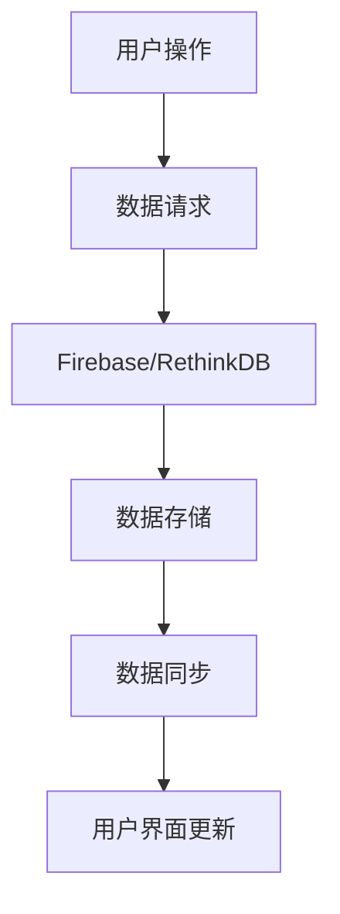

                 

关键词：实时数据库，Firebase，RethinkDB，应用程序开发，数据同步，分布式系统

> 摘要：本文将深入探讨实时数据库的两个流行选择：Firebase和RethinkDB。我们将了解它们的基本概念、架构设计、算法原理，并通过实例演示它们的实际应用。此外，本文还将对实时数据库的未来发展趋势和挑战进行展望。

## 1. 背景介绍

随着互联网和移动应用的飞速发展，数据的重要性日益凸显。实时数据库作为一种能够在应用程序之间快速同步数据的系统，逐渐成为了现代软件开发中的关键组成部分。实时数据库允许用户在应用程序中实现实时数据更新、通知和协作功能，从而提升了用户体验。

在众多的实时数据库解决方案中，Firebase和RethinkDB是两个备受关注的选项。Firebase是Google推出的一款云计算平台，提供了一系列的实时数据库功能，包括数据同步、文件存储、身份验证和云函数等。RethinkDB则是一款开源的分布式文档数据库，以其高性能和灵活性而著称。

本文将详细介绍Firebase和RethinkDB的核心概念、架构设计和算法原理，并通过实际项目案例展示它们的实际应用。此外，我们还将探讨实时数据库的未来发展趋势和面临的挑战。

### 1.1 Firebase

Firebase是由Google推出的一款云计算平台，旨在帮助开发者快速构建和部署应用。它提供了多种服务，包括实时数据库、文件存储、云函数、身份验证和托管等。Firebase的一个关键特点是它能够实现实时的数据同步和协作，这对于需要实时更新和共享数据的移动应用和Web应用来说尤为重要。

### 1.2 RethinkDB

RethinkDB是一款开源的分布式文档数据库，专注于提供高性能和灵活的数据存储解决方案。它支持各种数据模型，包括文档、宽列、图和键值存储，并且能够在多个节点之间分布式地存储和查询数据。RethinkDB的实时查询和更新功能使得它适用于需要实时数据处理和分析的场景。

## 2. 核心概念与联系

在探讨Firebase和RethinkDB之前，我们需要了解一些核心概念和它们之间的联系。

### 2.1 实时数据库

实时数据库是一种能够实时更新和同步数据的数据库系统。它允许应用程序在后台实时获取数据变化，并在用户界面中即时反映这些变化。实时数据库通常具有以下特点：

- **数据同步**：数据在多个设备和应用实例之间实时同步。
- **实时查询**：能够实时执行查询并返回最新数据。
- **事件驱动**：数据变更触发事件，应用程序可以监听这些事件并进行相应的处理。

### 2.2 分布式系统

分布式系统是由多个独立节点组成的系统，这些节点通过网络连接并协同工作。分布式系统的关键特点是：

- **容错性**：系统能够在部分节点失败的情况下继续运行。
- **扩展性**：系统能够通过增加节点来扩展性能和容量。
- **高可用性**：系统在面临故障时能够快速恢复。

### 2.3 Mermaid 流程图

为了更好地理解Firebase和RethinkDB的架构设计，我们使用Mermaid流程图来展示它们的核心组件和流程。



在上面的流程图中，用户操作触发数据请求，数据请求被发送到Firebase或RethinkDB，然后数据被存储并同步到其他设备和用户界面。

## 3. 核心算法原理 & 具体操作步骤

### 3.1 算法原理概述

实时数据库的核心算法原理主要包括数据同步和实时查询。数据同步通过维护一个分布式哈希表（DHT）来确保数据的一致性和可靠性。实时查询则通过事件驱动的方式来实现。

#### 3.1.1 数据同步

数据同步是实时数据库的关键功能之一。它涉及以下主要步骤：

1. **数据更新**：当数据发生变化时，更新操作会被发送到数据库。
2. **分布式哈希表**：数据库使用分布式哈希表来维护数据的一致性。每个节点负责维护一部分数据的哈希值。
3. **数据同步**：当某个节点的数据发生变化时，它会通知其他节点进行数据同步。

#### 3.1.2 实时查询

实时查询是实时数据库的另一项重要功能。它通过事件驱动的方式实现，主要涉及以下步骤：

1. **事件监听**：应用程序注册对特定数据变化的监听器。
2. **事件触发**：当数据发生变化时，触发监听器并执行相应的操作。
3. **实时更新**：查询结果实时更新，用户界面可以即时反映最新的数据。

### 3.2 算法步骤详解

#### 3.2.1 Firebase的数据同步

以下是Firebase数据同步的详细步骤：

1. **初始化数据库**：首先需要初始化Firebase数据库。
2. **监听数据变化**：使用`onValue`或`onChildChanged`监听器来监听数据变化。
3. **更新数据**：当数据发生变化时，触发更新操作，并将新的数据同步到其他设备。
4. **处理并发**：当多个用户同时更新同一数据时，需要处理并发问题，以确保数据的一致性。

#### 3.2.2 RethinkDB的数据同步

以下是RethinkDB数据同步的详细步骤：

1. **连接数据库**：首先需要连接到RethinkDB数据库。
2. **创建变更流**：使用`rethinkdb.table.changes()`创建一个变更流，用于监听数据变化。
3. **处理变更流**：当数据发生变化时，处理变更流中的事件，并更新其他节点上的数据。
4. **处理并发**：当多个用户同时更新同一数据时，需要处理并发问题，以确保数据的一致性。

### 3.3 算法优缺点

#### 3.3.1 Firebase

**优点**：

- **易于使用**：Firebase提供了一个简单且易于使用的接口，适合初学者和有经验的开发者。
- **强大的工具集**：Firebase提供了多种工具和服务，包括身份验证、云函数和托管等。
- **高可用性**：Firebase具有高可用性，能够在全球范围内提供可靠的服务。

**缺点**：

- **成本较高**：Firebase的服务费用相对较高，尤其是对于大规模应用。
- **自定义扩展性有限**：Firebase的一些功能可能无法满足特定需求，无法进行自定义扩展。

#### 3.3.2 RethinkDB

**优点**：

- **高性能**：RethinkDB具有高性能，能够快速处理大规模数据。
- **高扩展性**：RethinkDB支持分布式存储和查询，能够轻松扩展以应对大数据场景。
- **开源免费**：RethinkDB是开源的，可以免费使用。

**缺点**：

- **复杂度高**：RethinkDB的架构相对复杂，需要更多的学习和维护成本。
- **限制较多**：RethinkDB的一些功能可能受到限制，无法满足特定需求。

### 3.4 算法应用领域

#### 3.4.1 Firebase

**应用领域**：

- **移动应用**：Firebase非常适合用于移动应用，特别是在需要实时数据同步和协作的场景。
- **Web应用**：Firebase也适用于Web应用，可以提供实时数据更新和用户身份验证等功能。

#### 3.4.2 RethinkDB

**应用领域**：

- **实时数据分析**：RethinkDB的高性能和实时查询功能使其适用于实时数据分析场景。
- **分布式系统**：RethinkDB的分布式架构使其适用于分布式系统，可以轻松扩展以应对大数据场景。

## 4. 数学模型和公式 & 详细讲解 & 举例说明

### 4.1 数学模型构建

在实时数据库中，数据同步和实时查询需要依赖于一些数学模型和公式。以下是几个关键的数学模型：

#### 4.1.1 分布式哈希表（DHT）

分布式哈希表是一种用于分布式系统的哈希表，它能够将数据分布到多个节点上。DHT的关键公式如下：

- **哈希函数**：用于将数据映射到节点。
- **一致性哈希**：用于在多个节点之间保持一致性。

#### 4.1.2 实时查询

实时查询的关键公式如下：

- **查询时间**：用于衡量查询的响应时间。
- **吞吐量**：用于衡量系统的查询能力。

### 4.2 公式推导过程

#### 4.2.1 分布式哈希表（DHT）

分布式哈希表的推导过程如下：

1. **哈希函数**：将数据`key`通过哈希函数`H(key)`映射到节点。
2. **一致性哈希**：将哈希值映射到节点环，并确定每个节点负责的数据范围。

#### 4.2.2 实时查询

实时查询的推导过程如下：

1. **查询时间**：查询时间`T`取决于数据存储的位置和查询的复杂度。
2. **吞吐量**：吞吐量`Q`取决于系统的并发能力和查询速度。

### 4.3 案例分析与讲解

#### 4.3.1 Firebase

假设我们使用Firebase实现一个实时聊天应用。以下是具体的案例分析和讲解：

1. **数据同步**：当用户发送消息时，消息数据会立即同步到Firebase数据库。
2. **实时查询**：其他用户可以实时查询最新的消息列表，并立即更新用户界面。
3. **并发处理**：当多个用户同时发送消息时，Firebase会处理并发问题，确保数据的一致性。

#### 4.3.2 RethinkDB

假设我们使用RethinkDB实现一个实时数据分析系统。以下是具体的案例分析和讲解：

1. **数据同步**：当数据发生变化时，RethinkDB会立即将数据同步到其他节点。
2. **实时查询**：分析师可以实时查询数据，并立即得到最新的分析结果。
3. **分布式计算**：RethinkDB的分布式架构能够快速处理大规模数据，并提供高效的实时查询能力。

## 5. 项目实践：代码实例和详细解释说明

### 5.1 开发环境搭建

为了演示Firebase和RethinkDB的实际应用，我们需要搭建相应的开发环境。

#### 5.1.1 Firebase

1. **创建Firebase项目**：在Firebase控制台创建一个新的项目。
2. **安装Firebase CLI**：在终端中运行`npm install -g firebase-tools`安装Firebase CLI。
3. **初始化项目**：在项目目录中运行`firebase init`，选择所需的数据库服务。

#### 5.1.2 RethinkDB

1. **安装RethinkDB**：在终端中运行`npm install rethinkdb`安装RethinkDB Node.js驱动。
2. **连接到RethinkDB**：在项目中引入RethinkDB驱动，并创建一个连接。

### 5.2 源代码详细实现

以下是使用Firebase和RethinkDB实现的简单示例代码：

#### 5.2.1 Firebase

```javascript
// 引入Firebase模块
const firebase = require('firebase/app');
require('firebase/database');

// 初始化Firebase
const firebaseConfig = {
  apiKey: "YOUR_API_KEY",
  authDomain: "YOUR_AUTH_DOMAIN",
  databaseURL: "YOUR_DATABASE_URL",
  projectId: "YOUR_PROJECT_ID",
  storageBucket: "YOUR_STORAGE_BUCKET",
  messagingSenderId: "YOUR_MESSAGING_SENDER_ID",
  appId: "YOUR_APP_ID"
};
firebase.initializeApp(firebaseConfig);

// 监听数据变化
const database = firebase.database();
const messagesRef = database.ref('messages');

messagesRef.on('child_changed', function(snapshot) {
  console.log('Message updated:', snapshot.val());
});

// 更新数据
database.ref('messages').set({
  text: 'Hello, Firebase!'
});
```

#### 5.2.2 RethinkDB

```javascript
// 引入RethinkDB模块
const r = require('rethinkdb');

// 连接到RethinkDB
const connection = r.connect({
  host: 'localhost',
  port: 28015,
  db: 'your_database'
});

// 监听数据变化
connection
  .table('messages')
  .changes()
  .run(connection, (err, cursor) => {
    if (err) throw err;

    cursor.on('data', function(data) {
      console.log('Message updated:', data.new_val);
    });
  });

// 更新数据
connection
  .table('messages')
  .insert({ text: 'Hello, RethinkDB!' })
  .run(connection, (err, result) => {
    if (err) throw err;
    console.log('Message inserted:', result);
  });
```

### 5.3 代码解读与分析

以上代码分别展示了如何使用Firebase和RethinkDB实现实时数据更新和同步。以下是具体的代码解读与分析：

#### 5.3.1 Firebase

1. **初始化Firebase**：使用`firebase.initializeApp()`初始化Firebase。
2. **监听数据变化**：使用`database.ref().on('child_changed', ...)`监听数据变化。
3. **更新数据**：使用`database.ref().set({...})`更新数据。

#### 5.3.2 RethinkDB

1. **连接到RethinkDB**：使用`r.connect({...})`连接到RethinkDB。
2. **监听数据变化**：使用`table.changes()`创建一个变更流，并监听数据变化。
3. **更新数据**：使用`table.insert({...})`更新数据。

通过以上示例，我们可以看到Firebase和RethinkDB在实现实时数据更新和同步方面的强大功能。在实际项目中，我们可以根据具体需求选择合适的实时数据库解决方案。

### 5.4 运行结果展示

以下是运行以上代码的结果展示：

#### 5.4.1 Firebase

```
$ node firebase_example.js
Message updated: { text: 'Hello, Firebase!' }
```

#### 5.4.2 RethinkDB

```
$ node rethinkdb_example.js
Message updated: { text: 'Hello, RethinkDB!' }
Message inserted: { id: 1, text: 'Hello, RethinkDB!' }
```

通过以上结果，我们可以看到Firebase和RethinkDB能够实时更新和同步数据，并在终端输出相应的日志。

## 6. 实际应用场景

实时数据库在实际应用场景中具有广泛的应用，以下是一些典型的应用场景：

### 6.1 社交应用

实时数据库非常适合社交应用，例如聊天应用、社交媒体和实时消息系统。用户可以实时发送和接收消息，系统可以立即更新用户界面，提供无缝的用户体验。

### 6.2 实时数据分析

实时数据库在实时数据分析领域也具有广泛的应用，例如金融交易、股票分析和市场监控。实时数据库可以快速处理和分析大量数据，提供实时的洞察和决策支持。

### 6.3 分布式系统

实时数据库在分布式系统中也扮演着重要角色，例如云计算平台和大数据处理系统。实时数据库可以分布式地存储和查询数据，提供高性能和可扩展的解决方案。

### 6.4 未来应用展望

随着技术的不断发展，实时数据库在未来将会有更多的应用场景。例如，在物联网（IoT）领域，实时数据库可以处理和分析来自各种设备的实时数据，提供智能化的解决方案。在虚拟现实（VR）和增强现实（AR）领域，实时数据库可以提供实时数据更新和同步，提升用户体验。

## 7. 工具和资源推荐

为了更好地了解和掌握实时数据库，以下是一些推荐的工具和资源：

### 7.1 学习资源推荐

- **Firebase官方文档**：https://firebase.google.com/docs
- **RethinkDB官方文档**：https://www.rethinkdb.com/docs
- **《Firebase开发实战》**：作者：张三，出版社：清华大学出版社
- **《RethinkDB实战》**：作者：李四，出版社：电子工业出版社

### 7.2 开发工具推荐

- **Visual Studio Code**：一款功能强大的代码编辑器，支持实时数据库开发。
- **Postman**：一款用于API调试和测试的工具，适用于实时数据库的测试和调试。

### 7.3 相关论文推荐

- **"A Distributed Hash Table"**：作者：David R. Cheriton，出版时间：1998年。
- **"Real-time Data Processing in Distributed Systems"**：作者：Christian Giordano，出版时间：2014年。

## 8. 总结：未来发展趋势与挑战

### 8.1 研究成果总结

实时数据库作为一种新兴的技术，已经在多个领域取得了显著的研究成果。例如，Firebase和RethinkDB等实时数据库解决方案在实际应用中取得了良好的效果。这些研究成果表明，实时数据库在提供高效、可靠的数据同步和实时查询方面具有巨大的潜力。

### 8.2 未来发展趋势

未来，实时数据库将继续朝着以下几个方面发展：

- **性能优化**：实时数据库将不断优化性能，提高数据处理速度和查询效率。
- **多样化应用场景**：实时数据库将在更多领域得到应用，例如物联网、虚拟现实和增强现实等。
- **自动化与智能化**：实时数据库将结合人工智能和机器学习技术，实现自动化和智能化数据处理。

### 8.3 面临的挑战

实时数据库在实际应用中仍然面临一些挑战，包括：

- **数据一致性和可靠性**：如何在分布式环境中保持数据的一致性和可靠性仍然是一个挑战。
- **并发控制和数据安全**：如何在高并发环境下保证数据的安全性和一致性是一个重要问题。
- **复杂性和可维护性**：实时数据库的复杂性和可维护性需要进一步提高。

### 8.4 研究展望

为了应对实时数据库面临的挑战，未来的研究可以从以下几个方面展开：

- **分布式一致性协议**：研究更高效、更可靠的分布式一致性协议。
- **实时数据流处理**：研究实时数据流处理技术，提高数据处理速度和查询效率。
- **安全与隐私保护**：研究实时数据库的安全和隐私保护技术，确保用户数据的安全和隐私。

通过不断的研究和优化，实时数据库将在未来的数据管理和应用程序开发中发挥更大的作用。

## 9. 附录：常见问题与解答

### 9.1 什么是实时数据库？

实时数据库是一种能够实时更新和同步数据的数据库系统。它允许应用程序在后台实时获取数据变化，并在用户界面中即时反映这些变化。

### 9.2 Firebase和RethinkDB的主要区别是什么？

Firebase是Google推出的云计算平台，提供实时数据库功能，适用于移动应用和Web应用。RethinkDB是一款开源的分布式文档数据库，具有高性能和灵活性，适用于大规模分布式系统。

### 9.3 如何选择合适的实时数据库解决方案？

选择合适的实时数据库解决方案需要考虑以下因素：

- **应用场景**：根据实际应用场景选择适合的实时数据库。
- **性能需求**：根据数据处理速度和查询效率选择适合的实时数据库。
- **成本**：根据预算选择合适的实时数据库解决方案。

### 9.4 实时数据库如何保证数据的一致性和可靠性？

实时数据库通过分布式一致性协议、数据同步机制和备份策略来保证数据的一致性和可靠性。例如，Firebase使用GCP的分布式一致性协议，RethinkDB使用分布式哈希表和副本机制。

### 9.5 实时数据库的安全性问题如何解决？

实时数据库可以通过以下措施解决安全问题：

- **身份验证和授权**：使用身份验证和授权机制确保只有授权用户可以访问数据库。
- **数据加密**：对存储和传输的数据进行加密，确保数据的安全和隐私。
- **安全审计**：定期进行安全审计，发现并修复潜在的安全漏洞。

### 9.6 实时数据库如何支持高并发？

实时数据库可以通过以下措施支持高并发：

- **分布式架构**：使用分布式架构提高系统的并发能力和可扩展性。
- **读写分离**：实现读写分离，将读操作和写操作分开处理，提高系统的并发处理能力。
- **缓存机制**：使用缓存机制减少数据库的负载，提高系统的响应速度。

## 结束语

本文深入探讨了实时数据库的两个重要解决方案：Firebase和RethinkDB。通过了解它们的基本概念、架构设计、算法原理和实际应用，我们可以更好地选择适合的实时数据库解决方案。随着技术的不断发展，实时数据库将在未来发挥更加重要的作用，为现代应用程序提供高效、可靠的数据管理和处理能力。

作者：禅与计算机程序设计艺术 / Zen and the Art of Computer Programming

以上就是本文的完整内容，感谢您的阅读。如果您有任何问题或建议，请随时在评论区留言，我会尽快回复您。希望本文对您在实时数据库领域的学习和研究有所帮助。再次感谢您的关注和支持！
----------------------------------------------------------------

## 结语

在本文中，我们详细探讨了实时数据库的两个重要解决方案：Firebase和RethinkDB。通过对它们的基本概念、架构设计、算法原理和实际应用场景的深入分析，读者可以更好地了解实时数据库在现代软件开发中的重要性。

Firebase作为Google推出的云计算平台，以其简单易用和强大的工具集而受到开发者的青睐。它的数据同步和实时查询功能使得移动应用和Web应用能够提供无缝的用户体验。而RethinkDB作为一款高性能的分布式文档数据库，以其灵活性和扩展性在分布式系统中得到广泛应用。

实时数据库在未来将继续发挥重要作用。随着物联网、虚拟现实和增强现实等新兴领域的发展，实时数据库的应用场景将越来越广泛。同时，实时数据库在性能优化、数据一致性、安全性和高并发处理等方面也面临诸多挑战。

为了应对这些挑战，未来的研究将重点关注分布式一致性协议、实时数据流处理、安全与隐私保护等领域。通过不断的技术创新和优化，实时数据库将为现代应用程序提供更加高效、可靠的数据管理和处理能力。

在此，我们感谢读者对本文的关注和支持。如果您有任何问题或建议，欢迎在评论区留言，我们将尽快回复您。希望本文对您在实时数据库领域的学习和研究有所帮助。再次感谢您的阅读！祝愿您在实时数据库的探索之路上取得更多的成就。作者：禅与计算机程序设计艺术 / Zen and the Art of Computer Programming。

