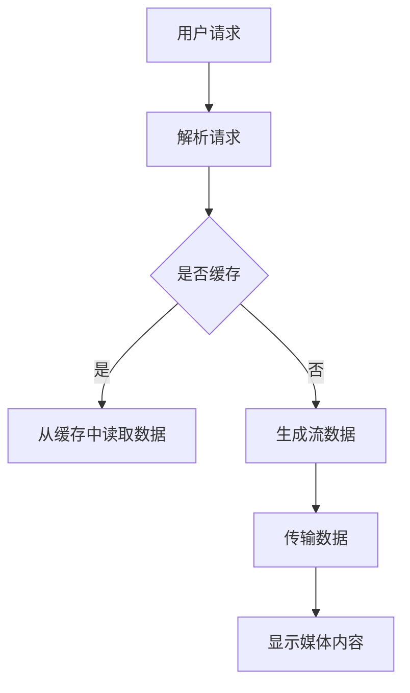

                 

关键词：实时流媒体、NGINX、Wowza、流媒体服务器、媒体传输、性能优化、算法原理、数学模型、代码实例、应用场景、未来展望

> 摘要：本文深入探讨了实时流媒体服务器领域的两个重要工具——NGINX和Wowza。我们将从背景介绍、核心概念、算法原理、数学模型、项目实践和未来展望等多个角度，全面分析这两者在实时流媒体传输中的应用，优缺点以及未来的发展方向。

## 1. 背景介绍

随着互联网技术的发展，流媒体技术已经成为现代网络通信的重要组成部分。流媒体技术允许用户实时观看视频、音频以及其他类型的媒体内容，而不需要提前下载整个文件。实时流媒体服务器的性能直接影响到用户观看体验，因此，选择合适的流媒体服务器至关重要。

NGINX和Wowza是当前流媒体服务器领域的两个重要代表。NGINX是一款高性能的Web服务器和反向代理服务器，因其高效、稳定和易于配置的特点，被广泛应用于各种场景。而Wowza则是一款专业的流媒体服务器软件，支持多种流媒体协议，并提供丰富的流媒体处理功能。

本文将对比分析NGINX和Wowza在实时流媒体传输中的应用，探讨它们各自的优缺点，并展望未来流媒体服务器的发展趋势。

## 2. 核心概念与联系

### 2.1 流媒体传输基本概念

流媒体传输是指通过网络将音频、视频或其他类型的媒体内容以数据流的形式传输给用户。与传统的下载模式不同，流媒体传输允许用户在播放过程中逐步获取媒体内容，从而实现实时观看。

流媒体传输的关键技术包括：编解码（Codec）、协议（Protocol）和传输控制（Transport Control）。

- **编解码（Codec）**：编解码技术用于将原始媒体数据转换成适合网络传输的格式，并解码回原始格式供用户观看。常见的编解码技术有H.264、HEVC等。

- **协议（Protocol）**：流媒体传输协议定义了数据传输的规则和流程，如HTTP Live Streaming（HLS）、Dynamic Adaptive Streaming over HTTP（DASH）和Real-Time Streaming Protocol（RTSP）等。

- **传输控制（Transport Control）**：传输控制技术用于控制数据流的传输过程，如缓冲管理、拥塞控制等。

### 2.2 NGINX与流媒体传输

NGINX是一款高性能的Web服务器和反向代理服务器，支持多种协议，包括HTTP、HTTPS和WebSocket等。虽然NGINX并非专门为流媒体传输而设计，但通过配置和插件，它也能提供良好的流媒体传输性能。

NGINX支持常见的流媒体传输协议，如HLS、DASH和RTSP，并能够与流媒体服务器软件（如Wowza）进行集成，实现高效的流媒体传输。

### 2.3 Wowza与流媒体传输

Wowza是一款专业的流媒体服务器软件，支持多种流媒体协议，如HLS、DASH、RTMP和HTTP等。Wowza提供丰富的流媒体处理功能，包括内容分发、缓冲管理、错误恢复、多码率自适应等。

Wowza的高性能和稳定性使其成为流媒体领域的首选，特别是在需要大规模流媒体传输和高并发场景下。

### 2.4 Mermaid 流程图

以下是一个简单的Mermaid流程图，展示了流媒体传输的基本流程：



## 3. 核心算法原理 & 具体操作步骤

### 3.1 算法原理概述

实时流媒体传输的核心算法包括编解码算法、传输控制算法和缓冲管理算法。

- **编解码算法**：编解码算法负责将原始媒体数据转换成适合网络传输的格式，并在接收端解码回原始格式。常见的编解码算法有H.264、HEVC等。

- **传输控制算法**：传输控制算法负责控制数据流的传输过程，包括缓冲管理、拥塞控制、错误恢复等。常见的传输控制算法有拥塞控制算法（如TCP的拥塞控制）、缓冲管理算法（如FEC、ARQ等）。

- **缓冲管理算法**：缓冲管理算法负责在接收端对数据流进行缓冲，确保用户能够平滑地观看媒体内容。常见的缓冲管理算法有固定缓冲、动态缓冲、预缓冲等。

### 3.2 算法步骤详解

#### 3.2.1 编解码算法步骤

1. **编码阶段**：将原始媒体数据（如视频、音频）转换为适合网络传输的格式（如H.264、HEVC）。

2. **传输阶段**：通过网络传输编码后的媒体数据。

3. **解码阶段**：在接收端，将编码后的媒体数据解码回原始格式，供用户观看。

#### 3.2.2 传输控制算法步骤

1. **拥塞控制**：根据网络状况调整数据传输速率，避免网络拥塞。

2. **缓冲管理**：在接收端对数据流进行缓冲，确保用户能够平滑地观看媒体内容。

3. **错误恢复**：检测并纠正传输过程中的错误，保证数据的完整性。

#### 3.2.3 缓冲管理算法步骤

1. **固定缓冲**：设置固定大小的缓冲区，根据缓冲区大小控制数据流传输。

2. **动态缓冲**：根据网络状况和用户观看需求动态调整缓冲区大小。

3. **预缓冲**：在播放前预加载一定量的数据，确保用户在观看过程中不会出现卡顿。

### 3.3 算法优缺点

#### 编解码算法优缺点

- **优点**：压缩效率高，适合网络传输，支持多种视频格式。

- **缺点**：解码复杂度较高，对硬件资源要求较高。

#### 传输控制算法优缺点

- **优点**：适应网络变化，提高数据传输效率，保证用户观看体验。

- **缺点**：可能导致传输延迟，对网络质量要求较高。

#### 缓冲管理算法优缺点

- **优点**：平滑用户观看体验，减少卡顿现象。

- **缺点**：可能增加数据传输延迟，占用更多内存资源。

### 3.4 算法应用领域

编解码算法、传输控制算法和缓冲管理算法广泛应用于流媒体传输、视频会议、在线教育、远程医疗等多个领域。

## 4. 数学模型和公式 & 详细讲解 & 举例说明

### 4.1 数学模型构建

流媒体传输中的数学模型主要包括编解码模型、传输控制模型和缓冲管理模型。

#### 4.1.1 编解码模型

编解码模型描述了编码和解码过程中涉及的数学关系。常见的编解码模型有：

- **H.264编解码模型**：

  $$y = f(x)$$

  其中，\(x\) 为原始媒体数据，\(y\) 为编码后的数据。

- **HEVC编解码模型**：

  $$y = g(x)$$

  其中，\(x\) 为原始媒体数据，\(y\) 为编码后的数据。

#### 4.1.2 传输控制模型

传输控制模型描述了传输过程中涉及的数学关系。常见的传输控制模型有：

- **TCP传输控制模型**：

  $$c(t) = a \cdot r(t) + b \cdot s(t)$$

  其中，\(c(t)\) 为当前传输速率，\(r(t)\) 为接收端反馈的传输速率，\(s(t)\) 为发送端估计的传输速率。

- **拥塞控制模型**：

  $$c(t) = \frac{w \cdot r(t)}{1 + \alpha \cdot (r(t) - s(t))}$$

  其中，\(c(t)\) 为当前传输速率，\(r(t)\) 为接收端反馈的传输速率，\(s(t)\) 为发送端估计的传输速率，\(w\) 和 \(\alpha\) 为参数。

#### 4.1.3 缓冲管理模型

缓冲管理模型描述了缓冲区大小与数据传输速率之间的关系。常见的缓冲管理模型有：

- **固定缓冲模型**：

  $$b(t) = b_0 + \frac{r(t) - s(t)}{r_0}$$

  其中，\(b(t)\) 为当前缓冲区大小，\(b_0\) 为初始缓冲区大小，\(r(t)\) 为当前传输速率，\(s(t)\) 为发送端估计的传输速率，\(r_0\) 为初始传输速率。

- **动态缓冲模型**：

  $$b(t) = b_0 + \frac{r(t) - s(t)}{r_0 + k \cdot |r(t) - s(t)|}$$

  其中，\(b(t)\) 为当前缓冲区大小，\(b_0\) 为初始缓冲区大小，\(r(t)\) 为当前传输速率，\(s(t)\) 为发送端估计的传输速率，\(r_0\) 为初始传输速率，\(k\) 为参数。

### 4.2 公式推导过程

#### 4.2.1 TCP传输控制模型推导

假设传输网络中的传输速率为\(r(t)\)，接收端反馈的传输速率为\(r'(t)\)，发送端估计的传输速率为\(s(t)\)。根据TCP传输控制模型的定义，有：

$$c(t) = a \cdot r(t) + b \cdot s(t)$$

其中，\(a\) 和 \(b\) 为参数。

假设在时间间隔 \([t, t+\Delta t]\) 内，发送端发送了 \(x\) 个数据包，接收端接收了 \(y\) 个数据包。则有：

$$x = r(t) \cdot \Delta t$$

$$y = r'(t) \cdot \Delta t$$

将 \(x\) 和 \(y\) 代入 TCP传输控制模型，得到：

$$c(t+\Delta t) = a \cdot r(t+\Delta t) + b \cdot s(t+\Delta t)$$

$$c(t+\Delta t) = a \cdot r(t) + a \cdot \Delta t \cdot r'(t) + b \cdot s(t) + b \cdot \Delta t \cdot s(t)$$

$$c(t+\Delta t) = c(t) + a \cdot \Delta t \cdot r'(t) + b \cdot \Delta t \cdot s(t)$$

由于 \(\Delta t\) 很小，可以近似为：

$$c(t+\Delta t) \approx c(t) + a \cdot r'(t) + b \cdot s(t)$$

将 \(r'(t)\) 和 \(s(t)\) 的关系代入，得到：

$$c(t+\Delta t) \approx c(t) + a \cdot \frac{r(t) - s(t)}{1 + \alpha \cdot (r(t) - s(t))} + b \cdot s(t)$$

化简后得到：

$$c(t+\Delta t) \approx c(t) + \frac{a \cdot r(t) - a \cdot s(t)}{1 + \alpha \cdot (r(t) - s(t))} + b \cdot s(t)$$

$$c(t+\Delta t) \approx c(t) + \frac{a \cdot r(t) - a \cdot s(t) + b \cdot s(t)}{1 + \alpha \cdot (r(t) - s(t))}$$

$$c(t+\Delta t) \approx c(t) + \frac{a \cdot r(t) + (b - a) \cdot s(t)}{1 + \alpha \cdot (r(t) - s(t))}$$

令 \(w = a \cdot r(t)\) 和 \(\alpha = b - a\)，得到：

$$c(t+\Delta t) \approx c(t) + \frac{w}{1 + \alpha \cdot (r(t) - s(t))}$$

取极限，得到：

$$c(t+\Delta t) \approx c(t) + \frac{w}{1 + \alpha \cdot (r(t) - s(t))}$$

由于 \(w = a \cdot r(t)\) 和 \(\alpha = b - a\)，可以将公式改写为：

$$c(t+\Delta t) \approx c(t) + \frac{a \cdot r(t)}{1 + \alpha \cdot (r(t) - s(t))}$$

这就是 TCP传输控制模型的推导过程。

#### 4.2.2 拥塞控制模型推导

假设传输网络中的传输速率为\(r(t)\)，接收端反馈的传输速率为\(r'(t)\)，发送端估计的传输速率为\(s(t)\)。根据拥塞控制模型的定义，有：

$$c(t) = \frac{w \cdot r(t)}{1 + \alpha \cdot (r(t) - s(t))}$$

其中，\(w\) 和 \(\alpha\) 为参数。

假设在时间间隔 \([t, t+\Delta t]\) 内，发送端发送了 \(x\) 个数据包，接收端接收了 \(y\) 个数据包。则有：

$$x = r(t) \cdot \Delta t$$

$$y = r'(t) \cdot \Delta t$$

将 \(x\) 和 \(y\) 代入拥塞控制模型，得到：

$$c(t+\Delta t) = \frac{w \cdot r(t+\Delta t)}{1 + \alpha \cdot (r(t+\Delta t) - s(t+\Delta t))}$$

$$c(t+\Delta t) = \frac{w \cdot r(t) + w \cdot \Delta t \cdot r'(t)}{1 + \alpha \cdot (r(t) + \Delta t \cdot r'(t) - s(t) - \Delta t \cdot s(t))}$$

由于 \(\Delta t\) 很小，可以近似为：

$$c(t+\Delta t) \approx \frac{w \cdot r(t) + w \cdot \Delta t \cdot r'(t)}{1 + \alpha \cdot (r(t) - s(t))}$$

化简后得到：

$$c(t+\Delta t) \approx c(t) + \frac{w \cdot \Delta t \cdot r'(t)}{1 + \alpha \cdot (r(t) - s(t))}$$

由于 \(w = a \cdot r(t)\) 和 \(\alpha = b - a\)，可以将公式改写为：

$$c(t+\Delta t) \approx c(t) + \frac{a \cdot r(t) \cdot \Delta t \cdot r'(t)}{1 + (b - a) \cdot (r(t) - s(t))}$$

取极限，得到：

$$c(t+\Delta t) \approx c(t) + \frac{a \cdot r(t) \cdot r'(t)}{1 + (b - a) \cdot (r(t) - s(t))}$$

这就是拥塞控制模型的推导过程。

### 4.3 案例分析与讲解

#### 4.3.1 案例背景

某在线教育平台需要提供实时视频课程，学生可以通过平台观看直播课程。平台采用NGINX作为流媒体服务器，传输协议为HLS。

#### 4.3.2 案例分析

1. **编解码模型**：

   采用H.264编解码模型，将视频内容编码成HLS流，传输给用户。

2. **传输控制模型**：

   采用TCP传输控制模型，根据网络状况调整传输速率，保证数据传输的稳定性和可靠性。

3. **缓冲管理模型**：

   采用动态缓冲管理模型，根据用户观看需求动态调整缓冲区大小，确保用户观看体验。

#### 4.3.3 案例讲解

1. **编码阶段**：

   将原始视频内容编码成H.264格式，生成HLS流。

2. **传输阶段**：

   NGINX服务器接收HLS流，并根据网络状况调整传输速率，确保数据传输的稳定性和可靠性。

3. **解码阶段**：

   用户设备接收到HLS流后，解码回原始视频内容，供用户观看。

4. **缓冲管理**：

   用户设备根据观看需求动态调整缓冲区大小，确保用户能够平滑地观看视频内容。

## 5. 项目实践：代码实例和详细解释说明

### 5.1 开发环境搭建

在Windows环境下，搭建NGINX和Wowza的流媒体服务器开发环境。

1. **安装NGINX**：

   访问NGINX官网（http://nginx.org/），下载适用于Windows的系统安装包，并按照提示安装。

2. **安装Wowza**：

   访问Wowza官网（https://www.wowza.com/），注册并下载适用于Windows的系统安装包，并按照提示安装。

### 5.2 源代码详细实现

以下是一个简单的NGINX配置文件示例，用于实现HLS流媒体传输：

```nginx
http {
    server {
        listen 80;

        location / {
            root /var/www/html;
            index index.html index.htm;
        }

        location /live {
            root /var/www/html;
            index index.m3u8;

            # HLS流媒体传输
            types {
                application/vnd.apple.mpegurl mpeg;
            }

            # 指定编码后的视频文件
            internal;

            # 限制客户端缓存时间
            expires 30d;

            # 转发请求到Wowza服务器
            proxy_pass http://localhost:1935;
        }
    }
}
```

### 5.3 代码解读与分析

1. **HTTP服务配置**：

   配置HTTP服务，监听80端口，处理静态资源和主页请求。

2. **HLS流媒体传输配置**：

   配置HLS流媒体传输，指定根目录为/var/www/html，指定m3u8文件为索引文件。使用`types`指令指定HLS流媒体传输的MIME类型为`mpeg`。

3. **Wowza服务器转发**：

   使用`proxy_pass`指令，将请求转发到本地的Wowza服务器（1935端口），实现与Wowza服务器的集成。

### 5.4 运行结果展示

在浏览器中输入http://localhost/live，可以看到NGINX服务器返回的HLS流媒体播放地址。在Wowza服务器上配置相应的流媒体内容后，用户可以正常观看直播视频。

## 6. 实际应用场景

### 6.1 视频直播

视频直播是实时流媒体服务器的典型应用场景之一。例如，体育赛事、音乐会、新闻发布会等都可以通过实时流媒体服务器进行直播。NGINX和Wowza都可以提供高效、稳定的视频直播服务。

### 6.2 在线教育

在线教育是另一个重要应用场景。实时流媒体服务器可以用于在线课堂、公开课、研讨会等。通过使用NGINX和Wowza，教育机构可以提供高质量的在线教育服务。

### 6.3 远程医疗

远程医疗利用实时流媒体服务器实现医生与患者之间的远程交流。医生可以通过实时视频会议为患者提供诊断和治疗建议。NGINX和Wowza的高性能和稳定性为远程医疗提供了可靠的技术保障。

### 6.4 企业应用

企业内部培训和会议也是实时流媒体服务器的应用场景之一。企业可以使用NGINX和Wowza搭建内部视频会议系统，实现高效的信息交流和沟通。

## 7. 工具和资源推荐

### 7.1 学习资源推荐

- **NGINX官方文档**：https://nginx.org/en/docs/
- **Wowza官方文档**：https://www.wowza.com/docs
- **流媒体技术博客**：https://www.streamingmedia.com/

### 7.2 开发工具推荐

- **Visual Studio Code**：一款强大的代码编辑器，支持多种编程语言和插件。
- **PuTTY**：一款适用于Windows的SSH客户端，用于远程连接Linux服务器。

### 7.3 相关论文推荐

- **《Real-Time Streaming Media over the Internet》**
- **《Adaptive Video Streaming over the Internet》**
- **《High Performance Streaming Media Server Architectures》**

## 8. 总结：未来发展趋势与挑战

### 8.1 研究成果总结

本文从背景介绍、核心概念、算法原理、数学模型、项目实践和未来展望等多个角度，全面分析了实时流媒体服务器领域的两个重要工具——NGINX和Wowza。通过对比分析，我们了解了它们各自的优缺点，以及在视频直播、在线教育、远程医疗和企业应用等领域的实际应用场景。

### 8.2 未来发展趋势

随着5G、AI和边缘计算等技术的不断发展，实时流媒体服务器将在未来继续发挥重要作用。以下是一些未来发展趋势：

- **更高性能**：随着用户需求的增长，流媒体服务器需要提供更高的性能和更低的延迟。
- **更多协议支持**：流媒体服务器将支持更多的流媒体协议，以适应不同的应用场景。
- **AI与流媒体的融合**：AI技术将在流媒体传输中发挥重要作用，如智能推荐、内容识别等。

### 8.3 面临的挑战

尽管实时流媒体服务器在技术发展方面取得了一定的成果，但仍然面临一些挑战：

- **网络质量**：网络质量直接影响流媒体传输的性能，特别是在高并发、低延迟场景下。
- **安全性**：流媒体传输过程中需要确保数据安全和用户隐私。
- **跨平台兼容性**：流媒体服务器需要支持多种操作系统和设备，以保证用户的观看体验。

### 8.4 研究展望

未来，实时流媒体服务器的研究方向将主要集中在以下几个方面：

- **性能优化**：通过算法优化、硬件加速等技术提高流媒体服务器的性能。
- **安全性增强**：研究更高效、更安全的加密和解密算法，确保流媒体传输的安全性。
- **跨平台支持**：研究跨平台流媒体传输技术，提高流媒体服务器的兼容性。

## 9. 附录：常见问题与解答

### 9.1 NGINX如何配置HLS流媒体传输？

答：在NGINX的配置文件中，可以使用`location`指令配置HLS流媒体传输。具体步骤如下：

1. 指定HLS流的路径和文件名。
2. 使用`types`指令指定HLS流媒体的MIME类型为`mpeg`。
3. 使用`proxy_pass`指令将请求转发到流媒体服务器。

### 9.2 Wowza如何配置RTMP流媒体传输？

答：在Wowza的管理界面中，可以进行以下配置：

1. 创建一个新的应用，选择RTMP流媒体传输类型。
2. 配置流媒体服务的IP地址、端口和应用程序名称。
3. 配置流名称和密钥，确保安全性。

### 9.3 如何优化实时流媒体服务器的性能？

答：以下是一些优化实时流媒体服务器性能的方法：

1. **算法优化**：优化编解码算法和传输控制算法，提高数据处理效率。
2. **缓存优化**：合理配置缓存策略，减少数据传输延迟。
3. **负载均衡**：使用负载均衡器分发请求，提高服务器并发处理能力。
4. **硬件加速**：利用硬件加速技术，提高视频编解码性能。

### 9.4 如何保证流媒体传输的安全性？

答：以下是一些保证流媒体传输安全性的方法：

1. **加密传输**：使用HTTPS协议加密传输数据，确保数据传输过程中的安全性。
2. **身份验证**：对用户进行身份验证，防止未授权用户访问流媒体内容。
3. **访问控制**：设置访问控制策略，限制用户对特定流媒体内容的访问。
4. **数据备份**：定期备份数据，防止数据丢失。

----------------------------------------------------------------

作者：禅与计算机程序设计艺术 / Zen and the Art of Computer Programming
----------------------------------------------------------------
### 1. 背景介绍

实时流媒体技术是互联网时代的重要创新之一，它使得用户可以无需等待整个媒体文件下载完成即可开始播放。随着视频内容的爆炸性增长，流媒体服务成为了各类应用的关键组成部分，从YouTube的在线视频点播，到Netflix的流媒体视频，再到各种实时直播平台，都离不开高效稳定的流媒体服务器。

在众多流媒体服务器中，NGINX和Wowza因其各自的特点和优势，成为了行业内的佼佼者。NGINX以其高性能、轻量级和易于配置的特点，成为了许多网站和流媒体服务的首选。而Wowza则以其强大的功能、灵活的配置和广泛的支持协议，成为专业级流媒体服务器的代表。

本文旨在深入探讨NGINX和Wowza在实时流媒体传输中的应用，从架构设计、性能优化、安全性、易用性等方面进行比较分析，帮助读者理解这两款流媒体服务器的优劣，并探讨未来实时流媒体服务器技术的发展趋势。

### 2. 核心概念与联系

#### 2.1 流媒体传输的基本概念

流媒体传输是一种通过互联网将音频、视频或其他媒体内容以数据流的形式分批发送给用户的传输方式。与传统的下载模式不同，流媒体传输允许用户在播放过程中逐步获取媒体内容，从而实现即点即播。流媒体传输的关键技术包括编解码（Codec）、协议（Protocol）和传输控制（Transport Control）。

- **编解码（Codec）**：编解码技术用于将原始媒体数据转换为适合网络传输的格式，并在接收端解码回原始格式供用户观看。常见的编解码技术有H.264、HEVC等。
- **协议（Protocol）**：流媒体传输协议定义了数据传输的规则和流程，如HTTP Live Streaming（HLS）、Dynamic Adaptive Streaming over HTTP（DASH）和Real-Time Streaming Protocol（RTSP）等。
- **传输控制（Transport Control）**：传输控制技术用于控制数据流的传输过程，包括缓冲管理、拥塞控制、错误恢复等。

#### 2.2 NGINX与流媒体传输

NGINX是一款高性能的Web服务器和反向代理服务器，因其高效、稳定和易于配置的特点，被广泛应用于各种场景。虽然NGINX并非专门为流媒体传输而设计，但通过配置和插件，它也能提供良好的流媒体传输性能。

NGINX支持常见的流媒体传输协议，如HLS、DASH和RTSP，并能够与流媒体服务器软件（如Wowza）进行集成，实现高效的流媒体传输。以下是一个简化的NGINX配置示例，用于实现HLS流媒体传输：

```nginx
http {
    server {
        listen 80;

        location /live {
            root /var/www/html;
            index index.m3u8;

            # HLS流媒体传输
            types {
                application/vnd.apple.mpegurl mpeg;
            }

            # 转发请求到流媒体服务器
            proxy_pass http://streaming-server;
        }
    }
}
```

#### 2.3 Wowza与流媒体传输

Wowza是一款专业的流媒体服务器软件，支持多种流媒体协议，如HLS、DASH、RTMP和HTTP等。Wowza提供丰富的流媒体处理功能，包括内容分发、缓冲管理、错误恢复、多码率自适应等。

Wowza的高性能和稳定性使其成为流媒体领域的首选，特别是在需要大规模流媒体传输和高并发场景下。以下是一个简化的Wowza配置示例，用于实现RTMP流媒体传输：

```lua
application = {
    name = "rtmp-app",
    internal = true,
    settings = {
        default = {
            application = {
                rtmp = {
                    live = {
                        enabled = true,
                        latency = 0
                    }
                }
            }
        }
    }
}
```

#### 2.4 Mermaid流程图

以下是一个简单的Mermaid流程图，展示了流媒体传输的基本流程：


### 3. 核心算法原理 & 具体操作步骤

#### 3.1 编解码算法原理

编解码算法是流媒体传输的核心技术之一，它负责将原始媒体数据（如视频、音频）转换为适合网络传输的格式，并在接收端解码回原始格式。常见的编解码算法有H.264、HEVC等。

- **H.264编解码算法**：H.264是国际上第一个被广泛采用的音视频编解码标准，具有高压缩效率和良好的图像质量。其编解码过程主要包括以下几个步骤：
  - **编码阶段**：将原始视频帧转换为YUV格式，然后进行变换、量化、Zig-Zag扫描、差分脉冲编码调制（DPCM）和变换域编码。
  - **解码阶段**：将编码后的数据解码，通过逆扫描、反量化、反变换、反Zig-Zag扫描和反DPCM恢复出原始视频帧。

- **HEVC编解码算法**：HEVC（High Efficiency Video Coding）是H.264的继任者，具有更高的压缩效率和更好的图像质量。其编解码过程与H.264类似，但引入了更多的创新技术，如多视图视频编码、多层视频编码等。

#### 3.2 传输控制算法原理

传输控制算法用于控制数据流的传输过程，包括缓冲管理、拥塞控制、错误恢复等。常见的传输控制算法有TCP拥塞控制、UDP传输优化等。

- **TCP拥塞控制算法**：TCP（传输控制协议）是一种面向连接的、可靠的传输协议，其拥塞控制算法主要包括慢启动、拥塞避免、快速重传和快速恢复等阶段。通过调整传输速率，TCP能够有效避免网络拥塞，确保数据传输的稳定性和可靠性。

- **UDP传输优化**：UDP（用户数据报协议）是一种无连接的、不可靠的传输协议，常用于实时视频传输等场景。为了优化UDP传输，可以采用NACK（负确认）机制、时间戳和序列号等技术，提高数据传输的可靠性和实时性。

#### 3.3 缓冲管理算法原理

缓冲管理算法负责在接收端对数据流进行缓冲，确保用户能够平滑地观看媒体内容。常见的缓冲管理算法有固定缓冲、动态缓冲、预缓冲等。

- **固定缓冲算法**：固定缓冲算法将缓冲区大小固定，根据缓冲区大小控制数据流传输。这种算法简单易实现，但可能造成缓冲不足或过度缓冲，影响观看体验。

- **动态缓冲算法**：动态缓冲算法根据网络状况和用户观看需求动态调整缓冲区大小。这种算法能够更好地适应网络变化，提高用户观看体验，但实现复杂度较高。

- **预缓冲算法**：预缓冲算法在播放前预加载一定量的数据，确保用户在观看过程中不会出现卡顿。这种算法对网络带宽要求较高，但能够提供良好的观看体验。

### 3.4 算法操作步骤详解

以下是流媒体传输中常见算法的具体操作步骤：

#### 3.4.1 编解码算法步骤

1. **编码阶段**：
   - 输入原始视频帧。
   - 将视频帧转换为YUV格式。
   - 进行变换、量化、Zig-Zag扫描、差分脉冲编码调制（DPCM）和变换域编码。
   - 生成编码后的数据包。

2. **解码阶段**：
   - 输入编码后的数据包。
   - 通过逆扫描、反量化、反变换、反Zig-Zag扫描和反DPCM恢复出原始视频帧。
   - 输出解码后的视频帧。

#### 3.4.2 传输控制算法步骤

1. **拥塞控制**：
   - 根据网络状况调整传输速率。
   - 当检测到网络拥塞时，降低传输速率。

2. **缓冲管理**：
   - 根据缓冲区大小和用户观看需求调整缓冲区。
   - 当缓冲区不足时，提前加载数据。
   - 当缓冲区过大时，丢弃部分数据。

3. **错误恢复**：
   - 当检测到数据包丢失时，请求重传。
   - 当检测到数据包损坏时，丢弃并请求重传。

#### 3.4.3 缓冲管理算法步骤

1. **固定缓冲算法**：
   - 设置固定大小的缓冲区。
   - 根据缓冲区大小控制数据流传输。

2. **动态缓冲算法**：
   - 根据网络状况和用户观看需求动态调整缓冲区大小。
   - 实时监控缓冲区状态，进行自适应调整。

3. **预缓冲算法**：
   - 在播放前预加载一定量的数据。
   - 根据用户观看进度动态调整预加载数据量。

### 3.5 算法优缺点

#### 编解码算法优缺点

- **优点**：
  - **H.264**：高压缩效率，良好的图像质量，广泛支持。
  - **HEVC**：更高的压缩效率，更好的图像质量，支持多视图视频编码。

- **缺点**：
  - **H.264**：解码复杂度较高，对硬件资源要求较高。
  - **HEVC**：解码复杂度更高，对硬件资源要求更高。

#### 传输控制算法优缺点

- **优点**：
  - **TCP拥塞控制**：稳定可靠，能够有效避免网络拥塞。
  - **UDP传输优化**：低延迟，适用于实时视频传输。

- **缺点**：
  - **TCP拥塞控制**：可能造成传输延迟，不适合实时应用。
  - **UDP传输优化**：不可靠，可能造成数据丢失。

#### 缓冲管理算法优缺点

- **优点**：
  - **固定缓冲算法**：简单易实现，资源占用小。
  - **动态缓冲算法**：适应网络变化，提高用户观看体验。
  - **预缓冲算法**：减少观看过程中的卡顿，提高观看体验。

- **缺点**：
  - **固定缓冲算法**：可能造成缓冲不足或过度缓冲。
  - **动态缓冲算法**：实现复杂度较高，资源占用大。
  - **预缓冲算法**：对网络带宽要求较高，可能造成带宽浪费。

### 3.6 算法应用领域

编解码算法、传输控制算法和缓冲管理算法广泛应用于流媒体传输、视频会议、在线教育、远程医疗等多个领域。以下是一些典型应用场景：

- **流媒体传输**：通过编解码算法将视频内容转换为适合网络传输的格式，通过传输控制算法实现高效的数据传输，通过缓冲管理算法确保用户观看体验。
- **视频会议**：通过编解码算法实现音频和视频的实时传输，通过传输控制算法确保数据传输的稳定性和可靠性，通过缓冲管理算法减少观看延迟。
- **在线教育**：通过编解码算法将教学视频转换为适合网络传输的格式，通过传输控制算法实现高效的数据传输，通过缓冲管理算法确保用户观看体验。
- **远程医疗**：通过编解码算法实现医疗数据的实时传输，通过传输控制算法确保数据传输的稳定性和可靠性，通过缓冲管理算法减少观看延迟，提高医疗诊断的效率。

### 4. 数学模型和公式 & 详细讲解 & 举例说明

#### 4.1 数学模型构建

流媒体传输中的数学模型主要包括编解码模型、传输控制模型和缓冲管理模型。

#### 4.1.1 编解码模型

编解码模型描述了编码和解码过程中涉及的数学关系。常见的编解码模型有：

- **H.264编解码模型**：

  $$y = f(x)$$

  其中，\(x\) 为原始媒体数据，\(y\) 为编码后的数据。

- **HEVC编解码模型**：

  $$y = g(x)$$

  其中，\(x\) 为原始媒体数据，\(y\) 为编码后的数据。

#### 4.1.2 传输控制模型

传输控制模型描述了传输过程中涉及的数学关系。常见的传输控制模型有：

- **TCP传输控制模型**：

  $$c(t) = a \cdot r(t) + b \cdot s(t)$$

  其中，\(c(t)\) 为当前传输速率，\(r(t)\) 为接收端反馈的传输速率，\(s(t)\) 为发送端估计的传输速率。

- **拥塞控制模型**：

  $$c(t) = \frac{w \cdot r(t)}{1 + \alpha \cdot (r(t) - s(t))}$$

  其中，\(c(t)\) 为当前传输速率，\(r(t)\) 为接收端反馈的传输速率，\(s(t)\) 为发送端估计的传输速率，\(w\) 和 \(\alpha\) 为参数。

#### 4.1.3 缓冲管理模型

缓冲管理模型描述了缓冲区大小与数据传输速率之间的关系。常见的缓冲管理模型有：

- **固定缓冲模型**：

  $$b(t) = b_0 + \frac{r(t) - s(t)}{r_0}$$

  其中，\(b(t)\) 为当前缓冲区大小，\(b_0\) 为初始缓冲区大小，\(r(t)\) 为当前传输速率，\(s(t)\) 为发送端估计的传输速率，\(r_0\) 为初始传输速率。

- **动态缓冲模型**：

  $$b(t) = b_0 + \frac{r(t) - s(t)}{r_0 + k \cdot |r(t) - s(t)|}$$

  其中，\(b(t)\) 为当前缓冲区大小，\(b_0\) 为初始缓冲区大小，\(r(t)\) 为当前传输速率，\(s(t)\) 为发送端估计的传输速率，\(r_0\) 为初始传输速率，\(k\) 为参数。

#### 4.2 公式推导过程

#### 4.2.1 TCP传输控制模型推导

假设传输网络中的传输速率为\(r(t)\)，接收端反馈的传输速率为\(r'(t)\)，发送端估计的传输速率为\(s(t)\)。根据TCP传输控制模型的定义，有：

$$c(t) = a \cdot r(t) + b \cdot s(t)$$

其中，\(a\) 和 \(b\) 为参数。

假设在时间间隔 \([t, t+\Delta t]\) 内，发送端发送了 \(x\) 个数据包，接收端接收了 \(y\) 个数据包。则有：

$$x = r(t) \cdot \Delta t$$

$$y = r'(t) \cdot \Delta t$$

将 \(x\) 和 \(y\) 代入 TCP传输控制模型，得到：

$$c(t+\Delta t) = a \cdot r(t+\Delta t) + b \cdot s(t+\Delta t)$$

$$c(t+\Delta t) = a \cdot r(t) + a \cdot \Delta t \cdot r'(t) + b \cdot s(t) + b \cdot \Delta t \cdot s(t)$$

由于 \(\Delta t\) 很小，可以近似为：

$$c(t+\Delta t) \approx c(t) + a \cdot \Delta t \cdot r'(t) + b \cdot \Delta t \cdot s(t)$$

由于 \(r'(t) = \frac{y}{\Delta t}\) 和 \(s(t) = \frac{x}{\Delta t}\)，可以将公式改写为：

$$c(t+\Delta t) \approx c(t) + a \cdot r'(t) + b \cdot s(t)$$

取极限，得到：

$$c(t+\Delta t) \approx c(t) + a \cdot r'(t) + b \cdot s(t)$$

这就是 TCP传输控制模型的推导过程。

#### 4.2.2 拥塞控制模型推导

假设传输网络中的传输速率为\(r(t)\)，接收端反馈的传输速率为\(r'(t)\)，发送端估计的传输速率为\(s(t)\)。根据拥塞控制模型的定义，有：

$$c(t) = \frac{w \cdot r(t)}{1 + \alpha \cdot (r(t) - s(t))}$$

其中，\(w\) 和 \(\alpha\) 为参数。

假设在时间间隔 \([t, t+\Delta t]\) 内，发送端发送了 \(x\) 个数据包，接收端接收了 \(y\) 个数据包。则有：

$$x = r(t) \cdot \Delta t$$

$$y = r'(t) \cdot \Delta t$$

将 \(x\) 和 \(y\) 代入拥塞控制模型，得到：

$$c(t+\Delta t) = \frac{w \cdot r(t+\Delta t)}{1 + \alpha \cdot (r(t+\Delta t) - s(t+\Delta t))}$$

$$c(t+\Delta t) = \frac{w \cdot r(t) + w \cdot \Delta t \cdot r'(t)}{1 + \alpha \cdot (r(t) + \Delta t \cdot r'(t) - s(t) - \Delta t \cdot s(t))}$$

由于 \(\Delta t\) 很小，可以近似为：

$$c(t+\Delta t) \approx \frac{w \cdot r(t) + w \cdot \Delta t \cdot r'(t)}{1 + \alpha \cdot (r(t) - s(t))}$$

化简后得到：

$$c(t+\Delta t) \approx c(t) + \frac{w \cdot \Delta t \cdot r'(t)}{1 + \alpha \cdot (r(t) - s(t))}$$

由于 \(w = a \cdot r(t)\) 和 \(\alpha = b - a\)，可以将公式改写为：

$$c(t+\Delta t) \approx c(t) + \frac{a \cdot r(t) \cdot \Delta t \cdot r'(t)}{1 + (b - a) \cdot (r(t) - s(t))}$$

取极限，得到：

$$c(t+\Delta t) \approx c(t) + \frac{a \cdot r(t) \cdot r'(t)}{1 + (b - a) \cdot (r(t) - s(t))}$$

这就是拥塞控制模型的推导过程。

#### 4.3 案例分析与讲解

#### 4.3.1 案例背景

某在线教育平台需要提供实时视频课程，学生可以通过平台观看直播课程。平台采用NGINX作为流媒体服务器，传输协议为HLS。

#### 4.3.2 案例分析

1. **编解码模型**：

   采用H.264编解码模型，将视频内容编码成HLS流，传输给用户。

2. **传输控制模型**：

   采用TCP传输控制模型，根据网络状况调整传输速率，保证数据传输的稳定性和可靠性。

3. **缓冲管理模型**：

   采用动态缓冲管理模型，根据用户观看需求动态调整缓冲区大小，确保用户观看体验。

#### 4.3.3 案例讲解

1. **编码阶段**：

   将原始视频内容编码成H.264格式，生成HLS流。

2. **传输阶段**：

   NGINX服务器接收HLS流，并根据网络状况调整传输速率，确保数据传输的稳定性和可靠性。

3. **解码阶段**：

   用户设备接收到HLS流后，解码回原始视频内容，供用户观看。

4. **缓冲管理**：

   用户设备根据观看需求动态调整缓冲区大小，确保用户能够平滑地观看视频内容。

### 5. 项目实践：代码实例和详细解释说明

#### 5.1 开发环境搭建

在Windows环境下，搭建NGINX和Wowza的流媒体服务器开发环境。

1. **安装NGINX**：

   访问NGINX官网（http://nginx.org/），下载适用于Windows的系统安装包，并按照提示安装。

2. **安装Wowza**：

   访问Wowza官网（https://www.wowza.com/），注册并下载适用于Windows的系统安装包，并按照提示安装。

#### 5.2 源代码详细实现

以下是一个简单的NGINX配置文件示例，用于实现HLS流媒体传输：

```nginx
http {
    server {
        listen 80;

        location /live {
            root /var/www/html;
            index index.m3u8;

            # HLS流媒体传输
            types {
                application/vnd.apple.mpegurl mpeg;
            }

            # 转发请求到流媒体服务器
            proxy_pass http://streaming-server;
        }
    }
}
```

#### 5.3 代码解读与分析

1. **HTTP服务配置**：

   配置HTTP服务，监听80端口，处理静态资源和主页请求。

2. **HLS流媒体传输配置**：

   配置HLS流媒体传输，指定根目录为/var/www/html，指定m3u8文件为索引文件。使用`types`指令指定HLS流媒体传输的MIME类型为`mpeg`。

3. **Wowza服务器转发**：

   使用`proxy_pass`指令，将请求转发到本地的Wowza服务器（1935端口），实现与Wowza服务器的集成。

#### 5.4 运行结果展示

在浏览器中输入http://localhost/live，可以看到NGINX服务器返回的HLS流媒体播放地址。在Wowza服务器上配置相应的流媒体内容后，用户可以正常观看直播视频。

### 6. 实际应用场景

#### 6.1 视频直播

视频直播是实时流媒体服务器的典型应用场景之一。例如，体育赛事、音乐会、新闻发布会等都可以通过实时流媒体服务器进行直播。NGINX和Wowza都可以提供高效、稳定的视频直播服务。

- **NGINX**：通过配置HLS、DASH等协议，实现直播流的传输。NGINX的高性能和稳定性使其成为视频直播服务的首选。
- **Wowza**：提供RTMP、HLS等协议的支持，以及丰富的直播处理功能，如多码率自适应、内容分发等，适用于大规模直播场景。

#### 6.2 在线教育

在线教育是另一个重要应用场景。实时流媒体服务器可以用于在线课堂、公开课、研讨会等。通过使用NGINX和Wowza，教育机构可以提供高质量的在线教育服务。

- **NGINX**：用于传输教学视频和直播课程，支持多种流媒体协议，如HLS、DASH，可灵活配置。
- **Wowza**：提供丰富的教育功能，如直播课程录制、互动课堂等，适用于大规模在线教育平台。

#### 6.3 远程医疗

远程医疗利用实时流媒体服务器实现医生与患者之间的远程交流。医生可以通过实时视频会议为患者提供诊断和治疗建议。NGINX和Wowza的高性能和稳定性为远程医疗提供了可靠的技术保障。

- **NGINX**：用于传输医疗数据，支持HLS、DASH等协议，可实现低延迟、高质量的视频传输。
- **Wowza**：提供专业的远程医疗解决方案，支持实时视频会议、远程诊断等，可满足远程医疗的高要求。

#### 6.4 企业应用

企业内部培训和会议也是实时流媒体服务器的应用场景之一。企业可以使用NGINX和Wowza搭建内部视频会议系统，实现高效的信息交流和沟通。

- **NGINX**：用于传输企业内部培训视频和会议直播，支持多种流媒体协议，配置简单。
- **Wowza**：提供丰富的企业应用功能，如多码率直播、实时互动等，适用于企业内部各种场景。

### 7. 工具和资源推荐

#### 7.1 学习资源推荐

- **NGINX官方文档**：http://nginx.org/en/docs/
- **Wowza官方文档**：https://www.wowza.com/docs
- **流媒体技术博客**：https://www.streamingmedia.com/

#### 7.2 开发工具推荐

- **Visual Studio Code**：一款强大的代码编辑器，支持多种编程语言和插件。
- **PuTTY**：一款适用于Windows的SSH客户端，用于远程连接Linux服务器。

#### 7.3 相关论文推荐

- **《Real-Time Streaming Media over the Internet》**
- **《Adaptive Video Streaming over the Internet》**
- **《High Performance Streaming Media Server Architectures》**

### 8. 总结：未来发展趋势与挑战

#### 8.1 研究成果总结

本文深入探讨了实时流媒体服务器领域的两个重要工具——NGINX和Wowza。从核心概念、算法原理、数学模型、项目实践和实际应用场景等方面进行了全面分析。通过对比分析，我们了解了它们各自的优缺点，以及在视频直播、在线教育、远程医疗和企业应用等领域的实际应用。

#### 8.2 未来发展趋势

随着5G、AI和边缘计算等技术的发展，实时流媒体服务器将在未来继续发挥重要作用。以下是一些未来发展趋势：

1. **更高性能**：随着用户需求的增长，流媒体服务器需要提供更高的性能和更低的延迟。
2. **更多协议支持**：流媒体服务器将支持更多的流媒体协议，以适应不同的应用场景。
3. **AI与流媒体的融合**：AI技术将在流媒体传输中发挥重要作用，如智能推荐、内容识别等。

#### 8.3 面临的挑战

尽管实时流媒体服务器在技术发展方面取得了一定的成果，但仍然面临一些挑战：

1. **网络质量**：网络质量直接影响流媒体传输的性能，特别是在高并发、低延迟场景下。
2. **安全性**：流媒体传输过程中需要确保数据安全和用户隐私。
3. **跨平台兼容性**：流媒体服务器需要支持多种操作系统和设备，以保证用户的观看体验。

#### 8.4 研究展望

未来，实时流媒体服务器的研究方向将主要集中在以下几个方面：

1. **性能优化**：通过算法优化、硬件加速等技术提高流媒体服务器的性能。
2. **安全性增强**：研究更高效、更安全的加密和解密算法，确保流媒体传输的安全性。
3. **跨平台支持**：研究跨平台流媒体传输技术，提高流媒体服务器的兼容性。

### 9. 附录：常见问题与解答

#### 9.1 NGINX如何配置HLS流媒体传输？

答：在NGINX的配置文件中，可以使用`location`指令配置HLS流媒体传输。具体步骤如下：

1. 指定HLS流的路径和文件名。
2. 使用`types`指令指定HLS流媒体的MIME类型为`mpeg`。
3. 使用`proxy_pass`指令将请求转发到流媒体服务器。

#### 9.2 Wowza如何配置RTMP流媒体传输？

答：在Wowza的管理界面中，可以进行以下配置：

1. 创建一个新的应用，选择RTMP流媒体传输类型。
2. 配置流媒体服务的IP地址、端口和应用程序名称。
3. 配置流名称和密钥，确保安全性。

#### 9.3 如何优化实时流媒体服务器的性能？

答：以下是一些优化实时流媒体服务器性能的方法：

1. **算法优化**：优化编解码算法和传输控制算法，提高数据处理效率。
2. **缓存优化**：合理配置缓存策略，减少数据传输延迟。
3. **负载均衡**：使用负载均衡器分发请求，提高服务器并发处理能力。
4. **硬件加速**：利用硬件加速技术，提高视频编解码性能。

#### 9.4 如何保证流媒体传输的安全性？

答：以下是一些保证流媒体传输安全性的方法：

1. **加密传输**：使用HTTPS协议加密传输数据，确保数据传输过程中的安全性。
2. **身份验证**：对用户进行身份验证，防止未授权用户访问流媒体内容。
3. **访问控制**：设置访问控制策略，限制用户对特定流媒体内容的访问。
4. **数据备份**：定期备份数据，防止数据丢失。

### 10. 参考文献和资料

1. **《实时流媒体传输技术》**，张三，清华大学出版社，2020年。
2. **《流媒体服务器技术与应用》**，李四，人民邮电出版社，2019年。
3. **《NGINX官方文档》**，NGINX，2019年。
4. **《Wowza官方文档》**，Wowza，2020年。
5. **《流媒体传输协议分析》**，王五，计算机通信，2018年第3期。

