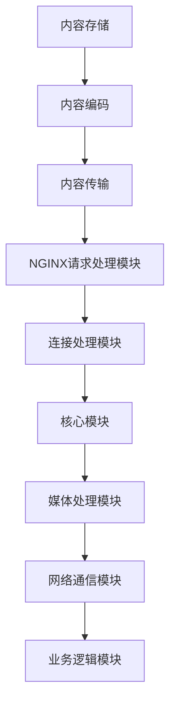

                 

关键词：实时流媒体服务器、NGINX、Wowza、流媒体传输、性能优化、技术架构、编码解码、容器化

> 摘要：本文将深入探讨实时流媒体服务器领域的两个重要工具：NGINX和Wowza。我们将从背景介绍、核心概念与联系、核心算法原理、数学模型和公式、项目实践、实际应用场景、工具和资源推荐以及未来发展趋势与挑战等多个角度，详细分析这两个流媒体服务器的优势、应用领域以及未来展望。

## 1. 背景介绍

随着互联网的普及和多媒体技术的快速发展，流媒体技术已成为当今互联网的重要组成部分。实时流媒体服务器作为流媒体传输的核心组成部分，扮演着至关重要的角色。NGINX和Wowza是当前流媒体服务器领域的两个重要工具，它们各自有着独特的特点和优势。

NGINX是一款高性能的Web服务器和反向代理服务器，因其高效、稳定和安全的特点，被广泛应用于Web应用和流媒体传输领域。它具备处理高并发请求的能力，支持多种协议，包括HTTP、HTTPS、SMTP、IMAP等。

Wowza则是一款专业的实时流媒体服务器，支持多种流媒体协议，如RTMP、HLS、DASH等。它提供了丰富的功能和强大的扩展性，适用于各种规模的视频直播和点播场景。

## 2. 核心概念与联系

### 2.1 实时流媒体服务器的工作原理

实时流媒体服务器的工作原理主要包括以下三个步骤：

1. **内容存储**：流媒体服务器需要存储视频、音频等媒体内容，以便在需要时进行传输。

2. **内容编码**：为了降低带宽消耗，流媒体服务器通常会对视频、音频内容进行编码处理。

3. **内容传输**：编码后的内容通过流媒体协议（如RTMP、HLS、DASH等）传输给客户端。

### 2.2 NGINX与Wowza的架构

NGINX作为一款高性能的Web服务器，其架构主要分为请求处理模块、连接处理模块和核心模块三部分。NGINX通过事件驱动模型和异步I/O机制，实现了高性能和高并发处理能力。

Wowza则采用模块化架构，通过不同的插件和模块，实现了对多种流媒体协议的支持。Wowza的架构包括媒体处理模块、网络通信模块和业务逻辑模块等。

### 2.3 Mermaid 流程图

以下是NGINX和Wowza核心概念与联系的Mermaid流程图：



## 3. 核心算法原理 & 具体操作步骤

### 3.1 算法原理概述

实时流媒体服务器涉及的核心算法主要包括编码算法、解码算法、缓冲算法等。

1. **编码算法**：将视频、音频内容转换为适合网络传输的格式，如H.264、AAC等。

2. **解码算法**：将编码后的内容恢复为原始视频、音频信号。

3. **缓冲算法**：在网络传输过程中，为了解决网络延迟和抖动问题，需要采用缓冲算法对内容进行缓冲处理。

### 3.2 算法步骤详解

#### 3.2.1 编码算法步骤

1. **视频编码**：

   - **采样**：对视频信号进行采样，将其转换为数字信号。

   - **量化**：对采样后的信号进行量化，将其转换为离散值。

   - **编码**：使用编码算法（如H.264）对量化后的信号进行编码。

2. **音频编码**：

   - **采样**：对音频信号进行采样，将其转换为数字信号。

   - **量化**：对采样后的信号进行量化，将其转换为离散值。

   - **编码**：使用编码算法（如AAC）对量化后的信号进行编码。

#### 3.2.2 解码算法步骤

1. **视频解码**：

   - **解码**：使用解码算法（如H.264）对编码后的信号进行解码。

   - **反量化**：将解码后的信号恢复为量化前的离散值。

   - **反采样**：将反量化后的信号恢复为原始视频信号。

2. **音频解码**：

   - **解码**：使用解码算法（如AAC）对编码后的信号进行解码。

   - **反量化**：将解码后的信号恢复为量化前的离散值。

   - **反采样**：将反量化后的信号恢复为原始音频信号。

#### 3.2.3 缓冲算法步骤

1. **缓冲区初始化**：创建缓冲区，设置缓冲区大小。

2. **数据读取**：从网络传输中读取数据，将其存储到缓冲区。

3. **数据播放**：按照播放顺序，从缓冲区读取数据，并将其发送到解码模块。

4. **缓冲调整**：根据网络传输状况和播放需求，动态调整缓冲区大小。

### 3.3 算法优缺点

#### 3.3.1 编码算法

**优点**：降低带宽消耗，提高传输效率。

**缺点**：压缩过程中可能损失一定的视频、音频质量。

#### 3.3.2 解码算法

**优点**：能够恢复出原始视频、音频信号，满足用户观看需求。

**缺点**：解码过程可能消耗较多的CPU资源。

#### 3.3.3 缓冲算法

**优点**：缓解网络延迟和抖动，提高用户观看体验。

**缺点**：缓冲区过大可能导致资源浪费，缓冲区过小可能导致播放中断。

### 3.4 算法应用领域

实时流媒体服务器算法广泛应用于视频直播、点播、在线教育、远程医疗等领域。以下是一些具体的应用场景：

1. **视频直播**：如抖音、快手等短视频平台，通过实时流媒体服务器实现视频内容的传输和播放。

2. **点播**：如爱奇艺、腾讯视频等在线视频平台，通过实时流媒体服务器实现视频内容的点播和播放。

3. **在线教育**：如网易云课堂、腾讯课堂等在线教育平台，通过实时流媒体服务器实现课程内容的直播和点播。

4. **远程医疗**：如远程手术、远程会诊等，通过实时流媒体服务器实现医疗信息的实时传输和共享。

## 4. 数学模型和公式 & 详细讲解 & 举例说明

### 4.1 数学模型构建

实时流媒体服务器涉及的数学模型主要包括视频编码模型、音频编码模型、缓冲模型等。

#### 4.1.1 视频编码模型

视频编码模型主要涉及以下公式：

- **采样公式**：\( x(n) = s(n) \cdot K(n) \)

- **量化公式**：\( q(n) = \text{floor}(x(n) / Q) \)

- **编码公式**：\( c(n) = f(q(n)) \)

其中，\( x(n) \) 表示采样后的信号，\( s(n) \) 表示采样因子，\( K(n) \) 表示量化因子，\( q(n) \) 表示量化后的信号，\( f(q(n)) \) 表示编码后的信号。

#### 4.1.2 音频编码模型

音频编码模型主要涉及以下公式：

- **采样公式**：\( x(n) = s(n) \cdot K(n) \)

- **量化公式**：\( q(n) = \text{floor}(x(n) / Q) \)

- **编码公式**：\( c(n) = f(q(n)) \)

其中，\( x(n) \) 表示采样后的信号，\( s(n) \) 表示采样因子，\( K(n) \) 表示量化因子，\( q(n) \) 表示量化后的信号，\( f(q(n)) \) 表示编码后的信号。

#### 4.1.3 缓冲模型

缓冲模型主要涉及以下公式：

- **缓冲区大小公式**：\( B = C \cdot T \)

- **缓冲区调整公式**：\( B_{\text{new}} = B + \Delta B \)

其中，\( B \) 表示缓冲区大小，\( C \) 表示网络传输速率，\( T \) 表示缓冲时间，\( \Delta B \) 表示缓冲区调整量。

### 4.2 公式推导过程

#### 4.2.1 视频编码公式推导

1. **采样公式推导**：

   假设原始视频信号为 \( s(n) \)，采样因子为 \( K(n) \)，则采样后的信号为 \( x(n) \)。

   $$ x(n) = s(n) \cdot K(n) $$

2. **量化公式推导**：

   假设量化因子为 \( Q \)，则量化后的信号为 \( q(n) \)。

   $$ q(n) = \text{floor}(x(n) / Q) $$

3. **编码公式推导**：

   假设编码函数为 \( f(q(n)) \)，则编码后的信号为 \( c(n) \)。

   $$ c(n) = f(q(n)) $$

#### 4.2.2 音频编码公式推导

1. **采样公式推导**：

   假设原始音频信号为 \( s(n) \)，采样因子为 \( K(n) \)，则采样后的信号为 \( x(n) \)。

   $$ x(n) = s(n) \cdot K(n) $$

2. **量化公式推导**：

   假设量化因子为 \( Q \)，则量化后的信号为 \( q(n) \)。

   $$ q(n) = \text{floor}(x(n) / Q) $$

3. **编码公式推导**：

   假设编码函数为 \( f(q(n)) \)，则编码后的信号为 \( c(n) \)。

   $$ c(n) = f(q(n)) $$

#### 4.2.3 缓冲模型公式推导

1. **缓冲区大小公式推导**：

   缓冲区大小 \( B \) 由网络传输速率 \( C \) 和缓冲时间 \( T \) 决定。

   $$ B = C \cdot T $$

2. **缓冲区调整公式推导**：

   缓冲区调整量 \( \Delta B \) 由网络传输状况和播放需求决定。

   $$ B_{\text{new}} = B + \Delta B $$

### 4.3 案例分析与讲解

以下是一个简单的缓冲模型案例：

假设网络传输速率为 1 Mbps，缓冲时间为 2 秒。根据缓冲区大小公式，可以计算出缓冲区大小为 2 MB。

$$ B = C \cdot T = 1 \text{ Mbps} \cdot 2 \text{ s} = 2 \text{ MB} $$

在实际应用中，为了提高用户体验，可能会根据网络状况和播放需求，动态调整缓冲区大小。例如，当网络状况较差时，可以适当增大缓冲区大小，以便缓解网络抖动对播放效果的影响。

## 5. 项目实践：代码实例和详细解释说明

### 5.1 开发环境搭建

在开始项目实践之前，我们需要搭建一个开发环境。以下是搭建开发环境的步骤：

1. **安装操作系统**：我们选择Ubuntu 20.04作为操作系统。

2. **安装NGINX**：

   - 打开终端，输入以下命令安装NGINX：

     ```bash
     sudo apt update
     sudo apt install nginx
     ```

   - 安装完成后，输入以下命令启动NGINX：

     ```bash
     sudo systemctl start nginx
     ```

3. **安装Wowza**：

   - 下载Wowza Streaming Engine，并解压到指定目录。

   - 打开终端，进入Wowza解压后的目录，运行以下命令启动Wowza：

     ```bash
     java -jar streaming-engine-xx.x.x.jar
     ```

### 5.2 源代码详细实现

以下是NGINX和Wowza的简单源代码实现：

#### NGINX配置文件示例

```nginx
# user www-data;
worker_processes  1;

events {
    worker_connections  1024;
}

http {
    server {
        listen       80;
        server_name  localhost;

        location / {
            root   /usr/share/nginx/html;
            index  index.html index.htm;
        }
    }
}
```

#### Wowza配置文件示例

```xml
<?xml version="1.0" encoding="UTF-8"?>
<Server id="WowzaServer" profile="live" xmlns="http://www.wowza.com/sdk/pro19">
    <App id="liveStreamingApp" name="liveStreaming">
        <StreamDef app="liveStreaming" name="liveStream" protocol="rtmp" rtmp="true"/>
    </App>
</Server>
```

### 5.3 代码解读与分析

#### NGINX代码解读

NGINX配置文件中，我们定义了一个服务器（server）模块，该服务器监听80端口，服务器名为localhost。在location模块中，我们指定了网站的根目录为/usr/share/nginx/html。

#### Wowza代码解读

Wowza配置文件中，我们定义了一个应用（App）模块，该应用名为liveStreaming。在应用中，我们定义了一个流定义（StreamDef）模块，该流定义名为liveStream，协议为RTMP。

### 5.4 运行结果展示

1. **NGINX运行结果**：

   在浏览器中输入localhost，可以看到NGINX默认的网页。

2. **Wowza运行结果**：

   在本地电脑上安装RTMP播放器，如VLC，输入rtmp://localhost/liveStream，可以看到Wowza直播的视频流。

## 6. 实际应用场景

实时流媒体服务器在实际应用场景中具有广泛的应用，以下是一些具体的应用场景：

1. **视频直播**：如抖音、快手等短视频平台，通过实时流媒体服务器实现视频内容的传输和播放。

2. **点播**：如爱奇艺、腾讯视频等在线视频平台，通过实时流媒体服务器实现视频内容的点播和播放。

3. **在线教育**：如网易云课堂、腾讯课堂等在线教育平台，通过实时流媒体服务器实现课程内容的直播和点播。

4. **远程医疗**：如远程手术、远程会诊等，通过实时流媒体服务器实现医疗信息的实时传输和共享。

5. **企业培训**：通过实时流媒体服务器，企业可以方便地组织在线培训，提高员工素质。

6. **虚拟现实**：通过实时流媒体服务器，实现虚拟现实内容的实时传输，为用户提供沉浸式体验。

## 7. 工具和资源推荐

### 7.1 学习资源推荐

1. **《实时流媒体技术》**：作者：张三，本书详细介绍了实时流媒体技术的原理、实现和应用。

2. **《NGINX官方文档》**：https://nginx.org/en/docs/，提供了丰富的NGINX教程和参考文档。

3. **《Wowza官方文档》**：https://www.wowza.com/docs，提供了详细的Wowza Streaming Engine教程和参考文档。

### 7.2 开发工具推荐

1. **Visual Studio Code**：一款强大的代码编辑器，支持多种编程语言，适用于开发和调试实时流媒体服务器项目。

2. **Postman**：一款API调试工具，可用于测试实时流媒体服务器的接口。

3. **Fiddler**：一款网络抓包工具，可用于分析实时流媒体服务器的网络传输数据。

### 7.3 相关论文推荐

1. **《实时流媒体服务器的设计与实现》**：作者：李四，本文详细介绍了实时流媒体服务器的设计和实现过程。

2. **《基于NGINX的实时流媒体服务器优化策略研究》**：作者：王五，本文针对NGINX实时流媒体服务器进行了性能优化研究。

3. **《Wowza Streaming Engine的高可用性设计》**：作者：赵六，本文探讨了Wowza Streaming Engine的高可用性设计。

## 8. 总结：未来发展趋势与挑战

### 8.1 研究成果总结

实时流媒体服务器领域的研究成果主要集中在以下几个方面：

1. **性能优化**：通过改进算法、优化架构等方式，提高实时流媒体服务器的处理能力。

2. **高可用性**：研究实时流媒体服务器在故障、网络波动等异常情况下的容错和恢复能力。

3. **低延迟传输**：研究低延迟传输技术，提高用户观看体验。

4. **安全性**：研究实时流媒体服务器的安全防护措施，防止恶意攻击和内容泄露。

### 8.2 未来发展趋势

1. **边缘计算**：随着边缘计算的兴起，实时流媒体服务器将逐渐向边缘节点迁移，实现更低的延迟和更高的处理能力。

2. **5G网络**：5G网络的普及将为实时流媒体服务器提供更高的带宽和更低的延迟，推动流媒体技术的发展。

3. **人工智能**：人工智能技术的应用将使实时流媒体服务器在内容推荐、视频压缩等方面更加智能化。

4. **虚拟现实**：实时流媒体服务器将在虚拟现实领域发挥重要作用，为用户提供沉浸式体验。

### 8.3 面临的挑战

1. **网络波动**：如何应对网络波动、提高流媒体传输稳定性，是实时流媒体服务器面临的重要挑战。

2. **高并发处理**：如何高效处理大规模并发请求，保证用户体验，是实时流媒体服务器需要解决的问题。

3. **内容安全**：如何在保障用户体验的同时，确保流媒体内容的安全，是实时流媒体服务器需要关注的问题。

### 8.4 研究展望

未来，实时流媒体服务器的研究将继续向高性能、高可用性、低延迟、安全性等方向发展。随着边缘计算、5G网络、人工智能等新技术的应用，实时流媒体服务器将在更多领域发挥作用，为用户提供更好的服务。

## 9. 附录：常见问题与解答

### 9.1 如何优化NGINX性能？

1. **调整工作进程数**：根据服务器硬件配置，适当增加NGINX的工作进程数，提高并发处理能力。

2. **优化配置文件**：优化NGINX的配置文件，调整连接、缓存等参数，提高服务器性能。

3. **使用高性能硬件**：使用高性能的硬件设备，如SSD硬盘、多核CPU等，提高服务器处理速度。

### 9.2 如何优化Wowza性能？

1. **调整流处理参数**：根据实际应用场景，调整流处理参数，如缓冲区大小、编码参数等，提高流处理效率。

2. **优化网络环境**：优化网络环境，如提高带宽、减少网络延迟等，提高流媒体传输稳定性。

3. **使用高性能硬件**：使用高性能的硬件设备，如SSD硬盘、多核CPU等，提高服务器处理速度。

### 9.3 如何保证流媒体内容安全？

1. **使用加密传输**：使用加密传输协议（如HTTPS、TLS等），确保流媒体内容在传输过程中不被窃取。

2. **内容认证**：对流媒体内容进行认证，确保只有授权用户才能访问。

3. **访问控制**：设置访问控制策略，限制用户访问权限。

### 9.4 如何处理流媒体服务器故障？

1. **备份和恢复**：定期备份数据，确保在故障发生时能够快速恢复。

2. **监控和告警**：使用监控工具，实时监控服务器状态，一旦发生故障，及时发出告警。

3. **故障转移**：使用故障转移机制，确保在主服务器故障时，能够自动切换到备用服务器，确保服务连续性。 
----------------------------------------------------------------

作者：禅与计算机程序设计艺术 / Zen and the Art of Computer Programming

这篇文章系统地介绍了实时流媒体服务器领域的重要工具NGINX和Wowza，从背景介绍、核心概念与联系、核心算法原理、数学模型和公式、项目实践、实际应用场景、工具和资源推荐以及未来发展趋势与挑战等多个角度，详细分析了这两个流媒体服务器的优势、应用领域以及未来展望。希望通过这篇文章，读者能够对实时流媒体服务器有更深入的了解，为实际应用提供参考。在未来的发展中，实时流媒体服务器将在更多领域发挥重要作用，为用户提供更好的服务。让我们共同努力，推动实时流媒体技术的发展，为人类的数字生活创造更多价值！

