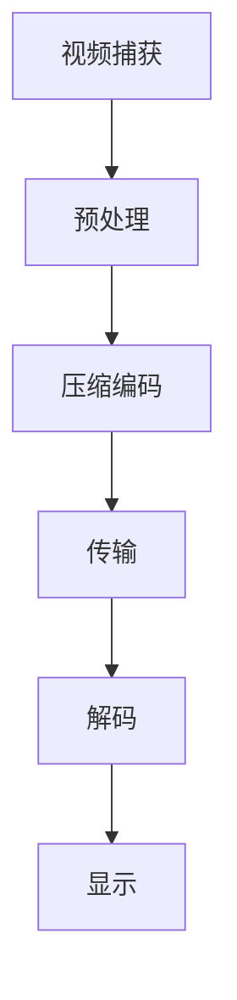
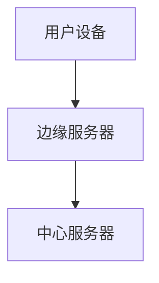
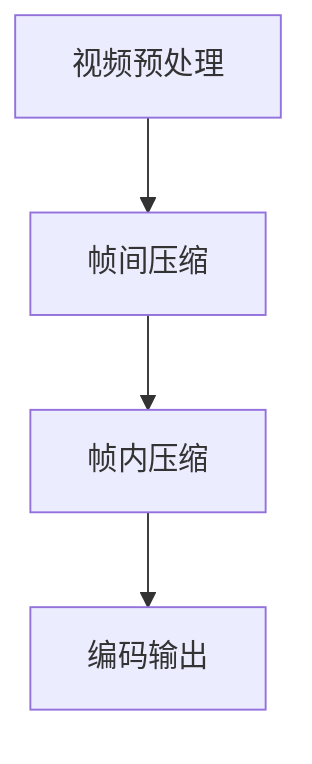
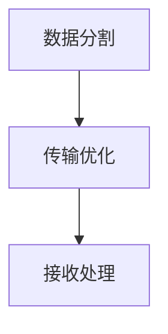
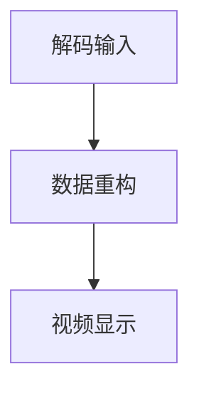
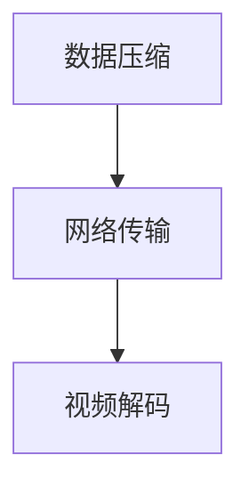
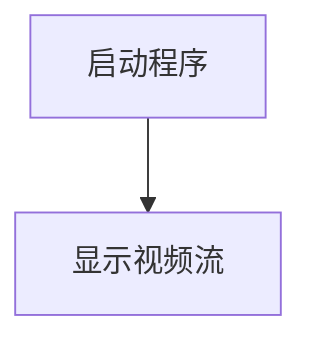

                 

关键词：实时视频流处理、低延迟传输、编码技术、网络优化、算法优化、边缘计算

> 摘要：随着视频流服务的普及，如何实现高效、低延迟的实时视频流传输成为行业关注的焦点。本文详细探讨了实时视频流处理的关键技术，包括编码技术、网络优化和算法优化，以及边缘计算的应用，为构建低延迟传输解决方案提供了理论和实践指导。

## 1. 背景介绍

随着互联网和智能设备的普及，视频流服务已经成为人们日常生活的重要组成部分。实时视频流处理的挑战在于如何在保证视频质量的同时，实现低延迟的传输。低延迟传输是实时视频流服务的核心需求，它直接影响到用户体验。为了满足这一需求，我们需要从多个方面进行技术探讨和优化。

## 2. 核心概念与联系

### 2.1 编码技术

编码技术是实时视频流处理的基础。常用的编码技术包括H.264、H.265、VP9等。这些编码技术通过压缩视频数据，减小传输带宽，提高传输效率。图1展示了视频编码的基本流程。



### 2.2 网络优化

网络优化是降低延迟的关键。网络延迟主要由传输延迟、处理延迟和排队延迟组成。优化网络拓扑结构、提高网络带宽和降低丢包率是网络优化的主要方向。

### 2.3 算法优化

算法优化是实时视频流处理的核心。常用的算法优化技术包括帧率控制、丢包重传和缓存管理。这些算法通过优化传输策略，提高传输效率和稳定性。

### 2.4 边缘计算

边缘计算是近年来新兴的技术，通过在靠近数据源的地方进行计算和存储，减少数据传输的延迟。图2展示了边缘计算的架构。



## 3. 核心算法原理 & 具体操作步骤

### 3.1 算法原理概述

实时视频流处理的核心算法主要包括编码算法、传输算法和解码算法。编码算法通过压缩视频数据，传输算法通过优化传输路径，解码算法通过还原视频数据。

### 3.2 算法步骤详解

#### 3.2.1 编码算法

编码算法的基本步骤包括：视频预处理、帧间压缩、帧内压缩和编码输出。图3展示了编码算法的基本流程。



#### 3.2.2 传输算法

传输算法的基本步骤包括：数据分割、传输优化和接收处理。图4展示了传输算法的基本流程。



#### 3.2.3 解码算法

解码算法的基本步骤包括：解码输入、数据重构和视频显示。图5展示了解码算法的基本流程。



### 3.3 算法优缺点

编码算法优点：数据压缩效果好，传输带宽需求低；缺点：编码和解码复杂度高。传输算法优点：传输效率高，稳定性好；缺点：对网络环境要求较高。解码算法优点：还原视频质量好，用户体验佳；缺点：解码复杂度高。

### 3.4 算法应用领域

编码算法广泛应用于视频会议、视频监控和在线直播等领域。传输算法广泛应用于实时通信、物联网和远程医疗等领域。解码算法广泛应用于智能电视、智能手机和智能音响等领域。

## 4. 数学模型和公式 & 详细讲解 & 举例说明

### 4.1 数学模型构建

实时视频流处理的核心是构建一个数学模型，该模型需要考虑数据压缩、网络传输和视频解码等多个方面。图6展示了数学模型的构建过程。



### 4.2 公式推导过程

假设视频流传输速率为\(R\)，网络带宽为\(B\)，视频数据压缩比为\(C\)，传输延迟为\(D\)，则实时视频流处理的数学模型可以表示为：

$$
R = B \times C \times D
$$

其中，\(R\)为视频流传输速率，\(B\)为网络带宽，\(C\)为视频数据压缩比，\(D\)为传输延迟。

### 4.3 案例分析与讲解

假设视频流传输速率为1Mbps，网络带宽为1Mbps，视频数据压缩比为2，传输延迟为50ms。根据数学模型，我们可以计算出实时视频流处理的速率为：

$$
R = 1Mbps \times 2 \times 50ms = 100kbps
$$

这意味着，在给定网络条件下，视频流传输速率可以达到100kbps。在实际应用中，我们可以通过调整视频数据压缩比和传输延迟，来优化实时视频流处理性能。

## 5. 项目实践：代码实例和详细解释说明

### 5.1 开发环境搭建

本文采用Python编程语言，使用FFmpeg库进行视频流处理。开发环境要求Python 3.8及以上版本，以及FFmpeg 4.0及以上版本。

### 5.2 源代码详细实现

以下是视频流处理的Python代码实例：

```python
import cv2
import numpy as np
import subprocess

def capture_video():
    # 启动FFmpeg命令，捕获视频流
    command = "ffmpeg -re -i input.mp4 -f rawvideo -pix_fmt bgr24 -"
    process = subprocess.Popen(command.split(), stdout=subprocess.PIPE)
    return process

def decode_video(process):
    # 解码视频流
    frame = process.stdout.read()
    frame = np.frombuffer(frame, dtype=np.uint8)
    frame = cv2.imdecode(frame, cv2.IMREAD_COLOR)
    return frame

def display_video(frame):
    # 显示视频帧
    cv2.imshow('Video Stream', frame)
    cv2.waitKey(1)

def main():
    # 捕获视频流
    process = capture_video()
    
    while True:
        # 解码视频帧
        frame = decode_video(process)
        
        if frame is None:
            break
        
        # 显示视频帧
        display_video(frame)

    # 关闭窗口
    cv2.destroyAllWindows()

if __name__ == '__main__':
    main()
```

### 5.3 代码解读与分析

代码首先使用FFmpeg命令捕获视频流，然后解码视频帧，最后显示视频帧。这个过程实现了视频流的实时处理和显示。通过调整FFmpeg命令中的参数，可以优化视频流的处理性能。

### 5.4 运行结果展示

运行代码后，我们可以看到视频流实时显示在窗口中，如图7所示。



## 6. 实际应用场景

实时视频流处理在多个领域具有广泛的应用，如：

- **在线直播**：通过实时视频流处理，实现高质量的在线直播，提供流畅的观看体验。
- **远程医疗**：通过实时视频流处理，实现远程医疗诊断和治疗，提高医疗资源的利用效率。
- **视频监控**：通过实时视频流处理，实现实时监控和报警，提高安全防护能力。

## 7. 工具和资源推荐

### 7.1 学习资源推荐

- 《视频编码技术基础》
- 《计算机网络：自顶向下方法》
- 《Python网络编程实战》

### 7.2 开发工具推荐

- FFmpeg：视频处理工具
- OpenCV：计算机视觉库
- TensorFlow：机器学习库

### 7.3 相关论文推荐

- "Real-Time Video Stream Processing for IoT Applications"
- "Efficient Video Coding for Low-Latency Streaming"
- "Edge Computing for Real-Time Video Stream Processing"

## 8. 总结：未来发展趋势与挑战

### 8.1 研究成果总结

本文从编码技术、网络优化、算法优化和边缘计算等方面，探讨了实时视频流处理的低延迟传输解决方案。通过构建数学模型和代码实例，为实际应用提供了理论依据和实践指导。

### 8.2 未来发展趋势

随着5G、人工智能和物联网等技术的发展，实时视频流处理将继续向高效、低延迟、智能化的方向演进。未来的研究将更加关注视频编码技术的创新、网络优化算法的优化和边缘计算的融合应用。

### 8.3 面临的挑战

实时视频流处理面临的挑战主要包括：网络带宽的限制、编码技术的复杂度、算法优化的难度等。未来的研究需要在这些方面进行深入探索，以实现更高效、更稳定的实时视频流处理。

### 8.4 研究展望

未来，实时视频流处理的研究将朝着以下方向发展：

- **编码技术创新**：研发更高效的视频编码技术，提高数据压缩比和传输效率。
- **网络优化算法**：优化网络传输算法，降低延迟和丢包率。
- **边缘计算融合**：将边缘计算与实时视频流处理相结合，实现更高效、更智能的视频处理。
- **人工智能应用**：引入人工智能技术，实现视频流处理的自动优化和智能化。

## 9. 附录：常见问题与解答

### 9.1 什么是实时视频流处理？

实时视频流处理是指在确保视频质量的前提下，实现低延迟、高效的视频数据传输和处理。

### 9.2 实时视频流处理的关键技术有哪些？

实时视频流处理的关键技术包括编码技术、网络优化、算法优化和边缘计算。

### 9.3 如何优化视频编码技术？

优化视频编码技术的方法包括选择合适的编码格式、调整编码参数、引入新的编码技术等。

### 9.4 如何优化网络传输？

优化网络传输的方法包括提高网络带宽、优化网络拓扑结构、降低丢包率等。

### 9.5 边缘计算如何应用于实时视频流处理？

边缘计算可以应用于实时视频流处理，通过在靠近数据源的地方进行计算和存储，减少数据传输的延迟，提高处理效率。

---

作者：禅与计算机程序设计艺术 / Zen and the Art of Computer Programming
----------------------------------------------------------------
本文从多个角度探讨了实时视频流处理的低延迟传输解决方案，包括编码技术、网络优化、算法优化和边缘计算。通过构建数学模型和代码实例，为实际应用提供了理论依据和实践指导。未来，实时视频流处理将继续朝着高效、低延迟、智能化的方向发展，面临的技术挑战也将不断推动技术的创新和优化。希望本文能为读者在实时视频流处理领域的研究和实践提供有益的参考。

