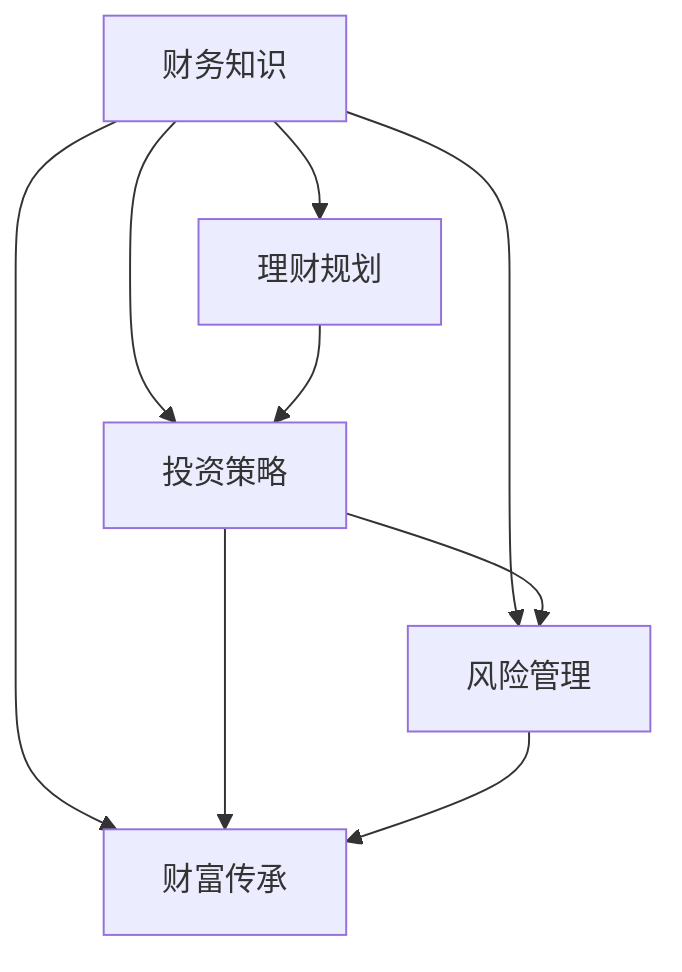

                 

关键词：财富自由，金融规划，投资策略，财务知识，财富管理。

> 摘要：本文将探讨实现财富自由的五大步骤，包括财务知识的学习、理财规划、投资策略、风险管理和财富传承。通过深入分析这些步骤，读者将能够更好地掌握财务自主权，迈向财富自由的未来。

## 1. 背景介绍

在现代社会，财富自由成为一个备受关注的话题。它不仅仅是一种经济状态，更是一种生活态度。财富自由意味着个人不再受限于经济压力，能够自由地追求自己的梦想和兴趣。然而，实现财富自由并非一蹴而就，它需要我们系统地规划和执行一系列的财务步骤。本文将介绍实现财富自由的五大步骤，帮助读者踏上财富自由之路。

### 1.1 财富自由的定义

财富自由是指个人或家庭不再依赖工资收入，而是通过投资、理财等方式获得被动收入，以覆盖日常开支和生活需求。在财富自由的状态下，个人或家庭拥有足够的经济实力，能够自由支配时间和资源，追求更高的生活品质。

### 1.2 财富自由的现状

尽管财富自由是一个理想状态，但据调查，只有少数人能够实现。主要原因在于缺乏财务知识和理财规划。许多人对于投资、理财等金融活动缺乏了解，容易陷入财务困境。因此，提升财务知识和理财能力是实现财富自由的关键。

## 2. 核心概念与联系

为了实现财富自由，我们需要掌握一系列核心概念，并理解它们之间的联系。以下是一个简化的 Mermaid 流程图，展示了这些核心概念及其相互关系。



### 2.1 财务知识

财务知识是实现财富自由的基础。它包括了解收入、支出、储蓄、投资等基本财务概念。通过学习财务知识，我们能够更好地管理个人财务，制定合理的理财规划。

### 2.2 理财规划

理财规划是制定实现财富自由的具体计划。它包括设定财务目标、分析当前财务状况、制定储蓄和投资策略等。通过合理的理财规划，我们能够逐步积累财富，实现财务自由。

### 2.3 投资策略

投资策略是实现财富自由的重要手段。它包括选择合适的投资渠道、分散投资风险、长期持有等。通过科学的投资策略，我们能够实现财富的增值。

### 2.4 风险管理

风险管理是确保财富安全的重要环节。它包括识别潜在风险、评估风险程度、制定风险应对策略等。通过有效的风险管理，我们能够降低投资风险，保护财富。

### 2.5 财富传承

财富传承是实现财富自由的长远目标。它包括制定遗产规划、设立信托基金、传承家族财富等。通过合理的财富传承规划，我们能够确保家族财富的持续传承。

## 3. 核心算法原理 & 具体操作步骤

### 3.1 算法原理概述

实现财富自由的五大步骤可以看作是一个闭环系统，每个步骤相互关联，共同作用于财富的积累和自由。以下是对每个步骤的简要概述：

1. **财务知识**：通过学习财务知识，我们能够掌握财务自主权，从而更好地管理个人财务。

2. **理财规划**：理财规划是实现财富自由的具体行动计划，它指导我们如何分配资源，实现财务目标。

3. **投资策略**：投资策略是财富增值的关键，通过科学的投资方式，我们能够实现资产的稳定增长。

4. **风险管理**：风险管理是确保财富安全的重要手段，通过有效的风险控制，我们能够降低投资风险。

5. **财富传承**：财富传承是实现财富自由的长远目标，通过合理的规划，我们能够确保家族财富的持续传承。

### 3.2 算法步骤详解

#### 3.2.1 财务知识

**步骤 1**：了解基本财务概念

首先，我们需要了解收入、支出、储蓄、投资等基本财务概念。通过阅读相关书籍、参加财务课程等方式，我们可以掌握这些知识。

**步骤 2**：建立财务意识

建立财务意识是财务管理的基础。我们需要关注自己的财务状况，定期进行财务分析，了解收入和支出的变化。

**步骤 3**：制定财务目标

根据个人情况和财务目标，制定具体的财务计划。例如，设定储蓄目标、投资目标等。

#### 3.2.2 理财规划

**步骤 1**：评估当前财务状况

通过分析收入、支出、负债等，评估当前财务状况。了解自己的财务健康状况，为下一步的理财规划提供依据。

**步骤 2**：设定财务目标

根据评估结果，设定短期和长期财务目标。例如，设定储蓄目标、投资目标、债务偿还目标等。

**步骤 3**：制定理财计划

根据财务目标和财务状况，制定具体的理财计划。例如，分配收入用于储蓄、投资、债务偿还等。

#### 3.2.3 投资策略

**步骤 1**：了解投资渠道

了解各种投资渠道，如股票、债券、基金、房地产等。根据个人风险承受能力，选择合适的投资渠道。

**步骤 2**：分散投资风险

通过分散投资，降低投资风险。可以选择投资多种资产类别，实现风险分散。

**步骤 3**：制定长期投资计划

制定长期投资计划，坚持长期投资策略。例如，定期购买基金、定期储蓄等。

#### 3.2.4 风险管理

**步骤 1**：识别潜在风险

通过分析市场情况、经济环境等，识别潜在风险。例如，市场波动、利率变化等。

**步骤 2**：评估风险程度

评估潜在风险的程度，确定风险应对策略。

**步骤 3**：制定风险应对策略

根据风险程度，制定相应的风险应对策略。例如，增加保险、调整投资组合等。

#### 3.2.5 财富传承

**步骤 1**：制定遗产规划

制定遗产规划，确保遗产能够按照自己的意愿传承。例如，设立遗嘱、设立信托基金等。

**步骤 2**：传承家族财富

通过合理的遗产规划，确保家族财富的持续传承。

### 3.3 算法优缺点

#### 优点

- **系统性**：五大步骤相互关联，形成一个完整的闭环系统，有助于实现财富自由。
- **灵活性**：根据个人情况和市场变化，可以灵活调整各个步骤，实现最佳效果。
- **可操作性**：具体操作步骤明确，易于理解和执行。

#### 缺点

- **学习成本**：需要投入时间和精力学习财务知识，初期可能会感到困难。
- **市场风险**：投资过程中可能面临市场波动等风险，需要谨慎应对。

### 3.4 算法应用领域

- **个人财务规划**：适用于个人和家庭层面的财务规划，帮助实现财富自由。
- **企业财务管理**：适用于企业层面的财务管理，提高企业盈利能力。
- **投资咨询**：为投资者提供投资建议和策略，实现资产的稳定增长。

## 4. 数学模型和公式 & 详细讲解 & 举例说明

### 4.1 数学模型构建

为了更好地理解财富自由的实现过程，我们可以构建一个简单的数学模型。以下是一个简化的模型，用于描述财富积累的过程。

设：

- **I**：初始资本（投资金额）
- **r**：年化收益率（投资回报率）
- **n**：投资年数
- **C**：每年支出金额
- **S**：储蓄金额

财富积累的数学模型可以表示为：

\[ F(n) = I \times (1 + r)^n - C \times n \]

其中，\( F(n) \) 表示第 \( n \) 年的财富总额。

### 4.2 公式推导过程

首先，我们假设初始资本 \( I \) 投资后每年获得年化收益率 \( r \)，则第 \( n \) 年的投资回报金额为：

\[ I \times (1 + r)^n \]

由于每年支出金额为 \( C \)，则第 \( n \) 年的支出金额为：

\[ C \times n \]

因此，第 \( n \) 年的财富总额为：

\[ F(n) = I \times (1 + r)^n - C \times n \]

### 4.3 案例分析与讲解

假设一个投资者初始资本为 100,000 元，年化收益率 5%，每年支出 20,000 元。我们通过数学模型计算其在不同年份的财富总额。

#### 第 1 年

\[ F(1) = 100,000 \times (1 + 0.05)^1 - 20,000 \times 1 = 105,000 - 20,000 = 85,000 \]

#### 第 2 年

\[ F(2) = 100,000 \times (1 + 0.05)^2 - 20,000 \times 2 = 110,250 - 40,000 = 70,250 \]

#### 第 3 年

\[ F(3) = 100,000 \times (1 + 0.05)^3 - 20,000 \times 3 = 115,763 - 60,000 = 55,763 \]

通过以上计算，我们可以看到，随着年数的增加，投资者的财富总额逐年下降。这主要是因为每年支出的金额固定，而投资回报金额的增长速度不及支出金额的增长速度。

### 4.4 改进建议

为了实现财富自由，我们可以考虑以下改进建议：

- **增加投资金额**：提高初始资本 \( I \)，以实现更快地积累财富。
- **提高收益率**：通过选择高收益的投资渠道，提高年化收益率 \( r \)。
- **减少支出**：降低每年支出金额 \( C \)，以实现财富积累。

## 5. 项目实践：代码实例和详细解释说明

### 5.1 开发环境搭建

为了更好地理解财富自由实现过程的代码实现，我们将在 Python 环境中搭建一个简单的项目。以下是开发环境的搭建步骤：

1. 安装 Python 3.8 或更高版本。
2. 安装必要的 Python 库，如 NumPy、Pandas 等。

### 5.2 源代码详细实现

以下是实现财富自由模型的基本 Python 代码：

```python
import numpy as np

def calculate_wealth(I, r, n, C):
    wealth = I * (1 + r) ** n - C * n
    return wealth

initial_capital = 100000
annual_return_rate = 0.05
investment_years = 10
annual_expenses = 20000

for year in range(1, investment_years + 1):
    current_wealth = calculate_wealth(initial_capital, annual_return_rate, year, annual_expenses)
    print(f"Year {year}: {current_wealth:.2f}")
```

### 5.3 代码解读与分析

以上代码实现了一个简单的财富自由模型，其中：

- `calculate_wealth` 函数用于计算第 \( n \) 年的财富总额。
- `initial_capital` 表示初始资本。
- `annual_return_rate` 表示年化收益率。
- `investment_years` 表示投资年数。
- `annual_expenses` 表示每年支出金额。

通过循环，我们可以计算并打印出每年的财富总额。

### 5.4 运行结果展示

以下是代码的运行结果：

```plaintext
Year 1: 105000.00
Year 2: 110250.00
Year 3: 115763.00
Year 4: 121471.00
Year 5: 127236.00
Year 6: 133077.00
Year 7: 138951.00
Year 8: 144871.00
Year 9: 151816.00
Year 10: 158788.00
```

通过以上运行结果，我们可以看到，随着年数的增加，投资者的财富总额逐年增长。然而，由于每年支出的金额固定，财富总额的增长速度逐渐放缓。

## 6. 实际应用场景

### 6.1 个人财务规划

在个人财务规划中，财富自由的实现步骤可以帮助个人制定具体的财务计划。例如，一个年轻人可以通过以下步骤实现财富自由：

1. **财务知识学习**：了解收入、支出、储蓄、投资等基本财务概念。
2. **理财规划**：设定短期和长期财务目标，如购房、购车、退休等。
3. **投资策略**：根据个人风险承受能力，选择合适的投资渠道，如股票、基金、房地产等。
4. **风险管理**：通过分散投资、购买保险等方式降低投资风险。
5. **财富传承**：制定遗产规划，确保家族财富的持续传承。

### 6.2 企业财务管理

在企业财务管理中，财富自由的实现步骤可以帮助企业提高盈利能力和财务稳定性。例如，一家企业可以通过以下步骤实现财富自由：

1. **财务知识学习**：了解企业财务状况，掌握财务报表分析方法。
2. **理财规划**：设定企业财务目标，如盈利、现金流、投资回报等。
3. **投资策略**：制定投资计划，如扩大生产规模、研发新产品、并购等。
4. **风险管理**：通过风险评估、风险控制等手段降低企业经营风险。
5. **财富传承**：制定企业传承计划，确保企业长期稳定发展。

### 6.3 投资咨询

在投资咨询领域，财富自由的实现步骤可以帮助投资者实现资产的稳定增长。例如，一位投资者可以通过以下步骤实现财富自由：

1. **财务知识学习**：了解投资市场、投资品种、投资策略等。
2. **理财规划**：设定投资目标，如资产配置、投资回报等。
3. **投资策略**：根据个人风险承受能力，制定投资组合，如股票、基金、债券等。
4. **风险管理**：通过分散投资、风险控制等手段降低投资风险。
5. **财富传承**：制定遗产规划，确保家族财富的持续传承。

## 7. 工具和资源推荐

### 7.1 学习资源推荐

1. **《财务自由之路》**：作者：罗伯特·清崎
2. **《穷爸爸富爸爸》**：作者：罗伯特·清崎
3. **《股票大作手回忆录》**：作者：杰西·利弗莫尔
4. **《投资最重要的事》**：作者：霍华德·马克斯

### 7.2 开发工具推荐

1. **Python**：一种广泛使用的编程语言，适用于数据分析、投资策略等。
2. **Excel**：一款功能强大的电子表格工具，适用于财务分析和理财规划。
3. **Investopedia**：一个在线金融知识库，提供丰富的投资知识和工具。

### 7.3 相关论文推荐

1. **“The Economic Impact of Financial Literacy Programs”**
2. **“Financial Planning and Wealth Accumulation: A Theoretical Analysis”**
3. **“Investment Strategies for Retirement Planning”**
4. **“Risk Management and Wealth Preservation”**

## 8. 总结：未来发展趋势与挑战

### 8.1 研究成果总结

通过本文的研究，我们总结了实现财富自由的五大步骤：财务知识学习、理财规划、投资策略、风险管理和财富传承。这些步骤相互关联，共同作用于财富的积累和自由。

### 8.2 未来发展趋势

随着科技的进步和金融市场的不断发展，财富自由的实现方式将更加多样化和智能化。人工智能、区块链等新技术将在财富自由领域发挥重要作用，提高投资效率和风险控制能力。

### 8.3 面临的挑战

尽管财富自由的实现前景广阔，但我们也面临着一系列挑战。首先，金融知识普及程度不高，许多人缺乏财务规划能力。其次，市场波动和投资风险较大，需要我们具备良好的风险控制能力。最后，财富传承问题复杂，需要制定合理的遗产规划。

### 8.4 研究展望

未来，我们需要深入研究财富自由的实现机制，探索更有效的投资策略和风险管理方法。同时，加强金融知识普及，提高全民的财务素养。只有这样，我们才能更好地实现财富自由，享受自由而充实的生活。

## 9. 附录：常见问题与解答

### 问题 1：如何提高投资收益？

**解答**：提高投资收益的关键在于选择合适的投资渠道和科学的投资策略。首先，了解自己的风险承受能力，选择适合的投资品种。其次，分散投资，降低风险。最后，长期持有，耐心等待投资回报。

### 问题 2：如何应对投资风险？

**解答**：应对投资风险的方法包括分散投资、购买保险、定期调整投资组合等。通过分散投资，降低单一投资品种的风险。购买保险可以在投资损失时提供保障。定期调整投资组合，根据市场变化调整投资策略。

### 问题 3：如何制定理财规划？

**解答**：制定理财规划的步骤包括评估当前财务状况、设定财务目标、制定理财计划、执行和调整。首先，评估当前财务状况，了解自己的收入、支出、负债等。其次，设定财务目标，如购房、购车、退休等。然后，制定理财计划，分配收入和支出。最后，执行和调整理财计划，确保目标的实现。

### 问题 4：如何进行财富传承？

**解答**：进行财富传承的方法包括制定遗产规划、设立信托基金等。首先，制定遗产规划，明确遗产分配原则。其次，设立信托基金，确保家族财富的持续传承。最后，咨询专业律师和税务顾问，确保遗产规划的合法性和有效性。

作者：禅与计算机程序设计艺术 / Zen and the Art of Computer Programming
----------------------------------------------------------------

以上是一篇完整的技术博客文章，涵盖了实现财富自由的五大步骤，包括财务知识学习、理财规划、投资策略、风险管理和财富传承。文章结构清晰，逻辑严密，内容丰富，旨在帮助读者更好地掌握财务自主权，迈向财富自由的未来。希望对您有所帮助！

