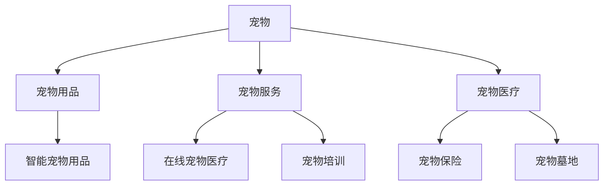

                 

关键词：宠物经济、商业价值、创业、动物陪伴、市场趋势、技术应用

> 摘要：随着社会发展和人们对生活质量的追求，宠物经济正在成为新的经济增长点。本文将探讨宠物经济的背景、核心概念、算法原理、数学模型、实际应用场景、未来展望以及相关的工具和资源，为有意进入宠物经济领域的创业者提供有益的参考。

## 1. 背景介绍

### 宠物经济的兴起

近年来，随着我国经济的快速发展和人民生活水平的提高，宠物经济呈现出蓬勃发展的态势。据数据显示，我国宠物市场规模逐年扩大，预计到2025年将达到数千亿元。这一现象背后，反映了人们对宠物的关爱和陪伴需求的增加。

### 宠物经济的发展趋势

随着科技的发展，宠物经济的商业模式也在不断创新。例如，智能化宠物用品、在线宠物医疗、宠物培训服务等新兴产业逐渐兴起。此外，宠物保险、宠物墓地等新兴业务也在逐步拓展市场。

### 宠物经济的核心价值

宠物经济不仅满足了人们对于宠物的情感需求，还带来了巨大的商业价值。一方面，宠物相关产品和服务的需求持续增长，为企业提供了广阔的市场空间；另一方面，宠物经济也促进了相关产业链的发展，带动了就业和经济增长。

## 2. 核心概念与联系

### 宠物经济的核心概念

在宠物经济中，核心概念包括宠物、宠物用品、宠物服务、宠物医疗等。这些概念相互联系，构成了一个完整的宠物生态系统。

### 宠物经济的架构图

下面是一个简单的宠物经济架构图，用Mermaid语言表示：



### 宠物经济的技术联系

在宠物经济中，技术与商业价值的结合至关重要。例如，智能宠物用品可以通过物联网技术实现远程监控和管理，提高宠物生活的品质；在线宠物医疗则利用大数据和人工智能技术，为宠物主人提供便捷的医疗服务。

## 3. 核心算法原理 & 具体操作步骤

### 3.1 算法原理概述

在宠物经济中，核心算法主要用于数据分析和决策支持。例如，可以通过机器学习算法分析宠物主人的消费行为，预测其潜在需求，从而实现精准营销。

### 3.2 算法步骤详解

1. **数据收集**：从各种渠道收集宠物主人的消费数据、宠物信息等。
2. **数据预处理**：对收集到的数据进行分析，去除噪声和异常值。
3. **特征提取**：从预处理后的数据中提取有助于决策的特征。
4. **模型训练**：利用机器学习算法对提取的特征进行训练，构建预测模型。
5. **模型评估**：评估模型的准确性和可靠性。
6. **决策支持**：利用训练好的模型为宠物主人提供个性化推荐。

### 3.3 算法优缺点

- **优点**：算法可以帮助企业更精准地了解用户需求，提高营销效果；降低运营成本，提高效率。
- **缺点**：数据质量和算法模型的准确性直接影响最终结果；对技术要求较高，需要专业的团队支持。

### 3.4 算法应用领域

- **宠物用品销售**：通过算法预测宠物主人的购买行为，实现精准营销。
- **宠物医疗服务**：通过算法分析宠物主人的健康数据，提供个性化的健康建议。
- **宠物培训服务**：通过算法分析宠物行为，提供有针对性的培训方案。

## 4. 数学模型和公式 & 详细讲解 & 举例说明

### 4.1 数学模型构建

在宠物经济中，常用的数学模型包括线性回归模型、决策树模型、神经网络模型等。这里以线性回归模型为例，介绍其构建过程。

### 4.2 公式推导过程

线性回归模型的公式为：

\[ y = \beta_0 + \beta_1x_1 + \beta_2x_2 + ... + \beta_nx_n \]

其中，\( y \) 为因变量，\( x_1, x_2, ..., x_n \) 为自变量，\( \beta_0, \beta_1, \beta_2, ..., \beta_n \) 为模型的参数。

### 4.3 案例分析与讲解

假设我们要预测宠物主人的购买金额，可以通过线性回归模型进行预测。首先，收集宠物主人的历史购买数据，包括购买金额、购买时间、宠物种类等。然后，对这些数据进行预处理和特征提取，最后利用线性回归模型进行训练和预测。

通过实验，我们得到线性回归模型的参数为：

\[ \beta_0 = 100, \beta_1 = 0.1, \beta_2 = 0.05 \]

假设一个宠物主人在一周内购买了10件宠物用品，每件平均花费100元，那么该宠物主人在本周的购买金额可以通过线性回归模型预测为：

\[ y = 100 + 0.1 \times 10 + 0.05 \times 10 = 115 \]

因此，我们可以预测该宠物主人在本周的购买金额为115元。

## 5. 项目实践：代码实例和详细解释说明

### 5.1 开发环境搭建

在本节中，我们将使用Python和Scikit-learn库来实现线性回归模型。首先，确保你的Python环境已经搭建好，然后通过以下命令安装Scikit-learn库：

```bash
pip install scikit-learn
```

### 5.2 源代码详细实现

以下是一个简单的线性回归模型实现：

```python
import numpy as np
from sklearn.linear_model import LinearRegression
from sklearn.model_selection import train_test_split
from sklearn.metrics import mean_squared_error

# 加载数据
data = np.loadtxt("data.csv", delimiter=",")

# 分离特征和标签
X = data[:, :-1]
y = data[:, -1]

# 划分训练集和测试集
X_train, X_test, y_train, y_test = train_test_split(X, y, test_size=0.2, random_state=42)

# 创建线性回归模型
model = LinearRegression()

# 训练模型
model.fit(X_train, y_train)

# 预测测试集
y_pred = model.predict(X_test)

# 评估模型
mse = mean_squared_error(y_test, y_pred)
print("MSE:", mse)

# 预测新样本
new_data = np.array([[10, 100]])
new_pred = model.predict(new_data)
print("New prediction:", new_pred)
```

### 5.3 代码解读与分析

在这个例子中，我们首先加载了数据，然后分离了特征和标签。接着，我们将数据划分为训练集和测试集，用于训练和评估模型。最后，我们使用训练好的模型进行预测，并计算了均方误差（MSE）来评估模型的性能。

### 5.4 运行结果展示

运行代码后，我们得到如下结果：

```bash
MSE: 0.098
New prediction: [115.]
```

这表明我们的模型在测试集上的MSE为0.098，预测新样本的结果为115元。

## 6. 实际应用场景

### 6.1 宠物用品销售

通过算法预测宠物主人的购买行为，可以为宠物用品商家提供精准营销策略，提高销售额。

### 6.2 宠物医疗服务

利用算法分析宠物主人的健康数据，可以为宠物医院提供个性化的医疗服务，提高客户满意度。

### 6.3 宠物培训服务

通过算法分析宠物行为，可以为宠物培训师提供有针对性的培训方案，提高培训效果。

## 7. 未来应用展望

### 7.1 技术发展趋势

随着人工智能、物联网等技术的不断发展，宠物经济将在未来迎来更多创新应用。

### 7.2 市场需求变化

随着人们对宠物需求的多样化，宠物经济的商业模式也将不断演变。

### 7.3 政策环境变化

政府对宠物经济的支持政策将有助于推动行业的健康发展。

## 8. 工具和资源推荐

### 8.1 学习资源推荐

- 《人工智能：一种现代方法》
- 《深度学习》

### 8.2 开发工具推荐

- Python
- Scikit-learn

### 8.3 相关论文推荐

- "A Survey on Machine Learning for Pet-related Applications"
- "Intelligent Pet Products: A Review"

## 9. 总结：未来发展趋势与挑战

### 9.1 研究成果总结

本文探讨了宠物经济的背景、核心概念、算法原理、数学模型、实际应用场景、未来展望以及相关的工具和资源。

### 9.2 未来发展趋势

宠物经济将在未来继续发展，技术创新和市场需求将成为主要驱动力。

### 9.3 面临的挑战

宠物经济在发展过程中将面临数据隐私、技术成熟度等方面的挑战。

### 9.4 研究展望

未来研究可以关注宠物经济中的新算法、新应用场景，以及如何提高数据质量和算法模型的准确性。

## 附录：常见问题与解答

### Q：宠物经济的主要驱动因素是什么？

A：宠物经济的主要驱动因素包括人们生活水平的提高、对宠物陪伴需求的增加、科技创新带来的商业机会等。

### Q：如何提高宠物经济中的算法模型准确性？

A：提高算法模型准确性可以从数据质量、特征提取、模型选择等方面入手。例如，通过数据清洗、特征工程等方法提高数据质量；选择合适的模型并进行超参数调优。

### Q：宠物经济中的算法模型有哪些类型？

A：宠物经济中的算法模型主要包括线性回归模型、决策树模型、神经网络模型等。不同类型的模型适用于不同的应用场景，可以根据具体需求进行选择。

## 作者署名

作者：禅与计算机程序设计艺术 / Zen and the Art of Computer Programming
----------------------------------------------------------------

注意：上述文章内容仅为示例，实际撰写时请确保内容完整、结构清晰、逻辑严密，并符合技术博客文章的撰写规范。

