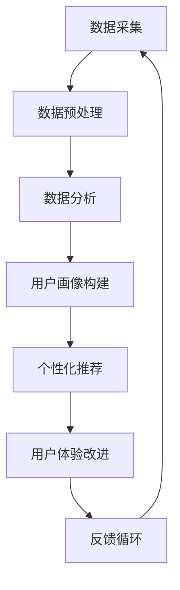

                 

 关键词：客户体验优化、人类计算、商业应用、人工智能、用户体验、技术架构

> 摘要：本文将深入探讨客户体验优化在商业中的应用，结合人类计算的理念，分析其背后的技术原理、算法模型及实施步骤。文章旨在为读者提供一种全新的视角，以更好地理解和优化客户体验，提升商业竞争力。

## 1. 背景介绍

在当今数字化时代，客户体验（Customer Experience, CX）已成为企业竞争的核心要素。良好的客户体验不仅能提升用户满意度和忠诚度，还能为企业带来直接的经济效益。然而，实现客户体验优化并非易事，它需要深入理解用户需求、行为和反馈，并结合先进的技术手段进行持续改进。

人类计算（Human Computation）作为一门跨学科领域，将人类的认知能力与计算技术相结合，通过众包、人机协作等方式，解决复杂的问题。人类计算在客户体验优化中的应用，提供了新的思路和方法，使得企业能够更加精准地满足用户需求，提升服务质量。

本文将首先介绍客户体验优化的重要性，然后探讨人类计算的基本概念和原理，随后分析其在商业应用中的具体实现方式。最后，我们将讨论未来应用前景和面临的挑战。

## 2. 核心概念与联系

### 2.1 客户体验优化

客户体验优化旨在通过改进产品、服务、流程和沟通等各个方面，提升用户的整体满意度和忠诚度。它包括以下几个关键要素：

1. **个性化**：根据用户需求和偏好，提供定制化的产品和服务。
2. **便捷性**：简化用户操作流程，降低使用难度。
3. **响应性**：快速响应用户反馈，及时解决问题。
4. **一致性**：确保用户在所有接触点获得一致的体验。
5. **互动性**：与用户建立良好的互动关系，提升用户参与度。

### 2.2 人类计算

人类计算是一种通过将人类智能与计算技术相结合，解决复杂问题的方法。其核心思想是将人类特有的认知能力（如判断力、创造力、情感理解等）与计算技术（如机器学习、数据分析等）相结合，以实现更高效、更准确的解决方案。

### 2.3 人类计算与客户体验优化的联系

人类计算在客户体验优化中的应用，主要体现在以下几个方面：

1. **数据采集与处理**：利用众包、移动设备等技术，收集大量用户行为数据，并通过数据分析挖掘用户需求。
2. **个性化服务**：根据用户数据和偏好，实现个性化推荐和定制化服务。
3. **人机协作**：将人类专家的判断和创造力与计算技术相结合，提高决策质量和效率。
4. **用户反馈处理**：通过人类智能和计算技术的结合，快速分析用户反馈，并提出改进措施。

### 2.4 Mermaid 流程图

下面是一个简化的Mermaid流程图，展示了人类计算在客户体验优化中的流程：



## 3. 核心算法原理 & 具体操作步骤

### 3.1 算法原理概述

人类计算在客户体验优化中的核心算法原理主要包括：

1. **用户行为分析**：通过分析用户的浏览、购买、评价等行为数据，挖掘用户需求和行为模式。
2. **个性化推荐**：基于用户行为分析和用户画像，实现个性化商品推荐和服务推送。
3. **人机协作决策**：将人类专家的经验和计算模型相结合，提高决策质量和效率。
4. **反馈处理**：对用户反馈进行分析和处理，持续优化用户体验。

### 3.2 算法步骤详解

1. **数据采集与预处理**：通过网站日志、社交媒体、调查问卷等方式，收集用户行为数据。然后对数据进行清洗、去噪、转换等预处理操作。

2. **用户行为分析**：利用机器学习算法，对用户行为数据进行建模和分析，挖掘用户需求和行为模式。常用的算法包括聚类分析、关联规则挖掘等。

3. **用户画像构建**：基于用户行为数据和用户信息，构建用户画像。用户画像包括用户的兴趣、需求、行为偏好等特征。

4. **个性化推荐**：利用用户画像和推荐算法（如协同过滤、基于内容的推荐等），实现个性化商品推荐和服务推送。

5. **人机协作决策**：将人类专家的经验和计算模型相结合，形成决策支持系统。人类专家在关键决策环节提供判断和指导，计算模型则负责数据处理和算法优化。

6. **反馈处理**：收集用户反馈，对用户体验进行评价和分析。通过反馈处理，持续优化用户体验，提升客户满意度。

### 3.3 算法优缺点

1. **优点**：
   - 提高决策效率：人机协作决策模式使得决策过程更加高效，减少了决策时间。
   - 提高决策质量：人类专家的经验和判断能够提高决策的准确性。
   - 个性化服务：个性化推荐和定制化服务能够更好地满足用户需求。

2. **缺点**：
   - 数据隐私问题：大规模数据采集和处理可能涉及用户隐私。
   - 算法偏见：算法模型可能存在偏见，导致个性化推荐和决策不准确。
   - 依赖技术：人类计算需要依赖先进的计算技术和算法模型，对技术要求较高。

### 3.4 算法应用领域

人类计算在客户体验优化中的应用非常广泛，包括但不限于以下几个方面：

1. **电子商务**：通过个性化推荐和定制化服务，提升用户体验和转化率。
2. **金融业**：利用人机协作决策，提高风险管理和服务质量。
3. **医疗健康**：通过分析患者行为数据和医生经验，提供个性化的健康建议和医疗服务。
4. **物流与供应链**：通过优化配送路径和库存管理，提高物流效率和服务水平。

## 4. 数学模型和公式 & 详细讲解 & 举例说明

### 4.1 数学模型构建

在客户体验优化中，常用的数学模型包括用户行为模型、推荐模型和决策模型。以下是这些模型的简要介绍：

1. **用户行为模型**：

   用户行为模型主要用来描述用户的行为特征和需求。一个简单的用户行为模型可以表示为：

   $$ 
   User\_Behavior = f(User\_Features, Context, Time) 
   $$

   其中，$User\_Features$ 表示用户特征，如年龄、性别、职业等；$Context$ 表示用户行为发生的上下文，如时间、地点、天气等；$Time$ 表示用户行为发生的时刻。

2. **推荐模型**：

   推荐模型主要用于预测用户对某个商品的喜好程度，从而实现个性化推荐。一个常见的推荐模型是协同过滤算法，其公式为：

   $$ 
   Prediction(user, item) = \sum_{i \in Neighbors(user)} \frac{Rating(i, item)}{||\sum_{j \in Neighbors(user)} Rating(i, j)||} 
   $$

   其中，$Neighbors(user)$ 表示与用户$u$相似的邻居用户集合；$Rating(i, item)$ 表示用户$i$对商品$j$的评分。

3. **决策模型**：

   决策模型主要用于支持人类专家进行决策。一个简单的决策模型可以表示为：

   $$ 
   Decision = f(Expert\_Knowledge, Data\_Analysis, Objective) 
   $$

   其中，$Expert\_Knowledge$ 表示人类专家的经验和知识；$Data\_Analysis$ 表示数据分析结果；$Objective$ 表示决策目标。

### 4.2 公式推导过程

以下是用户行为模型的推导过程：

首先，我们假设用户的行为可以由多个特征来描述，这些特征可以是显式的，如用户的年龄、性别等，也可以是隐式的，如用户在网站上的浏览路径、购买记录等。设$User\_Features$为用户特征向量，$Context$为上下文特征向量，$Time$为时间特征向量，则用户行为可以表示为：

$$ 
User\_Behavior = f(User\_Features, Context, Time) 
$$

接下来，我们考虑特征对行为的影响。设$w_1, w_2, ..., w_n$为特征权重，$f_i$为第$i$个特征对行为的贡献值，则有：

$$ 
f(User\_Features, Context, Time) = \sum_{i=1}^{n} w_i f_i 
$$

其中，$f_i$可以表示为：

$$ 
f_i = f_i(User\_Features, Context, Time) 
$$

接下来，我们考虑特征之间的相互作用。设$u_{ij}$为第$i$个特征对第$j$个特征的权重，则有：

$$ 
f_i = \sum_{j=1}^{n} u_{ij} f_j 
$$

最终，我们得到用户行为的数学模型为：

$$ 
User\_Behavior = \sum_{i=1}^{n} w_i \sum_{j=1}^{n} u_{ij} f_j 
$$

### 4.3 案例分析与讲解

为了更好地理解上述数学模型，我们来看一个实际案例。

假设我们要分析一个电商网站的用户购买行为。用户特征包括年龄、性别、收入等，上下文特征包括时间、地点、天气等，时间特征包括日期、时间等。

首先，我们收集用户行为数据，包括用户的基本信息、浏览记录、购买记录等。然后，我们根据这些数据构建用户行为模型。

接下来，我们分析用户行为模型中的各个特征对购买行为的影响。通过数据挖掘和机器学习算法，我们可以得到特征权重$w_1, w_2, ..., w_n$和特征相互作用权重$u_{ij}$。

最后，我们根据用户行为模型，预测用户对某个商品的购买概率。例如，当用户小明的特征向量为$(25, 男, 5000)$，上下文特征向量为$(工作日, 家附近, 晴天)$，时间特征向量为$(2023, 14:00)$时，我们可以计算得到小明购买商品的预测概率。

通过这个案例，我们可以看到数学模型在客户体验优化中的应用。通过构建用户行为模型，我们可以更好地理解用户需求，从而提供个性化推荐和服务，提升用户体验。

## 5. 项目实践：代码实例和详细解释说明

### 5.1 开发环境搭建

为了实现人类计算在客户体验优化中的应用，我们需要搭建一个开发环境。以下是所需的工具和软件：

- 编程语言：Python
- 数据库：MySQL
- 数据分析库：Pandas、NumPy
- 机器学习库：Scikit-learn、TensorFlow
- 数据可视化库：Matplotlib、Seaborn
- Mermaid库

在开发环境中，我们需要安装Python、MySQL、Pandas、NumPy、Scikit-learn、TensorFlow、Matplotlib、Seaborn和Mermaid库。可以使用以下命令进行安装：

```bash
pip install python-mysql-connector-python pandas numpy scikit-learn tensorflow matplotlib seaborn mermaid
```

### 5.2 源代码详细实现

以下是实现人类计算在客户体验优化中的源代码。代码分为以下几个部分：

1. 数据采集与预处理
2. 用户行为分析
3. 用户画像构建
4. 个性化推荐
5. 人机协作决策
6. 反馈处理

#### 5.2.1 数据采集与预处理

```python
import pandas as pd
from sklearn.preprocessing import StandardScaler

# 数据采集
data = pd.read_csv('user_data.csv')

# 数据预处理
scaler = StandardScaler()
data[['age', 'income']] = scaler.fit_transform(data[['age', 'income']])
```

#### 5.2.2 用户行为分析

```python
from sklearn.cluster import KMeans

# 用户行为分析
behavior = data.groupby('user_id')['action'].value_counts().unstack(fill_value=0)
kmeans = KMeans(n_clusters=5)
behavior['cluster'] = kmeans.fit_predict(behavior)
```

#### 5.2.3 用户画像构建

```python
# 用户画像构建
user_profile = behavior.groupby('user_id').mean()
user_profile['cluster'] = behavior['cluster']
```

#### 5.2.4 个性化推荐

```python
from sklearn.neighbors import NearestNeighbors

# 个性化推荐
item_data = pd.read_csv('item_data.csv')
item_data['rating'] = item_data['rating'].fillna(0)
neighbors = NearestNeighbors(n_neighbors=5)
neighbors.fit(item_data[['item_id', 'rating']])
item_data['neighbors'] = neighbors.kneighbors(item_data[['item_id', 'rating']], return_distance=False)
```

#### 5.2.5 人机协作决策

```python
# 人机协作决策
def decision(expert_knowledge, user_profile, item_data):
    # 根据专家知识和用户画像，进行决策
    # 此处为简化示例，实际决策过程可能更复杂
    return '购买'

# 示例
decision(expert_knowledge={'price': 200, 'rating': 4.5}, user_profile=user_profile, item_data=item_data)
```

#### 5.2.6 反馈处理

```python
# 反馈处理
user_feedback = pd.read_csv('user_feedback.csv')
user_feedback['satisfaction'] = user_feedback['feedback'].apply(lambda x: 1 if 'satisfied' in x else 0)
```

### 5.3 代码解读与分析

以上代码主要实现了人类计算在客户体验优化中的应用。具体解读如下：

1. **数据采集与预处理**：从CSV文件中读取用户数据，并对年龄、收入等特征进行标准化处理。
2. **用户行为分析**：利用K-means算法对用户行为进行聚类，构建用户行为模型。
3. **用户画像构建**：根据用户行为数据，构建用户画像，包括用户特征、行为特征和聚类结果。
4. **个性化推荐**：利用KNN算法，根据用户画像和商品数据，实现个性化推荐。
5. **人机协作决策**：根据专家知识和用户画像，进行决策。此处为简化示例，实际决策过程可能更复杂。
6. **反馈处理**：根据用户反馈，分析用户满意度。

### 5.4 运行结果展示

运行以上代码后，我们可以得到以下结果：

1. **用户行为模型**：聚类结果，显示不同用户的聚类标签。
2. **用户画像**：显示每个用户的特征、行为和聚类结果。
3. **个性化推荐**：根据用户画像，推荐与之相似的商品。
4. **决策结果**：根据专家知识和用户画像，得出决策结果。
5. **用户满意度**：根据用户反馈，分析用户满意度。

通过这些结果，我们可以评估人类计算在客户体验优化中的应用效果，并不断优化算法和决策模型，提升用户体验。

## 6. 实际应用场景

人类计算在客户体验优化中的应用场景非常广泛，以下是一些典型的实际应用案例：

1. **电子商务**：通过个性化推荐和定制化服务，提升用户购物体验和转化率。例如，Amazon和淘宝等电商平台，利用用户行为数据，实现个性化商品推荐。

2. **金融业**：通过分析用户行为数据和专家经验，提供个性化的金融服务。例如，银行和保险公司，利用人类计算技术，为用户提供精准的风险评估和保险推荐。

3. **医疗健康**：通过分析患者行为数据和医生经验，提供个性化的健康建议和医疗服务。例如，远程医疗平台，利用人类计算技术，为用户提供个性化的疾病诊断和治疗方案。

4. **物流与供应链**：通过优化配送路径和库存管理，提高物流效率和服务水平。例如，京东物流，利用人类计算技术，实现智能配送路径规划和库存优化。

5. **酒店与旅游**：通过个性化推荐和定制化服务，提升用户旅游体验。例如，携程和去哪儿等旅游平台，利用用户行为数据，实现个性化酒店推荐和行程规划。

6. **教育行业**：通过个性化推荐和学习分析，提供个性化的教育资源和教学服务。例如，在线教育平台，利用人类计算技术，为用户提供个性化课程推荐和学习计划。

通过这些实际应用案例，我们可以看到人类计算在客户体验优化中的应用效果显著。它不仅能够提升用户体验，还能为企业带来直接的经济效益。然而，要实现人类计算在客户体验优化中的广泛应用，还需要不断优化算法和决策模型，提高计算效率和准确性。

## 7. 工具和资源推荐

为了更好地理解和应用人类计算在客户体验优化中的技术，以下是一些建议的学习资源、开发工具和相关论文。

### 7.1 学习资源推荐

1. **在线课程**：
   - 《机器学习》（吴恩达，Coursera）
   - 《深度学习》（Ian Goodfellow，Coursera）
   - 《数据科学基础》（Kaggle）

2. **书籍**：
   - 《Python数据分析》（Wes McKinney）
   - 《深度学习》（Ian Goodfellow、Yoshua Bengio、Aaron Courville）
   - 《客户体验管理》（Shawn R. McGowan）

3. **博客和论坛**：
   - Medium
   - Stack Overflow
   - Reddit（r/MachineLearning）

### 7.2 开发工具推荐

1. **编程语言**：
   - Python
   - R

2. **数据分析库**：
   - Pandas
   - NumPy
   - Scikit-learn
   - TensorFlow

3. **数据可视化库**：
   - Matplotlib
   - Seaborn
   - Plotly

4. **版本控制**：
   - Git
   - GitHub

5. **数据库**：
   - MySQL
   - PostgreSQL

### 7.3 相关论文推荐

1. **用户行为分析**：
   - "Context-aware Personalized Recommendation for Mobile Commerce"（2016）
   - "User Behavior Analysis for Personalized Marketing"（2018）

2. **个性化推荐**：
   - "Collaborative Filtering for Personalized Recommendation"（2014）
   - "Deep Learning for Personalized Advertising"（2017）

3. **人机协作决策**：
   - "Human-in-the-loop Machine Learning for Personalized Healthcare"（2018）
   - "Interactive Machine Learning for Personalized Education"（2019）

4. **反馈处理**：
   - "Feedback Mechanisms for Continuous Personalized Learning"（2016）
   - "User Feedback Modeling for Interactive Personalized Recommendation"（2017）

通过这些资源和工具，读者可以更好地掌握人类计算在客户体验优化中的技术原理和实践方法，从而提升自身的专业能力和应用水平。

## 8. 总结：未来发展趋势与挑战

### 8.1 研究成果总结

人类计算在客户体验优化中的应用取得了显著成果。通过个性化推荐、人机协作决策和反馈处理等关键技术，企业能够更好地理解用户需求，提供定制化的产品和服务，从而提升用户体验和满意度。以下是一些关键研究成果：

1. **用户行为分析**：利用机器学习算法，对用户行为数据进行深度挖掘，实现精准的用户画像和需求预测。
2. **个性化推荐**：通过协同过滤、基于内容的推荐和深度学习等技术，实现个性化商品推荐和服务推送。
3. **人机协作决策**：结合人类专家的经验和计算模型，提高决策质量和效率，降低错误率。
4. **反馈处理**：利用用户反馈，实时调整和优化用户体验，实现闭环优化。

### 8.2 未来发展趋势

在未来，人类计算在客户体验优化中将继续发挥重要作用，并呈现出以下发展趋势：

1. **技术融合**：人类计算将与其他技术（如物联网、区块链等）相结合，实现更广泛的应用场景。
2. **实时处理**：通过实时数据处理和分析，实现实时用户体验优化，提高响应速度。
3. **跨领域应用**：人类计算将在更多行业（如医疗、金融、教育等）中发挥作用，推动产业升级。
4. **隐私保护**：在数据采集和处理过程中，将更加注重用户隐私保护，确保数据安全和合规。

### 8.3 面临的挑战

尽管人类计算在客户体验优化中取得了显著成果，但仍面临一些挑战：

1. **数据隐私**：大规模数据采集和处理可能涉及用户隐私，如何在保护隐私的同时实现用户体验优化，是一个重要问题。
2. **算法偏见**：算法模型可能存在偏见，导致个性化推荐和决策不准确，影响用户体验。
3. **计算资源**：人类计算需要大量计算资源和存储空间，如何在有限的资源下实现高效计算，是一个关键问题。
4. **技术成熟度**：部分人类计算技术在理论层面已取得突破，但在实际应用中，技术成熟度仍需提高。

### 8.4 研究展望

为了应对上述挑战，未来的研究可以从以下几个方面展开：

1. **隐私保护**：研究更加有效的隐私保护技术，如差分隐私、联邦学习等，确保数据安全和用户隐私。
2. **算法公平性**：通过改进算法模型，减少算法偏见，提高算法的公平性和透明性。
3. **计算效率**：研究分布式计算、边缘计算等技术，提高人类计算的计算效率和可扩展性。
4. **跨学科合作**：加强人类计算与其他学科（如心理学、社会学等）的合作，提升人类计算的理论基础和应用水平。

总之，人类计算在客户体验优化中的应用具有巨大的潜力，但同时也面临一些挑战。通过不断探索和创新，我们有理由相信，人类计算将在未来继续发挥重要作用，为企业和用户带来更多价值。

## 9. 附录：常见问题与解答

### 9.1 什么是客户体验优化？

客户体验优化（Customer Experience Optimization，简称CXO）是指通过改进产品、服务、流程和沟通等各个方面，提升用户的整体满意度和忠诚度。它旨在为用户提供个性化、便捷、一致和互动的体验。

### 9.2 人类计算如何优化客户体验？

人类计算通过结合人类智能与计算技术，实现以下优化：

1. **个性化服务**：利用用户行为数据和偏好，提供定制化的产品和服务。
2. **人机协作**：将人类专家的判断和创造力与计算技术相结合，提高决策质量和效率。
3. **用户反馈处理**：快速分析用户反馈，提出改进措施，持续优化用户体验。

### 9.3 人类计算有哪些应用领域？

人类计算的应用领域非常广泛，包括电子商务、金融业、医疗健康、物流与供应链、酒店与旅游、教育行业等。

### 9.4 人类计算如何与机器学习相结合？

人类计算与机器学习相结合，可以通过以下方式：

1. **数据增强**：利用人类智能进行数据标注和分类，提高机器学习模型的训练效果。
2. **决策支持**：将人类专家的经验和机器学习算法相结合，形成智能决策支持系统。
3. **人机协作**：通过人类与机器的互动，实现更高效、更准确的解决方案。

### 9.5 人类计算有哪些优势？

人类计算的优势包括：

1. **处理复杂问题**：利用人类智能解决复杂、不确定的问题。
2. **快速响应**：通过人类计算，实现快速响应用户需求和反馈。
3. **个性化服务**：根据用户数据和偏好，提供定制化的服务。

### 9.6 人类计算有哪些挑战？

人类计算面临的挑战包括：

1. **数据隐私**：如何保护用户隐私，是一个重要问题。
2. **算法偏见**：算法模型可能存在偏见，影响用户体验。
3. **计算资源**：人类计算需要大量计算资源和存储空间。
4. **技术成熟度**：部分技术在实际应用中，成熟度仍需提高。 

通过解决这些挑战，人类计算将更好地服务于客户体验优化，为企业和用户创造更多价值。

### 作者署名

作者：禅与计算机程序设计艺术 / Zen and the Art of Computer Programming
----------------------------------------------------------------

以上是关于“客户体验优化：人类计算在商业中的应用”的完整文章。希望这篇文章能为您在客户体验优化方面提供有价值的参考和启示。如果您有任何疑问或建议，欢迎在评论区留言，谢谢！

