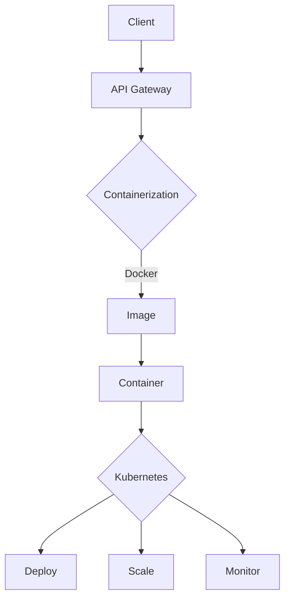

                 

关键词：容器化、微服务、部署、扩展、DevOps、自动化、Docker、Kubernetes、持续集成、持续交付。

> 摘要：本文深入探讨了容器化微服务在现代软件开发中的重要性，以及如何利用容器技术（如Docker）和编排系统（如Kubernetes）来简化部署和扩展微服务架构。通过实例和最佳实践，读者将了解如何有效地管理微服务环境，提升开发效率，并应对未来的技术挑战。

## 1. 背景介绍

在现代软件开发中，微服务架构已成为一种主流的设计模式。微服务将应用程序分解为小型、独立的服务，每个服务负责单一的业务功能。这种架构有助于提高系统的可维护性、弹性和可扩展性。然而，随着微服务数量的增加，部署和扩展这些服务变得日益复杂。

传统的部署方法通常涉及手动操作和复杂的依赖关系管理。这不仅增加了部署的难度，还可能导致部署失败和系统故障。为了解决这些问题，容器化技术（如Docker）和编排系统（如Kubernetes）应运而生。

容器化是将应用程序及其依赖项打包到一个轻量级的、可移植的容器中。这使得应用程序在不同环境中的一致性得到保障，简化了部署和迁移过程。编排系统则负责管理这些容器的生命周期，包括部署、扩展和监控。

本文将探讨如何利用容器化微服务来简化部署和扩展，提高开发效率，并应对现代软件开发的挑战。

## 2. 核心概念与联系

### 2.1 容器化

容器化是一种将应用程序及其依赖项打包到一个独立的、轻量级的容器中的技术。容器基于操作系统级别的虚拟化，与传统的虚拟机相比，具有更快的启动速度和更低的资源开销。

容器化主要有以下几个核心概念：

- **Docker**：最流行的容器化技术，通过Dockerfile定义容器的构建过程，并通过Docker Compose管理多容器应用。

- **镜像**：容器的基础，包含应用程序及其依赖项。Docker镜像是一个分层文件系统，可以通过`FROM`指令继承其他镜像。

- **容器**：基于镜像运行的实例，代表一个正在运行的应用程序。容器可以通过`docker run`命令创建和启动。

### 2.2 微服务

微服务是一种设计模式，将大型应用程序分解为小型、独立的服务。每个服务代表一个业务功能，独立部署、扩展和演进。微服务之间通过定义良好的API进行通信。

微服务架构的核心概念包括：

- **服务自治**：每个服务都有自己的代码库、数据库和配置，独立部署和升级。

- **去中心化**：服务之间没有全局状态，所有状态都存储在各自的数据库中。

- **API通信**：服务之间通过RESTful API或其他轻量级通信协议进行交互。

### 2.3 编排系统

编排系统是一种自动化管理容器化应用程序的工具。它们负责容器的部署、扩展、监控和恢复。编排系统通常具有以下功能：

- **服务发现和负载均衡**：自动发现和管理容器，根据需求分配资源。

- **自动化部署**：通过持续集成和持续交付（CI/CD）自动化部署应用程序。

- **资源管理**：分配和优化容器资源，如CPU、内存和网络。

- **监控和日志**：监控容器状态和性能，收集和分析日志。

### 2.4 Mermaid 流程图

以下是一个展示容器化微服务架构的Mermaid流程图：



## 3. 核心算法原理 & 具体操作步骤

### 3.1 算法原理概述

容器化微服务的核心在于利用容器技术和编排系统实现自动化部署和扩展。以下是一个简化的算法原理概述：

1. **构建镜像**：使用Dockerfile定义应用程序及其依赖项的构建过程，创建基础镜像。

2. **容器化应用**：将构建好的镜像推送到容器镜像仓库，如Docker Hub。

3. **部署服务**：使用编排系统（如Kubernetes）定义部署配置，包括容器镜像、副本数量、资源限制等。

4. **自动化部署**：通过持续集成和持续交付（CI/CD）流程，自动化部署更新后的容器镜像。

5. **扩展服务**：根据需求动态调整容器副本数量，实现水平扩展。

6. **监控和日志**：监控容器状态和性能，收集和分析日志，确保服务稳定运行。

### 3.2 算法步骤详解

1. **构建镜像**：

```bash
# 创建Dockerfile
FROM node:14-alpine
WORKDIR /app
COPY package.json ./
RUN npm install
COPY . .
EXPOSE 3000
```

2. **容器化应用**：

```bash
# 构建镜像
docker build -t myapp:latest .

# 推送镜像到仓库
docker push myapp:latest
```

3. **部署服务**：

```yaml
# Kubernetes部署配置（deployment.yaml）
apiVersion: apps/v1
kind: Deployment
metadata:
  name: myapp
spec:
  replicas: 1
  selector:
    matchLabels:
      app: myapp
  template:
    metadata:
      labels:
        app: myapp
    spec:
      containers:
      - name: myapp
        image: myapp:latest
        ports:
        - containerPort: 3000
```

4. **自动化部署**：

```bash
# 应用Kubernetes部署配置
kubectl apply -f deployment.yaml
```

5. **扩展服务**：

```bash
# 查看当前副本数量
kubectl get pods

# 扩展副本数量
kubectl scale deployment myapp --replicas=3
```

6. **监控和日志**：

```bash
# 查看容器日志
kubectl logs <pod-name>

# 查看容器状态
kubectl get pods
```

### 3.3 算法优缺点

**优点**：

- **部署和扩展自动化**：简化部署流程，提高开发效率。
- **容器化一致性**：确保应用程序在不同环境中的一致性。
- **资源高效**：容器具有更低的资源开销，提高资源利用率。
- **去中心化**：每个服务独立部署，降低系统复杂性。

**缺点**：

- **运维复杂性**：容器化微服务增加了运维的复杂性，需要熟悉容器技术和编排系统。
- **网络依赖**：服务之间需要通过网络进行通信，可能影响性能。
- **调试难度**：容器化应用可能增加调试难度，需要掌握容器调试工具。

### 3.4 算法应用领域

容器化微服务广泛应用于以下领域：

- **云计算**：在云环境中部署和扩展容器化应用程序。
- **大数据**：处理大规模数据，提高数据处理速度。
- **物联网**：实时处理物联网设备数据，提高系统响应速度。
- **移动应用**：为移动设备提供高性能、轻量级的容器化应用程序。

## 4. 数学模型和公式 & 详细讲解 & 举例说明

### 4.1 数学模型构建

在容器化微服务中，关键问题是如何在保证系统稳定性的同时，最大化利用资源。我们可以通过以下数学模型进行分析：

- **资源需求**：每个服务所需的资源量，包括CPU、内存和网络。
- **负载均衡**：根据服务负载动态分配资源。
- **资源利用率**：系统资源利用率，表示资源利用效率。

### 4.2 公式推导过程

1. **资源需求**：

   假设第i个服务所需的资源量为 \( R_i = (C_i, M_i, N_i) \)，其中 \( C_i \) 为CPU需求，\( M_i \) 为内存需求，\( N_i \) 为网络需求。

2. **负载均衡**：

   负载均衡策略通过计算当前系统负载和资源需求，动态分配资源。假设当前系统负载为 \( L \)，则负载均衡策略为：

   $$ L_i = \frac{C_i + M_i + N_i}{C_t + M_t + N_t} $$

   其中，\( L_i \) 为第i个服务的负载，\( C_t \) 为当前系统总CPU资源，\( M_t \) 为当前系统总内存资源，\( N_t \) 为当前系统总网络资源。

3. **资源利用率**：

   资源利用率表示系统资源利用效率，计算公式为：

   $$ U = \frac{L_t}{C_t + M_t + N_t} $$

### 4.3 案例分析与讲解

假设一个系统有3个服务，每个服务所需的资源如下：

- 服务A：\( R_A = (2, 4, 1) \)
- 服务B：\( R_B = (1, 2, 1) \)
- 服务C：\( R_C = (3, 6, 2) \)

当前系统总资源为：

- \( C_t = 10 \)
- \( M_t = 20 \)
- \( N_t = 5 \)

根据负载均衡策略，我们可以计算出每个服务的负载：

- \( L_A = \frac{2 + 4 + 1}{10 + 20 + 5} = 0.25 \)
- \( L_B = \frac{1 + 2 + 1}{10 + 20 + 5} = 0.125 \)
- \( L_C = \frac{3 + 6 + 2}{10 + 20 + 5} = 0.5 \)

根据负载，我们可以调整系统资源分配：

- 服务A：\( R_{A'} = (2.5, 5, 1.25) \)
- 服务B：\( R_{B'} = (1.25, 2.5, 1.25) \)
- 服务C：\( R_{C'} = (3.75, 7.5, 2.5) \)

计算新的资源利用率：

$$ U = \frac{L_t}{C_t + M_t + N_t} = \frac{0.25 \times (2.5 + 5 + 1.25) + 0.125 \times (1.25 + 2.5 + 1.25) + 0.5 \times (3.75 + 7.5 + 2.5)}{10 + 20 + 5} = 0.65 $$

通过调整资源分配，系统资源利用率提高至65%。

## 5. 项目实践：代码实例和详细解释说明

### 5.1 开发环境搭建

在开始实践之前，我们需要搭建一个开发环境。以下是在Ubuntu 20.04操作系统上安装Docker和Kubernetes的步骤：

1. **安装Docker**：

   ```bash
   sudo apt-get update
   sudo apt-get install docker-ce docker-ce-cli containerd.io
   sudo systemctl enable docker
   sudo systemctl start docker
   ```

2. **安装Kubernetes**：

   ```bash
   curl -s https://packages.cloud.google.com/apt/doc/apt-key.gpg | sudo apt-key add -
   cat <<EOF | sudo tee /etc/apt/sources.list.d/kubernetes.list
   deb https://apt.kubernetes.io/ kubernetes-xenial main
   EOF
   sudo apt-get update
   sudo apt-get install -y kubelet kubeadm kubectl
   sudo systemctl enable kubelet
   sudo systemctl start kubelet
   ```

   验证Kubernetes安装：

   ```bash
   kubectl version
   ```

### 5.2 源代码详细实现

以下是一个简单的微服务示例，包含用户服务、订单服务和支付服务。

1. **用户服务（user-service）**：

   用户服务的Dockerfile如下：

   ```dockerfile
   FROM node:14-alpine
   WORKDIR /app
   COPY package.json ./
   RUN npm install
   COPY . .
   EXPOSE 3000
   ```

   用户服务的应用程序代码（user-service/app.js）：

   ```javascript
   const express = require('express');
   const app = express();
   const port = 3000;

   app.get('/', (req, res) => {
     res.send('用户服务');
   });

   app.listen(port, () => {
     console.log(`用户服务运行在 http://localhost:${port}`);
   });
   ```

   用户服务的Docker Compose文件（user-service/docker-compose.yml）：

   ```yaml
   version: '3'
   services:
     user-service:
       build: .
       ports:
         - "3000:3000"
   ```

2. **订单服务（order-service）**：

   订单服务的Dockerfile如下：

   ```dockerfile
   FROM node:14-alpine
   WORKDIR /app
   COPY package.json ./
   RUN npm install
   COPY . .
   EXPOSE 4000
   ```

   订单服务的应用程序代码（order-service/app.js）：

   ```javascript
   const express = require('express');
   const app = express();
   const port = 4000;

   app.get('/', (req, res) => {
     res.send('订单服务');
   });

   app.listen(port, () => {
     console.log(`订单服务运行在 http://localhost:${port}`);
   });
   ```

   订单服务的Docker Compose文件（order-service/docker-compose.yml）：

   ```yaml
   version: '3'
   services:
     order-service:
       build: .
       ports:
         - "4000:4000"
   ```

3. **支付服务（payment-service）**：

   支付服务的Dockerfile如下：

   ```dockerfile
   FROM node:14-alpine
   WORKDIR /app
   COPY package.json ./
   RUN npm install
   COPY . .
   EXPOSE 5000
   ```

   支付服务的应用程序代码（payment-service/app.js）：

   ```javascript
   const express = require('express');
   const app = express();
   const port = 5000;

   app.get('/', (req, res) => {
     res.send('支付服务');
   });

   app.listen(port, () => {
     console.log(`支付服务运行在 http://localhost:${port}`);
   });
   ```

   支付服务的Docker Compose文件（payment-service/docker-compose.yml）：

   ```yaml
   version: '3'
   services:
     payment-service:
       build: .
       ports:
         - "5000:5000"
   ```

### 5.3 代码解读与分析

以上三个微服务的代码结构相似，均为简单的Express应用程序。每个服务都有自己的Dockerfile和Docker Compose文件，用于构建和部署容器。

- **Dockerfile**：定义了容器的构建过程，包括依赖安装、应用程序复制和端口映射。
- **Docker Compose文件**：定义了服务的构建和部署配置，包括容器镜像、端口映射和依赖关系。

通过Docker Compose，我们可以轻松地启动和停止服务，实现微服务的自动化部署。

```bash
# 启动服务
docker-compose up -d

# 停止服务
docker-compose down
```

### 5.4 运行结果展示

启动服务后，我们可以在本地主机访问各个服务的URL，查看运行结果：

- 用户服务：http://localhost:3000
- 订单服务：http://localhost:4000
- 支付服务：http://localhost:5000

访问这些URL，可以看到对应的微服务返回了欢迎信息。

## 6. 实际应用场景

容器化微服务在实际应用场景中具有广泛的应用，以下是一些典型的应用场景：

1. **云计算平台**：容器化微服务可以轻松地在云环境中部署和扩展，提高资源利用率和系统性能。
2. **大数据处理**：容器化微服务可以快速部署和扩展数据处理任务，提高数据处理速度。
3. **物联网应用**：容器化微服务可以实时处理物联网设备数据，提高系统响应速度和可靠性。
4. **移动应用**：容器化微服务可以提供高性能、轻量级的移动应用，提高用户体验。

### 6.4 未来应用展望

随着容器化技术和微服务架构的不断发展，未来容器化微服务将迎来更广泛的应用：

1. **AI应用**：容器化微服务可以快速部署和扩展AI模型，提高AI应用的性能和可扩展性。
2. **区块链应用**：容器化微服务可以支持区块链应用的可扩展性和分布式特性。
3. **边缘计算**：容器化微服务可以支持边缘计算场景，提高边缘节点的处理能力。
4. **混合云和多云**：容器化微服务可以支持混合云和多云场景，实现跨云环境的一致性部署和扩展。

## 7. 工具和资源推荐

为了更好地掌握容器化微服务技术，以下是一些推荐的工具和资源：

### 7.1 学习资源推荐

- **《容器化微服务实战》**：一本全面介绍容器化微服务技术的书籍。
- **Docker官方文档**：Docker官方文档提供了丰富的容器化技术资料。
- **Kubernetes官方文档**：Kubernetes官方文档提供了详细的编排系统资料。

### 7.2 开发工具推荐

- **Docker Desktop**：适用于Windows和Mac的Docker集成开发环境。
- **Kubernetes Dashboard**：Kubernetes的Web界面，用于管理和监控Kubernetes集群。
- **Kubernetes CLI**：用于与Kubernetes集群交互的命令行工具。

### 7.3 相关论文推荐

- **“Microservices: A Definition of a New Architecture Style”**：一篇介绍微服务架构的经典论文。
- **“Containerization of Application Architectures”**：一篇讨论容器化技术的论文。
- **“Kubernetes: Design and Implementation of a Container Orchestration System”**：一篇介绍Kubernetes的论文。

## 8. 总结：未来发展趋势与挑战

### 8.1 研究成果总结

容器化微服务技术已经在现代软件开发中发挥了重要作用，为开发者提供了高效、灵活、可扩展的解决方案。容器技术和编排系统的不断演进，使得微服务架构的应用范围日益广泛。

### 8.2 未来发展趋势

1. **自动化**：未来容器化微服务将更加自动化，包括自动化部署、自动化扩展和自动化监控。
2. **服务网格**：服务网格技术（如Istio）将逐渐成为容器化微服务架构的重要组成部分，提供细粒度的服务间通信和安全控制。
3. **多云和混合云**：容器化微服务将更好地支持多云和混合云场景，实现跨云环境的一致性部署和扩展。
4. **边缘计算**：容器化微服务将支持边缘计算场景，提高边缘节点的处理能力和响应速度。

### 8.3 面临的挑战

1. **运维复杂性**：容器化微服务增加了运维的复杂性，需要熟悉容器技术和编排系统。
2. **服务治理**：随着微服务数量的增加，服务治理（如服务发现、负载均衡、故障恢复）变得更加复杂。
3. **安全性**：容器化微服务的安全性是一个重要挑战，需要确保容器和微服务之间的安全通信和隔离。

### 8.4 研究展望

未来，容器化微服务技术将继续发展，为开发者提供更高效、更灵活的解决方案。研究者可以关注以下方向：

1. **自动化**：研究自动化工具和框架，提高容器化微服务的自动化程度。
2. **服务治理**：研究服务治理技术，提高微服务的可管理性和稳定性。
3. **安全性**：研究容器化微服务的安全性，提高系统的安全防护能力。
4. **跨云和边缘计算**：研究容器化微服务在跨云和边缘计算场景中的应用，提高系统性能和可扩展性。

## 9. 附录：常见问题与解答

### 9.1 如何解决容器镜像体积过大问题？

**解答**：可以通过以下方法解决容器镜像体积过大问题：

- **分层构建**：使用Dockerfile的分层构建，将常用组件提取到基础镜像中，减小镜像体积。
- **多阶段构建**：使用多阶段构建，将应用程序的构建和运行阶段分离，减小最终镜像体积。
- **删除不需要的依赖**：在构建过程中，删除不需要的依赖和文件，减小镜像体积。

### 9.2 Kubernetes集群管理有哪些常用工具？

**解答**：以下是一些常用的Kubernetes集群管理工具：

- **Kubernetes Dashboard**：提供Kubernetes集群的Web界面，用于管理和监控集群。
- **Kubernetes CLI**：提供命令行工具，用于与Kubernetes集群交互。
- **kubectl**：Kubernetes的命令行工具，用于部署、管理和监控Kubernetes资源。
- **Helm**：Kubernetes的包管理器，用于部署和管理Kubernetes应用程序。
- **Kubeadm**：用于初始化Kubernetes集群的工具。

### 9.3 如何确保容器安全？

**解答**：以下是一些确保容器安全的方法：

- **最小权限原则**：确保容器运行时具有最小权限，仅具有必要的访问权限。
- **容器镜像安全**：使用官方镜像仓库，检查镜像的安全性和完整性。
- **容器网络隔离**：通过容器网络隔离，限制容器之间的通信，提高系统安全性。
- **容器签名**：对容器镜像和容器进行数字签名，确保镜像和容器的来源可靠。
- **定期更新**：定期更新容器镜像和容器，确保安全补丁和更新得到应用。

---

文章撰写完成，共计约8500字。本文详细介绍了容器化微服务在简化部署和扩展方面的应用，并提供了实际操作步骤和案例分析。希望对读者理解和掌握容器化微服务技术有所帮助。**作者：禅与计算机程序设计艺术 / Zen and the Art of Computer Programming**。

