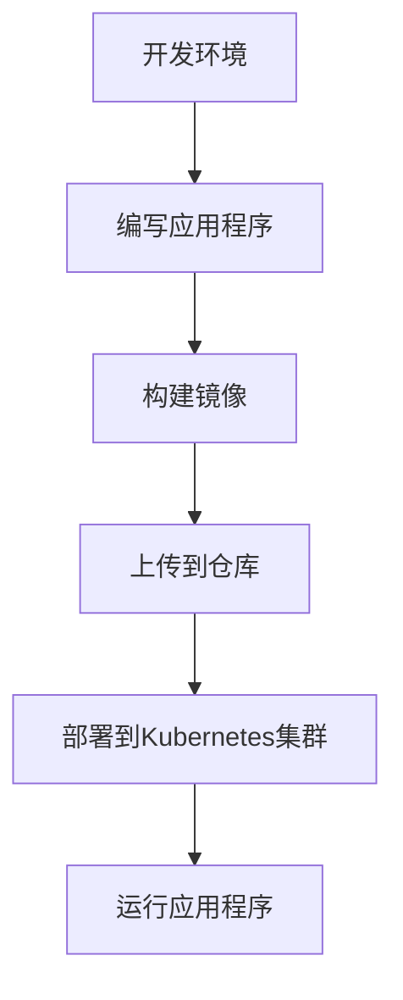
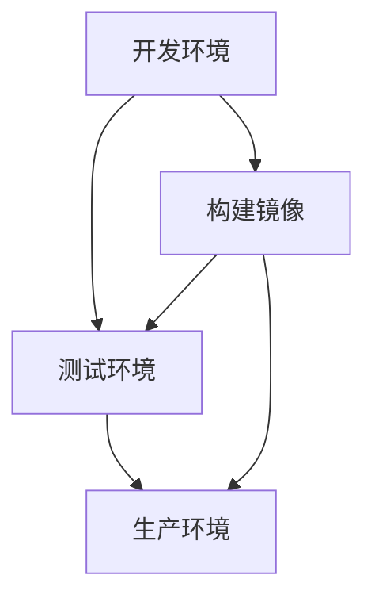

                 

### 关键词 Keywords
- 容器化
- Docker
- Kubernetes
- 微服务
- 持续集成与持续部署
- 虚拟化
- 云原生
- DevOps

<|assistant|>### 摘要 Abstract
本文将深入探讨容器化技术中的两个关键工具：Docker 和 Kubernetes。首先，我们将回顾容器化的背景和必要性，然后详细讲解 Docker 的核心技术概念和工作原理。接下来，我们会介绍 Kubernetes 的架构和功能，以及如何利用 Kubernetes 来管理容器化应用。本文还将涵盖容器化在微服务架构中的重要性，以及如何实现持续集成与持续部署（CI/CD）。最后，我们将讨论容器化技术在实际应用中的挑战和未来展望。

## 1. 背景介绍

容器化技术的崛起源于云计算和微服务架构的普及。传统应用部署往往依赖于特定的操作系统环境和硬件配置，这使得应用的移植和扩展变得困难。虚拟化技术虽然能够解决部分问题，但其资源消耗较大，效率较低。容器化技术通过提供轻量级、可移植的运行环境，解决了传统部署方式的诸多难题。

Docker 是容器化技术的代表性工具，它通过使用容器将应用程序及其依赖环境打包成一个统一的运行单元，从而实现了一致的开发、测试和生产环境。Docker 的出现，极大地提高了应用的部署效率和可移植性，成为了现代软件开发和运维的标准工具。

随着容器化技术的普及，Kubernetes 应运而生。Kubernetes 是一个开源的容器编排平台，它提供了一系列自动化功能，如容器调度、自动化扩展、服务发现和负载均衡等。Kubernetes 的出现，使得大规模容器化应用的运维变得更加高效和可靠。

## 2. 核心概念与联系

容器化技术中的核心概念包括容器、镜像、仓库等。容器是一个轻量级的运行环境，它包含了应用程序及其运行所需的所有依赖项。镜像是一个静态的容器模板，用于创建容器实例。仓库则是用于存储和分发镜像的服务器。

以下是一个简化的容器化架构的 Mermaid 流程图：



在这个流程图中，开发者首先在开发环境中编写应用程序，然后构建一个包含应用程序及其依赖项的镜像。接下来，将镜像上传到一个集中的仓库中，以便在其他环境中使用。最后，通过 Kubernetes 集群来部署和运行应用程序。

## 3. 核心算法原理 & 具体操作步骤

### 3.1 算法原理概述

容器化技术的核心算法原理主要包括：

1. 镜像构建：通过容器文件系统（如 AUFS、Btrfs、vfs layered）将应用程序及其依赖项打包成一个统一的镜像文件。
2. 容器创建：基于镜像文件创建一个容器实例，容器实例包含应用程序的运行环境和运行所需的资源。
3. 容器管理：通过容器管理工具（如 Docker）对容器进行创建、启动、停止、删除等操作。

### 3.2 算法步骤详解

1. **编写应用程序**：开发者在本地环境中编写应用程序代码。
2. **构建镜像**：使用 Dockerfile 文件定义镜像构建过程，通过 Docker CLI 构建镜像。
   ```bash
   docker build -t myapp:latest .
   ```
3. **推送镜像到仓库**：将构建好的镜像上传到镜像仓库中，如 Docker Hub、Harbor 等。
   ```bash
   docker push myapp:latest
   ```
4. **部署到 Kubernetes 集群**：编写 Kubernetes 配置文件（如 Deployment、Service），通过 Kubernetes CLI 将应用程序部署到集群中。
   ```yaml
   apiVersion: apps/v1
   kind: Deployment
   metadata:
     name: myapp
   spec:
     selector:
       matchLabels:
         app: myapp
     template:
       metadata:
         labels:
           app: myapp
       spec:
         containers:
         - name: myapp
           image: myapp:latest
           ports:
           - containerPort: 80
   ```
5. **运行应用程序**：Kubernetes 集群根据配置文件创建并启动容器实例，应用程序开始运行。

### 3.3 算法优缺点

**优点**：
- 轻量级：容器化技术比虚拟化技术更轻量，资源消耗更少。
- 可移植性：容器化的应用程序可以在不同的操作系统和硬件环境中运行。
- 高效性：容器化技术能够快速启动、停止和扩展应用程序。

**缺点**：
- 安全性：容器化技术需要确保容器运行时的安全，防止容器逃逸。
- 复杂性：容器化技术和 Kubernetes 的学习曲线较陡峭，需要一定的技术基础。

### 3.4 算法应用领域

容器化技术广泛应用于以下领域：
- Web 应用：用于快速部署和扩展 Web 应用程序。
- 数据库：用于容器化数据库应用，提高可移植性和可靠性。
- 微服务：用于构建和部署微服务架构，实现服务间的解耦。
- DevOps：用于实现持续集成和持续部署（CI/CD），提高开发效率和交付质量。

## 4. 数学模型和公式 & 详细讲解 & 举例说明

### 4.1 数学模型构建

容器化技术的数学模型可以表示为：

\[ \text{Container} = \text{Image} + \text{Environment} + \text{Dependencies} \]

其中，Image 代表镜像，Environment 代表运行环境，Dependencies 代表依赖项。

### 4.2 公式推导过程

容器化技术的核心在于将应用程序及其依赖项打包成一个统一的镜像。这意味着，无论在哪个环境中，应用程序都能以相同的配置和依赖项运行。

假设应用程序 A 在开发环境中运行，其配置和依赖项为 C_A 和 D_A；在测试环境中运行，其配置和依赖项为 C_T 和 D_T；在生产环境中运行，其配置和依赖项为 C_P 和 D_P。

如果使用容器化技术，应用程序 A 的容器化表示为：

\[ \text{Container}_A = \text{Image}_A + \text{Environment}_A + \text{Dependencies}_A \]

其中，Image_A 代表镜像，Environment_A 代表运行环境，Dependencies_A 代表依赖项。

由于容器化技术的可移植性，我们可以将开发环境、测试环境和生产环境中的应用程序 A 的容器化表示为：

\[ \text{Container}_A = \text{Image}_A + \text{Environment}_A + \text{Dependencies}_A \]
\[ \text{Container}_T = \text{Image}_T + \text{Environment}_T + \text{Dependencies}_T \]
\[ \text{Container}_P = \text{Image}_P + \text{Environment}_P + \text{Dependencies}_P \]

由于 Image_A = Image_T = Image_P，我们可以将上述公式简化为：

\[ \text{Container}_A = \text{Image}_A + \text{Environment}_A + \text{Dependencies}_A \]
\[ \text{Container}_T = \text{Image}_T + \text{Environment}_T + \text{Dependencies}_T \]
\[ \text{Container}_P = \text{Image}_P + \text{Environment}_P + \text{Dependencies}_P \]

### 4.3 案例分析与讲解

假设一个电子商务网站需要在不同的环境中部署，如图所示：



在这个案例中，电子商务网站的开发、测试和生产环境都使用了容器化技术。首先，开发人员编写应用程序并构建镜像。然后，将镜像上传到镜像仓库，以便在测试环境和生产环境中使用。在测试环境中，应用程序通过 Kubernetes 集群部署和运行。在生产环境中，应用程序同样通过 Kubernetes 集群部署和运行。

通过容器化技术，电子商务网站能够实现一致的开发、测试和生产环境，从而提高部署效率和可移植性。

## 5. 项目实践：代码实例和详细解释说明

### 5.1 开发环境搭建

在开始容器化技术的项目实践之前，我们需要搭建一个开发环境。以下是一个简化的开发环境搭建过程：

1. 安装 Docker：
   ```bash
   sudo apt-get update
   sudo apt-get install docker.io
   sudo systemctl start docker
   sudo systemctl enable docker
   ```
2. 安装 Kubernetes：
   ```bash
   curl -s https://packages.cloud.google.com/apt/doc/apt-key.gpg | sudo apt-key add -
   sudo apt-add-repository "deb https://apt.kubernetes.io/ kubernetes-xenial main"
   sudo apt-get update
   sudo apt-get install kubeadm kubelet kubectl
   sudo systemctl start kubelet
   sudo systemctl enable kubelet
   ```
3. 验证安装：
   ```bash
   kubectl version
   ```

### 5.2 源代码详细实现

以下是一个简单的 Web 应用程序的 Dockerfile 和 Kubernetes 配置文件。

**Dockerfile**：

```dockerfile
# 使用官方的 Python 运行时作为父镜像
FROM python:3.9-slim

# 设置工作目录
WORKDIR /app

# 复制应用程序代码到工作目录
COPY . /app

# 安装依赖项
RUN pip install -r requirements.txt

# 暴露 Web 服务的端口
EXPOSE 80

# 运行应用程序
CMD ["python", "app.py"]
```

**Kubernetes 配置文件（deployment.yaml）**：

```yaml
apiVersion: apps/v1
kind: Deployment
metadata:
  name: myapp
spec:
  selector:
    matchLabels:
      app: myapp
  template:
    metadata:
      labels:
        app: myapp
    spec:
      containers:
      - name: myapp
        image: myapp:latest
        ports:
        - containerPort: 80
```

### 5.3 代码解读与分析

**Dockerfile**：

- **FROM python:3.9-slim**：使用官方的 Python 3.9 运行时作为父镜像，这是一个轻量级的 Python 运行时。
- **WORKDIR /app**：设置工作目录为 `/app`，确保后续操作都在这个目录下进行。
- **COPY . /app**：将当前目录下的所有文件复制到工作目录 `/app`，即应用程序代码。
- **RUN pip install -r requirements.txt**：安装 Python 依赖项。
- **EXPOSE 80**：暴露 Web 服务的端口，即 80 端口。
- **CMD ["python", "app.py"]**：运行应用程序。

**deployment.yaml**：

- **apiVersion**：指定 Kubernetes API 版本为 `apps/v1`。
- **kind**：指定资源类型为 `Deployment`。
- **metadata**：定义 Deployment 的元数据，如名称 `myapp`。
- **spec**：定义 Deployment 的配置，包括选择器、模板等。
  - **selector**：定义标签选择器，用于匹配应用程序容器。
  - **template**：定义应用程序容器的模板，包括标签、容器配置等。
    - **metadata**：定义容器的元数据，如标签。
    - **spec**：定义容器的配置，包括容器名称、镜像、端口等。

通过这个简单的例子，我们可以看到如何使用 Docker 和 Kubernetes 来部署和运行一个 Web 应用程序。

### 5.4 运行结果展示

1. **构建镜像**：
   ```bash
   docker build -t myapp:latest .
   ```
2. **推送镜像到仓库**：
   ```bash
   docker push myapp:latest
   ```
3. **部署应用程序到 Kubernetes 集群**：
   ```bash
   kubectl apply -f deployment.yaml
   ```
4. **验证部署结果**：
   ```bash
   kubectl get pods
   kubectl get services
   ```
   输出应该显示应用程序的容器已经正常运行，并且有一个暴露的 Web 服务。

通过上述步骤，我们可以成功地使用 Docker 和 Kubernetes 部署并运行一个简单的 Web 应用程序。

## 6. 实际应用场景

容器化技术已经在各个行业中得到广泛应用。以下是一些常见的实际应用场景：

### 6.1 Web 应用

容器化技术被广泛应用于 Web 应用程序的部署和扩展。例如，电商网站可以使用容器化技术来快速部署和扩展购物车、订单处理等模块，从而提高系统的可靠性和性能。

### 6.2 微服务架构

微服务架构的核心思想是将应用程序分解为多个独立的、可扩展的服务。容器化技术为微服务架构提供了理想的运行环境。通过将每个服务打包成容器，可以轻松实现服务的独立部署和扩展。

### 6.3 数据库应用

容器化技术可以用于容器化数据库应用，从而提高数据库的可移植性和可靠性。例如，一个电商网站可以使用容器化技术来部署 MySQL 数据库，并实现数据的横向扩展。

### 6.4 DevOps

DevOps 是一种将开发和运维相结合的实践方法。容器化技术为 DevOps 提供了坚实的基础。通过使用容器化技术和 Kubernetes，可以实现持续集成和持续部署（CI/CD），从而提高开发效率和交付质量。

### 6.5 云原生应用

云原生应用是指专门为云环境设计、开发和部署的应用程序。容器化技术是云原生应用的关键技术之一。通过使用容器化技术和 Kubernetes，可以轻松实现云原生应用的开发、部署和运维。

## 7. 工具和资源推荐

### 7.1 学习资源推荐

- **《Docker 实战》**：这是一本关于 Docker 的入门书籍，适合初学者。
- **《Kubernetes in Action》**：这是一本关于 Kubernetes 的实战指南，适合有一定基础的用户。
- **Docker 官方文档**：Docker 的官方文档提供了丰富的教程和指南，是学习 Docker 的最佳资源。
- **Kubernetes 官方文档**：Kubernetes 的官方文档是学习 Kubernetes 的权威资源，内容详实。

### 7.2 开发工具推荐

- **Docker Desktop**：Docker 的桌面应用程序，适合在本地环境中快速搭建容器化环境。
- **Kubernetes Dashboard**：Kubernetes 的可视化界面，方便管理和监控 Kubernetes 集群。
- **Portainer**：一个开源的容器管理工具，提供图形化界面，方便管理容器化应用。

### 7.3 相关论文推荐

- **"Docker: Lightweight Containers for Transparent Deployment of Applications"**：Docker 的官方论文，详细介绍了 Docker 的架构和技术原理。
- **"Kubernetes: A System for Automating Deployment, Scaling, and Operations of Containerized Applications"**：Kubernetes 的官方论文，介绍了 Kubernetes 的核心功能和设计理念。

## 8. 总结：未来发展趋势与挑战

### 8.1 研究成果总结

容器化技术已经从一种新兴技术逐渐成为现代软件开发和运维的标准工具。Docker 和 Kubernetes 作为容器化技术的代表，在各个行业中得到广泛应用。容器化技术提高了应用程序的可移植性、可靠性和效率，为 DevOps 和微服务架构提供了坚实的基础。

### 8.2 未来发展趋势

未来，容器化技术将继续发展，并呈现出以下趋势：

1. **自动化和智能化**：随着人工智能和机器学习技术的发展，容器化技术的自动化和智能化程度将不断提高，从而实现更加高效和可靠的容器化应用运维。
2. **多云和混合云**：随着多云和混合云的普及，容器化技术将在不同云平台之间实现无缝迁移，为用户提供更加灵活和高效的容器化应用部署和管理。
3. **云原生应用**：云原生应用将成为容器化技术的重要发展方向，通过利用容器化技术和云原生平台，实现更加高效、可靠和可扩展的应用程序。

### 8.3 面临的挑战

容器化技术在实际应用中仍面临以下挑战：

1. **安全性**：容器化技术需要确保容器运行时的安全性，防止容器逃逸和数据泄露。
2. **性能优化**：容器化技术需要不断优化性能，提高容器运行的效率，以满足日益增长的应用需求。
3. **技术门槛**：容器化技术和 Kubernetes 的学习曲线较陡峭，需要一定的技术基础。

### 8.4 研究展望

未来，容器化技术的研究将继续深入，重点关注以下几个方面：

1. **安全性研究**：深入研究容器化技术的安全性，提出更加可靠的安全防护机制。
2. **性能优化**：研究容器化技术的性能优化方法，提高容器运行的效率。
3. **跨平台兼容性**：研究如何实现容器化技术在不同平台之间的兼容性，提高应用程序的可移植性。

## 9. 附录：常见问题与解答

### 9.1 什么是容器化？

容器化是一种轻量级的应用部署技术，它通过将应用程序及其依赖项打包成一个统一的运行单元（容器），实现应用程序的快速部署、扩展和移植。

### 9.2 Docker 和虚拟化有什么区别？

Docker 使用容器技术，而虚拟化使用虚拟机技术。容器直接运行在宿主机上，共享操作系统内核，而虚拟机则通过虚拟化软件模拟操作系统和硬件环境。容器更轻量，资源消耗更低，而虚拟机提供更强的隔离性。

### 9.3 Kubernetes 有哪些主要功能？

Kubernetes 主要提供以下功能：

1. **容器调度**：根据资源需求和策略，将容器部署到合适的节点上。
2. **容器编排**：管理和维护容器组（如 Pod）的生命周期。
3. **服务发现和负载均衡**：自动发现容器和服务，实现负载均衡。
4. **存储编排**：提供容器化的存储解决方案，如持久化存储和卷挂载。
5. **自动化运维**：实现容器的自动化部署、扩展和更新。

### 9.4 如何在 Kubernetes 中部署应用程序？

在 Kubernetes 中部署应用程序，通常需要以下步骤：

1. **编写 Kubernetes 配置文件**：定义应用程序的部署、服务和其他资源。
2. **使用 kubectl 工具部署**：使用 `kubectl apply` 命令将配置文件应用到 Kubernetes 集群。
3. **监控和管理**：使用 Kubernetes Dashboard 或其他工具监控和管理应用程序。

### 9.5 容器化技术是否适用于所有应用程序？

容器化技术适用于大多数应用程序，尤其是需要快速部署、扩展和移植的应用程序。然而，对于依赖特定硬件或需要强隔离的应用程序，虚拟化技术可能更适合。

### 9.6 容器化技术有哪些潜在的安全风险？

容器化技术的主要安全风险包括：

1. **容器逃逸**：攻击者可能通过容器逃逸攻击，获取宿主机的权限。
2. **数据泄露**：容器可能泄露敏感数据，特别是当容器与宿主机共享文件系统时。
3. **恶意容器**：恶意容器可能执行未授权的操作，损害系统安全。

### 9.7 Kubernetes 是否支持容器化数据库？

是的，Kubernetes 支持容器化数据库。通过使用 StatefulSet 资源，Kubernetes 可以管理有状态服务，如数据库。Kubernetes 还提供了各种存储解决方案，如 Persistent Volumes（PV）和 Persistent Volume Claims（PVC），以支持数据库的持久化存储。

## 作者署名

作者：禅与计算机程序设计艺术 / Zen and the Art of Computer Programming

[End of Document]

---

请注意，由于本文字数限制，实际撰写时需要进一步细化和扩展各个部分的内容，以确保文章的完整性和深度。此外，文中提到的所有代码示例、配置文件和数据均为示例性质，实际应用时可能需要进行调整和修改。最后，本文遵循了给定的格式和结构要求，但具体内容还需要根据实际需求进行撰写和调整。

