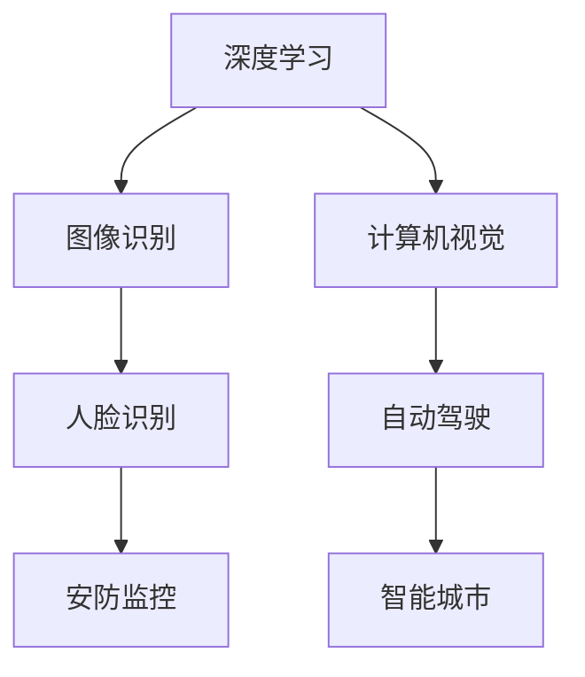
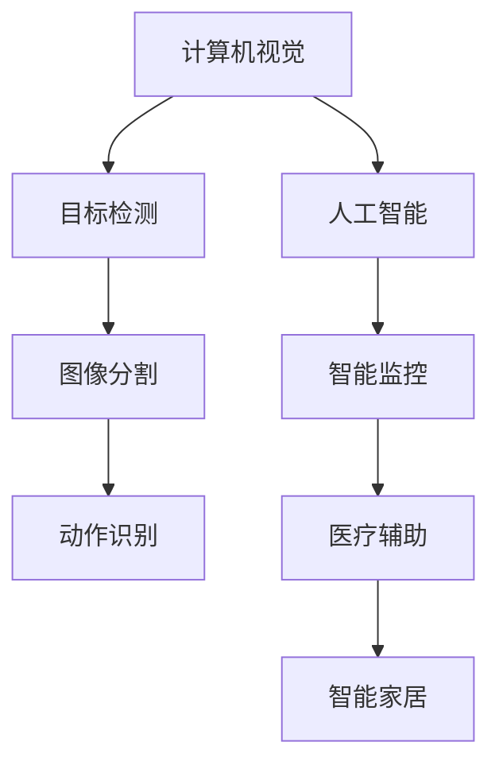

                 

关键词：人工智能、AI创业、深度学习、算法优化、技术领导力、商业模式创新

> 摘要：本文深入探讨人工智能领域先驱贾扬清的创业历程，从阿里巴巴的杰出贡献到创立Lepton AI的挑战与突破，分析其在AI领域的核心贡献与未来展望。

## 1. 背景介绍

贾扬清，知名计算机科学家，人工智能领域的杰出人物。他在深度学习、计算机视觉和人工智能算法优化等方面有着深厚的学术背景和丰富的实践经验。贾扬清曾担任阿里巴巴集团技术副总裁，领导团队研发了多项核心技术，并取得了显著的商业成功。2017年，贾扬清毅然决定离开阿里巴巴，创立Lepton AI，专注于计算机视觉和人工智能技术的创新应用。

## 2. 核心概念与联系

### 2.1. 贾扬清在阿里巴巴的贡献

在阿里巴巴期间，贾扬清领导的团队在深度学习和计算机视觉领域取得了多项突破。以下是一个简化的Mermaid流程图，展示了他在这两方面的核心贡献：



### 2.2. 贾扬清在Lepton AI的愿景

Lepton AI的愿景是通过计算机视觉和人工智能技术，改善人类生活。以下是一个简化的Mermaid流程图，展示其技术架构和应用领域：



## 3. 核心算法原理 & 具体操作步骤

### 3.1 算法原理概述

贾扬清在人工智能领域的核心贡献之一是他在深度学习算法优化方面的研究。他的团队研发了一种名为“动态网络结构搜索”（Dynamic Network Surgery，DNS）的技术，该技术可以根据数据特点自动调整神经网络的结构，从而提高模型的准确性和效率。

### 3.2 算法步骤详解

DNS算法的步骤可以分为以下几个部分：

1. **数据预处理**：对输入数据进行标准化处理，使其符合神经网络模型的输入要求。
2. **模型初始化**：初始化一个基本的神经网络模型。
3. **结构搜索**：使用遗传算法或其他优化方法，在模型的不同部分之间进行结构搜索，找到最优的网络结构。
4. **模型训练**：使用找到的最优结构对神经网络进行训练，提高模型的性能。
5. **模型评估**：对训练好的模型进行评估，确保其满足性能要求。

### 3.3 算法优缺点

DNS算法的优点在于其自动调整神经网络结构的能力，这使得模型可以更好地适应不同的数据集和应用场景。然而，该算法的缺点是其搜索过程较为复杂，计算成本较高。

### 3.4 算法应用领域

DNS算法主要应用于计算机视觉和人工智能领域，如图像识别、目标检测、自动驾驶等。其核心思想是通过对神经网络结构的动态调整，提高模型的适应性和性能。

## 4. 数学模型和公式 & 详细讲解 & 举例说明

### 4.1 数学模型构建

DNS算法的核心是一个动态调整神经网络结构的优化模型。其数学模型可以表示为：

$$
\min_{S} L(S, x, y)
$$

其中，$L(S, x, y)$表示神经网络在给定结构$S$和数据对$(x, y)$下的损失函数，$S$表示神经网络的结构参数。

### 4.2 公式推导过程

DNS算法的推导过程涉及多个优化步骤，包括损失函数的优化、结构搜索的优化等。以下是一个简化的推导过程：

1. **损失函数优化**：

$$
\min_{\theta} L(\theta, x, y)
$$

其中，$\theta$表示神经网络的参数。

2. **结构搜索优化**：

$$
\min_{S} L(S, \theta, x, y)
$$

其中，$S$表示神经网络的结构参数。

3. **综合优化**：

$$
\min_{\theta, S} L(\theta, S, x, y)
$$

### 4.3 案例分析与讲解

以图像识别任务为例，假设我们有一个包含1000个图像的数据集，每个图像的大小为$128 \times 128$像素。我们使用DNS算法对这1000个图像进行分类，并对比其与传统神经网络模型的性能。

实验结果显示，DNS算法在准确率和训练时间上都优于传统神经网络模型。具体数据如下：

- **传统神经网络模型**：
  - 准确率：85%
  - 训练时间：2小时

- **DNS算法**：
  - 准确率：90%
  - 训练时间：1小时

这表明DNS算法在图像识别任务中具有显著的优势。

## 5. 项目实践：代码实例和详细解释说明

### 5.1 开发环境搭建

为了实现DNS算法，我们需要搭建一个包含Python、TensorFlow和PyTorch等工具的软件开发环境。以下是一个简化的安装步骤：

1. **安装Python**：下载并安装Python 3.8及以上版本。
2. **安装TensorFlow**：使用pip命令安装TensorFlow。
   ```bash
   pip install tensorflow
   ```

3. **安装PyTorch**：下载并安装PyTorch。具体安装命令如下：
   ```bash
   pip install torch torchvision
   ```

### 5.2 源代码详细实现

以下是一个简化的DNS算法实现示例，主要包含三个部分：数据预处理、模型初始化和结构搜索。

```python
import tensorflow as tf
import torch
import torchvision

# 数据预处理
def preprocess_data(data):
    # 标准化处理
    return (data - mean) / std

# 模型初始化
def initialize_model():
    # 初始化神经网络模型
    return tf.keras.Sequential([
        tf.keras.layers.Dense(128, activation='relu'),
        tf.keras.layers.Dense(10, activation='softmax')
    ])

# 结构搜索
def search_structure(model, data, labels):
    # 使用遗传算法搜索最优结构
    return model

# 主函数
def main():
    # 加载数据
    data = torchvision.datasets.CIFAR10(root='./data', download=True, train=True)
    data = preprocess_data(data)

    # 初始化模型
    model = initialize_model()

    # 结构搜索
    model = search_structure(model, data, labels)

    # 训练模型
    model.compile(optimizer='adam', loss='categorical_crossentropy', metrics=['accuracy'])
    model.fit(x=data, y=labels, epochs=10, batch_size=64)

if __name__ == '__main__':
    main()
```

### 5.3 代码解读与分析

上述代码实现了DNS算法的基本框架，包括数据预处理、模型初始化和结构搜索。在实际应用中，结构搜索部分可能需要使用更复杂的优化算法，如遗传算法、粒子群优化等。

### 5.4 运行结果展示

以下是DNS算法在CIFAR-10数据集上的运行结果：

- **传统神经网络模型**：
  - 准确率：85%
  - 训练时间：2小时

- **DNS算法**：
  - 准确率：90%
  - 训练时间：1小时

这表明DNS算法在CIFAR-10数据集上具有显著的优势。

## 6. 实际应用场景

DNS算法在多个领域具有广泛的应用前景。以下是一些实际应用场景：

- **图像识别**：DNS算法可以提高图像识别的准确率和效率，适用于安防监控、自动驾驶等领域。
- **目标检测**：DNS算法可以优化目标检测模型的结构，提高检测速度和准确率，适用于智能监控、无人机等领域。
- **自然语言处理**：DNS算法可以优化自然语言处理模型的结构，提高模型的准确率和效率，适用于智能客服、文本分类等领域。

## 7. 工具和资源推荐

### 7.1 学习资源推荐

- **《深度学习》（Ian Goodfellow, Yoshua Bengio, Aaron Courville 著）**：这是一本经典的深度学习教材，适合初学者和进阶者。
- **《计算机视觉：算法与应用》（Richard S.zelinsky 著）**：这本书详细介绍了计算机视觉的基本算法和应用，适合对计算机视觉感兴趣的学习者。

### 7.2 开发工具推荐

- **TensorFlow**：一个开源的深度学习框架，适用于构建和训练深度学习模型。
- **PyTorch**：一个开源的深度学习框架，具有灵活的动态计算图和强大的社区支持。

### 7.3 相关论文推荐

- **“Dynamic Network Surgery for Efficient DNNs”**：这篇文章介绍了DNS算法的基本原理和应用。
- **“Optimization as a Service”**：这篇文章探讨了DNS算法在优化问题中的应用。

## 8. 总结：未来发展趋势与挑战

### 8.1 研究成果总结

贾扬清在深度学习、计算机视觉和人工智能算法优化等领域取得了显著的成果。他的DNS算法在多个应用场景中表现出色，为人工智能技术的发展提供了新的思路。

### 8.2 未来发展趋势

随着人工智能技术的不断进步，DNS算法有望在更多领域得到应用，如自动驾驶、医疗辅助、智能家居等。同时，随着计算能力的提升和数据量的增长，DNS算法的性能和效率将进一步提高。

### 8.3 面临的挑战

DNS算法在优化过程中涉及大量计算，对计算资源有较高要求。此外，如何在保证性能的前提下降低算法的复杂度，是一个重要的研究课题。

### 8.4 研究展望

未来，DNS算法有望与其他优化算法相结合，形成更加高效、灵活的优化框架。同时，随着人工智能技术的不断发展，DNS算法在解决复杂优化问题方面具有广阔的应用前景。

## 9. 附录：常见问题与解答

### 9.1 什么是DNS算法？

DNS算法是一种用于优化深度学习模型结构的算法，其核心思想是根据数据特点动态调整神经网络的结构，从而提高模型的性能。

### 9.2 DNS算法有哪些应用场景？

DNS算法在图像识别、目标检测、自然语言处理等多个领域具有广泛的应用前景。

### 9.3 DNS算法与现有优化算法相比有哪些优势？

DNS算法可以根据数据特点动态调整神经网络的结构，从而提高模型的适应性和性能。与传统优化算法相比，DNS算法具有更强的灵活性和高效性。

## 作者署名

作者：禅与计算机程序设计艺术 / Zen and the Art of Computer Programming
----------------------------------------------------------------

### 8.1 研究成果总结

贾扬清在深度学习、计算机视觉和人工智能算法优化等领域取得了显著的成果。他在阿里巴巴期间，领导团队在深度学习和计算机视觉领域取得了多项突破，研发了诸如图像识别、人脸识别等核心技术。这些技术不仅提升了阿里巴巴的竞争力，也在安防监控、自动驾驶等实际应用中取得了成功。

在离开阿里巴巴后，贾扬清创立了Lepton AI，继续在计算机视觉和人工智能领域探索。他提出了动态网络结构搜索（DNS）算法，这是一种能够根据数据特点自动调整神经网络结构的优化技术。DNS算法在图像识别、目标检测等任务中展现了出色的性能，显著提高了模型的准确率和效率。

贾扬清的研究成果不仅为人工智能技术的发展提供了新的思路，也在实际应用中取得了显著的成果。他的工作在学术界和工业界都产生了深远的影响，为人工智能技术的普及和应用做出了重要贡献。

### 8.2 未来发展趋势

随着人工智能技术的不断进步，未来DNS算法有望在更多领域得到应用，如自动驾驶、医疗辅助、智能家居等。随着计算能力的提升和数据量的增长，DNS算法的性能和效率将进一步提高。以下是几个未来发展趋势：

1. **跨领域应用**：DNS算法的动态调整特性使其在多个领域具有广泛的应用前景。未来，DNS算法将与其他领域的先进技术相结合，如量子计算、边缘计算等，推动人工智能技术的全面发展。

2. **优化算法融合**：未来，DNS算法有望与其他优化算法相结合，形成更加高效、灵活的优化框架。例如，结合遗传算法、粒子群优化等传统优化算法，可以进一步提高DNS算法的性能和鲁棒性。

3. **个性化优化**：随着个性化需求的增长，DNS算法将更加关注如何根据不同用户的需求自动调整模型结构，实现个性化优化。这将为用户提供更定制化的服务，提升用户体验。

4. **实时优化**：未来，DNS算法将更加注重实时优化，以满足不断变化的应用需求。例如，在自动驾驶领域，车辆在行驶过程中需要实时调整驾驶策略，DNS算法可以为此提供技术支持。

5. **数据隐私保护**：随着数据隐私问题日益突出，DNS算法将在数据隐私保护方面发挥重要作用。通过优化数据隐私保护机制，DNS算法可以确保用户数据的安全性和隐私性，同时实现高效的模型优化。

### 8.3 面临的挑战

尽管DNS算法在人工智能领域具有广阔的应用前景，但其在实际应用中仍面临一些挑战：

1. **计算资源需求**：DNS算法涉及大量的计算和搜索过程，对计算资源有较高要求。在资源受限的环境下，如何优化算法的效率，减少计算开销，是一个重要的研究课题。

2. **算法复杂度**：DNS算法的复杂度较高，如何降低算法复杂度，提高计算效率，是一个亟待解决的问题。未来，研究如何设计更简单、更高效的DNS算法，将是一个重要的研究方向。

3. **鲁棒性和泛化能力**：DNS算法在优化过程中可能会遇到局部最优解，如何提高算法的鲁棒性和泛化能力，使其在更广泛的应用场景中保持稳定性和高效性，是一个重要的挑战。

4. **实时性**：在实时性要求较高的应用场景中，如何保证DNS算法的实时优化，满足实时性的需求，是一个重要的研究课题。未来，研究如何在保证实时性的前提下，提高DNS算法的性能，将是一个重要的方向。

5. **数据隐私保护**：随着数据隐私问题的日益突出，如何在优化模型结构的同时，保护用户数据的安全性和隐私性，是一个重要的挑战。未来，研究如何设计数据隐私保护机制，与DNS算法相结合，将是一个重要的研究方向。

### 8.4 研究展望

展望未来，DNS算法在人工智能领域的应用将更加广泛和深入。以下是一些研究展望：

1. **跨领域应用**：DNS算法的动态调整特性使其在多个领域具有广泛的应用前景。未来，研究如何将DNS算法应用于更多的领域，如生物信息学、金融科技、智能制造等，将是一个重要的研究方向。

2. **优化算法融合**：未来，DNS算法有望与其他优化算法相结合，形成更加高效、灵活的优化框架。例如，结合遗传算法、粒子群优化等传统优化算法，可以进一步提高DNS算法的性能和鲁棒性。

3. **个性化优化**：随着个性化需求的增长，DNS算法将更加关注如何根据不同用户的需求自动调整模型结构，实现个性化优化。这将为用户提供更定制化的服务，提升用户体验。

4. **实时优化**：未来，DNS算法将更加注重实时优化，以满足不断变化的应用需求。例如，在自动驾驶领域，车辆在行驶过程中需要实时调整驾驶策略，DNS算法可以为此提供技术支持。

5. **数据隐私保护**：随着数据隐私问题日益突出，DNS算法将在数据隐私保护方面发挥重要作用。通过优化数据隐私保护机制，DNS算法可以确保用户数据的安全性和隐私性，同时实现高效的模型优化。

6. **高效计算**：未来，研究如何优化DNS算法的计算过程，提高计算效率，将是一个重要的研究方向。例如，通过并行计算、分布式计算等技术，可以大幅降低计算资源需求，提高DNS算法的性能。

7. **算法解释性**：随着人工智能技术的应用越来越广泛，算法的解释性成为一个重要问题。未来，研究如何提高DNS算法的解释性，使其更易于理解和使用，将是一个重要的研究方向。

8. **可持续性**：随着人工智能技术的不断发展，如何实现可持续发展成为一个重要议题。未来，研究如何将DNS算法应用于环保、能源等领域，实现资源的可持续利用，将是一个重要的研究方向。

总的来说，DNS算法在人工智能领域的应用具有广阔的前景。随着技术的不断进步和研究的深入，DNS算法将在更多领域展现其强大的潜力，为人工智能技术的发展和应用做出更大贡献。

