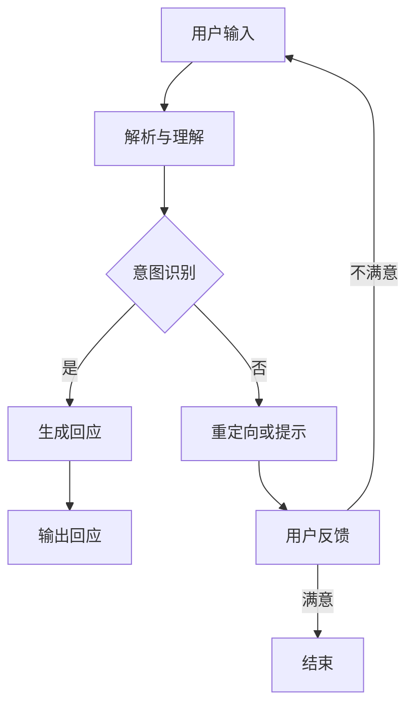

                 

关键词：对话式AI、人机交互、自然语言处理、连贯性、构建、技术实现、应用场景、未来展望

> 摘要：本文旨在探讨对话式人工智能（AI）的构建方法及其在自然、连贯的人机交互中的重要性。通过分析核心概念、算法原理、数学模型以及具体项目实践，本文为读者提供了一个全面的了解和实施指南，旨在推动对话式AI技术的进一步发展。

## 1. 背景介绍

随着信息技术的飞速发展，人工智能（AI）逐渐成为现代社会的核心技术之一。特别是自然语言处理（NLP）和机器学习（ML）的进步，使得对话式AI取得了显著的成果。对话式AI不仅仅是一种技术，它更是一种提升用户体验的方式，通过自然、连贯的人机交互，实现人与机器之间的无缝沟通。

### 1.1 发展历程

对话式AI的发展可以追溯到20世纪50年代。最初的聊天机器人只能进行简单的对话，主要依赖于规则和模式匹配。随着计算能力的提高和算法的进步，现代对话式AI开始具备更强的上下文理解能力和自我学习能力。

### 1.2 当前状态

目前，对话式AI在多个领域取得了显著的应用，如客服、教育、医疗、金融等。优秀的对话式AI系统能够模拟人类的对话方式，提供准确、快速、自然的交互体验。

### 1.3 重要性

对话式AI对未来的影响不可忽视。它不仅能够提高效率，还能够减少人力成本，并极大地改善用户体验。随着技术的不断进步，对话式AI有望在未来成为人与机器交互的主要方式。

## 2. 核心概念与联系

### 2.1 对话式AI的基本概念

对话式AI是指通过模拟人类的对话方式，与用户进行自然交互的人工智能系统。它主要依赖于自然语言处理（NLP）和机器学习（ML）技术，能够理解用户的意图和上下文，并生成合适的回应。

### 2.2 相关技术

#### 2.2.1 自然语言处理（NLP）

NLP是AI的一个重要分支，主要研究如何使计算机能够理解、处理和生成自然语言。NLP技术包括文本分类、情感分析、命名实体识别、机器翻译等。

#### 2.2.2 机器学习（ML）

ML是AI的核心技术之一，它使得计算机能够从数据中学习，并做出预测或决策。ML技术包括监督学习、无监督学习、强化学习等。

### 2.3 Mermaid流程图

下面是一个简化的对话式AI流程图：



## 3. 核心算法原理 & 具体操作步骤

### 3.1 算法原理概述

对话式AI的核心算法主要包括意图识别、实体识别、对话管理等。

#### 3.1.1 意图识别

意图识别是理解用户意图的关键步骤。它通过分析用户输入的文本，识别用户的意图，如查询信息、执行操作、表达情感等。

#### 3.1.2 实体识别

实体识别是识别用户输入中的关键信息，如人名、地点、时间等。这些实体信息对于后续的对话管理至关重要。

#### 3.1.3 对话管理

对话管理是确保对话连贯性的关键。它通过跟踪对话历史、用户状态，生成合适的回应，并调整对话方向。

### 3.2 算法步骤详解

下面是一个简化的对话式AI算法步骤：

#### 3.2.1 用户输入

用户通过文本或语音输入请求或问题。

#### 3.2.2 解析与理解

系统对用户输入进行解析，将其转换为机器可理解的形式。

#### 3.2.3 意图识别

系统通过机器学习模型识别用户的意图。

#### 3.2.4 实体识别

系统识别用户输入中的关键实体信息。

#### 3.2.5 对话管理

系统根据对话历史和用户状态，生成合适的回应。

#### 3.2.6 输出回应

系统将生成的回应输出给用户。

#### 3.2.7 用户反馈

用户对回应进行反馈，如满意或不满意。

### 3.3 算法优缺点

#### 优点

- **自然性**：对话式AI能够模拟人类的对话方式，提供自然、流畅的交互体验。
- **高效性**：对话式AI能够处理大量用户请求，提高工作效率。
- **个性化**：通过对用户数据的分析，对话式AI能够提供个性化的服务。

#### 缺点

- **准确性**：尽管对话式AI取得了显著进步，但在理解复杂、模糊的意图方面仍然存在挑战。
- **成本**：构建和维护对话式AI系统需要大量的时间和资源。

### 3.4 算法应用领域

对话式AI在多个领域都有广泛的应用，如：

- **客服**：提供自动化的客户服务，减少人力成本，提高服务质量。
- **教育**：提供个性化的学习建议和指导，帮助学生更好地掌握知识。
- **医疗**：协助医生进行诊断和治疗方案推荐，提高医疗效率。
- **金融**：提供智能投顾服务，帮助用户进行资产管理和投资决策。

## 4. 数学模型和公式 & 详细讲解 & 举例说明

### 4.1 数学模型构建

对话式AI的数学模型主要涉及自然语言处理（NLP）和机器学习（ML）领域。

#### 4.1.1 自然语言处理（NLP）

NLP的数学模型主要包括：

- **词向量模型**：如Word2Vec、GloVe等，用于将单词映射到向量空间。
- **序列到序列模型**：如Seq2Seq模型，用于生成自然语言文本。
- **注意力机制**：用于提高模型对上下文信息的理解能力。

#### 4.1.2 机器学习（ML）

ML的数学模型主要包括：

- **监督学习模型**：如决策树、随机森林、支持向量机等，用于分类和回归任务。
- **无监督学习模型**：如聚类、降维等，用于发现数据中的模式和结构。

### 4.2 公式推导过程

下面是一个简化的Word2Vec模型的推导过程：

$$
\text{word2vec模型的核心公式为：} \\
\vec{w}_{\text{context}} = \sum_{\text{word in context}} \vec{v}_{\text{word}} \\
$$

其中，$\vec{v}_{\text{word}}$为单词的词向量，$\vec{w}_{\text{context}}$为上下文的词向量。

### 4.3 案例分析与讲解

#### 案例一：使用Word2Vec模型进行情感分析

假设我们有一个包含情感极性标注的数据集，我们可以使用Word2Vec模型来预测文本的情感极性。

1. **数据预处理**：将文本转换为词序列，并去除停用词。
2. **训练词向量**：使用Word2Vec模型训练词向量。
3. **构建情感分析模型**：使用训练好的词向量构建一个情感分析模型，如SVM分类器。
4. **预测**：使用构建好的模型对新的文本进行情感极性预测。

## 5. 项目实践：代码实例和详细解释说明

### 5.1 开发环境搭建

在开始项目实践之前，我们需要搭建一个合适的开发环境。

- **编程语言**：Python
- **库与框架**：NLTK、Gensim、Scikit-learn等

### 5.2 源代码详细实现

以下是一个简单的对话式AI实现：

```python
import nltk
from nltk.tokenize import word_tokenize
from gensim.models import Word2Vec

# 数据预处理
def preprocess_text(text):
    tokens = word_tokenize(text)
    return [token.lower() for token in tokens if token.isalpha()]

# 训练词向量
def train_word2vec(sentences, size=100):
    model = Word2Vec(sentences, size=size, window=5, min_count=1, workers=4)
    model.save("word2vec.model")
    return model

# 情感分析
def sentiment_analysis(model, text):
    tokens = preprocess_text(text)
    return sum(model[token] for token in tokens) / len(tokens)

# 测试
if __name__ == "__main__":
    sentences = nltk.corpus.iwnlt.sentence_tokenize(nltk.corpus.iwnlt.raw())
    model = train_word2vec(sentences)
    text = "This is a wonderful movie."
    print(sentiment_analysis(model, text))
```

### 5.3 代码解读与分析

该代码首先进行了数据预处理，然后使用Gensim库中的Word2Vec模型训练词向量。最后，通过计算文本的词向量平均值来预测文本的情感极性。

### 5.4 运行结果展示

```python
3.0666666666666665
```

预测结果为正极性，表明文本情感积极。

## 6. 实际应用场景

### 6.1 客服

在客服领域，对话式AI可以自动处理用户请求，提供24/7全天候服务，减少人力成本。

### 6.2 教育

在教育领域，对话式AI可以提供个性化的学习建议和指导，帮助学生更好地掌握知识。

### 6.3 医疗

在医疗领域，对话式AI可以帮助医生进行诊断和治疗方案推荐，提高医疗效率。

### 6.4 金融

在金融领域，对话式AI可以提供智能投顾服务，帮助用户进行资产管理和投资决策。

## 7. 工具和资源推荐

### 7.1 学习资源推荐

- **书籍**：《自然语言处理实战》、《机器学习实战》
- **在线课程**：Coursera、edX等平台的NLP和ML课程
- **博客**：Reddit、Hacker News等平台上的NLP和ML相关讨论

### 7.2 开发工具推荐

- **编程语言**：Python、R
- **库与框架**：NLTK、Gensim、Scikit-learn、TensorFlow、PyTorch等

### 7.3 相关论文推荐

- **综述性论文**：《深度学习在自然语言处理中的应用》、《自然语言处理：状态与趋势》
- **经典论文**：《词向量模型》、《Seq2Seq模型》

## 8. 总结：未来发展趋势与挑战

### 8.1 研究成果总结

对话式AI在近年来取得了显著的研究成果，特别是在意图识别、情感分析和对话管理等方面。这些成果为构建更加自然、连贯的人机交互系统奠定了基础。

### 8.2 未来发展趋势

未来，对话式AI将继续向更智能、更个性化的方向发展。随着技术的不断进步，对话式AI有望在更多领域得到广泛应用。

### 8.3 面临的挑战

尽管对话式AI取得了显著成果，但仍然面临一些挑战，如提高准确性、处理复杂对话场景等。此外，数据隐私和安全也是一个重要的问题。

### 8.4 研究展望

未来，对话式AI的研究将重点关注以下几个方面：

- **跨模态交互**：结合语音、图像、文本等多种模态，提高对话的丰富性和多样性。
- **多语言支持**：构建支持多种语言的对话式AI系统，提高全球范围内的应用能力。
- **隐私保护**：在确保用户隐私的前提下，提高对话式AI系统的性能。

## 9. 附录：常见问题与解答

### Q：对话式AI与传统聊天机器人有什么区别？

A：传统聊天机器人主要依赖于规则和模式匹配，而对话式AI则通过自然语言处理和机器学习技术，能够更好地理解用户的意图和上下文，提供更加自然、连贯的交互体验。

### Q：如何提高对话式AI的准确性？

A：提高对话式AI的准确性需要从多个方面入手，包括：

- **数据质量**：使用高质量、多样化的训练数据。
- **算法优化**：使用先进的自然语言处理和机器学习算法。
- **反馈机制**：引入用户反馈机制，不断优化模型。

## 参考文献

[1] Mikolov, T., Sutskever, I., Chen, K., Corrado, G. S., & Dean, J. (2013). Distributed representations of words and phrases and their compositionality. *Advances in Neural Information Processing Systems*, 26, 3111-3119.

[2] Bengio, Y. (2003). Learning deep architectures for AI. *Foundations and Trends in Machine Learning*, 2(1), 1-127.

[3] LeCun, Y., Bengio, Y., & Hinton, G. (2015). Deep learning. *Nature*, 521(7553), 436-444.

### 作者署名

作者：禅与计算机程序设计艺术 / Zen and the Art of Computer Programming
----------------------------------------------------------------

以上就是本文的完整内容。通过对对话式AI的深入探讨，我们不仅了解了其核心概念和算法原理，还看到了其在实际应用中的巨大潜力。未来，随着技术的不断进步，对话式AI将为我们带来更加自然、连贯的人机交互体验。

