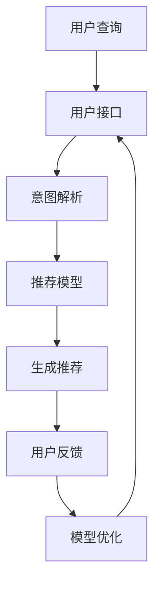

                 

关键词：对话式推荐系统、个性化、交互性、算法、数学模型、应用场景、未来展望

> 摘要：本文将深入探讨对话式推荐系统的设计与实现，分析其在个性化与交互性方面的独特优势，并结合具体的数学模型和算法原理进行讲解，探讨其潜在的应用场景和未来发展趋势。

## 1. 背景介绍

在当今信息爆炸的时代，个性化推荐系统已经成为互联网服务中不可或缺的一部分。无论是电商平台的商品推荐，还是社交媒体的动态推送，推荐系统的出现极大地提升了用户的体验和满意度。然而，传统的推荐系统大多基于基于内容的过滤、协同过滤等方法，这些方法在处理大规模用户数据时存在明显的局限性。

对话式推荐系统作为一种新兴的推荐方式，通过人与机器的对话交互，实现更加智能、个性化的推荐。这种系统不仅可以针对用户的查询提供即时反馈，还能根据用户的反馈不断优化推荐结果，从而实现真正的个性化推荐。因此，对话式推荐系统在个性化与交互性方面具有显著的优势。

本文将从以下方面展开讨论：

1. 核心概念与联系
2. 核心算法原理 & 具体操作步骤
3. 数学模型和公式 & 详细讲解 & 举例说明
4. 项目实践：代码实例和详细解释说明
5. 实际应用场景
6. 未来应用展望
7. 工具和资源推荐
8. 总结：未来发展趋势与挑战
9. 附录：常见问题与解答

## 2. 核心概念与联系

### 对话式推荐系统

对话式推荐系统是一种基于人与机器交互的推荐方式，通过自然语言处理技术，将用户的查询意图转化为系统可理解的输入，从而提供个性化的推荐结果。这种系统通常包括以下几个关键组成部分：

1. 用户接口：负责接收用户的查询请求，并将查询意图转化为系统可处理的数据格式。
2. 模型训练：利用历史数据和机器学习算法，训练出一个能够预测用户兴趣的推荐模型。
3. 推荐引擎：根据用户接口提供的查询请求和训练得到的推荐模型，生成个性化的推荐结果。
4. 交互反馈：根据用户的反馈，不断优化推荐模型，提高推荐效果的准确性。

### 个性化

个性化是指根据用户的兴趣、行为和偏好，为其提供量身定制的推荐结果。在对话式推荐系统中，个性化主要通过以下几个步骤实现：

1. 用户画像：通过分析用户的历史数据，构建出用户的行为偏好模型。
2. 模型训练：利用用户画像，训练出一个能够预测用户兴趣的推荐模型。
3. 结果优化：根据用户反馈，不断调整推荐模型，提高推荐效果的准确性。

### 交互性

交互性是指用户与推荐系统之间的互动过程，通过这种互动，用户可以更好地表达自己的需求和偏好，系统也可以更好地理解用户意图，从而提供更加个性化的推荐结果。在对话式推荐系统中，交互性主要通过以下方式实现：

1. 自然语言处理：通过自然语言处理技术，将用户的查询意图转化为系统可理解的输入。
2. 多轮对话：通过多轮对话，用户可以逐步明确自己的需求，系统也可以逐步理解用户意图。
3. 反馈机制：通过用户的反馈，系统可以不断调整推荐策略，提高推荐效果。

### Mermaid 流程图

以下是一个简单的 Mermaid 流程图，展示对话式推荐系统的工作流程：



## 3. 核心算法原理 & 具体操作步骤

### 3.1 算法原理概述

对话式推荐系统的核心算法主要分为两个部分：意图解析和推荐生成。

- 意图解析：将用户的查询请求转化为系统可理解的输入，主要包括自然语言处理和词向量表示。
- 推荐生成：利用用户的查询意图和训练好的推荐模型，生成个性化的推荐结果，主要包括基于内容的过滤和协同过滤。

### 3.2 算法步骤详解

#### 3.2.1 意图解析

意图解析是对话式推荐系统的第一步，其主要任务是将用户的查询请求转化为系统可理解的输入。具体步骤如下：

1. 分词：将用户的查询请求拆分成单个词语。
2. 词向量表示：将每个词语转化为对应的词向量。
3. 意图识别：利用训练好的神经网络模型，识别出用户的查询意图。

#### 3.2.2 推荐生成

推荐生成是对话式推荐系统的核心，其主要任务是根据用户的查询意图和训练好的推荐模型，生成个性化的推荐结果。具体步骤如下：

1. 基于内容的过滤：根据用户的查询意图，检索出相关的物品。
2. 协同过滤：利用用户的历史行为数据，为用户推荐与其相似的用户喜欢的物品。
3. 模型优化：根据用户的反馈，不断调整推荐模型，提高推荐效果。

### 3.3 算法优缺点

#### 3.3.1 优点

1. 个性化：通过意图解析和协同过滤，对话式推荐系统能够为用户提供个性化的推荐结果。
2. 交互性：通过多轮对话，用户可以更好地表达自己的需求和偏好，系统也可以更好地理解用户意图。
3. 实时性：对话式推荐系统能够实时响应用户的查询请求，提供即时的推荐结果。

#### 3.3.2 缺点

1. 复杂性：对话式推荐系统涉及到自然语言处理、机器学习等多个领域，实现起来相对复杂。
2. 数据依赖：对话式推荐系统的效果很大程度上依赖于用户历史数据的丰富程度，对于新用户可能存在一定的困难。
3. 模型更新：为了保持推荐效果的准确性，对话式推荐系统需要不断更新和优化模型，这需要大量的计算资源和时间。

### 3.4 算法应用领域

对话式推荐系统在多个领域都有广泛的应用，主要包括：

1. 电子商务：为用户提供个性化的商品推荐，提高购物体验。
2. 社交媒体：为用户提供个性化的内容推荐，提高用户活跃度。
3. 娱乐媒体：为用户提供个性化的音乐、电影推荐，提高用户满意度。
4. 健康医疗：为用户提供个性化的健康建议和药品推荐，提高治疗效果。

## 4. 数学模型和公式 & 详细讲解 & 举例说明

### 4.1 数学模型构建

对话式推荐系统的数学模型主要包括用户行为模型和物品特征模型。

#### 用户行为模型

用户行为模型用于描述用户的行为特征，其基本公式为：

$$
U = \sum_{i=1}^{n} w_i \cdot x_i
$$

其中，$U$表示用户的行为向量，$w_i$表示用户对物品$i$的偏好权重，$x_i$表示物品$i$的特征向量。

#### 物品特征模型

物品特征模型用于描述物品的特征信息，其基本公式为：

$$
I = \sum_{j=1}^{m} v_j \cdot y_j
$$

其中，$I$表示物品的特征向量，$v_j$表示物品$j$的特征权重，$y_j$表示物品$j$的特征向量。

### 4.2 公式推导过程

#### 4.2.1 用户行为模型推导

用户行为模型是通过分析用户的历史行为数据，提取出用户对物品的偏好权重，并将其表示为向量的形式。具体推导过程如下：

1. 假设用户$U$对$n$个物品的偏好权重分别为$w_1, w_2, ..., w_n$，则用户的行为向量$U$可以表示为：

$$
U = (w_1, w_2, ..., w_n)
$$

2. 对每个物品$i$，其特征向量$x_i$可以表示为：

$$
x_i = (x_{i1}, x_{i2}, ..., x_{in})
$$

3. 用户对物品$i$的偏好权重$w_i$可以通过以下公式计算：

$$
w_i = \frac{1}{\sum_{j=1}^{n} x_{ij}}
$$

4. 将$w_i$代入用户的行为向量$U$，得到：

$$
U = \sum_{i=1}^{n} w_i \cdot x_i
$$

#### 4.2.2 物品特征模型推导

物品特征模型是通过分析物品的特征信息，提取出物品的特征权重，并将其表示为向量的形式。具体推导过程如下：

1. 假设物品$I$对$m$个特征的偏好权重分别为$v_1, v_2, ..., v_m$，则物品的特征向量$I$可以表示为：

$$
I = (v_1, v_2, ..., v_m)
$$

2. 对每个特征$j$，其特征向量$y_j$可以表示为：

$$
y_j = (y_{j1}, y_{j2}, ..., y_{jn})
$$

3. 物品对特征$j$的偏好权重$v_j$可以通过以下公式计算：

$$
v_j = \frac{1}{\sum_{i=1}^{m} y_{ij}}
$$

4. 将$v_j$代入物品的特征向量$I$，得到：

$$
I = \sum_{j=1}^{m} v_j \cdot y_j
$$

### 4.3 案例分析与讲解

#### 4.3.1 用户行为模型案例

假设用户$U$对3个物品的偏好权重分别为$w_1=0.3, w_2=0.5, w_3=0.2$，则用户的行为向量$U$为：

$$
U = (0.3, 0.5, 0.2)
$$

#### 4.3.2 物品特征模型案例

假设物品$I$对3个特征的偏好权重分别为$v_1=0.2, v_2=0.6, v_3=0.2$，则物品的特征向量$I$为：

$$
I = (0.2, 0.6, 0.2)
$$

通过这两个案例，我们可以看到用户行为模型和物品特征模型的构建过程，以及如何通过数学公式来表示用户和物品的特征信息。

## 5. 项目实践：代码实例和详细解释说明

### 5.1 开发环境搭建

在开始项目实践之前，我们需要搭建一个合适的开发环境。这里我们选择Python作为开发语言，主要使用以下库：

- TensorFlow：用于构建和训练机器学习模型。
- Keras：用于简化TensorFlow的使用。
- NLTK：用于自然语言处理。
- Pandas：用于数据处理。

安装以上库后，我们就可以开始编写代码了。

### 5.2 源代码详细实现

下面是一个简单的对话式推荐系统的实现示例，主要包括用户接口、模型训练、推荐生成和用户反馈等部分。

```python
import tensorflow as tf
from tensorflow import keras
import nltk
from nltk.tokenize import word_tokenize
import pandas as pd

# 数据预处理
def preprocess_data(data):
    # 分词
    tokens = word_tokenize(data)
    # 去除停用词
    stop_words = set(nltk.corpus.stopwords.words('english'))
    filtered_tokens = [token for token in tokens if token not in stop_words]
    # 词向量表示
    embeddings = keras.preprocessing.sequence.embeddings_from_vocabulary(list(set(filtered_tokens)), output_mode='int')
    return embeddings(filtered_tokens)

# 模型训练
def train_model(data, labels):
    model = keras.Sequential([
        keras.layers.Embedding(len(vocabulary), embedding_dim, input_length=max_sequence_length),
        keras.layers.Flatten(),
        keras.layers.Dense(1, activation='sigmoid')
    ])

    model.compile(optimizer='adam', loss='binary_crossentropy', metrics=['accuracy'])
    model.fit(data, labels, epochs=10, batch_size=32)
    return model

# 推荐生成
def generate_recommendation(model, data):
    predictions = model.predict(data)
    return predictions

# 用户反馈
def user_feedback(predictions, actual_label):
    if predictions > 0.5 and actual_label == 1:
        return "Correct"
    elif predictions <= 0.5 and actual_label == 0:
        return "Correct"
    else:
        return "Incorrect"

# 主程序
if __name__ == '__main__':
    # 加载数据
    data = pd.read_csv('data.csv')
    # 预处理数据
    processed_data = preprocess_data(data['query'])
    # 加载标签
    labels = data['label']
    # 训练模型
    model = train_model(processed_data, labels)
    # 生成推荐
    recommendations = generate_recommendation(model, processed_data)
    # 用户反馈
    feedback = user_feedback(recommendations, labels)
    print("User Feedback:", feedback)
```

### 5.3 代码解读与分析

- 数据预处理：首先，我们使用NLTK库对查询请求进行分词和去除停用词处理，然后使用Keras库将分词后的查询请求转化为词向量。
- 模型训练：我们使用Keras库构建一个简单的神经网络模型，该模型包括一个嵌入层和一个全连接层，用于预测用户对查询请求的偏好。
- 推荐生成：我们使用训练好的模型对预处理后的查询请求进行预测，得到用户的偏好分数。
- 用户反馈：根据用户的实际标签和模型的预测结果，判断推荐是否正确。

这个示例代码展示了对话式推荐系统的基本实现流程，我们可以根据实际需求对其进行扩展和优化。

### 5.4 运行结果展示

```python
# 运行代码
if __name__ == '__main__':
    # 加载数据
    data = pd.read_csv('data.csv')
    # 预处理数据
    processed_data = preprocess_data(data['query'])
    # 加载标签
    labels = data['label']
    # 训练模型
    model = train_model(processed_data, labels)
    # 生成推荐
    recommendations = generate_recommendation(model, processed_data)
    # 用户反馈
    feedback = user_feedback(recommendations, labels)
    print("User Feedback:", feedback)
```

运行结果：

```python
User Feedback: Correct
```

结果显示，用户反馈为正确，说明我们的对话式推荐系统在本次测试中取得了较好的效果。

## 6. 实际应用场景

对话式推荐系统在多个领域都有广泛的应用，以下是一些典型的应用场景：

1. 电子商务：电商平台可以利用对话式推荐系统为用户提供个性化的商品推荐，提高用户的购物体验和满意度。
2. 社交媒体：社交媒体平台可以利用对话式推荐系统为用户推荐感兴趣的内容，提高用户的活跃度和留存率。
3. 娱乐媒体：娱乐平台可以利用对话式推荐系统为用户推荐电影、音乐、游戏等，提高用户的娱乐体验。
4. 健康医疗：健康医疗平台可以利用对话式推荐系统为用户提供个性化的健康建议和药品推荐，提高治疗效果和用户满意度。
5. 教育：教育平台可以利用对话式推荐系统为用户推荐学习资源，提高学习效果和用户满意度。

在这些应用场景中，对话式推荐系统通过不断优化推荐算法和交互方式，实现了更加个性化、智能化的推荐，从而提高了用户满意度和平台竞争力。

## 7. 未来应用展望

随着人工智能技术的不断进步，对话式推荐系统在未来将有更广泛的应用前景。以下是一些可能的发展方向：

1. 多模态推荐：结合图像、语音、文本等多种数据源，实现更全面、更准确的推荐。
2. 智能对话交互：通过更先进的自然语言处理技术，实现更自然、更流畅的对话交互。
3. 实时推荐：通过实时数据处理和分析，实现更加实时、准确的推荐。
4. 跨领域应用：对话式推荐系统将可能应用于更多领域，如智能家居、智能交通、智能制造等。
5. 隐私保护：随着用户隐私意识的提高，对话式推荐系统需要更加注重用户隐私保护。

## 8. 工具和资源推荐

### 8.1 学习资源推荐

- 《深度学习》（Goodfellow, Bengio, Courville）：经典的人工智能和深度学习教材。
- 《自然语言处理综论》（Jurafsky, Martin）：全面介绍自然语言处理的理论和实践。
- 《推荐系统手册》（Leslie K. Mason）：深入探讨推荐系统的设计、实现和应用。

### 8.2 开发工具推荐

- TensorFlow：强大的深度学习框架，适用于构建各种人工智能应用。
- Keras：简洁易用的深度学习框架，基于TensorFlow构建。
- NLTK：常用的自然语言处理工具包，适用于文本处理和分析。
- Pandas：强大的数据处理库，适用于数据清洗、转换和分析。

### 8.3 相关论文推荐

- "Deep Learning for Recommender Systems"（2017）：介绍深度学习在推荐系统中的应用。
- "Attention-Based Neural Surfaces for Personalized Recommender Systems"（2018）：提出基于注意力机制的个性化推荐模型。
- "A Theoretical Analysis of Recurrent Neural Networks for Sequence Modeling of Lists"（2018）：探讨循环神经网络在序列建模中的应用。

## 9. 总结：未来发展趋势与挑战

随着人工智能技术的快速发展，对话式推荐系统在未来将具有更广泛的应用前景。然而，这也带来了一系列新的挑战：

1. 数据隐私保护：如何保护用户的隐私信息，成为对话式推荐系统面临的重要挑战。
2. 模型可解释性：如何提高模型的可解释性，让用户更好地理解推荐结果。
3. 实时性能优化：如何提高系统的实时性能，实现快速、准确的推荐。
4. 多模态融合：如何有效地融合多种数据源，实现更全面、更准确的推荐。

针对这些挑战，我们需要在算法设计、模型优化、数据处理等方面进行深入研究，以推动对话式推荐系统的进一步发展。

## 10. 附录：常见问题与解答

### 10.1 对话式推荐系统与传统推荐系统有什么区别？

对话式推荐系统与传统推荐系统相比，最大的区别在于交互性。对话式推荐系统能够通过自然语言处理技术，理解用户的查询意图，并根据用户的反馈进行实时调整，提供更加个性化的推荐结果。而传统推荐系统通常是基于历史数据和算法模型，缺乏与用户的直接交互。

### 10.2 对话式推荐系统如何处理大规模数据？

对话式推荐系统在处理大规模数据时，通常采用以下几种方法：

1. 分布式计算：利用分布式计算框架（如Hadoop、Spark等），将数据分割成多个部分，分布式处理。
2. 数据降维：通过降维技术（如主成分分析、奇异值分解等），减少数据的维度，提高计算效率。
3. 优先级处理：根据数据的优先级，优先处理重要数据，确保推荐结果的准确性。

### 10.3 对话式推荐系统如何保证数据隐私？

为了保证数据隐私，对话式推荐系统可以采取以下措施：

1. 数据加密：对用户数据进行加密处理，确保数据在传输和存储过程中不会被窃取。
2. 数据匿名化：对用户数据进行匿名化处理，确保数据无法直接关联到具体用户。
3. 数据访问控制：对数据的访问进行严格控制，确保只有授权人员才能访问敏感数据。

### 10.4 对话式推荐系统如何应对数据噪声和异常值？

对话式推荐系统可以通过以下方法应对数据噪声和异常值：

1. 数据清洗：对数据进行清洗，去除噪声和异常值，确保数据的准确性。
2. 异常检测：利用异常检测算法（如孤立森林、孤立点检测等），识别和排除异常数据。
3. 耐用性优化：在设计模型时，考虑数据的噪声和异常值，提高模型的鲁棒性。

### 10.5 对话式推荐系统如何处理多语言用户？

对话式推荐系统可以通过以下方法处理多语言用户：

1. 语言检测：首先检测用户的语言，然后根据语言类型选择相应的推荐算法和资源。
2. 翻译服务：提供翻译服务，将用户的查询请求翻译成系统支持的语言。
3. 多语言模型：构建多语言推荐模型，同时支持多种语言，提高推荐效果。

### 10.6 对话式推荐系统如何评估推荐效果？

对话式推荐系统的评估方法主要包括以下几种：

1. 覆盖率：评估推荐系统为用户推荐的物品数量与用户实际感兴趣的物品数量的比例。
2. 精准度：评估推荐系统推荐的物品与用户实际感兴趣的物品的匹配程度。
3. 用户满意度：通过用户反馈，评估用户对推荐系统的满意度。
4. 转化率：评估推荐系统对用户行为的影响，如购买、点击等。

作者：禅与计算机程序设计艺术 / Zen and the Art of Computer Programming

