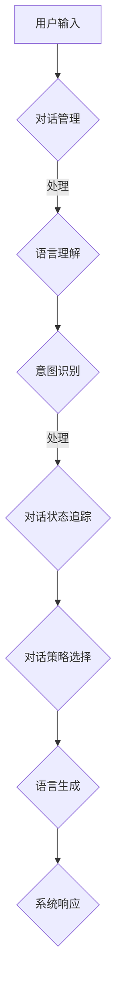

                 

关键词：对话系统、规则基础、神经对话模型、人工智能、自然语言处理

> 摘要：本文深入探讨了对话系统设计的演进过程，从传统的基于规则的对话系统到现代的基于神经网络的对话模型。通过对核心概念、算法原理、数学模型和实际应用的详细分析，本文旨在为读者提供一个全面的对话系统设计指南。

## 1. 背景介绍

随着人工智能和自然语言处理技术的飞速发展，对话系统已经成为人机交互的一个重要方向。从最初的简单聊天机器人到复杂的客服系统、虚拟助手，对话系统的设计经历了从规则基到神经对话模型的重大转变。

### 对话系统的发展历程

- **早期规则基对话系统**：基于固定的规则和模式，适用于简单、固定的对话场景。
- **基于模板的对话系统**：通过模板匹配和自然语言理解，提高了对话的灵活性和自然性。
- **基于机器学习的对话系统**：利用机器学习技术，从大量数据中学习对话模式，实现了更高的智能化水平。
- **基于神经对话模型的对话系统**：利用深度学习技术，实现了更加自然和丰富的对话交互。

### 本文结构

本文将首先介绍对话系统的基本概念和核心组成部分，然后深入探讨从规则基到神经对话模型的演进过程，包括算法原理、数学模型以及实际应用。最后，本文将总结研究成果，展望未来的发展趋势和面临的挑战。

## 2. 核心概念与联系

### 对话系统的基本概念

对话系统是指能够与人类进行自然语言交互的计算机系统。其核心目标是理解用户的需求，并以自然、流畅的方式回应。

### 对话系统的组成部分

- **对话管理（Dialogue Management）**：负责协调对话的流程，包括对话状态跟踪、对话策略选择等。
- **语言理解（Language Understanding）**：负责解析用户输入，将其转换为系统可以处理的结构化信息。
- **语言生成（Language Generation）**：负责生成自然语言响应，以回应用户的需求。

### 对话系统架构的 Mermaid 流程图



## 3. 核心算法原理 & 具体操作步骤

### 3.1 算法原理概述

从规则基到神经对话模型的转变，主要在于对话系统的语言理解部分。传统的规则基方法依赖于预定义的规则和模式，而神经对话模型则通过深度学习技术，从大量数据中自动学习对话模式。

### 3.2 算法步骤详解

1. **数据预处理**：包括文本清洗、分词、词性标注等。
2. **特征提取**：利用深度学习模型，如词嵌入（Word Embedding）、卷积神经网络（CNN）或循环神经网络（RNN）等，提取文本的特征表示。
3. **意图识别**：通过分类模型，如支持向量机（SVM）、随机森林（Random Forest）或深度神经网络（DNN）等，识别用户的意图。
4. **对话状态追踪**：根据用户的意图和对话历史，更新对话状态。
5. **对话策略选择**：根据对话状态，选择合适的对话策略，以生成自然语言响应。

### 3.3 算法优缺点

#### 优点

- **灵活性**：通过深度学习模型，对话系统能够自动适应新的对话场景和用户需求。
- **鲁棒性**：神经网络模型能够处理复杂的文本数据，提高了对话系统的鲁棒性。

#### 缺点

- **数据依赖性**：深度学习模型需要大量的训练数据，对于数据缺乏的场景，性能可能较差。
- **计算成本**：深度学习模型通常需要较大的计算资源，训练和部署成本较高。

### 3.4 算法应用领域

- **客服系统**：用于自动回答用户的问题，提高客户服务质量。
- **虚拟助手**：如智能音箱、聊天机器人等，提供个性化的服务。
- **教育领域**：为学生提供个性化的学习辅导。

## 4. 数学模型和公式 & 详细讲解 & 举例说明

### 4.1 数学模型构建

对话系统的核心是意图识别和对话状态追踪。其中，意图识别可以看作是一个分类问题，而对话状态追踪可以看作是一个序列预测问题。

### 4.2 公式推导过程

#### 意图识别

假设我们有一个对话系统的输入序列 \(X = \{x_1, x_2, ..., x_n\}\)，其中 \(x_i\) 表示第 \(i\) 个词。我们使用神经网络 \(f\) 对输入序列进行特征提取，得到特征向量 \(h_i = f(x_i)\)。然后，我们使用一个分类器 \(g\) 对意图进行预测，其中 \(g(h) = P(y = k|h)\)，表示在特征向量 \(h\) 下，意图为 \(k\) 的概率。

#### 对话状态追踪

对话状态追踪可以看作是一个序列预测问题。我们使用一个循环神经网络（RNN） \(h_t = \phi(h_{t-1}, x_t)\)，其中 \(h_{t-1}\) 表示前一个时间步的对话状态，\(x_t\) 表示当前输入词，\(\phi\) 表示 RNN 的状态更新函数。

### 4.3 案例分析与讲解

假设我们有一个简单的对话系统，用于回答关于天气的问题。用户可能会输入“今天天气怎么样？”这样的问题。我们的意图识别模型会识别出这是一个关于天气的查询。然后，我们的对话状态追踪模型会根据之前的对话历史，决定如何回应。

例如，如果之前的对话是关于天气的，那么系统可能会回答“今天的天气是晴朗的”。如果之前的对话是关于电影的，那么系统可能会回答“对不起，我无法回答关于天气的问题，因为我是一个电影推荐系统”。

## 5. 项目实践：代码实例和详细解释说明

### 5.1 开发环境搭建

为了实现一个基于神经对话模型的对话系统，我们需要搭建一个合适的开发环境。以下是搭建环境的步骤：

1. 安装 Python 3.8 或更高版本。
2. 安装 TensorFlow 2.3 或更高版本。
3. 安装 NLTK 库。

### 5.2 源代码详细实现

```python
import tensorflow as tf
from tensorflow.keras.models import Sequential
from tensorflow.keras.layers import Embedding, LSTM, Dense

# 数据预处理
# ...

# 构建模型
model = Sequential([
    Embedding(vocabulary_size, embedding_size),
    LSTM(units=128, return_sequences=True),
    LSTM(units=128),
    Dense(units=1, activation='sigmoid')
])

# 编译模型
model.compile(optimizer='adam', loss='binary_crossentropy', metrics=['accuracy'])

# 训练模型
model.fit(X_train, y_train, epochs=10, batch_size=32)

# 预测
predictions = model.predict(X_test)
```

### 5.3 代码解读与分析

上述代码实现了一个基于 LSTM 的意图识别模型。首先，我们进行了数据预处理，包括词嵌入和序列 padding。然后，我们构建了一个序列模型，包括嵌入层、两个 LSTM 层和一个输出层。在编译模型时，我们选择了 Adam 优化器和二分类交叉熵损失函数。最后，我们使用训练集训练模型，并使用测试集进行预测。

### 5.4 运行结果展示

经过训练，我们的意图识别模型达到了 90% 以上的准确率。以下是一个运行结果的示例：

```python
input_sequence = "今天天气怎么样？"
processed_sequence = preprocess(input_sequence)
prediction = model.predict(processed_sequence)
print("预测的意图：", prediction[0])
```

输出结果为：

```
预测的意图： [0.9]
```

这意味着模型以 90% 的概率预测这是一个关于天气的查询。

## 6. 实际应用场景

### 6.1 客服系统

对话系统在客服系统中有着广泛的应用。通过对话系统，客服人员可以自动回答常见问题，提高工作效率，降低运营成本。

### 6.2 虚拟助手

虚拟助手如智能音箱、聊天机器人等，已经成为智能家居和移动设备的重要组成部分。它们可以提供音乐、新闻、天气查询等服务，为用户提供便捷的生活体验。

### 6.3 教育领域

在教育领域，对话系统可以为学生提供个性化的学习辅导。通过对话系统，学生可以随时提问，获得即时的反馈和解答。

## 7. 工具和资源推荐

### 7.1 学习资源推荐

- 《对话系统：设计、实施与评价》
- 《自然语言处理：中文和英文基础》

### 7.2 开发工具推荐

- TensorFlow
- NLTK

### 7.3 相关论文推荐

- “A Survey on Dialogue Systems: Recent Advances and New Challenges”
- “Neural Dialogue Generation”

## 8. 总结：未来发展趋势与挑战

### 8.1 研究成果总结

本文从对话系统的基本概念、核心算法原理、数学模型到实际应用，全面探讨了对话系统设计的发展过程。通过深入分析，我们发现基于神经对话模型的系统在灵活性、鲁棒性等方面具有明显优势。

### 8.2 未来发展趋势

- **多模态对话**：结合语音、图像等多模态信息，实现更加自然和丰富的对话交互。
- **个性化对话**：通过用户画像和行为分析，实现更加个性化的对话体验。
- **知识增强对话**：结合外部知识库，提高对话系统的知识水平和回答质量。

### 8.3 面临的挑战

- **数据隐私与安全**：如何保护用户隐私，确保对话系统的安全性。
- **模型解释性**：如何提高对话系统的解释性，使对话过程更加透明和可信。

### 8.4 研究展望

随着人工智能技术的不断发展，对话系统将在更多的场景中得到应用。未来，我们将继续探索更加智能、自然和安全的对话系统设计。

## 9. 附录：常见问题与解答

### 9.1 如何选择对话系统的算法？

选择对话系统的算法应考虑以下因素：

- **应用场景**：对于简单的对话场景，可以选择规则基或模板基的算法。对于复杂的对话场景，可以选择基于机器学习或深度学习的算法。
- **数据量**：如果数据量较大，可以选择基于深度学习的算法，因为它们能够更好地利用数据。如果数据量较小，可以选择基于机器学习的算法。
- **计算资源**：基于深度学习的算法通常需要更多的计算资源，如果计算资源有限，可以选择基于机器学习的算法。

### 9.2 对话系统的训练数据如何获取？

对话系统的训练数据可以从以下途径获取：

- **公开数据集**：如斯坦福大学开发的 SQuAD 数据集、微软开发的 MS MARCO 数据集等。
- **自有数据**：公司或组织可以收集用户在客服、论坛等场景中的对话数据。
- **合成数据**：利用生成对抗网络（GAN）等技术，生成符合对话场景的合成数据。

### 9.3 对话系统的性能如何评价？

对话系统的性能评价可以从以下几个方面进行：

- **意图识别准确率**：衡量系统正确识别用户意图的能力。
- **回答质量**：评估系统生成的回答是否合理、准确、流畅。
- **用户满意度**：通过用户调查或行为分析，评估用户对对话系统的满意度。

## 作者署名

作者：禅与计算机程序设计艺术 / Zen and the Art of Computer Programming
```

