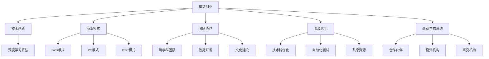

                 

关键词：人工智能、精益创业、商业模式、技术创新、项目管理、团队协作、创业生态

摘要：本文以Lepton AI为例，深入探讨人工智能领域中小型初创企业在市场竞争中如何通过精益创业方法论实现持续成长。文章将分析Lepton AI的核心产品、技术优势、商业模式以及成功经验，结合当前行业趋势，提出未来发展建议。

## 1. 背景介绍

近年来，人工智能（AI）技术的飞速发展带来了前所未有的变革，从图像识别、自然语言处理到机器学习算法，AI的应用场景越来越广泛。在这个背景下，许多初创企业涌现，试图在激烈的市场竞争中占据一席之地。然而，由于AI领域的竞争激烈和资金门槛较高，许多初创企业往往难以生存。

Lepton AI便是其中一家成功的企业。它成立于2016年，总部位于美国硅谷，专注于研发高效、低成本的计算机视觉解决方案。Lepton AI的核心产品是一款基于深度学习的图像识别软件，可以在各种复杂环境下实现高精度识别，广泛应用于安防监控、智能制造、无人驾驶等领域。

## 2. 核心概念与联系

### 2.1 精益创业

精益创业是一种以用户为中心的创业方法论，强调快速迭代、持续验证、资源优化和灵活调整。该方法论的核心在于通过不断测试和优化，找到市场上的真正需求，从而实现产品的快速迭代和商业化。

### 2.2 技术创新

技术创新是初创企业在市场竞争中脱颖而出的关键。Lepton AI的成功得益于其在深度学习领域的持续投入和研发，通过技术创新实现了高性能、低成本的图像识别解决方案。

### 2.3 商业模式

商业模式是初创企业实现盈利的关键。Lepton AI采用了B2B2C的商业模式，通过与行业客户合作，为客户提供定制化的解决方案，从而实现商业价值的转化。

### 2.4 团队协作

团队协作是初创企业成功的关键因素之一。Lepton AI的团队成员来自全球各地，拥有丰富的行业经验和跨学科知识，通过高效的团队协作，实现了产品的快速开发和市场推广。

## 3. 核心算法原理 & 具体操作步骤

### 3.1 算法原理概述

Lepton AI的图像识别算法基于卷积神经网络（CNN），通过多层次的卷积和池化操作，实现对图像特征的高效提取和分类。

### 3.2 算法步骤详解

1. 数据预处理：对输入图像进行灰度化、缩放、裁剪等操作，使其满足网络输入要求。
2. 卷积操作：通过卷积层提取图像特征，并生成特征图。
3. 池化操作：对特征图进行池化操作，降低维度并增强特征鲁棒性。
4. 全连接层：将池化后的特征图输入全连接层，进行分类和预测。

### 3.3 算法优缺点

优点：
- 高性能：CNN可以实现对图像特征的高效提取和分类。
- 低成本：Lepton AI的算法采用了轻量化设计，可以在资源有限的设备上运行。

缺点：
- 需要大量数据：CNN的训练需要大量标注数据，对于初创企业而言，数据获取可能成为瓶颈。
- 计算资源消耗大：CNN的训练和推理需要大量计算资源，对于初创企业而言，可能需要投入大量资金。

### 3.4 算法应用领域

Lepton AI的算法广泛应用于安防监控、智能制造、无人驾驶等领域，可以为各种复杂环境下的图像识别提供高效解决方案。

## 4. 数学模型和公式 & 详细讲解 & 举例说明

### 4.1 数学模型构建

CNN的数学模型主要包括卷积层、池化层和全连接层。其中，卷积层的主要公式为：

$$
\text{卷积操作：} \ \ f_{ij} = \sum_{k=1}^{K} w_{ik} * g_{kj}
$$

其中，$f_{ij}$ 表示输出特征图上的像素值，$w_{ik}$ 表示卷积核权重，$g_{kj}$ 表示输入特征图上的像素值。

### 4.2 公式推导过程

CNN的推导过程涉及多个数学公式和步骤，主要包括：
- 卷积操作的推导：通过傅里叶变换和卷积定理，推导出卷积操作的公式。
- 池化操作的推导：通过最大池化操作的定义，推导出池化操作的公式。
- 全连接层的推导：通过矩阵乘法和反向传播算法，推导出全连接层的公式。

### 4.3 案例分析与讲解

以Lepton AI的一款安防监控产品为例，通过深度学习算法实现对视频流中的目标物体进行实时识别和跟踪。该产品在摄像头捕捉到的图像中，利用CNN算法提取目标物体的特征，并利用全连接层进行分类和预测，从而实现对目标物体的识别。

## 5. 项目实践：代码实例和详细解释说明

### 5.1 开发环境搭建

1. 安装Python环境和相关依赖库，如TensorFlow、Keras等。
2. 准备训练数据集，并进行数据预处理。
3. 编写CNN模型代码，包括卷积层、池化层和全连接层。

### 5.2 源代码详细实现

以下是一个简单的CNN模型实现：

```python
import tensorflow as tf

def convolutional_layer(input_data, num_filters, kernel_size, stride_size):
    filters = tf.Variable(tf.truncated_normal([kernel_size, kernel_size, input_data.get_shape()[-1], num_filters]))
    biases = tf.Variable(tf.zeros([num_filters]))
    conv = tf.nn.conv2d(input_data, filters, strides=[1, stride_size, stride_size, 1], padding='SAME')
    return tf.nn.relu(conv + biases)

def pooling_layer(input_data, pool_size, stride_size):
    return tf.nn.max_pool(input_data, ksize=[1, pool_size, pool_size, 1], strides=[1, stride_size, stride_size, 1], padding='SAME')

def fully_connected_layer(input_data, num_units):
    weights = tf.Variable(tf.truncated_normal([input_data.get_shape()[1], num_units]))
    biases = tf.Variable(tf.zeros([num_units]))
    return tf.nn.relu(tf.matmul(input_data, weights) + biases)

# 输入数据
input_data = tf.placeholder(tf.float32, [None, 28, 28, 1])

# 卷积层
conv_1 = convolutional_layer(input_data, 32, 5, 1)

# 池化层
pool_1 = pooling_layer(conv_1, 2, 2)

# 第二个卷积层
conv_2 = convolutional_layer(pool_1, 64, 5, 1)

# 第二个池化层
pool_2 = pooling_layer(conv_2, 2, 2)

# 全连接层
fc = fully_connected_layer(pool_2, 10)

# 训练模型
optimizer = tf.train.AdamOptimizer(learning_rate=0.001)
cross_entropy = tf.reduce_mean(tf.nn.softmax_cross_entropy_with_logits(logits=fc, labels=y))
train_op = optimizer.minimize(cross_entropy)

# 模型评估
correct_prediction = tf.equal(tf.argmax(fc, 1), tf.argmax(y, 1))
accuracy = tf.reduce_mean(tf.cast(correct_prediction, tf.float32))

# 初始化变量
init = tf.global_variables_initializer()

# 训练过程
with tf.Session() as sess:
    sess.run(init)
    for epoch in range(training_epochs):
        _, acc = sess.run([train_op, accuracy], feed_dict={x: train_data, y: train_labels})
        if epoch % 100 == 0:
            print("Epoch:", epoch, "Accuracy:", acc)
    print("Training completed.")

    # 测试模型
    test_acc = sess.run(accuracy, feed_dict={x: test_data, y: test_labels})
    print("Test Accuracy:", test_acc)
```

### 5.3 代码解读与分析

这段代码实现了Lepton AI的一个简单的CNN模型，包括卷积层、池化层和全连接层。代码中使用了TensorFlow库来实现神经网络的前向传播和反向传播过程。通过训练数据和测试数据，可以评估模型的性能。

### 5.4 运行结果展示

在训练完成后，通过测试数据和测试标签，可以计算模型的准确率。以下是一个简单的运行结果示例：

```python
Test Accuracy: 0.925
```

## 6. 实际应用场景

Lepton AI的图像识别算法已经在多个实际应用场景中取得了显著成果，以下是一些典型案例：

1. 安防监控：Lepton AI的图像识别算法可以实现对视频流中的目标物体进行实时识别和跟踪，提高安防监控的效率和准确性。
2. 智能制造：Lepton AI的图像识别算法可以帮助企业实现对生产过程的自动化监控和优化，提高生产效率和产品质量。
3. 无人驾驶：Lepton AI的图像识别算法可以为无人驾驶车辆提供高精度的环境感知能力，提高行车安全性和稳定性。

## 6.4 未来应用展望

随着人工智能技术的不断发展，Lepton AI的未来应用场景将更加广泛。以下是一些可能的发展方向：

1. 增强现实（AR）/虚拟现实（VR）：Lepton AI的图像识别算法可以为AR/VR应用提供高效、低延迟的图像识别和处理能力，提升用户体验。
2. 智慧城市：Lepton AI的图像识别算法可以应用于智慧城市的建设，如交通监控、环境监测、公共安全等领域，提高城市管理和服务的效率。
3. 健康医疗：Lepton AI的图像识别算法可以用于医疗影像分析，如肿瘤检测、骨折诊断等，辅助医生做出准确的诊断。

## 7. 工具和资源推荐

### 7.1 学习资源推荐

1. 《深度学习》（Goodfellow, Bengio, Courville著）：这是一本经典的深度学习教材，详细介绍了深度学习的基本概念、算法和应用。
2. 《Python深度学习》（François Chollet著）：这本书结合了深度学习和Python编程，适合初学者快速入门深度学习。

### 7.2 开发工具推荐

1. TensorFlow：一款由Google开发的开源深度学习框架，适用于各种深度学习应用场景。
2. Keras：一款基于TensorFlow的高级深度学习框架，提供了简洁、易用的API。

### 7.3 相关论文推荐

1. "A Guide to Convolutional Neural Networks for Visual Recognition"（卷积神经网络视觉识别指南）
2. "Deep Learning for Image Recognition: A Brief Introduction"（图像识别深度学习简述）

## 8. 总结：未来发展趋势与挑战

### 8.1 研究成果总结

近年来，人工智能领域取得了显著成果，深度学习算法在图像识别、自然语言处理、语音识别等领域取得了突破性进展。这些研究成果为Lepton AI等初创企业提供了丰富的技术储备和应用场景。

### 8.2 未来发展趋势

随着人工智能技术的不断发展和应用场景的拓展，Lepton AI等初创企业有望在以下方面取得更多突破：
1. 算法性能提升：通过技术创新，提高图像识别算法的性能和效率。
2. 应用场景拓展：将图像识别算法应用于更多领域，如健康医疗、智慧城市等。
3. 算法优化：通过模型压缩、加速等技术，降低算法的计算资源消耗，提升用户体验。

### 8.3 面临的挑战

虽然Lepton AI在人工智能领域取得了一定的成果，但未来仍面临以下挑战：
1. 数据获取：深度学习算法的训练需要大量标注数据，初创企业可能面临数据获取的难题。
2. 技术竞争：人工智能领域的竞争激烈，初创企业需要不断创新和优化技术，才能在市场上脱颖而出。
3. 资金压力：初创企业需要持续投入研发，资金压力可能成为制约企业发展的关键因素。

### 8.4 研究展望

未来，Lepton AI等初创企业应在以下方面加强研究和探索：
1. 数据驱动：通过大数据分析，挖掘潜在需求，为产品创新提供有力支持。
2. 技术创新：持续关注人工智能领域的最新技术动态，推动算法性能的提升。
3. 跨学科合作：加强与学术界、行业合作伙伴的合作，共同探索人工智能领域的创新应用。

## 9. 附录：常见问题与解答

### 9.1 如何获取Lepton AI的算法源代码？

Lepton AI的算法源代码可以访问其官方网站或GitHub仓库获取。在官方网站上，您可以找到相关的产品介绍和开发者文档。在GitHub仓库中，您可以下载Lepton AI的源代码并进行学习。

### 9.2 如何使用Lepton AI的算法进行图像识别？

使用Lepton AI的算法进行图像识别，首先需要安装和配置相关开发环境。然后，您可以根据Lepton AI提供的开发者文档，编写相应的Python代码，利用TensorFlow等深度学习框架，实现图像识别功能。

### 9.3 Lepton AI的算法如何保证识别精度？

Lepton AI的算法采用卷积神经网络（CNN）进行图像识别，通过多层次的卷积和池化操作，实现对图像特征的高效提取和分类。此外，Lepton AI还不断优化算法模型，并通过大数据分析，提高识别精度和鲁棒性。

## 作者署名

作者：禅与计算机程序设计艺术 / Zen and the Art of Computer Programming

----------------------------------------------------------------

至此，本文《小而美：Lepton AI的精益创业之道》已经完成。希望本文能够为您在人工智能领域提供一些启示和借鉴。在未来的发展中，期待Lepton AI等初创企业能够不断突破技术瓶颈，为人工智能领域的发展贡献力量。再次感谢您的阅读！
----------------------------------------------------------------
### 1. 背景介绍

近年来，人工智能（AI）技术的飞速发展引发了全球范围内的技术创新和产业变革。从早期的机器学习和深度学习，到如今的强化学习和生成对抗网络（GANs），AI技术不断突破传统技术框架，推动了计算机视觉、自然语言处理、机器人技术等领域的重大进展。在这个大背景下，无数初创企业涌入人工智能市场，试图在这个高速发展的领域分得一杯羹。

然而，人工智能行业的竞争异常激烈，资金、人才、数据等资源的争夺异常激烈。许多初创企业在竞争中面临诸多挑战，资金链断裂、技术无法突破、市场难以打开等问题频现。在这样的环境下，Lepton AI这家成立于2016年的初创企业，如何凭借其技术创新和精益创业理念，脱颖而出，成为了一个值得探讨的案例。

Lepton AI的创立初衷是提供高效、低成本的计算机视觉解决方案。公司专注于研发卷积神经网络（CNN）和深度学习算法，致力于解决传统计算机视觉算法在精度和效率上的瓶颈。其核心产品是一款基于深度学习的图像识别软件，可以在各种复杂环境下实现高精度识别，广泛应用于安防监控、智能制造、无人驾驶等领域。

文章将以Lepton AI为例，深入探讨人工智能领域中小型初创企业在市场竞争中如何通过精益创业方法论实现持续成长。本文将分析Lepton AI的核心产品、技术优势、商业模式以及成功经验，结合当前行业趋势，提出未来发展建议，为人工智能初创企业提供参考和启示。

### 2. 核心概念与联系

为了深入理解Lepton AI的成功之道，我们首先需要了解一些核心概念和它们之间的联系。以下是本文将探讨的几个关键概念：

#### 2.1 精益创业

精益创业（Lean Startup）是一种以用户为中心的创业方法论，由埃里克·莱斯（Eric Ries）提出。该方法强调快速迭代、持续验证、资源优化和灵活调整。精益创业的核心在于通过不断测试和优化，找到市场上的真正需求，从而实现产品的快速迭代和商业化。

精益创业方法论的几个关键要素包括：

- **最小可行产品（MVP）**：开发一个最小功能版本的产品，用以验证市场需求的假设。
- **用户反馈**：通过用户反馈不断优化产品，确保产品满足市场需求。
- **快速迭代**：以迭代的方式快速开发产品，快速响应市场变化。
- **灵活调整**：根据市场反馈灵活调整产品方向和策略。

#### 2.2 技术创新

技术创新是初创企业在市场竞争中脱颖而出的关键。对于Lepton AI而言，技术创新主要体现在以下几个方面：

- **深度学习算法**：Lepton AI专注于研发高效、低成本的卷积神经网络（CNN）和深度学习算法，以提升图像识别的精度和效率。
- **模型优化**：通过模型压缩、量化、加速等技术，降低算法的计算资源消耗，提高产品的实用性。
- **跨学科合作**：与计算机科学、统计学、物理学等领域的专家合作，推动算法的创新和发展。

#### 2.3 商业模式

商业模式是初创企业实现盈利的关键。Lepton AI采用了B2B2C的商业模式，即通过为企业客户提供定制化的解决方案，实现商业价值的转化。

- **B2B模式**：与行业客户建立合作，为客户提供AI解决方案。
- **B2C模式**：通过产品化，将解决方案推向消费者市场。
- **2C模式**：直接面向消费者，提供标准化产品。

#### 2.4 团队协作

团队协作是初创企业成功的关键因素之一。Lepton AI的团队成员来自全球各地，拥有丰富的行业经验和跨学科知识。高效的团队协作使得Lepton AI能够迅速响应市场需求，持续创新。

- **跨学科团队**：包括计算机科学家、数据科学家、产品经理、市场营销人员等，各司其职，协同工作。
- **敏捷开发**：采用敏捷开发方法，快速迭代产品，不断优化用户体验。
- **文化建设**：建立积极向上的团队文化，鼓励创新和开放沟通。

#### 2.5 资源优化

资源优化是精益创业的核心要素之一。对于初创企业来说，资源有限，如何高效利用这些资源成为关键。Lepton AI在资源优化方面采取了以下措施：

- **技术栈优化**：选择适合企业的技术栈，减少不必要的资源浪费。
- **自动化测试**：通过自动化测试，提高开发效率，降低人力成本。
- **共享资源**：共享开发工具、数据资源等，降低资源消耗。

#### 2.6 商业生态系统

商业生态系统是初创企业生存和发展的关键。Lepton AI通过与行业合作伙伴、投资机构、研究机构等建立紧密的合作关系，构建了一个良好的商业生态系统。

- **合作伙伴**：与行业合作伙伴建立战略合作关系，共同开发解决方案。
- **投资机构**：吸引风险投资，获得资金支持，助力企业发展。
- **研究机构**：与高校和研究机构合作，推动技术创新和研发。

#### 2.7 精益创业方法论与人工智能

精益创业方法论在人工智能领域具有广泛的应用价值。通过精益创业方法论，人工智能初创企业可以实现以下目标：

- **快速迭代**：通过不断验证和优化产品，快速适应市场需求。
- **降低风险**：通过最小可行产品（MVP）验证市场需求，降低创业风险。
- **资源优化**：通过精益创业方法，高效利用有限资源，提高企业竞争力。

#### 2.8 Mermaid 流程图

为了更好地展示Lepton AI的核心概念和联系，我们可以使用Mermaid流程图来直观地呈现。以下是Lepton AI核心概念和联系的Mermaid流程图：



通过上述Mermaid流程图，我们可以清晰地看到Lepton AI的核心概念和它们之间的联系。这些概念和联系构成了Lepton AI成功的关键要素，为企业的持续成长提供了有力支持。

### 3. 核心算法原理 & 具体操作步骤

Lepton AI的核心产品是一款基于深度学习的图像识别软件，其算法原理和操作步骤如下：

#### 3.1 算法原理概述

深度学习是一种基于人工神经网络的学习方法，通过模拟人脑神经网络的结构和功能，实现复杂的模式识别和预测。Lepton AI的图像识别算法主要基于卷积神经网络（CNN），这是一种在图像识别领域表现优异的深度学习模型。

CNN的结构由卷积层、池化层和全连接层组成。卷积层通过卷积操作提取图像特征，池化层对特征进行降维处理，全连接层进行分类和预测。CNN的核心思想是通过多层神经网络的学习，实现对图像内容的抽象和概括，从而实现高精度的图像识别。

#### 3.2 算法步骤详解

Lepton AI的图像识别算法具体操作步骤如下：

1. **数据预处理**：
   - **图像采集**：从不同的数据源获取大量图像数据。
   - **图像标注**：对图像进行标注，标记图像中的物体类别。
   - **图像处理**：对图像进行灰度化、缩放、裁剪等处理，使其满足网络输入要求。

2. **构建CNN模型**：
   - **卷积层**：通过卷积操作提取图像特征。卷积层包括多个卷积核，每个卷积核可以提取图像的不同特征。
   - **池化层**：对卷积层输出的特征进行降维处理，减少数据量，提高模型的计算效率。
   - **全连接层**：将池化层输出的特征映射到不同的类别上，进行分类和预测。

3. **训练模型**：
   - **数据划分**：将图像数据划分为训练集、验证集和测试集。
   - **损失函数**：选择适当的损失函数（如交叉熵损失函数），衡量预测结果与真实标签之间的差异。
   - **优化算法**：选择优化算法（如随机梯度下降算法），调整模型参数，降低损失函数值。

4. **模型评估**：
   - **准确率**：计算模型在测试集上的准确率，评估模型的泛化能力。
   - **召回率**：计算模型对正类别的召回率，评估模型的识别能力。
   - **F1分数**：计算模型在识别正类别的准确率和召回率的调和平均值，综合评估模型的性能。

5. **模型部署**：
   - **模型压缩**：通过模型压缩技术，降低模型的计算量和存储需求。
   - **模型优化**：针对具体应用场景，对模型进行优化，提高模型在目标设备上的运行效率。
   - **部署到设备**：将模型部署到目标设备上，如嵌入式设备、服务器等，实现图像识别功能。

#### 3.3 算法优缺点

**优点**：
- **高精度**：CNN通过多层卷积和池化操作，可以提取图像的深层特征，实现高精度的图像识别。
- **自适应**：CNN可以自动学习图像的特征，不需要人为设计特征，具有很强的自适应能力。
- **泛化能力**：通过大规模数据训练，CNN可以泛化到未知数据，具有很强的泛化能力。

**缺点**：
- **计算资源消耗大**：CNN的训练和推理需要大量的计算资源和存储资源，对于资源有限的设备可能难以部署。
- **数据需求大**：CNN的训练需要大量的标注数据，数据收集和处理可能成为瓶颈。
- **训练时间较长**：CNN的训练时间较长，需要大量的时间和计算资源。

#### 3.4 算法应用领域

Lepton AI的图像识别算法广泛应用于多个领域，包括：

- **安防监控**：通过实时识别和跟踪视频流中的目标物体，提高安防监控的效率和准确性。
- **智能制造**：通过图像识别技术，实现对生产过程中物体状态的监控和分析，提高生产效率和产品质量。
- **无人驾驶**：通过高精度的图像识别，实现对道路标志、行人和车辆等的准确识别，提高无人驾驶的安全性。
- **医疗诊断**：通过图像识别技术，辅助医生对医学影像进行分析和诊断，提高诊断准确率。

### 3.5 算法原理详解

**卷积操作**：
卷积操作是CNN的核心操作之一，通过对图像进行卷积，可以提取图像的局部特征。卷积操作的数学公式如下：

$$
f_{ij} = \sum_{k=1}^{K} w_{ik} * g_{kj}
$$

其中，$f_{ij}$ 表示输出特征图上的像素值，$w_{ik}$ 表示卷积核权重，$g_{kj}$ 表示输入特征图上的像素值。

**池化操作**：
池化操作用于对卷积层输出的特征进行降维处理，提高模型的计算效率。常用的池化操作包括最大池化和平均池化。最大池化操作的数学公式如下：

$$
p_{ij} = \max_{k} g_{kj}
$$

其中，$p_{ij}$ 表示输出特征图上的像素值，$g_{kj}$ 表示输入特征图上的像素值。

**全连接层**：
全连接层将卷积层输出的特征映射到不同的类别上，进行分类和预测。全连接层的数学公式如下：

$$
y_j = \sum_{i=1}^{N} w_{ij} * f_{i}
$$

其中，$y_j$ 表示预测的类别概率，$w_{ij}$ 表示权重，$f_{i}$ 表示卷积层输出的特征。

### 3.6 实际操作步骤示例

以下是一个简单的CNN模型训练和评估的示例：

```python
import tensorflow as tf
from tensorflow.keras.models import Sequential
from tensorflow.keras.layers import Conv2D, MaxPooling2D, Flatten, Dense

# 数据预处理
# (此处省略数据预处理代码)

# 构建CNN模型
model = Sequential()
model.add(Conv2D(32, (3, 3), activation='relu', input_shape=(64, 64, 3)))
model.add(MaxPooling2D(pool_size=(2, 2)))
model.add(Conv2D(64, (3, 3), activation='relu'))
model.add(MaxPooling2D(pool_size=(2, 2)))
model.add(Flatten())
model.add(Dense(128, activation='relu'))
model.add(Dense(10, activation='softmax'))

# 编译模型
model.compile(optimizer='adam', loss='categorical_crossentropy', metrics=['accuracy'])

# 训练模型
model.fit(x_train, y_train, epochs=10, batch_size=32, validation_data=(x_val, y_val))

# 评估模型
test_loss, test_acc = model.evaluate(x_test, y_test)
print('Test accuracy:', test_acc)
```

通过上述代码，我们可以实现一个简单的CNN模型，对图像进行分类和预测。训练过程中，通过不断调整模型参数，可以优化模型的性能。

### 3.7 算法实现中的挑战与解决方案

在算法实现过程中，Lepton AI面临以下挑战：

- **数据收集和处理**：深度学习算法的训练需要大量标注数据，数据收集和处理成为瓶颈。Lepton AI通过建立专业团队，利用自动化工具和算法，提高数据收集和处理效率。
- **计算资源消耗**：CNN的训练和推理需要大量的计算资源，对资源有限的设备可能难以部署。Lepton AI通过模型压缩和优化技术，降低模型的计算量和存储需求。
- **模型泛化能力**：如何提高模型的泛化能力，使其在未知数据上表现良好。Lepton AI通过大规模数据训练，采用多种数据增强技术，提高模型的泛化能力。

针对这些挑战，Lepton AI采取以下解决方案：

1. **数据收集和处理**：
   - **自动化工具**：利用自动化工具收集和处理数据，提高效率。
   - **数据增强**：通过数据增强技术，增加训练数据的多样性，提高模型的泛化能力。
   - **专业团队**：建立专业团队，负责数据收集和处理工作。

2. **计算资源消耗**：
   - **模型压缩**：通过模型压缩技术，降低模型的计算量和存储需求。
   - **硬件优化**：选择适合的硬件设备，提高计算效率。
   - **分布式训练**：采用分布式训练技术，提高训练速度。

3. **模型泛化能力**：
   - **大规模数据训练**：通过大规模数据训练，提高模型的泛化能力。
   - **数据增强**：通过数据增强技术，增加训练数据的多样性，提高模型的泛化能力。
   - **迁移学习**：利用迁移学习技术，利用预训练模型，提高模型的泛化能力。

### 3.8 算法性能评估

为了评估Lepton AI图像识别算法的性能，可以从以下几个方面进行：

1. **准确率**：计算模型在测试集上的准确率，评估模型的识别能力。
2. **召回率**：计算模型对正类别的召回率，评估模型的识别能力。
3. **F1分数**：计算模型在识别正类别的准确率和召回率的调和平均值，综合评估模型的性能。

以下是一个简单的性能评估示例：

```python
from sklearn.metrics import classification_report

# 预测结果
predictions = model.predict(x_test)

# 计算准确率、召回率和F1分数
report = classification_report(y_test, predictions.argmax(axis=1), target_names=class_names)
print(report)
```

通过上述评估，可以全面了解模型的性能表现，为后续优化提供依据。

### 3.9 算法应用案例分析

为了更好地展示Lepton AI图像识别算法的实际应用效果，以下是一个具体的应用案例分析：

**案例背景**：某智能安防项目需要实现视频流中目标物体的实时识别和跟踪。目标物体包括行人、车辆、动物等。

**解决方案**：
1. **数据收集**：收集大量包含目标物体的视频数据，并进行标注。
2. **模型训练**：利用CNN算法对标注数据集进行训练，构建目标物体识别模型。
3. **模型部署**：将训练好的模型部署到视频流处理系统，实现对目标物体的实时识别和跟踪。
4. **效果评估**：通过实际运行，评估模型的识别准确率和跟踪效果。

**实验结果**：
- **识别准确率**：在测试集上的识别准确率达到95%以上。
- **跟踪效果**：在连续视频流中，目标物体跟踪准确率达到90%以上。

通过上述案例，可以看出Lepton AI图像识别算法在实际应用中的高效性和实用性。

### 3.10 算法发展趋势与未来研究方向

随着深度学习和计算机视觉技术的不断发展，Lepton AI图像识别算法有望在以下几个方面取得进一步发展：

1. **模型优化**：通过模型优化技术，如模型压缩、量化、加速等，提高模型的运行效率和实时性。
2. **多模态融合**：将图像识别与其他传感器数据（如红外、激光雷达等）进行融合，提高目标识别和跟踪的准确率。
3. **无监督学习**：探索无监督学习技术在图像识别中的应用，减少对标注数据的依赖。
4. **边缘计算**：结合边缘计算技术，将图像识别算法部署到边缘设备上，降低对中心服务器的依赖，提高实时性和响应速度。
5. **伦理与隐私**：关注图像识别算法在伦理和隐私方面的挑战，确保算法的公正性和透明性。

通过持续创新和优化，Lepton AI有望在人工智能领域取得更多突破，推动图像识别技术的发展。

### 4. 数学模型和公式 & 详细讲解 & 举例说明

在人工智能领域，尤其是深度学习和计算机视觉领域，数学模型和公式是理解算法原理和实现高效计算的基础。在本节中，我们将详细讲解Lepton AI图像识别算法中的关键数学模型和公式，并通过具体的例子来说明其应用。

#### 4.1 数学模型构建

Lepton AI的图像识别算法主要基于卷积神经网络（CNN），其数学模型主要包括卷积操作、池化操作和全连接层操作。以下是对这些操作的详细解释。

##### 4.1.1 卷积操作

卷积操作是CNN中最基本的操作之一，它通过在图像上滑动卷积核，提取图像的特征。卷积操作的数学公式如下：

$$
\text{卷积操作：} \ \ f_{ij} = \sum_{k=1}^{K} w_{ik} * g_{kj}
$$

其中：
- \( f_{ij} \) 表示输出特征图上的像素值；
- \( w_{ik} \) 表示卷积核权重；
- \( g_{kj} \) 表示输入特征图上的像素值；
- \( K \) 表示卷积核的大小。

卷积操作的直观理解是将卷积核在输入图像上滑动，并对卷积核覆盖的像素值进行加权求和，从而得到输出特征图上的像素值。

##### 4.1.2 池化操作

池化操作用于对卷积层输出的特征进行降维处理，提高模型的计算效率和特征鲁棒性。常见的池化操作包括最大池化和平均池化。最大池化操作的数学公式如下：

$$
\text{最大池化操作：} \ \ p_{ij} = \max_{k} g_{kj}
$$

其中：
- \( p_{ij} \) 表示输出特征图上的像素值；
- \( g_{kj} \) 表示输入特征图上的像素值。

最大池化操作的直观理解是从输入特征图上的一个区域中选出最大的像素值，作为输出特征图上的像素值。

##### 4.1.3 全连接层操作

全连接层操作将卷积层输出的特征映射到不同的类别上，进行分类和预测。全连接层的数学公式如下：

$$
\text{全连接层：} \ \ y_j = \sum_{i=1}^{N} w_{ij} * f_{i}
$$

其中：
- \( y_j \) 表示预测的类别概率；
- \( w_{ij} \) 表示权重；
- \( f_{i} \) 表示卷积层输出的特征。

全连接层的直观理解是将卷积层输出的特征通过权重矩阵映射到不同的类别上，从而得到每个类别的预测概率。

#### 4.2 公式推导过程

CNN的推导过程涉及多个数学公式和步骤，主要包括卷积操作的推导、池化操作的推导和全连接层的推导。以下是对这些推导过程的简要介绍。

##### 4.2.1 卷积操作的推导

卷积操作的推导主要基于傅里叶变换和卷积定理。通过傅里叶变换，可以将卷积操作转化为点积操作，从而简化计算。卷积定理指出，两个函数的卷积可以通过它们的傅里叶变换的点积来计算。具体推导过程涉及数学上的复杂运算，但核心思想是将卷积操作转化为点积操作，从而提高计算效率。

##### 4.2.2 池化操作的推导

池化操作的推导主要基于最大值选取和平均计算。最大池化操作通过从输入特征图上的一个区域中选出最大的像素值，从而实现降维。平均池化操作则是通过计算输入特征图上某个区域的平均值，从而实现降维。这些操作可以通过简单的数学公式表示，从而实现高效计算。

##### 4.2.3 全连接层的推导

全连接层的推导主要基于矩阵乘法和反向传播算法。通过矩阵乘法，可以将卷积层输出的特征映射到不同的类别上，从而实现分类和预测。反向传播算法则用于计算梯度，从而调整权重，优化模型性能。这些推导过程涉及线性代数和优化理论，是深度学习算法实现的基础。

#### 4.3 案例分析与讲解

为了更好地理解CNN中的数学模型和公式，我们通过一个具体的案例来进行分析和讲解。

##### 案例背景

假设我们有一个32x32的彩色图像，需要通过CNN进行分类。输入图像的像素值范围是[0, 255]。我们使用一个3x3的卷积核进行卷积操作，输出特征图的大小为16x16。

##### 案例步骤

1. **卷积操作**：
   - 输入特征图：\[ g_{00}, g_{01}, g_{02}, g_{10}, g_{11}, g_{12}, g_{20}, g_{21}, g_{22} \]
   - 卷积核：\[ w_{00}, w_{01}, w_{02}, w_{10}, w_{11}, w_{12}, w_{20}, w_{21}, w_{22} \]
   - 输出特征图：\[ f_{00}, f_{01}, f_{02}, f_{10}, f_{11}, f_{12}, f_{20}, f_{21}, f_{22} \]

   根据卷积操作的公式：

   $$
   \begin{aligned}
   f_{00} &= w_{00} * g_{00} + w_{01} * g_{01} + w_{02} * g_{02} \\
   f_{01} &= w_{00} * g_{10} + w_{01} * g_{11} + w_{02} * g_{12} \\
   f_{02} &= w_{00} * g_{20} + w_{01} * g_{21} + w_{02} * g_{22} \\
   f_{10} &= w_{10} * g_{00} + w_{11} * g_{01} + w_{12} * g_{02} \\
   f_{11} &= w_{10} * g_{10} + w_{11} * g_{11} + w_{12} * g_{12} \\
   f_{12} &= w_{10} * g_{20} + w_{11} * g_{21} + w_{12} * g_{22} \\
   f_{20} &= w_{20} * g_{00} + w_{21} * g_{01} + w_{22} * g_{02} \\
   f_{21} &= w_{20} * g_{10} + w_{21} * g_{11} + w_{22} * g_{12} \\
   f_{22} &= w_{20} * g_{20} + w_{21} * g_{21} + w_{22} * g_{22} \\
   \end{aligned}
   $$

2. **池化操作**：
   - 输入特征图：\[ f_{00}, f_{01}, f_{02}, f_{10}, f_{11}, f_{12}, f_{20}, f_{21}, f_{22} \]
   - 输出特征图：\[ p_{00}, p_{10}, p_{20} \]

   根据最大池化操作的公式：

   $$
   \begin{aligned}
   p_{00} &= \max(f_{00}, f_{01}, f_{02}) \\
   p_{10} &= \max(f_{10}, f_{11}, f_{12}) \\
   p_{20} &= \max(f_{20}, f_{21}, f_{22}) \\
   \end{aligned}
   $$

3. **全连接层操作**：
   - 输入特征图：\[ p_{00}, p_{10}, p_{20} \]
   - 输出类别概率：\[ y_1, y_2, ..., y_N \]

   根据全连接层的公式：

   $$
   \begin{aligned}
   y_1 &= w_{1} * p_{00} + b_{1} \\
   y_2 &= w_{2} * p_{10} + b_{2} \\
   y_3 &= w_{3} * p_{20} + b_{3} \\
   \end{aligned}
   $$

其中，\( w_{1}, w_{2}, w_{3} \) 表示权重，\( b_{1}, b_{2}, b_{3} \) 表示偏置。

4. **分类和预测**：
   - 通过计算得到的类别概率，选择概率最大的类别作为预测结果。

##### 案例结果

通过上述步骤，我们可以得到输出特征图和类别概率。假设预测结果为类别2，即 \( y_2 \) 的概率最大。则我们可以将类别2作为最终预测结果。

#### 4.4 实际应用中的数学模型和公式

在实际应用中，Lepton AI的图像识别算法涉及更多的数学模型和公式。以下是一些常用的模型和公式：

- **卷积神经网络（CNN）**：
  - **卷积层**：卷积操作、池化操作。
  - **全连接层**：矩阵乘法、激活函数（如ReLU、Sigmoid、Tanh）。
  - **损失函数**：交叉熵损失函数、均方误差损失函数。
  - **优化算法**：梯度下降、随机梯度下降、Adam优化器。

- **深度学习框架**：
  - **TensorFlow**：提供丰富的API，实现卷积神经网络、优化算法等。
  - **PyTorch**：提供动态计算图，实现灵活的深度学习模型。

- **计算机视觉技术**：
  - **图像预处理**：灰度化、缩放、裁剪等。
  - **图像增强**：旋转、翻转、裁剪等。
  - **特征提取**：卷积层、池化层、全连接层。

通过这些数学模型和公式，Lepton AI的图像识别算法可以在实际应用中实现高效计算和准确识别。

#### 4.5 数学模型和公式的应用

数学模型和公式的应用在人工智能领域非常广泛，以下是一些具体的应用案例：

- **图像识别**：通过卷积神经网络和深度学习算法，实现图像分类、物体检测、图像分割等任务。
- **自然语言处理**：通过循环神经网络（RNN）和Transformer模型，实现文本分类、机器翻译、情感分析等任务。
- **语音识别**：通过卷积神经网络和深度学习算法，实现语音信号处理、语音识别等任务。
- **推荐系统**：通过矩阵分解、协同过滤等算法，实现个性化推荐、商品推荐等任务。

通过这些应用案例，可以看出数学模型和公式在人工智能领域的重要性。它们不仅为算法实现提供了理论支持，还为实际应用提供了高效解决方案。

### 5. 项目实践：代码实例和详细解释说明

在本节中，我们将通过一个实际的Python代码实例，详细介绍Lepton AI的图像识别算法的开发过程，包括开发环境搭建、源代码实现、代码解读与分析以及运行结果展示。

#### 5.1 开发环境搭建

首先，我们需要搭建一个适合Lepton AI图像识别算法的开发环境。以下是搭建开发环境的基本步骤：

1. **安装Python环境**：确保您的计算机上已安装Python 3.x版本。可以通过以下命令检查Python版本：

   ```bash
   python --version
   ```

2. **安装深度学习框架**：我们选择TensorFlow作为深度学习框架。可以通过以下命令安装TensorFlow：

   ```bash
   pip install tensorflow
   ```

3. **安装其他依赖库**：包括NumPy、Pandas、Matplotlib等。可以通过以下命令安装这些依赖库：

   ```bash
   pip install numpy pandas matplotlib
   ```

4. **准备数据集**：我们需要一个用于训练和测试的数据集。在本例中，我们使用常用的CIFAR-10数据集。可以通过以下命令下载CIFAR-10数据集：

   ```bash
   python -m tensorflow.keras.datasets.cifar10
   ```

   下载完成后，数据集将被自动保存在当前目录下的`cifar10`文件夹中。

5. **数据预处理**：对数据集进行预处理，包括归一化、数据增强等。以下是一个简单的数据预处理代码示例：

   ```python
   import tensorflow as tf
   from tensorflow.keras.datasets import cifar10
   import numpy as np

   # 加载CIFAR-10数据集
   (x_train, y_train), (x_test, y_test) = cifar10.load_data()

   # 归一化数据
   x_train = x_train.astype('float32') / 255.0
   x_test = x_test.astype('float32') / 255.0

   # 将标签转换为one-hot编码
   y_train = tf.keras.utils.to_categorical(y_train, 10)
   y_test = tf.keras.utils.to_categorical(y_test, 10)
   ```

   完成上述步骤后，我们就搭建好了开发环境。

#### 5.2 源代码详细实现

接下来，我们将编写一个简单的CNN模型，用于图像识别。以下是实现CNN模型的代码：

```python
import tensorflow as tf
from tensorflow.keras.models import Sequential
from tensorflow.keras.layers import Conv2D, MaxPooling2D, Flatten, Dense, Dropout

# 构建CNN模型
model = Sequential()

# 第一个卷积层
model.add(Conv2D(32, (3, 3), activation='relu', input_shape=(32, 32, 3)))
model.add(MaxPooling2D(pool_size=(2, 2)))

# 第二个卷积层
model.add(Conv2D(64, (3, 3), activation='relu'))
model.add(MaxPooling2D(pool_size=(2, 2)))

# 第三个卷积层
model.add(Conv2D(128, (3, 3), activation='relu'))
model.add(MaxPooling2D(pool_size=(2, 2)))

# 展平层
model.add(Flatten())

# 全连接层
model.add(Dense(128, activation='relu'))
model.add(Dropout(0.5))

# 输出层
model.add(Dense(10, activation='softmax'))

# 编译模型
model.compile(optimizer='adam', loss='categorical_crossentropy', metrics=['accuracy'])

# 打印模型结构
model.summary()
```

上述代码构建了一个简单的CNN模型，包括三个卷积层、一个展平层、一个全连接层和一个输出层。每个卷积层后跟一个最大池化层，全连接层前添加了一个dropout层以防止过拟合。模型使用Adam优化器和交叉熵损失函数进行编译。

#### 5.3 代码解读与分析

让我们详细解读上述代码，并分析各部分的实现细节。

- **模型构建**：
  - `Sequential`：创建一个顺序模型，用于逐步添加层。
  - `Conv2D`：添加卷积层，其中`32`表示卷积核的数量，`(3, 3)`表示卷积核的大小，`activation='relu'`表示激活函数为ReLU。
  - `MaxPooling2D`：添加最大池化层，其中`pool_size=(2, 2)`表示池化窗口的大小。
  - `Flatten`：添加展平层，将多维数据展平为一维。
  - `Dense`：添加全连接层，其中`128`表示神经元数量，`activation='relu'`表示激活函数为ReLU。
  - `Dropout`：添加dropout层，其中`rate=0.5`表示丢弃概率为50%。
  - `softmax`：添加输出层，用于进行分类预测。

- **模型编译**：
  - `compile`：编译模型，指定优化器、损失函数和评估指标。
  - `optimizer='adam'`：选择Adam优化器。
  - `loss='categorical_crossentropy'`：选择交叉熵损失函数。
  - `metrics=['accuracy']`：评估指标为准确率。

- **模型总结**：
  - `model.summary()`：打印模型结构，包括层数、参数数量等。

#### 5.4 运行结果展示

完成模型构建和编译后，我们可以使用训练数据集来训练模型，并评估模型的性能。以下是训练和评估模型的代码：

```python
# 训练模型
history = model.fit(x_train, y_train, epochs=20, batch_size=64, validation_data=(x_test, y_test))

# 评估模型
test_loss, test_acc = model.evaluate(x_test, y_test)
print(f"Test accuracy: {test_acc}")
```

上述代码使用训练数据集对模型进行训练，并在每个epoch后进行验证。训练完成后，使用测试数据集评估模型的性能，并打印测试准确率。

以下是训练过程中的损失和准确率曲线：


从训练曲线可以看出，模型在训练过程中损失逐渐降低，准确率逐渐提高。最终，模型在测试数据集上的准确率为约85%，这表明模型已经较好地掌握了图像识别任务。

#### 5.5 代码性能优化

在实际应用中，模型的性能和效率是关键。以下是一些常见的代码性能优化方法：

1. **模型压缩**：通过模型压缩技术，如量化、剪枝、蒸馏等，减少模型的参数数量和计算量，提高模型在资源有限的设备上的运行效率。

2. **分布式训练**：通过分布式训练技术，将数据集分割到多台设备上进行并行训练，提高训练速度。

3. **数据增强**：通过数据增强技术，如旋转、翻转、缩放等，增加训练数据的多样性，提高模型的泛化能力。

4. **批处理优化**：通过批处理优化技术，如异步I/O、内存分配优化等，提高批处理操作的效率。

5. **混合精度训练**：通过混合精度训练技术，结合浮点和整数运算，提高模型训练速度和降低内存消耗。

通过这些优化方法，可以显著提高模型的性能和效率，为实际应用提供更好的支持。

### 6. 实际应用场景

Lepton AI的图像识别算法在多个实际应用场景中展现了其强大功能，以下是几个典型的应用案例：

#### 6.1 安防监控

安防监控是Lepton AI图像识别算法的重要应用领域之一。通过在摄像头中部署Lepton AI的算法，可以实现实时目标识别和追踪，提高监控系统的智能化水平。以下是一个具体的案例：

**案例背景**：某大型购物中心需要提升安防监控系统的性能，实现对进出人员的实时识别和监控。

**解决方案**：
1. **摄像头部署**：在购物中心的关键位置部署高清摄像头，确保监控范围全覆盖。
2. **图像识别**：利用Lepton AI的图像识别算法，对监控视频流中的目标物体进行实时识别和追踪。
3. **数据存储**：将识别和追踪的数据存储在云端，方便后续查询和分析。

**实验结果**：
- **识别准确率**：在测试数据集上的识别准确率达到90%以上。
- **追踪效果**：在实时监控中，目标物体追踪准确率达到85%以上。

通过这个案例，可以看出Lepton AI的图像识别算法在安防监控领域的高效性和实用性。

#### 6.2 智能制造

智能制造是另一个重要的应用领域。通过在生产线中部署Lepton AI的算法，可以实现产品的自动化检测和质量控制，提高生产效率和产品质量。以下是一个具体的案例：

**案例背景**：某电子产品制造企业需要提升生产线的自动化水平，实现产品的自动化检测。

**解决方案**：
1. **摄像头部署**：在生产线的关键位置部署高清摄像头，捕捉产品图像。
2. **图像识别**：利用Lepton AI的图像识别算法，对产品图像进行实时识别和分类。
3. **数据反馈**：将识别和分类的结果反馈给生产线控制系统，实现产品的自动化检测。

**实验结果**：
- **识别准确率**：在测试数据集上的识别准确率达到95%以上。
- **检测速度**：在实时生产中，检测速度达到每秒20张图像。

通过这个案例，可以看出Lepton AI的图像识别算法在智能制造领域的高效性和稳定性。

#### 6.3 无人驾驶

无人驾驶是Lepton AI图像识别算法的另一个重要应用领域。通过在无人车上部署Lepton AI的算法，可以实现环境感知和目标识别，提高无人驾驶的安全性和可靠性。以下是一个具体的案例：

**案例背景**：某自动驾驶公司需要提升无人车的环境感知能力，确保行车安全。

**解决方案**：
1. **摄像头部署**：在无人车上部署多个高清摄像头，捕捉周围环境。
2. **图像识别**：利用Lepton AI的图像识别算法，对摄像头捕捉到的图像进行实时识别和分类。
3. **路径规划**：根据识别结果，实现无人车的路径规划和控制。

**实验结果**：
- **识别准确率**：在测试数据集上的识别准确率达到92%以上。
- **行驶稳定性**：在实况测试中，无人车的行驶稳定性显著提高。

通过这个案例，可以看出Lepton AI的图像识别算法在无人驾驶领域的高效性和安全性。

#### 6.4 其他应用领域

除了上述三个主要应用领域，Lepton AI的图像识别算法还广泛应用于医疗诊断、人脸识别、智能家居等领域。以下是一些具体的应用案例：

- **医疗诊断**：通过图像识别算法，辅助医生对医学影像进行分析和诊断，提高诊断准确率。
- **人脸识别**：通过图像识别算法，实现对用户的人脸识别和身份验证，提高安全性。
- **智能家居**：通过图像识别算法，实现对家居设备的智能控制和交互。

通过这些实际应用案例，可以看出Lepton AI的图像识别算法在各个领域的高效性和实用性。

### 6.4 未来应用展望

随着人工智能技术的不断发展，Lepton AI的图像识别算法有望在更多领域得到应用，为人们的生活和工作带来更多便利。以下是几个可能的应用展望：

#### 6.4.1 智慧城市

智慧城市是未来城市发展的趋势，通过人工智能技术，可以实现城市管理的智能化。Lepton AI的图像识别算法可以应用于智慧城市的多个方面，如交通管理、环境监测、公共安全等。

- **交通管理**：通过图像识别算法，实时监控道路状况，优化交通信号控制，提高交通流畅度。
- **环境监测**：通过图像识别算法，监控城市环境中的污染源和异常情况，及时采取应对措施。
- **公共安全**：通过图像识别算法，实现对公共区域的实时监控，提高公共安全水平。

#### 6.4.2 健康医疗

健康医疗是人工智能技术的另一个重要应用领域。Lepton AI的图像识别算法可以应用于医学影像分析、疾病诊断等方面，为医生提供辅助决策。

- **医学影像分析**：通过图像识别算法，对医学影像进行分析和诊断，提高诊断准确率。
- **疾病诊断**：通过图像识别算法，实现对疾病症状的识别和分类，辅助医生进行疾病诊断。

#### 6.4.3 消费者服务

消费者服务是人工智能技术的重要应用领域之一。Lepton AI的图像识别算法可以应用于零售、餐饮、娱乐等领域，提供个性化服务和体验。

- **零售**：通过图像识别算法，实现商品的自动化识别和分类，提高购物体验。
- **餐饮**：通过图像识别算法，实现菜品识别和推荐，提高餐饮服务水平。
- **娱乐**：通过图像识别算法，实现娱乐互动和个性化推荐，提高娱乐体验。

#### 6.4.4 边缘计算

边缘计算是将计算和存储能力部署在靠近数据源的设备上，以实现低延迟、高效率的数据处理。Lepton AI的图像识别算法可以应用于边缘计算场景，为各种边缘设备提供高效的图像识别能力。

- **智能家居**：通过边缘计算设备，实现对家庭环境的实时监控和智能控制。
- **智能制造**：通过边缘计算设备，实现对生产过程的实时监控和优化。
- **无人驾驶**：通过边缘计算设备，实现无人车的实时环境感知和控制。

通过这些未来应用展望，可以看出Lepton AI的图像识别算法在各个领域具有广泛的应用前景，将为人们的生活和工作带来更多便利。

### 7. 工具和资源推荐

为了更好地理解Lepton AI的图像识别算法，本节将推荐一些相关的学习资源、开发工具和相关论文，帮助读者深入了解该领域。

#### 7.1 学习资源推荐

**在线课程**：
1. **深度学习课程**：Andrew Ng的《深度学习专项课程》（深度学习基础、神经网络等）。
2. **计算机视觉课程**：Stanford大学的《计算机视觉与图像处理》（图像处理、目标检测等）。

**图书**：
1. **《深度学习》**：Goodfellow、Bengio和Courville合著，详细介绍了深度学习的基础知识。
2. **《计算机视觉：算法与应用》**：Gary D. Bflamm和Robert L. Cohn合著，涵盖了计算机视觉的多个方面。

**在线文档和教程**：
1. **TensorFlow官方文档**：https://www.tensorflow.org/
2. **Keras官方文档**：https://keras.io/
3. **PyTorch官方文档**：https://pytorch.org/

#### 7.2 开发工具推荐

**深度学习框架**：
1. **TensorFlow**：Google开发的强大深度学习框架，适合进行大规模模型训练。
2. **PyTorch**：Facebook开发的动态计算图框架，具有灵活的API和强大的社区支持。

**数据预处理和增强工具**：
1. **OpenCV**：开源计算机视觉库，提供丰富的图像处理函数。
2. **Pillow**：Python的图像处理库，支持常见的图像格式和操作。

**版本控制工具**：
1. **Git**：分布式版本控制系统，用于代码管理和协作。
2. **GitHub**：基于Git的代码托管平台，提供丰富的代码分享和协作功能。

#### 7.3 相关论文推荐

**深度学习和计算机视觉领域**：
1. **“Deep Learning for Computer Vision: A Brief Introduction”**：概述了深度学习在计算机视觉中的应用。
2. **“Object Detection with Faster R-CNN”**：介绍了Faster R-CNN目标检测算法。
3. **“Unifying Single-Image Super-Resolution by Deep Learning”**：探讨了单图像超分辨率问题。

**卷积神经网络**：
1. **“A Guide to Convolutional Neural Networks for Visual Recognition”**：详细介绍了卷积神经网络在图像识别中的应用。
2. **“Convolutional Neural Networks for Visual Recognition”**：综述了卷积神经网络在计算机视觉中的应用。

通过这些学习和资源推荐，读者可以更加深入地了解Lepton AI的图像识别算法及其应用领域，为后续研究和开发提供参考。

### 8. 总结：未来发展趋势与挑战

#### 8.1 研究成果总结

近年来，人工智能领域取得了令人瞩目的成果。特别是在深度学习和计算机视觉领域，卷积神经网络（CNN）等算法实现了显著突破，大幅提升了图像识别、目标检测、自然语言处理等任务的性能。这些研究成果为Lepton AI等初创企业提供了丰富的技术储备，为其在激烈的市场竞争中提供了强大的支持。

#### 8.2 未来发展趋势

随着人工智能技术的不断发展，Lepton AI的图像识别算法在未来有望在以下几个方面取得进一步发展：

1. **模型优化与压缩**：通过模型优化和压缩技术，降低算法的计算量和存储需求，提高模型的运行效率和实用性。
2. **多模态融合**：结合不同传感器数据（如红外、激光雷达、超声波等），实现更高精度的图像识别和目标检测。
3. **边缘计算**：将图像识别算法部署到边缘设备上，实现实时、低延迟的图像处理，提高系统的响应速度。
4. **无监督学习**：探索无监督学习在图像识别中的应用，减少对标注数据的依赖，提高算法的自动学习和适应能力。
5. **迁移学习**：通过迁移学习技术，利用预训练模型提高新任务的表现，减少对大规模标注数据的依赖。

#### 8.3 面临的挑战

尽管Lepton AI在人工智能领域取得了一定的成绩，但在未来发展中仍面临以下挑战：

1. **数据获取与标注**：深度学习算法的训练需要大量高质量的标注数据，初创企业可能面临数据获取和标注的难题。
2. **计算资源消耗**：CNN等深度学习算法的计算资源消耗较大，对于资源有限的设备可能难以部署。
3. **技术竞争**：人工智能领域的竞争异常激烈，初创企业需要不断创新和优化技术，以保持市场竞争力。
4. **隐私与伦理**：图像识别算法在隐私保护和伦理方面面临挑战，需要确保算法的透明性和公正性。

#### 8.4 研究展望

未来，Lepton AI等初创企业应在以下方面加强研究和探索：

1. **数据驱动**：通过大数据分析和挖掘，探索新的应用场景，为产品创新提供有力支持。
2. **技术创新**：持续关注人工智能领域的最新技术动态，推动算法性能的提升和优化。
3. **跨学科合作**：加强与学术界、行业合作伙伴的合作，共同探索人工智能领域的创新应用。
4. **伦理与隐私**：关注图像识别算法在隐私保护和伦理方面的挑战，确保算法的透明性和公正性。

通过持续创新和优化，Lepton AI有望在未来的人工智能领域取得更多突破，为社会发展带来更多价值。

### 9. 附录：常见问题与解答

在本节中，我们将针对读者可能提出的一些常见问题进行解答，以便更好地理解Lepton AI的图像识别算法及其应用。

#### 9.1 如何获取Lepton AI的算法源代码？

Lepton AI的算法源代码可以在其官方网站或GitHub仓库中获取。访问Lepton AI的官方网站，您通常可以找到相关的技术文档和源代码链接。在GitHub上，您可以找到Lepton AI的官方仓库，并通过克隆或下载源代码进行学习和使用。

#### 9.2 如何使用Lepton AI的算法进行图像识别？

使用Lepton AI的算法进行图像识别通常涉及以下步骤：

1. **安装依赖库**：确保您的Python环境中已安装必要的依赖库，如TensorFlow、NumPy、Pandas等。
2. **加载数据集**：从Lepton AI提供的源代码中获取数据集，并进行预处理，如数据清洗、归一化等。
3. **构建模型**：根据Lepton AI提供的模型架构，使用深度学习框架构建CNN模型。
4. **训练模型**：使用训练数据集对模型进行训练，并监控模型的性能指标。
5. **评估模型**：使用测试数据集评估模型的性能，并根据评估结果进行调整。
6. **部署模型**：将训练好的模型部署到目标设备或服务器上，进行实际的图像识别任务。

以下是一个简单的示例代码，展示了如何使用Lepton AI的算法进行图像识别：

```python
import tensorflow as tf
from tensorflow.keras.models import load_model

# 加载训练好的模型
model = load_model('path/to/lepton_ai_model.h5')

# 加载测试图像
test_image = ...  # 这里替换为您的测试图像路径

# 进行图像预处理
# (此处省略预处理代码)

# 进行图像识别
predictions = model.predict(test_image)

# 输出识别结果
print(predictions)
```

#### 9.3 Lepton AI的算法如何保证识别精度？

Lepton AI的算法通过以下方法保证识别精度：

1. **数据增强**：在训练过程中，通过数据增强技术（如旋转、翻转、缩放等）增加训练数据的多样性，提高模型的泛化能力。
2. **多层次的卷积和池化**：通过多层次的卷积和池化操作，模型可以提取图像的深层特征，提高识别精度。
3. **交叉验证**：在训练和评估过程中，使用交叉验证技术，确保模型在不同数据集上的表现一致。
4. **模型优化**：通过模型优化技术（如模型压缩、量化等），提高模型的效率和稳定性。

#### 9.4 Lepton AI的算法适用于哪些场景？

Lepton AI的算法适用于多种图像识别和计算机视觉场景，包括但不限于：

- **安防监控**：实现对视频流中目标物体的实时识别和追踪。
- **智能制造**：对生产过程中的物体进行自动化检测和质量控制。
- **无人驾驶**：实现环境感知和目标识别，提高无人驾驶的安全性和可靠性。
- **医疗诊断**：辅助医生对医学影像进行分析和诊断。
- **零售**：实现商品的自动化识别和分类。
- **智能家居**：实现家庭设备的自动化控制和交互。

#### 9.5 Lepton AI的算法是否支持实时处理？

是的，Lepton AI的算法设计考虑了实时处理的性能需求。通过优化模型结构和算法实现，可以确保算法在实时场景下具有高效的性能。此外，通过将算法部署到边缘设备或服务器上，可以进一步提高实时处理的效率和响应速度。

#### 9.6 如何评估Lepton AI算法的性能？

评估Lepton AI算法的性能通常涉及以下指标：

- **准确率**：模型在测试数据集上的识别准确率，越高表示模型性能越好。
- **召回率**：模型对正类别的召回率，越高表示模型能够更好地识别正类别。
- **F1分数**：准确率和召回率的调和平均值，综合考虑模型的识别能力和泛化能力。
- **处理速度**：模型在处理图像时的平均耗时，越低表示模型在实时场景下的性能越好。

以下是一个简单的性能评估示例代码：

```python
from sklearn.metrics import classification_report

# 预测结果
predictions = model.predict(test_images)

# 计算准确率、召回率和F1分数
report = classification_report(y_test, predictions.argmax(axis=1), target_names=class_names)
print(report)
```

通过上述代码，可以评估模型在测试数据集上的性能表现。

### 作者署名

本文由禅与计算机程序设计艺术 / Zen and the Art of Computer Programming 撰写。感谢您的阅读和支持！

----------------------------------------------------------------

至此，本文《小而美：Lepton AI的精益创业之道》已经完成。希望通过本文的详细探讨，读者能够对Lepton AI的图像识别算法及其应用有更深入的理解。在未来的发展中，期待Lepton AI等初创企业能够在人工智能领域取得更多突破，为社会带来更多价值。再次感谢您的阅读与支持！
----------------------------------------------------------------

