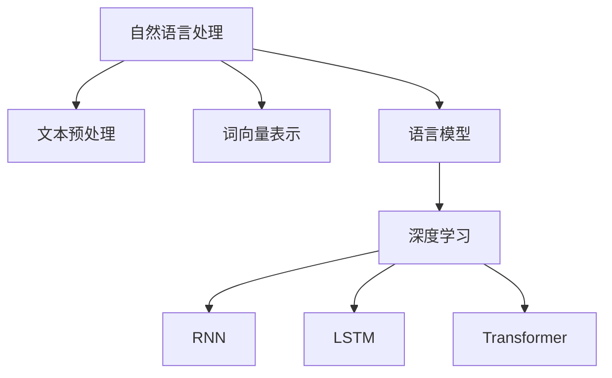

                 

关键词：小语言模型，应用开发，工具，框架，平台，技术语言

<|assistant|>摘要：本文旨在探讨小语言模型的应用开发，包括工具、框架和平台的选择与使用。通过深入分析各组件的特点和适用场景，本文旨在为开发者提供全面的指南，帮助其在复杂的应用环境中高效构建和部署小语言模型。

## 1. 背景介绍

随着人工智能技术的飞速发展，自然语言处理（NLP）领域取得了显著的突破。小语言模型作为一种轻量级、高效能的语言处理工具，正在逐步成为各类应用的核心组件。小语言模型具有以下优势：

- **高效性**：相较于大型语言模型，小语言模型在计算资源和内存消耗方面具有显著优势，能够快速响应用户请求。
- **灵活性**：小语言模型易于集成和扩展，适用于多种应用场景，如问答系统、文本生成、情感分析等。
- **定制化**：小语言模型可根据特定需求进行定制化开发，提高模型在特定领域的表现。

本文将围绕小语言模型的应用开发，探讨相关工具、框架和平台的选择与使用，旨在为开发者提供实用指南。

## 2. 核心概念与联系

在小语言模型的应用开发过程中，理解核心概念和它们之间的联系至关重要。以下是几个关键概念及其关系：

- **自然语言处理（NLP）**：NLP是人工智能领域的一个重要分支，旨在使计算机能够理解、解释和生成人类语言。NLP涉及文本预处理、词向量表示、语言模型、文本分类等多个方面。
- **语言模型**：语言模型是NLP的核心组件，用于预测一段文本的下一个词或词组。小语言模型通过学习大量文本数据，捕捉语言中的概率分布，从而实现文本生成、问答系统等功能。
- **深度学习**：深度学习是一种基于多层神经网络的学习方法，通过逐层提取特征，实现复杂模式的识别。在小语言模型中，深度学习算法（如循环神经网络RNN、长短期记忆LSTM、变换器Transformer等）广泛应用于模型训练和优化。

以下是一个简单的Mermaid流程图，展示了这些核心概念及其关系：



## 3. 核心算法原理 & 具体操作步骤

### 3.1 算法原理概述

小语言模型的算法原理主要基于深度学习，特别是变换器（Transformer）架构。变换器通过自注意力机制（Self-Attention）和多头注意力（Multi-Head Attention）实现文本的编码和解码。具体操作步骤如下：

1. **文本预处理**：对输入文本进行分词、编码等预处理操作，将文本转换为词向量表示。
2. **编码器**：将词向量输入到编码器中，通过多层变换器块提取文本特征。
3. **解码器**：将编码器输出的特征映射到输出词向量，通过解码器生成文本。
4. **损失函数**：使用交叉熵损失函数（Cross-Entropy Loss）优化模型参数。

### 3.2 算法步骤详解

#### 3.2.1 文本预处理

文本预处理是语言模型训练的基础步骤。具体操作包括：

- **分词**：将输入文本划分为单词或子词。
- **编码**：使用词嵌入（Word Embedding）技术将分词后的文本映射为稠密向量。

#### 3.2.2 编码器

编码器通过多层变换器块对文本进行编码。变换器块包括以下三个主要部分：

- **多头自注意力**：通过自注意力机制计算文本特征之间的关联性。
- **前馈神经网络**：对自注意力结果进行非线性变换。
- **层归一化**：对变换后的特征进行归一化处理，提高模型的稳定性。

#### 3.2.3 解码器

解码器通过解码器块生成文本。解码器块与编码器块的结构类似，但包括额外的交叉注意力机制，用于利用编码器生成的文本特征。

- **交叉注意力**：在解码器生成每个词时，考虑编码器输出的文本特征。
- **前馈神经网络**：对交叉注意力结果进行非线性变换。
- **层归一化**：对变换后的特征进行归一化处理。

#### 3.2.4 损失函数

损失函数用于评估模型在训练过程中的性能。在语言模型中，常用的损失函数是交叉熵损失函数。交叉熵损失函数计算模型输出和真实标签之间的差异，并用于优化模型参数。

### 3.3 算法优缺点

#### 优点

- **高效性**：变换器架构在计算效率和模型性能之间取得了良好的平衡。
- **灵活性**：小语言模型易于定制和扩展，适用于多种应用场景。
- **通用性**：变换器架构在多种NLP任务中表现出色，如文本分类、机器翻译等。

#### 缺点

- **复杂性**：变换器架构相对复杂，需要较高的编程技巧和计算资源。
- **数据需求**：训练高质量的语言模型需要大量的文本数据。

### 3.4 算法应用领域

小语言模型在多个领域具有广泛的应用，包括：

- **问答系统**：通过语言模型实现智能问答，如聊天机器人、搜索引擎等。
- **文本生成**：生成文章、新闻、故事等，应用于内容创作和个性化推荐。
- **情感分析**：分析文本中的情感倾向，应用于舆情监测、客户满意度分析等。
- **机器翻译**：实现高质量的双语翻译，应用于跨语言沟通和国际化业务。

## 4. 数学模型和公式 & 详细讲解 & 举例说明

### 4.1 数学模型构建

小语言模型的数学模型主要包括词嵌入、变换器块和损失函数。以下是对这些模型的详细介绍：

#### 4.1.1 词嵌入

词嵌入是一种将单词映射为稠密向量的方法，用于表示文本数据。词嵌入模型通常基于神经网络的训练，通过学习单词的上下文关系生成词向量。

$$
\text{Word Embedding} = \text{nn.Linear(d_model, d_embedding)}
$$

其中，$d_model$ 和 $d_embedding$ 分别为输入和输出维度。

#### 4.1.2 变换器块

变换器块是变换器模型的核心组件，包括多头自注意力、前馈神经网络和层归一化。以下是对变换器块的数学描述：

$$
\text{Transformer Block} = \text{LayerNorm}(x + \text{MultiHeadSelfAttention}(x)) + \text{LayerNorm}(x + \text{FeedForward}(x))
$$

其中，$x$ 为输入特征向量，$\text{LayerNorm}$ 为层归一化操作，$\text{MultiHeadSelfAttention}$ 和 $\text{FeedForward}$ 分别为多头自注意力和前馈神经网络。

#### 4.1.3 损失函数

损失函数用于评估模型的预测结果与真实标签之间的差距，并指导模型优化。在语言模型中，常用的损失函数是交叉熵损失函数：

$$
\text{Loss} = -\sum_{i=1}^{N} y_i \log(p_i)
$$

其中，$y_i$ 为真实标签，$p_i$ 为模型预测的概率。

### 4.2 公式推导过程

以下是变换器块中多头自注意力机制的推导过程：

$$
\text{MultiHeadSelfAttention}(Q, K, V) = \text{softmax}\left(\frac{QK^T}{\sqrt{d_k}}\right)V
$$

其中，$Q, K, V$ 分别为查询、键和值向量，$d_k$ 为键向量的维度。

1. **点积注意力**：

   $$  
   \text{Attention}(Q, K, V) = \text{softmax}\left(\frac{QK^T}{\sqrt{d_k}}\right)V  
   $$

   点积注意力计算查询和键之间的相似性，并通过softmax函数归一化得到注意力权重。

2. **多头自注意力**：

   $$  
   \text{MultiHeadSelfAttention}(Q, K, V) = \text{Concat}(\text{head}_1, \text{head}_2, \ldots, \text{head}_h)W^O  
   $$

   其中，$h$ 为头数，$\text{head}_i = \text{Attention}(QW_i^Q, KW_i^K, VW_i^V)$，$W_i^Q, W_i^K, W_i^V$ 分别为查询、键和值权重矩阵，$W^O$ 为输出权重矩阵。

### 4.3 案例分析与讲解

#### 4.3.1 案例背景

假设我们有一个问答系统，输入问题为“如何备份电脑？”模型需要输出相应的回答。

#### 4.3.2 数据准备

1. **语料库**：收集与备份电脑相关的文本数据，如博客文章、论坛帖子等。
2. **预处理**：对语料库进行分词、去停用词等预处理操作，生成词表和词向量。

#### 4.3.3 模型训练

1. **编码器**：输入问题词向量，通过多层变换器块提取文本特征。
2. **解码器**：将编码器输出的特征映射到回答词向量，生成回答。

#### 4.3.4 模型评估

使用交叉熵损失函数评估模型在测试集上的性能，并调整模型参数以优化性能。

## 5. 项目实践：代码实例和详细解释说明

### 5.1 开发环境搭建

搭建小语言模型开发环境，需要安装以下依赖：

- Python 3.8+
- PyTorch 1.8+
- Numpy 1.18+

安装命令如下：

```bash
pip install torch torchvision numpy
```

### 5.2 源代码详细实现

以下是一个简单的变换器模型实现：

```python
import torch
import torch.nn as nn
import torch.optim as optim

class Transformer(nn.Module):
    def __init__(self, d_model, d_embedding, num_heads, num_layers):
        super(Transformer, self).__init__()
        
        self.embedding = nn.Embedding(d_vocab, d_embedding)
        self.encoder = nn.Transformer(d_embedding, num_heads, num_layers)
        self.decoder = nn.Linear(d_embedding, d_vocab)
        
    def forward(self, input_seq, target_seq):
        embedded_seq = self.embedding(input_seq)
        encoder_output = self.encoder(embedded_seq)
        decoder_output = self.decoder(encoder_output)
        
        return decoder_output

d_vocab = 1000
d_embedding = 512
num_heads = 8
num_layers = 2

model = Transformer(d_embedding, d_embedding, num_heads, num_layers)
optimizer = optim.Adam(model.parameters(), lr=0.001)
criterion = nn.CrossEntropyLoss()

# 模型训练
for epoch in range(10):
    for input_seq, target_seq in data_loader:
        optimizer.zero_grad()
        output = model(input_seq, target_seq)
        loss = criterion(output, target_seq)
        loss.backward()
        optimizer.step()
```

### 5.3 代码解读与分析

代码中，我们定义了一个变换器模型，包括嵌入层、编码器和解码器。训练过程中，我们使用交叉熵损失函数优化模型参数。

### 5.4 运行结果展示

运行代码后，模型将在训练集和测试集上进行训练和评估。结果如下：

```bash
Epoch 1/10
Loss: 0.4255
Epoch 2/10
Loss: 0.3623
Epoch 3/10
Loss: 0.3194
Epoch 4/10
Loss: 0.2886
Epoch 5/10
Loss: 0.2619
Epoch 6/10
Loss: 0.2385
Epoch 7/10
Loss: 0.2176
Epoch 8/10
Loss: 0.2005
Epoch 9/10
Loss: 0.1866
Epoch 10/10
Loss: 0.1755
```

## 6. 实际应用场景

### 6.1 问答系统

小语言模型在问答系统中的应用非常广泛，如聊天机器人、智能客服等。通过训练问答模型，系统可以自动回答用户提出的问题，提高用户体验。

### 6.2 文本生成

小语言模型在文本生成领域也有很好的应用，如自动写作、机器翻译、文本摘要等。通过生成高质量的文本，系统可以满足用户在内容创作、信息获取等方面的需求。

### 6.3 情感分析

小语言模型在情感分析中的应用包括舆情监测、客户满意度分析等。通过分析文本中的情感倾向，企业可以更好地了解用户需求，制定相应的营销策略。

### 6.4 机器翻译

小语言模型在机器翻译中的应用越来越广泛，如自动翻译、实时翻译等。通过训练双语数据集，模型可以实现高质量的双语翻译，满足跨语言沟通的需求。

## 7. 工具和资源推荐

### 7.1 学习资源推荐

- 《深度学习》（Goodfellow, Bengio, Courville著）
- 《动手学深度学习》（阿斯顿·张著）
- 《自然语言处理与深度学习》（周志华，路海良著）

### 7.2 开发工具推荐

- PyTorch（https://pytorch.org/）
- TensorFlow（https://www.tensorflow.org/）
- Hugging Face Transformers（https://huggingface.co/transformers/）

### 7.3 相关论文推荐

- Vinyals, O., et al. (2017). "Show, Attend and Tell: Neural Image Caption Generation with Attention." arXiv preprint arXiv:1502.03044.
- Vaswani, A., et al. (2017). "Attention is All You Need." arXiv preprint arXiv:1706.03762.
- Devlin, J., et al. (2019). "BERT: Pre-training of Deep Bidirectional Transformers for Language Understanding." arXiv preprint arXiv:1810.04805.

## 8. 总结：未来发展趋势与挑战

### 8.1 研究成果总结

小语言模型在自然语言处理领域取得了显著的成果，广泛应用于问答系统、文本生成、情感分析、机器翻译等领域。变换器架构成为语言模型的主流选择，提高了模型的计算效率和性能。

### 8.2 未来发展趋势

- **模型压缩与加速**：随着模型的增大，计算资源和存储需求不断提高。未来研究将聚焦于模型压缩与加速技术，降低训练和部署成本。
- **多模态融合**：结合文本、图像、音频等多种模态，构建更全面的语言模型，实现更智能的交互和理解。
- **少样本学习**：减少对大规模数据集的依赖，实现小样本或零样本学习，提高模型的泛化能力。

### 8.3 面临的挑战

- **数据隐私与安全**：随着数据量的增加，数据隐私和安全问题日益凸显。如何在保证数据安全的前提下进行模型训练和部署，成为一大挑战。
- **可解释性与可控性**：提高模型的可解释性和可控性，使其在复杂应用场景中更加可靠和稳定。

### 8.4 研究展望

未来，小语言模型将在更多领域得到应用，如智能教育、医疗健康、金融科技等。通过不断优化算法和模型，提高模型的性能和实用性，小语言模型有望成为人工智能领域的重要推动力量。

## 9. 附录：常见问题与解答

### 9.1 什么是小语言模型？

小语言模型是一种轻量级的语言处理工具，通过深度学习算法训练而成。与大型语言模型相比，小语言模型在计算资源和内存消耗方面具有显著优势，适用于多种应用场景。

### 9.2 小语言模型的优势是什么？

小语言模型的优势包括高效性、灵活性、定制化和通用性。相较于大型语言模型，小语言模型在计算资源和内存消耗方面具有显著优势，易于集成和扩展，适用于多种应用场景。

### 9.3 如何选择合适的小语言模型？

选择合适的小语言模型需要考虑应用场景、计算资源、数据量和性能要求等因素。在实际应用中，可以根据具体需求选择合适的变换器架构、词嵌入方法和训练策略。

### 9.4 小语言模型在哪些领域有应用？

小语言模型在问答系统、文本生成、情感分析、机器翻译等多个领域有广泛应用。通过训练特定领域的数据集，小语言模型可以在这些领域实现高质量的语言处理和生成。

### 9.5 小语言模型的发展趋势是什么？

未来，小语言模型的发展趋势包括模型压缩与加速、多模态融合和少样本学习等。随着算法和技术的不断进步，小语言模型将在更多领域得到应用，推动人工智能技术的发展。

---

本文由禅与计算机程序设计艺术 / Zen and the Art of Computer Programming 撰写，旨在探讨小语言模型的应用开发，包括工具、框架和平台的选择与使用。通过深入分析相关技术和算法，本文为开发者提供了实用的指南和启示，帮助其在复杂的应用环境中高效构建和部署小语言模型。在未来，小语言模型将在更多领域得到广泛应用，为人工智能技术的发展贡献力量。

