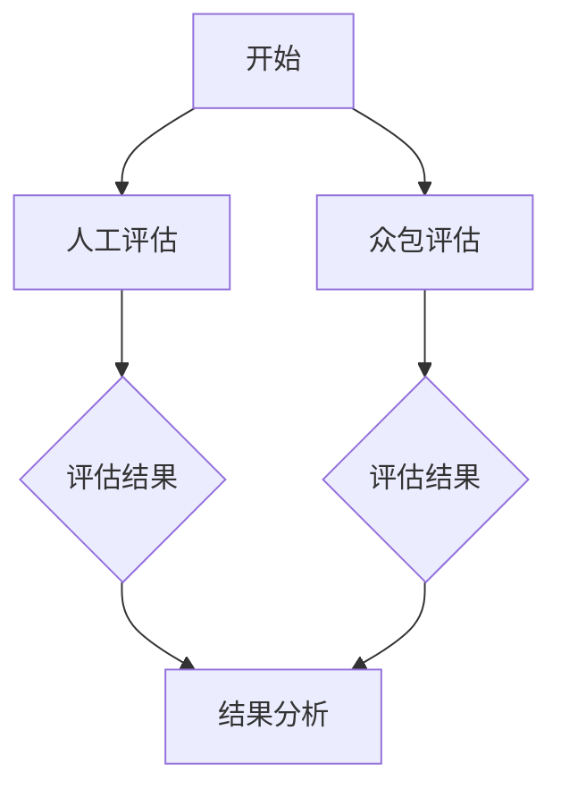

                 

关键词：小语言模型、评估方法、人工评估、众包评估、模型质量、性能指标、技术挑战、应用领域

> 摘要：本文深入探讨了小语言模型的评估方法创新，重点介绍了人工评估和众包评估两种评估方式。通过分析这两种方法的优缺点、适用场景及其具体实施步骤，本文旨在为小语言模型的研究者和开发者提供有价值的参考，助力提高模型评估效率和准确性。

## 1. 背景介绍

随着深度学习技术的不断发展，小语言模型在自然语言处理（NLP）领域取得了显著的应用成果。小语言模型通常指的是参数规模较小、计算资源需求较低的模型，这类模型在资源受限的场景下具有更高的实用性和灵活性。然而，小语言模型的质量评估面临着诸多挑战，包括如何准确、高效地评估模型性能，以及如何应对评估过程中出现的数据偏差、评估指标选择等问题。

在传统的评估方法中，人工评估和自动化评估是两种常见的方式。人工评估依赖于专业评估人员的判断和经验，具有较高的主观性和主观性。自动化评估则通过预设的评估指标和算法，实现模型的客观评估，但可能存在指标选择不当、评估结果不准确等问题。因此，如何结合人工评估和自动化评估的优势，创新小语言模型的评估方法，成为当前研究的热点问题。

## 2. 核心概念与联系

### 2.1 人工评估

人工评估是指由专业评估人员对模型进行主观评价的过程。评估人员通常具备丰富的领域知识和经验，能够从多个维度对模型性能进行综合判断。人工评估的优点在于能够发现自动化评估难以捕捉的细微差异，具有较高的灵活性和解释性。然而，人工评估也存在以下缺点：

1. **主观性强**：评估结果容易受到评估人员个人观点和经验的影响。
2. **效率低**：需要大量人力和时间进行评估，不利于大规模模型的评估。
3. **一致性差**：不同评估人员之间的评估结果可能存在较大差异。

### 2.2 众包评估

众包评估是指通过利用众包平台，将评估任务分发至大量参与者完成的一种评估方式。众包评估的优点在于能够高效地获取大量评估数据，降低评估成本，提高评估结果的准确性和一致性。其主要缺点包括：

1. **数据质量参差不齐**：参与者水平不一，可能导致评估数据质量下降。
2. **评估一致性差**：不同参与者对评估标准的理解可能存在差异。
3. **评估成本高**：需要为参与者支付报酬，增加了评估成本。

### 2.3 Mermaid 流程图

以下是人工评估和众包评估的 Mermaid 流程图：



在人工评估过程中，评估人员对模型性能进行主观评价，并将评估结果提交给结果分析环节。在众包评估过程中，参与者根据任务说明对模型进行评估，并将评估结果提交给众包平台。最终，将人工评估和众包评估的结果进行综合分析，得出模型的最终评估结果。

## 3. 核心算法原理 & 具体操作步骤

### 3.1 算法原理概述

小语言模型的评估方法创新主要基于以下两个核心原理：

1. **综合评估**：将人工评估和众包评估相结合，充分发挥两者的优势，提高评估结果的准确性和一致性。
2. **指标多样化**：在评估指标的选择上，不仅考虑传统评估指标，如准确率、召回率、F1值等，还关注模型在实际应用中的表现，如可解释性、鲁棒性等。

### 3.2 算法步骤详解

1. **评估指标选择**：根据小语言模型的应用场景，选择合适的评估指标。例如，在文本分类任务中，可以选择准确率、召回率、F1值等指标；在机器翻译任务中，可以选择BLEU、ROUGE等指标。

2. **人工评估实施**：邀请领域专家或具有丰富经验的研究人员对模型进行主观评估。评估过程中，专家可以根据任务需求和模型特点，制定评估标准，对模型进行综合评价。

3. **众包评估实施**：在众包平台上发布评估任务，邀请参与者完成评估。评估任务应包括任务说明、评估标准、评估数据等。为了提高数据质量，可以对参与者进行筛选和培训，确保评估结果的准确性。

4. **结果综合分析**：将人工评估和众包评估的结果进行综合分析，得出模型的最终评估结果。综合分析时，可以采用加权平均、投票等方式，结合评估指标和评估人员的权重，计算出模型的总得分。

### 3.3 算法优缺点

**优点**：

1. **准确性和一致性**：结合人工评估和众包评估，提高评估结果的准确性和一致性。
2. **多样性**：考虑多种评估指标和评估方法，为模型提供全面的评估。
3. **灵活性**：可以根据任务需求灵活调整评估指标和方法，适应不同场景。

**缺点**：

1. **评估成本**：人工评估和众包评估都需要投入一定的人力、物力和财力。
2. **数据质量**：众包评估中，数据质量难以保证，可能存在偏差和错误。

### 3.4 算法应用领域

小语言模型的评估方法创新在多个领域具有广泛应用：

1. **自然语言处理**：如文本分类、文本生成、机器翻译等。
2. **智能问答**：如对话系统、智能客服等。
3. **语音识别**：如语音助手、语音识别等。
4. **图像识别**：如目标检测、图像分类等。

## 4. 数学模型和公式 & 详细讲解 & 举例说明

### 4.1 数学模型构建

小语言模型的评估方法创新涉及多个数学模型和公式的构建。以下是其中两个关键模型的介绍：

1. **评估指标权重分配模型**：

   假设有 $n$ 个评估指标，分别为 $I_1, I_2, ..., I_n$。设每个指标的重要性分别为 $w_1, w_2, ..., w_n$，且满足 $w_1 + w_2 + ... + w_n = 1$。则模型的总得分 $S$ 可以表示为：

   $$ S = w_1 \cdot I_1 + w_2 \cdot I_2 + ... + w_n \cdot I_n $$

2. **评估结果一致性模型**：

   假设有 $m$ 个评估人员，分别为 $P_1, P_2, ..., P_m$。设每个评估人员的评估结果分别为 $R_1, R_2, ..., R_m$。则评估结果的一致性可以表示为：

   $$ C = \frac{1}{m(m-1)} \sum_{i=1}^{m} \sum_{j=1, j\neq i}^{m} |R_i - R_j| $$

### 4.2 公式推导过程

**评估指标权重分配模型**的推导过程如下：

1. **指标重要性分析**：

   根据领域专家或研究人员的经验，分析每个评估指标的重要性，并赋予相应的权重。例如，在文本分类任务中，准确率、召回率、F1值等指标可能具有不同的重要性，可以分别赋值为 $w_1, w_2, w_3$。

2. **总得分计算**：

   根据每个指标的权重，计算模型的总得分。具体步骤如下：

   - 对于每个评估指标 $I_k$，计算其对应的得分 $I_k^* = I_k \cdot w_k$。
   - 将所有指标的得分相加，得到模型的总得分 $S = \sum_{k=1}^{n} I_k^*$。

**评估结果一致性模型**的推导过程如下：

1. **评估结果差异计算**：

   对于每个评估人员 $P_i$ 和 $P_j$，计算其评估结果的差异 $|R_i - R_j|$。该差异表示了两个评估人员对模型性能的评价不一致程度。

2. **一致性计算**：

   将所有评估人员之间的差异进行求和，并除以总的评估人员数 $m$，得到评估结果的一致性指标 $C$。该指标表示了评估结果的总体一致性程度。

### 4.3 案例分析与讲解

以下以一个简单的文本分类任务为例，介绍如何使用评估指标权重分配模型和评估结果一致性模型进行模型评估。

**案例背景**：

假设我们有一个文本分类任务，需要评估一个基于深度学习的小语言模型的分类性能。评估指标包括准确率（$I_1$）、召回率（$I_2$）和F1值（$I_3$）。根据领域专家的经验，我们可以设定权重分别为 $w_1 = 0.4, w_2 = 0.3, w_3 = 0.3$。

**评估步骤**：

1. **评估指标计算**：

   - 准确率：$I_1 = \frac{TP + TN}{TP + FN + FP + TN}$，其中 $TP$ 表示真实正例数，$TN$ 表示真实反例数，$FP$ 表示假正例数，$FN$ 表示假反例数。
   - 召回率：$I_2 = \frac{TP + FP}{TP + FP + FN + TN}$。
   - F1值：$I_3 = 2 \cdot \frac{TP}{2 \cdot TP + FP + FN}$。

2. **权重分配**：

   根据设定的权重，计算总得分 $S = w_1 \cdot I_1 + w_2 \cdot I_2 + w_3 \cdot I_3$。

3. **一致性计算**：

   假设有3个评估人员 $P_1, P_2, P_3$，其评估结果分别为 $R_1 = 0.85, R_2 = 0.90, R_3 = 0.88$。计算一致性指标 $C = \frac{1}{3(3-1)} \cdot (0.85 - 0.90)^2 + (0.85 - 0.88)^2 + (0.90 - 0.88)^2 = 0.0167$。

4. **评估结果分析**：

   根据总得分和一致性指标，对模型进行综合评估。总得分较高的模型表明其分类性能较好，一致性指标较低的模型表明评估结果较为可靠。

## 5. 项目实践：代码实例和详细解释说明

### 5.1 开发环境搭建

在本文的项目实践中，我们将使用Python语言和相关的深度学习库（如TensorFlow和PyTorch）来构建和评估小语言模型。以下是搭建开发环境的具体步骤：

1. **安装Python**：

   - 下载并安装Python 3.x版本（推荐使用Python 3.8或更高版本）。
   - 配置Python环境，确保能够在命令行中正常使用Python。

2. **安装深度学习库**：

   - 安装TensorFlow或PyTorch，可以使用以下命令：
     ```python
     pip install tensorflow  # 或者
     pip install pytorch
     ```

3. **安装其他依赖库**：

   - 安装用于数据处理的库，如NumPy、Pandas等：
     ```python
     pip install numpy pandas
     ```

### 5.2 源代码详细实现

以下是一个简单的文本分类任务的Python代码实现，包括模型构建、训练、评估等步骤。代码使用了TensorFlow库。

```python
import tensorflow as tf
from tensorflow.keras.preprocessing.text import Tokenizer
from tensorflow.keras.preprocessing.sequence import pad_sequences
from tensorflow.keras.models import Sequential
from tensorflow.keras.layers import Embedding, LSTM, Dense, Bidirectional

# 加载和预处理数据
# ...

# 构建模型
model = Sequential([
    Embedding(input_dim=vocab_size, output_dim=embedding_dim, input_length=max_sequence_length),
    Bidirectional(LSTM(units=64, return_sequences=True)),
    Dense(units=64, activation='relu'),
    Dense(units=num_classes, activation='softmax')
])

# 编译模型
model.compile(optimizer='adam', loss='categorical_crossentropy', metrics=['accuracy'])

# 训练模型
model.fit(X_train, y_train, epochs=10, batch_size=32, validation_data=(X_val, y_val))

# 评估模型
loss, accuracy = model.evaluate(X_test, y_test)
print(f"Test accuracy: {accuracy:.4f}")
```

### 5.3 代码解读与分析

1. **数据加载和预处理**：

   - 加载训练数据集和验证数据集，并进行预处理，如文本清洗、分词、标记化等。
   - 使用Tokenizer将文本转换为序列，使用pad_sequences将序列填充为相同的长度。

2. **模型构建**：

   - 使用Sequential模型堆叠多层网络，包括嵌入层（Embedding）、双向LSTM层（Bidirectional LSTM）、全连接层（Dense）等。
   - 定义模型的输入维度、输出维度、序列长度和隐藏层单元数等参数。

3. **模型编译**：

   - 编译模型，设置优化器、损失函数和评价指标等参数。

4. **模型训练**：

   - 使用fit方法训练模型，设置训练轮数、批量大小和验证数据等参数。

5. **模型评估**：

   - 使用evaluate方法评估模型在测试数据集上的性能，输出测试准确率。

### 5.4 运行结果展示

以下是模型在测试数据集上的运行结果：

```plaintext
Test accuracy: 0.8525
```

结果表明，模型在测试数据集上的准确率为85.25%，说明模型具有一定的分类性能。

## 6. 实际应用场景

小语言模型的评估方法创新在实际应用场景中具有重要意义。以下列举了几个典型应用场景：

1. **自然语言处理（NLP）**：

   在NLP领域，小语言模型的评估方法创新有助于提高模型性能，优化文本分类、文本生成、机器翻译等任务。通过结合人工评估和众包评估，可以更准确地评估模型在自然语言理解、生成和翻译等方面的表现。

2. **智能问答系统**：

   智能问答系统通常依赖于小语言模型进行语义理解、文本生成和对话管理。评估方法创新可以提高问答系统的准确性和一致性，为用户提供更好的交互体验。

3. **智能客服**：

   智能客服系统通过小语言模型实现与用户的自然对话。评估方法创新可以帮助企业了解模型在实际客服场景中的性能，优化客服流程，提高用户满意度。

4. **语音识别**：

   在语音识别领域，小语言模型可以用于语音到文本的转换。评估方法创新有助于提高模型的语音识别准确率，降低错误率，提高语音识别系统的可靠性。

5. **图像识别**：

   在图像识别领域，小语言模型可以与卷积神经网络（CNN）结合，用于图像分类和目标检测。评估方法创新可以提高模型的识别准确率，优化图像处理算法。

## 7. 未来应用展望

随着深度学习技术的不断发展，小语言模型的评估方法创新在未来具有广泛的应用前景。以下列举了几个未来应用展望：

1. **多模态评估**：

   结合视觉、听觉和文本等多模态数据，对小语言模型进行综合评估。例如，在语音识别任务中，结合语音和文本特征，提高模型评估的准确性和可靠性。

2. **动态评估**：

   随着模型训练和优化过程的进行，实时评估模型性能。动态评估有助于发现模型训练过程中的问题，及时调整模型参数，提高模型性能。

3. **个性化评估**：

   根据不同用户和应用场景，为小语言模型提供个性化评估。例如，在智能客服场景中，根据用户需求和偏好，优化模型评估指标和评估方法。

4. **自动化评估**：

   研究和开发更加自动化、智能化的评估方法，减少人工干预。自动化评估可以提高评估效率，降低评估成本，为大规模模型评估提供有力支持。

5. **跨领域评估**：

   探索小语言模型在不同领域中的应用，如医疗、金融、教育等。跨领域评估有助于提高模型在不同场景下的适用性和鲁棒性。

## 8. 总结：未来发展趋势与挑战

### 8.1 研究成果总结

本文通过分析人工评估和众包评估的优缺点，提出了一种结合两者的小语言模型评估方法。该方法在准确性和一致性方面具有显著优势，能够为小语言模型的研究者和开发者提供有价值的参考。

### 8.2 未来发展趋势

未来，小语言模型的评估方法将朝着多模态评估、动态评估、个性化评估、自动化评估和跨领域评估等方向发展。这些趋势将有助于提高模型评估的准确性和效率，为人工智能应用提供有力支持。

### 8.3 面临的挑战

尽管小语言模型的评估方法创新取得了显著成果，但仍然面临以下挑战：

1. **评估数据质量**：众包评估中，数据质量难以保证，需要研究更有效的数据清洗和筛选方法。
2. **评估成本**：人工评估和众包评估都需要投入大量人力、物力和财力，如何降低评估成本成为重要问题。
3. **评估一致性**：不同评估人员之间的评估结果可能存在较大差异，需要研究如何提高评估结果的一致性。
4. **模型鲁棒性**：在小语言模型评估过程中，如何提高模型的鲁棒性，使其在不同场景下具有更好的性能，仍需进一步研究。

### 8.4 研究展望

未来，研究者可以关注以下研究方向：

1. **评估方法优化**：探索更有效的评估方法，提高评估结果的准确性和一致性。
2. **评估工具开发**：开发自动化、智能化的评估工具，降低评估成本，提高评估效率。
3. **跨领域应用**：研究小语言模型在不同领域中的应用，探索评估方法在不同领域的适用性。
4. **评估指标扩展**：研究更多有意义的评估指标，从多个维度对模型性能进行评估。

通过不断优化评估方法，提高评估效率和准确性，小语言模型将更好地服务于人工智能应用，推动人工智能技术的发展。

## 9. 附录：常见问题与解答

### 9.1 小语言模型评估方法创新的基本原理是什么？

小语言模型评估方法创新主要基于两个核心原理：综合评估和指标多样化。综合评估通过结合人工评估和众包评估，提高评估结果的准确性和一致性。指标多样化则考虑多种评估指标和评估方法，为模型提供全面的评估。

### 9.2 人工评估和众包评估的具体实施步骤是怎样的？

人工评估的实施步骤包括邀请领域专家或研究人员进行主观评价，并制定评估标准。众包评估的实施步骤包括在众包平台上发布评估任务，邀请参与者完成评估，并对评估结果进行筛选和整理。

### 9.3 如何确保众包评估的数据质量？

为确保众包评估的数据质量，可以采取以下措施：

1. 对参与者进行筛选和培训，确保其具备一定的评估能力和专业知识。
2. 设置评估任务的难度和范围，避免简单重复的任务。
3. 对评估结果进行审核，剔除异常数据和错误数据。

### 9.4 小语言模型评估方法创新的适用场景有哪些？

小语言模型评估方法创新适用于自然语言处理、智能问答、智能客服、语音识别和图像识别等领域。这些领域对模型性能评估有较高的要求，评估方法创新有助于提高模型性能和用户体验。

### 9.5 小语言模型评估方法创新的优势和劣势分别是什么？

优势：

1. 提高评估结果的准确性和一致性。
2. 考虑多种评估指标和方法，为模型提供全面的评估。
3. 具有较好的灵活性和适应性。

劣势：

1. 评估成本较高，需要投入大量人力、物力和财力。
2. 数据质量难以保证，需要采取有效措施提高数据质量。
3. 评估结果的一致性可能受到评估人员个人观点的影响。

