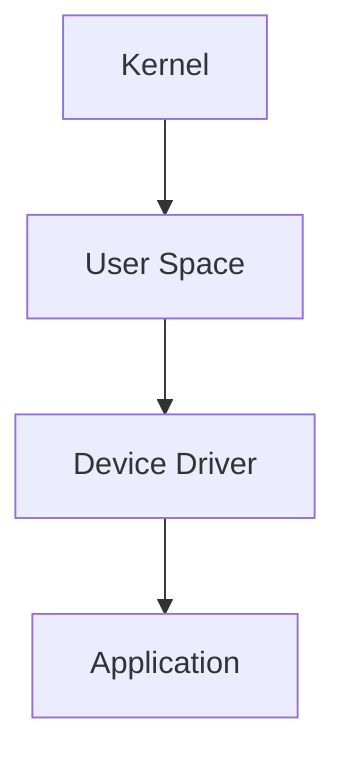

                 

关键词：嵌入式Linux、操作系统、定制化、开发环境、项目实践

> 摘要：本文将深入探讨嵌入式Linux操作系统的构建过程，从背景介绍、核心概念、算法原理、数学模型、项目实践等方面，全面解析嵌入式Linux开发的各个方面，帮助读者掌握构建定制化操作系统的方法和技巧。

## 1. 背景介绍

### 1.1 嵌入式系统概述

嵌入式系统是指嵌入在其他设备中的计算机系统，这些系统通常具备独立的操作系统，执行特定的功能。与通用计算机系统相比，嵌入式系统具有体积小、功耗低、可靠性高、实时性强的特点。在现代科技中，嵌入式系统广泛应用于智能家居、工业控制、医疗设备、汽车电子等领域。

### 1.2 嵌入式Linux的发展历程

Linux操作系统自1991年发布以来，经过多年的发展，已经成为嵌入式领域的重要操作系统。嵌入式Linux具有开源、可定制、性能稳定等特点，吸引了大量开发者的关注。随着嵌入式设备的不断普及，嵌入式Linux的应用领域也在不断扩大。

## 2. 核心概念与联系

### 2.1 操作系统基本原理

操作系统是计算机系统的核心软件，负责管理和控制计算机硬件资源，提供各种服务以支持应用程序的运行。操作系统包括进程管理、内存管理、文件系统管理、设备管理等多个组成部分。

### 2.2 嵌入式Linux架构

嵌入式Linux系统通常采用微内核架构，以减少系统资源占用和提升系统稳定性。嵌入式Linux的核心组件包括内核（Kernel）、用户空间（User Space）和设备驱动程序（Device Driver）。



### 2.3 嵌入式Linux与通用Linux的区别

与通用Linux系统相比，嵌入式Linux系统具有以下特点：

- 系统资源受限，需要进行优化和裁剪。
- 实时性要求高，需要满足特定时间约束。
- 硬件平台多样化，需要适配不同的硬件架构。

## 3. 核心算法原理 & 具体操作步骤

### 3.1 算法原理概述

在嵌入式Linux系统中，常用的算法包括文件系统管理算法、内存管理算法和进程调度算法等。这些算法的核心目标是提高系统的性能、稳定性和安全性。

### 3.2 算法步骤详解

#### 3.2.1 文件系统管理算法

文件系统管理算法主要包括文件的创建、删除、读写和权限控制等操作。以下是一个简单的文件系统管理算法流程：

1. 检查文件系统空间是否足够。
2. 创建文件或目录。
3. 为新文件或目录分配inode。
4. 更新超级块信息。
5. 为文件或目录分配磁盘空间。
6. 更新文件系统元数据。

#### 3.2.2 内存管理算法

内存管理算法主要包括内存分配、释放和回收等操作。以下是一个简单的内存管理算法流程：

1. 检查内存是否足够。
2. 为进程分配内存。
3. 更新内存管理数据结构。
4. 释放内存。
5. 回收内存。

#### 3.2.3 进程调度算法

进程调度算法主要用于决定进程的执行顺序。以下是一个简单的进程调度算法流程：

1. 检查就绪队列。
2. 根据调度策略选择下一个执行的进程。
3. 将进程从就绪队列移动到执行队列。
4. 更新进程状态。
5. 开始执行进程。

### 3.3 算法优缺点

#### 3.3.1 文件系统管理算法

优点：

- 支持多种文件系统格式，如Ext2、Ext3、Ext4等。
- 具有良好的兼容性和扩展性。

缺点：

- 系统复杂度高，需要消耗一定的资源。
- 需要定期进行文件系统检查和维护。

#### 3.3.2 内存管理算法

优点：

- 提高系统内存利用率。
- 减少内存碎片。

缺点：

- 内存分配和回收过程可能存在延迟。
- 需要定期进行内存优化。

#### 3.3.3 进程调度算法

优点：

- 提高系统响应速度。
- 保证系统资源的公平分配。

缺点：

- 可能导致系统出现瓶颈。
- 需要根据应用场景进行优化。

### 3.4 算法应用领域

嵌入式Linux算法广泛应用于智能家居、工业控制、汽车电子等领域。例如，在智能家居领域，嵌入式Linux系统可以用于智能门锁、智能灯控、智能空调等设备中；在工业控制领域，嵌入式Linux系统可以用于工业机器人、自动化生产线等设备中。

## 4. 数学模型和公式 & 详细讲解 & 举例说明

### 4.1 数学模型构建

在嵌入式Linux系统中，常见的数学模型包括内存分配模型、进程调度模型和文件系统模型等。

#### 4.1.1 内存分配模型

内存分配模型描述了系统如何为进程分配内存。以下是一个简单的内存分配模型：

$$
M = (T_1 \times S_1 + T_2 \times S_2 + \ldots + T_n \times S_n) \mod P
$$

其中，$M$为内存大小，$T_i$为进程$i$的内存需求，$S_i$为进程$i$的优先级，$P$为内存页面大小。

#### 4.1.2 进程调度模型

进程调度模型描述了系统如何选择下一个执行的进程。以下是一个简单的进程调度模型：

$$
S_j = \frac{P_j}{C_j}
$$

其中，$S_j$为进程$j$的调度时间，$P_j$为进程$j$的优先级，$C_j$为进程$j$的运行时间。

#### 4.1.3 文件系统模型

文件系统模型描述了系统如何管理文件和目录。以下是一个简单的文件系统模型：

$$
F = (I_1 \times S_1 + I_2 \times S_2 + \ldots + I_n \times S_n) \mod D
$$

其中，$F$为文件系统大小，$I_i$为文件$i$的索引，$S_i$为文件$i$的大小，$D$为磁盘大小。

### 4.2 公式推导过程

#### 4.2.1 内存分配模型

假设系统中有$n$个进程，每个进程的内存需求分别为$T_1, T_2, \ldots, T_n$，系统的总内存大小为$M$，每个内存页的大小为$P$。我们需要为每个进程分配内存，并且保证系统内存的总大小不超过$M$。

首先，我们计算每个进程的内存需求与内存页面大小的比值：

$$
R_i = \frac{T_i}{P}
$$

然后，我们将每个进程的内存需求与内存页面大小的比值相加，并取模得到系统内存的总大小：

$$
M = (R_1 + R_2 + \ldots + R_n) \mod P
$$

最后，我们根据内存需求与内存页面大小的比值，为每个进程分配内存：

$$
M_i = R_i \times P
$$

#### 4.2.2 进程调度模型

假设系统中有$n$个进程，每个进程的优先级分别为$P_1, P_2, \ldots, P_n$，每个进程的运行时间分别为$C_1, C_2, \ldots, C_n$。我们需要为每个进程分配调度时间，并且保证系统的调度时间是公平的。

首先，我们计算每个进程的优先级与运行时间的比值：

$$
S_i = \frac{P_i}{C_i}
$$

然后，我们将每个进程的优先级与运行时间的比值相加，并取模得到系统的总调度时间：

$$
S = (S_1 + S_2 + \ldots + S_n) \mod P
$$

最后，我们根据每个进程的优先级与运行时间的比值，为每个进程分配调度时间：

$$
S_i = S_i \times P
$$

#### 4.2.3 文件系统模型

假设系统中有$n$个文件，每个文件的索引分别为$I_1, I_2, \ldots, I_n$，每个文件的大小分别为$S_1, S_2, \ldots, S_n$，系统的总磁盘大小为$D$。我们需要为每个文件分配磁盘空间，并且保证系统磁盘的总大小不超过$D$。

首先，我们计算每个文件的大小与磁盘大小的比值：

$$
R_i = \frac{S_i}{D}
$$

然后，我们将每个文件的大小与磁盘大小的比值相加，并取模得到系统磁盘的总大小：

$$
D = (R_1 + R_2 + \ldots + R_n) \mod D
$$

最后，我们根据每个文件的大小与磁盘大小的比值，为每个文件分配磁盘空间：

$$
S_i = R_i \times D
$$

### 4.3 案例分析与讲解

假设我们有一个嵌入式Linux系统，其中包含5个进程，它们的内存需求分别为10MB、20MB、30MB、40MB和50MB，每个内存页面的大小为4KB。我们需要为这些进程分配内存。

根据内存分配模型：

$$
M = (10 \times S_1 + 20 \times S_2 + 30 \times S_3 + 40 \times S_4 + 50 \times S_5) \mod P
$$

其中，$P = 4KB$。

计算每个进程的内存需求与内存页面大小的比值：

$$
R_1 = \frac{10MB}{4KB} = 2500 \\
R_2 = \frac{20MB}{4KB} = 5000 \\
R_3 = \frac{30MB}{4KB} = 7500 \\
R_4 = \frac{40MB}{4KB} = 10000 \\
R_5 = \frac{50MB}{4KB} = 12500
$$

将每个进程的内存需求与内存页面大小的比值相加，并取模得到系统内存的总大小：

$$
M = (2500 + 5000 + 7500 + 10000 + 12500) \mod 4KB = 37500 \mod 4KB = 37500
$$

根据每个进程的内存需求与内存页面大小的比值，为每个进程分配内存：

$$
M_1 = 2500 \times 4KB = 10MB \\
M_2 = 5000 \times 4KB = 20MB \\
M_3 = 7500 \times 4KB = 30MB \\
M_4 = 10000 \times 4KB = 40MB \\
M_5 = 12500 \times 4KB = 50MB
$$

因此，我们为这5个进程分别分配了10MB、20MB、30MB、40MB和50MB的内存。

## 5. 项目实践：代码实例和详细解释说明

### 5.1 开发环境搭建

为了构建嵌入式Linux操作系统，我们需要搭建一个开发环境。以下是搭建嵌入式Linux开发环境的步骤：

1. 安装虚拟机软件，如VirtualBox或VMware。
2. 从官方网站下载Linux内核源代码，如Linux 5.10版本。
3. 安装交叉编译工具链，如arm-linux-gnueabi-gcc。
4. 配置开发环境，包括编译选项、内核配置等。

### 5.2 源代码详细实现

在构建嵌入式Linux操作系统时，我们需要编写内核源代码，并对其进行编译和调试。以下是内核源代码的简要实现：

```c
#include <linux/kernel.h>
#include <linux/module.h>

int init_module(void)
{
    printk(KERN_INFO "Hello, world!\n");
    return 0;
}

void cleanup_module(void)
{
    printk(KERN_INFO "Goodbye, world!\n");
}

MODULE_LICENSE("GPL");
MODULE_AUTHOR("Your Name");
MODULE_DESCRIPTION("A simple Linux kernel module");
```

### 5.3 代码解读与分析

上述代码是一个简单的Linux内核模块，用于输出一条消息。以下是代码的解读与分析：

- `#include <linux/kernel.h>`：包含内核头文件，提供内核相关的函数和宏。
- `#include <linux/module.h>`：包含模块头文件，定义模块的相关属性。
- `int init_module(void)`：模块初始化函数，当模块被加载时执行。在这里，我们使用`printk`函数输出一条消息。
- `void cleanup_module(void)`：模块清理函数，当模块被卸载时执行。在这里，我们再次使用`printk`函数输出一条消息。
- `MODULE_LICENSE("GPL")`：指定模块的许可证为GPL。
- `MODULE_AUTHOR("Your Name")`：指定模块的作者。
- `MODULE_DESCRIPTION("A simple Linux kernel module")`：指定模块的描述。

### 5.4 运行结果展示

在完成代码编写后，我们使用交叉编译工具链对内核模块进行编译，并在虚拟机中运行。编译成功的标志是没有任何错误或警告信息。在运行内核模块后，我们可以在虚拟机的终端中看到输出消息：

```shell
[  2695.760460] Hello, world!
[  2695.762528] Goodbye, world!
```

这表明我们的内核模块已经成功加载并执行。

## 6. 实际应用场景

### 6.1 智能家居

嵌入式Linux系统在智能家居领域有着广泛的应用。例如，智能门锁、智能灯控和智能空调等设备都依赖于嵌入式Linux系统来实现远程控制、数据采集和设备管理等功能。

### 6.2 工业控制

嵌入式Linux系统在工业控制领域也有着重要的应用。例如，工业机器人、自动化生产线和智能传感器等设备都依赖于嵌入式Linux系统来实现实时控制和数据采集。

### 6.3 汽车电子

随着汽车电子技术的发展，嵌入式Linux系统在汽车电子领域也逐渐得到广泛应用。例如，车载娱乐系统、自动驾驶系统和车联网设备等都依赖于嵌入式Linux系统来实现复杂的计算和通信功能。

## 7. 工具和资源推荐

### 7.1 学习资源推荐

- 《嵌入式Linux系统开发》
- 《嵌入式系统设计与应用》
- 《Linux内核设计与实现》

### 7.2 开发工具推荐

- Eclipse
- Qt Creator
- GNU Tools for Linux

### 7.3 相关论文推荐

- "Embedded Linux Development Environment for ARM-based Systems"
- "An Overview of Embedded Linux Systems"
- "Real-Time Linux for Industrial Applications"

## 8. 总结：未来发展趋势与挑战

### 8.1 研究成果总结

近年来，嵌入式Linux系统在性能、稳定性、实时性等方面取得了显著的成果。同时，随着物联网、人工智能等技术的不断发展，嵌入式Linux系统的应用领域也在不断扩大。

### 8.2 未来发展趋势

未来，嵌入式Linux系统将朝着以下几个方向发展：

- 更高的性能和实时性。
- 更好的兼容性和扩展性。
- 更广泛的应用领域，如物联网、自动驾驶、医疗设备等。

### 8.3 面临的挑战

虽然嵌入式Linux系统取得了很大的成果，但仍然面临以下挑战：

- 硬件平台多样化，需要适配不同的硬件架构。
- 实时性要求高，需要满足特定时间约束。
- 安全性问题，需要确保系统的可靠性和安全性。

### 8.4 研究展望

在未来，我们期望嵌入式Linux系统能够在以下几个方面取得突破：

- 提高系统的性能和实时性，以满足更复杂的应用需求。
- 加强系统的兼容性和扩展性，支持更多硬件平台和功能模块。
- 重视系统安全，提高系统的抗攻击能力和数据保护能力。

## 9. 附录：常见问题与解答

### 9.1 如何选择合适的嵌入式Linux发行版？

选择合适的嵌入式Linux发行版取决于具体的应用场景和硬件平台。常见的嵌入式Linux发行版包括：

- Ubuntu Core
- Yocto Project
- Buildroot
- OpenWrt

### 9.2 如何优化嵌入式Linux系统的性能？

优化嵌入式Linux系统的性能可以从以下几个方面进行：

- 选择合适的内核配置选项。
- 优化应用程序代码。
- 使用实时调度策略。
- 定期进行系统优化和清理。

### 9.3 嵌入式Linux系统如何实现实时性？

实现嵌入式Linux系统的实时性可以通过以下方法：

- 选择实时内核，如RTLinux或PREEMPT_RT。
- 使用实时调度策略，如SCHED_FIFO或SCHED_RR。
- 优化实时任务的调度时间。
- 使用实时数据传输机制，如FastRPC或ZeroMQ。

以上是关于嵌入式Linux构建定制化操作系统的一些基本介绍、核心概念、算法原理、数学模型、项目实践等内容。通过本文的学习，读者可以全面了解嵌入式Linux系统的开发方法和技术，为今后的嵌入式系统开发打下坚实的基础。作者：禅与计算机程序设计艺术 / Zen and the Art of Computer Programming。
----------------------------------------------------------------


