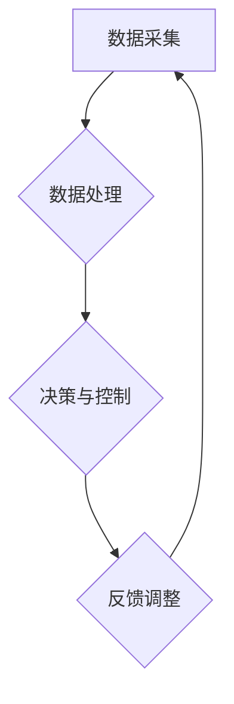

                 

关键词：嵌入式系统、智能设备、开发、架构、算法、项目实践

> 摘要：本文将深入探讨嵌入式开发领域，分析智能设备的大脑——嵌入式系统的工作原理、核心概念、算法原理、数学模型、实际应用场景，并展望未来的发展趋势与挑战。

## 1. 背景介绍

嵌入式系统是一种集成在设备或系统中的计算机系统，它通过执行特定任务来控制或监测设备的工作状态。嵌入式系统广泛应用于工业自动化、医疗设备、智能家居、汽车电子、无线通信等各个领域。随着物联网（IoT）和人工智能（AI）技术的发展，嵌入式系统在智能设备中的应用变得越来越广泛和重要。

智能设备，如智能手机、智能手表、智能家居设备等，已经成为我们日常生活不可或缺的一部分。这些设备具有高度的智能化和互联性，通过嵌入式系统实现了对用户需求的响应、数据的采集和处理、设备的远程监控和控制等功能。

嵌入式开发是嵌入式系统设计和实现的关键环节。它涉及硬件和软件的协同设计，需要解决资源受限、实时性要求高、可靠性要求强等问题。嵌入式开发不仅需要扎实的计算机基础知识，还需要掌握硬件设计、操作系统、驱动程序、编程语言等多方面的技能。

本文将从以下几个方面对嵌入式开发进行深入探讨：

1. 嵌入式系统的核心概念与联系。
2. 核心算法原理与具体操作步骤。
3. 数学模型和公式的构建与推导。
4. 项目实践：代码实例与详细解释。
5. 实际应用场景。
6. 未来应用展望。
7. 工具和资源推荐。
8. 总结与展望。

## 2. 核心概念与联系

### 2.1 嵌入式系统概述

嵌入式系统通常由四个主要部分组成：硬件、操作系统、驱动程序和应用软件。

- **硬件**：包括处理器（CPU）、存储器（内存和存储）、输入输出设备（如传感器、显示屏、键盘等）以及其他外围设备。
- **操作系统**：负责资源管理、任务调度、内存管理、文件系统等。常见的嵌入式操作系统有Linux、Windows CE、FreeRTOS、uC/OS等。
- **驱动程序**：负责硬件设备与操作系统之间的通信，为操作系统提供底层访问接口。
- **应用软件**：执行具体的业务逻辑，实现对硬件设备的控制和数据处理。

### 2.2 核心概念原理

嵌入式系统的工作原理可以概括为以下几个步骤：

1. **数据采集**：通过传感器等输入设备获取外部环境数据。
2. **数据处理**：对采集到的数据进行滤波、计算等处理，提取有用信息。
3. **决策与控制**：根据处理结果，通过控制算法生成控制指令，驱动输出设备执行相应的动作。
4. **反馈调整**：通过反馈机制对控制结果进行评估和调整，优化控制策略。

### 2.3 架构的 Mermaid 流程图

下面是嵌入式系统架构的 Mermaid 流程图：



### 2.4 核心概念联系

嵌入式系统的核心概念之间紧密联系，共同构成了一个完整的系统。数据采集和处理是嵌入式系统的基础，它们决定了系统的感知能力和数据处理能力。决策与控制是嵌入式系统的核心功能，它们决定了系统的响应速度和准确性。反馈调整是嵌入式系统不断优化自身性能的重要机制。

## 3. 核心算法原理 & 具体操作步骤

### 3.1 算法原理概述

嵌入式系统的核心算法可以分为以下几类：

- **控制算法**：如PID控制、模糊控制等，用于实现对硬件设备的精确控制。
- **滤波算法**：如低通滤波、高通滤波等，用于去除噪声，提取有用信号。
- **优化算法**：如遗传算法、粒子群算法等，用于解决优化问题，提高系统性能。

### 3.2 算法步骤详解

以PID控制算法为例，其具体操作步骤如下：

1. **设定控制目标**：根据实际需求，设定需要控制的物理量，如温度、速度等。
2. **测量当前状态**：通过传感器获取当前物理量的测量值。
3. **计算误差**：计算控制目标与当前状态之间的误差。
4. **计算控制量**：根据误差和PID参数（比例、积分、微分），计算控制量。
5. **输出控制指令**：将控制量转换为控制信号，驱动执行机构执行相应的动作。
6. **反馈调整**：根据执行结果，调整控制目标和PID参数，优化控制效果。

### 3.3 算法优缺点

PID控制算法具有以下优点：

- **简单易用**：PID参数易于调整，便于工程应用。
- **鲁棒性强**：对系统参数的变化具有一定的适应性。

然而，PID控制算法也存在以下缺点：

- **静态性能较差**：对于快速变化的系统，PID控制效果可能不佳。
- **非线性系统适应性差**：对于非线性系统，PID控制效果可能不理想。

### 3.4 算法应用领域

PID控制算法广泛应用于各种嵌入式系统中，如工业自动化、机器人控制、汽车电子等。此外，滤波算法和优化算法也在嵌入式系统中得到了广泛应用，如传感器数据处理、路径规划等。

## 4. 数学模型和公式 & 详细讲解 & 举例说明

### 4.1 数学模型构建

嵌入式系统中的数学模型通常包括以下几部分：

- **状态方程**：描述系统状态的变化规律。
- **输入方程**：描述系统输入与系统状态的关系。
- **输出方程**：描述系统输出与系统状态的关系。

### 4.2 公式推导过程

以一个简单的线性系统为例，其状态方程、输入方程和输出方程可以表示为：

$$
\begin{cases}
x_{k+1} = a x_k + b u_k \\
y_k = c x_k + d u_k
\end{cases}
$$

其中，$x_k$表示系统状态，$u_k$表示系统输入，$y_k$表示系统输出，$a, b, c, d$为系统参数。

### 4.3 案例分析与讲解

假设我们有一个温度控制系统，其目标是控制房间温度在某个特定值附近波动。系统参数如下：

- $a = 0.9$
- $b = 0.1$
- $c = 1$
- $d = 0$

状态方程和输出方程可以表示为：

$$
\begin{cases}
x_{k+1} = 0.9 x_k + 0.1 u_k \\
y_k = x_k
\end{cases}
$$

现在，假设我们希望将房间温度控制在25℃左右。我们可以设定控制目标为 $x^* = 25$。

在系统初始状态下，$x_0 = 22$，我们可以根据状态方程和输入方程计算下一状态：

$$
x_1 = 0.9 \times 22 + 0.1 \times u_1
$$

为了使 $x_1$ 更接近控制目标 $x^* = 25$，我们可以计算误差：

$$
e_1 = x^* - x_1 = 25 - (0.9 \times 22 + 0.1 \times u_1)
$$

然后，我们可以根据误差调整输入 $u_1$，使得 $x_1$ 更接近控制目标。通过不断迭代这个过程，我们可以逐步调整系统状态，使其最终稳定在控制目标附近。

## 5. 项目实践：代码实例和详细解释说明

### 5.1 开发环境搭建

为了更好地展示嵌入式开发过程，我们选择使用Arduino开发板进行项目实践。以下是搭建开发环境的步骤：

1. 下载并安装Arduino IDE。
2. 连接Arduino开发板到电脑。
3. 在Arduino IDE中选择合适的开发板型号和端口。
4. 安装所需的库，如传感器的库。

### 5.2 源代码详细实现

以下是温度控制系统的Arduino代码实现：

```cpp
#include <Wire.h>
#include <Adafruit_Sensor.h>
#include <Adafruit_TMP006.h>

Adafruit_TMP006 tmp006;

void setup() {
  Serial.begin(9600);
  Serial.println("TMP006 demo");

  // 初使化传感器
  if (!tmp006.begin()) {
    Serial.println("Couldn't find TMP006");
    while (1);
  }
}

void loop() {
  float objTemp = tmp006.readObjTempC();
  float dieTemp = tmp006.readDieTempC();

  Serial.print("Object temperature: ");
  Serial.print(objTemp);
  Serial.println(" C");
  
  float targetTemp = 25.0;
  float error = targetTemp - objTemp;
  
  // 根据误差调整加热器
  if (error > 0) {
    // 加热
  } else {
    // 冷却
  }
  
  delay(1000);
}
```

### 5.3 代码解读与分析

1. **传感器初始化**：使用Adafruit_TMP006库初始化温度传感器。
2. **读取温度数据**：从传感器读取目标物体温度和传感器自身温度。
3. **计算误差**：计算目标温度与实际温度之间的误差。
4. **调整加热器**：根据误差调整加热器的状态，实现温度控制。

### 5.4 运行结果展示

运行上述代码后，我们可以通过串口监视器实时查看温度控制过程。系统将根据目标温度与实际温度之间的误差，调整加热器的状态，使房间温度稳定在目标温度附近。

## 6. 实际应用场景

### 6.1 工业自动化

嵌入式系统在工业自动化领域有着广泛的应用，如机器人控制、自动化生产线等。通过嵌入式系统，可以实现对生产过程的实时监控和控制，提高生产效率和产品质量。

### 6.2 智能家居

智能家居设备如智能门锁、智能灯泡、智能插座等，通过嵌入式系统实现了对家居设备的智能化控制和远程监控，为用户提供了便利和舒适的生活体验。

### 6.3 汽车电子

汽车电子系统如防抱死制动系统（ABS）、自动变速器、自动驾驶等，通过嵌入式系统实现了对车辆的控制和监测，提高了车辆的安全性和舒适性。

### 6.4 医疗设备

嵌入式系统在医疗设备中的应用也非常广泛，如医疗监护设备、手术机器人、智能诊断系统等。这些设备通过嵌入式系统实现了对病人状态的实时监测和诊断，提高了医疗服务的质量和效率。

## 7. 未来应用展望

随着物联网、人工智能和5G技术的发展，嵌入式系统在未来的应用将更加广泛和深入。以下是一些未来应用展望：

### 7.1 智能城市

智能城市是未来的发展趋势，嵌入式系统将作为智能城市的基础设施，实现交通、能源、环保等各个领域的智能化管理。

### 7.2 智能医疗

智能医疗将大大提高医疗服务的效率和质量，嵌入式系统将应用于远程医疗、智能诊断、个性化治疗等领域。

### 7.3 自动驾驶

自动驾驶技术将彻底改变交通方式，嵌入式系统将作为自动驾驶的核心，实现车辆的智能控制和安全保障。

### 7.4 智能制造

智能制造将实现生产过程的自动化和智能化，嵌入式系统将应用于生产线的实时监控、设备故障诊断、生产优化等领域。

## 8. 工具和资源推荐

### 8.1 学习资源推荐

1. 《嵌入式系统设计》（David Johnanson著）
2. 《嵌入式系统原理与应用》（陈肖斌著）
3. 《物联网与嵌入式系统》（李建华著）

### 8.2 开发工具推荐

1. Arduino IDE：适用于初学者入门的嵌入式开发工具。
2. Keil MDK：适用于ARM架构的嵌入式系统开发。
3. PlatformIO：跨平台的嵌入式系统开发平台。

### 8.3 相关论文推荐

1. “An Overview of Embedded System Design” （作者：Ali Heidari）
2. “Real-Time Systems: Design Principles for Distributed Embedded Applications” （作者：Avi Silberschatz）
3. “Internet of Things: A Survey” （作者：Ahmed K. S. M. F. Z. Zoha et al.）

## 9. 总结：未来发展趋势与挑战

嵌入式系统作为智能设备的大脑，在未来将发挥更加重要的作用。随着物联网、人工智能和5G技术的发展，嵌入式系统将实现更加广泛和深入的应用。然而，嵌入式系统也面临着一些挑战，如实时性要求高、资源受限、安全性等。为了应对这些挑战，需要不断探索新的技术和方法，提高嵌入式系统的性能和可靠性。

## 附录：常见问题与解答

### 9.1 嵌入式系统与计算机系统的区别是什么？

嵌入式系统与计算机系统的区别主要在于：

- **应用场景**：嵌入式系统通常应用于特定的设备或系统中，如智能家居设备、工业控制系统等；而计算机系统则广泛应用于各种计算机设备，如个人电脑、服务器等。
- **资源限制**：嵌入式系统通常资源受限，如存储空间、处理能力等；而计算机系统则具有更丰富的资源。
- **实时性要求**：嵌入式系统通常需要满足实时性要求，如工业自动化系统中的实时控制；而计算机系统则不需要严格满足实时性要求。

### 9.2 嵌入式系统中的实时性是如何保证的？

嵌入式系统中的实时性主要通过以下几个方面来保证：

- **实时操作系统**：采用实时操作系统，如FreeRTOS、uC/OS等，实现对任务的实时调度和管理。
- **硬件设计**：通过选择合适的处理器和硬件架构，提高系统的处理速度和响应速度。
- **优化算法**：采用高效的算法和编程技巧，减少任务执行时间，提高系统响应速度。
- **定时机制**：通过定时器等机制，确保系统在规定时间内完成特定任务。

### 9.3 嵌入式系统中的安全性如何保障？

嵌入式系统中的安全性主要通过以下几个方面来保障：

- **加密技术**：采用加密技术，如AES、RSA等，保护数据的安全性和完整性。
- **安全协议**：采用安全协议，如HTTPS、TLS等，保障数据传输的安全性。
- **安全认证**：采用安全认证机制，如数字签名、身份验证等，确保系统的合法性和安全性。
- **安全审计**：定期进行安全审计，发现和修复潜在的安全漏洞，提高系统的安全性。

---

### 作者署名

作者：禅与计算机程序设计艺术 / Zen and the Art of Computer Programming

