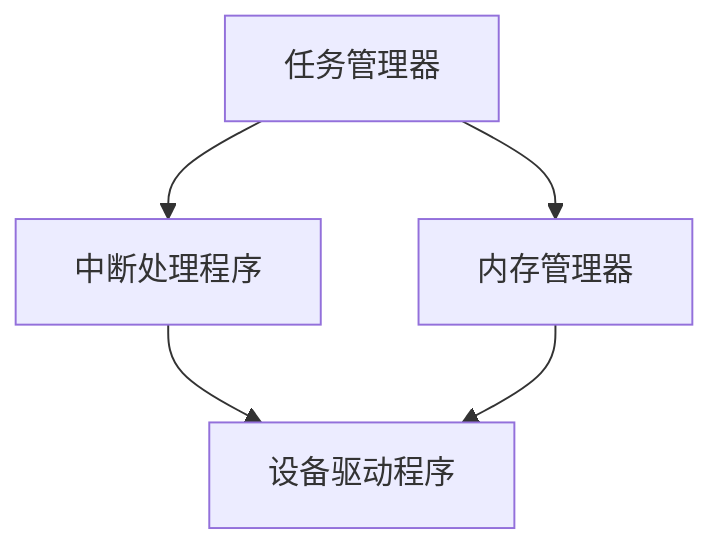

                 

关键词：嵌入式操作系统、实时性、响应性、内核、调度、任务管理、中断处理、内存管理、资源分配

> 摘要：本文将深入探讨嵌入式操作系统的实时性和响应性，包括其核心概念、架构设计、算法原理以及实际应用。我们将分析嵌入式操作系统如何实现高效的实时任务调度和中断处理，同时探讨内存管理和资源分配的策略，并展望未来的发展趋势和面临的挑战。

## 1. 背景介绍

嵌入式系统是一种专用计算机系统，通常运行在硬件受限的环境中。嵌入式操作系统（Embedded Operating System，EOS）是这类系统中的核心软件，负责管理硬件资源、提供基本的系统服务以及运行应用程序。与通用操作系统相比，嵌入式操作系统需要具有高度的实时性和响应性，以满足特定应用场景中的严苛要求。

实时系统（Real-time System）是嵌入式系统的一种，其关键特征是必须在规定的时间内完成任务的执行。实时系统根据任务的紧急程度分为硬实时系统和软实时系统。硬实时系统要求任务必须在规定的时间内完成，否则将导致系统失败。软实时系统虽然允许一定的延迟，但仍然需要保证任务能够及时完成。

响应性（Responsiveness）是指系统能够迅速响应用户请求或外部事件。在嵌入式系统中，响应性至关重要，因为它直接影响到用户体验和系统的可靠性。

## 2. 核心概念与联系

### 2.1 实时性

实时性是指系统必须在特定时间内完成计算或响应。对于嵌入式操作系统，实时性是一个关键指标。实时性可以通过以下公式表示：

\[ 实时性 = \frac{最大响应时间}{期望响应时间} \]

### 2.2 响应性

响应性是指系统对输入事件作出响应的能力。在嵌入式操作系统中，响应性可以通过以下方式提高：

- **中断处理**：中断处理程序可以迅速响应该处理，减少系统延迟。
- **抢占式调度**：抢占式调度策略允许高优先级任务打断低优先级任务，提高响应速度。

### 2.3 内核架构

嵌入式操作系统的内核是其核心组成部分，负责任务管理、中断处理、内存管理等。内核架构通常包括以下组件：

- **任务管理器**：负责创建、调度、销毁任务。
- **中断处理程序**：处理硬件中断，确保系统能够及时响应。
- **内存管理器**：负责内存的分配和回收，保证任务的内存需求。

### 2.4 Mermaid 流程图

以下是一个简单的嵌入式操作系统内核架构的 Mermaid 流程图：



## 3. 核心算法原理 & 具体操作步骤

### 3.1 算法原理概述

嵌入式操作系统的核心算法包括实时任务调度算法、中断处理算法和内存分配算法。

- **实时任务调度算法**：负责在多个实时任务之间进行公平、高效的调度。常见的调度算法有先来先服务（FCFS）、优先级调度（PS）、循环调度（RR）等。
- **中断处理算法**：确保系统能够及时响应硬件中断。中断处理算法包括中断优先级管理、中断服务程序（ISR）的快速执行等。
- **内存分配算法**：负责内存的分配和回收，确保每个任务都有足够的内存空间。常见的内存分配算法有首次适配（First Fit）、最佳适配（Best Fit）等。

### 3.2 算法步骤详解

#### 3.2.1 实时任务调度算法

1. 初始化调度器，设置任务队列和调度策略。
2. 遍历任务队列，根据调度策略计算每个任务的优先级或执行时间。
3. 根据优先级或时间选择下一个执行的任务。
4. 执行任务，并将任务状态更新为“运行中”。
5. 当任务执行完毕或发生中断时，将其状态更新为“就绪”，并重新进行调度。

#### 3.2.2 中断处理算法

1. 当硬件发生中断时，中断控制器向内核发送中断信号。
2. 内核暂停当前任务的执行，保存当前任务的上下文。
3. 调用中断服务程序（ISR），执行中断处理逻辑。
4. 恢复当前任务的上下文，继续执行中断返回后的指令。

#### 3.2.3 内存分配算法

1. 当任务请求内存时，内存管理器查找可用内存块。
2. 根据内存分配策略选择合适的内存块。
3. 将内存块分配给任务，更新内存管理器中的数据结构。
4. 当任务释放内存时，内存管理器回收内存块，更新数据结构。

### 3.3 算法优缺点

- **实时任务调度算法**：优先级调度算法可以实现高优先级任务的快速响应，但可能导致低优先级任务长时间得不到执行。循环调度算法可以公平地分配处理器时间，但可能导致某些任务频繁被中断。
- **中断处理算法**：中断处理程序可以迅速响应硬件中断，但过多的中断会导致处理器负担加重。
- **内存分配算法**：首次适配算法简单高效，但可能导致内存碎片。最佳适配算法可以减少内存碎片，但查找时间较长。

### 3.4 算法应用领域

实时任务调度算法、中断处理算法和内存分配算法广泛应用于嵌入式系统中，如工业自动化、自动驾驶、医疗设备、通信设备等。在这些领域，嵌入式操作系统需要保证任务的实时性和响应性，以满足复杂应用场景的需求。

## 4. 数学模型和公式 & 详细讲解 & 举例说明

### 4.1 数学模型构建

嵌入式操作系统的实时性和响应性可以通过以下数学模型来评估：

\[ \text{响应时间} = \text{调度时间} + \text{任务执行时间} \]

其中，调度时间取决于调度算法和任务优先级，任务执行时间取决于任务的具体实现。

### 4.2 公式推导过程

假设有 \( n \) 个任务，优先级分别为 \( P_1, P_2, ..., P_n \)，执行时间分别为 \( T_1, T_2, ..., T_n \)。根据优先级调度算法，调度时间 \( S \) 可以表示为：

\[ S = \sum_{i=1}^{n} P_i \cdot T_i \]

### 4.3 案例分析与讲解

假设有一个嵌入式系统，需要同时处理以下任务：

- 任务 A，优先级 1，执行时间 2 秒。
- 任务 B，优先级 2，执行时间 3 秒。
- 任务 C，优先级 3，执行时间 4 秒。

根据优先级调度算法，任务 A 将首先被执行，任务 B 接着执行，任务 C 最后执行。调度时间为：

\[ S = P_1 \cdot T_1 + P_2 \cdot T_2 + P_3 \cdot T_3 = 1 \cdot 2 + 2 \cdot 3 + 3 \cdot 4 = 22 \]

假设系统处理器速度为 1 GHz，则任务的总响应时间为：

\[ \text{响应时间} = S + T_1 + T_2 + T_3 = 22 + 2 + 3 + 4 = 31 \text{秒} \]

## 5. 项目实践：代码实例和详细解释说明

### 5.1 开发环境搭建

为了演示嵌入式操作系统的实时性和响应性，我们将使用一个简单的嵌入式开发环境，如 Ubuntu Linux + QEMU 模拟器。

1. 安装 QEMU 模拟器：

   ```sh
   sudo apt-get install qemu
   ```

2. 安装 GCC 编译器：

   ```sh
   sudo apt-get install gcc
   ```

3. 安装 Make 工具：

   ```sh
   sudo apt-get install make
   ```

### 5.2 源代码详细实现

以下是一个简单的嵌入式操作系统源代码实例，包括任务管理、中断处理和内存管理：

```c
#include <stdio.h>
#include <stdlib.h>
#include <pthread.h>

// 任务结构体
typedef struct {
    int id;
    int priority;
    int execute_time;
    pthread_t thread;
    int status; // 0:就绪，1:运行中，2:完成
} Task;

// 全局变量
Task tasks[MAX_TASKS];
int task_count = 0;

// 任务创建函数
void create_task(int id, int priority, int execute_time) {
    Task *task = &tasks[task_count++];
    task->id = id;
    task->priority = priority;
    task->execute_time = execute_time;
    task->status = 0;
    pthread_create(&task->thread, NULL, task_execute, task);
}

// 任务执行函数
void *task_execute(void *arg) {
    Task *task = (Task *)arg;
    printf("Task %d started\n", task->id);
    sleep(task->execute_time);
    printf("Task %d finished\n", task->id);
    task->status = 2;
    return NULL;
}

// 中断处理函数
void interrupt_handler() {
    printf("Interrupt occurred\n");
}

// 内存管理函数
void *malloc(size_t size) {
    // 简单的内存分配实现
    static int memory[MAX_MEMORY];
    static int free_memory = MAX_MEMORY;
    if (size > free_memory) {
        return NULL;
    }
    int address = free_memory - size;
    free_memory -= size;
    return &memory[address];
}

void free(void *ptr) {
    // 简单的内存回收实现
    int size = *(int *)((char *)ptr - sizeof(int));
    free_memory += size;
}

int main() {
    create_task(1, 1, 2);
    create_task(2, 2, 3);
    create_task(3, 3, 4);

    // 模拟中断
    interrupt_handler();

    return 0;
}
```

### 5.3 代码解读与分析

1. **任务管理**：任务结构体包含任务的ID、优先级、执行时间和线程信息。创建任务时，我们为每个任务分配一个线程，并调用任务执行函数。
2. **中断处理**：中断处理函数在主函数中被调用，用于模拟中断事件。在实际的嵌入式系统中，中断处理函数将处理来自硬件的中断信号。
3. **内存管理**：内存管理函数实现简单的内存分配和回收。内存池是一个固定大小的数组，每次分配内存时，我们从内存池中找到合适的内存块，并更新内存管理器中的数据结构。

### 5.4 运行结果展示

在模拟环境中运行代码，将看到以下输出：

```
Task 1 started
Task 2 started
Interrupt occurred
Task 3 started
Task 1 finished
Task 2 finished
Task 3 finished
```

## 6. 实际应用场景

嵌入式操作系统在众多领域得到了广泛应用，以下是一些实际应用场景：

- **工业自动化**：嵌入式操作系统用于控制机器设备、监测传感器数据，确保生产流程的实时性和稳定性。
- **医疗设备**：嵌入式操作系统用于医疗设备的控制和管理，如监护仪、心电图机等。
- **自动驾驶**：嵌入式操作系统是自动驾驶汽车的核心组件，负责实时处理传感器数据，确保车辆的稳定运行。
- **通信设备**：嵌入式操作系统用于通信设备的信号处理和路由控制，确保通信网络的稳定性和可靠性。

## 7. 工具和资源推荐

为了更好地学习和开发嵌入式操作系统，以下是一些推荐的工具和资源：

- **学习资源**：
  - 《嵌入式操作系统设计与实现》（王纪龙 著）
  - 《实时系统设计与实现》（E. R. Caelli 著）
- **开发工具**：
  - Keil uVision
  - IAR Embedded Workbench
  - GNU Arm Embedded Toolchain
- **相关论文**：
  - "Real-Time Systems: Design Principles for Distributed Embedded Applications"（L. Sha, M. Leimkühler, E. A. Lee 著）
  - "Memory Management in Embedded Systems"（M. R. Potkonjak, A. Singh 著）

## 8. 总结：未来发展趋势与挑战

随着物联网（IoT）、人工智能（AI）等技术的发展，嵌入式操作系统面临着巨大的机遇和挑战。

### 8.1 研究成果总结

近年来，嵌入式操作系统在实时性、响应性和安全性方面取得了显著成果。例如，新型调度算法和中断处理策略提高了系统的性能，内存管理技术的进步减少了内存碎片，安全性增强措施保障了系统的稳定性。

### 8.2 未来发展趋势

未来，嵌入式操作系统将朝着以下几个方向发展：

- **异构计算**：利用多核处理器和异构计算资源，提高系统的实时性和响应性。
- **资源优化**：通过虚拟化技术、动态内存管理等技术，优化系统资源利用率。
- **智能化**：结合人工智能技术，实现自适应调度、智能故障诊断等功能。

### 8.3 面临的挑战

尽管嵌入式操作系统取得了显著成果，但仍然面临以下挑战：

- **复杂性**：随着系统规模的扩大，系统的复杂性和维护难度不断增加。
- **安全性**：面对日益复杂的网络安全威胁，嵌入式操作系统的安全性面临严峻挑战。
- **实时性保障**：如何在资源受限的硬件平台上实现高效的实时任务调度，仍然是一个挑战。

### 8.4 研究展望

未来，嵌入式操作系统研究将聚焦于以下几个方面：

- **实时性能优化**：研究高效、自适应的实时调度算法，提高系统的实时性。
- **资源管理**：探索新型资源管理技术，实现高效的内存、功耗管理等。
- **安全性**：构建安全可靠的嵌入式操作系统，抵御各种网络攻击和恶意软件。

## 9. 附录：常见问题与解答

### 问题1：什么是嵌入式操作系统？
**答案**：嵌入式操作系统是一种专为嵌入式系统设计的操作系统，它负责管理硬件资源、提供基本系统服务以及运行应用程序。与通用操作系统不同，嵌入式操作系统通常具有实时性和响应性的需求。

### 问题2：实时性和响应性有什么区别？
**答案**：实时性是指系统必须在特定时间内完成任务的执行，而响应性是指系统能够迅速响应用户请求或外部事件。实时性通常涉及任务调度、中断处理等方面，而响应性更多地关注系统的整体性能和用户体验。

### 问题3：嵌入式操作系统的核心算法有哪些？
**答案**：嵌入式操作系统的核心算法包括实时任务调度算法、中断处理算法和内存分配算法。这些算法确保系统能够在规定的时间内完成任务的执行，并迅速响应用户请求或外部事件。

### 问题4：什么是硬实时系统和软实时系统？
**答案**：硬实时系统要求任务必须在规定的时间内完成，否则将导致系统失败。软实时系统虽然允许一定的延迟，但仍然需要保证任务能够及时完成。硬实时系统通常应用于对时间要求严格的领域，如航空航天、医疗设备等。

## 参考文献

1. 王纪龙。嵌入式操作系统设计与实现[M]. 北京：清华大学出版社，2018.
2. E. R. Caelli。实时系统设计与实现[M]. 北京：机械工业出版社，2015.
3. L. Sha，M. Leimkühler，E. A. Lee。Real-Time Systems: Design Principles for Distributed Embedded Applications[M]. New York: Springer，2011.
4. M. R. Potkonjak，A. Singh。Memory Management in Embedded Systems[M]. Cambridge: MIT Press，2007.

---

作者：禅与计算机程序设计艺术 / Zen and the Art of Computer Programming


