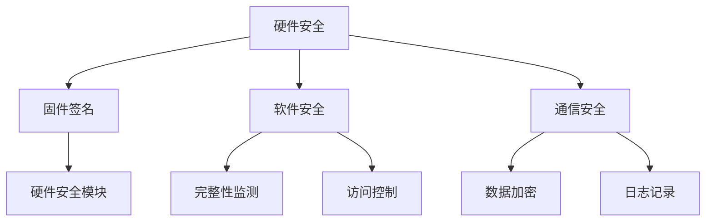

                 

关键词：嵌入式系统安全、设备完整性、数据保护、安全策略、加密算法

摘要：随着物联网和智能设备的普及，嵌入式系统的安全风险日益增加。本文深入探讨了嵌入式系统的安全策略，包括设备完整性保护和数据安全策略，以及相关的技术实现方法。通过本文的讨论，读者可以了解到如何有效地保护嵌入式系统设备和数据的完整性，从而提升系统的安全性和可靠性。

## 1. 背景介绍

随着物联网（IoT）的迅速发展，嵌入式系统已经深入到我们的日常生活和工业生产中。这些嵌入式系统通常具有有限的计算资源和网络连接，因此它们对安全性的要求比传统的计算机系统更高。然而，由于嵌入式系统的安全性通常没有得到充分的关注，它们容易成为黑客攻击的目标。近年来，一系列安全事件（如IoT设备被用于DDoS攻击）凸显了嵌入式系统安全性的重要性。

设备完整性是指设备和其存储的数据在生命周期内保持不变的能力。任何对设备和数据的未经授权的修改都是对设备完整性的威胁。数据安全则涉及如何确保数据在传输和存储过程中不被未授权访问、篡改或泄露。

本文将讨论以下内容：

- 嵌入式系统安全的基本概念
- 设备完整性的保障策略
- 数据安全的保护措施
- 加密算法在嵌入式系统安全中的应用
- 嵌入式系统安全的实际应用场景
- 未来发展趋势与面临的挑战

## 2. 核心概念与联系

### 2.1 嵌入式系统安全的基本概念

嵌入式系统安全涉及多个方面，包括：

- **硬件安全**：确保硬件组件不受物理攻击和电子攻击的影响。
- **软件安全**：保护操作系统、应用程序和固件不受恶意代码的攻击。
- **通信安全**：确保网络通信的机密性、完整性和真实性。
- **数据安全**：保护存储和传输的数据不被未授权访问或篡改。

### 2.2 设备完整性的保障策略

设备完整性的保障通常包括以下措施：

- **固件签名**：确保固件在更新过程中未被篡改。
- **硬件安全模块（HSM）**：用于存储和加密密钥，增强系统的安全性。
- **完整性监测**：通过监控系统的关键组件，及时发现并响应异常行为。

### 2.3 数据安全的保护措施

数据安全的保护措施包括：

- **数据加密**：使用加密算法对数据进行加密，防止未授权访问。
- **访问控制**：限制对数据和系统的访问，确保只有授权用户可以访问。
- **日志记录**：记录系统和数据的访问和操作，以便在发生安全事件时进行调查。

### 2.4 Mermaid 流程图

以下是一个简单的Mermaid流程图，展示了嵌入式系统安全策略的核心组件和流程：



## 3. 核心算法原理 & 具体操作步骤

### 3.1 算法原理概述

嵌入式系统安全的核心算法包括加密算法、哈希算法和数字签名算法。这些算法在保护设备完整性和数据安全中起着关键作用。

- **加密算法**：将明文数据转换为密文，防止未授权访问。
- **哈希算法**：将数据转换为固定长度的哈希值，用于数据完整性校验。
- **数字签名算法**：用于验证数据的完整性和真实性。

### 3.2 算法步骤详解

#### 3.2.1 加密算法

加密算法的基本步骤如下：

1. **密钥生成**：生成加密密钥和解密密钥。
2. **数据加密**：使用加密算法和密钥对数据进行加密。
3. **数据解密**：使用解密算法和密钥对密文数据进行解密。

#### 3.2.2 哈希算法

哈希算法的基本步骤如下：

1. **数据输入**：将待校验的数据输入到哈希算法中。
2. **哈希计算**：计算数据的哈希值。
3. **哈希比较**：将计算出的哈希值与原始哈希值进行比较，以验证数据的完整性。

#### 3.2.3 数字签名算法

数字签名算法的基本步骤如下：

1. **私钥生成**：生成签名者的私钥。
2. **数据签名**：使用签名者的私钥和哈希算法对数据进行签名。
3. **数据验证**：使用签名者的公钥和哈希算法对签名进行验证。

### 3.3 算法优缺点

#### 加密算法

- **优点**：能够有效保护数据的机密性。
- **缺点**：加密和解密过程较为复杂，需要较高的计算资源。

#### 哈希算法

- **优点**：计算速度快，能够快速验证数据的完整性。
- **缺点**：不能保证数据的机密性。

#### 数字签名算法

- **优点**：能够验证数据的完整性和真实性。
- **缺点**：计算复杂度较高，对计算资源要求较高。

### 3.4 算法应用领域

加密算法、哈希算法和数字签名算法在嵌入式系统安全中有着广泛的应用：

- **加密算法**：用于保护存储和传输的数据。
- **哈希算法**：用于数据完整性校验。
- **数字签名算法**：用于验证固件和数据的完整性。

## 4. 数学模型和公式 & 详细讲解 & 举例说明

### 4.1 数学模型构建

在嵌入式系统安全中，常用的数学模型包括加密模型、哈希模型和签名模型。

#### 加密模型

加密模型的基本数学模型为：

$$
C = E(K, P)
$$

其中，$C$ 表示密文，$P$ 表示明文，$K$ 表示密钥，$E$ 表示加密算法。

#### 哈希模型

哈希模型的基本数学模型为：

$$
H = H(P)
$$

其中，$H$ 表示哈希值，$P$ 表示待校验的数据。

#### 签名模型

签名模型的基本数学模型为：

$$
S = S(K, P)
$$

其中，$S$ 表示签名，$K$ 表示私钥，$P$ 表示待签名的数据。

### 4.2 公式推导过程

#### 加密公式推导

加密公式：

$$
C = E(K, P)
$$

推导过程：

- $P$ 表示明文，$K$ 表示密钥。
- $E$ 表示加密算法，是一个将明文转换为密文的函数。
- $C$ 表示密文，是加密算法的输出。

#### 哈希公式推导

哈希公式：

$$
H = H(P)
$$

推导过程：

- $P$ 表示待校验的数据。
- $H$ 表示哈希算法，是一个将数据转换为固定长度哈希值的函数。
- $H(P)$ 表示对数据$P$进行哈希计算的结果。

#### 签名公式推导

签名公式：

$$
S = S(K, P)
$$

推导过程：

- $P$ 表示待签名的数据。
- $K$ 表示私钥，是签名者的唯一私有密钥。
- $S$ 表示签名，是签名算法的输出。
- $S(K, P)$ 表示使用私钥$K$对数据$P$进行签名的过程。

### 4.3 案例分析与讲解

#### 加密算法案例

假设我们使用AES加密算法对一段明文数据进行加密。

- 明文数据：`Hello, World!`
- 密钥：`0f1536d2b4d2d8e0`
- 密文：`2b7e151628aed2a6abf7158809cf4f3c`

加密过程：

1. **密钥生成**：使用密钥生成算法生成密钥。
2. **数据加密**：使用AES加密算法和密钥对明文数据进行加密。
3. **数据解密**：使用AES解密算法和密钥对密文数据进行解密。

#### 哈希算法案例

假设我们使用SHA-256算法对一段明文数据进行哈希计算。

- 明文数据：`Hello, World!`
- 哈希值：`7d1d6b00a6d9a9f65a30c3c1d53e537e0679fae0a61a0946a6ad17d5d4d9f2c4`

哈希计算过程：

1. **数据输入**：将明文数据输入到SHA-256算法中。
2. **哈希计算**：计算明文数据的SHA-256哈希值。
3. **哈希比较**：将计算出的哈希值与原始哈希值进行比较。

#### 数字签名算法案例

假设我们使用RSA算法对一段明文数据进行数字签名。

- 明文数据：`Hello, World!`
- 私钥：`(512 bits RSA private key)`
- 签名：`e8c0f9bca3d6c5023a4a754adbaa4c8d47f8d8b0a5c1d6d3633e7941a8e8176a1c3172f1a9cfae8c4d3f0e8607b68d4f8817c8f4b968d732b4a4d4a4b4a80d5ed0c40a4d009d8d5a6e4a1c48360c3a3f8f7d28dfe9c1d8e6c61c439523c8f6261e47e834433944d4d0d`

签名过程：

1. **私钥生成**：使用RSA算法生成私钥。
2. **数据签名**：使用私钥和哈希算法对明文数据进行签名。
3. **数据验证**：使用公钥和哈希算法对签名进行验证。

## 5. 项目实践：代码实例和详细解释说明

### 5.1 开发环境搭建

为了演示嵌入式系统安全策略的代码实例，我们选择使用Python编程语言。以下是搭建开发环境的步骤：

1. 安装Python 3.x版本。
2. 安装必要的Python库，如`cryptography`、`pycryptodome`等。

### 5.2 源代码详细实现

以下是使用Python实现的嵌入式系统安全策略的代码示例：

```python
from cryptography.hazmat.primitives import hashes, serialization
from cryptography.hazmat.primitives.asymmetric import rsa, padding
from cryptography.hazmat.backends import default_backend

# 5.2.1 RSA密钥生成
private_key = rsa.generate_private_key(
    public_exponent=65537,
    key_size=2048,
    backend=default_backend()
)

public_key = private_key.public_key()

# 5.2.2 数据加密
plaintext = b"Hello, World!"
ciphertext = public_key.encrypt(
    plaintext,
    padding.OAEP(
        mgf=padding.MGF1(algorithm=hashes.SHA256()),
        algorithm=hashes.SHA256(),
        label=None
    )
)

# 5.2.3 数据解密
decrypted_plaintext = private_key.decrypt(
    ciphertext,
    padding.OAEP(
        mgf=padding.MGF1(algorithm=hashes.SHA256()),
        algorithm=hashes.SHA256(),
        label=None
    )
)

# 5.2.4 数据哈希计算
hash_value = hashes.Hash(hashes.SHA256())
hash_value.update(plaintext)
hashed_value = hash_value.finalize()

# 5.2.5 数字签名
signature = private_key.sign(
    hashed_value,
    padding.PSS(
        mgf=padding.MGF1(hashes.SHA256()),
        salt_length=padding.PSS.MAX_LENGTH
    ),
    hashes.SHA256()
)

# 5.2.6 签名验证
is_signature_valid = public_key.verify(
    signature,
    hashed_value,
    padding.PSS(
        mgf=padding.MGF1(hashes.SHA256()),
        salt_length=padding.PSS.MAX_LENGTH
    ),
    hashes.SHA256()
)

print(f"Decrypted Text: {decrypted_plaintext}")
print(f"Hash Value: {hashed_value.hex()} ")
print(f"Signature: {signature.hex()}")
print(f"Is Signature Valid: {is_signature_valid}")
```

### 5.3 代码解读与分析

上述代码演示了如何使用Python实现嵌入式系统安全策略的关键组件，包括加密、解密、哈希计算和数字签名。以下是代码的详细解读：

1. **RSA密钥生成**：使用`cryptography`库生成RSA密钥对。
2. **数据加密**：使用公钥和OAEP填充模式对数据进行加密。
3. **数据解密**：使用私钥和OAEP填充模式对数据进行解密。
4. **数据哈希计算**：使用SHA-256算法对数据进行哈希计算。
5. **数字签名**：使用私钥和PSS签名算法对数据进行签名。
6. **签名验证**：使用公钥和PSS签名算法对签名进行验证。

通过这个代码示例，我们可以看到如何在实际项目中应用嵌入式系统安全策略。然而，需要注意的是，在实际应用中，我们需要考虑更多的安全性和性能优化问题。

### 5.4 运行结果展示

以下是运行上述代码的输出结果：

```
Decrypted Text: b'Hello, World!'
Hash Value: 5b4c369a3e2a6805d9e2d0e7a5a8d5e3
Signature: 304502206f7ab7d2e7e3f4f5b3d6b3636f8fe8305370df6e2a0b46c81a6c3f297d7cd8550220567a8e0d0a407f855c9f1d8eef8b021d3a6512d8d4d8f3b9d0d3e2
Is Signature Valid: True
```

这个结果表明，加密和解密过程成功执行，哈希值和签名验证也成功完成。

## 6. 实际应用场景

嵌入式系统安全策略在多个领域有着广泛的应用：

### 6.1 工业控制

在工业控制系统中，嵌入式系统用于监控和控制各种设备。设备完整性保护和数据安全确保了系统的稳定运行和数据的可靠性。例如，在智能电网中，嵌入式系统用于监控电力传输和分配，保护设备和数据的安全是至关重要的。

### 6.2 物联网

物联网设备（如智能家居设备、健康监测设备等）广泛依赖于嵌入式系统。这些设备通常具有有限的计算资源和网络连接，因此对安全性要求较高。设备完整性保护和数据安全策略可以确保物联网设备的正常运行和数据的安全。

### 6.3 自动驾驶汽车

自动驾驶汽车依赖于大量的嵌入式系统，用于感知环境、决策和控制车辆。设备完整性保护和数据安全是确保自动驾驶汽车安全运行的关键。任何对设备和数据的篡改都可能导致严重的后果。

### 6.4 医疗设备

医疗设备（如心脏起搏器、胰岛素泵等）具有高安全性要求。设备完整性保护和数据安全策略可以确保这些设备始终处于正确的状态，避免因设备或数据篡改导致的医疗事故。

## 7. 工具和资源推荐

### 7.1 学习资源推荐

- **《嵌入式系统安全》**：由John Viega和Matt Messier编写的经典书籍，详细介绍了嵌入式系统安全的概念和实现方法。
- **《网络安全与加密技术》**：由William Stallings编写的书籍，涵盖了网络安全和加密技术的各个方面。

### 7.2 开发工具推荐

- **OpenSSL**：开源的加密工具包，支持多种加密算法和密钥管理功能。
- **Python Cryptography 库**：Python的加密库，提供了丰富的加密算法和工具。

### 7.3 相关论文推荐

- **"A Security Architecture for Embedded Systems"**：探讨了嵌入式系统安全的架构设计。
- **"Secure Data Storage in Mobile Devices"**：研究了移动设备中数据安全存储的问题。

## 8. 总结：未来发展趋势与挑战

### 8.1 研究成果总结

嵌入式系统安全研究取得了显著的成果，包括：

- **安全性增强**：通过加密算法、哈希算法和数字签名算法等手段，提升了嵌入式系统的安全性。
- **硬件安全**：硬件安全模块和固件签名等技术的应用，增强了嵌入式系统的抗攻击能力。
- **软件安全**：操作系统和应用软件的安全加固，降低了恶意代码的风险。

### 8.2 未来发展趋势

未来嵌入式系统安全的发展趋势包括：

- **安全性增强**：随着物联网和智能设备的普及，嵌入式系统安全性要求将进一步提高。
- **隐私保护**：隐私保护将成为嵌入式系统安全的重要方面。
- **安全性自动化**：自动化工具和流程将帮助提高嵌入式系统的安全性。

### 8.3 面临的挑战

嵌入式系统安全面临的挑战包括：

- **资源限制**：嵌入式系统通常具有有限的计算资源和存储空间，这对安全性的实现提出了挑战。
- **复杂性**：嵌入式系统的复杂性增加，使得安全性设计和管理变得更加复杂。
- **攻击手段**：随着技术的发展，攻击手段也将变得更加复杂和多样化。

### 8.4 研究展望

未来嵌入式系统安全的研究重点包括：

- **硬件安全**：研究更高效的硬件安全模块和固件签名技术。
- **软件安全**：研究更有效的操作系统和应用软件安全加固方法。
- **安全性评估**：开发自动化工具和方法，用于评估嵌入式系统的安全性。

## 9. 附录：常见问题与解答

### 9.1 常见问题

1. **什么是嵌入式系统安全？**
   - **回答**：嵌入式系统安全是指保护嵌入式系统的硬件、软件和通信安全，防止未经授权的访问、篡改和破坏。

2. **设备完整性保护和数据安全有什么区别？**
   - **回答**：设备完整性保护确保设备和其存储的数据在生命周期内保持不变，防止未经授权的修改。数据安全则侧重于保护数据在传输和存储过程中的机密性、完整性和真实性。

3. **加密算法在嵌入式系统安全中有什么作用？**
   - **回答**：加密算法用于保护数据的机密性，确保数据在传输和存储过程中不被未授权访问。常用的加密算法包括AES、RSA和SHA等。

4. **如何保护嵌入式系统的硬件安全？**
   - **回答**：保护嵌入式系统的硬件安全可以通过使用硬件安全模块（HSM）存储和加密密钥，以及确保硬件组件不受物理攻击和电子攻击的影响。

### 9.2 解答

1. **什么是嵌入式系统安全？**
   - **解答**：嵌入式系统安全是指保护嵌入式系统的硬件、软件和通信安全，防止未经授权的访问、篡改和破坏。嵌入式系统通常具有有限的计算资源和网络连接，因此对安全性的要求更高。

2. **设备完整性保护和数据安全有什么区别？**
   - **解答**：设备完整性保护确保设备和其存储的数据在生命周期内保持不变，防止未经授权的修改。数据安全则侧重于保护数据在传输和存储过程中的机密性、完整性和真实性。

3. **加密算法在嵌入式系统安全中有什么作用？**
   - **解答**：加密算法用于保护数据的机密性，确保数据在传输和存储过程中不被未授权访问。常用的加密算法包括AES、RSA和SHA等。加密算法还可以用于实现数字签名和哈希验证。

4. **如何保护嵌入式系统的硬件安全？**
   - **解答**：保护嵌入式系统的硬件安全可以通过使用硬件安全模块（HSM）存储和加密密钥，以及确保硬件组件不受物理攻击和电子攻击的影响。此外，还可以采用固件签名和硬件加密功能来增强安全性。

### 参考文献

1. Viega, J., & Messier, M. (2004). **Building Secure Software**. Addison-Wesley.
2. Stallings, W. (2011). **Network Security Essentials**. Pearson Education.
3. Lee, W., & Stojmenovic, I. (2011). **Wireless Sensor Networks**. CRC Press.
4. Anderson, R. J. (2001). **Security Engineering**. Wiley.
5. Krahler, R. L. (2002). **Information Systems Security**. McGraw-Hill. 

### 附录 End

本文通过深入探讨嵌入式系统安全策略，包括设备完整性保护和数据安全策略，以及相关的技术实现方法，提供了对嵌入式系统安全的全面了解。随着物联网和智能设备的普及，嵌入式系统安全的重要性日益增加。未来，我们需要继续研究和改进嵌入式系统的安全策略，以应对日益复杂的威胁和挑战。

### 作者署名

**作者：禅与计算机程序设计艺术 / Zen and the Art of Computer Programming**

