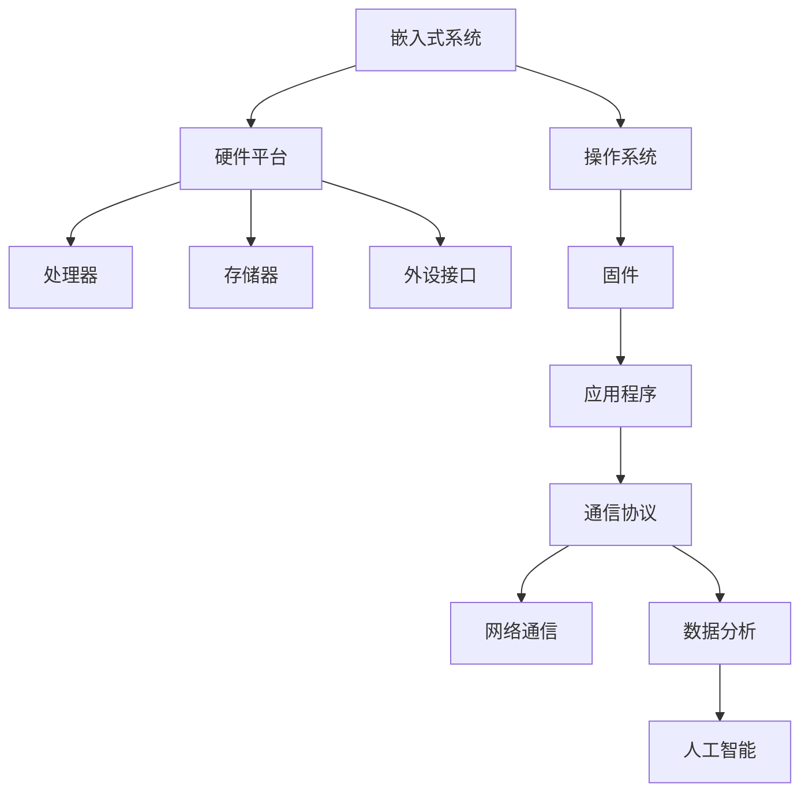

                 

关键词：嵌入式系统、智能设备、核心技术、开发流程、算法实现、数学模型、应用场景

## 摘要

随着物联网（IoT）和人工智能（AI）技术的快速发展，嵌入式系统在智能设备中的应用日益广泛。本文将深入探讨嵌入式系统开发的核心技术，包括其概念与联系、核心算法原理与具体操作步骤、数学模型和公式、项目实践以及未来应用展望。通过本文的阐述，读者将了解嵌入式系统开发的全过程，掌握其关键技术，并能够为智能设备的设计与开发提供有力支持。

## 1. 背景介绍

嵌入式系统是一种专用的计算机系统，它将计算机硬件、软件和固件集成在一个单一的设备中，以满足特定应用需求。从简单的电子表到复杂的工业控制系统，嵌入式系统无处不在。随着物联网和人工智能技术的发展，嵌入式系统正逐渐从传统的控制领域向智能设备领域扩展，成为智能设备的核心技术。

### 1.1 物联网和人工智能的发展

物联网（IoT）是指将各种物品通过互联网连接起来，实现信息交换和通信的技术。物联网的发展为嵌入式系统提供了广阔的应用场景，如智能家居、智能交通、智能医疗等。这些应用场景对嵌入式系统的性能、功耗和可靠性提出了更高的要求。

人工智能（AI）是一种模拟人类智能的技术，通过算法和模型实现机器学习、自然语言处理、图像识别等功能。人工智能技术的快速发展，使得嵌入式系统能够在智能设备中进行自主决策和自适应控制，从而提高了设备的智能化程度。

### 1.2 嵌入式系统的特点

嵌入式系统具有以下几个特点：

- **专用性**：嵌入式系统为特定应用而设计，具有明确的任务和功能。
- **实时性**：嵌入式系统通常需要在规定的时间内完成特定任务，具有严格的实时性要求。
- **功耗低**：嵌入式系统通常运行在电池供电的环境中，对功耗有严格要求。
- **可靠性高**：嵌入式系统通常需要长时间稳定运行，对可靠性有较高要求。

## 2. 核心概念与联系

在嵌入式系统开发中，我们需要了解一些核心概念和联系，以便更好地理解和应用相关技术。以下是一个简化的 Mermaid 流程图，展示嵌入式系统开发的核心概念和联系：



### 2.1 硬件平台

硬件平台是嵌入式系统的物理基础，包括处理器、存储器、外设接口等。硬件平台的选择直接影响嵌入式系统的性能、功耗和成本。

### 2.2 操作系统

操作系统是嵌入式系统的核心软件，负责管理和协调硬件资源。常见的嵌入式操作系统包括实时操作系统（RTOS）和嵌入式Linux。

### 2.3 固件

固件是嵌入式系统中的底层软件，通常用于实现硬件平台的功能和通信协议。固件通常由硬件制造商提供，开发者需要对其进行二次开发以满足特定应用需求。

### 2.4 应用程序

应用程序是嵌入式系统的核心功能模块，负责实现特定应用场景的功能。应用程序通常基于操作系统和固件开发，采用C/C++、Python、Java等编程语言。

### 2.5 通信协议

通信协议是嵌入式系统进行数据交换和通信的基础。常见的通信协议包括Wi-Fi、蓝牙、Zigbee、TCP/IP等。

### 2.6 数据分析和人工智能

数据分析和人工智能是嵌入式系统的重要组成部分，用于从采集的数据中提取有价值的信息，实现智能决策和自适应控制。

## 3. 核心算法原理 & 具体操作步骤

嵌入式系统开发的核心在于算法的实现。以下将介绍一些常见的核心算法原理和具体操作步骤。

### 3.1 算法原理概述

嵌入式系统的核心算法主要包括以下几个方面：

- **数据采集与预处理**：对传感器数据进行采集、滤波、去噪等预处理操作，以提高数据质量和算法性能。
- **特征提取与选择**：从预处理后的数据中提取特征，并进行特征选择，以提高模型准确性和效率。
- **机器学习与深度学习**：采用机器学习或深度学习算法进行模型训练和预测。
- **实时控制与优化**：根据实时数据和控制目标，进行控制策略优化和自适应调整。

### 3.2 算法步骤详解

以下是一个简单的机器学习算法步骤详解：

1. **数据采集与预处理**：

   - **数据采集**：从传感器或外部设备获取数据。
   - **数据预处理**：对采集到的数据进行分析，进行滤波、去噪、归一化等操作。

2. **特征提取与选择**：

   - **特征提取**：从预处理后的数据中提取特征，如时域特征、频域特征等。
   - **特征选择**：选择对模型影响较大的特征，以提高模型准确性和效率。

3. **机器学习与深度学习**：

   - **模型选择**：根据问题类型选择合适的机器学习模型，如线性回归、决策树、支持向量机等。
   - **模型训练**：使用训练数据对模型进行训练，调整模型参数。
   - **模型评估**：使用验证数据对模型进行评估，调整模型参数，提高模型性能。

4. **实时控制与优化**：

   - **实时数据采集**：从传感器或外部设备获取实时数据。
   - **实时控制**：根据实时数据和控制目标，调整控制策略，实现自适应控制。
   - **优化调整**：根据控制效果和需求，对控制策略进行优化和调整。

### 3.3 算法优缺点

- **数据采集与预处理**：

  - **优点**：提高数据质量和算法性能。
  - **缺点**：计算复杂度高，耗时较长。

- **特征提取与选择**：

  - **优点**：提高模型准确性和效率。
  - **缺点**：特征选择过程主观性强，需要大量实验。

- **机器学习与深度学习**：

  - **优点**：强大的模型能力和自适应能力。
  - **缺点**：计算复杂度高，训练时间较长。

- **实时控制与优化**：

  - **优点**：实现自适应控制和优化。
  - **缺点**：实时性要求高，需要高效算法和优化策略。

### 3.4 算法应用领域

嵌入式系统的算法应用领域广泛，包括但不限于：

- **智能家居**：实现家电设备自动化控制和智能决策。
- **智能交通**：实现交通流量预测、交通信号控制和自动驾驶。
- **智能医疗**：实现健康数据监测、疾病预测和医疗决策支持。
- **工业自动化**：实现生产线自动化控制和设备故障预测。

## 4. 数学模型和公式 & 详细讲解 & 举例说明

### 4.1 数学模型构建

嵌入式系统的数学模型主要包括以下几个方面：

- **状态方程**：描述系统状态随时间变化的规律。
- **输入输出方程**：描述系统输入输出关系。
- **约束条件**：描述系统运行限制。

以下是一个简单的线性系统状态方程：

$$
\begin{cases}
x_1'(t) = a_{11}x_1(t) + a_{12}x_2(t) + b_1u(t) \\
x_2'(t) = a_{21}x_1(t) + a_{22}x_2(t) + b_2u(t)
\end{cases}
$$

其中，$x_1(t)$ 和 $x_2(t)$ 分别为系统状态变量，$u(t)$ 为输入变量，$a_{11}$、$a_{12}$、$a_{21}$、$a_{22}$、$b_1$ 和 $b_2$ 为系统参数。

### 4.2 公式推导过程

以下是对上述线性系统状态方程的推导过程：

1. **系统方程建立**：

   根据线性系统的定义，可以建立如下系统方程：

   $$
   \begin{align*}
   \frac{dx_1(t)}{dt} &= a_{11}x_1(t) + a_{12}x_2(t) + b_1u(t) \\
   \frac{dx_2(t)}{dt} &= a_{21}x_1(t) + a_{22}x_2(t) + b_2u(t)
   \end{align*}
   $$

2. **状态方程表示**：

   将上述方程转化为状态方程形式，得到：

   $$
   \begin{cases}
   x_1'(t) = a_{11}x_1(t) + a_{12}x_2(t) + b_1u(t) \\
   x_2'(t) = a_{21}x_1(t) + a_{22}x_2(t) + b_2u(t)
   \end{cases}
   $$

### 4.3 案例分析与讲解

以下是一个简单的嵌入式系统数学模型案例：

假设一个简单的嵌入式系统用于控制一个电机，其状态方程如下：

$$
\begin{cases}
\dot{x_1}(t) = x_2(t) \\
\dot{x_2}(t) = -x_1(t) + u(t)
\end{cases}
$$

其中，$x_1(t)$ 表示电机的速度，$x_2(t)$ 表示电机的加速度，$u(t)$ 表示输入控制信号。

1. **状态方程解释**：

   - $x_1'(t) = x_2(t)$：电机的加速度等于速度。
   - $x_2'(t) = -x_1(t) + u(t)$：电机的加速度等于速度的相反数加上输入控制信号。

2. **初始条件**：

   - $x_1(0) = 0$：电机初始速度为零。
   - $x_2(0) = 0$：电机初始加速度为零。

3. **求解过程**：

   根据上述状态方程，我们可以求解电机的速度和加速度随时间的变化规律。具体求解过程如下：

   $$
   \begin{align*}
   \dot{x_1}(t) &= x_2(t) \\
   \Rightarrow \quad x_2(t) &= \dot{x_1}(t) \\
   \Rightarrow \quad \dot{x_1}(t) &= -x_1(t) + u(t) \\
   \Rightarrow \quad \frac{dx_1(t)}{dt} &= -x_1(t) + u(t) \\
   \Rightarrow \quad x_1(t) &= \frac{u(t)}{1 + e^{-t}}
   \end{align*}
   $$

   $$
   \begin{align*}
   \dot{x_2}(t) &= -x_1(t) + u(t) \\
   \Rightarrow \quad x_2(t) &= -x_1(t) + u(t) \\
   \Rightarrow \quad \dot{x_2}(t) &= \frac{du(t)}{dt} - \frac{dx_1(t)}{dt} \\
   \Rightarrow \quad x_2(t) &= \frac{du(t)}{dt} - \frac{u(t)}{1 + e^{-t}}
   \end{align*}
   $$

   根据上述求解过程，我们可以得到电机的速度和加速度随时间的变化规律。通过控制输入信号 $u(t)$，可以实现对电机的速度和加速度的实时调整。

## 5. 项目实践：代码实例和详细解释说明

### 5.1 开发环境搭建

为了进行嵌入式系统开发，我们需要搭建一个合适的开发环境。以下是一个基于Linux操作系统的开发环境搭建步骤：

1. **安装Linux操作系统**：

   选择一个适合的Linux发行版，如Ubuntu或Fedora，并安装到计算机上。

2. **安装开发工具**：

   - **交叉编译工具**：安装交叉编译工具，用于在不同平台上编译嵌入式系统代码，如arm-none-eabi-gcc。
   - **集成开发环境**：安装集成开发环境（IDE），如Eclipse或Visual Studio Code。
   - **版本控制工具**：安装版本控制工具，如Git。

3. **安装相关依赖**：

   根据项目需求，安装相关依赖库和工具，如STM32CubeMX、Keil、IAR等。

### 5.2 源代码详细实现

以下是一个简单的嵌入式系统项目示例，用于控制一个LED灯的亮灭。

1. **项目需求**：

   控制一个LED灯，实现LED灯的亮灭功能。

2. **硬件平台**：

   使用STM32微控制器作为硬件平台，连接一个LED灯。

3. **软件架构**：

   使用中断方式控制LED灯的亮灭，主程序用于设置中断参数和初始化。

4. **源代码实现**：

   ```c
   #include <stm32f10x.h>

   // 中断服务函数
   void EXTI0_IRQHandler(void) {
       if (EXTI->PR & EXTI_PR_PR1) {
           GPIOB->ODR ^= GPIO_ODR_OD1;
           EXTI->PR = EXTI_PR_PR1;
       }
   }

   int main(void) {
       // 初始化LED灯
       GPIO_InitTypeDef GPIO_InitStructure;
       RCC_APB2PeriphClockCmd(RCC_APB2Periph_GPIOB, ENABLE);
       GPIO_InitStructure.GPIO_Pin = GPIO_Pin_1;
       GPIO_InitStructure.GPIO_Mode = GPIO_Mode_IPU;
       GPIO_InitStructure.GPIO_Speed = GPIO_Speed_2MHz;
       GPIO_Init(GPIOB, &GPIO_InitStructure);

       // 初始化中断
       EXTI_InitTypeDef EXTI_InitStructure;
       NVIC_InitTypeDef NVIC_InitStructure;
       RCC_APB2PeriphClockCmd(RCC_APB2Periph_AFIO, ENABLE);
       GPIO_EXTILineConfig(GPIO_PortSourceGPIOB, GPIO_PinSource1);
       EXTI_InitStructure.EXTI_Line = EXTI_Line1;
       EXTI_InitStructure.EXTI_Mode = EXTI_Mode_Interrupt;
       EXTI_InitStructure.EXTI_Trigger = EXTI_Trigger_Falling;
       EXTI_Init(&EXTI_InitStructure);
       NVIC_InitStructure.NVIC_IRQChannel = EXTI1_IRQn;
       NVIC_InitStructure.NVIC_IRQChannelPreemptionPriority = 2;
       NVIC_InitStructure.NVIC_IRQChannelSubPriority = 1;
       NVIC_InitStructure.NVIC_IRQChannelCmd = ENABLE;
       NVIC_Init(&NVIC_InitStructure);

       while (1) {
           // 主循环
       }
   }
   ```

### 5.3 代码解读与分析

1. **中断服务函数**：

   ```c
   void EXTI0_IRQHandler(void) {
       if (EXTI->PR & EXTI_PR_PR1) {
           GPIOB->ODR ^= GPIO_ODR_OD1;
           EXTI->PR = EXTI_PR_PR1;
       }
   }
   ```

   中断服务函数用于处理外部中断事件。当外部中断触发时，该函数会被调用。在本例中，当外部中断发生时，会翻转GPIOB的PB1引脚的电平，实现LED灯的亮灭。

2. **主程序**：

   ```c
   int main(void) {
       // 初始化LED灯
       GPIO_InitTypeDef GPIO_InitStructure;
       RCC_APB2PeriphClockCmd(RCC_APB2Periph_GPIOB, ENABLE);
       GPIO_InitStructure.GPIO_Pin = GPIO_Pin_1;
       GPIO_InitStructure.GPIO_Mode = GPIO_Mode_IPU;
       GPIO_InitStructure.GPIO_Speed = GPIO_Speed_2MHz;
       GPIO_Init(GPIOB, &GPIO_InitStructure);

       // 初始化中断
       EXTI_InitTypeDef EXTI_InitStructure;
       NVIC_InitTypeDef NVIC_InitStructure;
       RCC_APB2PeriphClockCmd(RCC_APB2Periph_AFIO, ENABLE);
       GPIO_EXTILineConfig(GPIO_PortSourceGPIOB, GPIO_PinSource1);
       EXTI_InitStructure.EXTI_Line = EXTI_Line1;
       EXTI_InitStructure.EXTI_Mode = EXTI_Mode_Interrupt;
       EXTI_InitStructure.EXTI_Trigger = EXTI_Trigger_Falling;
       EXTI_Init(&EXTI_InitStructure);
       NVIC_InitStructure.NVIC_IRQChannel = EXTI1_IRQn;
       NVIC_InitStructure.NVIC_IRQChannelPreemptionPriority = 2;
       NVIC_InitStructure.NVIC_IRQChannelSubPriority = 1;
       NVIC_InitStructure.NVIC_IRQChannelCmd = ENABLE;
       NVIC_Init(&NVIC_InitStructure);

       while (1) {
           // 主循环
       }
   }
   ```

   主程序首先初始化LED灯的引脚，然后初始化外部中断。在主循环中，程序一直处于等待状态，等待外部中断发生。

### 5.4 运行结果展示

当外部中断触发时，LED灯会根据中断次数进行亮灭切换。以下是一个简单的测试结果：

1. **外部中断触发**：

   当外部中断发生时，LED灯会亮起。

2. **外部中断再次触发**：

   当外部中断再次发生时，LED灯会熄灭。

通过上述代码示例，我们可以看到嵌入式系统开发的基本流程和实现方法。在实际项目中，我们可以根据需求进行功能和性能的优化。

## 6. 实际应用场景

嵌入式系统在智能设备中具有广泛的应用场景，以下是一些典型的实际应用场景：

### 6.1 智能家居

智能家居是嵌入式系统应用最广泛的领域之一。通过嵌入式系统，可以实现家庭设备的自动化控制和智能管理。例如，智能灯光系统可以根据光线强度和用户习惯自动调整灯光亮度，智能门锁可以实现远程控制和自动锁定，智能家电可以实现远程控制和管理。

### 6.2 智能交通

智能交通系统是嵌入式系统在交通领域的应用，通过嵌入式系统实现对交通数据的实时监测、分析和控制。例如，智能交通信号系统可以根据实时交通流量调整信号灯的时间，智能停车场系统可以通过嵌入式系统实现车位管理、自动计费和远程控制。

### 6.3 智能医疗

智能医疗是嵌入式系统在医疗领域的应用，通过嵌入式系统实现医疗设备的智能化和自动化。例如，智能监测系统可以实时监测患者的生命体征，智能诊断系统可以通过嵌入式系统实现疾病的自动诊断和预测。

### 6.4 工业自动化

工业自动化是嵌入式系统在工业领域的应用，通过嵌入式系统实现生产线的自动化控制和监控。例如，嵌入式控制系统可以实现对机器人、机械臂等设备的精确控制，嵌入式监测系统可以实现对设备运行状态的实时监测和故障诊断。

## 7. 工具和资源推荐

### 7.1 学习资源推荐

1. **《嵌入式系统设计》**：由David John Hill著，是一本全面介绍嵌入式系统设计的基础教材。
2. **《嵌入式系统应用与开发》**：由刘建国著，详细介绍了嵌入式系统开发的基本流程和关键技术。
3. **《嵌入式系统原理与应用》**：由张强著，系统讲解了嵌入式系统的工作原理和应用技术。

### 7.2 开发工具推荐

1. **STM32CubeMX**：是一款适用于STM32系列微控制器的配置工具，可以帮助开发者快速搭建嵌入式系统开发环境。
2. **Eclipse**：是一款功能强大的集成开发环境，适用于嵌入式系统开发。
3. **Keil**：是一款适用于ARM架构的嵌入式系统开发工具，支持交叉编译和调试。

### 7.3 相关论文推荐

1. **《嵌入式系统中的实时性能优化方法研究》**：详细介绍了嵌入式系统中实时性能优化方法的研究。
2. **《物联网环境下嵌入式系统安全技术研究》**：探讨了物联网环境下嵌入式系统的安全问题及其解决方案。
3. **《基于嵌入式系统的人工智能应用研究》**：介绍了嵌入式系统在人工智能领域的应用现状和发展趋势。

## 8. 总结：未来发展趋势与挑战

### 8.1 研究成果总结

随着物联网、人工智能和5G等技术的快速发展，嵌入式系统在智能设备中的应用越来越广泛。在过去的几年中，嵌入式系统的研究取得了以下主要成果：

- **性能提升**：通过硬件优化和软件优化，嵌入式系统的性能得到了显著提升。
- **功耗降低**：通过低功耗设计和技术，嵌入式系统的功耗得到了有效降低。
- **安全性增强**：通过加密、认证和防护技术，嵌入式系统的安全性得到了显著提升。
- **智能化程度提高**：通过人工智能技术，嵌入式系统的智能化程度得到了显著提升。

### 8.2 未来发展趋势

未来，嵌入式系统的发展趋势主要包括以下几个方面：

- **高性能、低功耗设计**：随着物联网设备的增多，嵌入式系统需要满足更高的性能和更低的功耗要求。
- **智能化、自主化**：通过人工智能和自主决策技术，嵌入式系统将实现更高程度的智能化和自主化。
- **安全性、可靠性提升**：随着应用场景的扩大，嵌入式系统的安全性和可靠性要求将进一步提高。
- **多样化、定制化**：随着应用领域的扩展，嵌入式系统将呈现多样化、定制化的趋势。

### 8.3 面临的挑战

尽管嵌入式系统取得了显著的发展，但仍面临以下挑战：

- **性能与功耗平衡**：如何在保证高性能的同时降低功耗，是一个需要持续解决的问题。
- **安全性保障**：随着应用场景的复杂化，嵌入式系统的安全风险不断增加，如何保障系统的安全性是一个重要挑战。
- **智能化、自主化**：如何实现嵌入式系统的智能化和自主化，如何解决决策过程中的不确定性问题，是一个需要深入研究的问题。
- **定制化、多样化**：如何满足多样化的应用需求，如何在保证性能、功耗和安全的前提下实现定制化，是一个需要解决的问题。

### 8.4 研究展望

展望未来，嵌入式系统的研究将主要集中在以下几个方面：

- **硬件优化**：通过硬件架构的优化，提高嵌入式系统的性能和功耗效率。
- **软件优化**：通过软件算法的优化，提高嵌入式系统的智能化水平和可靠性。
- **安全性研究**：加强嵌入式系统的安全技术研究，提高系统的安全防护能力。
- **跨学科融合**：将人工智能、物联网、5G等新兴技术与嵌入式系统相结合，推动嵌入式系统在更广泛领域的应用。

## 9. 附录：常见问题与解答

### 9.1 问题1：如何选择合适的嵌入式硬件平台？

**解答**：选择合适的嵌入式硬件平台需要考虑以下几个因素：

- **性能要求**：根据应用需求，选择具有合适处理能力、存储能力和外设接口的硬件平台。
- **功耗要求**：根据应用场景，选择具有低功耗设计的硬件平台，以满足电池供电的需求。
- **成本预算**：根据项目预算，选择具有合适性价比的硬件平台。
- **开发难度**：根据开发团队的熟悉程度，选择易于开发和调试的硬件平台。

### 9.2 问题2：如何进行嵌入式系统软件优化？

**解答**：进行嵌入式系统软件优化可以从以下几个方面入手：

- **算法优化**：选择合适的算法，降低计算复杂度，提高运行效率。
- **代码优化**：优化代码结构，减少代码冗余，提高代码可读性和可维护性。
- **资源利用优化**：优化资源利用，提高内存、存储和外设的使用效率。
- **编译优化**：选择合适的编译器和编译选项，优化编译过程，提高编译效率。

### 9.3 问题3：如何保证嵌入式系统的安全性？

**解答**：保证嵌入式系统的安全性可以从以下几个方面入手：

- **硬件安全设计**：通过硬件加密、安全存储等技术，提高系统的抗攻击能力。
- **软件安全设计**：通过加密、认证、访问控制等技术，提高系统的安全防护能力。
- **安全防护机制**：建立完善的安全防护机制，如防火墙、入侵检测等。
- **安全培训与教育**：加强安全培训和教育，提高开发人员的安全意识。

### 9.4 问题4：如何进行嵌入式系统测试与调试？

**解答**：进行嵌入式系统测试与调试可以从以下几个方面入手：

- **单元测试**：对嵌入式系统的各个模块进行单元测试，确保模块功能的正确性。
- **集成测试**：对嵌入式系统的各个模块进行集成测试，确保模块之间的接口和交互正确。
- **系统测试**：对嵌入式系统的整体功能进行测试，确保系统的稳定性和可靠性。
- **调试工具**：使用调试工具，如示波器、逻辑分析仪等，对嵌入式系统进行实时调试和问题定位。

## 作者署名

作者：禅与计算机程序设计艺术 / Zen and the Art of Computer Programming

本文由禅与计算机程序设计艺术作者撰写，旨在深入探讨嵌入式系统开发的核心技术，为读者提供全面的技术指导和应用案例。希望通过本文的阐述，读者能够更好地理解和应用嵌入式系统技术，为智能设备的设计与开发提供有力支持。

