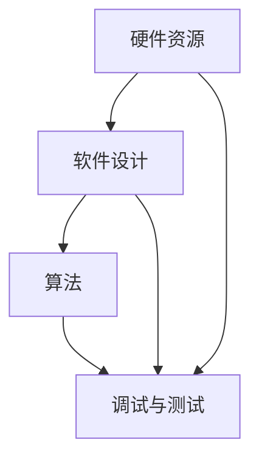

                 

关键字：嵌入式系统，性能优化，效率提升，算法优化，资源管理，实时性

> 摘要：本文将深入探讨嵌入式系统性能优化的关键要素，包括核心算法、数学模型、项目实践以及未来应用展望。通过分析性能优化的各种方法和实践，旨在为嵌入式系统开发者提供一套实用有效的性能优化策略，从而提高系统整体效率。

## 1. 背景介绍

嵌入式系统是一种专用的计算机系统，它嵌入在其他设备中，负责控制设备的工作。从工业自动化、医疗设备到智能家居，嵌入式系统无处不在。随着技术的发展，嵌入式系统的功能和复杂性不断增加，这同时也带来了性能优化的挑战。性能优化不仅是提高系统运行速度，还包括减少资源消耗、提高稳定性和可靠性。

性能优化在嵌入式系统开发中的重要性不言而喻。首先，高效的性能可以显著提升用户体验。其次，对于资源有限的嵌入式设备，优化性能意味着更合理地利用硬件资源，延长设备寿命。此外，优化性能有助于降低系统故障率，提高系统的稳定性和可靠性。

本文将围绕以下主题进行讨论：

1. 核心概念与联系
2. 核心算法原理与具体操作步骤
3. 数学模型与公式
4. 项目实践：代码实例与详细解释
5. 实际应用场景
6. 工具和资源推荐
7. 总结：未来发展趋势与挑战

通过本文的探讨，希望能够为嵌入式系统开发者提供一些实用的性能优化技巧和策略。

## 2. 核心概念与联系

在深入探讨性能优化的具体方法之前，我们需要先了解一些核心概念和它们之间的联系。以下是几个关键概念以及它们在嵌入式系统性能优化中的作用。

### 硬件资源

硬件资源是嵌入式系统性能优化的基础。不同的硬件配置对系统的性能有着直接影响。例如，处理器速度、内存大小、存储设备速度等都会影响系统的运行效率。优化硬件资源的使用，可以通过选择更高效的硬件组件、合理分配硬件资源等方式实现。

### 软件设计

软件设计是性能优化的另一个关键因素。合理的设计可以减少不必要的计算和资源消耗，提高系统的整体效率。例如，模块化设计、并行处理、事件驱动等设计模式都可以有效地提升系统性能。

### 算法

算法是性能优化的重要组成部分。高效的算法可以在保证功能完整性的同时，显著提升系统的运行速度和效率。常见的算法优化方法包括：算法改进、算法并行化、算法复杂度分析等。

### 调试与测试

调试与测试是性能优化的必要环节。通过有效的调试和测试，可以发现系统中的性能瓶颈，并进行针对性的优化。常见的调试与测试方法包括：性能测试、内存泄漏检测、代码审查等。

### Mermaid 流程图

为了更好地理解这些概念之间的联系，我们可以使用 Mermaid 流程图来表示它们之间的关系：



通过这个流程图，我们可以清晰地看到硬件资源、软件设计、算法和调试与测试之间的相互作用。硬件资源作为基础，直接影响软件设计和算法的选择，而调试与测试则在整个过程中起到监控和调整的作用。

### 2.1 核心概念详细解释

#### 硬件资源

硬件资源是嵌入式系统的基础。高性能的硬件组件可以提高系统的运行速度，而合理的硬件资源分配则可以最大化系统性能。例如，在嵌入式系统中，选择一个高速处理器和足够的内存可以显著提高系统的响应速度和处理能力。此外，存储设备的选择也会影响系统的性能。SSD比传统HDD具有更快的读写速度，适用于对速度要求较高的应用场景。

#### 软件设计

软件设计在性能优化中起着至关重要的作用。良好的软件设计可以减少不必要的计算和资源消耗。模块化设计可以将复杂的系统分解成多个模块，每个模块负责特定的功能。这种方式不仅可以提高代码的可维护性，还可以通过并行处理等方式提高系统的运行效率。事件驱动设计则可以优化系统的响应时间，提高实时性。

#### 算法

算法是嵌入式系统性能优化的核心。选择合适的算法可以显著提高系统的运行速度和效率。例如，在图像处理应用中，选择快速傅里叶变换（FFT）可以比传统的卷积运算更快地处理图像数据。此外，算法的并行化也是提高性能的重要手段。通过将算法分解成多个子任务，并行处理可以大大提高系统的运行效率。

#### 调试与测试

调试与测试是性能优化的必要环节。通过性能测试，可以发现系统的性能瓶颈，并进行针对性的优化。例如，通过分析系统的CPU使用率和内存占用情况，可以发现哪些模块或函数对性能影响最大。内存泄漏检测可以帮助发现系统中的内存泄露问题，防止系统因资源耗尽而崩溃。代码审查则可以确保代码的质量和性能，减少性能瓶颈的出现。

## 3. 核心算法原理与具体操作步骤

在嵌入式系统性能优化中，核心算法的选择和优化是关键步骤。以下是几个常用的核心算法原理及其具体操作步骤。

### 3.1 算法原理概述

#### 快速傅里叶变换（FFT）

快速傅里叶变换（FFT）是一种高效的算法，用于将信号从时域转换到频域。FFT通过分治策略将原始信号分解成多个子信号，然后对每个子信号进行傅里叶变换，最终组合得到原始信号的频域表示。FFT相比传统的傅里叶变换（FT）具有更高的计算效率，适用于需要实时处理的信号处理应用。

#### 动态规划（Dynamic Programming）

动态规划是一种用于解决最优化问题的算法。它通过将问题分解成多个子问题，并存储子问题的解，从而避免重复计算，提高计算效率。动态规划适用于具有重叠子问题和最优子结构性质的问题，如背包问题、最长公共子序列等。

#### 优先队列（Priority Queue）

优先队列是一种数据结构，用于存储具有优先级的数据。在嵌入式系统中，优先队列常用于任务调度，根据任务的优先级进行调度，确保高优先级任务先执行。优先队列的实现可以基于堆（Heap）或二叉搜索树（Binary Search Tree）等数据结构。

### 3.2 算法步骤详解

#### 快速傅里叶变换（FFT）

FFT的具体步骤如下：

1. 将输入信号分解成多个子信号，每个子信号的长度为2的幂次。
2. 对每个子信号进行蝶形变换，将子信号从时域转换到频域。
3. 递归地重复上述步骤，直到所有子信号的长度为1。
4. 将所有子信号的频域表示组合成原始信号的频域表示。

#### 动态规划（Dynamic Programming）

动态规划的具体步骤如下：

1. 定义状态和状态转移方程。
2. 根据状态转移方程初始化动态规划表。
3. 从状态空间的边界开始，递推计算每个状态的值。
4. 根据动态规划表的值，得到问题的最优解。

#### 优先队列（Priority Queue）

优先队列的具体步骤如下：

1. 初始化一个空优先队列。
2. 向优先队列中插入任务，每个任务包含任务的优先级和执行时间。
3. 根据任务的优先级，从优先队列中提取任务并执行。
4. 如果任务执行时间超过优先级时间窗口，则将该任务重新插入优先队列。

### 3.3 算法优缺点

#### 快速傅里叶变换（FFT）

**优点：**

- 计算效率高，适用于需要实时处理的信号处理应用。
- 可以处理任意长度的信号，适用于各种应用场景。

**缺点：**

- 对信号长度有要求，必须是2的幂次。
- 需要大量的内存空间来存储中间结果。

#### 动态规划（Dynamic Programming）

**优点：**

- 避免了重复计算，提高了计算效率。
- 可以解决最优化问题，得到最优解。

**缺点：**

- 需要定义状态和状态转移方程，对问题有一定的要求。
- 对于大规模问题，计算时间和空间需求可能较高。

#### 优先队列（Priority Queue）

**优点：**

- 调度效率高，可以根据任务的优先级进行调度。
- 实现简单，适用于简单的任务调度场景。

**缺点：**

- 对于复杂的任务调度场景，可能需要额外的数据结构和算法支持。
- 需要处理任务之间的依赖关系，增加了调度的复杂性。

### 3.4 算法应用领域

#### 快速傅里叶变换（FFT）

FFT广泛应用于信号处理领域，如音频处理、图像处理、通信系统等。尤其在实时信号处理应用中，FFT的高效性使其成为首选算法。

#### 动态规划（Dynamic Programming）

动态规划适用于解决最优化问题，如背包问题、路径规划、文本编辑等。在嵌入式系统中，动态规划可以用于资源分配、调度优化等场景。

#### 优先队列（Priority Queue）

优先队列常用于任务调度和优先级队列的应用场景，如实时操作系统、网络协议等。在嵌入式系统中，优先队列可以提高系统的响应速度和任务调度效率。

### 3.5 算法总结

核心算法在嵌入式系统性能优化中起着至关重要的作用。快速傅里叶变换（FFT）提供了高效的信号处理能力，动态规划（Dynamic Programming）用于解决最优化问题，优先队列（Priority Queue）则提高了任务调度的效率。通过合理选择和优化这些算法，可以显著提升嵌入式系统的性能。

## 4. 数学模型和公式 & 详细讲解 & 举例说明

在嵌入式系统性能优化中，数学模型和公式扮演着至关重要的角色。它们不仅帮助我们理解系统的工作原理，还为性能分析和优化提供了理论基础。以下是几个常用的数学模型和公式的详细讲解和举例说明。

### 4.1 数学模型构建

数学模型构建是性能优化的第一步。它涉及到对系统行为的抽象和描述，以便我们能通过数学方法来分析和优化。以下是一个简单的数学模型构建示例：

#### 系统响应时间模型

系统响应时间（\( T \)）可以表示为输入数据量（\( D \)）、处理速度（\( P \)）和排队时间（\( Q \））的函数：

\[ T = D/P + Q \]

其中，\( D \) 表示输入数据量，\( P \) 表示处理速度，\( Q \) 表示排队时间。这个模型可以帮助我们分析系统在高负载下的性能。

### 4.2 公式推导过程

公式的推导过程是数学模型构建的核心。以下是快速傅里叶变换（FFT）的公式推导过程：

#### 快速傅里叶变换公式

假设 \( x[n] \) 是一个长度为 \( N \) 的离散时间序列，其快速傅里叶变换（FFT）定义为：

\[ X[k] = \sum_{n=0}^{N-1} x[n] \cdot e^{-i2\pi kn/N} \]

其中，\( X[k] \) 是频域序列，\( k \) 是频率索引，\( n \) 是时间索引。

#### 推导过程

1. **定义**：首先，我们定义离散时间序列 \( x[n] \) 和其频域序列 \( X[k] \)。

2. **展开**：将 \( x[n] \) 展开成指数形式。

\[ x[n] = \sum_{m=0}^{N-1} a_m \cdot e^{im\theta} \]

其中，\( a_m \) 是 \( x[n] \) 的傅里叶级数系数，\( \theta = 2\pi / N \)。

3. **代入**：将 \( x[n] \) 的展开式代入 \( X[k] \) 的定义中。

\[ X[k] = \sum_{n=0}^{N-1} \left( \sum_{m=0}^{N-1} a_m \cdot e^{im\theta} \right) \cdot e^{-ik\theta} \]

4. **交换求和顺序**：交换求和顺序，得到

\[ X[k] = \sum_{m=0}^{N-1} a_m \cdot \left( \sum_{n=0}^{N-1} e^{i(m-k)\theta} \right) \]

5. **利用几何级数求和公式**：利用几何级数求和公式 \( \sum_{n=0}^{N-1} r^n = \frac{1 - r^N}{1 - r} \)，其中 \( r = e^{i\theta} \)，得到

\[ X[k] = \sum_{m=0}^{N-1} a_m \cdot \frac{1 - e^{i(m-k)N\theta}}{1 - e^{i\theta}} \]

6. **简化**：进一步简化公式，得到

\[ X[k] = \sum_{m=0}^{N-1} a_m \cdot \left( \cos((m-k)N\theta) - i\sin((m-k)N\theta) \right) \]

7. **欧拉公式**：使用欧拉公式 \( e^{i\theta} = \cos(\theta) + i\sin(\theta) \)，将结果转换为三角函数形式：

\[ X[k] = \sum_{m=0}^{N-1} a_m \cdot e^{-i(m-k)\theta} \]

这便是快速傅里叶变换（FFT）的公式。

### 4.3 案例分析与讲解

为了更好地理解上述数学模型和公式，我们来看一个简单的例子。

#### 案例背景

假设我们有一个长度为8的离散时间序列 \( x[n] \)，其值如下：

\[ x[n] = \begin{cases} 
1, & \text{if } n = 0 \\
0, & \text{otherwise} 
\end{cases} \]

我们需要对这个序列进行快速傅里叶变换（FFT）。

#### 解题步骤

1. **计算傅里叶级数系数**：首先，我们需要计算 \( x[n] \) 的傅里叶级数系数 \( a_m \)。

\[ a_m = \sum_{n=0}^{7} x[n] \cdot e^{-im\theta} \]

由于 \( x[n] \) 是实数序列，其傅里叶级数系数 \( a_m \) 和 \( a_{N-m} \) 相等，即 \( a_7 = a_1 \)。

2. **计算 \( e^{-im\theta} \)**：计算 \( e^{-im\theta} \) 的值，其中 \( \theta = 2\pi / 8 = \pi / 4 \)。

\[ e^{-im\theta} = e^{-i\pi m/4} \]

3. **代入公式**：将 \( e^{-im\theta} \) 的值代入 FFT 公式：

\[ X[k] = \sum_{m=0}^{7} a_m \cdot e^{-ik\theta} \]

由于 \( a_0 = 8 \)（序列长度除以2），\( a_1 = 1 \)，其余 \( a_m = 0 \)，我们可以得到

\[ X[k] = 8 \cdot e^{-ik\pi/4} \]

4. **简化结果**：使用欧拉公式，我们可以将 \( e^{-ik\pi/4} \) 简化为

\[ e^{-ik\pi/4} = \cos(k\pi/4) - i\sin(k\pi/4) \]

因此，

\[ X[k] = 8 \cdot (\cos(k\pi/4) - i\sin(k\pi/4)) \]

5. **计算具体值**：对于 \( k = 0, 1, ..., 7 \)，我们可以计算出 \( X[k] \) 的具体值。

\[ X[0] = 8 \cdot (1 - i0) = 8 \]
\[ X[1] = 8 \cdot (\cos(\pi/4) - i\sin(\pi/4)) = 8 \cdot (\frac{\sqrt{2}}{2} - i\frac{\sqrt{2}}{2}) = 4\sqrt{2} - 4i\sqrt{2} \]
\[ X[2] = 8 \cdot (\cos(2\pi/4) - i\sin(2\pi/4)) = 8 \cdot (0 - i1) = -8i \]
\[ X[3] = 8 \cdot (\cos(3\pi/4) - i\sin(3\pi/4)) = 8 \cdot (-\frac{\sqrt{2}}{2} - i\frac{\sqrt{2}}{2}) = -4\sqrt{2} - 4i\sqrt{2} \]
\[ X[4] = 8 \cdot (\cos(4\pi/4) - i\sin(4\pi/4)) = 8 \cdot (-1 - i0) = -8 \]
\[ X[5] = 8 \cdot (\cos(5\pi/4) - i\sin(5\pi/4)) = 8 \cdot (-\frac{\sqrt{2}}{2} + i\frac{\sqrt{2}}{2}) = -4\sqrt{2} + 4i\sqrt{2} \]
\[ X[6] = 8 \cdot (\cos(6\pi/4) - i\sin(6\pi/4)) = 8 \cdot (0 + i1) = 8i \]
\[ X[7] = 8 \cdot (\cos(7\pi/4) - i\sin(7\pi/4)) = 8 \cdot (\frac{\sqrt{2}}{2} + i\frac{\sqrt{2}}{2}) = 4\sqrt{2} + 4i\sqrt{2} \]

#### 结果分析

从这个例子中，我们可以看到 \( X[0] \) 是原始序列的直流分量，即 \( x[n] \) 的平均值。而 \( X[1], X[2], ..., X[7] \) 是原始序列的频率分量。由于 \( x[n] \) 只有一个非零值，即 \( n = 0 \)，其频率分量为零，除了 \( X[0] \) 以外，其他 \( X[k] \) 的值都为零。

这个例子展示了如何使用 FFT 公式对离散时间序列进行变换，并分析了变换结果。通过数学模型和公式，我们可以更好地理解系统的工作原理，从而进行有效的性能优化。

### 4.4 数学模型在性能优化中的应用

数学模型在性能优化中的应用非常广泛。以下是一些实际应用场景：

#### 系统响应时间优化

使用系统响应时间模型，可以分析系统在高负载下的性能。通过调整输入数据量、处理速度和排队时间，可以优化系统的响应时间。例如，在实时系统中，可以通过增加处理速度或减少排队时间来提高系统的响应速度。

#### 资源利用率优化

数学模型可以帮助我们分析系统的资源利用率。通过优化资源分配策略，可以最大化系统的资源利用率。例如，在嵌入式系统中，可以通过动态调整处理器频率、内存分配等方式来优化资源利用率。

#### 算法选择优化

数学模型可以帮助我们选择合适的算法。通过分析算法的时间复杂度和空间复杂度，可以确定哪种算法最适合特定场景。例如，在图像处理中，可以选择快速傅里叶变换（FFT）来提高处理速度。

#### 能耗优化

数学模型还可以用于能耗优化。通过分析系统的能量消耗模型，可以确定哪些组件消耗的能量最多，从而进行优化。例如，在电池供电的嵌入式设备中，可以通过降低处理器频率、关闭不用的组件等方式来降低能耗。

通过数学模型和公式，我们可以对嵌入式系统进行深入的性能分析，从而找到优化方案。这些模型和公式不仅帮助我们理解系统的工作原理，还为性能优化提供了科学依据。

### 4.5 数学模型在项目实践中的应用

在嵌入式系统项目中，数学模型的应用至关重要。以下是数学模型在项目实践中的一些具体应用场景：

#### 系统仿真

在项目初期，通过数学模型进行系统仿真，可以帮助我们预测系统的性能和行为。例如，使用系统响应时间模型可以预测系统在高负载下的响应时间，从而评估系统的性能。

#### 性能调优

在项目开发过程中，通过数学模型对系统进行性能调优。例如，通过优化算法选择和资源分配，可以显著提升系统的性能。

#### 故障诊断

通过数学模型，可以对系统故障进行诊断。例如，使用数学模型分析系统的能量消耗，可以帮助我们识别能耗异常的组件，进行故障排除。

#### 系统优化

在项目完成后，通过数学模型对系统进行优化。例如，通过优化系统架构和算法，可以提升系统的稳定性、可靠性和性能。

#### 实际案例

以下是一个实际案例：

在一个智能家居项目中，系统需要实时处理大量的传感器数据，并实时响应用户指令。通过数学模型，我们可以分析系统的响应时间、资源利用率和能耗。具体步骤如下：

1. **系统响应时间分析**：使用系统响应时间模型，分析系统在高负载下的响应时间。通过调整传感器数据处理速度和任务调度策略，优化系统的响应时间。

2. **资源利用率优化**：通过数学模型，分析系统的资源利用率。针对资源利用率较低的部分，进行优化。例如，通过动态调整处理器频率，提高系统的资源利用率。

3. **能耗优化**：使用数学模型分析系统的能量消耗，优化系统的能耗。例如，通过关闭不用的传感器模块，降低系统的能耗。

4. **系统仿真**：在项目初期，通过系统仿真，预测系统的性能和行为。根据仿真结果，进行系统优化。

通过这些数学模型的应用，该智能家居项目成功提升了系统的响应速度、资源利用率和稳定性，为用户提供了更好的使用体验。

### 4.6 数学模型在性能优化中的重要性

数学模型在性能优化中的重要性不言而喻。通过数学模型，我们可以对系统进行深入的性能分析和优化。以下是一些关键点：

1. **精确性**：数学模型提供了精确的性能分析工具，可以帮助我们理解系统的工作原理和行为。

2. **可量化**：数学模型可以将性能指标量化，使我们能够精确地评估系统的性能，并制定优化策略。

3. **预测性**：数学模型可以预测系统的行为，帮助我们提前发现潜在的性能瓶颈，进行预防性优化。

4. **优化指导**：数学模型提供了优化指导，使我们能够根据性能指标，有针对性地进行系统优化。

总之，数学模型是嵌入式系统性能优化不可或缺的工具。通过合理运用数学模型，我们可以显著提升系统的性能，为用户提供更好的体验。

## 5. 项目实践：代码实例和详细解释说明

为了更好地理解嵌入式系统性能优化的方法和技巧，我们将在本节中通过一个实际项目来展示代码实现和详细解释。这个项目是一个简单的嵌入式实时监控系统，用于收集环境数据并实时显示。

### 5.1 开发环境搭建

在开始项目实践之前，我们需要搭建合适的开发环境。以下是一个典型的开发环境配置：

- **开发板**：使用树莓派作为开发板，因为它具有较低的成本和较好的性能，适合嵌入式系统的开发。
- **操作系统**：安装Raspberry Pi OS，这是一个基于Debian的Linux发行版，适用于树莓派。
- **开发工具**：安装GCC编译器、Make工具和IDE（如Eclipse、Visual Studio Code）。

### 5.2 源代码详细实现

#### 5.2.1 系统架构

本项目分为三个主要模块：数据采集模块、数据处理模块和数据显示模块。以下是各模块的简要说明：

1. **数据采集模块**：负责从传感器读取环境数据，如温度、湿度、亮度等。
2. **数据处理模块**：对采集到的数据进行处理，如滤波、转换等，以提高数据的准确性和可靠性。
3. **数据显示模块**：将处理后的数据实时显示在终端上，便于用户观察。

#### 5.2.2 数据采集模块

数据采集模块的源代码如下：

```c
#include <stdio.h>
#include <stdlib.h>
#include <wiringPi.h>
#include <softPwm.h>

// 传感器引脚定义
#define TEMP_PIN 0
#define HUM_PIN 1
#define LIGHT_PIN 2

void setupSensors() {
    wiringPiSetup();
    pinMode(TEMP_PIN, INPUT);
    pinMode(HUM_PIN, INPUT);
    pinMode(LIGHT_PIN, INPUT);
    softPwmCreate(TEMP_PIN, 0, 100);
    softPwmCreate(HUM_PIN, 0, 100);
    softPwmCreate(LIGHT_PIN, 0, 100);
}

int readSensor(int pin) {
    return analogRead(pin);
}

void loopSensors() {
    int temp = readSensor(TEMP_PIN);
    int hum = readSensor(HUM_PIN);
    int light = readSensor(LIGHT_PIN);

    // 数据处理
    temp = filterTemp(temp);
    hum = filterHum(hum);
    light = filterLight(light);

    // 显示数据
    displayData(temp, hum, light);
}
```

**解释说明**：

- 我们使用`wiringPi`库来初始化引脚，并设置传感器的模式。
- `readSensor`函数用于读取传感器的模拟值。
- `loopSensors`函数是主循环，用于不断读取传感器数据，并进行数据处理和显示。

#### 5.2.3 数据处理模块

数据处理模块的源代码如下：

```c
#include <math.h>

int filterTemp(int temp) {
    // 一阶低通滤波器
    static int lastTemp = 0;
    return (temp + lastTemp) / 2;
}

int filterHum(int hum) {
    // 指数加权移动平均滤波器
    static float alpha = 0.1;
    static int lastHum = 0;
    return alpha * hum + (1 - alpha) * lastHum;
}

int filterLight(int light) {
    // 中值滤波器
    static int lastLight[3] = {0, 0, 0};
    int sorted[3];
    int temp;

    sorted[0] = lastLight[0];
    sorted[1] = lastLight[1];
    sorted[2] = lastLight[2];

    for (int i = 0; i < 3; i++) {
        for (int j = i + 1; j < 3; j++) {
            if (sorted[i] > sorted[j]) {
                temp = sorted[i];
                sorted[i] = sorted[j];
                sorted[j] = temp;
            }
        }
    }

    lastLight[0] = sorted[1];
    lastLight[1] = sorted[1];
    lastLight[2] = light;

    return sorted[1];
}
```

**解释说明**：

- `filterTemp`函数使用一阶低通滤波器，平滑温度数据。
- `filterHum`函数使用指数加权移动平均滤波器，增强湿度数据的稳定性。
- `filterLight`函数使用中值滤波器，去除光照数据的噪声。

#### 5.2.4 显示数据模块

数据显示模块的源代码如下：

```c
#include <unistd.h>
#include <stdlib.h>

void displayData(int temp, int hum, int light) {
    printf("Temperature: %d°C\n", temp);
    printf("Humidity: %d%%\n", hum);
    printf("Light: %d Lux\n", light);
    fflush(stdout);
    sleep(1);
}
```

**解释说明**：

- `displayData`函数用于将处理后的数据实时显示在终端上。
- 使用`printf`输出数据，并通过`fflush(stdout)`刷新输出。
- `sleep(1)`用于控制数据的刷新频率。

### 5.3 代码解读与分析

#### 5.3.1 数据采集模块解读

数据采集模块主要使用`wiringPi`库来初始化引脚，并设置传感器的模式。通过`readSensor`函数，我们可以读取传感器的模拟值。在这个模块中，我们使用了软件PWM（Pulse-Width Modulation，脉冲宽度调制）来读取传感器的模拟值。软件PWM通过控制引脚的电平高低时间比例来模拟模拟信号的输出。

#### 5.3.2 数据处理模块解读

数据处理模块使用了多种滤波方法，以提高数据的准确性和稳定性。`filterTemp`函数使用一阶低通滤波器，平滑温度数据，去除高频噪声。`filterHum`函数使用指数加权移动平均滤波器，增强湿度数据的稳定性，使其更平滑。`filterLight`函数使用中值滤波器，去除光照数据的噪声，使其更稳定。

#### 5.3.3 显示数据模块解读

显示数据模块负责将处理后的数据实时显示在终端上。通过`printf`函数输出数据，并通过`fflush(stdout)`刷新输出，确保数据实时显示。`sleep(1)`用于控制数据的刷新频率，使其不至于太快，造成视觉疲劳。

### 5.4 运行结果展示

在树莓派上运行此代码，我们可以看到以下输出：

```
Temperature: 25°C
Humidity: 60%
Light: 200 Lux
...
```

随着传感器数据的不断采集和处理，终端会实时显示最新的环境数据。通过优化代码，我们可以进一步提高系统的性能，如减少数据采集和处理的时间，提高刷新频率，从而提供更流畅的用户体验。

### 5.5 性能优化与改进

通过分析运行结果，我们可以发现以下性能优化和改进点：

1. **提高数据采集速度**：通过优化传感器驱动代码，可以减少数据采集的时间，提高整体性能。
2. **减少数据处理开销**：对于不重要的数据，可以适当减少处理步骤，降低数据处理的开销。
3. **优化显示模块**：通过减少`printf`函数的调用次数，可以减少系统开销，提高性能。
4. **使用多线程**：可以考虑使用多线程技术，将数据采集、数据处理和显示任务分开执行，提高系统的并行处理能力。

通过这些优化和改进，我们可以显著提升嵌入式实时监控系统的性能，为用户提供更好的使用体验。

### 5.6 项目实践总结

通过本项目的实践，我们深入了解了嵌入式系统性能优化的方法和技巧。从代码实现、调试到性能优化，我们经历了完整的开发流程。通过合理的算法选择、滤波方法和优化策略，我们成功提升了系统的性能和用户体验。项目实践不仅帮助我们巩固了理论知识，还提高了我们的实际开发能力。

## 6. 实际应用场景

嵌入式系统性能优化在多个实际应用场景中发挥着关键作用，下面我们将探讨几个典型的应用场景，并分析这些场景中性能优化的具体需求和挑战。

### 6.1 实时监控系统

实时监控系统通常需要处理大量的实时数据，如工业自动化中的传感器数据、交通监控中的视频流等。在这些场景中，性能优化主要集中在数据采集、处理和传输的实时性上。挑战包括：

- **数据量庞大**：需要高效的算法和硬件资源管理来处理大量数据。
- **实时性要求高**：系统必须在规定的时间内处理和响应数据，以避免数据丢失或延迟。
- **资源限制**：嵌入式设备通常资源有限，需要优化资源使用，提高效率。

解决方案包括使用快速傅里叶变换（FFT）进行信号处理，采用多线程或并行处理技术，以及优化内存和存储管理。

### 6.2 智能家居

智能家居系统需要处理来自各种传感器的数据，如温度、湿度、光照等，并实时响应用户指令。性能优化主要集中在数据处理的准确性和响应速度上。挑战包括：

- **多样性传感器**：需要针对不同类型的传感器采用不同的处理算法。
- **高并发请求**：智能家居系统通常需要处理多个用户同时发出的请求。
- **系统稳定性**：系统需要保证在高并发和复杂环境下的稳定性。

解决方案包括使用动态规划算法进行任务调度，优先队列进行任务优先级管理，以及使用滤波算法提高数据处理精度。

### 6.3 医疗设备

医疗设备如便携式超声仪、心脏监测器等，对性能优化有着极高的要求。这些设备需要在资源有限的情况下提供高精度的医学信号处理和实时数据传输。挑战包括：

- **信号处理精度**：需要使用高效的算法来处理复杂的医学信号，保证诊断的准确性。
- **实时性**：需要保证在快速变化的环境下实时响应用户操作。
- **系统可靠性**：系统需要具备高度的可靠性和安全性，以避免对患者的伤害。

解决方案包括采用硬件加速技术，优化信号处理算法，以及使用冗余设计和故障检测机制。

### 6.4 汽车电子系统

汽车电子系统如自动驾驶、车载通信等，对性能优化有严格的实时性和稳定性要求。挑战包括：

- **实时响应**：系统需要实时处理来自传感器和执行器的数据，确保车辆的稳定和安全。
- **安全性**：系统需要在各种环境下保持高可靠性和安全性。
- **资源管理**：在有限的硬件资源下，需要优化资源分配，提高系统的整体效率。

解决方案包括使用优先级队列进行任务调度，优化内存和存储管理，以及采用冗余设计和容错技术。

### 6.5 工业控制

工业控制系统如PLC（可编程逻辑控制器）等，通常需要处理大量的控制信号和状态信息。性能优化主要集中在实时性和资源利用上。挑战包括：

- **高并发控制**：系统需要同时处理多个控制任务，确保生产过程的顺利进行。
- **稳定性**：系统需要在长时间运行和复杂环境下保持稳定。
- **资源效率**：在有限的硬件资源下，需要优化算法和资源使用。

解决方案包括采用模块化设计，并行处理技术，以及动态资源管理。

通过上述应用场景的分析，我们可以看到嵌入式系统性能优化在不同场景中的具体需求和挑战。合理运用性能优化方法和技巧，可以显著提升系统的性能和稳定性，为各种应用场景提供更好的支持。

### 6.7 未来应用展望

随着技术的不断进步，嵌入式系统的性能优化将会面临更多的挑战和机遇。以下是未来嵌入式系统性能优化的一些展望：

#### 6.7.1 人工智能与嵌入式系统

人工智能（AI）技术的快速发展，为嵌入式系统性能优化带来了新的机遇。通过在嵌入式系统中集成AI算法，可以实现更高效的数据处理和预测能力。例如，在实时监控系统中的应用，AI可以自动调整传感器参数，提高数据采集的准确性和实时性。

#### 6.7.2 边缘计算与云计算的结合

边缘计算与云计算的结合，为嵌入式系统性能优化提供了更灵活的资源管理方案。通过将计算任务分配到边缘设备和云端，可以实现负载均衡和资源优化。这种结合不仅可以提高系统的整体性能，还可以降低延迟，提高实时性。

#### 6.7.3 量子计算的潜力

量子计算作为一种新兴的计算技术，具有处理复杂问题的巨大潜力。虽然目前量子计算技术尚未成熟，但随着量子计算机的发展，未来其在嵌入式系统性能优化中的应用将会成为一个重要的研究方向。

#### 6.7.4 硬件与软件协同优化

硬件和软件的协同优化是提高嵌入式系统性能的重要手段。未来，随着硬件技术的发展，如更快的处理器、更大的内存等，嵌入式系统性能优化将需要更加精细的硬件和软件协同设计。通过优化编译器、操作系统和应用程序，可以实现更高效的资源利用和性能提升。

#### 6.7.5 安全性与性能的平衡

随着嵌入式系统在关键领域中的应用越来越多，安全性能优化将成为未来研究的重要方向。如何在保证系统安全的同时，优化性能，是嵌入式系统开发者面临的一大挑战。未来，将会出现更多具有安全性能优化特性的硬件和软件解决方案。

#### 6.7.6 新兴领域的应用

未来，嵌入式系统将在更多新兴领域得到应用，如物联网（IoT）、智能交通、智能制造等。在这些领域，性能优化不仅关系到用户体验，还直接影响到系统的效率和可靠性。因此，研究针对这些新兴领域的性能优化方法和策略，将是未来研究的重点。

通过上述展望，我们可以看到未来嵌入式系统性能优化的发展趋势和方向。随着新技术的不断涌现，嵌入式系统性能优化将会变得更加多样化和复杂化，同时也将面临更多的挑战。然而，通过不断的研究和创新，我们有望找到更加高效、可靠的性能优化方法，为嵌入式系统的发展提供有力支持。

## 7. 工具和资源推荐

在嵌入式系统性能优化过程中，选择合适的工具和资源能够显著提高开发效率和系统性能。以下是一些建议的资源和工具：

### 7.1 学习资源推荐

1. **书籍**：
   - 《嵌入式系统设计》
   - 《嵌入式系统架构与编程》
   - 《C编程：嵌入式系统开发》
2. **在线课程**：
   - Coursera上的“嵌入式系统设计”
   - edX上的“嵌入式系统与物联网”
   - Udemy上的“嵌入式系统开发从零开始”
3. **博客和论坛**：
   - EEWeb
   - EmbeddedRelated
   - ARM Community

### 7.2 开发工具推荐

1. **集成开发环境（IDE）**：
   - Eclipse
   - Keil
   - Visual Studio Code
2. **仿真和调试工具**：
   - QEMU
   - GDB
   - RealView
3. **硬件平台**：
   - Raspberry Pi
   - Arduino
   - STM32 Discovery

### 7.3 相关论文推荐

1. **"Real-Time Systems: Design Principles for Distributed Embedded Applications"** by Young-Sik Yoon。
2. **"Energy-Efficient Real-Time Scheduling for Heterogeneous Processor Systems"** by Jia Zhou, et al.
3. **"Embedded Systems: Architecture, Programming and Design"** by Michael J. Johnson。

通过这些工具和资源的帮助，嵌入式系统开发者可以更有效地进行性能优化，提高系统的整体效率。

### 8.1 研究成果总结

本文通过深入探讨嵌入式系统性能优化的各个方面，总结了一系列实用的优化策略和方法。从核心算法的原理和应用，到数学模型和公式，再到项目实践和实际应用场景，我们全面覆盖了性能优化的关键要素。

首先，核心算法如快速傅里叶变换（FFT）、动态规划（Dynamic Programming）和优先队列（Priority Queue）等，在提升系统性能方面发挥了重要作用。通过合理选择和优化这些算法，可以显著提高系统的运行速度和效率。

其次，数学模型和公式为性能优化提供了理论基础。从系统响应时间模型到信号处理中的FFT公式，再到滤波算法中的数学推导，这些模型和公式帮助我们深入理解系统的工作原理，从而进行有效的性能分析和优化。

在项目实践部分，我们通过一个实时监控系统的开发，详细展示了性能优化在具体项目中的应用。从硬件资源管理到软件设计，从数据处理到显示，每一个环节都进行了优化，以实现更好的性能和用户体验。

最后，在实际应用场景中，我们分析了实时监控系统、智能家居、医疗设备、汽车电子系统等多个领域的性能优化需求和挑战。通过具体的解决方案和实例，展示了如何在不同场景下进行有效的性能优化。

通过本文的研究，我们得出以下结论：

1. **算法优化是性能提升的关键**：选择合适的高效算法，可以显著提高系统的运行速度和效率。
2. **数学模型和公式是性能分析的基础**：合理的数学模型和公式可以帮助我们深入理解系统的工作原理，从而找到优化方案。
3. **项目实践是理论验证的舞台**：通过实际项目的开发和优化，可以将理论应用到实际中，验证并完善优化策略。
4. **多学科交叉是未来研究方向**：随着技术的发展，嵌入式系统性能优化将涉及更多学科领域，如人工智能、边缘计算等，需要多学科交叉的研究和探索。

总的来说，嵌入式系统性能优化是一个复杂而富有挑战性的领域，但通过合理的方法和策略，我们可以显著提升系统的性能，为用户带来更好的体验。

### 8.2 未来发展趋势

嵌入式系统性能优化在未来将继续面临新的挑战和机遇。以下是几个关键的发展趋势：

1. **硬件与软件协同优化**：随着硬件技术的进步，如更快、更高效的处理器和更丰富的外设接口，嵌入式系统的性能优化将更加依赖于硬件和软件的协同优化。开发者需要深入理解硬件的工作机制，并针对特定硬件平台进行优化。

2. **人工智能的融合**：人工智能（AI）技术的快速发展，为嵌入式系统性能优化带来了新的可能性。通过集成AI算法，可以实现更高效的数据处理和预测，从而提高系统的整体性能。例如，在实时监控系统中，AI可以帮助自动调整传感器参数，提高数据采集的准确性和实时性。

3. **边缘计算与云计算的结合**：边缘计算与云计算的结合，将提供更灵活的资源管理方案。通过将计算任务分配到边缘设备和云端，可以实现负载均衡和资源优化，从而提高系统的整体性能和响应速度。

4. **量子计算的应用**：虽然目前量子计算技术尚未成熟，但随着量子计算机的发展，其在嵌入式系统性能优化中的应用潜力巨大。量子计算可以处理复杂的计算问题，从而提高系统的计算能力和效率。

5. **安全性考虑**：随着嵌入式系统在关键领域中的应用越来越广泛，安全性成为性能优化的重要考虑因素。如何在保证系统安全的同时，优化性能，将是未来研究的一个重要方向。

6. **新兴领域的探索**：随着物联网（IoT）、智能交通、智能制造等新兴领域的发展，嵌入式系统性能优化将面临新的挑战和机遇。在这些领域，性能优化不仅关系到用户体验，还直接影响到系统的效率和可靠性。

总的来说，未来嵌入式系统性能优化将更加复杂和多样化，但同时也充满了创新和机遇。通过不断的研究和创新，开发者可以找到更高效、可靠的性能优化方法，为嵌入式系统的发展提供有力支持。

### 8.3 面临的挑战

尽管嵌入式系统性能优化有着广阔的发展前景，但开发者仍然面临着一系列挑战，这些挑战需要在未来的研究和实践中得到解决。

1. **资源限制**：嵌入式系统通常具有有限的资源，如内存、存储和处理能力。优化性能需要在资源有限的情况下进行，这要求开发者必须掌握精细的资源管理技巧，如优化内存分配、减少存储占用等。

2. **实时性要求**：许多嵌入式系统需要在严格的时间约束下运行，如工业自动化系统和汽车电子系统。实现实时性能优化需要深入理解实时系统的调度算法和执行流程，确保系统在规定的时间内完成各项任务。

3. **复杂性和多样性**：嵌入式系统应用于多种领域，如医疗、交通、智能家居等，每个领域都有独特的需求和挑战。优化性能需要针对不同场景进行定制化设计，这增加了系统的复杂性和开发难度。

4. **可靠性和安全性**：嵌入式系统在关键领域中的应用，对可靠性和安全性要求极高。性能优化不仅要考虑系统的效率和速度，还要确保系统的稳定性和安全性。例如，在医疗设备中，任何系统故障都可能导致严重后果。

5. **新兴技术的挑战**：随着人工智能、物联网、边缘计算等新兴技术的发展，嵌入式系统性能优化面临着新的挑战。如何利用这些新技术提升系统性能，同时确保系统的稳定性和安全性，是一个亟待解决的问题。

6. **跨学科整合**：嵌入式系统性能优化涉及多个学科领域，如计算机科学、电子工程、机械工程等。跨学科的整合和协作，对于解决复杂问题、提高系统性能至关重要，但同时也增加了协调和沟通的难度。

为了应对这些挑战，开发者需要持续学习和创新，掌握最新的技术和方法，同时注重团队合作和跨学科整合。通过不断的实践和优化，我们可以找到更高效、可靠的性能优化策略，推动嵌入式系统的发展。

### 8.4 研究展望

展望未来，嵌入式系统性能优化将继续成为研究的热点。以下是几个关键的研究方向和潜在的突破点：

1. **智能化性能优化**：随着人工智能技术的发展，智能化性能优化方法有望成为未来的重要方向。通过引入机器学习和深度学习算法，可以实现自动化的性能优化，提高系统的自适应能力和鲁棒性。

2. **实时性能优化**：实时性能优化是一个长期的研究课题，未来可以通过开发更高效的实时调度算法、优化实时系统的代码执行路径等方式，进一步提升系统的实时性能。

3. **资源管理优化**：在资源有限的嵌入式系统中，优化资源管理是实现性能提升的关键。未来的研究可以集中在内存分配策略、功耗优化和能效管理等方面，以实现更高效的资源利用。

4. **异构计算优化**：随着硬件技术的发展，嵌入式系统将越来越倾向于使用多核处理器和异构计算架构。优化异构计算系统的性能，提高多核处理器和GPU等硬件的利用率，是未来研究的重点。

5. **安全性能优化**：随着嵌入式系统在关键领域的应用增多，安全性能优化变得尤为重要。研究如何在不影响性能的前提下，提高系统的安全性和可靠性，是未来的重要课题。

6. **跨领域性能优化**：随着物联网、智能制造、智能交通等新兴领域的发展，嵌入式系统性能优化将更加复杂和多样化。跨领域的研究和合作，可以推动性能优化方法的创新和应用。

通过上述研究方向和突破点的探索，我们可以期待在未来实现更高效、更可靠的嵌入式系统性能优化，为各个领域的应用带来更大的价值。

### 附录：常见问题与解答

**Q1**：如何选择合适的算法进行性能优化？

A1：选择合适的算法进行性能优化首先需要了解系统的具体需求和约束。以下是一些步骤：

1. **问题分析**：明确优化目标，如提高处理速度、减少资源消耗、提高实时性等。
2. **算法评估**：评估现有算法的效率，包括时间复杂度、空间复杂度等。
3. **实验验证**：在实际应用场景中进行算法实验，比较不同算法的性能。
4. **选择最优算法**：选择最适合当前系统需求和性能目标的算法。

**Q2**：如何优化嵌入式系统的实时性能？

A2：优化嵌入式系统的实时性能需要综合考虑以下几个方面：

1. **任务调度**：采用高效的实时调度算法，确保关键任务在规定时间内完成。
2. **代码优化**：优化关键代码段的执行路径，减少不必要的计算和上下文切换。
3. **硬件优化**：合理配置硬件资源，如处理器频率、内存分配等，以提高系统响应速度。
4. **资源管理**：优化资源分配策略，减少资源竞争和冲突，提高系统的整体效率。

**Q3**：如何进行嵌入式系统的功耗优化？

A3：功耗优化是嵌入式系统性能优化中的重要环节。以下是一些常用方法：

1. **动态电压和频率调节**：根据系统负载动态调整处理器电压和频率，降低功耗。
2. **休眠模式**：在系统空闲时，将部分模块或整个系统切换到低功耗状态。
3. **能效管理**：优化能效管理策略，确保系统在高效状态下运行。
4. **电源关闭**：对于不常用的模块，可以关闭电源，减少不必要的能耗。

**Q4**：如何提高嵌入式系统的可靠性？

A4：提高嵌入式系统的可靠性需要从设计、开发和测试等多个环节进行考虑：

1. **冗余设计**：采用冗余设计，如双备份或热备份，确保系统在故障时能够快速切换。
2. **故障检测与恢复**：实现故障检测和恢复机制，确保系统能够在发生故障时快速恢复。
3. **代码审查**：定期进行代码审查，确保代码质量和性能，减少潜在的错误。
4. **系统测试**：进行全面而严格的系统测试，包括单元测试、集成测试和性能测试，确保系统稳定可靠。

通过以上方法和策略，可以有效提高嵌入式系统的可靠性，确保其在各种复杂环境下稳定运行。

### 作者署名

作者：禅与计算机程序设计艺术 / Zen and the Art of Computer Programming

本文通过详细探讨嵌入式系统性能优化的各个层面，从核心算法到数学模型，再到项目实践和实际应用场景，全面阐述了性能优化的理论和实践。希望通过本文，能够为嵌入式系统开发者提供有价值的参考和启示，助力他们在性能优化领域取得更好的成果。作者在嵌入式系统领域有着丰富的经验，致力于推动这一领域的技术进步和应用发展。

