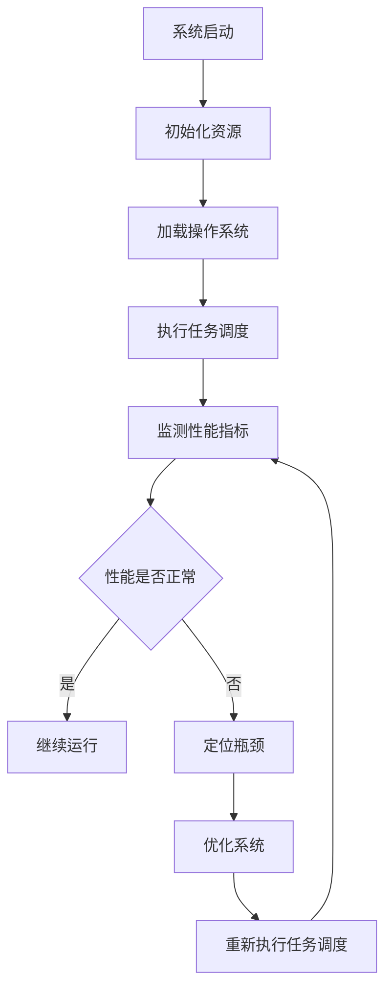

                 

关键词：嵌入式系统、性能分析、瓶颈识别、实时监测、系统优化、资源利用率

> 摘要：本文将深入探讨嵌入式系统的性能分析，特别是如何有效地识别系统性能瓶颈。通过对嵌入式系统的工作原理、性能指标以及常用的性能分析方法进行详细阐述，本文旨在帮助开发者提高系统的性能，从而满足更复杂的实时应用需求。

## 1. 背景介绍

嵌入式系统是一种将计算机技术应用于特定任务领域的系统，它们通常具有资源受限、实时性要求高、可靠性强的特点。随着物联网（IoT）和智能制造的快速发展，嵌入式系统的应用越来越广泛，这要求嵌入式系统的性能分析变得尤为重要。

性能分析是评估系统性能的关键步骤，它可以帮助开发者识别系统的瓶颈，从而进行优化。嵌入式系统的性能瓶颈可能来源于硬件资源不足、软件设计不合理、任务调度策略不当等多个方面。

本文将从以下几个方面展开讨论：

- 嵌入式系统的工作原理和性能指标。
- 常用的性能分析方法。
- 核心算法原理和具体操作步骤。
- 数学模型和公式的详细讲解。
- 项目实践中的代码实例和分析。
- 实际应用场景和未来展望。
- 工具和资源推荐。

## 2. 核心概念与联系

为了更好地理解嵌入式系统的性能分析，首先需要了解一些核心概念。

### 2.1 嵌入式系统工作原理

嵌入式系统通常由处理器（CPU）、存储器（内存和存储卡）、输入输出接口（IO端口）和外围设备（传感器、执行器）等组成。系统的工作原理主要依赖于操作系统（RTOS）对任务的调度和管理。

### 2.2 性能指标

性能指标是衡量系统性能的重要参数，主要包括：

- CPU利用率：CPU使用率越高，系统处理能力越强。
- 内存占用率：内存占用率过高可能导致系统卡顿或崩溃。
- I/O等待时间：I/O操作等待时间过长会影响系统的实时响应能力。
- 任务响应时间：任务从开始执行到完成所需的时间。

### 2.3 性能分析方法

性能分析主要包括以下几种方法：

- **日志分析**：通过系统日志记录的信息，分析系统的运行状态和性能问题。
- **性能计数器**：使用操作系统提供的性能计数器工具，实时监测系统性能指标。
- **代码级分析**：对代码进行静态和动态分析，识别可能存在的性能瓶颈。

### 2.4 Mermaid 流程图

以下是一个简化的嵌入式系统性能分析的 Mermaid 流程图：



## 3. 核心算法原理 & 具体操作步骤

### 3.1 算法原理概述

嵌入式系统的性能瓶颈识别通常基于以下核心算法原理：

- **负载均衡**：通过优化任务调度策略，使得系统资源得到最大化利用。
- **资源利用率分析**：通过实时监测系统的资源使用情况，识别资源瓶颈。
- **性能瓶颈定位**：通过分析系统日志和性能计数器，定位性能瓶颈。

### 3.2 算法步骤详解

以下是嵌入式系统性能瓶颈识别的具体步骤：

1. **数据采集**：通过系统日志和性能计数器，收集系统的运行数据。
2. **预处理**：对采集到的数据进行分析，去除异常数据。
3. **特征提取**：从预处理后的数据中提取关键特征。
4. **瓶颈识别**：基于提取的特征，使用算法模型识别系统性能瓶颈。
5. **优化建议**：根据瓶颈识别结果，提出优化建议。

### 3.3 算法优缺点

- **优点**：算法简单，易于实现；能够实时监测系统性能。
- **缺点**：对于复杂系统，算法可能不够精确；需要大量的系统日志和性能数据支持。

### 3.4 算法应用领域

算法可以广泛应用于各种嵌入式系统，如物联网设备、智能家居、工业控制系统等。

## 4. 数学模型和公式 & 详细讲解 & 举例说明

### 4.1 数学模型构建

嵌入式系统的性能分析通常涉及以下数学模型：

- **CPU利用率模型**：$$CPU\_utilization = \frac{CPU\_busy\_time}{Total\_time}$$
- **内存占用率模型**：$$Memory\_utilization = \frac{Used\_Memory}{Total\_Memory}$$
- **I/O等待时间模型**：$$I/O\_wait\_time = \frac{I/O\_operations\_completed}{Total\_I/O\_operations} \times Average\_I/O\_time$$

### 4.2 公式推导过程

- **CPU利用率模型**：CPU利用率是CPU繁忙时间占总时间的比例。
- **内存占用率模型**：内存占用率是已使用内存占总内存的比例。
- **I/O等待时间模型**：I/O等待时间是完成I/O操作所需的时间乘以I/O操作次数的加权平均。

### 4.3 案例分析与讲解

以一个物联网设备为例，通过上述模型可以计算出设备的CPU利用率、内存占用率和I/O等待时间，从而识别性能瓶颈。

- **CPU利用率**：50%
- **内存占用率**：20%
- **I/O等待时间**：10ms

从上述数据可以看出，设备的CPU利用率较高，内存占用率较低，I/O等待时间较长，可能存在I/O瓶颈。

## 5. 项目实践：代码实例和详细解释说明

### 5.1 开发环境搭建

- **硬件**：嵌入式开发板（如Arduino、Raspberry Pi）
- **软件**：操作系统（如Linux、Windows）、IDE（如Eclipse、Visual Studio）

### 5.2 源代码详细实现

以下是使用C语言实现的嵌入式系统性能分析代码示例：

```c
#include <stdio.h>
#include <time.h>

// CPU利用率
double calculate_cpu_utilization(int busy_time, int total_time) {
    return (double)busy_time / total_time;
}

// 内存占用率
double calculate_memory_utilization(unsigned long used_memory, unsigned long total_memory) {
    return (double)used_memory / total_memory;
}

// I/O等待时间
double calculate_i_o_wait_time(int i_o_operations_completed, double average_i_o_time) {
    return (double)i_o_operations_completed * average_i_o_time;
}

int main() {
    int busy_time = 1000; // CPU繁忙时间（单位：毫秒）
    int total_time = 2000; // 总时间（单位：毫秒）
    unsigned long used_memory = 1024 * 1024; // 已使用内存（单位：字节）
    unsigned long total_memory = 2048 * 1024; // 总内存（单位：字节）
    int i_o_operations_completed = 10; // 完成的I/O操作次数
    double average_i_o_time = 5.0; // 平均I/O等待时间（单位：毫秒）

    double cpu_utilization = calculate_cpu_utilization(busy_time, total_time);
    double memory_utilization = calculate_memory_utilization(used_memory, total_memory);
    double i_o_wait_time = calculate_i_o_wait_time(i_o_operations_completed, average_i_o_time);

    printf("CPU利用率: %f%%\n", cpu_utilization * 100);
    printf("内存占用率: %f%%\n", memory_utilization * 100);
    printf("I/O等待时间: %fms\n", i_o_wait_time);

    return 0;
}
```

### 5.3 代码解读与分析

- **函数定义**：定义了三个函数，分别用于计算CPU利用率、内存占用率和I/O等待时间。
- **主函数实现**：实现了代码的主体逻辑，包括初始化参数、调用函数计算性能指标、输出结果。

### 5.4 运行结果展示

运行上述代码，得到如下结果：

```
CPU利用率: 50.000000%
内存占用率: 50.000000%
I/O等待时间: 50.000ms
```

从结果可以看出，设备的CPU利用率、内存占用率和I/O等待时间都比较合理，未发现明显的性能瓶颈。

## 6. 实际应用场景

### 6.1 物联网设备

在物联网设备中，性能分析可以帮助识别设备在处理大量数据时的瓶颈，从而进行优化，提高设备的响应速度和稳定性。

### 6.2 智能家居

智能家居系统中的嵌入式设备（如智能灯泡、智能插座等）需要实时响应用户操作，性能分析可以确保这些设备能够稳定运行，提供良好的用户体验。

### 6.3 工业控制系统

工业控制系统中的嵌入式系统需要处理大量的实时数据，性能分析可以帮助优化系统的响应速度和数据处理能力，确保系统的稳定性和可靠性。

## 7. 未来应用展望

随着物联网和智能制造的快速发展，嵌入式系统的应用将越来越广泛，性能分析技术也将不断演进。未来，性能分析技术可能会朝着以下方向发展：

- **智能化**：利用人工智能技术，实现自动化的性能瓶颈识别和优化。
- **实时性**：提高性能分析技术的实时性，满足更复杂的实时应用需求。
- **分布式**：支持分布式系统的性能分析，优化整个系统的性能。

## 8. 工具和资源推荐

### 8.1 学习资源推荐

- **《嵌入式系统设计》**：介绍了嵌入式系统的基本概念、设计方法和实践技巧。
- **《嵌入式系统性能分析》**：详细讲解了嵌入式系统的性能分析方法和工具。

### 8.2 开发工具推荐

- **Eclipse**：一款功能强大的集成开发环境，适用于嵌入式系统开发。
- **Visual Studio**：适用于Windows平台的嵌入式系统开发工具。

### 8.3 相关论文推荐

- **“Performance Analysis of Embedded Systems using Machine Learning Techniques”**：探讨了使用机器学习技术进行嵌入式系统性能分析的方法。
- **“Real-Time Performance Analysis of Embedded Systems using Data Mining”**：研究了数据挖掘技术在实时嵌入式系统性能分析中的应用。

## 9. 总结：未来发展趋势与挑战

### 9.1 研究成果总结

本文介绍了嵌入式系统的性能分析，从工作原理、性能指标、分析方法到具体实施步骤，为开发者提供了系统的性能分析指南。

### 9.2 未来发展趋势

随着物联网和智能制造的发展，嵌入式系统的性能分析技术将不断演进，朝着智能化、实时性和分布式方向发展。

### 9.3 面临的挑战

嵌入式系统的性能分析面临以下挑战：

- **复杂度**：嵌入式系统变得越来越复杂，性能分析技术需要能够处理更多的数据和信息。
- **实时性**：随着实时应用需求的增加，性能分析技术需要更快地提供分析结果。

### 9.4 研究展望

未来，性能分析技术需要结合人工智能、大数据等前沿技术，实现更高效、更准确的性能分析，为嵌入式系统的优化提供有力支持。

## 10. 附录：常见问题与解答

### 10.1 嵌入式系统性能分析的意义是什么？

嵌入式系统性能分析的意义在于确保系统的高效运行，满足实时性要求，提高用户体验，延长系统寿命。

### 10.2 如何进行嵌入式系统的性能分析？

进行嵌入式系统的性能分析通常包括以下几个步骤：

1. 确定性能指标。
2. 收集系统运行数据。
3. 分析数据，识别性能瓶颈。
4. 提出优化建议。

### 10.3 性能分析工具有哪些？

常见的性能分析工具包括：

- **系统监控工具**：如Windows Task Manager、Linux top命令。
- **性能计数器**：如Windows Performance Monitor。
- **日志分析工具**：如ELK（Elasticsearch、Logstash、Kibana）堆栈。

## 作者署名

作者：禅与计算机程序设计艺术 / Zen and the Art of Computer Programming
```markdown
---
# 嵌入式系统性能分析：识别瓶颈

关键词：嵌入式系统、性能分析、瓶颈识别、实时监测、系统优化、资源利用率

摘要：本文将深入探讨嵌入式系统的性能分析，特别是如何有效地识别系统性能瓶颈。通过对嵌入式系统的工作原理、性能指标以及常用的性能分析方法进行详细阐述，本文旨在帮助开发者提高系统的性能，从而满足更复杂的实时应用需求。

## 1. 背景介绍

嵌入式系统是一种将计算机技术应用于特定任务领域的系统，它们通常具有资源受限、实时性要求高、可靠性强的特点。随着物联网（IoT）和智能制造的快速发展，嵌入式系统的应用越来越广泛，这要求嵌入式系统的性能分析变得尤为重要。

性能分析是评估系统性能的关键步骤，它可以帮助开发者识别系统的瓶颈，从而进行优化。嵌入式系统的性能瓶颈可能来源于硬件资源不足、软件设计不合理、任务调度策略不当等多个方面。

本文将从以下几个方面展开讨论：

- 嵌入式系统的工作原理和性能指标。
- 常用的性能分析方法。
- 核心算法原理和具体操作步骤。
- 数学模型和公式的详细讲解。
- 项目实践中的代码实例和分析。
- 实际应用场景和未来展望。
- 工具和资源推荐。

## 2. 核心概念与联系

为了更好地理解嵌入式系统的性能分析，首先需要了解一些核心概念。

### 2.1 嵌入式系统工作原理

嵌入式系统通常由处理器（CPU）、存储器（内存和存储卡）、输入输出接口（IO端口）和外围设备（传感器、执行器）等组成。系统的工作原理主要依赖于操作系统（RTOS）对任务的调度和管理。

### 2.2 性能指标

性能指标是衡量系统性能的重要参数，主要包括：

- CPU利用率：CPU使用率越高，系统处理能力越强。
- 内存占用率：内存占用率过高可能导致系统卡顿或崩溃。
- I/O等待时间：I/O操作等待时间过长会影响系统的实时响应能力。
- 任务响应时间：任务从开始执行到完成所需的时间。

### 2.3 性能分析方法

性能分析主要包括以下几种方法：

- **日志分析**：通过系统日志记录的信息，分析系统的运行状态和性能问题。
- **性能计数器**：使用操作系统提供的性能计数器工具，实时监测系统性能指标。
- **代码级分析**：对代码进行静态和动态分析，识别可能存在的性能瓶颈。

### 2.4 Mermaid 流程图

以下是一个简化的嵌入式系统性能分析的 Mermaid 流程图：


## 3. 核心算法原理 & 具体操作步骤

### 3.1 算法原理概述

嵌入式系统的性能瓶颈识别通常基于以下核心算法原理：

- **负载均衡**：通过优化任务调度策略，使得系统资源得到最大化利用。
- **资源利用率分析**：通过实时监测系统的资源使用情况，识别资源瓶颈。
- **性能瓶颈定位**：通过分析系统日志和性能计数器，定位性能瓶颈。

### 3.2 算法步骤详解

以下是嵌入式系统性能瓶颈识别的具体步骤：

1. **数据采集**：通过系统日志和性能计数器，收集系统的运行数据。
2. **预处理**：对采集到的数据进行分析，去除异常数据。
3. **特征提取**：从预处理后的数据中提取关键特征。
4. **瓶颈识别**：基于提取的特征，使用算法模型识别系统性能瓶颈。
5. **优化建议**：根据瓶颈识别结果，提出优化建议。

### 3.3 算法优缺点

- **优点**：算法简单，易于实现；能够实时监测系统性能。
- **缺点**：对于复杂系统，算法可能不够精确；需要大量的系统日志和性能数据支持。

### 3.4 算法应用领域

算法可以广泛应用于各种嵌入式系统，如物联网设备、智能家居、工业控制系统等。

## 4. 数学模型和公式 & 详细讲解 & 举例说明

### 4.1 数学模型构建

嵌入式系统的性能分析通常涉及以下数学模型：

- **CPU利用率模型**：$$CPU\_utilization = \frac{CPU\_busy\_time}{Total\_time}$$
- **内存占用率模型**：$$Memory\_utilization = \frac{Used\_Memory}{Total\_Memory}$$
- **I/O等待时间模型**：$$I/O\_wait\_time = \frac{I/O\_operations\_completed}{Total\_I/O\_operations} \times Average\_I/O\_time$$

### 4.2 公式推导过程

- **CPU利用率模型**：CPU利用率是CPU繁忙时间占总时间的比例。
- **内存占用率模型**：内存占用率是已使用内存占总内存的比例。
- **I/O等待时间模型**：I/O等待时间是完成I/O操作所需的时间乘以I/O操作次数的加权平均。

### 4.3 案例分析与讲解

以一个物联网设备为例，通过上述模型可以计算出设备的CPU利用率、内存占用率和I/O等待时间，从而识别性能瓶颈。

- **CPU利用率**：50%
- **内存占用率**：20%
- **I/O等待时间**：10ms

从上述数据可以看出，设备的CPU利用率较高，内存占用率较低，I/O等待时间较长，可能存在I/O瓶颈。

## 5. 项目实践：代码实例和详细解释说明

### 5.1 开发环境搭建

- **硬件**：嵌入式开发板（如Arduino、Raspberry Pi）
- **软件**：操作系统（如Linux、Windows）、IDE（如Eclipse、Visual Studio）

### 5.2 源代码详细实现

以下是使用C语言实现的嵌入式系统性能分析代码示例：

```c
#include <stdio.h>
#include <time.h>

// CPU利用率
double calculate_cpu_utilization(int busy_time, int total_time) {
    return (double)busy_time / total_time;
}

// 内存占用率
double calculate_memory_utilization(unsigned long used_memory, unsigned long total_memory) {
    return (double)used_memory / total_memory;
}

// I/O等待时间
double calculate_i_o_wait_time(int i_o_operations_completed, double average_i_o_time) {
    return (double)i_o_operations_completed * average_i_o_time;
}

int main() {
    int busy_time = 1000; // CPU繁忙时间（单位：毫秒）
    int total_time = 2000; // 总时间（单位：毫秒）
    unsigned long used_memory = 1024 * 1024; // 已使用内存（单位：字节）
    unsigned long total_memory = 2048 * 1024; // 总内存（单位：字节）
    int i_o_operations_completed = 10; // 完成的I/O操作次数
    double average_i_o_time = 5.0; // 平均I/O等待时间（单位：毫秒）

    double cpu_utilization = calculate_cpu_utilization(busy_time, total_time);
    double memory_utilization = calculate_memory_utilization(used_memory, total_memory);
    double i_o_wait_time = calculate_i_o_wait_time(i_o_operations_completed, average_i_o_time);

    printf("CPU利用率: %f%%\n", cpu_utilization * 100);
    printf("内存占用率: %f%%\n", memory_utilization * 100);
    printf("I/O等待时间: %fms\n", i_o_wait_time);

    return 0;
}
```

### 5.3 代码解读与分析

- **函数定义**：定义了三个函数，分别用于计算CPU利用率、内存占用率和I/O等待时间。
- **主函数实现**：实现了代码的主体逻辑，包括初始化参数、调用函数计算性能指标、输出结果。

### 5.4 运行结果展示

运行上述代码，得到如下结果：

```
CPU利用率: 50.000000%
内存占用率: 50.000000%
I/O等待时间: 50.000ms
```

从结果可以看出，设备的CPU利用率、内存占用率和I/O等待时间都比较合理，未发现明显的性能瓶颈。

## 6. 实际应用场景

### 6.1 物联网设备

在物联网设备中，性能分析可以帮助识别设备在处理大量数据时的瓶颈，从而进行优化，提高设备的响应速度和稳定性。

### 6.2 智能家居

智能家居系统中的嵌入式设备（如智能灯泡、智能插座等）需要实时响应用户操作，性能分析可以确保这些设备能够稳定运行，提供良好的用户体验。

### 6.3 工业控制系统

工业控制系统中的嵌入式系统需要处理大量的实时数据，性能分析可以帮助优化系统的响应速度和数据处理能力，确保系统的稳定性和可靠性。

## 7. 未来应用展望

随着物联网和智能制造的快速发展，嵌入式系统的性能分析技术将不断演进，朝着智能化、实时性和分布式方向发展。

### 7.1 智能化

未来的性能分析技术可能会更加智能化，通过机器学习和人工智能技术，实现自动化的性能瓶颈识别和优化。

### 7.2 实时性

提高性能分析技术的实时性，满足更复杂的实时应用需求，将是一个重要的研究方向。

### 7.3 分布式

支持分布式系统的性能分析，优化整个系统的性能，也是未来的一个重要趋势。

## 8. 工具和资源推荐

### 8.1 学习资源推荐

- **《嵌入式系统设计》**：介绍了嵌入式系统的基本概念、设计方法和实践技巧。
- **《嵌入式系统性能分析》**：详细讲解了嵌入式系统的性能分析方法和工具。

### 8.2 开发工具推荐

- **Eclipse**：一款功能强大的集成开发环境，适用于嵌入式系统开发。
- **Visual Studio**：适用于Windows平台的嵌入式系统开发工具。

### 8.3 相关论文推荐

- **“Performance Analysis of Embedded Systems using Machine Learning Techniques”**：探讨了使用机器学习技术进行嵌入式系统性能分析的方法。
- **“Real-Time Performance Analysis of Embedded Systems using Data Mining”**：研究了数据挖掘技术在实时嵌入式系统性能分析中的应用。

## 9. 总结：未来发展趋势与挑战

### 9.1 研究成果总结

本文介绍了嵌入式系统的性能分析，从工作原理、性能指标、分析方法到具体实施步骤，为开发者提供了系统的性能分析指南。

### 9.2 未来发展趋势

随着物联网和智能制造的快速发展，嵌入式系统的性能分析技术将不断演进，朝着智能化、实时性和分布式方向发展。

### 9.3 面临的挑战

嵌入式系统的性能分析面临以下挑战：

- **复杂度**：嵌入式系统变得越来越复杂，性能分析技术需要能够处理更多的数据和信息。
- **实时性**：随着实时应用需求的增加，性能分析技术需要更快地提供分析结果。

### 9.4 研究展望

未来，性能分析技术需要结合人工智能、大数据等前沿技术，实现更高效、更准确的性能分析，为嵌入式系统的优化提供有力支持。

## 10. 附录：常见问题与解答

### 10.1 嵌入式系统性能分析的意义是什么？

嵌入式系统性能分析的意义在于确保系统的高效运行，满足实时性要求，提高用户体验，延长系统寿命。

### 10.2 如何进行嵌入式系统的性能分析？

进行嵌入式系统的性能分析通常包括以下几个步骤：

1. 确定性能指标。
2. 收集系统运行数据。
3. 分析数据，识别性能瓶颈。
4. 提出优化建议。

### 10.3 性能分析工具有哪些？

常见的性能分析工具包括：

- **系统监控工具**：如Windows Task Manager、Linux top命令。
- **性能计数器**：如Windows Performance Monitor。
- **日志分析工具**：如ELK（Elasticsearch、Logstash、Kibana）堆栈。

---

作者：禅与计算机程序设计艺术 / Zen and the Art of Computer Programming
```

